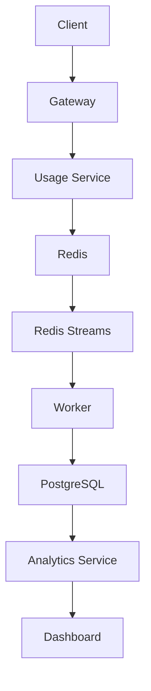
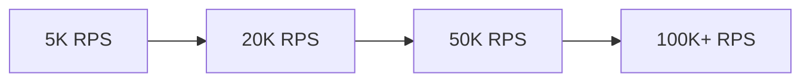

# High-Throughput Telemetry, Billing & Analytics Platform

Production-grade, event-driven telemetry platform designed to demonstrate senior backend engineering capability in technical interviews.


This repository presents a realistic, production-oriented SaaS backend architecture for telemetry ingestion, usage metering, billing workflows, and analytics delivery at scale. It is intentionally structured to showcase the engineering decisions expected from a senior backend candidate: event-driven service boundaries, strict TypeScript contracts, observability-first design, CI quality gates, and infrastructure-ready local development.

## Project Overview

Modern SaaS platforms must ingest high-volume product events, convert that stream into accurate usage and billing data, and expose near-real-time analytics without compromising reliability. At scale, straightforward request-to-database patterns break down: synchronous writes create hot tables, lock contention, latency spikes, and tight coupling between ingestion, metering, and downstream computation.

This is why asynchronous event processing is essential. By decoupling producers from consumers through event-driven workflows, systems can absorb burst traffic, retry safely, preserve durability, and process workloads independently across billing, analytics, and operational services.

This project exists to demonstrate that architecture in a production-style monorepo suitable for senior backend interviews. It highlights engineering challenges recruiters and senior engineers care about: service boundary design, eventual consistency, idempotent processing, schema and contract governance, observability and tracing, operational resilience, and maintainable delivery pipelines.

## Documentation

| Area | Link |
| --- | --- |
| Architecture | [Architecture Overview](README.md#architecture-overview) |
| System Design | [System Design](README.md#architecture-overview) |
| Database | [Database](README.md#architecture-overview) |
| API | [API Documentation](README.md#api-documentation) |
| Trade-offs | [Engineering Decisions](README.md#engineering-decisions) |
| ADR | [Engineering Decisions (ADR-style)](README.md#engineering-decisions) |
| Deployment | [Quick Start](README.md#quick-start) |
| Monitoring | [Monitoring](README.md#monitoring) |
| Security | [Security](README.md#security) |
| Testing | [Testing](README.md#testing) |

## Features

### Authentication

| Icon | Capability | Engineering Value |
| --- | --- | --- |
| 🔐 | JWT access and refresh token rotation | Limits replay risk while preserving stateless API scaling |
| 🧾 | Tenant-aware RBAC policy enforcement | Isolates customer data and actions by workspace boundary |
| 🚪 | Session revocation via Redis-backed token denylist | Enables immediate logout and incident response |

### API Management

| Icon | Capability | Engineering Value |
| --- | --- | --- |
| 🚦 | Centralized Fastify gateway with request routing | Decouples client integrations from internal service topology |
| 🧰 | Schema-first request validation with Zod | Prevents malformed payloads from propagating downstream |
| ⏱️ | Gateway-level rate limiting and burst control | Protects ingestion path under traffic spikes |

### Usage Tracking

| Icon | Capability | Engineering Value |
| --- | --- | --- |
| 📥 | High-throughput event ingestion pipeline | Absorbs product telemetry at sustained volume |
| ♻️ | Idempotent event handling with dedupe keys | Prevents double counting across retries and replays |
| 🧮 | Deterministic usage aggregation windows | Produces auditable, billing-safe usage totals |

### Billing

| Icon | Capability | Engineering Value |
| --- | --- | --- |
| 💳 | Meter-based rating engine boundaries | Maps raw usage to billable units consistently |
| 🧷 | Immutable usage ledger model | Supports reconciliation and financial traceability |
| 🧾 | Invoice orchestration workflow hooks | Enables automated statement generation from metered data |

### Analytics

| Icon | Capability | Engineering Value |
| --- | --- | --- |
| 📊 | Near-real-time rollups for product metrics | Delivers low-latency operational visibility |
| 🧠 | Time-series query surfaces for tenant metrics | Supports trend, cohort, and retention analysis |
| 🗂️ | Pre-aggregated datasets for dashboard APIs | Reduces expensive on-demand analytical queries |

### Dashboard

| Icon | Capability | Engineering Value |
| --- | --- | --- |
| 🖥️ | React + TanStack Query data client | Provides resilient caching and background revalidation |
| 📈 | Interactive Recharts visualizations | Communicates usage and billing signals clearly |
| 🧭 | Route-level feature segmentation | Keeps product modules isolated and maintainable |

### CSV Export

| Icon | Capability | Engineering Value |
| --- | --- | --- |
| 📤 | Streamed export pipeline for large datasets | Avoids memory blowups during report generation |
| 🧱 | Column-level schema mapping and normalization | Guarantees predictable output for finance workflows |
| ✅ | Export audit metadata (who/when/filters) | Improves compliance and traceability |

### Observability

| Icon | Capability | Engineering Value |
| --- | --- | --- |
| 🔭 | OpenTelemetry tracing across service boundaries | Enables end-to-end request and job diagnostics |
| 🪵 | Structured Pino logging with correlation IDs | Improves incident triage and root-cause analysis |
| 📡 | Prometheus metrics + Grafana dashboards | Exposes runtime health, latency, and throughput baselines |

### Infrastructure

| Icon | Capability | Engineering Value |
| --- | --- | --- |
| 🧱 | Modular monorepo with Turborepo task graph | Accelerates builds and enforces repo-wide consistency |
| 🐳 | Dockerized local stack (Postgres, Redis, PgBouncer, Prometheus, Grafana) | Reproduces production-like dependencies locally |
| 🤖 | CI pipeline for lint, typecheck, tests, and build | Prevents regressions before merge |

### Security

| Icon | Capability | Engineering Value |
| --- | --- | --- |
| 🛡️ | Runtime environment validation with Zod | Fails fast on unsafe or incomplete configuration |
| 🔒 | Service-layer authorization boundaries | Prevents privilege leaks across internal APIs |
| 🧯 | Defensive middleware patterns (input limits, error normalization, telemetry-safe logging) | Reduces abuse surface and sensitive data exposure |

## Architecture Overview

This platform uses a modular, event-driven architecture to separate real-time ingestion from asynchronous processing, billing computation, and analytical read models. Each component exists to isolate responsibilities, improve fault tolerance, and support predictable scaling.

### Architecture Diagram

> Reserved for system architecture diagram.

### Core Services

| Component | Why It Exists |
| --- | --- |
| Gateway | Provides a single entry point for clients, centralizes API concerns, and shields internal service boundaries from external consumers. |
| Authentication Service | Handles identity and access control so authorization policy remains consistent across all platform modules. |
| Usage Service | Owns telemetry ingestion and usage-domain boundaries so product events can be normalized into billable usage signals. |
| Worker Service | Runs background and long-running workloads outside the request path to keep interactive APIs responsive. |
| Billing Service | Converts validated usage into financial outcomes, maintaining clear accountability for metering and invoice workflows. |
| Analytics Service | Serves aggregated and query-ready telemetry views so dashboards and reporting do not overload transactional paths. |
| Frontend | Delivers an operator-facing control plane for usage visibility, billing insight, and platform operations. |

### Messaging and Queueing

| Component | Why It Exists |
| --- | --- |
| Redis | Provides low-latency state and coordination primitives used by distributed services. |
| Redis Streams | Enables ordered, durable event transport between producers and consumers in an event-driven workflow. |
| BullMQ | Orchestrates background job execution, retries, and workload scheduling for asynchronous processing. |

### Data and Connection Layer

| Component | Why It Exists |
| --- | --- |
| PostgreSQL | Serves as the system of record for durable transactional and domain data. |
| PgBouncer | Protects database capacity by pooling and managing high volumes of short-lived service connections. |

## Request Lifecycle

### End-to-End Flow



### Step-by-Step Lifecycle

1. Client
The client emits product telemetry and usage events from the application runtime. This is the source of truth for behavioral signals that later drive billing and analytics.

2. Gateway
The gateway accepts inbound requests, applies platform-wide API policies, and forwards validated traffic to the correct internal domain boundary.

3. Usage Service
The usage service receives normalized telemetry payloads, applies usage-domain rules, and prepares events for asynchronous downstream processing.

4. Redis
Redis acts as the low-latency buffer and coordination layer, enabling rapid handoff out of the synchronous request path.

5. Redis Streams
Redis Streams provides durable, ordered event transport so producers and consumers remain decoupled while preserving event flow guarantees.

6. Worker
Workers consume stream events asynchronously, execute background processing, and transform raw usage signals into durable domain records.

7. PostgreSQL
Processed records are persisted in PostgreSQL as durable system-of-record data for usage, billing inputs, and historical consistency.

8. Analytics
The analytics layer reads persisted data and builds query-ready, aggregate-oriented views for operational and business reporting.

9. Dashboard
The dashboard queries analytics endpoints and renders near-real-time usage, billing, and performance insights for end users and operators.

## Screenshots

### Dashboard


### Billing


### Analytics


### Swagger


### Grafana


### Architecture Diagram


## Tech Stack

### Frontend

| Technology | Why It Was Chosen |
| --- | --- |
| React + TypeScript | Provides a mature component model with strong type safety for long-term maintainability. |
| Vite | Delivers fast local feedback loops and efficient production bundling. |
| TanStack Query | Standardizes server-state caching, retries, and background revalidation in data-heavy views. |
| Tailwind CSS + shadcn/ui | Enables consistent, scalable UI composition without heavy design-system overhead. |
| React Router | Supports clear feature-level navigation boundaries in a modular dashboard. |
| Recharts | Offers practical, composable charting for usage and billing visualizations. |

### Backend

| Technology | Why It Was Chosen |
| --- | --- |
| Node.js 22 | Provides a stable, high-performance JavaScript runtime suitable for I/O-heavy services. |
| Fastify | Prioritizes low-overhead request handling and strong plugin architecture for microservices. |
| TypeScript | Enforces contracts across services and shared packages, reducing integration defects. |
| Zod | Adds explicit runtime validation at service boundaries to protect system integrity. |

### Database

| Technology | Why It Was Chosen |
| --- | --- |
| PostgreSQL | Provides ACID guarantees, relational modeling strength, and broad production reliability. |
| Prisma | Accelerates schema-driven data access while preserving strong typing across the codebase. |
| PgBouncer | Improves connection efficiency under bursty, multi-service workloads. |

### Cache

| Technology | Why It Was Chosen |
| --- | --- |
| Redis | Provides low-latency caching and coordination primitives for distributed services. |

### Messaging

| Technology | Why It Was Chosen |
| --- | --- |
| Redis Streams | Enables durable, ordered event flow between producers and consumers. |
| BullMQ | Provides robust background job orchestration with retries and scheduling semantics. |

### Payments

| Technology | Why It Was Chosen |
| --- | --- |
| Stripe | Industry-standard payment platform with mature APIs, webhooks, and billing ecosystem support. |

### Monitoring

| Technology | Why It Was Chosen |
| --- | --- |
| OpenTelemetry | Establishes vendor-neutral tracing and observability instrumentation across services. |
| Prometheus | Provides reliable metrics collection for platform health and performance signals. |
| Grafana | Delivers operational dashboards and alert-friendly visualization of service behavior. |
| Pino | Enables high-throughput structured logging for production diagnostics. |

### Testing

| Technology | Why It Was Chosen |
| --- | --- |
| Vitest | Fast test execution with TypeScript-friendly ergonomics for service and package tests. |

### Infrastructure

| Technology | Why It Was Chosen |
| --- | --- |
| Docker Compose | Reproduces multi-service local infrastructure with production-like dependencies. |
| Turborepo | Coordinates monorepo task execution and incremental builds at scale. |
| pnpm Workspaces | Optimizes dependency management and workspace linking across apps and packages. |
| GitHub Actions | Automates CI quality gates for lint, typecheck, test, and build. |

## System Scale

| Dimension | Target | Why This Number Was Selected |
| --- | --- | --- |
| Organizations | 1,000 active organizations | Large enough to represent multi-tenant isolation challenges while remaining realistic for a mid-stage B2B SaaS profile. |
| Peak Requests/sec | 5,000 RPS at gateway ingress | High enough to require rate control, queue decoupling, and horizontal service scaling decisions. |
| Daily Events | 100 million telemetry events/day | Forces event-driven architecture choices for ingestion durability, aggregation, and downstream processing separation. |
| Latency Targets | p95 read APIs < 200 ms, p95 ingestion ACK < 150 ms | Reflects production-grade user expectations for responsive dashboards and low-friction event submission. |
| Availability | 99.9% monthly service availability | Represents a credible SaaS reliability objective that drives failure isolation and operational readiness. |
| Billing Accuracy | >= 99.99% metering-to-invoice accuracy | Establishes financial-grade correctness requirements appropriate for usage-based pricing systems. |
| Dashboard Freshness | <= 60 seconds from event ingestion to dashboard visibility | Balances near-real-time product insight with practical asynchronous processing and aggregation windows. |

These targets are intentionally chosen to mirror senior-level backend interview scenarios: they are high enough to expose real distributed-systems tradeoffs, but still grounded in realistic SaaS operating envelopes.

## Repository Folder Structure

```text
telemetry-platform/
├── apps/
├── packages/
├── docker/
│   ├── grafana/
│   └── prometheus/
├── docs/
├── scripts/
├── .github/
├── k6/
└── postman/
```

| Directory | Responsibility |
| --- | --- |
| `apps` | Contains deployable application units: gateway, domain services, and web frontend. This is where runtime service boundaries are defined. |
| `packages` | Holds shared internal libraries (types, config, validation, logging, tracing, utilities) reused across apps to enforce consistency. |
| `docker` | Contains local infrastructure orchestration and container configuration for production-like development environments. |
| `docs` | Centralized technical documentation: architecture context, standards, and contributor-facing guidance. |
| `scripts` | Repository automation entry points for setup, maintenance, and repeatable developer workflows. |
| `.github` | GitHub-native project automation and CI workflows, including quality gates and branch-level checks. |
| `k6` | Performance and load testing assets used to validate throughput, latency, and system behavior under stress. |
| `postman` | API workspace collections/environments for manual validation, contract exploration, and integration testing flows. |
| `grafana` | Dashboard and observability visualization assets used to monitor platform health, latency, and business signals. |
| `prometheus` | Metrics scraping and monitoring configuration used to collect operational telemetry from services and infrastructure. |

`grafana` and `prometheus` are maintained under `docker/` in this repository because they are part of the local observability infrastructure stack.

## Quick Start

### Prerequisites

- Node.js 22+
- pnpm 10+
- Docker + Docker Compose
- Git

### Clone

```bash
git clone https://github.com/harshp21/telemetry-platform.git
cd telemetry-platform
```

### Install

```bash
corepack enable
corepack pnpm install
```

### Environment Variables

Create root and service-level environment files from committed examples:

```bash
cp .env.example .env
cp apps/gateway/.env.example apps/gateway/.env
cp apps/auth-service/.env.example apps/auth-service/.env
cp apps/usage-service/.env.example apps/usage-service/.env
cp apps/worker-service/.env.example apps/worker-service/.env
cp apps/billing-service/.env.example apps/billing-service/.env
cp apps/analytics-service/.env.example apps/analytics-service/.env
cp apps/web/.env.example apps/web/.env
```

### Docker

Start required local infrastructure (PostgreSQL, Redis, PgBouncer, Prometheus, Grafana):

```bash
docker compose -f docker/docker-compose.yml up -d
```

### Database

Generate Prisma client and apply migrations when present:

```bash
corepack pnpm --filter @telemetry/gateway exec prisma generate
corepack pnpm --filter @telemetry/gateway exec prisma migrate deploy
```

### Run Development

```bash
corepack pnpm dev
```

### Build

```bash
corepack pnpm build
```

### Test

```bash
corepack pnpm test
```

### Lint

```bash
corepack pnpm lint
```

## Environment Variables

### Shared Configuration

Shared environment settings define cross-service platform behavior such as runtime mode, core infrastructure endpoints, and observability defaults. These values establish consistent behavior across gateway, domain services, workers, and frontend tooling so local, CI, and containerized environments remain aligned.

### Service-Specific Configuration

Each service maintains its own `.env` contract for domain-specific needs such as port bindings, external integration toggles, and module-level operational thresholds. This separation prevents accidental coupling between services and makes ownership boundaries explicit.

### Secrets

Sensitive values (for example signing keys, payment credentials, and privileged connection strings) must never be committed to source control. Only non-sensitive templates belong in `.env.example`; real secrets should be injected through secure environment management in local development and CI/CD.

### Best Practices

1. Keep `.env.example` files up to date as the single source of configuration shape.
2. Validate configuration at process startup and fail fast on missing or invalid values.
3. Scope variables to the smallest service boundary possible.
4. Rotate secrets regularly and avoid sharing long-lived credentials between environments.
5. Use separate values for development, staging, and production to prevent cross-environment drift.

## API Documentation

### Where To Find API Docs

- Interactive service documentation is exposed through Swagger UI when API services are running locally.
- The machine-readable contract is published as OpenAPI and is the canonical source for endpoint behavior.
- Collection-based developer workflows live in `postman/` for request examples, environment presets, and regression checks.
- Supporting platform documentation is maintained in `docs/` for architecture and operational context.

### Swagger

Swagger provides a browsable interface for discovering endpoints, trying requests, and validating responses during development and QA. It is intended to be the fastest way for engineers to understand available API surfaces without reading service code.

### OpenAPI

OpenAPI defines the formal API contract: paths, request/response schemas, authentication requirements, and error models. It exists to keep backend and client teams aligned through a shared, versionable specification.

### Postman Collection

Postman collections provide practical, executable request flows for local validation and collaboration. They are used for endpoint walkthroughs, integration sanity checks, and handoff between frontend, backend, and QA workflows.

### Authentication

Authenticated endpoints require bearer-token based access. Authentication rules are documented per endpoint so consumers can clearly distinguish public, user-scoped, and privileged routes.

### Rate Limits

Rate limiting is documented as part of API usage policy to protect service stability under burst traffic. Limits are communicated as contract-level behavior so consumers can implement retries and backoff safely.

### Error Format

Error responses follow a consistent JSON envelope so clients can handle failures predictably across services. The format distinguishes validation issues, authorization failures, and operational errors with stable response semantics.

### Pagination

List endpoints use a consistent pagination contract to support efficient traversal of large datasets. Pagination behavior is documented with request parameters and response metadata so clients can build reliable data-fetching loops.

## Testing

### Testing Philosophy

This platform follows a layered testing strategy: validate business correctness early with fast unit tests, verify service boundaries with integration and contract tests, and protect production characteristics with load and end-to-end checks. The goal is not only code coverage, but confidence in correctness, compatibility, and operational behavior under realistic traffic.

### Unit Testing

Unit tests validate isolated domain logic such as usage normalization, billing calculations, validation rules, and utility behavior.

- Primary tool: `Vitest`
- Scope: pure functions, service logic boundaries, mapper/validator behavior
- Objective: fast feedback and deterministic correctness

### Integration Testing

Integration tests validate interactions between HTTP layers, middleware, persistence boundaries, and infrastructure dependencies.

- Primary tools: `Vitest` + `Supertest`
- Scope: API route behavior, request/response contracts, status/error semantics
- Objective: confirm modules collaborate correctly under realistic service wiring

### Contract Testing

Contract tests ensure API behavior remains compatible for consumers across service evolution.

- Primary tools: `Vitest` + `Supertest` (schema and response assertions)
- Scope: endpoint inputs/outputs, authentication expectations, pagination and error envelopes
- Objective: prevent breaking changes and preserve client integration stability

### Load Testing

Load tests evaluate system behavior under sustained and burst traffic to validate latency, throughput, and resilience targets.

- Primary tool: `k6`
- Scope: ingestion endpoints, high-volume read APIs, gateway pressure scenarios
- Objective: verify scale assumptions and expose bottlenecks before production

### End-to-End Testing

End-to-end tests validate critical user workflows from UI to backend APIs and data layers.

- Primary tool: `Playwright`
- Scope: dashboard navigation, auth-protected flows, usage-to-analytics visibility paths
- Objective: ensure end-user outcomes remain reliable across full-stack changes

## Monitoring

The platform uses a layered observability model so engineering teams can detect, diagnose, and respond to reliability and performance issues quickly.

### Prometheus

Prometheus is used for metrics collection and time-series storage across services and infrastructure components. It continuously scrapes service and system telemetry to provide quantitative signals for runtime health and capacity planning.

### Grafana

Grafana is used for dashboarding and operational visibility. It transforms raw metrics into service-level views for latency, error behavior, throughput trends, worker backlog movement, and infrastructure health.

### OpenTelemetry

OpenTelemetry provides standardized instrumentation for traces and contextual telemetry across gateway, services, and workers. It ensures observability remains vendor-neutral and consistent as the platform evolves.

### Structured Logging

Structured logging is used to emit machine-parsable operational events with stable fields such as service name, request correlation identifiers, and severity levels. This improves incident triage, log aggregation quality, and cross-service investigation speed.

### Health Checks

Health checks expose service readiness and liveness for runtime orchestration and failure detection. They support both local and deployed environments by clearly indicating whether a component can receive traffic and process work safely.

### Distributed Tracing

Distributed tracing links requests and asynchronous work across service boundaries so teams can visualize end-to-end flow, identify bottlenecks, and isolate failure propagation paths.

### Alerting

Alerting is driven by threshold and trend-based rules on critical system signals. Alerts are designed to surface actionable incidents such as sustained latency regressions, elevated error rates, queue lag growth, worker saturation, and infrastructure degradation.

### Metrics Collected

The monitoring stack collects metrics across application, queue, and infrastructure layers, including:

1. Request throughput (RPS)
2. Request latency distributions (p50/p95/p99)
3. HTTP status code/error rate ratios
4. Queue depth and consumer lag
5. Worker execution duration and failure/retry rates
6. Database connection utilization and query latency
7. Cache hit/miss patterns and Redis resource pressure
8. Service availability and health-check status
9. Host/container resource usage (CPU, memory, disk, network)

## Performance

Performance in this platform is treated as an architectural outcome, not a single optimization pass. The following decisions are designed to keep ingest paths responsive, analytical reads efficient, and background workloads predictable under sustained scale.

### Batch Processing

Background workloads are grouped into batches to reduce per-item overhead and improve throughput efficiency. Batching lowers scheduling pressure, improves write efficiency, and helps stabilize processing latency under burst traffic.

### Connection Pooling

Database access is mediated through pooling to prevent connection storms from many concurrent services and workers. Pooling improves database stability by smoothing connection churn and preserving capacity for productive queries.

### PgBouncer

PgBouncer is used as a dedicated pooling layer in front of PostgreSQL to handle high volumes of short-lived connections. This keeps the database focused on query execution rather than connection lifecycle overhead.

### Redis Cache

Redis cache is used to offload repeated hot reads and reduce direct pressure on transactional tables. This decision improves response time consistency for frequently accessed operational and dashboard data.

### Redis Streams

Redis Streams decouples ingestion from downstream processing so traffic spikes do not directly translate into synchronous API latency. It provides controlled backpressure handling and smoother workload consumption.

### Aggregate Tables

Aggregate-oriented tables are used to serve analytical queries efficiently without repeatedly scanning high-volume event data. This shifts expensive computation away from user-facing query time and supports predictable dashboard performance.

### Database Partitioning

Partitioning strategy is used to bound table growth impact and keep large datasets operationally manageable. It improves long-term query behavior, retention management, and maintenance operations at scale.

### Horizontal Scaling

Services are designed around stateless boundaries and asynchronous coordination so they can scale horizontally based on workload profile. This enables independent scaling of gateway, ingestion, worker, billing, and analytics components instead of forcing whole-system scaling.

## Security

Security is treated as a first-class architecture concern across identity, transport boundaries, data handling, and operational controls.

### JWT Authentication

JWT-based authentication is used for stateless, service-friendly access control. Token-based identity propagation allows the platform to enforce authentication consistently across gateway and downstream service boundaries while supporting horizontal scaling.

### API Keys

API keys are used for machine-to-machine and ingestion-oriented access patterns where user sessions are not appropriate. Keys are scoped and lifecycle-managed to preserve tenant isolation and support controlled revocation.

### RBAC

Role-based access control enforces authorization at capability level, not just endpoint level. This ensures users and service principals can only perform actions aligned to their role and tenant context.

### Rate Limiting

Rate limiting is applied as a protective control at ingress to reduce abuse risk, prevent noisy-neighbor impact, and maintain platform availability during bursts or hostile traffic patterns.

### Input Validation

Strict request validation is enforced at service boundaries to reject malformed or unsafe payloads early. This minimizes downstream error propagation and narrows attack surface from untrusted input.

### Secrets Management

Secrets are handled outside source control and injected per environment through secure configuration channels. The repository stores only non-sensitive templates, while production credentials are rotated and scoped by least privilege.

### OWASP Considerations

Security posture is aligned with core OWASP API and web application risk categories, including broken access control, injection risks, sensitive data exposure, excessive data exposure, and insufficient logging/monitoring. The architecture emphasizes layered controls so failures in one control do not create system-wide compromise.

### Security Headers

Security headers are applied at API/web boundaries to harden browser-facing surfaces against common client-side attack vectors. Header policy supports safer defaults for content handling, transport security, and framing behavior.

## Engineering Decisions

### Fastify

| Dimension | Detail |
| --- | --- |
| Problem | The platform needs low-latency API handling under high request concurrency without introducing framework overhead bottlenecks. |
| Decision | Use Fastify as the primary backend web framework across services. |
| Reason | Fastify provides strong performance characteristics, predictable plugin composition, and a clean fit for service-oriented boundaries. |
| Trade-offs | Smaller ecosystem compared to some legacy frameworks and stricter patterns that may require additional onboarding for teams unfamiliar with it. |

### Redis Streams

| Dimension | Detail |
| --- | --- |
| Problem | Synchronous service-to-service processing creates tight coupling and poor resilience during traffic spikes. |
| Decision | Use Redis Streams as the event transport backbone for asynchronous flow. |
| Reason | Streams provide durable, ordered event handling and decouple producers from consumers for smoother backpressure control. |
| Trade-offs | Adds operational complexity around stream retention, consumer lag management, and replay semantics. |

### BullMQ

| Dimension | Detail |
| --- | --- |
| Problem | Background workloads require reliable retries, scheduling, and queue lifecycle control outside request-response paths. |
| Decision | Use BullMQ for job orchestration on top of Redis. |
| Reason | BullMQ offers a mature queue abstraction for delayed jobs, retries, and worker-based execution models. |
| Trade-offs | Introduces an additional runtime abstraction that must be monitored for queue depth, retry storms, and stalled job behavior. |

### Aggregate Tables

| Dimension | Detail |
| --- | --- |
| Problem | Running analytical queries directly on raw high-volume event data degrades performance for both reads and writes. |
| Decision | Maintain aggregate-oriented tables for dashboard and reporting read paths. |
| Reason | Pre-aggregation reduces query cost and supports predictable low-latency analytical APIs. |
| Trade-offs | Increases data modeling complexity and introduces freshness windows between raw events and derived views. |

### PostgreSQL

| Dimension | Detail |
| --- | --- |
| Problem | Core billing and usage domains require durable, consistent, relationally constrained data storage. |
| Decision | Use PostgreSQL as the system-of-record database. |
| Reason | PostgreSQL provides transactional integrity, mature indexing/query capabilities, and strong operational reliability. |
| Trade-offs | Vertical scaling limits eventually appear for write-heavy workloads and may require partitioning plus operational tuning. |

### PgBouncer

| Dimension | Detail |
| --- | --- |
| Problem | Multi-service architectures can overwhelm PostgreSQL with excessive short-lived connections. |
| Decision | Place PgBouncer in front of PostgreSQL for connection pooling. |
| Reason | Pooling protects database resources and improves stability under concurrent service and worker traffic. |
| Trade-offs | Adds an extra infrastructure hop and requires careful alignment with transaction/session behavior. |

### Stripe

| Dimension | Detail |
| --- | --- |
| Problem | Building and securing a custom payment and subscription system is high-risk and time-intensive. |
| Decision | Use Stripe for payment processing and billing ecosystem integration. |
| Reason | Stripe offers battle-tested payment primitives, compliance-aligned workflows, and strong integration support for SaaS billing models. |
| Trade-offs | Vendor dependency and external API coupling can affect portability and long-term platform flexibility. |

### Monorepo

| Dimension | Detail |
| --- | --- |
| Problem | Multi-service development can drift in tooling, contracts, and release quality when repositories are fragmented. |
| Decision | Use a modular monorepo for apps and shared packages. |
| Reason | A monorepo enables shared standards, centralized CI, and contract reuse while preserving service boundaries. |
| Trade-offs | Requires disciplined workspace management to avoid oversized changesets and dependency graph complexity. |

### Single PostgreSQL Cluster

| Dimension | Detail |
| --- | --- |
| Problem | Early-stage distributed data topologies can add substantial operational overhead before scale justifies them. |
| Decision | Start with a single PostgreSQL cluster serving all core domains. |
| Reason | Centralizing on one cluster simplifies consistency, operations, backups, and schema governance in early platform evolution. |
| Trade-offs | Shared-cluster contention risk increases with scale and may require future domain-based data decomposition. |

## Future Scaling

This platform is intentionally designed to scale in stages. The current architecture is optimized for clarity and production realism at moderate scale, while leaving explicit upgrade paths for higher throughput. The goal is to evolve only when measurable pressure justifies additional complexity.



### 5K RPS (Current Baseline)

- Keep a single PostgreSQL cluster with PgBouncer.
- Use Redis + Redis Streams + workers for asynchronous processing.
- Scale stateless services horizontally where needed.

Why: This level is best served by operational simplicity, strong observability, and disciplined bottleneck analysis rather than premature platform fragmentation.

### 20K RPS (Throughput Expansion)

- Introduce read replicas for heavy analytical and dashboard read patterns.
- Move Redis to Redis Cluster when memory, throughput, or failover requirements exceed single-node limits.
- Expand worker concurrency and isolate high-volume queue lanes.

Why: The primary pressure is read amplification and cache/queue capacity, not yet full data-platform replacement.

### 50K RPS (Data Platform Split)

- Introduce Kafka for high-volume, durable event streaming and stronger consumer decoupling.
- Introduce ClickHouse for large-scale analytical workloads and time-series style query efficiency.
- Begin domain-based data ownership planning for database-per-service boundaries where autonomy and blast-radius reduction are needed.

Why: At this stage, event volume and analytical query intensity justify specialized streaming and analytical storage systems.

### 100K+ RPS (Global Scale)

- Move from shared transactional topology toward database-per-service for high-churn domains.
- Apply sharding strategies to spread write-heavy data across partitions where vertical scaling plateaus.
- Expand to multi-region architecture for latency locality, resilience, and regional fault isolation.

Why: Ultra-high throughput and global traffic distribution require independent scaling units, partitioned data topologies, and region-aware architecture.

### Scaling Principles

1. Evolve based on observed saturation signals, not hypothetical load.
2. Keep current implementation intentionally lean until SLOs force structural change.
3. Introduce one major scaling primitive at a time (streaming, storage, clustering, regionalization).
4. Prefer reversible architecture moves before irreversible data-topology commitments.

## Project Roadmap

- [x] Project Setup
- [ ] Authentication
- [ ] Usage Tracking
- [ ] Worker Pipeline
- [ ] Billing
- [ ] Analytics
- [ ] Dashboard
- [ ] Stripe
- [ ] Observability
- [ ] Performance
- [ ] Deployment
- [ ] Future Improvements

## Coding Standards

- Strict TypeScript in all apps/packages
- ESLint + Prettier configured at root
- Thin controllers, service/repository pattern structure in every backend app
- Zod environment validation placeholders
- Dependency injection container placeholder per service

## Contributing

Thank you for contributing to this project. Contributions are expected to meet production-quality engineering standards for architecture consistency, code safety, and operational reliability.

### Branch Strategy

1. Branch from `main` for all new work.
2. Use focused, purpose-driven branch names such as `feature/usage-aggregation`, `fix/auth-token-expiry`, or `chore/ci-hardening`.
3. Keep each branch scoped to a single change objective to simplify review and rollback.

### Commit Convention

Use clear, structured commit messages with conventional prefixes:

- `feat:` new functionality
- `fix:` bug fixes
- `refactor:` internal code improvements without behavior change
- `test:` test additions or updates
- `docs:` documentation updates
- `chore:` tooling, build, or maintenance updates

Write commits as atomic units with descriptive intent, avoiding mixed concerns in a single commit.

### Pull Requests

Each pull request should include:

1. A concise summary of what changed and why.
2. Scope boundaries (what is intentionally included/excluded).
3. Validation evidence (lint, typecheck, tests, and build status).
4. Any operational or migration impact.

Keep pull requests focused and reviewable; smaller, well-scoped PRs are preferred over large multi-concern changes.

### Code Style

1. Follow repository TypeScript, ESLint, and Prettier standards.
2. Preserve service boundaries and shared-package contracts.
3. Keep controllers thin and domain logic in service/repository layers.
4. Prefer explicit naming and readable control flow over implicit complexity.

### Testing

Before opening a pull request, run:

```bash
corepack pnpm lint
corepack pnpm typecheck
corepack pnpm test
corepack pnpm build
```

Add or update tests for all behavior changes. Ensure new functionality has coverage at the appropriate layer (unit, integration, or end-to-end as relevant).

### Review Process

1. At least one review is required before merge.
2. Review criteria prioritize correctness, security, maintainability, and operational impact.
3. Address review feedback with follow-up commits; avoid force-push workflows that hide review context unless explicitly requested.
4. Merge only after CI is green and review comments are resolved.

## License

This project is licensed under the MIT License. See [LICENSE](LICENSE) for the full license text.

MIT was chosen because it is widely understood, permissive, and practical for portfolio and interview projects: it allows broad reuse and experimentation while keeping attribution requirements minimal.

## Contact

For collaboration, architecture discussions, or interview-related questions, you can reach out through the channels below.

- LinkedIn: [Your LinkedIn Profile](https://www.linkedin.com/in/your-profile)
- GitHub: [Your GitHub Profile](https://github.com/your-username)
- Portfolio: [Your Portfolio Website](https://your-portfolio.com)
- Email: [your.email@example.com](mailto:your.email@example.com)
