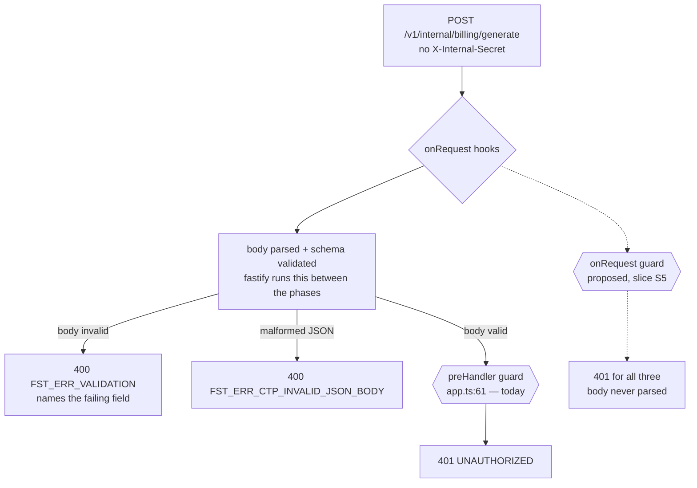

# S-8 — Timing-safe internal-auth guards, and four secret schemas that agree

> **STATUS: COMPLETE — submitted for Gate 2 approval.** D1, D2 and D3 were answered by the user
> at Gate 1 and are recorded as settled in §2, each with the rejected options and the
> measurements that rejected them. No production code or tests have been written.

| | |
|---|---|
| Gap | `.claude/rules/known-gaps.md` § **S-8**, MEDIUM, open |
| Tree | `2cdb140` (`feat(billing-service): implement T-048 invoice immutability guard`), clean |
| Mode | Local gap-closure task, not an epic task — `s-0NN-` precedent (`s-001`, `s-002`, `s-004`, `s-007`, `s-018`, `s-045`) |
| Services touched | gateway, usage-service, worker-service, billing-service, + `shared-validation`, `shared-utils`, `shared-types` |
| Closes | S-8 (deleted). Files a new entry for the epic-9 divergence (D3). |
| Leaves open | S-9, S-23, S-39, S-12 — §3 |

**Which revision of `known-gaps.md` this plan read.** From disk at `2cdb140`: **3451 lines,
entries S-5 through S-52**, S-8 at lines 39–168. The copy injected into this session's context
ended at **S-39**. That is **S-24 firing again** — so every S-8 claim below was re-read with
`sed -n '39,168p'` and re-derived by execution. Two of its claims did not survive; §4.

---

# Part 1 — for the analyst

## 1. In plain terms

Six services prove to each other that a request came from inside the platform by sending a
shared password in a header. Three of them check that password on the way in. **They do not
check it the same way, and they do not agree on what a valid password even is.**

Three consequences, all measured rather than argued:

1. **Two of the three checks leak the password, slowly.** billing-service and worker-service use
   an ordinary string comparison, which stops at the first character that differs. An attacker
   who can time responses learns how many leading characters a guess got right, and recovers the
   password one character at a time instead of guessing it whole. usage-service already does this
   correctly.

2. **Two of the three checks run too late, and answer an unauthenticated stranger's questions on
   the way.** billing's internal endpoint and worker's replay endpoint check the password *after*
   the request body has been read and validated. A caller with **no password at all** gets three
   distinguishable answers depending on what it sends — including a `400` naming the field it got
   wrong. It can map the shape of an internal API it cannot call.

3. **The four services disagree about whether a password with a space on the end is the same
   password.** Two say yes, two say no. Because the network layer silently strips spaces from
   header values in transit, this is not cosmetic: **one stray space in the deployed secret stops
   ingestion** — usage-service `401`s every request the gateway forwards — **while billing and
   worker keep serving normally.** Measured end-to-end, §5.5.

**Who notices.** (1) is invisible until exploited. (2) is invisible. (3) is a support incident
that presents as "usage data stopped arriving" and takes hours to trace to a whitespace
character in a deployment variable.

**What it costs if this is wrong.** The change is wide but shallow, and it has no
silent-corruption mode: every failure it can cause is a service that refuses to start, or
refuses a request, and both are immediate and loud. The residual risk is concentrated in one
place — the stricter startup validation (D1) will refuse to boot a service whose secret contains
a non-printable or non-ASCII character. That is the intent, and §10/R1 and the release note
(§11) cover what an operator does about it. Every secret configured anywhere in this repository
today — **30 configured sites, measured, §5.6** — passes the new rule unchanged, the one
long-standing documentation exception aside. (The count read 20 until the Gate-5 rework; see §5.6
for why the grep it was attributed to could not have produced any of the three numbers quoted.)

### Why the wide diff *is* the deliverable

#### The deferral sentence, verbatim — this plan is the record for it

S-8 is **deleted** by this change rather than annotated closed, because
`.claude/rules/known-gaps.md` never reuses or renumbers an id. Five entries in that file cite
S-8 as the precedent for declining to fix another service inside their own task, and **two of
them quote one sentence of it**. Those two redirects name this plan, so the sentence lives here.

Verbatim, from `.claude/rules/known-gaps.md` **lines 41-42** at `2cdb140` — the two lines
immediately under the S-8 heading at line 39:

> Found while fixing S-4, and deliberately not folded into it: changing two other services' startup contracts inside a usage-service security fix breaks the one-task-per-commit rule.

**One deliberate difference from the source bytes, and it is the difference that makes the
redirect usable.** At `2cdb140` that sentence is *line-wrapped* — `sed -n '41,42p'` breaks it
after `two other services'` — so a single-line `grep` for it matched **nothing**, in the original
file as much as in this plan. It is given unwrapped above precisely so the grep in the Gate-4
finding succeeds here. Every other byte is identical: stripping the `> ` from the block above and
joining `2cdb140`'s two lines with a space gives the same string, checked with `diff`.

The entry it opens is **128 lines**, and
`git show 2cdb140:.claude/rules/known-gaps.md | sed -n '39,166p'` is the only place it survives
in full. Nothing above is reconstructed from memory; it was copied out of that command's output.

**Where the redirects come from**, re-derived on this tree with
`grep -rn "s-008-timing-safe-internal-auth" .claude/`:

| Entry | Line | What it claims |
|---|---|---|
| S-40 | `:1829-1832` | quotes the sentence, then *"it is quoted verbatim in `docs/plans/s-008-timing-safe-internal-auth.md`, which is the record"* |
| S-45 | `:2440-2444` | the same quotation and the same redirect |
| S-22 | `:649-650` | *"the record is …"* — cites this plan, quotes nothing |
| S-23 | `:706-707` | *"the record is …"* — cites this plan, quotes nothing |
| S-39 | `:1657-1658` | *"the record is …"* — cites this plan, quotes nothing |

`.claude/rules/tenant-isolation.md:147-148` carries a sixth *"the record is …"* citation, also
without a quotation. All six now resolve to this subsection.

**Why it is a subsection and not a bare quote block.** At Gate 4 the two `quoted verbatim`
redirects were graded **HIGH**, and the grading was right. Re-derived here before writing, on
the pre-edit tree:

```
$ grep -n "changing two other services' startup contracts inside a" \
      docs/plans/s-008-timing-safe-internal-auth.md
  (no match)
$ grep -rn "changing two other services. startup contracts inside a" . \
      --include=*.md --exclude-dir=node_modules --exclude-dir=.git
  .claude/rules/known-gaps.md:1829      <- S-40, the citing passage itself
  .claude/rules/known-gaps.md:2440      <- S-45, the citing passage itself
  docs/reviews/s-008-timing-safe-internal-auth.md:33,39,44   <- Gate 4 reporting the defect
```

So the sentence survived **only inside the two sentences that quoted it**, each pointing at a
file that did not contain it, and both of those passages were rewritten by this diff — they are
claims this change introduced, not inherited ones. A **third** citation was swept for and does
not exist. `grep -rn "quoted verbatim" . --include=*.md` over the same exclusions returns, in
`.claude/rules/`, **exactly the two** at `:1832` and `:2444` — plus the Gate-4 review quoting
them, one unrelated line in `docs/reviews/t-041-retry-tracking-dead-letter.md` about T-040's
review, and, on the post-edit tree, **five** lines of this plan — four in this subsection, which
discusses the phrase, and one in §12's checklist. Discount those five when re-running it; the
load-bearing number is the two in
`.claude/rules/`, which is the directory `CLAUDE.md` designates authoritative and therefore the
only one where a dangling redirect is a HIGH. Scope of the sweep: Markdown files outside
`node_modules` and `.git`. TypeScript was swept separately and is clean —
`grep -rn "s-008-timing-safe-internal-auth\|quoted verbatim\|changing two other services" apps packages --include=*.ts`,
excluding `dist`, returns **nothing**.

A first draft of this paragraph justified skipping `.ts` on the grounds that *"no `.ts` file
cites a `docs/plans/` path"*. That is **false** and was caught by running it before shipping the
sentence: `grep -rln "docs/plans/" apps packages --include=*.ts` returns **4 files** —
`apps/worker-service/src/constants.ts` (four citations), `apps/usage-service/src/errors/index.ts`,
`apps/usage-service/tests/usage.timezone.integration.test.ts` and
`apps/billing-service/src/repositories/invoice.repository.ts`. Source comments in this repository
**do** cite plans, so the correct justification is the measured one above, not the assumed one.
Recorded rather than silently corrected, because it is the S-33 shape appearing inside the
subsection written to answer a finding of the same kind.

**The transcript above matches itself**, which is the S-33 shape, and it is called out here so
the next reader is not caught by it — and so that nobody "corrects" the count. Re-running the
Gate-4 grep against **this file** returns **2** hits, not 1: the quotation at the top of this
subsection, and the line inside the code block that carries the grep command. One is evidence;
the other is a command that happens to contain its own subject. Counted properly, the
quotation appears **exactly once**. Deliberately not restated with the pattern spelled out a
third time, which would make it 3 — that is the off-by-one S-33 exists to name.

The sentence is kept because the argument it carries is the one the rest of this section
answers — the reason S-8 sat open is that every task which *could* have closed it would have had
to edit services it did not own. That reason expired once the partial fixes made the four
declarations disagree (§5.5), which is what the paragraphs below set out.

S-8 has been deferred five times — **T-037, T-044, T-045, T-046, T-047** — each time on the
one-task-per-commit rule, because closing it means editing three services' middleware and four
services' startup validation together. That objection has inverted:

- **The deferrals made the gap worse, not stable.** T-037 and T-044 each fixed *one* service's
  schema. That is what created consequence (3): before them all four were equally wrong and
  therefore consistent, so a padded secret worked everywhere. **A partial fix to a consistency
  defect is a new defect** — measured in §5.5, not inferred.
- Billing now has **three routes** behind the weak comparison — `GET /v1/billing/invoices`,
  `GET /v1/billing/invoices/:id` and `POST /v1/internal/billing/generate` — **two of them
  tenant-facing**. At T-044 there was one, and it was a stub.

The one-task-per-commit rule exists so a commit's blast radius is reviewable. Here the blast
radius **is** the subject: four declarations of one contract that must agree. Splitting this
would produce four commits each of which leaves the platform in the inconsistent state that is
the bug.

### The guard-phase defect, as a picture



Solid edges are measured on fastify 5.10.0 (Appendix A3). The dashed path is **proposed** — it
does not exist for billing's internal scope or worker's today. billing's *tenant-facing* scope is
already `onRequest` (`apps/billing-service/src/app.ts:97`); only the two internal scopes are late.

---

## 2. Decisions — all settled at Gate 1

### D1 · The schema rule — **`.trim()` → `.min(32)` → printable-ASCII, as one shared fragment** ✅ *settled by the user*

All four `INTERNAL_API_SECRET` declarations are replaced by one imported fragment.

```ts
z.string()
  .trim()
  .min(INTERNAL_AUTH_CONSTANTS.SECRET_MIN_LENGTH)
  .regex(INTERNAL_AUTH_CONSTANTS.SECRET_PATTERN, INTERNAL_AUTH_CONSTANTS.SECRET_PATTERN_MESSAGE)
```

**Rejected: Option A, converge on `.trim().min(32)`.** It is a two-line diff and it closes S-8's
literal fix direction, but it leaves both measured holes open (A4):

- a secret of 32 × **U+00AD** is accepted, transmits intact, and **authenticates `200`** through
  the real `@fastify/http-proxy` — so the addendum's "fails closed" is false in that direction;
- a secret of 32 × **U+200B** is accepted, and makes the **gateway return `500`** on every
  proxied request, because both HTTP clients refuse to transmit it (`ERR_INVALID_CHAR`,
  `UND_ERR_INVALID_ARG`) — so it is false in the other direction too.

Option B rejects both at startup with a named variable and a specific message.

#### D1.1 · Placement — **`@telemetry/shared-validation`, not `shared-types`** — *plan-level correction, flagged*

The decision as given said "one shared fragment in `@telemetry/shared-types`". Implementing that
literally has a structural objection I measured after the decision, so the fragment goes one
package over. **The substance of D1 is unchanged** — one fragment, four repoints, the same rule.
Only the package changes. Raising it rather than silently doing either.

- `packages/shared-types/src/index.ts` has **zero imports** — `grep -n "^import"` returns
  nothing. It is a deliberate leaf of pure declarations, and its `package.json` declares **no
  dependencies at all**. A zod schema there adds a `zod` dependency to the package every other
  package depends on, and destroys that property.
- `packages/shared-validation` describes itself as *"Shared Zod schemas and validators"*, already
  declares `zod`, and already exports exactly this kind of single-field fragment —
  `uuidSchema`, `iso8601Schema`, `tenantIdSchema`. **All six backend apps already declare it as a
  dependency**, and billing, usage and worker already import from it in `src/`.

So: the **constants** (`SECRET_MIN_LENGTH`, `SECRET_PATTERN`, `SECRET_PATTERN_MESSAGE`) stay in
`shared-types` beside the existing `SECRET_MIN_LENGTH` at `:121`; the **schema fragment**
(`internalApiSecretSchema`) goes in `shared-validation`. Gateway gains its first `src/` import of
`shared-validation`; the package dependency is already declared, so no `package.json` changes.

*If you would rather take the zod dependency into `shared-types`, say so and the only change is
which file the fragment lands in — everything else in this plan is identical.*

#### D1.2 · The order of checks is load-bearing a **third** time — *measured*

S-8 already documents that `.trim().min()` and `.min().trim()` differ. A third ordering question
appears once the pattern check is added, and it decides whether existing tests stay green (A9):

| Declaration | 32 spaces | 31-core padded to 35 | 32 × U+200B |
|---|---|---|---|
| `.trim().min(32).regex(…)` **(chosen)** | reject — *"String must contain at least 32 character(s)"* | reject — same message | reject — the new ASCII message |
| `.trim().regex(…).min(32)` | reject — but with the **ASCII** message | reject | reject |

Both are correct on verdicts; they differ on which message an operator sees for an
**all-whitespace** secret. The chosen order preserves **every verdict and every message** the
current declarations produce, and adds a new message only for the genuinely new rejection class.
Verified across nine inputs against the shipped declaration (A9).

#### D1.3 · The custom message is mandatory, not cosmetic — *measured*

zod's default message for a failed `.regex()` is the literal string **`"Invalid"`**, which
`parseEnv` surfaces as
`Invalid environment configuration for INTERNAL_API_SECRET: Invalid` — useless. With the custom
message the operator sees (A8):

```
Invalid environment configuration for INTERNAL_API_SECRET: must contain only printable ASCII characters (U+0020-U+007E)
```

`parseEnv` reports **only `issues[0]`** (`packages/shared-config/src/index.ts:10-13`), so a
secret failing two checks names one. That is existing behaviour and is not changed here.

#### D1.4 · Internal spaces stay legal — the non-obvious half

The pattern is `/^[\x20-\x7E]+$/` — **including** U+0020 — and it is applied **after** `.trim()`.
So edge whitespace is stripped and *internal* spaces are preserved and accepted. Measured
transmissible and non-collapsing over a real socket: `abc def` arrives `61 62 63 20 64 65 66`,
`abc  def` keeps both spaces (A6). A passphrase-style secret built from spaces therefore keeps
working. Excluding U+0020 would have been the more obvious rule and would have broken those
silently.

**TAB does not keep working, and A6's measurement does not say it does.** An internal TAB also
survives transit as `09` (A6) — but `\x09` is below `\x20`, so this pattern rejects it. An earlier
revision of this paragraph cited that measurement alongside the spaces as if it supported the same
conclusion; it supports the opposite one, which is why internal TAB is a **newly-breaking** class
(§ release note) rather than a preserved one. Re-derived at the Gate-5 rework against the real
billing guard over a real `node:http` socket: a 33-character ASCII secret whose sixteenth byte is
`0x09` arrives byte-identical, authenticates `200`, and was accepted by both pre-S-8 declarations
(`.min(32)` and `.trim().min(32)` alike, since `trim()` strips edges only). Kept excluded by the
user's decision on QA's D-1: a TAB inside a secret is invisible in every config UI and every
`echo`, which is the property that produced the split S-8 exists to end.

### D2 · De-duplication — **share `secretsMatch` only** ✅ *settled by the user*

`secretsMatch(provided, expected)` moves to `@telemetry/shared-utils`; the three services keep a
thin middleware each, converged in shape.

**Rejected: Option B, share the whole guard factory.** It would force one `401` body on three
services that differ today — usage answers `{code, message}` via `AppError` +
`registerGlobalErrorHandler`, billing and worker answer `{code}` with no message. And the change
would pass green: billing's assertions are
`expect(response.json()).toMatchObject({ code })` (`internal-billing.route.test.ts:63`,
`billing-invoices.route.test.ts:90,106,119`) — a **subset** match — plus
`expect(wrong.body).toBe(missing.body)` (`:106`), which compares the two 401s to each other and
not to an expected shape. Adding a `message` field satisfies all of them. A wire-contract change
to a gateway-forwarded response that no test notices is exactly what should not be a side effect
of a timing fix.

Neither option adds a dependency edge: `shared-utils` already imports `node:crypto`'s
`createHash` (`packages/shared-utils/src/index.ts:1`) and `fastify`, and all six backend apps
already depend on it.

### D3 · The epic-9 `AT TIME ZONE` divergence — **folded in as a records-only `known-gaps.md` entry** ✅ *settled by the user*

`docs/epics/epic-9-analytics-service.md:59` specifies:

```sql
DATE_TRUNC('day', period_start AT TIME ZONE 'UTC') AS bucket_start
```

`AT TIME ZONE 'UTC'` on the **column** is what `CLAUDE.md` § *Raw SQL and timestamps* says shifts
every bucket boundary. Verified live on this host's PostgreSQL 16 (A7): under
`America/New_York` that expression truncates `2026-01-01 03:00:00` to **`2025-12-31`**, while the
bare column gives `2026-01-01` under all three zones tried. T-051 built from that snippet
reintroduces S-18 on the projection side.

A new entry is added to `.claude/rules/known-gaps.md`, taking the next free id (**S-53** at time
of writing — the implementer must re-check the tail of the file, since ids are never reused and
the file may have grown). **No epic file is edited** — matching the S-29 / S-32 / S-35 / S-42 /
S-47 / S-50 precedent, where epic-vs-code divergences get an id and the epic is corrected by
whoever owns it. Editing `docs/epics/` here would put an analytics-epic change inside a commit
whose entire argument is that its wide diff is justified *because the sites are one contract*.

The entry must also record two further divergences in the same snippet, found while verifying:
it writes `period_start` and `metric_key` in snake_case, while the real columns are
`periodStart` (`UsageLine`) and `metricKey` / `bucketStart` (`MetricRollup`,
`prisma/schema.prisma:155-166`).

### D4 · S-23 stays out — *settled; reason recorded so it is not re-opened*

S-23 is `REDIS_STREAM_NAME` disagreeing between usage and worker on the empty string. Same family
— two schemas that should match and do not — and for usage-service it is **the same file, six
lines away**: `apps/usage-service/src/config/env.ts:15` is S-8's, `:21` is S-23's.

Excluded anyway, and the proximity is the argument *against*, not for. S-8 is a security contract
across four services; S-23 is a producer/consumer startup contract between two, and its fix
direction also requires deleting a now-dead fallback arm at
`apps/usage-service/src/events/stream.publisher.ts:36` — production behaviour in the ingestion
path, needing its own tests. Touching `:21` while already at `:15` is precisely the opportunistic
folding that S-19's and S-39's fix directions both tell the next task not to do. **Six lines
apart is not a justification; it is the temptation the rule names.**

Positive consequence for sequencing: once this task lands, the shared-fragment pattern exists, so
S-23's fix becomes a repoint rather than a new design. **S-23 is the natural next task.**

### D5 · `HTTP_STATUS_UNAUTHORIZED` in all three guards — *settled*

`apps/worker-service/src/constants.ts:40` and `apps/billing-service/src/constants.ts:31` already
define it — both added so their env suites could assert statuses without literals — and both
middlewares still write the literal `401` at `internal-auth.middleware.ts:10`. usage-service
already reaches it through `USAGE_SERVICE_RESPONSES.HTTP_STATUS_UNAUTHORIZED` inside
`InternalAuthRequiredError`. Required by `.claude/rules/constants.md`.

### D6 · The duplicated-header divergence — **align the shape, claim nothing** — *settled*

S-8 item 4 records that billing does `Array.isArray(provided) ? provided[0] : provided` where
usage rejects any non-string. **Re-measured (A2); T-045's finding holds — it is not
exploitable.** Over a raw `net` socket a duplicated `x-internal-secret` arrives joined as
`"good, evil"`; via `app.inject` as `"good,evil"`. Type `string` in both, never an array, so the
`provided[0]` arm is unreachable through either transport at fastify 5.10.0.

*New detail, not in the entry: the two transports use **different join separators** — `", "` on
the wire, `","` via inject. Irrelevant to the guard; recorded because a test pinning the joined
value must not assume they agree.*

The three guards converge on usage's non-string rejection. The plan claims **only** what was
measured: *unreachable through HTTP and `app.inject`, at fastify 5.10.0, for this header*. Not
"an array is impossible" — `set-cookie` is the documented array-valued exception and was not
probed. **Do not upgrade this to an exploit in the commit message or the review.**

---

## 3. Scope and non-goals

### In scope

- One timing-safe comparison, shared, replacing `!==` in billing and worker.
- All four `INTERNAL_API_SECRET` declarations derived from one fragment (D1).
- Guard promoted `preHandler` → `onRequest` in billing's internal scope and worker's.
- The `reply.send(...)` short-circuit stated explicitly (`return`) rather than relied on.
- `HTTP_STATUS_UNAUTHORIZED` adopted in all three guards.
- Non-string header values rejected identically in all three.
- Docs: S-8 deleted; the misleading usage-service docblock reworded; the D3 entry filed; a
  release note (§11).

### Non-goals — deliberately left broken

- **S-9** — analytics-service has no guard and no `INTERNAL_API_SECRET`. Its fix direction is
  explicit that the guard lands *before* the first tenant-scoped route, which is **T-051**. A
  guard on a service whose only route is `/health` is untestable ceremony; the env field without
  a guard is S-6 (dead config) by construction. **Stays open, unchanged.**
- **S-23** — D4. **S-39** — gateway's and usage-service's local `"x-tenant-id"` literals; same
  objection as D4. **S-12** — `pnpm format:check` still cannot pass and is not run as a gate.
- The `options.internalApiSecret` escape hatch in billing's and worker's `app.ts` stays
  unvalidated — deliberate, documented, used by both smoke suites, not operator-reachable
  (`src/index.ts` calls with no arguments).
- `docs/epics/epic-3-shared-service-infra.md:172` sets
  `INTERNAL_API_SECRET=change-me-internal-secret` (25 characters), which already fails today's
  `.min(32)`. Pre-existing docs defect, S-15 territory, not touched.

---

# Part 2 — for the implementer

## 4. Where S-8's own text did not survive re-derivation

Both corrections must land in the `known-gaps.md` edit. The second changes the severity argument,
so it is not cosmetic. **This entry has now been wrong three times** (twice before, per its own
record), so §4.2 states only what was measured and names what was not tried.

### 4.1 What holds exactly

- **3 guards** — `ls apps/*/src/middleware/internal-auth.middleware.ts` → billing, usage, worker.
- **4 schemas** — `grep -rln "INTERNAL_API_SECRET" apps/*/src/config/env.ts` → + gateway.
- Item 1 holds: billing `:9` and worker `:9` are `normalizedSecret !== internalApiSecret`.
- Item 3 holds and is **understated** — §5.4.
- Item 4 holds, correctly described as a divergence rather than a hole — D6.
- The three-row `.trim()` placement table reproduces exactly — A1.

### 4.2 The addendum's "fails closed" is refuted in both directions

S-8 currently says:

> Severity is LOW and it **fails closed**: such a secret is accepted by the schema, but the caller
> must then send byte-identical invisible characters in `X-Internal-Secret` for the comparison to
> succeed, so the failure mode is a service that refuses every request rather than one that
> accepts a weak credential.

Measured (A4), that is wrong twice, and the boundary is **U+00FF**, not "invisible":

- **At or below U+00FF it does not fail at all.** 32 × **U+00AD** is accepted by
  `.trim().min(32)`, transmitted intact by `node:http` and `undici`, round-trips byte-identically
  through fastify, and **authenticates — `200`** through the real `@fastify/http-proxy` plugin.
  Not "refuses every request". **Re-run at the Gate-3 rework over the whole at-or-below set:
  U+0085, U+00AD *and U+00FF itself* all behave the same way — byte-identical arrival, `200`
  through the real proxy.** U+00FF was originally probed as a *boundary marker* and written up
  only as "it transmits"; it authenticates too, so the accepted-and-dangerous set is three
  characters rather than two plus an untested edge (A4).
- **Above U+00FF the caller fails, not the service.** 32 × **U+200B** makes both clients throw
  before sending (`ERR_INVALID_CHAR`, `UND_ERR_INVALID_ARG`); through the real proxy the
  **gateway** answers `500 FST_REPLY_FROM_INTERNAL_SERVER_ERROR`. The upstream never sees a
  request, so it never refuses one. The rework extended this to seven characters — U+0100,
  U+034F, U+180E, U+200B, U+200C, U+200D, U+2060 — all identical, and found a **third** client
  refusal shape worth naming: Node's global `fetch` throws a bare `TypeError` with no `code`,
  where the `undici` *package*'s `request()` throws `UND_ERR_INVALID_ARG`. Both refuse; only one
  is checkable by error code.

The mechanism is that Node encodes header values as latin-1, so U+0000–U+00FF map to one byte and
survive while anything above is rejected client-side. The entry's own "two probes disagreed on
the raw socket, one reporting U+00C2 U+00A0 and one U+00A0" note
(`apps/billing-service/src/config/env.ts:42-44`) is the same effect from the other side; my
raw-socket probe reproduces the `c2 a0` form (A2).

**The "not stripped" table is also incomplete.** It lists five characters, all `Cf`, which reads
as *`trim()` strips `Zs`, keeps `Cf`*. Measured across a wider set, `trim()` also leaves
**U+0085** (`Cc`), **U+034F** (`Mn`) and **U+200D** (`Cf`). So the residue is not a `Cf` story.
The correct statement is the one the addendum gives in words and then undercuts with its table:
`trim()` strips the ECMAScript `WhiteSpace` + `LineTerminator` set and **nothing else**, whatever
Unicode category the remainder falls in.

**Specified rewrite of the addendum.** Replace the "Severity is LOW and it fails closed…"
paragraph with, in substance:

> Severity is LOW, and the failure mode is **not** uniform — it splits at U+00FF, because Node
> encodes header values as latin-1. Measured at `2cdb140` and re-measured at the Gate-3 rework:
> **20** characters for the `.trim()` classification, **10** of them driven through transit and
> the real `@fastify/http-proxy`. The two widths are stated separately because the first draft
> attached the trim probe's 20 to the proxy probe's result:
>
> - **U+0000–U+00FF** (measured: U+0085, U+00AD and U+00FF): transmitted intact, round-trips
>   byte-identically, and **authenticates — `200`**, the boundary character included. Such a
>   secret works; it is merely invisible to whoever has to read it.
> - **Above U+00FF** (e.g. U+200B, U+FEFF): `node:http` raises `ERR_INVALID_CHAR` and `undici`
>   raises `UND_ERR_INVALID_ARG` *before sending*, so the **gateway** answers `500
>   FST_REPLY_FROM_INTERNAL_SERVER_ERROR` on every proxied request. The upstream never sees it.
>
> So the earlier claim that this "fails closed … a service that refuses every request" was wrong
> in both directions and is withdrawn.
>
> **Characters measured:** U+0020, U+0009, U+000A, U+000B, U+000C, U+000D, U+0085, U+00A0,
> U+00AD, U+034F, U+180E, U+2000, U+2028, U+2029, U+200B, U+200C, U+200D, U+2060, U+3000,
> U+FEFF. **Not measured:** every other code point, `set-cookie`'s array-valued path, and any
> HTTP client other than `node:http` and `undici` — notably no browser, proxy or load balancer
> was in the path.

Then note that D1's printable-ASCII rule closes the whole class, so the addendum becomes history
rather than an open hazard — which is why the entry is deleted rather than amended in place.

---

## 5. Ground truth — every claim with the command that established it

Transcripts in the Appendix; this section is conclusions with anchors.

### 5.1 The three guards as they stand

| Service | File | Comparison | Phase | Non-string | 401 body |
|---|---|---|---|---|---|
| usage | `apps/usage-service/src/middleware/internal-auth.middleware.ts:21-26,50-56` | `secretsMatch` — SHA-256 + `timingSafeEqual` | `onRequest` (`app.ts:27`) | rejects | `{code, message}` |
| billing | `apps/billing-service/src/middleware/internal-auth.middleware.ts:9` | `!==` | `preHandler` (`app.ts:61`) **and** `onRequest` (`app.ts:97`) | `provided[0]` | `{code}` |
| worker | `apps/worker-service/src/middleware/internal-auth.middleware.ts:9` | `!==` | `preHandler` (`app.ts:59`) | `provided[0]` | `{code}` |

billing's and worker's middleware files are the same 13 lines modulo the constants module they
import. **billing registers the same factory in two phases**, which S-8 does not record and which
matters for §5.8.

### 5.2 The four schemas

| Service | Anchor | Declaration today |
|---|---|---|
| usage | `apps/usage-service/src/config/env.ts:15` | `z.string().min(INTERNAL_AUTH_CONSTANTS.SECRET_MIN_LENGTH)` |
| gateway | `apps/gateway/src/config/env.ts:14` | `z.string().min(INTERNAL_AUTH_CONSTANTS.SECRET_MIN_LENGTH)` |
| worker | `apps/worker-service/src/config/env.ts:52` | `z.string().trim().min(…)` |
| billing | `apps/billing-service/src/config/env.ts:50` | `z.string().trim().min(…)` |

`SECRET_MIN_LENGTH = 32`, `packages/shared-types/src/index.ts:121-123`.

gateway parses **lazily** via `loadEnv()` (`env.ts:26-28`); the other three export
`env = parseEnv(...)` at module load. So a gateway schema test needs no module-reload dance —
which is why gateway has no `tests/setup.ts` today and why its new suite is cheap (§6).

**Worker's schema is a `ZodEffects`, not a `ZodObject`** — `.superRefine` at
`apps/worker-service/src/config/env.ts:107`. It has **no `.shape`**. A test reaching the field
must use `EnvSchema.innerType().shape.INTERNAL_API_SECRET`; the other three use `.shape`
directly. S-23 records this trap; the implementer will hit it in slice S2.

### 5.3 `.trim()` placement, re-derived (A1)

Three forms × 20 inputs. The entry's table reproduces exactly: `.min(32)` accepts 32 spaces and a
31-char core padded to 35; `.min(32).trim()` accepts both, parsing them to `""` and 31 characters;
`.trim().min(32)` rejects both.

The trap worth restating for whoever writes the tests: **a suite asserting only the trimmed
output cannot tell `.min(32).trim()` from `.trim().min(32)`.** The case that separates them is
*"rejects a secret that reaches the minimum only by its padding"* — present in billing's and
worker's suites, **absent from usage-service's**.

### 5.4 The `preHandler` cost is larger than S-8 records (A3)

S-8 says a wrong secret gives `401` with `handlerRan = 0` but `bodyParsed = 1`. Reproduced — and
the case T-045 did not run is the interesting one. With the guard at `preHandler` and **no
credential at all**, fastify parses and validates the body first:

| Body | guard = `preHandler` (today) | guard = `onRequest` (proposed) |
|---|---|---|
| valid | `401 {code}` · `bodyParsed=1` | `401 {code}` · `bodyParsed=0` |
| schema-invalid | **`400 FST_ERR_VALIDATION`**, names the failing field | `401 {code}` · `bodyParsed=0` |
| malformed JSON | **`400 FST_ERR_CTP_INVALID_JSON_BODY`** | `401 {code}` · `bodyParsed=0` |

An unauthenticated caller can distinguish three states and read validation errors off an endpoint
it cannot call. Promoting to `onRequest` collapses all three to `401`. **This is the strongest
argument in the change after §5.5, and it is not in the entry.** It gets its own acceptance
criterion (AC5) and a case that fails if the guard slips back (G3).

Scope: measured on fastify 5.10.0 via `app.inject` against a scope-registered guard and a
JSON-schema-validated `POST`. This is fastify's lifecycle, not billing's — but slice S5 must
re-run it against the **real** route rather than inherit it.

### 5.5 The half-finished fix is a live outage mode (A5)

The finding that inverts the deferral argument, end-to-end.

1. Both HTTP clients in this stack **strip leading and trailing SP/HTAB from an outbound header
   value in transit**: `node:http` and `undici` both turn a sent `"  SECRET  "` into a received
   `"SECRET"`. A raw `net` socket shows the receiving parser doing it. `app.inject` does **not**
   strip — it bypasses the HTTP parser, which is why the existing suites assert schema output
   rather than inferring the transform from an injected request
   (`apps/billing-service/src/config/env.ts:46-49` already says so).
2. So with a whitespace-padded `INTERNAL_API_SECRET` deployed platform-wide **today**: gateway
   (untrimmed) parses the padded value and sends it; the upstream receives it stripped; **billing
   and worker (trimmed) match and return `200`**; **usage-service (untrimmed) compares
   stripped-against-padded and returns `401`.**

Against the **real** guard factories over a real socket:

```
gateway sends padded -> usage   (untrimmed expected): 401
gateway sends padded -> billing (trimmed   expected): 200
```

Ingestion down, billing up, one whitespace character, no log line naming the cause. **T-037 and
T-044 created this state** by fixing two of four schemas — the concrete form of §1's claim.

### 5.6 Every configured secret passes the new rule — 30 sites, not 20 and not 9 (A10)

My Gate-1 message said "9 sites"; §5.6 then said **20**, and that was wrong too. Corrected at the
Gate-5 rework (QA F-3). **The stated pattern could not have produced either number**, and the
enumeration below was in fact assembled by hand and attributed to it.

`grep -rn "INTERNAL_API_SECRET[:=]"` puts a character class immediately after the name, so it
misses **two** shapes that are both in this repository:

- `const VALID_INTERNAL_API_SECRET = "…"` — a space before the `=`. QA named this one. Adding
  `\s*` recovers 17 lines: `grep -rnE "INTERNAL_API_SECRET\s*[:=]" .` (excluding `node_modules`,
  `dist`, `.git`) returns **115** lines against the bare form's **95**.
- `process.env.INTERNAL_API_SECRET ??= "…"` — the null-coalescing assignment in every
  `tests/setup.ts`. **Neither** the bare form nor the `\s*` form matches it, because the next
  character after the whitespace is `?`, not `:` or `=`:
  `grep -cE "INTERNAL_API_SECRET\s*[:=]" apps/usage-service/tests/setup.ts` → **0**. So the
  "Test harness defaults — 3 sites" row below was never reachable from the stated grep either.
  The form that matches is `INTERNAL_API_SECRET\s*\??\??[:=]`, which takes
  `grep -rhE … .env.example apps/gateway/.env.example … apps/usage-service/tests/setup.ts` from
  10 to **13**.

A secret-bearing literal is also not always an `INTERNAL_API_SECRET` line, so the inventory needs
a second, declaration-shaped pattern:
`grep -rhE '(const|let)[[:space:]]+[A-Za-z_]*SECRET[A-Za-z_]*[[:space:]]*=[[:space:]]*"' apps/gateway/tests apps/usage-service/tests apps/worker-service/tests apps/billing-service/tests packages/shared-utils/tests`
→ **16**, and an inline one,
`grep -rhE 'INTERNAL_API_SECRET:[[:space:]]*"' apps/gateway/tests apps/usage-service/tests apps/worker-service/tests apps/billing-service/tests`
→ **16** (most of which are the schema suites' *deliberately invalid* fixtures and are not
configured secrets at all).

**Sites versus distinct values, stated because three different totals have been quoted.** The
union of the three patterns, filtered to lines that carry a *literal value*, is **33 sites**
carrying **23 distinct values**. Of those 33:

- **2 are never parsed by any schema** — `const WRONG_SECRET = "not-the-secret"` at
  `apps/billing-service/tests/billing-invoices.route.test.ts:17` and
  `billing-invoice-detail.route.test.ts:27`. They are header values sent to provoke a `401`, so
  the fragment's opinion of them is irrelevant. They fail it (14 characters), which is why a
  naive "every secret literal must pass" sweep reports two spurious failures.
- **1 is a JWT secret, not an internal-auth one** — `VALID_JWT_SECRET` at
  `apps/gateway/tests/env.schema.unit.test.ts:36`.

That leaves **30 configured `INTERNAL_API_SECRET` sites**, of which **29 pass** and the one
failure is the pre-existing documentation line (below). **That reproduces QA's independently
derived figure of 29 exactly**, and the two numbers agree because the category boundary is now
stated rather than assumed.

Each distinct value parsed against the shipped fragment:

**Deployment artifacts — 10 sites, 3 distinct values:**

```
.env.example:18                       dev-local-internal-secret-at-least-32-chars   (43)
apps/gateway/.env.example:18          dev-local-internal-secret-at-least-32-chars   (43)
apps/usage-service/.env.example:18    dev-local-internal-secret-at-least-32-chars   (43)
apps/worker-service/.env.example:58   dev-local-secret-change-in-production         (37)
apps/billing-service/.env.example:35  dev-local-secret-change-in-production         (37)
docker/docker-compose.yml:93,112,159,185  ci-internal-api-secret-with-at-least-32-chars (45)
.github/workflows/ci.yml:48           ci-internal-api-secret-with-at-least-32-chars (45)
```

**Test harness defaults — 3 sites:** `apps/{usage,worker,billing}-service/tests/setup.ts` at
`:15`, `:50`, `:12`. Reachable only through the `??=` arm of the pattern, above.

**Test literals and constants — 16 sites**, not the 7 this row used to claim. The seven it named
were billing `VALID_`/`OTHER_VALID_`, usage `VALID_`, worker `VALID_`/`OTHER_VALID_`, gateway
`app.hooks.unit`/`smoke` and `config/container.unit` — which is eight items for a stated seven, a
second arithmetic slip in the same row. The full set, each parsed against the shipped fragment and
each **PASS**:

```
apps/gateway/tests/env.schema.unit.test.ts:35        VALID_INTERNAL_API_SECRET
apps/gateway/tests/proxy.plugin.unit.test.ts:7       INTERNAL_API_SECRET
apps/gateway/tests/app.hooks.unit.test.ts:41         inline
apps/gateway/tests/smoke.test.ts:23                  inline   (same value as app.hooks.unit:41)
apps/gateway/tests/config/container.unit.test.ts:14  inline, built by concatenation
apps/usage-service/tests/env.schema.unit.test.ts:21            VALID_INTERNAL_API_SECRET
apps/usage-service/tests/middleware.internal-auth.unit.test.ts:13  INTERNAL_SECRET
apps/usage-service/tests/middleware.internal-auth.unit.test.ts:14  WRONG_SECRET   (45 chars; a
                                                     header value, but it does pass the fragment)
apps/worker-service/tests/env.schema.unit.test.ts:58           VALID_INTERNAL_API_SECRET
apps/worker-service/tests/env.schema.unit.test.ts:59           OTHER_VALID_INTERNAL_API_SECRET
apps/worker-service/tests/internal-auth.middleware.unit.test.ts:38  OTHER_VALID_SECRET
apps/worker-service/tests/billing-client.service.unit.test.ts:21    INTERNAL_SECRET
apps/billing-service/tests/env.schema.unit.test.ts:35          VALID_INTERNAL_API_SECRET
apps/billing-service/tests/env.schema.unit.test.ts:36          OTHER_VALID_INTERNAL_API_SECRET
apps/billing-service/tests/internal-auth.middleware.unit.test.ts:43 OTHER_VALID_SECRET
packages/shared-utils/tests/unit.test.ts:259                   SECRET
```

Three of those — the two `internal-auth.middleware.unit.test.ts` constants and
`apps/gateway/tests/env.schema.unit.test.ts:35` — are in files **this change itself created**, so
the pre-change inventory could not have been complete however it was derived.

**All 30 configured sites but one PASS.** The single FAIL is
`docs/epics/epic-3-shared-service-infra.md:172` (25 characters), which already fails today's
`.min(32)` — pre-existing, §3. The two other values in the union that fail the fragment are the
`"not-the-secret"` header fixtures excluded above; they are not configured secrets and nothing
parses them.

**Consequence for the gate, stated so it is not over-read:** a green `pnpm test` proves the new
rule admits the values in use. It does **not** prove the rule rejects anything, because no
fixture exercises a rejected value except the ones the schema suites construct deliberately.
Those suites are therefore the entire evidence for the restriction, which is why §8 puts the
rejection cases first and requires them confirmed red.

### 5.7 Routes behind each guard

- **billing — three routes, two tenant-facing:** `GET /v1/billing/invoices`,
  `GET /v1/billing/invoices/:id` (tenant-facing, `onRequest`),
  `POST /v1/internal/billing/generate` (internal, `preHandler`).
- **worker — one:** `POST /v1/internal/worker/replay` (internal, `preHandler`).
- **usage — two:** `POST /v1/usage/events`, `GET /v1/usage/summary` (both `onRequest`, already
  correct).
- `/health` is exempt everywhere: usage via `isPublicRoute`, billing and worker structurally by
  being registered outside the guarded `app.register` scopes.

### 5.8 Tenant isolation — this is layer 2 of four

`.claude/rules/tenant-isolation.md` § *Forbidden* forbids registering the tenant-context hook
before the internal-auth hook: a caller that has not proved it is an internal service must not
cause tenant context to be derived at all.

The prior measurement is recorded at `apps/billing-service/src/app.ts:72-87` (T-046 Gate 4, seven
configurations): with the tenant-context hook at `onRequest`, a guard left at `preHandler`
derives tenant context **first in both registration orders** — the forbidden ordering.
Both-`preHandler` and auth-`onRequest`/tenant-`preHandler` also order correctly, so the choice
among the three correct pairings is stylistic.

**Consequence for this task, and it is the reassuring direction:** promoting billing's *internal*
guard to `onRequest` cannot disturb that, because the internal scope registers **no**
tenant-context hook at all (`app.ts:58-67` — the scope holds the guard and
`registerInternalBillingRoutes` only; T-045's contract is that internal routes derive no tenant
context). The tenant-facing scope at `:96-101` is **already** auth-`onRequest` +
tenant-`onRequest` and is not re-ordered here. Worker registers no tenant-context hook anywhere.
**Slice S5 re-asserts this rather than inheriting it** — case group G4.

---

## 6. Files to change

### Added — production

| File | Content |
|---|---|
| `packages/shared-validation/src/index.ts` *(modified)* | `export const internalApiSecretSchema` — the D1 fragment |

### Modified — production

| File | Change |
|---|---|
| `packages/shared-types/src/index.ts:121-123` | `INTERNAL_AUTH_CONSTANTS` gains `SECRET_PATTERN` and `SECRET_PATTERN_MESSAGE` beside `SECRET_MIN_LENGTH`. No zod, no new import — the leaf property is preserved (D1.1) |
| `packages/shared-utils/src/index.ts` | `export const secretsMatch` — moved verbatim from usage-service, docblock and all |
| `apps/usage-service/src/config/env.ts:15` | → `internalApiSecretSchema` |
| `apps/gateway/src/config/env.ts:14` | → `internalApiSecretSchema` (gateway's first `src/` import of `shared-validation`; dependency already declared) |
| `apps/worker-service/src/config/env.ts:52` | → `internalApiSecretSchema` |
| `apps/billing-service/src/config/env.ts:50` | → `internalApiSecretSchema` |
| `apps/usage-service/src/middleware/internal-auth.middleware.ts` | import `secretsMatch`, delete the local copy; **reword the docblock at `:37-38`** — "Validated non-empty …" is true-but-misleading under an untrimmed `.min()` and S-8 requires it reworded by whichever task adds the trim |
| `apps/billing-service/src/middleware/internal-auth.middleware.ts` | `secretsMatch`; reject non-string; `BILLING_RESPONSES.HTTP_STATUS_UNAUTHORIZED`; `return reply…` |
| `apps/worker-service/src/middleware/internal-auth.middleware.ts` | same, with `WORKER_RESPONSES.HTTP_STATUS_UNAUTHORIZED` |
| `apps/billing-service/src/app.ts:61` | `preHandler` → `onRequest`; update the `:89-91` comment, which currently says the guard is reused unedited and that promoting the phase keeps S-8 out of scope |
| `apps/worker-service/src/app.ts:59` | `preHandler` → `onRequest` |

### Added — tests

| File | Why |
|---|---|
| `apps/gateway/tests/env.schema.unit.test.ts` | gateway has **no** env suite; it is one of the four schemas this task makes agree, so it cannot be the only unpinned one |
| `apps/billing-service/tests/internal-auth.middleware.unit.test.ts` | billing has no guard unit suite; mirrors usage's |
| `apps/worker-service/tests/internal-auth.middleware.unit.test.ts` | same |
| `packages/shared-utils/tests/…` *(extend existing)* | cases for `secretsMatch` |
| `packages/shared-validation/tests/…` *(extend existing)* | cases for `internalApiSecretSchema` — the cross-service equality table (G1) lives here |

### Modified — tests

| File | Change |
|---|---|
| `apps/usage-service/tests/env.schema.unit.test.ts` | + the padding/whitespace cases it lacks (6 secret cases today vs billing's 11) + the new ASCII class |
| `apps/worker-service/tests/env.schema.unit.test.ts` | **+ new cases only** — see below |
| `apps/billing-service/tests/env.schema.unit.test.ts` | **+ new cases only** — see below |
| `apps/usage-service/tests/middleware.internal-auth.unit.test.ts` | unchanged; the regression baseline for slice S3 |
| `apps/billing-service/tests/internal-billing.route.test.ts` | + the G3 phase matrix |
| `apps/billing-service/tests/billing-invoices.route.test.ts` | + G4 ordering re-assertion |
| `apps/worker-service/tests/smoke.test.ts` | + guard cases if not covered by the new unit suite |

#### Worker's and billing's existing schema suites are *extended*, not reworked — measured

The brief anticipated these being reworked. **Measured, no existing case changes and none needs
to.** Two reasons:

1. **The chosen check order preserves every existing verdict and message** (D1.2, A9). All six
   pre-existing secret cases in each suite produce the identical outcome.
2. **No env suite anywhere asserts a zod rejection message.** The shared helper is
   `expectIssueOn` (`apps/billing-service/tests/env.schema.unit.test.ts:44-55`), which asserts
   only `parsed.success === false` and that some issue's `path[0]` matches the field name.
   `grep` for message assertions across all four suites returns **nothing**. So even if a message
   had shifted, no case would have noticed — which is itself worth one new case (G1e) that pins
   the *message* for the new class, so the new rejection is distinguishable from the old one.

What they gain: the new ASCII-class rejections (G1c), and the message pin (G1e).

### Modified — docs

- `.claude/rules/known-gaps.md` — **delete S-8** (ids are never reused); **add the D3 entry** at
  the next free id; rewrite the addendum's conclusion into the D3 entry's sibling per §4.2 —
  actually into the *release note* and the plan, since S-8 itself is deleted; update the S-8
  cross-references in **S-9, S-23 and S-39** so they do not dangle. Run
  `grep -rn "S-8\b" .claude/rules/` before and after.
- `docs/releases/s-008-timing-safe-internal-auth.md` — new, §11.
- `docs/reviews/s-008-timing-safe-internal-auth.md` — by the reviewer, not this plan.

### Deliberately NOT modified

`apps/analytics-service/**` (S-9) · `apps/usage-service/src/config/env.ts:21` and
`src/events/stream.publisher.ts` (S-23) · `apps/gateway/src/constants.ts:14` and
`apps/usage-service/src/constants.ts:16` (S-39) · `prisma/**` · `docs/epics/**` (D3) ·
`.prettierrc` (S-12).

---

## 7. Implementation slices — smallest safe first

Pseudo-TDD: **S2 and S4 are named confirmed-red slices.** No implementation before the tests for
that slice exist and have been observed failing.

| # | Slice | Controlling code path | Falsified if… |
|---|---|---|---|
| **S1** | Constants + the shared fragment + `secretsMatch`, with their own cases. **No caller yet.** | `packages/shared-types/src/index.ts:121`, `packages/shared-validation/src/index.ts`, `packages/shared-utils/src/index.ts` | `pnpm --filter @telemetry/shared-{types,validation,utils} test` fails, or any of the other 10 packages' typecheck output changes — this slice is purely additive, so a diff elsewhere means an export name collides |
| **S2** | **Confirmed-red slice.** The four schema suites' new cases, written and observed failing, *then* the four declarations repointed. | the four `config/env.ts`; worker's needs `EnvSchema.innerType().shape` (§5.2) | any new case is **green before** the repoint. Specifically: if usage's "reaches the minimum only by its padding" case passes against `.min(32)`, the case is wrong, not the schema. And if a `32 × U+200B` case passes against `.trim().min(32)` in worker or billing, the case is not reaching the real schema |
| **S3** | usage-service adopts shared `secretsMatch`; local copy deleted. **Pure refactor.** | `apps/usage-service/src/middleware/internal-auth.middleware.ts` | **any** case in `middleware.internal-auth.unit.test.ts` changes verdict. This slice exists *to be a no-op* — it is the control proving the extraction is faithful before two more services depend on it |
| **S4** | **Confirmed-red slice.** billing + worker guard unit suites written and observed failing, then the guards rewritten: shared comparison, non-string rejection, `HTTP_STATUS_UNAUTHORIZED`, returned `reply`. **Phase unchanged.** | the two `internal-auth.middleware.ts` | a wrong secret stops returning `401`; or the `401` **body changes** — under D2-A it must not, byte for byte (G5) |
| **S5** | Phase promotion `preHandler` → `onRequest`, both internal scopes. | `apps/billing-service/src/app.ts:61`, `apps/worker-service/src/app.ts:59` | the §5.4 matrix does not flip against the **real** routes — a schema-invalid unauthenticated body still returning `400` means the guard is not where the plan thinks. **And** if any G4 ordering case changes verdict — it must not (§5.8) |
| **S6** | Docs: S-8 deleted, D3 entry filed, cross-references fixed, usage docblock reworded, release note. | `.claude/rules/known-gaps.md`, `docs/releases/` | `grep -rn "S-8\b" .claude/rules/` returns a citation still reading as if the gap were open |

**S3 before S4 is load-bearing.** usage-service has the only existing guard suite, so it is the
only place where *"the shared helper behaves exactly like the code it replaced"* can be tested
before two more services depend on it. Doing S4 first would mean the first evidence for the
extraction is a suite written in the same slice — a test that never saw the old behaviour.

**S4 before S5 is also deliberate.** Changing the comparison and the phase in one slice would
make a `401`-shape regression and a lifecycle regression indistinguishable.

---

## 8. Test plan and acceptance-coverage mapping

Scope with `pnpm --filter <pkg> exec vitest run <file>` — `-- <file>` does **not** filter
(`.claude/rules/testing.md`). No magic literals in tests: import
`INTERNAL_AUTH_CONSTANTS.SECRET_MIN_LENGTH`, each service's `HTTP_STATUS_*` and `CODE_*`, and the
shared pattern/message constants rather than retyping `32`, `401`, `"UNAUTHORIZED"` or the ASCII
message (`.claude/rules/constants.md` covers tests explicitly).

### What is **NOT** proven — read before the review

**No test in this plan asserts timing, and none should.** A timing assertion over a SHA-256 +
`timingSafeEqual` comparison is not reliably measurable in a vitest process on a shared runner:
the measurement noise exceeds the effect, and a threshold that passes here is a flake on CI. A
green suite is therefore **not** evidence of constant-time behaviour.

What the tests do prove:

- **(a) Behavioural equivalence** — the new comparison accepts and rejects exactly what `!==`
  did, across matched, wrong, prefix-of-correct, longer-than-correct, empty, missing, and
  non-string inputs.
- **(b) The shape of the comparison** — the guard routes through the shared export, so a future
  edit reintroducing `!==` is visible.

The security property rests on `crypto.timingSafeEqual`'s documented contract plus the
fixed-width-digest argument already written at
`apps/usage-service/src/middleware/internal-auth.middleware.ts:7-20` — **not** on this suite.
The reviewer must repeat this rather than let a green run stand in for it. Per
`.claude/rules/review-standards.md`, a constant-time claim is exactly the universal this
repository has been burned by; the plan asserts only (a) and (b).

**Also not proven:** that no *other* comparison on the request path leaks. This task changes
three guards; it does not audit JWT verification or tenant-id comparison.

### Acceptance criteria

| AC | Criterion |
|---|---|
| **AC1** | All four `INTERNAL_API_SECRET` schemas return **identical verdicts** for an identical input table |
| **AC2** | usage and gateway reject whitespace-only and padding-only secrets (the two they accept today) |
| **AC3** | All four reject secrets outside printable ASCII, with a message naming the constraint |
| **AC4** | No guard compares with `!==`; all three route through shared `secretsMatch`, with identical accept/reject behaviour |
| **AC5** | The guard runs **before** body parsing — an unauthenticated caller cannot distinguish body shapes |
| **AC6** | Tenant context is still never derived before the guard (`tenant-isolation.md` § *Forbidden*) |
| **AC7** | Each service's `401` body is byte-identical for a missing and for a wrong secret, **and unchanged from today** |
| **AC8** | No magic literals — status codes, error codes, the minimum, the pattern and its message all imported |
| **AC9** | A duplicated `X-Internal-Secret` is rejected identically by all three guards |
| **AC10** | `/health` remains reachable with no secret in all three services |

### Case groups → acceptance mapping

| Case | Where | Asserts | AC |
|---|---|---|---|
| **G1a** | `shared-validation` tests | One input table × the four **imported real** schema fields; assertion is **cross-service verdict equality**, not four independent lists | AC1 |
| **G1b** | usage + gateway env suites | 32 spaces, 32 tabs, 31-core padded to 35 → rejected | AC2 |
| **G1c** | all four env suites | 32 × U+200B, 32 × U+00AD, 32 × U+0085 → rejected. **Confirmed red in S2** against worker's and billing's current `.trim().min(32)` | AC3 |
| **G1d** | all four env suites | valid ASCII at exactly `SECRET_MIN_LENGTH` → accepted; `  <valid>  ` → accepted **and trimmed**; `abc def …` with internal spaces at ≥32 → **accepted** (D1.4) | AC1, AC3 |
| **G1e** | one env suite | the ASCII rejection carries `SECRET_PATTERN_MESSAGE`, and the too-short rejection still carries the length message — the two classes are distinguishable | AC3 |
| **G1f** | gateway env suite *(new file)* | gateway's schema is exercised at all — it has none today | AC1, AC2 |
| **G2a** | `shared-utils` tests | `secretsMatch` equivalence table: equal, differing-first-byte, differing-last-byte, prefix, superstring, empty-vs-empty, differing lengths | AC4 |
| **G2b** | all three guard suites | route-level verdicts on a **real app** for the same table — not a stubbed comparison | AC4 |
| **G2c** | all three guard suites | the module does not contain a `!==` comparison of the secret — shape assertion, so a revert is visible | AC4 |
| **G3** | billing `internal-billing.route.test.ts`, worker guard suite | The §5.4 matrix against the **real** route: no secret + valid body → `401`; + schema-invalid body → `401`; + malformed JSON → `401`. **Goes red if the guard returns to `preHandler`** | AC5 |
| **G4** | billing `billing-invoices.route.test.ts` | tenant-facing scope: a request failing only the secret check answers `401 UNAUTHORIZED`, and tenant context is not attached. Verdicts must be **unchanged** from today | AC6 |
| **G5** | all three guard suites | `expect(wrongSecretResponse.body).toBe(missingSecretResponse.body)` **and** full-body equality against an explicit expected object — not `toMatchObject` | AC7 |
| **G6** | every new/edited test file | constants imported, no literals | AC8 |
| **G7** | all three guard suites | a duplicated `x-internal-secret` → `401`. Pinned per D6: assert the **verdict**, and if the joined value is asserted, do it per transport (separators differ) | AC9 |
| **G8** | all three | `/health` with no secret → `200` | AC10 |

### Vacuity hazards to design against

- **G2b can pass tautologically.** Stubbing the comparison and asserting the stub is the exact
  shape `.claude/rules/testing.md` forbids. Assert route-level verdicts against a real app.
- **G3 can pass vacuously if the route has no body schema** — with nothing to validate there is
  no `400` to distinguish and every row returns `401` whatever the phase. **billing's route
  validates its body (T-045); worker's replay route does not.** So worker's G3 needs a
  schema-bearing fixture route registered inside the guarded scope, or the case measures nothing
  and should be dropped with that reason stated rather than kept as decoration.
- **G1a must fail if any *one* schema drifts.** Write it as one table iterated over four imported
  fields, not four copy-pasted blocks — a copy-pasted block is how the four diverged in the first
  place. Falsification check: repoint one service back to `.min(32)` and G1a must go red.
- **G1c must be confirmed red before S2's repoint**, in worker and billing too — not only in
  usage and gateway. Those two already `.trim()`, so a case that only tests whitespace would be
  green before the change and prove nothing about the new rule.
- **G5 must not use `toMatchObject`.** That is precisely the assertion shape which, per D2, would
  let a response-contract change pass green.

---

## 9. Validation

```bash
# task-scoped, while iterating
pnpm --filter @telemetry/shared-types      test
pnpm --filter @telemetry/shared-validation test
pnpm --filter @telemetry/shared-utils      test
pnpm --filter @telemetry/usage-service   exec vitest run tests/env.schema.unit.test.ts
pnpm --filter @telemetry/usage-service   exec vitest run tests/middleware.internal-auth.unit.test.ts
pnpm --filter @telemetry/gateway         exec vitest run tests/env.schema.unit.test.ts
pnpm --filter @telemetry/worker-service  exec vitest run tests/env.schema.unit.test.ts
pnpm --filter @telemetry/worker-service  exec vitest run tests/internal-auth.middleware.unit.test.ts
pnpm --filter @telemetry/billing-service exec vitest run tests/env.schema.unit.test.ts
pnpm --filter @telemetry/billing-service exec vitest run tests/internal-billing.route.test.ts
pnpm --filter <pkg> lint && pnpm --filter <pkg> typecheck

# full gate, once stable — all 13 packages, --force so turbo re-runs rather than replays
pnpm build --force && pnpm test --force && pnpm lint --force && pnpm typecheck --force
```

`pnpm test` needs live Postgres and Redis (`.claude/rules/testing.md`); both are up as host
services. `pnpm format:check` is **not** a gate (S-12).

---

## 10. Risks

| # | Risk | Likelihood | Mitigation |
|---|---|---|---|
| **R1** | An operator's deployed secret contains a character the new rule rejects → the service will not start | low — all 20 in-repo values pass (§5.6) — but nothing here can see a production `.env` | **By design.** Fails at module load naming the variable and the constraint (D1.3). Release note §11 carries the pre-deploy check and the remedy |
| **R2** | The `secretsMatch` extraction changes usage-service's guard behaviour | low | S3 is a deliberate no-op slice against the only pre-existing guard suite; any verdict change falsifies it |
| **R3** | Phase promotion disturbs hook ordering relative to tenant context | **low, argued not assumed** — neither internal scope registers a tenant-context hook (§5.8) | G4 re-asserts on the tenant-facing scope, which this task does not re-order |
| **R4** | Editing usage-service's startup contract breaks live ingestion | low | The only change is stricter parsing of one variable. For a valid secret nothing changes. For a padded secret it **fixes** the §5.5 outage. For a non-ASCII secret it converts a gateway `500`-loop into a startup refusal |
| **R5** | A `401` body changes and no test notices | **low now, by construction** | G5 asserts full-body equality rather than `toMatchObject`, which is the shape D2 identified as blind |
| **R6** | Deleting S-8 leaves dangling citations across 17 plans and 12 reviews | certain | Historical artifacts are **not** rewritten — `CLAUDE.md` makes plans and reviews the record. Only `.claude/rules/` cross-references are updated: S-9, S-23, S-39 |
| **R7** | A reviewer reads a green suite as proof of constant-time comparison | medium | §8 states the non-proof explicitly and requires the review to repeat it |
| **R8** | Worker's G3 is vacuous — its replay route has no body schema | medium | Named in §8; needs a schema-bearing fixture route or the case is dropped **with the reason recorded**, not silently kept |
| **R9** | Worker's `ZodEffects` schema has no `.shape`, so a copied test helper silently tests nothing | medium — the other three use `.shape` | §5.2; S-23 documents the trap. The new case must be confirmed red, which catches a helper reaching the wrong object |
| **R10** | `shared-validation` gains a consumer in gateway, whose `src/` has never imported it | low | Dependency already declared in `package.json`; S1 is additive and the full gate covers all 13 packages |

---

## 11. Release note — **yes, write one**, argued from the precedent

`docs/releases/` holds **four** notes, not three, and they split into two kinds:

- **Deploy-order notes** — `s-007` (role flip + `v1_5`), `t-040` (`v1_6` migration), `t-042`
  (`v1_7` + role flip). Each carries an ordering because each ships a migration that must land
  before or after a service change.
- **A failure-mode note** — `s-045`, whose own preamble argues the distinction: *"This is a
  failure-mode note, not a deploy runbook, and that is deliberate rather than an omission… S-45
  ships no migration and no configuration change… What it does ship is a response an operator has
  not seen before."*

S-8 ships **no migration and no role change**, so it is not the first kind. It is squarely the
second, and on a stronger footing than `s-045`: that change had *no* configuration change, while
this one **validates an operator-controlled configuration value more strictly and will refuse to
start** if it fails. An operator who has never seen
`Invalid environment configuration for INTERNAL_API_SECRET: must contain only printable ASCII
characters (U+0020-U+007E)` needs somewhere to look it up.

**Deploy ordering, corrected at the Gate-6 rework — this paragraph was wrong twice and the
release note inherited both errors.** It originally read: *"There is no deploy ordering to get
wrong… For a valid secret, old and new code behave identically in both directions, so services
may be redeployed in any order… a padded secret leaves usage-service `401`ing until usage and
gateway both carry the change."*

Both halves are refuted by the 2×3 matrix in the Gate-6 dispositions below, measured over a real
socket against the real guard:

1. **"For a valid secret … any order" is false**, because a *padded* secret is valid under the
   new rule — the trim runs first. The correct scope is a secret that is **already unpadded**,
   for which all six cells are `200`.
2. **"until usage and gateway both carry the change" is false.** `OLD gateway -> NEW service` is
   `200`, so **usage-service alone** closes the split; gateway is not the service that has to
   move. Deploying gateway *first* is the useless order, not the dangerous one — the `401` is
   already present before any redeploy.

What the note now says: §1's whitespace check is a **required** pre-deploy step (decision D-2,
answered **B**), because stripping the padding makes the ordering question disappear; §5 carries
the matrix and the four readings that follow from it; and §4 is corrected to name usage-service
as the service that must move. §4 remains the authority on "redeploy all four", and §5 no longer
contradicts it.

**The note must contain:**

1. The pre-deploy check: confirm the deployed `INTERNAL_API_SECRET` is ≥32 printable-ASCII
   characters with no leading/trailing whitespace. Give a one-liner an operator can run.
2. The exact startup error, per failure class — too short vs non-printable (D1.3).
3. The remedy: re-issue an ASCII secret and roll it to **all four** services; note that gateway
   and the three guarded services must agree, so it is a coordinated secret rotation, not a
   per-service edit.
4. The §5.5 behaviour being fixed, stated as a diagnosis aid — *if ingestion was `401`ing while
   billing worked, this was probably why.*
5. The rollback lever: redeploy the previous image. There is no migration and no schema change,
   so rollback is unconditional.

---

## 12. Pending task checklist

- [x] Re-read `known-gaps.md` from disk; record revision and S-24 sighting
- [x] Re-derive counts — 3 guards, 4 schemas
- [x] Re-derive S-8 items 1, 3, 4 against the code
- [x] Re-measure the three `.trim()` placements across 20 inputs
- [x] Re-measure the `trim()` character set; correct the addendum in both directions
- [x] Measure the phase defect's full cost (three body shapes)
- [x] Measure duplicated-header behaviour on two transports
- [x] Measure header transit — padding, non-ASCII, internal spaces
- [x] Drive non-ASCII secrets through the real `@fastify/http-proxy`
- [x] Establish the §5.5 outage mode against real guard factories
- [x] Verify the epic-9 `AT TIME ZONE` hazard on live PostgreSQL
- [x] Confirm the tenant-context ordering is not disturbed (§5.8)
- [x] Inventory configured secrets — **30 configured sites**, correcting my own "9" and then
      §5.6's own "20" (QA F-3)
- [x] Measure the check-order question introduced by the pattern (D1.2)
- [x] Confirm no env suite asserts a rejection message (§6)
- [x] Establish the shared-package placement against the dependency graph (D1.1)
- [x] Establish the release-note precedent (§11)
- [x] D1, D2, D3 settled by the user
- [x] Gate 2 approval — granted, with D1.1 settled as `@telemetry/shared-validation`
- [x] **S1** shared primitives — constants, `internalApiSecretSchema`, `secretsMatch` [done]
- [x] **S2** four schemas repointed, confirmed red first [done]
- [x] **S3** usage adopts the shared helper — confirmed no-op, 10/10 before and after [done]
- [x] **S4** billing + worker guards rewritten, confirmed red first [done]
- [x] **S5** phase promotion to `onRequest`, both internal scopes [done]
- [x] **S6** S-8 deleted, S-53 filed, cross-references redirected, release note written [done]
- [x] Gate 3 hand-off
- [x] Gate 4 pre-QA review — **CONDITIONAL**, 1 HIGH / 1 MEDIUM / 2 LOW / 1 NIT
- [x] **Gate 3 rework** — all five answered, text only, no production behaviour and no test
      logic changed [done]
  - [x] HIGH-1 · deferral sentence placed in this plan; both `quoted verbatim` redirects and the
        four weaker `the record is` citations now resolve; swept for a third — none
  - [x] MEDIUM-1 · all four decompositions re-derived (and two more files found), the stronger
        zero-deletions property measured and written up above
  - [x] LOW-1 · release note's probe width split into 20 (trim) and 10 (transit + proxy)
  - [x] LOW-2 · brittleness **documented**, not tightened — reasoning and the measurement in
        both suites' docblocks
  - [x] NIT-1 · gateway's duplicated lead-in merged
  - [x] Fold-in · U+00FF **authenticates**, not merely transmits — corrected in the release note,
        `shared-types`' docblock, §4.2 and new appendix A4b
- [x] Gate 5 QA — **PASS**, 2 MEDIUM / 3 LOW / 1 NIT / 2 observations, plus decision D-1
- [x] **Gate 3 rework round 2** — all nine answered, text only; no production behaviour, no test
      logic and no test name changed [done]
  - [x] **F-1** (MEDIUM) · the revert re-performed on billing **and** worker in one run, six
        request shapes each; **three** distinguishable states measured on both, identically.
        Billing's two sites corrected from "Two" to "Three" and the `"Unsupported Media Type"` row
        added; worker's two sites gained the same `401` membership so the four now describe one
        measurement
  - [x] **F-2** (MEDIUM) · D-1 answered **keep the rule, narrow the comment, name TAB in the
        release note**. TAB transit re-derived independently; `SECRET_PATTERN`'s docblock narrowed
        to internal *spaces*; release note §1 names internal TAB; §D1.4 and appendix A6 corrected;
        no other site repeats the claim (swept — every other mention already said "spaces")
  - [x] **F-3** (LOW) · §5.6 and A10 corrected to **30 configured sites, 29 pass**, matching QA's
        independent figure; the stated grep's **two** blind spots named (`\s*` before `=`, and
        `??=`, which no `[:=]` class can reach) and the category boundary stated
  - [x] **F-4** (LOW) · reproduced and **filed as `.claude/rules/known-gaps.md` S-54**, with the
        grid scan, the four-service boot drive, the ceiling's home, a candidate value and its
        cost, and why it was not fixed here
  - [x] **F-5** (LOW) · `secretsMatch`'s heading narrowed to describe the construction; the four
        existing constant-time disclaimers left intact and no new timing claim added
  - [x] **F-6** (NIT) · `node:http -> Error` corrected to `TypeError`, re-derived for all three
        clients in one run
  - [x] **F-7** (NIT) · **declined for the message, taken for the docs** — see the disposition
        below
  - [x] **F-8** (observation) · the `options.internalApiSecret` bypass named in the fragment's own
        docblock, where "single declaration" is asserted
  - [x] **F-9** (observation) · accepted, no action — see the disposition below
- [x] Gate 6 final review — **CONDITIONAL**, 2 MEDIUM / 3 LOW / 1 NIT, plus decision D-2
- [x] **Gate 3 rework round 3** — all answered, text only; no production behaviour, no test logic
      and no test name changed [done]
  - [x] **MEDIUM-2** (the serious one) · the release note's §5 mixed-version matrix reproduced
        independently over a real `node:http` socket against the real guard factory, and widened
        from Gate 6's 2×2 to a 2×3 that separates the two pre-change **receiver** rules. §5
        rewritten to state what is true, §4 reconciled with it. See the disposition below
  - [x] **D-2** answered **B** · §1's whitespace check promoted from a `NOTE` to a **required
        pre-deploy step** with both outcomes blocking; the script's exit contract deliberately
        unchanged (option C declined). Re-run on ten inputs spanning every class §1 describes
  - [x] **MEDIUM-1** · `packages/shared-validation/src/index.ts`'s caller count corrected from
        four to **eight**, with a grep that literally returns eight and the four-of-eight
        distinction stated
  - [x] **F-7's first reason withdrawn** · `.min(n, message)` takes a custom message (measured);
        the decline stands on the two reasons that survived
  - [x] **F-9 folded into S-17 for real** · the `shared-validation/dist` paragraph is now in
        `.claude/rules/known-gaps.md`, not only in this plan
  - [x] **LOW-3** · the ×8/×2 lint split swept for; it reaches **no** shipping artifact — see the
        note below. Round 1 of the review carries it and was not edited, per instruction
- [ ] Gate 7 — CI validation and commit approval

#### Gate-5 dispositions that are decisions rather than edits

**F-7 · the startup error does not name a remedy — declined for the message, taken for the docs.**
Two reasons. **An earlier revision gave three, and the first of them was wrong**: it said "only
*half* the message is ours" — that the length rejection is zod's own
`String must contain at least 32 character(s)` and cannot carry a remedy, so appending one to the
character half would produce an asymmetric contract. Refuted by execution at the Gate-6 rework
(zod 3.25.76): `z.string().trim().min(32, "must be at least 32 characters").safeParse("short")`
yields `issues[0].message === "must be at least 32 characters"`, against
`"String must contain at least 32 character(s)"` for the same declaration without the argument.
`.min(n, message)` takes a custom message, so **both** halves are ours and the asymmetry argument
does not exist. The decline stands on the two reasons that survived.

(1) `parseEnv` emits only `issues[0]` (`packages/shared-config/src/index.ts:10,13`), so the operator sees exactly one of the two messages and
cannot tell which rules a value failed; a remedy string would be attached to a message chosen by
check order rather than by relevance. (2) The two strings are quoted **byte-identically** in the
release note and QA verified that equality with `diff`; changing them is a change to a shipped
operator-facing contract, which is not a text-only rework. What was taken instead: the release
note's §1 and §3 already carry the generator and the coordinated-rotation warning, and §1 now also
names internal TAB with the concrete remedy for that class. If the message is ever changed, the
release note's quotes must change in the same commit and the `diff` must be re-run.

**F-9 · stale `packages/shared-validation/dist/` — accepted, no action, no new id.** Confirmed:
`packages/shared-validation/dist/src/index.js` exists and `grep -c internalApiSecretSchema` over it
returns **0**, while the `rootDir` change emits to `dist/packages/shared-validation/src/`. It is
unreachable — `packages/shared-validation/package.json`'s `"main"` is `src/index.ts`, as are
`shared-utils`' and `shared-types`' — `dist` is gitignored, and a clean checkout has neither copy.
No id is opened because S-17 already records exactly this shape for `shared-utils`, and a second
instance of a recorded class is evidence for that entry rather than a new gap.

**Amended at the Gate-6 rework (review LOW-2): the sweep instruction has now actually been folded
into S-17, and before this rework it had not been.** The earlier wording — "whoever acts on S-17's
`dist` paragraph should sweep both packages" — left that instruction living **only** in this plan,
which `CLAUDE.md` forbids reading as a record, and
`grep -n 'shared-validation' .claude/rules/known-gaps.md` returned no line about `dist` at all.
A paragraph naming the two emit paths, the `0`/`1` `grep -c internalApiSecretSchema` counts, the
six `packages/shared-*` `"main": "src/index.ts"` declarations and the
`git check-ignore -v` result is now inside S-17's `dist` aside. Re-derived here before writing it:
`packages/shared-validation/dist/src/index.js` → `grep -c internalApiSecretSchema` = **0**;
`packages/shared-validation/dist/packages/shared-validation/src/index.js` → **1**;
`grep -H '"main"' packages/shared-*` `/package.json` → six files, all `src/index.ts`;
`git check-ignore -v packages/shared-validation/dist/src/index.js` → `.gitignore:4:dist`.

#### Gate-6 dispositions — the round-3 rework

**MEDIUM-2 · the release note's §5 said "any order", and for a padded secret that is false.**
Reproduced independently before fixing, over a real `node:http` socket against
`buildInternalAuthMiddleware` from `apps/billing-service/src/middleware/internal-auth.middleware.ts`,
with each sender's transmitted value and each receiver's configured value produced by the *real*
schemas — `z.string().min(32)` for the pre-change gateway/usage form,
`z.string().trim().min(32)` for the pre-change worker/billing form, and `internalApiSecretSchema`
for the new one. Deployed value `"  "` + 32 × `a` + `"  "`, which
`internalApiSecretSchema.safeParse(...).success` reports **true**:

```
                              OLD usage-service   OLD worker/billing   NEW service
  OLD gateway                       401                 200                200
  NEW gateway                       401                 200                200
```

Gate 6's 2×2 reproduces exactly (its "OLD service" column is the first one here). The extra
column is this round's addition and it changes the ordering advice: **the only failing cell is
usage-service's**, and it fails under *both* senders, so deploying gateway first does not create
the `401` — it fails to fix one that is already there, and updating usage-service closes it
whatever gateway is running. §4 previously said usage-service "keeps rejecting until **both** it
and gateway are updated", which the `OLD gateway -> NEW service : 200` cell refutes; §4 is
corrected in the same edit, so the two sections now agree.

The control, same probe, unpadded 32-character secret: **`200` in all six cells**. And the parse
identity behind it — for six sample values, the three pre-change declarations and the new rule
produce byte-identical strings for all five that are unpadded; the sixth is a string of all 95
printable ASCII code points, which *begins* with U+0020 and is therefore padded, and §1's check
flags it with the same `NOTE`. That is the measured basis for "unpadded ⇒ order is free"; it is
written in the note as a measurement over those values, not as a claim about every possible
secret.

**D-2 · answered B — §1's check is now a required pre-deploy step, and its exit contract is
unchanged.** Both outcomes are stated as blocking: any `FAIL:` line, and the
`NOTE: has surrounding whitespace` line that accompanies an `OK`. Option **C** (exit non-zero on
padding) was declined: a padded secret is valid under the new rule on purpose, and changing a
published script's exit status would break a pipeline already scripted against `0` — a fourth
strictness in a change whose subject is that four rules had drifted.

**The check was re-run on ten inputs spanning every class §1 describes** — unset, blank-once-
trimmed, padded-to-length, too short, padded-but-valid, internal TAB, a `Cf` character at or below
U+00FF, a `Cf` character above it, internal spaces, and a generated base64 secret — verbatim as
published (extracted with
`sed -n '45,57p'` from the note and run under `bash` with the variable set per class):

| Input | Output | exit |
|---|---|---|
| unset | `FAIL: not set` | 1 |
| 33 spaces | `NOTE: …` then `FAIL: 0 characters after trimming, minimum is 32` | 1 |
| 31-character core padded to 35 | `NOTE: …` then `FAIL: 31 characters after trimming, minimum is 32` | 1 |
| 16 characters (`dev-local-secret`) | `FAIL: 16 characters after trimming, minimum is 32` | 1 |
| 32 characters padded to 36 | `NOTE: …` then `OK: 32 characters` | **0** |
| 33 ASCII with TAB at byte 16 | `FAIL: contains non-printable or non-ASCII: U+0009` | 1 |
| U+00AD × 32 | `FAIL: contains non-printable or non-ASCII: U+00AD` | 1 |
| U+200B × 32 | `FAIL: contains non-printable or non-ASCII: U+200B` | 1 |
| 41 printable ASCII with internal spaces | `OK: 41 characters` | 0 |
| `openssl rand -base64 48 \| tr -d '\n'` | `OK: 64 characters` | 0 |

The TAB row reproduces Gate 5's `U+0009` result. The fifth row is the one D-2 is about.

**MEDIUM-1 · the caller count.** `grep -rn "buildBillingServiceApp({\|buildWorkerServiceApp({"
--include=*.ts apps` returns **8** lines, with no `dist` filter needed. The docblock now cites
that grep — which literally returns the number the sentence gives — and states that four of the
eight construct an app while four drive the blank guard and throw. It also notes that the grep is
scoped to `apps` and the docblock lives under `packages`, so it cannot match itself.

### Implementation notes worth carrying into the review

#### The lint breakdown that must **not** reach the commit message

Gate 6's LOW-3 found that **Round 1** of `docs/reviews/s-008-timing-safe-internal-auth.md`
records the 14 pre-existing warnings as `no-misused-promises` **×8** plus `no-unsafe-assignment`
**×2**, both in `apps/auth-service/tests/auth.service.unit.test.ts`. That split is wrong. Measured
at this rework's own gate run: **all ten** of auth-service's warnings are `no-misused-promises`,
and the four `no-unsafe-assignment` are in `apps/usage-service/tests/ingestion.service.unit.test.ts`
— two files, not one. Totals (14), files and the pre-existing classification were right; only the
rule split was wrong. Round 1 is not to be edited, so this is the correction's home.

**Swept for any *shipping* artifact repeating it.**
`grep -rn "no-misused-promises" --include=*.md --include=*.ts .`, excluding `node_modules` and
`dist`, returned **63** lines at the time of writing — a figure that **includes this paragraph and
the three lines of review Round 2 that quote the wrong split in order to correct it**, which is
the S-33 self-match trap and is why it is stated as "at the time of writing" rather than as a
stable count. The useful question is not the total but which lines *assert* a per-rule breakdown:

- **Exactly one asserts `×8`**: `docs/reviews/s-008-timing-safe-internal-auth.md:159`, Round 1.
- `:637`, `:638` and this paragraph quote `×8` **inside a correction**.
- Every other line that gives auth-service a per-rule number gives **10**
  (`t-035` onward, and the corresponding `docs/qa/` files).
- `docs/reviews/s-002-non-superuser-db-role.md:368` gives a 17-warning total with no per-rule
  split, so it is neither right nor wrong on this point.

Nothing outside `docs/reviews/` carries the wrong split: the release note,
`.claude/rules/known-gaps.md`, `.claude/rules/tenant-isolation.md` and `docs/reviewer-checklist.md`
contain no lint breakdown at all (`grep -n "no-misused\|no-unsafe-assignment"` on those four →
no match). So the only remaining route for the `×8/×2` split into the commit message is a human
copying it out of Round 1. **Do not.** Quote 10 + 4 across two files.

#### Test counts — re-derived at the Gate-3 rework, and the stronger property to quote instead

The Gate-3 hand-off gave a per-file split of **16+6, 45+2, 19+2, 7+5**. The totals were right
and **every decomposition was wrong**; Gate 4 measured it (MEDIUM-1) and this rework re-derived
all of it independently. Recorded here because it was previously recorded **only** in the
hand-off message, so nothing would have stopped the commit message inheriting it. Checked with
`grep` for those figures across this plan, the release note, `.claude/rules/known-gaps.md`,
`.claude/rules/tenant-isolation.md`, `docs/reviewer-checklist.md` and all `.ts` under `apps/`
and `packages/`: **no match** — the wrong split never reached a shipping artifact.

**How each number was produced.** Shipped count:
`pnpm --filter <pkg> exec vitest run <file>`, reading the `Tests … passed (n)` line. Baseline
count: `git show 2cdb140:<file>` written to a **new** filename in the same `tests/` directory,
run the same way, then deleted — so no tracked file was modified and `git status --porcelain`
stayed at 30 lines throughout. "New" is shipped minus baseline.

| File | baseline at `2cdb140` | new | shipped total |
|---|---|---|---|
| `apps/usage-service/tests/env.schema.unit.test.ts` | 14 | 8 | **22** |
| `apps/worker-service/tests/env.schema.unit.test.ts` | 43 | 4 | **47** |
| `apps/billing-service/tests/env.schema.unit.test.ts` | 17 | 4 | **21** |
| `apps/billing-service/tests/internal-billing.route.test.ts` | 10 | 2 | **12** |
| `packages/shared-utils/tests/unit.test.ts` | 18 | 8 | **26** |
| `packages/shared-validation/tests/unit.test.ts` | 15 | 15 | **30** |

The last two rows are **six** modified test files, not four. The hand-off's split covered only
the four app files; the two package suites were modified too, and a commit message quoting "four
modified test files" would be wrong for a second reason.

**Say the property, not the arithmetic.** A split into pre-existing and new is a weak way to
claim "nothing was weakened to pass", and it is the part that went wrong. Two stronger
statements, both measured:

- **Zero deleted lines across every modified test file.**
  `git diff HEAD --numstat -- 'apps/*/tests/*.ts' 'packages/*/tests/*.ts'` returns six rows with
  a `0` in the deletions column: `83 0`, `69 0`, `158 0`, `81 0`, `74 0`, `203 0`. No test title
  was removed, renamed or reworded, because no line was removed at all.
- **All six `2cdb140` test files pass unchanged against the shipped source** — 14/14, 43/43,
  17/17, 10/10, 18/18, 15/15, by the temporary-filename method above. That is the control the
  decomposition was a proxy for, and it is the one to put in the commit message.

Scope, so this is not over-read: it says no *existing* case was edited or deleted. It says
nothing about whether the new cases are good ones — that is what §8's vacuity design and the
Gate-4 mutation table speak to.

- **D1.1 confirmed in practice**: `shared-validation` did **not** declare `@telemetry/shared-types`
  as a dependency, so the fragment's placement required a `package.json` edit (and a `tsconfig.json`
  `rootDir` change to `../..`, matching `shared-utils`, which imports the same package). Three-line
  `pnpm-lock.yaml` delta. This was not anticipated in §6.
- **§5.4's matrix does not transfer to either real route, and the re-run found something better.**
  billing validates its body in the controller, not through a fastify route schema, so the
  `400 FST_ERR_VALIDATION` row does not occur. What *did* discriminate is the content-type parser:
  malformed JSON gave `500 INTERNAL_ERROR` naming the parser, and for worker a body with no
  content-type gave `500 "Unsupported Media Type"`. So **R8 is discharged by measurement** — worker's
  G3 is not vacuous and needed no fixture route.
- **G1a was placed differently from §8.** A cross-service table in `shared-validation`'s suite would
  invert the dependency direction (a leaf package's tests importing four apps). Instead each service
  asserts `EnvSchema.shape.INTERNAL_API_SECRET === internalApiSecretSchema` — identity, which
  transfers the fragment's whole table by construction and reddens on any local re-declaration — and
  the input table runs once against the fragment.
- **G7/D6 was written on a false premise and corrected.** The duplicated-header case does *not*
  reach the `Array.isArray` arm even through `inject`'s array API: re-measured, inject joins to
  `"good,evil"` and the socket to `"good, evil"`, both strings. A direct-invocation case was added
  that does reach the branch.

---

## 13. Approval gate

**Planning is complete and this plan is submitted for approval. I stopped here and wrote no
production code and no tests.**

Decisions **settled** at Gate 1 and carried into this revision: **D1** (trim → min → printable
ASCII, one shared fragment), **D2** (share `secretsMatch` only), **D3** (fold the epic-9
divergence in as a records-only entry), plus **D4** (S-23 out), **D5**
(`HTTP_STATUS_UNAUTHORIZED`) and **D6** (duplicated header aligned, not upgraded to an exploit).

**Still requiring your answer before Gate 3 — one item, and it is small:**

- **D1.1 — the fragment's package.** The decision said `@telemetry/shared-types`; I am proposing
  `@telemetry/shared-validation` because `shared-types` is a zero-import, zero-dependency leaf and
  a zod schema destroys that. Substance unchanged; only the file differs. **Silence on this will
  be read as accepting `shared-validation`**, since it is the smaller structural change — but it
  is flagged rather than assumed because it contradicts the literal instruction.

Slice order: **S1** shared primitives → **S2** schemas *(confirmed red)* → **S3** usage adopts the
helper *(no-op control)* → **S4** billing + worker guards *(confirmed red)* → **S5** phase
promotion → **S6** docs and release note.

Nothing is staged, committed or branched. `git status --porcelain` shows one untracked file: this
plan.

---

# Appendix — probe transcripts

Read-only with respect to the repository and the database. No rows written; the only PostgreSQL
probe (A7) evaluates literals and touches no table. Redis not used. Table counts re-checked after
all probes: `Event`/`UsageLine`/`Invoice`/`InvoiceLineItem`/`Meter` = 0, `Tenant` = 2.

## A1 · Three schema placements × 20 inputs

`pnpm exec tsx -e` from `apps/billing-service`; `MIN` read from the real
`INTERNAL_AUTH_CONSTANTS.SECRET_MIN_LENGTH` (= 32).

```
### min(32)        [usage,gateway today]
  32 spaces / 32 tabs / 32 LF            ACCEPT len=32
  31-core padded to 35                   ACCEPT len=35
  bare 31 chars                          reject
  bare 32 chars                          ACCEPT len=32
  U+00A0,2000,3000,2028,2029,FEFF x32    ACCEPT len=32
  U+200B,2060,180E,200C,00AD,0085 x32    ACCEPT len=32
  U+200D,034F x32                        ACCEPT len=32

### min(32).trim() [plausible wrong fix]
  32 spaces / 32 tabs / 32 LF            ACCEPT len=0
  31-core padded to 35                   ACCEPT len=31
  bare 31 chars                          reject
  U+00A0,2000,3000,2028,2029,FEFF x32    ACCEPT len=0
  U+200B,2060,180E,200C,00AD,0085 x32    ACCEPT len=32
  U+200D,034F x32                        ACCEPT len=32

### trim().min(32) [worker,billing today]
  32 spaces / 32 tabs / 32 LF            reject
  31-core padded to 35                   reject
  bare 32 chars                          ACCEPT len=32
  U+00A0,2000,3000,2028,2029,FEFF x32    reject
  U+200B,2060,180E,200C,00AD,0085 x32    ACCEPT len=32
  U+200D,034F x32                        ACCEPT len=32
```

Beyond the addendum's five not-stripped characters: **U+0085** (`Cc`), **U+034F** (`Mn`) and
**U+200D** also survive `trim()`. §4.2.

## A2 · Header transit — padding and duplication

fastify 5.10.0, raw `net` socket (utf8 write) and `app.inject`; values as code points.

```
--- raw socket ---
plain          61 62 63 64
SP-padded      61 62 63 64              <- edge SP stripped by the receiving parser
HTAB-padded    61 62 63 64              <- likewise
NBSP-padded    c2 a0 61 62 63 64 c2 a0  <- survives, latin-1 decoded
duplicated     "good, evil"             <- string, never an array
--- app.inject ---
SP-padded      20 20 61 62 63 64 20 20  <- inject does NOT strip; it bypasses the HTTP parser
HTAB-padded    9 61 62 63 64 9
NBSP-padded    a0 61 62 63 64 a0
duplicated     "good,evil"              <- different join separator from the socket
```

## A3 · Guard phase × body shape

Scope-registered guard, JSON-schema-validated `POST`, counters on the content-type parser and the
handler.

```
preHandler VALID body      401 {"code":"UNAUTHORIZED"}                   {bodyParsed:1, handlerRan:0}
preHandler INVALID body    400 {"code":"FST_ERR_VALIDATION", ...}        {bodyParsed:1, handlerRan:0}
preHandler MALFORMED json  400 {"code":"FST_ERR_CTP_INVALID_JSON_BODY"}
onRequest  VALID body      401 {"code":"UNAUTHORIZED"}                   {bodyParsed:0, handlerRan:0}
onRequest  INVALID body    401 {"code":"UNAUTHORIZED"}                   {bodyParsed:0, handlerRan:0}
onRequest  MALFORMED json  401 {"code":"UNAUTHORIZED"}
```

**Short-circuit, same run:** with the guard at `onRequest` and a second `onRequest` hook
registered after it, the later hook did **not** run (`laterOnRequest: 0`). So billing's comment
at `app.ts:89-91` is right that the un-`return`ed `reply.send` short-circuits later `onRequest`
hooks. Measured identical across `unreturned`, `returned` and `throw` styles — therefore **the
`return` this plan adds is a statement of intent, not a behaviour change** for the shipped body.
Say it that way in the review rather than claiming a fix.

## A4 · Non-ASCII secrets — transmissibility, and the real proxy

```
                   | node:http                 | undici
pure ASCII x32     | 200, round-trips exactly  | 200, round-trips exactly
32 x U+200B        | THROWS ERR_INVALID_CHAR   | THROWS UND_ERR_INVALID_ARG
32 x U+00A0        | 200, a0 x32 received      | 200, a0 x32 received
ASCII31 + U+00AD   | 200, ...61 ad received    | 200, ...61 ad received
ASCII31 + U+FEFF   | THROWS ERR_INVALID_CHAR   | THROWS UND_ERR_INVALID_ARG
```

Through the **real** `@fastify/http-proxy`, gateway → upstream:

```
ASCII x32    gateway -> 200 {"got":32}
U+200B x32   gateway -> 500 {"code":"FST_REPLY_FROM_INTERNAL_SERVER_ERROR", ...}
U+00AD x32   gateway -> 200 {"got":32}
```

Split at U+00FF (latin-1 encodability), not at "invisible". §4.2.

### A4b · Re-derived at the Gate-3 rework — the full 10-character proxy run

Written because the original A4 run covered the proxy with **three** values (ASCII, U+200B,
U+00AD) and the write-up generalised from it. Same construction as the shipped code: a fastify
upstream whose `onRequest` is the **real** `buildInternalAuthMiddleware` from
`apps/billing-service/src/middleware/internal-auth.middleware.ts`, behind a gateway registering
the **real** `@fastify/http-proxy` with the same `rewriteRequestHeaders` shape as
`apps/gateway/src/plugins/proxy.plugin.ts`. Each secret is the character 32 times. "byte-identical"
compares the header the upstream received against the string the client was handed.

```
TRIM PROBE over 20 characters (32x each)
  STRIPPED (12): U+0020 U+0009 U+000A U+000B U+000C U+000D U+00A0 U+2000 U+2028 U+2029 U+3000 U+FEFF
  RESIDUE   (8): U+0085 U+00AD U+034F U+180E U+200B U+200C U+200D U+2060
  BOUNDARY:      U+00FF=residue  U+0100=residue

TRANSIT + REAL @fastify/http-proxy over 10 characters (32x each)
char     | node:http              | byte-identical | global fetch | real proxy
U+0085   | 200                    | true           | 200          | 200 {"ok":true}
U+00AD   | 200                    | true           | 200          | 200 {"ok":true}
U+034F   | THROW:ERR_INVALID_CHAR | never arrived  | THROW        | 500 FST_REPLY_FROM_INTERNAL_...
U+180E   | THROW:ERR_INVALID_CHAR | never arrived  | THROW        | 500 FST_REPLY_FROM_INTERNAL_...
U+200B   | THROW:ERR_INVALID_CHAR | never arrived  | THROW        | 500 FST_REPLY_FROM_INTERNAL_...
U+200C   | THROW:ERR_INVALID_CHAR | never arrived  | THROW        | 500 FST_REPLY_FROM_INTERNAL_...
U+200D   | THROW:ERR_INVALID_CHAR | never arrived  | THROW        | 500 FST_REPLY_FROM_INTERNAL_...
U+2060   | THROW:ERR_INVALID_CHAR | never arrived  | THROW        | 500 FST_REPLY_FROM_INTERNAL_...
U+00FF   | 200                    | true           | 200          | 200 {"ok":true}
U+0100   | THROW:ERR_INVALID_CHAR | never arrived  | THROW        | 500 FST_REPLY_FROM_INTERNAL_...
ASCII    | control, 32 x 'a', via the real proxy                  | 200 {"ok":true}
```

**What changed against A4's write-up.** U+00FF was recorded as transmitting; it also
**authenticates**, `200`, like U+0085 and U+00AD. So the set that the old rule accepted *and*
that reaches a `200` is **three** characters, not two plus a boundary marker. All three are
rejected by `SECRET_PATTERN`.

**The client refusals are three shapes, not two**, and only two of them carry a code:

```
node:http            -> TypeError   code ERR_INVALID_CHAR
                        message "Invalid character in header content [\"x-internal-secret\"]"
undici 7.29.0 .request() -> InvalidArgumentError  code UND_ERR_INVALID_ARG
                            message "invalid x-internal-secret header"
Node 22.22.2 global fetch -> TypeError  code undefined  cause null
   "Cannot convert argument to a ByteString because the character at index 0
    has a value of 8203 which is greater than 255."
```

The `node:http` row read `Error` until the Gate-5 rework (QA F-6). The column holds constructor
names -- the other two rows give `InvalidArgumentError` and `TypeError` -- and the measured
constructor is `TypeError`. `TypeError` *is* an `Error`, so nothing downstream was wrong; the row
was simply less specific than its neighbours. Re-derived by reading `e.constructor.name` for all
three clients in one run against a real `node:http` listener, secret = U+200B x 32.

`undici.request` and global `fetch` are **different entry points**, not the same client twice.
Earlier text said "`undici` raises `UND_ERR_INVALID_ARG`" without saying which entry point,
which is true of `request()` and false of `fetch`.

**Which entry point the proxy uses was measured, not inferred.** Registering the real
`@fastify/http-proxy` with a `replyOptions.onError` that dumps the inner error:

```
PROXY INNER ERROR -> {"name":"FastifyError",
                      "code":"FST_REPLY_FROM_INTERNAL_SERVER_ERROR",
                      "msg":"invalid x-internal-secret header"}
```

`invalid x-internal-secret header` is `undici`'s `InvalidArgumentError` message verbatim, not
`fetch`'s `ByteString` text, so the plugin's outbound path is undici's `request()` — the one
that does carry a code. A first draft asserted that from the dependency graph; this is the
command that establishes it.

**Not measured, and not claimed:** any code point outside the 20 + 2 above, `set-cookie`'s
array-valued path, and any HTTP client other than `node:http`, `undici` 7.29.0 and Node
22.22.2's global `fetch`. No browser, forward proxy, load balancer or managed ingress was in the
path.

## A5 · The outage mode, against the real guard factories

Importing `buildUsageInternalAuthHandler` and billing's `buildInternalAuthMiddleware` directly;
padded = `"  " + "a"*32 + "  "`, trimmed = `"a"*32`; real `node:http` request.

```
gateway sends padded -> usage   (untrimmed expected): 401
gateway sends padded -> billing (trimmed   expected): 200
```

Outbound padding, both clients:

```
node:http  sent "  SECRET  " -> upstream saw 53 45 43 52 45 54
undici     sent "  SECRET  " -> upstream saw 53 45 43 52 45 54
```

## A6 · Internal whitespace and common secret alphabets survive

```
internal single space   61 62 63 20 64 65 66 ...   preserved
internal double space   61 62 63 20 20 64 65 66    preserved, not collapsed
internal TAB            61 62 63 09 64 65 66       preserved
base64 with + / =       round-trips exactly
hex                     round-trips exactly
```

So a printable-ASCII rule applied **after** `trim()` keeps internal **spaces** legal. D1.4.

It does **not** keep internal TAB legal: the `09` row above is a transit result, not a verdict, and
`\x09` is outside `[\x20-\x7E]`. That row is the evidence for the newly-breaking class, not against
it — see D1.4 and the release note's newly-breaking list.

## A7 · The epic-9 `AT TIME ZONE` hazard, live PostgreSQL 16

Through `DIRECT_DATABASE_URL`, session zone via `options=-c timezone=…`. No table touched.

```
--- UTC ---              col AT TIME ZONE UTC -> 2026-01-01 00:00:00+00    bare -> 2026-01-01 00:00:00
--- Asia/Kolkata ---     col AT TIME ZONE UTC -> 2026-01-01 00:00:00+05:30 bare -> 2026-01-01 00:00:00
--- America/New_York --- col AT TIME ZONE UTC -> 2025-12-31 00:00:00-05    bare -> 2026-01-01 00:00:00
```

`DATE_TRUNC('day', <naive> AT TIME ZONE 'UTC')` lands on the **previous day** under
`America/New_York`; the bare column is stable across all three.
`docs/epics/epic-9-analytics-service.md:59` writes the former. D3.

## A8 · The operator-facing error

```
32 x U+200B  -> Invalid environment configuration for INTERNAL_API_SECRET: must contain only printable ASCII characters (U+0020-U+007E)
32 spaces    -> Invalid environment configuration for INTERNAL_API_SECRET: must contain only printable ASCII characters (U+0020-U+007E)   [order A]
31 chars     -> Invalid environment configuration for INTERNAL_API_SECRET: String must contain at least 32 character(s)
```

Without a custom message zod emits the literal `"Invalid"`, giving
`Invalid environment configuration for INTERNAL_API_SECRET: Invalid`. D1.3.

## A9 · Check order — chosen form vs the shipped declaration

`shipped` = `z.string().trim().min(32)`; `orderB` = `z.string().trim().min(32).regex(P, M)`.

```
bare 32 ascii                | shipped: ACCEPT(32) | orderB: ACCEPT(32)
padded valid (pad to 36)     | shipped: ACCEPT(32) | orderB: ACCEPT(32)
32 spaces                    | shipped: REJ "String must contain at least 32 character(s)" | orderB: REJ same message
31-core padded to 35         | shipped: REJ same   | orderB: REJ same
bare 31                      | shipped: REJ same   | orderB: REJ same
empty                        | shipped: REJ same   | orderB: REJ same
32 x U+200B                  | shipped: ACCEPT(32) | orderB: REJ "must contain only printable ASCII…"
32 x U+00AD                  | shipped: ACCEPT(32) | orderB: REJ "must contain only printable ASCII…"
ascii 40 w/ internal spaces  | shipped: ACCEPT(40) | orderB: ACCEPT(40)
```

Every pre-existing verdict **and message** preserved; the only changes are the two new
rejections. `.trim().regex().min()` instead changes the all-whitespace message. D1.2.

## A10 · Configured-secret inventory — 30 configured sites, 29 pass

```
PASS  .env.example:18                          len=43
PASS  apps/gateway/.env.example:18             len=43
PASS  apps/usage-service/.env.example:18       len=43
PASS  apps/worker-service/.env.example:58      len=37
PASS  apps/billing-service/.env.example:35     len=37
PASS  docker-compose.yml:93 / :112 / :159 / :185   len=45  (4 sites)
PASS  .github/workflows/ci.yml:48              len=45
PASS  usage / worker / billing tests/setup.ts  (3 sites)
PASS  16 test literals and constants  (enumerated in §5.6)
totals: configured sites=30  pass=29  fail=1
FAIL  docs/epics/epic-3-shared-service-infra.md:172  len=25  "String must contain at least 32 character(s)"
```

The single failure is a docs line that **already** fails today's `.min(32)` — pre-existing, not
caused by this change, S-15 territory. §3, §5.6.

**Re-derived at the Gate-5 rework (QA F-3), and the earlier totals here were wrong.** This block
read `pass=20 fail=1` and enumerated "5 VALID_/OTHER_VALID_ test constants" and "2 gateway test
literals"; the real figure is 16 test literals and constants, and 30 configured sites. Rerun as:

```
union of three patterns, filtered to lines carrying a literal value   -> 33 sites, 23 distinct values
  less 2 header-only fixtures (`WRONG_SECRET = "not-the-secret"`, never parsed by any schema)
  less 1 JWT secret (`VALID_JWT_SECRET`, not an internal-auth secret)
                                                                     -> 30 configured sites
each parsed with `internalApiSecretSchema.safeParse`                 -> pass=29  fail=1 (the docs line)
```

29 is also QA's independently derived figure. The three patterns and why the plan's original
single grep could not produce any of these numbers are in §5.6.

## A11 · Counts

```
$ ls apps/*/src/middleware/internal-auth.middleware.ts | wc -l      -> 3
$ grep -rln "INTERNAL_API_SECRET" apps/*/src/config/env.ts | wc -l  -> 4
$ grep -n "^import" packages/shared-types/src/index.ts              -> (none)
$ grep -l '"zod"' packages/*/package.json    -> shared-config, shared-utils, shared-validation
$ wc -l .claude/rules/known-gaps.md          -> 3451   (S-5 .. S-52; injected copy stopped at S-39)
```
