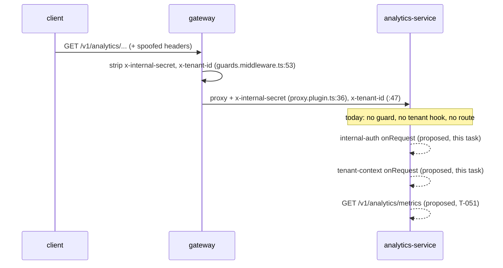

# S-9 — analytics-service internal-auth guard and tenant context

**Task**: S-9 (`.claude/rules/known-gaps.md`, read from disk at `1220051`) · **Gate 1 — plan only**
**Slice 1 of 2.** Gate 0 proposed T-051 and the user chose **scope B**: harden first, endpoint
second. T-051 (`GET /v1/analytics/metrics`) is slice 2 and is **not in scope here**.

**Rules revision read.** `.claude/rules/known-gaps.md` was read **from disk**, not from the
injected copy — S-24 has fired twenty-seven times. Disk at `1220051`: `md5 e4211f13…`, 3 850
lines, **48 entries running S-5 → S-56**, with **S-8 absent** (retired at `493e699`, three
commits ago). Every injected copy in this session ended at S-39 and still contained S-8. All
citations below are to the disk text.

---

# Part 1 — for the analyst

## 1. In plain terms

The analytics service is on the network and has no lock on its door.

The gateway already forwards every `/v1/analytics/...` request to it and already attaches the
shared secret that means *"this came through the gateway"*. Analytics does not look at that
secret. It does not look at the tenant header either. It has no lock to check them with: its
middleware folder is empty, and the secret is not even among the settings it reads at startup.

Today that costs nothing, because analytics serves exactly one thing — a health check — and
health checks are meant to be public. The cost arrives the moment the first real analytics
endpoint lands, because that endpoint returns **one tenant's usage figures**. If the lock is
not already fitted when the door is cut, the first release of the analytics API is one anybody
on the network can read, from any tenant, by guessing a URL.

This task fits the lock while there is nothing behind the door. It adds three things analytics
is alone among the six services in lacking: the check that a caller is the gateway, the step
that works out which tenant the request is for, and the startup setting that holds the shared
secret. Nothing a user can see changes. The health check stays public.

**What it costs if this is wrong.** Two directions, both small and both caught by the gate:

- *Too strict* — the secret becomes a required startup setting, so any deployment that does
  not supply it refuses to start. That is loud, immediate, and fixed by one line of
  configuration. This plan changes every configuration file that runs analytics, in the same
  commit, so the only way to hit it is to deploy from an older config.
- *Too lax* — the lock is fitted but not connected to anything. This is the real risk and §2
  D1 is about it.

**What it cannot deliver.** Measured, not assumed: **a guard registered around zero routes is
completely inert** — Fastify never runs it (probe P1a, Appendix). So slice 1 can prove the
lock *works* and can prove `/health` is *outside* it, but it cannot prove the lock is *on the
door*, because there is no door until T-051. That limit is stated again in §3, in §8, and is
carried forward as a narrowed S-9 rather than left in this file, which nothing may read as a
record.

### The request path, and which half of it exists



Solid arrows exist and cite the line they come from. Dashed arrows are **proposed** and do not
exist on this tree — the first two land in this task, the third in T-051.

## 2. Decisions needed from the user

### D1 — Does `src/app.ts` gain the guarded scope **now**, with no routes inside it? *(changes the diff, the test set, and the T-051 hand-off)*

This is the only decision that changes the shape of the work rather than a detail of it.

**Why it is a question at all.** The precedent shape (billing, T-046) is an encapsulated
`app.register(...)` scope carrying both hooks, with `/health` registered on the root instance
*outside* it. Analytics has no such scope — `src/app.ts` is 34 lines registering one route. And
measured at fastify 5.10.0 / Node v22.22.2 (probe **P1a**): an `app.register` scope containing
hooks and **no routes** never runs those hooks, for any request, including a 404 under the
prefix. An empty scope is not a weak guard; it is no guard.

| | **A — wire the empty scope now** *(recommended)* | **B — ship the modules, defer the wiring to T-051** |
|---|---|---|
| `src/app.ts` in the diff | yes, ~12 lines | no |
| What slice 1 proves behaviourally | the factories work (probe route, P2c); `/health` is reachable with no secret and **goes `401` if it moves inside the scope** (P2b) | the factories work, only |
| Dead-ish code at commit | an inert scope a reviewer may read as dead | two middleware modules nothing imports |
| Risk it is meant to remove | removed: T-051 adds `registerAnalyticsRoutes(analyticsApi, …)` **inside** an existing guarded scope | retained: T-051 must remember to create the scope *and* put the route in it |
| S-9's own wording | satisfied — *"add the guard before the first tenant-scoped route, not after"* | arguably not: the guard exists, the wiring does not |

**Recommendation: A.** The part of this work that is easy to get wrong is not the comparison —
that is one shared helper — it is the *wiring*: which hook, which phase, which order, and what
is structurally outside it. Landing the wiring now is what makes T-051 a route addition rather
than a route-plus-security-composition. And A is not untestable: P2b shows the one production
property that *is* falsifiable while the scope is empty — `/health` outside it. Under B that
case cannot exist at all.

**What changes under B:** drop slice S5 entirely, drop the `/health` exemption case, drop
`src/app.ts` and `src/middleware/index.ts` from the file set, and the S-9 narrowing in S6 has
to say the guard is written but unwired — a materially weaker entry.

### D2 — What does a rejected request get back? *(changes the diff, not the design)*

The three shipped guards disagree, and there is no single "post-S-8 shape" to copy:

| Service | Mechanism | Body |
|---|---|---|
| usage (`internal-auth.middleware.ts:40`) | `throw InternalAuthRequiredError` → global handler | `{ code, message }` |
| billing (`:81-83`), worker (`:65-67`) | `return reply.status(...).send(...)` | `{ code }`, no message |

- **A — billing/worker's bare `{ code: "UNAUTHORIZED" }`** *(recommended)*
- **B — usage's `{ code, message }`**

**Recommendation: A.** Analytics is tenant-facing behind the gateway, which is billing's
tenant-facing scope exactly; billing's own docblock (`:64-69`) argues the bare body
deliberately — an identical response for a *missing* and a *wrong* secret does not tell an
unauthenticated caller whether it guessed the header name. A is also 2-of-3 by count and needs
no new error class. **Cost of being wrong: one error class and three assertions.**

Note this decides the **guard** only. Tenant-context failures use `AppError` subclasses and
therefore `{ code, message }` under either option, exactly as billing does — §5 D4.

### D3 — Does `buildAnalyticsServiceApp` take an `options.internalApiSecret` override, and an `InternalApiSecretMissingError` blank guard? *(changes the diff)*

Billing (`app.ts:31,46-48`) and worker both have both. usage-service has neither.

- **A — neither** *(recommended)*
- **B — both, mirroring billing**

**Recommendation: A.** Billing's own comment says the blank guard is reachable *only* through
the options arm (`app.ts:42-45`), and the options arm exists because billing's and worker's
smoke suites pass an 11-character secret. **Analytics' smoke suite needs no secret**: it builds
the app and fetches `/health` (`tests/smoke.test.ts:18,27`), which is outside the scope under
D1-A. With no options arm there is no path that can deliver a blank secret past the schema, so
the guard would be code no test can reach — and `.claude/rules/testing.md` treats a case that
cannot fail as worse than an absent one. Stated as measured, not as a universal: *with the
field declared as `internalApiSecretSchema` and no options arm, I found no call path that
reaches `buildAnalyticsServiceApp` with a blank secret*; §7 S3 names the mutation that would
create one. **Cost of being wrong: one error class, one `if`, one test.**

### D4 — What happens to the S-9 entry itself? *(changes the file set)*

- **A — narrow S-9 in place, retire it at T-051** *(recommended)*
- **B — delete S-9 now**
- **C — leave S-9 untouched**

**Recommendation: A.** After this task S-9's headline — *"has no service-to-service auth and no
`INTERNAL_API_SECRET`"* — is false, so C ships a knowingly-wrong authoritative file, which
`.claude/rules/review-standards.md` grades HIGH. But B is also wrong under D1-A: the residue
(*the guard is wired and protects zero routes; T-051 must register inside the existing scope*)
is real and `CLAUDE.md` forbids `docs/plans/` being the record of it. A keeps the id, states
the residue, and names T-051 as the discharge. **Cost of being wrong: a docs edit.**

### Settled here — recorded so they are not re-opened

- **S5** The tenant-context middleware ships in slice 1 alongside the guard, not in T-051.
  S-9's scope is layers 2 **and** 3 of `.claude/rules/tenant-isolation.md`, and separating them
  would put the hook-ordering question — the part P1c shows is genuinely easy to get wrong —
  inside the endpoint task.
- **S6** Both hooks are `onRequest`. Forced, given the tenant hook is `onRequest`: see §5.2.
- **S7** No public-route allowlist. `/health` is outside the scope structurally, billing's
  shape (`tenant-context.middleware.ts:29-32`), not usage-service's `public-routes.ts` set.
- **S8** The secret field is `internalApiSecretSchema` **by identity**, never re-declared.
- **S9** No new Redis keys, no database access, no migration, no Prisma change.

## 3. Scope and non-goals

**In scope**: analytics-service's internal-auth guard, tenant-context middleware, `constants.ts`
additions, `errors/index.ts`, `types/index.ts`, the `INTERNAL_API_SECRET` env field, the two new
unit suites, the env-suite extension, `src/app.ts` wiring (D1-A), and the four configuration
artifacts that must carry the new required variable.

**Deliberately left broken / not done:**

- **The guard protects zero routes until T-051.** The honest limit, stated three times on
  purpose. Carried forward as the narrowed S-9 (D4-A).
- **S-54 — no maximum length on `internalApiSecretSchema`.** Analytics inherits it: a secret of
  16 384 printable-ASCII characters is accepted by the fragment (re-measured here, probe P2d,
  `success=true` at 8 192) and every service starts on it, then every request fails `431` with
  the upstream seeing nothing. **Noted, not fixed** — the ceiling belongs on the shared
  fragment, which is a four-service change and not this task's.
- **S-19 — analytics' `base.repository.ts` has no `TimeZone` pin**, and `grep -rn "extends
  TenantScopedRepository" apps/*/src` gives **nine** lines, **four** real subclasses across
  billing (2), usage (1) and worker (1); analytics' single hit is the docstring example at
  `base.repository.ts:29`. So analytics has **zero** real subclasses. Not this slice's problem —
  this slice creates no repository. **T-051 creates the first one** and inherits S-19 there.
- **S-39** — `x-tenant-id` literals still in gateway's and usage-service's constants. Analytics
  derives from `TENANT_CONTEXT_HEADERS.TENANT_ID` and adds no fourth copy; rewiring the other
  two stays its own task.
- **S-56** — the platform emits zero spans. Nothing in this plan claims tracing observes
  anything, and no assertion here depends on a span existing.
- **S-12** — `pnpm format:check` cannot pass and is not run.
- **Q11** is the only undecided gate in `docs/epics/README.md` and is scoped to Epic 11. **Q3**
  is decided and gates T-051/T-052/T-053 only — not this slice.

---

# Part 2 — for the implementer

## 4. Ground truth — each claim with the command that established it

### 4.1 What analytics has today

```
$ find apps/analytics-service/src/middleware -type f
apps/analytics-service/src/middleware/index.ts        # 11 bytes: `export {};`

$ grep -n "INTERNAL_API_SECRET" apps/analytics-service/src/config/env.ts
(no match)

$ sed -n '5,26p' apps/analytics-service/src/config/env.ts
# six fields: NODE_ENV, PORT, DATABASE_URL, REDIS_URL, OTEL_EXPORTER_OTLP_ENDPOINT, LOG_LEVEL
```

`src/app.ts` is 34 lines and registers one route, `ANALYTICS_ROUTES.HEALTH`, at `:25`.
`src/errors/index.ts` is a single re-export line. `src/types/index.ts` is `export {};`.

### 4.2 The service is reachable and the secret is already on the wire

- `apps/gateway/src/constants.ts:37` — `GATEWAY_PROXY_PREFIXES.ANALYTICS: "/v1/analytics"`.
- `apps/gateway/src/plugins/proxy.plugin.ts:71-75` — the analytics proxy route is registered
  with `internalApiSecret`.
- `apps/gateway/src/plugins/proxy.plugin.ts:36` — `[GATEWAY_HEADERS.INTERNAL_SECRET]:
  internalApiSecret`, set **unconditionally**, on every proxied request, before the
  auth-context branch.
- `apps/gateway/src/plugins/proxy.plugin.ts:47` — `x-tenant-id` injected from `authContext`.
- `apps/gateway/src/middleware/guards.middleware.ts:53` — inbound copies of all four spoofable
  headers are stripped first.

### 4.3 The four current guard properties, re-derived on this tree

Not taken from S-9's fix direction, which predates S-8 and points at a file that has since
changed.

| Property | usage `:2,43,59` | billing `:2,80,82` | worker `:2,64,66` |
|---|---|---|---|
| comparison | `secretsMatch` | `secretsMatch` | `secretsMatch` |
| phase | `onRequest` | `onRequest` (both scopes) | `onRequest` |
| status source | error class | `BILLING_RESPONSES.HTTP_STATUS_UNAUTHORIZED` | `WORKER_RESPONSES.HTTP_STATUS_UNAUTHORIZED` |
| non-string header | rejected | rejected | rejected |

```
$ grep -rn "secretsMatch" apps/*/src --include=*.ts | grep -v "^.*: \*"
apps/{billing,worker,usage}-service/src/middleware/internal-auth.middleware.ts  # import + call, each
$ grep -rn "INTERNAL_API_SECRET:" apps/*/src/config/env.ts
gateway:29, billing:38, worker:57, usage:28   # all four `internalApiSecretSchema`
```

`secretsMatch` is `packages/shared-utils/src/index.ts:65` — SHA-256 digests into
`crypto.timingSafeEqual`. `internalApiSecretSchema` is
`packages/shared-validation/src/index.ts:96-100` — `.string().trim().min(32).regex(/^[\x20-\x7E]+$/, …)`,
in that order, which that file's docblock records as load-bearing.

So analytics must derive all four from the current tree. Writing any of them out locally — a
`!==`, a `preHandler`, a literal `401`, or a re-declared zod chain — makes analytics a **fifth
strictness** on the day it lands, which is the defect S-8 existed to remove.

### 4.4 Hook phase and order — measured here, not cited

Probe **P1c/P1d**, fastify 5.10.0 / Node v22.22.2, inside an encapsulated scope:

```
registration=["auth-preHandler","tenant-onRequest"]  runOrder=["tenant","auth"]
registration=["tenant-onRequest","auth-preHandler"]  runOrder=["tenant","auth"]
both onRequest, auth registered first                runOrder=["auth","tenant"]
both onRequest, tenant registered first              runOrder=["tenant","auth"]
```

This independently reproduces T-046's result
(`apps/billing-service/src/middleware/tenant-context.middleware.ts:10-23`): a `preHandler`
guard beside an `onRequest` tenant hook derives tenant context **before** the caller proves it
is internal, in **both** registration orders — which
`.claude/rules/tenant-isolation.md` § *Forbidden* names explicitly. Registration order does not
fix it; the phase does.

Stated no stronger than measured: this is not "`onRequest` is the only correct phase". Both
hooks at `preHandler` with the guard registered first also orders correctly (billing's `app.ts`
records the seven-configuration sweep). What is forced is the **conditional**: *given* the
tenant hook is `onRequest`, the guard must be `onRequest` and registered first.

### 4.5 An empty scope is inert — the fact that shapes D1

Probe **P1a**:

```
empty scope with an onRequest hook:  GET /health               -> 200  hookRan=[]
empty scope with an onRequest hook:  GET /v1/analytics/metrics -> 404  hookRan=[]
```

and with one route inside (**P1b**), the hook runs for that route and **not** for a 404 at a
sibling path. So a scoped hook covers exactly the routes registered in its scope — no more, and
with zero routes, none.

### 4.6 `/health` exemption — the mutation that falsifies it

Probe **P2a/P2b**, real `secretsMatch` and real `tenantIdSchema`:

```
/health registered OUTSIDE the scope, no secret -> 200 {"status":"ok"}
/health MOVED INSIDE the scope,       no secret -> 401 {"code":"UNAUTHORIZED"}
```

This is the case §8 AC6 asks for, and it is the **only** behavioural property of the production
wiring that can go red while the scope holds no routes.

### 4.7 Baselines, measured now

```
$ pnpm --filter @telemetry/analytics-service test
Test Files  5 passed (5)
      Tests  30 passed (30)
```

The stderr `Error: load failure … code: 'EACCES'` in that run is
`tests/index.graceful-shutdown.unit.test.ts`'s own deliberate throw on its non-ENOENT path, not
a failure. HEAD `1220051`, tree clean.

Database, read-only check before any work: `Tenant` **2**; `Event`, `UsageLine`, `Invoice`,
`InvoiceLineItem`, `Meter`, `MetricRollup` all **0**. No probe in this plan writes to Postgres
or to Redis.

### 4.8 The new variable must reach four places or something breaks

`internalApiSecretSchema` has **no default**, and `src/config/env.ts` parses at module load
(`export const env = parseEnv(EnvSchema, process.env)`, `:30`), which `src/app.ts:3` imports.
So every consumer must supply it:

| Artifact | Today | Consequence if not updated |
|---|---|---|
| `apps/analytics-service/tests/setup.ts` | no `INTERNAL_API_SECRET` (11 lines) | **every suite importing `src/app.ts` or `src/config/env.ts` fails to collect** — measured, not all 30; see §10 |
| `apps/analytics-service/.env.example` | absent | local `pnpm dev` refuses to start |
| `docker/docker-compose.yml` analytics block (`:122-138`) | `<<: *common-app-env` + `PORT` only; the anchor has no secret, and the four services that have one write it inline (`:93,112,159,185`) | the analytics container crash-loops |
| `.github/workflows/ci.yml:48` | job-level `INTERNAL_API_SECRET` already present, 45 chars | — but turbo runs strict-env, so `tests/setup.ts` is what actually feeds `pnpm test` (worker's `tests/setup.ts:16-17` records this) |

Billing and worker both use `"test-internal-api-secret-change-in-production"` in `tests/setup.ts`
(45 chars, printable ASCII) — accepted by the fragment, re-measured at P2d. Use the same value:
a third spelling is a third thing to keep in step.

### 4.9 Divergences between the epic and the code

`docs/epics/epic-9-analytics-service.md` declares **no task** for this work — it has T-050 and
T-051/052/053 only. So there is no epic contract to check this against, and nothing here can be
"wrong about the epic". Two adjacent notes, neither in scope:

- T-050's snippet at `:24-33` still shows `PORT` defaulting to `3005` as a literal; the shipped
  code derives it from `ANALYTICS_SERVICE_STARTUP.DEFAULT_PORT`. Cosmetic, pre-existing.
- **S-53** already records that the epic's T-051 rollup snippet applies `AT TIME ZONE 'UTC'` to
  the *column*, which `CLAUDE.md` names as the mistake. That is T-051's problem, not this one.

## 5. Files to change

### Added — production (4)

| File | Content |
|---|---|
| `apps/analytics-service/src/middleware/internal-auth.middleware.ts` | `buildInternalAuthMiddleware(secret)` — `secretsMatch`, non-string rejected, returned `reply` with the status constant (D2-A) |
| `apps/analytics-service/src/middleware/tenant-context.middleware.ts` | `analyticsTenantContextHandler` — `tenantIdSchema`, two distinct errors |
| — | *(no new `public-routes.ts`; `/health` is structurally outside — settled S7)* |

### Modified — production (6)

| File | Change |
|---|---|
| `src/config/env.ts` | `INTERNAL_API_SECRET: internalApiSecretSchema` — by identity, no local chain |
| `src/constants.ts` | `ANALYTICS_HEADERS` (derived from `INTERNAL_AUTH_HEADERS` / `TENANT_CONTEXT_HEADERS`), `ANALYTICS_RESPONSES` gains `CODE_UNAUTHORIZED`, `HTTP_STATUS_OK/UNAUTHORIZED`, and the tenant-context code/message pairs |
| `src/errors/index.ts` | `TenantContextMissingError`, `TenantContextInvalidError` (billing's `errors/index.ts:23-49` verbatim in shape, analytics constants) |
| `src/types/index.ts` | `declare module "fastify"` → `tenantId?: TenantId` — **optional and branded**, billing's `types/index.ts:27` reasoning applies unchanged (hooks are scoped, so for `/health` the property genuinely is absent) |
| `src/middleware/index.ts` | barrel, billing's two-line form. *(Worker's barrel is still `export {};` despite having a guard — do not copy that.)* |
| `src/app.ts` | **D1-A only.** `app.register` scope with both `onRequest` hooks, guard first; `/health` stays at `:25` on the root instance; side-effect `import "./types"` |

### Added — tests (2)

- `apps/analytics-service/tests/internal-auth.middleware.unit.test.ts`
- `apps/analytics-service/tests/tenant-context.middleware.unit.test.ts`

### Modified — tests / config / docs (5)

- `apps/analytics-service/tests/env.schema.unit.test.ts` — extend; the existing case
  `"declares exactly the six documented fields"` (`:439`) and its `EXPECTED_ENV_FIELDS` **must**
  be updated, and that case is a genuine red (§7 S1).
- `apps/analytics-service/tests/setup.ts`
- `apps/analytics-service/.env.example`
- `docker/docker-compose.yml`
- `.claude/rules/known-gaps.md` — S-9 narrowed (D4-A)

`package.json` needs **no** change: analytics already depends on `@telemetry/shared-utils`,
`@telemetry/shared-validation` and `@telemetry/shared-types` (verified against
`apps/analytics-service/package.json`), the same three billing imports.

## 6. Implementation slices — smallest safe first

Pseudo-TDD throughout (`.claude/rules/testing.md`): skeletons → bodies → **confirm red** →
implement → refactor on green. Report which cases were red, honestly — most of S1's and S5's
guards are new-behaviour tests and only the ones named below actually start red.

### S1 — the env field and its plumbing
**Controlling path**: `src/config/env.ts:5-26` → `parseEnv` at `:30`, imported by `src/app.ts:3`.
**Do**: extend `tests/env.schema.unit.test.ts` (field cases + the identity assertion + update
`EXPECTED_ENV_FIELDS` to seven); then add the field; then `tests/setup.ts`, `.env.example` and
the compose block **in the same slice** — the service must still boot at the end of every slice.
**Hypothesis**: the existing shape case goes red before the source changes and green after.
**Falsified if**: `"declares exactly the six documented fields"` passes unchanged after the field
is added — which would mean the assertion is not reading the real schema.

### S2 — constants, errors, types
**Controlling path**: `src/constants.ts` → `src/errors/index.ts` → `src/types/index.ts`.
**Hypothesis**: no behaviour change; `pnpm --filter @telemetry/analytics-service typecheck` and
the 30-case baseline stay green.
**Falsified if**: any existing case moves.

### S3 — the internal-auth guard
**Controlling path**: `buildInternalAuthMiddleware(secret)` → `request.headers[ANALYTICS_HEADERS.INTERNAL_SECRET]` → `secretsMatch` → `reply.status(ANALYTICS_RESPONSES.HTTP_STATUS_UNAUTHORIZED).send({ code })`.
**Hypothesis**: a correct secret passes; absent, wrong, prefix, superstring, one-byte-variant and
duplicated all `401` with a **byte-identical** body.
**Falsified if**: the missing-secret and wrong-secret bodies differ — that is the oracle billing's
`:64-69` refuses.
**Mutation for the D3-A universal**: adding an `options.internalApiSecret` arm to
`buildAnalyticsServiceApp` re-creates a blank-secret path; if D3-B is chosen instead, the blank
guard and its case come back with it.

### S4 — the tenant-context middleware
**Controlling path**: `analyticsTenantContextHandler` → `tenantIdSchema.safeParse` → `request.tenantId`.
**Hypothesis**: a UUID binds **byte-identically** (the schema is a type-level cast with no runtime
effect); absent/blank → `TenantContextMissingError`; non-UUID and the comma-joined value a
duplicated header arrives as → `TenantContextInvalidError`.
**Falsified if**: the bound value differs from the header sent, or a duplicated header is reported
as *missing* rather than *invalid*.

### S5 — `src/app.ts` wiring *(D1-A only)*
**Controlling path**: `buildAnalyticsServiceApp` → `app.get(ANALYTICS_ROUTES.HEALTH)` at root →
`app.register(async (analyticsApi) => { addHook onRequest guard; addHook onRequest tenant; })`.
**Hypothesis**: `GET /health` with **no** secret returns `200`, and moving that route inside the
scope turns it `401` (P2b).
**Falsified if**: `/health` answers `401` on the shipped tree, or still answers `200` after the
mutation — the second means the hooks are not wired to that scope at all.

### S6 — narrow S-9 *(D4-A)*
**Do**: rewrite the entry to state what now exists, what the residue is (zero guarded routes),
and that T-051 discharges it by registering inside the existing scope. Do not renumber.

## 7. Test plan and acceptance-coverage mapping

Case ids `AU1…` (analytics unit), continuing this repo's per-service convention. Every literal
comes from a constant — `.claude/rules/constants.md` applies to tests.

| AC | Acceptance criterion | Cases |
|---|---|---|
| AC1 | `INTERNAL_API_SECRET` is declared as `internalApiSecretSchema` **itself** | `AU1` `expect(EnvSchema.shape.INTERNAL_API_SECRET).toBe(internalApiSecretSchema)` — reddens on any local re-declaration even with identical spelling, which the other four services all assert (`gateway:122`, `usage:254`, `billing:536`, `worker:940`) |
| AC1 | the schema declares exactly seven fields, in order | `AU2` (the updated existing case at `:439`) |
| AC1 | a missing / short / all-whitespace / non-ASCII secret is refused at module load | `AU3`–`AU6` |
| AC2 | a correct secret passes the guard | `AU7` |
| AC2 | absent, wrong, prefix, superstring, one-byte-variant secrets all `401` | `AU8`–`AU11` |
| AC2 | a duplicated header is rejected even when one value is correct | `AU12` (billing `BU131`'s shape) |
| AC2 | a non-string header value is rejected without picking an element | `AU13` (billing `BU137`) |
| AC3 | missing and wrong answer with a **byte-identical** body | `AU14` (billing `BU132`) |
| AC3 | the comparison routes through the shared helper, not an inline compare | `AU15` — source-shape assertion over the middleware file, billing `BU135`'s form. Needed because no behavioural test can distinguish `secretsMatch` from `!==`; they return the same boolean for every input |
| AC3 | the unauthorized status is written as a constant, not a literal | `AU16` (billing `BU136`) |
| AC4 | a valid `X-Tenant-Id` binds byte-identically to `request.tenantId` | `AU17` |
| AC4 | absent / blank → `TenantContextMissingError` | `AU18`, `AU19` |
| AC4 | non-UUID → `TenantContextInvalidError` | `AU20` |
| AC4 | a duplicated `X-Tenant-Id` is *invalid*, not *missing*, and no value is preferred | `AU21` |
| AC5 | guard runs **before** the tenant hook; a request with no secret never derives tenant context | `AU22` — composed app, assert on the **code** each hook returns, not on a status both share (billing `BU79`'s reasoning). Red if the guard is moved to `preHandler` (P1c) |
| AC6 | `/health` is reachable with **no** secret | `AU23` against the real `buildAnalyticsServiceApp()` — **red under the mutation "move `/health` inside the scope"** (P2b) |

**Helpers must throw, never no-op.** The source-shape reader for `AU15`/`AU16` and the
`buildEnvWithout`-style fixtures must throw when the thing they look for is absent — analytics'
own `tests/env.schema.unit.test.ts:43-51` already sets this precedent and cites it.

**The honest limit, stated for the record.** `AU7`–`AU22` drive a **test-owned** app: a bare
Fastify instance composed with the real factories plus a probe route, because production has no
route inside the scope (P1a). `AU23` is the only case that drives the shipped
`buildAnalyticsServiceApp`. **No test in this task proves that a future tenant-scoped route is
inside the guarded scope** — T-051 owns that, and the narrowed S-9 says so.

## 8. Validation commands

Task-scoped, after the first substantive edit and between slices:

```bash
pnpm --filter @telemetry/analytics-service typecheck
pnpm --filter @telemetry/analytics-service lint
pnpm --filter @telemetry/analytics-service exec vitest run tests/env.schema.unit.test.ts
pnpm --filter @telemetry/analytics-service exec vitest run tests/internal-auth.middleware.unit.test.ts
pnpm --filter @telemetry/analytics-service exec vitest run tests/tenant-context.middleware.unit.test.ts
pnpm --filter @telemetry/analytics-service test
```

`pnpm --filter <pkg> test -- <file>` does **not** scope to a file; use `exec vitest run`
(`CLAUDE.md`).

Cross-service, because the env field is new and gateway talks to this service:

```bash
pnpm --filter @telemetry/gateway test
```

Full gate before hand-off, **with `--force`** so turbo replays nothing:

```bash
pnpm build --force && pnpm test --force && pnpm lint --force && pnpm typecheck --force
```

13/13 packages reported. `pnpm test` needs live Postgres and Redis
(`.claude/rules/testing.md`); both are up and must stay up. `pnpm format:check` is **not** run —
S-12. If `pnpm install` is needed: `--store-dir /home/admin1/snap/code/258/.local/share/pnpm/store/v10`.

Configuration check, since a required variable is new:

```bash
grep -n "INTERNAL_API_SECRET" apps/analytics-service/.env.example \
  apps/analytics-service/tests/setup.ts docker/docker-compose.yml
# expect: 1 + 1 + 5 lines (the four existing, plus analytics)
```

## 9. Risks and mitigations

| # | Risk | Mitigation |
|---|---|---|
| R1 | A new required env var with no default breaks any runner that does not supply it. | All four artifacts in the same commit (§4.8); the grep in §8 counts them. |
| R2 | The guard is fitted and never connected, because T-051 registers its route outside the scope. | D1-A lands the scope now; the narrowed S-9 (D4-A) is the durable record. `docs/plans/` is explicitly **not** a record. |
| R3 | Analytics becomes a fifth strictness — a local zod chain, a `!==`, a `preHandler`, a literal `401`. | `AU1` (identity), `AU15`/`AU16` (source shape), `AU22` (phase). All four re-derived in §4.3 rather than copied from S-9's pre-S-8 wording. |
| R4 | An inert scope reads as dead code at Gate 4. | Named in §3, in D1, and anchored to P1a. The reviewer should be told it is inert **by measurement**, not assumed to be live. |
| R5 | S-54's missing ceiling now reaches a sixth declaration site. | Noted, not fixed; §3. Analytics adds no new rule, only a fifth derivation of the existing one. |
| R6 | `AU22` asserts an ordering that both correct pairings satisfy, and passes vacuously. | Assert on the **code** each hook returns, not a shared status; confirm red by moving the guard to `preHandler` (P1c gives the expected `["tenant","auth"]`). |
| R7 | `AU23` is the only production-path case and could pass for the wrong reason. | Confirm it red with the `/health`-inside-the-scope mutation (P2b), and say in the hand-off that it was. |
| R8 | The compose analytics block uses a YAML anchor; adding the key inline may be done wrong. | The four services that carry it write it inline under `environment:` (`:93,112,159,185`); do the same rather than editing `x-common-app-env`, which would hand the secret to every service including ones that have their own line. |
| R9 | Fastify/Node version drift invalidates P1a–P2c. | Every probe states fastify 5.10.0 / Node v22.22.2; re-run the appendix if either moves. |

## 10. Pending task checklist

- [done] **Gate 1** — this plan, and the four decisions in §2 answered
- [done] Gate 2 — approval (D1=A, D2=billing's bare `{code}`, D3=neither, D4=narrow in place)
- [done] Gate 3 — S1…S6, pseudo-TDD, red confirmed before green in every slice. Analytics
  30 -> 56 tests (7 files); root 1040 -> 1066, 13/13 packages green on
  `build`/`test`/`lint`/`typecheck --force`. Three deviations from this plan, each reported in
  the hand-off: two extra env cases (`AU24`) driving `parseEnv` through a real import, one extra
  wiring case (`AU22b`) reading `src/app.ts`'s registration text because nothing behavioural can
  observe it while the scope is empty, and a correction to
  `.claude/rules/tenant-isolation.md`, whose layer-2 paragraph and *Known gaps* note this change
  made false. §4.8's "all 30 existing tests fail at import" is wrong in both directions and has
  now been measured twice, on two different trees — **the figures below are the shipped tree's,
  and the earlier pair is labelled with the tree that produced it**, which is the correction
  Gate 4 asked for (LOW-3; S-33's shape inside this plan).

  **Shipped tree** (7 files / 56 cases), deleting `tests/setup.ts`'s `INTERNAL_API_SECRET` line
  and running `vitest run`: `Test Files 4 failed | 3 passed (7)`, `Tests 16 passed (16)` — so
  **4 of 7 files collect zero tests and 40 of 56 cases never run**. The four that fail at import
  are `env.schema`, `internal-auth.middleware`, `smoke` and `config/container`; the three that
  survive are `prisma.singleton` (4), `index.graceful-shutdown` (7) and
  `tenant-context.middleware` (5), none of which imports `src/app.ts` or `src/config/env.ts`.

  **Intermediate tree, measured during S1–S3** — `env.schema.unit.test.ts` already at 19 cases,
  the two middleware suites not yet written, so 5 files / 37 cases: **3 of 5 files collecting zero
  tests, 26 of 37 cases never running**. That tree was never committed, which is exactly why the
  figures could not be reproduced at review and why they are labelled here rather than quoted
  bare.
- [done] Gate 4 — Senior Reviewer (pre-QA) — **CHANGES REQUESTED, Round 1**, reworked on the same
  tree. `docs/reviews/s-009-analytics-internal-auth.md`. The load-bearing universal (the inert
  scope) survived sixteen further forms and six hook phases and needed no change. Fixed:
  **MEDIUM-1** a false universal in the test docblock, refuted by execution and re-derived here in
  both operand orders; **MEDIUM-2** the third copy of the tenant-context vocabulary, recorded as
  **S-57** rather than promoted (user ruling, S-39's precedent); **LOW-1** S-9 said "each of those
  three" against four properties — the returned `reply` is guarded by nothing and no case was
  added, because there is no behavioural difference to guard; **LOW-2** `.env.example` value and
  comment, plus **S-58** for the pre-existing split (recorded as three-way across five files, corrected at Round 2 to **two** values across **six**); **LOW-3** these figures, now
  labelled by tree; **LOW-4** epic-9's T-051 **Files** line and S-9's discharge paragraph;
  **LOW-5** a lint provenance citation (`d68e719`, not `1b872b3` — the wrong file was queried);
  **NIT-1** AU23b's justification, rewritten around the mutation that reddens it alone.
- [done] Gate 4 re-review — **APPROVED FOR QA**, two text-only MEDIUMs carried to this batch.
- [done] Gate 5 — QA **PASS**, `docs/qa/s-009-analytics-internal-auth.md`. Two new findings, both
  filed rather than fixed: **S-59** (a second, worse `AU15` evasion — the guard can compare with
  `===` while all three assertions stay green) and **S-60** (`pnpm --filter <pkg> exec vitest run`,
  the scoping command `CLAUDE.md` recommends, inherits the ambient environment where `pnpm test`
  does not, so an invalid ambient `INTERNAL_API_SECRET` reddens four of six services).
- [done] Gate 5/Round-2 batched rework — **no executable code moved.** MEDIUM-3: S-58's two wrong
  counts corrected at all three sites (**six** `.env.example` files, not five — the repo root was
  missed — and **two** distinct values, not three, because this task's own rework removed the
  third), plus QA O-1 (the analytics line is a net addition, not a value change). MEDIUM-4: S-57's
  universal rewritten to the measured two-of-three, with the accidental-partial-guard consequence
  and an ordering warning in its fix direction. S-24 gained this task's sighting **pair** — the
  first evidence the stale-snapshot condition is intermittent. S-33 gained a fourth-recurrence
  block and the argument to build the checker now.
- [done] Gate 6 — Senior Reviewer (final) — **CONDITIONAL**, four text-only fixes, all applied:
  **LOW-6** S-58's table cited `apps/analytics-service/.env.example:33` where the line is `:39`,
  moved by the six comment lines the same batch added above it — line numbers dropped from the
  whole table with the S-19/S-40/S-48 rule stated; **LOW-7** S-59 credited S-51's "four gates"
  progression to S-48 (`grep -c "four gates"` → 0 and 2); **LOW-8** QA's `AU16` aside corrected by
  **append**, not rewrite, with a forward pointer from the original row; **NIT-4** S-60 gained its
  auth-service row so "four of six" is derivable, plus the measured finding that auth is immune
  only to *this field* — `JWT_SECRET=short` reproduces the defect there; **NIT-5** S-59's
  byte-prefix claim labelled as inherited from S-8 rather than measured here. S-33 gained the
  round's new information: LOW-6 and LOW-7 are reached by the **citation** half of its proposal
  and by neither the count half nor the universals, so the half nobody has prioritised is the one
  with the most machine-decidable instances behind it.
- [ ] Gate 7 — CI validation
- [ ] Gate 5 — QA
- [ ] Gate 6 — Senior Reviewer (final)
- [ ] Gate 7 — CI validation
- [ ] Gate 8 — commit approval; one atomic commit; `docs/plans/` + `docs/reviews/s-009-analytics-internal-auth.md` in it

## 11. Approval gate

**Planning stopped here. No production code and no tests were written.** The only file this
gate created is this plan. The working tree is otherwise unchanged at `1220051`; the two probe
scripts were written under `apps/analytics-service/node_modules/` (gitignored) and deleted.
Postgres and Redis were left running, nothing was written to either, and the row counts in §4.7
were read, not modified.

**Four decisions are required before Gate 3**: **D1** (wire the scope now — changes the diff and
the test set), **D2** (rejection body — changes the diff), **D3** (options override and blank
guard — changes the diff), **D4** (what happens to the S-9 entry — changes the file set). D1 is
the one that changes the shape of the work; D2–D4 are each a small edit if reversed.

**Implementation may not begin until the user approves this plan and answers D1–D4.**

---

# Appendix — probe transcripts

All probes: fastify **5.10.0**, Node **v22.22.2**, run from a scratch module under
`apps/analytics-service/node_modules/.s9probe/` (gitignored; deleted afterwards) so that
`fastify`, `@telemetry/shared-utils` and `@telemetry/shared-validation` resolve. No database and
no Redis access.

## P1 — Fastify encapsulation and hook phase

```
P1a empty scope: /health=200 ran=[]
P1a empty scope: /v1/analytics/metrics=404 ran=[]
P1b /health=200 ran=[]
P1b /v1/analytics/metrics=200 ran=["scopedHook"]
P1b 404-in-prefix=404 ran=["scopedHook"]        <- cumulative array; unchanged, so the hook did NOT run
P1c registration=["auth-preHandler","tenant-onRequest"] runOrder=["tenant","auth"]
P1c registration=["tenant-onRequest","auth-preHandler"] runOrder=["tenant","auth"]
P1d both onRequest, first=auth   runOrder=["auth","tenant"]
P1d both onRequest, first=tenant runOrder=["tenant","auth"]
fastify 5.10.0 node v22.22.2
```

`ran` is cumulative across injections within each block — P1b's third line shows one element
both before and after the 404, i.e. the scoped hook did not run for the unmatched path.

## P2 — composed guard, `/health` exemption, secret fragment

Built with the real `secretsMatch` and the real `tenantIdSchema`. The tenant hook in this probe
threw **plain `Error`s** and the probe app registered **no** global error handler, which is why
the tenant failures below surface as `500`; in the service they are `AppError` subclasses and
`registerGlobalErrorHandler` (`packages/shared-utils/src/index.ts:178-183`) maps them to their
own `statusCode` and `{ code, message }`. The guard rows are unaffected — the guard returns a
reply rather than throwing.

```
P2a /health outside empty scope, no secret -> 200 {"status":"ok"}
P2b /health MOVED INSIDE scope, no secret  -> 401 {"code":"UNAUTHORIZED"}
P2b /health inside, WITH secret, no tenant -> 500        (probe-local error handling, see above)

P2c no headers           -> 401 {"code":"UNAUTHORIZED"}
P2c wrong secret         -> 401 {"code":"UNAUTHORIZED"}
P2c secret, no tenant    -> 500 ... "TENANT_CONTEXT_MISSING"
P2c secret, bad tenant   -> 500 ... "TENANT_CONTEXT_INVALID"
P2c secret + tenant      -> 200 {"tenantId":"11111111-1111-4111-8111-111111111111"}

P2d CI value         len=45    success=true  parsedLen=45
P2d setup.ts value   len=45    success=true  parsedLen=45
P2d 32 spaces        len=32    success=false err=String must contain at least 32 character(s)
P2d 31 chars         len=31    success=false err=String must contain at least 32 character(s)
P2d 8KB              len=8192  success=true  parsedLen=8192        <- S-54: no ceiling
P2d tab inside       len=33    success=false err=must contain only printable ASCII characters (U+0020-U+007E)
```

`P2c secret + tenant` returns the header byte-identically, which is `AU17`'s property: the
schema is `uuidSchema.transform(v => v as TenantId)` — a type-level cast with no runtime effect.

## P3 — S-19 subclass census, re-derived

```
$ grep -rn "extends TenantScopedRepository" apps/*/src
analytics-service/src/repositories/base.repository.ts:29   <- docstring example
auth-service/src/repositories/base.repository.ts:29        <- docstring example
billing-service/src/repositories/meter.repository.ts:35    <- real
billing-service/src/repositories/base.repository.ts:188    <- docstring example
billing-service/src/repositories/invoice.repository.ts:367 <- real
usage-service/src/repositories/base.repository.ts:30       <- docstring example
usage-service/src/repositories/usage.repository.ts:150     <- real
worker-service/src/repositories/base.repository.ts:29      <- docstring example
worker-service/src/repositories/event.repository.ts:73     <- real

$ grep -c "TIME_ZONE\|TimeZone" apps/analytics-service/src/repositories/base.repository.ts
0
```

Nine lines, four real subclasses across three services, **zero** in analytics. S-19's table
cites `invoice.repository.ts:94`; it is `:367` on this tree — that entry warns the column has
rotted before and says to re-run the grep, which this does.

## P4 — baselines

```
$ git log --oneline -1
1220051 docs: rule Q3 as fixed UTC, and file S-56 - the platform emits zero spans
$ git status --short          # clean

$ pnpm --filter @telemetry/analytics-service test
Test Files  5 passed (5) / Tests  30 passed (30)

$ md5sum .claude/rules/known-gaps.md ; wc -l .claude/rules/known-gaps.md
e4211f1365162329a7189dbdffc633b3  .claude/rules/known-gaps.md
3850 .claude/rules/known-gaps.md
$ grep -oP "^## \KS-\d+" .claude/rules/known-gaps.md | tr '\n' ' '
S-5 S-6 S-9 S-10 S-11 S-12 S-13 S-14 S-15 S-16 S-17 S-19 S-20 S-21 S-22 S-23 S-24 S-25
S-26 S-27 S-28 S-29 S-30 S-32 S-33 S-34 S-35 S-36 S-37 S-38 S-39 S-40 S-41 S-42 S-43 S-44
S-45 S-46 S-47 S-48 S-49 S-50 S-51 S-52 S-53 S-54 S-55 S-56
$ grep -n "^## S-8 " .claude/rules/known-gaps.md
(no match)   # retired at 493e699
```

## P5 — database state, read-only

```
$ PGPASSWORD=postgres psql -w -h localhost -U postgres -d telemetry -Atc \
  'SELECT (SELECT count(*) FROM "Tenant"), (SELECT count(*) FROM "Event"), (SELECT count(*) FROM "UsageLine"),
          (SELECT count(*) FROM "Invoice"), (SELECT count(*) FROM "InvoiceLineItem"),
          (SELECT count(*) FROM "Meter"), (SELECT count(*) FROM "MetricRollup");'
2|0|0|0|0|0|0
```

Tenant 2, everything else 0 — the required state, before and after, since nothing here writes.
