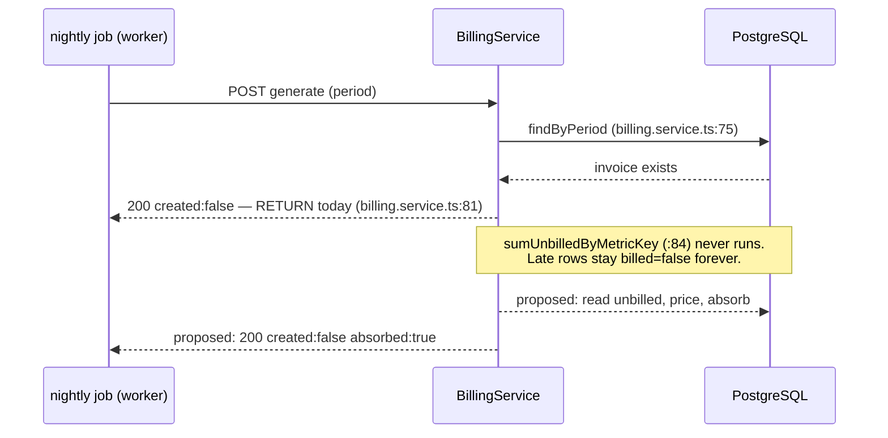

# S-45 — Usage landing in an already-invoiced window is never billed

**Task**: S-45 (local mode, not an epic task) · **Service**: billing-service · **Tree**: `07ed02a`, clean
**Gate**: 3 (Task Implementer) · **Status**: implemented, uncommitted. Gate-1 plan approved;
Gate-2 answers folded in (see *Open* below). Dispositions in §11.

---

# Part 1 — for the analyst

## 1. In plain terms

Every night a scheduled job asks the billing service to turn yesterday's usage into a draft
invoice for each customer. It works. What it does not do is notice usage that shows up *after*
that night's invoice was already written.

When a usage record arrives late — because the event pipeline was backed up, a worker restarted,
or a failed message was replayed — it is stamped with the time the *event* happened, not the time
it was processed. So it lands in yesterday's window. The billing service looks at that window,
sees an invoice already exists, and stops there. It never looks at the usage. The record is left
marked "not yet billed", and the next night's run looks at a different window, so nothing ever
looks at it again.

**The customer is not overcharged. They are undercharged, permanently, and nobody is told.**
The nightly job reports complete success — the same words it prints on a healthy night. A human
would only find it by going looking.

The gap that has to be crossed is roughly two hours of processing lag, because the job runs at
02:00 for a day that ended at midnight. This is ordinary operation, not an edge case.

**What changes.** Billing will notice the late usage and add it to the invoice that already
covers that day, raising the invoice total accordingly — automatically, with no human in the
loop. Invoices on this platform are drafts and nothing can finalise one today, so nothing that
has been "issued" is being altered. If that ever changes, billing will refuse to alter the
invoice and will raise a visible error instead of quietly doing either the wrong thing or
nothing.

**Who notices.** Customers, on their invoice totals, which become correct. Operators, through a
new response flag and log line telling them an absorption happened — today they cannot tell a
retro-billing from a no-op.

**What it costs if this is wrong.** Two things. If the absorption is not atomic, usage could be
marked "billed" without its charge appearing — which is worse than the gap being fixed, because
it destroys the only record that the money was ever owed. And billing writes into one table that
the database does *not* protect against cross-tenant writes (measured, §4.3), so a mistake there
would be a tenant-isolation defect rather than an accounting one. Both are addressed below and
both carry dedicated tests.



Solid arrows are the shipped path and cite the line they come from (appendix A.1, re-read at this
gate). The two dashed arrows are this task's proposal and do not exist.

---

## 2. Decisions

### D1 · **Absorb into a `DRAFT` invoice; refuse otherwise** — *settled by the user at Gate 1*

When an invoice already exists for the period and unbilled usage remains:

- invoice `status = DRAFT` → price the late usage and **add** it to that invoice, raising
  `totalAmount` and marking the rows billed. `200`.
- invoice `status ≠ DRAFT` → **refuse** with `409 INVOICE_IMMUTABLE`. Nothing is written.
- no unbilled usage → unchanged from today: `200`, the existing invoice, nothing written.

#### Rejected: **option 2 — a supplementary second invoice for the same period**

**Blocked at the database, measured** (probe A, appendix A.4): a duplicate insert raises `23505`
against `Invoice_tenantId_periodStart_periodEnd_key`, a live unique *index*, not deferrable. It
is therefore not a code choice but a forward-only migration — and that index is simultaneously:

- the endpoint's idempotency guarantee (T-045 D2, and `billing.service.ts:38-48` item 2);
- the serializer behind the `P2002` catch that S-38 is open about;
- the premise of T-046's pagination tie-break (`BILLING_INVOICE_LIST`, case `BI16`, whose comment
  reasons explicitly from "`@@unique([tenantId, periodStart, periodEnd])` makes `periodStart`
  near-unique per tenant").

Removing it does not cost this task a migration; it costs three other tasks their foundations.
Probe B additionally shows the *manual* workaround S-45 already measured — a narrower overlapping
window — is representable without any migration, and produces the overlapping invoice periods
that nothing on this platform is built to read. That is the state option 2 would make routine.

#### Rejected: **option 3 — refuse and surface, without billing anything**

The smallest change, and it needs **no worker change** — measured (probe E, appendix A.7): the
real `BillingClientService` and the real `runInvoiceGenerationJob` already count a `409` as
`failed: 1` and carry billing's error code into the log line. It was rejected because it leaves
the usage uncollected and routes every late event into a manual recovery — and the only manual
recovery available is the narrower-window call S-45 measured, which produces exactly the
overlapping invoices option 2 was rejected for. It converts a silent revenue loss into a nightly
alarm whose only remedy makes a different mess.

Its *refusal mechanism* is not discarded: D1 adopts it verbatim as the non-`DRAFT` arm.

### D2 · **Append, never merge** — *settled by the user at Gate 1*

Each absorption inserts its own `InvoiceLineItem` rows. No lookup of existing lines, no
arithmetic on them, no `upsert`.

Representable: probe C measured two line items with the same `metricKey` on one invoice, with no
constraint objecting — `InvoiceLineItem` has a primary-key index and **nothing else**, not even
an index on `invoiceId`.

**What an absorbed invoice then looks like.** A period in which `api.request` was billed twice —
once at generation, once by a later absorption — carries **two** line items both keyed
`api.request`, with different quantities and the same `unitPrice`, summing to the invoice total.
That is a faithful audit trail: each row records one tranche and when it was added.

**Flagged forward, not resolved here:** whoever renders an invoice must decide whether to show
those as two lines or group them for display. That is **T-047** (`GET /v1/billing/invoices/:id`,
`docs/epics/epic-8-billing-service.md:113`), which is the first thing on the platform to return
line items — today nothing does, and `INVOICE_HEADER_SELECT` excludes them structurally. The
plan writes that forward reference into the repository docblock so T-047's author meets it.

Merge was rejected on two measured grounds: it requires reading a table with no index on
`invoiceId` (probe C), and it collapses the audit trail into a single mutated row.

### D3 · The refusal reuses **T-048's declared error code**, not a new one

Existing billing error codes were checked first, and none fits: `TENANT_NOT_FOUND` (404),
`METER_NOT_FOUND` / `METER_CURRENCY_CONFLICT` (422), `USAGE_LINES_CHANGED` (409, "another writer
moved the rows"), `TENANT_CONTEXT_*` (401), `VALIDATION_ERROR`, `INTERNAL_ERROR`.

So a code is minted — but the *name* is taken from
`docs/epics/epic-8-billing-service.md` § **T-048** (heading at `:140`), whose **Error response**
line declares
`409 { code: 'INVOICE_IMMUTABLE', invoiceId, currentStatus }` for **T-048 · Invoice immutability
guard**. Using the same name means the platform ends with one code for "you may not mutate a
non-`DRAFT` invoice", not two. `HTTP_STATUS_CONFLICT: 409` already exists in
`BILLING_RESPONSES`.

**Divergence reported, not followed:** the epic's body carries `invoiceId` and `currentStatus` as
top-level fields. Every error this service emits is `{ code, message }` (T-045 D3, and the
controller's `AppError` arm). We keep the envelope and name the status in the message; the
invoice id and status go to **billing's log line**, where the operator reads them, rather than
into unread response fields. Recorded in §10 as divergence E1.

### D4 · One transaction, and the total moves by a **SQL** addition

All three writes — the line-item inserts, the `totalAmount` increase, the `billed` update — run
inside **one** `withTenant` transaction. A partial absorb that marked rows billed without adding
their charges would destroy the only record that the money was owed, which is worse than the gap
being fixed.

The total is raised with Prisma's `{ increment }`, **not** a read-modify-write in JavaScript.
Measured (probe I, appendix A.8) — the emitted SQL is

```
UPDATE "public"."Invoice" SET "totalAmount" = ("public"."Invoice"."totalAmount" + $1)
WHERE (("public"."Invoice"."tenantId" = $2 AND "public"."Invoice"."periodStart" = $3
        AND "public"."Invoice"."periodEnd" = $4) AND 1=1)
```

so the addition happens in PostgreSQL `numeric`, at the column's own precision. Verified exact at
the `Decimal(18,6)` boundary: `1234567.123456 + 0.000001` persisted as `1234567.123457`. A
read-modify-write would have put a `Decimal(18,6)` value through JavaScript and would also have
raced a concurrent absorber; `increment` does neither.

*The alternative rejected:* having the service read the current total, add, and write back. It
matches D2's "the service owns the arithmetic" layering, and it is wrong here — the read and the
write would be in different transactions unless the read moved into the repository anyway, at
which point `increment` is strictly better. The *pricing* arithmetic (quantity × unitPrice, and
the delta) stays in the service, where the meters are; the repository only asks the database to
add a number to a column.

### D5 · The response gains `absorbed`; **worker-service is not changed**

`GenerateInvoiceResult` and the success envelope gain `absorbed: boolean`, alongside the existing
`created`. Both false on a genuine no-op; `created: true` on a fresh invoice; `absorbed: true`
when late usage was added to an existing one. `201` still means and only means "this call
inserted the invoice"; an absorption is a `200`.

Without it the platform fixes the money and keeps the silence at the observability layer: an
operator still cannot distinguish "nothing to do" from "we just retro-billed forty lines onto
yesterday's invoice", and the *rate* of late usage is the signal that says the ingest pipeline is
lagging.

**Additive and non-breaking, measured** (probe H, appendix A.7): worker's client reads the body
with a cast, not a schema (`(await response.json()) as GenerateInvoiceResponseBody`), and takes
`body?.data?.invoiceId ?? null`. Serving `{ data: { invoiceId, absorbed, linesAdded } }` left the
job at `succeeded: 1, failed: 0` with no error. Scope of that claim: one status (`200`), one
added-field shape, the real client and the real job.

**The residual, accepted and stated rather than hidden.** Worker's per-tenant log line still
prints only `created`, so *worker's* log cannot distinguish an absorption from a no-op. The
revenue loss — the thing S-45 is about — is fixed either way; what remains is observability, and
worker's observability is T-057's metrics task. **If the user wants the job's summary to count
absorptions, that is a worker change and this task's scope grows to two services** — said plainly
rather than worked around by bending billing's contract. It is listed as an open question in the
decision list, not assumed.

The **count** of absorbed lines goes in billing's own log line rather than the envelope: `created`
is a boolean and its sibling should be one, and magnitude belongs where an operator reads it.

### D6 · The lost-race arm gets the same branch — and S-38 stays open

A caller that loses the insert race reaches `createDraftInvoice`'s `P2002` catch, which re-reads
and returns `{ invoiceId, created: false }` — after its own transaction, including its `billed`
update, has rolled back. Its rows are normally billed by the winner, because both callers read
the same set. If the loser read a **superset** (a row landed between the two reads), the extra
rows stay unbilled and the caller answers `200`: **this task's own defect, reached through a
different door.**

So `generateInvoice` routes that return into the same absorb branch rather than returning it. One
pass, not a loop: the second pass takes the `update` path, which has no unique constraint to
violate.

**This does not close S-38 and must not be described as closing it.** S-38 is about the absence
of a test that drives the `P2002` path against a real connection, and it names the trap — a
`Promise.all` case that passes by serialising, never touching the branch. This arm ships with
**unit coverage only** (a repository double returning `created: false`), which is exactly the
coverage S-38 already records as insufficient. The plan extends S-38's entry to say the branch
now has a second consumer, and leaves it open.

### D7 · The unbilled query now runs on the re-run path — accepted cost

Today a re-run of an already-billed day does one `findByPeriod` and stops. Under D1 it also runs
`sumUnbilledByMetricKey`: a `groupBy` plus a `findMany`, both over
`{ tenantId, billed: false, periodStart: { gte, lt } }`. `UsageLine` carries
`UsageLine_tenantId_periodStart_periodEnd_idx` and `UsageLine_tenantId_billed_idx` (appendix A.9),
so the predicate has index candidates — **which is not a claim of index coverage**: the tables are
empty on this tree and no `EXPLAIN` at volume was run, so the planner's actual choice is
unmeasured. Stated as the cost this decision accepts: one extra grouped read per tenant per
nightly re-run.

The docblock at `billing.service.ts:38-48` currently justifies the early return by saying a
second call would otherwise "answer 'no billable usage' for a period that has an invoice". Under
the new ordering an empty result returns the **existing invoice**, `created: false`,
`absorbed: false` — the documented outcome is preserved and the stated reason is not. That
docblock is rewritten in slice S5; it is a claim the diff changes, and `.claude/rules/review-standards.md`
treats those as findings.

---

## 3. Scope and non-goals

**In scope** — `apps/billing-service` only:
`services/billing.service.ts` (ordering + branch), `repositories/invoice.repository.ts` (the
absorb write), `constants.ts` (code/message), `errors/index.ts` (the error), the controller and
result type for `absorbed`, unit and integration cases, this plan, and the S-45 / S-38 entries in
`.claude/rules/known-gaps.md`.

**Non-goals**, each with what is deliberately left as it is:

- **T-048 · Invoice immutability guard** (`epic-8:140`) is *not* implemented. This task decides
  what **generate** does with a non-`DRAFT` invoice and nothing else — no `update` method, no
  repository-wide guard. It does pre-commit a behaviour T-048 inherits, which is why D3 adopts
  T-048's code name and why §5 puts a forward reference in the epic and a docblock.
- **S-38** — the `P2002` re-read still has no test against a real connection. D6 adds a second
  consumer of that path and does not close it.
- **S-10** — `"InvoiceLineItem"` RLS is inert. Not fixed. §4.3 carries the application-layer
  obligation instead; `BI9`, the standing marker, stays green and unweakened.
- **S-19** — five copies of `TenantScopedRepository`, `TimeZone` pin in one. Routed around by
  §4.6 (ORM-only date predicates), not fixed. No sixth copy of anything is added.
- **S-37** — `Tenant.deletedAt` has no writer or reader. A soft-deleted tenant is still absorbed
  into, exactly as it is still invoiced today.
- **S-8** — billing's internal-auth guard remains a `!==` in a `preHandler`. Untouched.
- **worker-service** — no change (D5, probe E/H). If the user asks for the absorption count in
  the job summary, that decision reopens this line.
- **Rows already stranded on a deployed system.** This changes behaviour from now on. Recovering
  rows already sitting `billed = false` behind a closed window is data remediation, not code; on
  this tree `UsageLine` is at 0 rows, so there are none here.
- **`docs/releases/`** — **reversed at Gate 6 (decision D-C): a note is written after all**, as
  `docs/releases/s-045-late-usage-absorption.md`. The reasoning below stands as far as it goes —
  there is still no migration and no ordered deploy, and the note says so in its second paragraph
  — but it answered the wrong question. The other three notes are deploy runbooks; this one is a
  **failure-mode note**, and the thing that made it worth writing is that the recovery procedure
  for a `422 METER_NOT_FOUND` existed only in `.claude/rules/known-gaps.md`, which `CLAUDE.md`
  scopes to Claude Code sessions. Original reasoning, kept: all three existing notes accompany a schema
  migration or a connection-role change (`s-007` → `v1_5` + auth's `DATABASE_URL`; `t-040` →
  `v1_6`; `t-042` → `v1_7` + `telemetry_worker_app`, an explicitly two-step deploy). S-45 has no
  migration, no new grant (probe G: `telemetry_app` already holds `UPDATE` on `"Invoice"` and
  `INSERT` on `"InvoiceLineItem"`), no new role, and no ordering constraint against any other
  service — worker is unchanged and the response change is additive. Stated rather than omitted.

**Deliberately left broken:** nothing new. Every gap above was open before this task.

---

# Part 2 — for the implementer

## 4. The invariants this change must hold

### 4.1 The test can pass vacuously, in two distinct ways — this is a slice obligation

S-45 measured both. `.claude/rules/testing.md` requires the red run; these are the conditions on
it.

- **Asserting the wrong thing.** The HTTP status, the returned `invoiceId`, the job summary
  (`succeeded: 1, failed: 0`) and the invoice *count* are all identical with and without the
  defect. The assertions must be on **`UsageLine.billed`** and **`Invoice.totalAmount`**, read
  back from the database. (`absorbed` is new, so asserting it is not vacuous — but it is not a
  substitute: a bug that sets the flag and writes nothing would pass.)
- **Seeding in the wrong order.** Seeding the late row *before* the first generate call means the
  first call bills it and the ordering under test is never exercised. The fixture order is
  forced: seed → generate → **then** insert the late row → generate again → assert.
- **The red values are named in advance**: `billed = false` and the total unchanged at the
  fixture's first-run value. Slice S2 must print both before any production edit.

### 4.2 Atomicity, and what a mid-way failure does

One `withTenant` transaction holds, in order:

1. `invoice.findUniqueOrThrow` on `tenantId_periodStart_periodEnd`, selecting `id` and `status`;
2. the `status !== DRAFT` throw;
3. `invoice.update` — `totalAmount: { increment }` **plus** nested `lineItems: { create: [...] }`;
4. the chunked `usageLine.updateMany` marking `billed`, with the cross-chunk count assertion.

Any throw at any step rolls back all of it: no line items, no total change, no `billed` flags. The
caller gets the error; the rows stay unbilled and are absorbable on the next attempt. That is the
safe direction and it is the same shape `createDraftInvoice` already uses — `UsageLinesChangedError`
is thrown from *inside* its transaction precisely so Prisma rolls the invoice back with it.

The `findUniqueOrThrow` in step 1 raises `P2025` if the invoice vanished between the service's
`findByPeriod` and this transaction. **No production path deletes an invoice** — `grep -rn
"invoice\.delete\|invoice\.deleteMany" apps/*/src packages/*/src --include=*.ts` excluding `dist/`
returns nothing (appendix A.9). Stated as what the grep shows about today's writers, not as a
claim the state is unreachable: the integration fixtures delete invoices during teardown, and RLS
would produce the same `null` if tenant context were ever unset. It surfaces as a `500`, which is
correct for "the world changed underneath a transaction in a way nothing is supposed to do".

### 4.3 Tenant isolation — the sharpest edge, because it was measured

Two facts, both from probe F (appendix A.5), both as `telemetry_app` (`NOSUPERUSER NOBYPASSRLS`):

- **RLS *does* guard the `Invoice` update.** Under another tenant's context,
  `UPDATE "Invoice" SET "totalAmount" = … WHERE id = <tenant A's invoice>` matched **0 rows**;
  under its own context the identical statement matched **1**. The pair differs only in the
  session tenant.
- **RLS guards the line-item write not at all.** `"InvoiceLineItem"` has
  `relrowsecurity = f`, `relforcerowsecurity = t` and **zero policies** — S-10's shape, `FORCE`
  without `ENABLE` being a no-op. Under another tenant's context a `SELECT` returned the foreign
  row and an `INSERT` against the foreign `invoiceId` **succeeded**.

Probe I shows the same asymmetry in the SQL Prisma actually emits for the proposed write:

```
UPDATE "Invoice" SET "totalAmount" = (… + $1) WHERE ("tenantId" = $2 AND "periodStart" = $3 AND "periodEnd" = $4)
INSERT INTO "InvoiceLineItem" ("id","invoiceId","metricKey","quantity","unitPrice","amount") VALUES ($1,$2,…)
```

The `UPDATE` carries the tenant in its own `WHERE`. The `INSERT` carries **no tenant at all** — its
only tenant control is *which* `invoiceId` Prisma chose, which came from the tenant-filtered
`UPDATE` above. So:

**Required, and a comment at the call site must say so, naming S-10:**

- The absorb method takes **no `invoiceId` parameter.** It resolves the invoice itself from
  `tenantId_periodStart_periodEnd`, with the tenant from `this.where({})` — the constructor-bound
  context. This preserves the property `InvoiceRepository`'s docblock already records ("no method
  here takes a bare `invoiceId`"); that docblock's method list must be updated in the same change
  or it becomes a stale count, which is the S-33 failure.
- Line items are written **only** through the nested `create` on that resolved invoice. Never
  `tx.invoiceLineItem.create`.
- **Do not write that RLS protects this.** It does not. The phrasing in any comment must be that
  the application-layer route is the entire control until S-10 closes.

**The falsifying mutation, named rather than a universal.** Give the absorb method an
`invoiceId: string` parameter and address the line items by it. `BI24` (§6, tenant isolation) must
go red.

> **Gate-3 disposition: it does not, and the prediction in the sentence above is wrong.** Both
> that mutation and the stronger one (drop the tenant predicate from the invoice resolution
> entirely) leave `BI24` green, because the read runs inside `withTenant` and `"Invoice"` RLS is
> enabled, so an untenanted predicate still sees only the bound tenant's row — measured, with the
> counts, in §11's S7 disposition and in `BI24`'s own comment. The paragraph below anticipated
> exactly this outcome and said to record it rather than paper over it, which is what was done.
> The property that is real and checkable is the one the next paragraph names: *no method here
> takes a bare `invoiceId`*. If it does not, that is a finding to record — S-28 is this repository's worked example of
a tenant predicate whose removal is green for a schema reason, and it is recorded rather than
deleted. The claim to write is "no method here takes a bare `invoiceId`", which is checkable by
grep; **not** "a foreign invoice is unreachable", which the type system does not give.

### 4.4 `Decimal(18,6)` — assert below the HTTP boundary

`Prisma.Decimal` defines `toJSON`, so a missing normalization is **invisible** in a response body.
T-046 measured this and the catching assertions sit below HTTP: `BU75`
(`typeof === "string"` **and** `!(value instanceof Prisma.Decimal)`) and `BI18` (a
`1234567.123456` round trip). Probe I confirms the path is live here — `invoice.update(...)`
returned `totalAmount` as a `Prisma.Decimal` instance.

So: the delta is summed in `Prisma.Decimal` in the service; the column is raised by SQL
`increment` (D4); and the new cases assert on the repository's return value or on the database
row, never on a response body alone. `toAmountString` is `String(value ?? 0)` and drops trailing
zeros by design (`"10.500000"` → `"10.5"`), so integration assertions use the suite's existing
`asDecimalString` helper, which compares values rather than spellings.

### 4.5 `BILLED_UPDATE_CHUNK_SIZE` applies unchanged

The new `billed` update is a bulk `updateMany` over `id: { in: [...] }` and inherits the same
bound: Prisma expands it to one bind per id and PostgreSQL hard-fails past 32 764 with `P2035`.
It chunks through `BILLING_METERING.BILLED_UPDATE_CHUNK_SIZE`, and the count assertion compares
the **sum across all chunks** against the whole id set — never per chunk. `BU27b` is the existing
case that goes red when the sum is dropped.

**Do not write a second copy.** `createDraftInvoice` already contains this loop; slice S3 extracts
it into one private helper on `InvoiceRepository` used by both, which is the DRY gate in
`.claude/rules/constants.md` applied to logic rather than literals. The extraction must leave
`BU24`, `BU26`, `BU27b`, `BI11` and `BI12` green — they are the cases that pin the existing
behaviour, and a green run on all five is the evidence the extraction was behaviour-preserving.

### 4.6 ORM-only date predicates (S-19)

`apps/billing-service/src/repositories/base.repository.ts:98` sets `app.tenant_id` and nothing
else — no `set_config('TimeZone','UTC',true)`; that pin reached usage-service only. This path
compares `periodStart` and `periodEnd`.

**This task commits to the same discipline T-040 and T-045 shipped on: every date predicate goes
through the Prisma ORM; no `$queryRaw` is added.** Probe I is the direct evidence on the proposed
statement — the bounds bound as `"2026-09-15 00:00:00 UTC"`, already UTC-normalised by the engine.
`CLAUDE.md` § *Raw SQL and timestamps* carries the four-session-zone measurement, and `BI7` is
billing's own standing guard, pinning `Asia/Kolkata` on its own connection. S-19 is not fixed.

### 4.7 Constants

`.claude/rules/constants.md` applies to tests. The new code, message and status live in
`BILLING_RESPONSES`; `HTTP_STATUS_CONFLICT: 409` already exists and is reused. New fixture
vocabulary (the late instant, the late quantity, the expected absorbed total) lives in
`tests/integration.constants.ts`. Nothing already in `src/constants.ts` is re-typed in a test —
the integration suite already imports `BILLING_RESPONSES`, `BILLING_ROUTES`, `BILLING_HEADERS`,
`BILLING_METERING` and `BILLING_INVOICE_LIST` and the new cases follow that.

---

## 5. Files to change

### Modified — production

| File | Change |
|---|---|
| `apps/billing-service/src/constants.ts` | `BILLING_RESPONSES`: `CODE_INVOICE_IMMUTABLE`, `MESSAGE_INVOICE_IMMUTABLE`. No new status — `HTTP_STATUS_CONFLICT` exists. |
| `apps/billing-service/src/errors/index.ts` | `InvoiceImmutableError(invoiceId, currentStatus)` → `409 INVOICE_IMMUTABLE`, status named in the message; both values retained as readonly fields **and read by the log line** (not dead, cf. S-17). |
| `apps/billing-service/src/repositories/invoice.repository.ts` | New `absorbLateUsage(input)` (§4.2 shape, no `invoiceId` parameter). Extract the chunked billed-update loop into one private helper shared with `createDraftInvoice` (§4.5). Class docblock: update the method list, add the S-10 call-site note and the T-047 forward reference (D2). |
| `apps/billing-service/src/services/billing.service.ts` | Ordering: `findByPeriod` becomes a branch, not a return. Shared steps 3–6, then create-or-absorb. The `created: false` return from `createDraftInvoice` routes into the absorb branch (D6). Rewrite the `:38-48` ordering docblock (D7). `GenerateInvoiceResult` gains `absorbed`. |
| `apps/billing-service/src/controllers/internal.controller.ts` | Send `absorbed` in the success envelope. `AppError` arm already carries the new `409` with no change. |

No migration. No new grant (probe G). No schema change. No change outside `apps/billing-service`.

### Modified — tests

| File | Change |
|---|---|
| `apps/billing-service/tests/billing.service.unit.test.ts` | `BU92`–`BU97` (§6). |
| `apps/billing-service/tests/invoice.repository.unit.test.ts` | `BU98`–`BU101` (§6). |
| `apps/billing-service/tests/internal.controller.unit.test.ts` | `BU102` — `absorbed` reaches the envelope. |
| `apps/billing-service/tests/billing.integration.test.ts` | `BI22`–`BI27` (§6; `BI27` added at Gate 4). |
| `apps/billing-service/tests/integration.constants.ts` | Late-usage fixture vocabulary. |
| `apps/billing-service/tests/integration.fixtures.ts` | Only if `seedUsageLines` cannot already add a row to a seeded period — check before editing; it takes a `UsageLineSpec[]` and probably can. |

### Modified — docs

| File | Change |
|---|---|
| `.claude/rules/known-gaps.md` | S-45: record what shipped and what remains (the worker log residual). S-38: note D6 adds a second consumer of the `P2002` path; **leave it open**. |
| `docs/epics/epic-8-billing-service.md` | A one-line forward reference under the T-048 heading only: generate already refuses a non-`DRAFT` invoice with `INVOICE_IMMUTABLE`, and T-048 adopts or overrides that. **Nothing else in that section is edited.** |
| `docs/plans/s-045-late-usage-absorption.md` | This file — dispositions filled in as slices land. |

### Added — docs (Gate-6 decision D-C)

| File | Change |
|---|---|
| `docs/releases/s-045-late-usage-absorption.md` | New. A **failure-mode** note, not a deploy runbook: the `422 METER_NOT_FOUND` an operator will see from the nightly job, that it fires once per window, that one unmetered row blocks every other late row in that window, and the two-step recovery (meter **and** an out-of-band call naming the original window). Each fact re-derived at Gate 6 round 3 before being written. |

### Deliberately NOT modified

`prisma/schema.prisma` and `prisma/migrations/` · `apps/worker-service/**` (D5) ·
`apps/billing-service/src/repositories/base.repository.ts` (S-19) ·
`apps/billing-service/src/middleware/**` (S-8) · `BI9` (S-10 marker).
(`docs/releases/**` was on this list until Gate 6; decision D-C moved it to the docs table above.)

---

## 6. Implementation slices

Smallest safe first. Each names its controlling code path and a hypothesis that can be falsified
locally. **No production edit before S2 is red.**

### S1 — Constants and the error type

*Controlling path*: `constants.ts` → `errors/index.ts`.
*Do*: add `CODE_INVOICE_IMMUTABLE` / `MESSAGE_INVOICE_IMMUTABLE`; add `InvoiceImmutableError`
extending `AppError` with `HTTP_STATUS_CONFLICT`.
*Falsified if*: `pnpm --filter @telemetry/billing-service typecheck` reports an error, or any
existing case changes colour. Nothing imports the new symbols yet, so both must hold.

### S2 — The failing tests, first, in both layers · **the red-first slice**

*Controlling path*: none — tests only.
*Do*: write `BU92`, `BU93` (service, repository doubles) and `BI22`, `BI23` (integration, real
Postgres) in full, with the forced fixture order of §4.1.
*Falsified if*: any of them is green before a production edit. The run must print
`billed = false` and the unchanged total for `BI22`, and those two values go in the plan's
dispositions.
*Note*: `BI23` (the non-`DRAFT` refusal) needs an invoice seeded `FINALIZED` **through the owner
connection** — probe D shows no production path can produce that status, so the fixture is the
only way in, and the test must say so in a comment. Until T-048 lands, **this test is the only
thing standing behind that branch.**

### S3 — Extract the chunked billed-update helper · *pure refactor, no behaviour*

*Controlling path*: `invoice.repository.ts`, inside `createDraftInvoice`'s transaction.
*Do*: lift the chunk loop and the cross-chunk count assertion into one private method taking
`(tx, ids)`; `createDraftInvoice` calls it.
*Falsified if*: `BU24`, `BU26`, `BU27b`, `BI11` or `BI12` changes colour. All five pin the
existing behaviour and all five must stay green — that is what makes this a refactor rather than
a rewrite. Done before S4 so the new write consumes a helper that is already proven.

### S4 — `absorbLateUsage` on the repository

*Controlling path*: `invoice.repository.ts`, a new `withTenant` transaction.
*Do*: the four steps of §4.2, no `invoiceId` parameter, `increment` for the total (D4), nested
`create` for the lines (D2), the S3 helper for the flags. Add the S-10 call-site comment and the
T-047 forward reference; update the class docblock's method list.
*Falsified if*: `BU98`–`BU101` do not go green; or if replacing the compound-unique address with
a bare `invoiceId` parameter leaves `BI24` green (§4.3 — that outcome is a finding to record, not
to paper over); or if `BU75` / `BI18` change colour, which would mean a `Prisma.Decimal` started
leaking.

### S5 — The service ordering and the branch

*Controlling path*: `billing.service.ts:75-84` — the early return becomes a branch.
*Do*: hoist steps 3–6 above the create/absorb decision; on an existing invoice with a non-empty
unbilled set, call `absorbLateUsage`; on an empty set, return the existing invoice unchanged.
Add `absorbed` to `GenerateInvoiceResult` and the controller envelope. **Rewrite the `:38-48`
ordering docblock** (D7) — its stated reason for the early return no longer holds even though its
stated outcome does.
*Falsified if*: `BU92`, `BU93`, `BI22` do not go green; or if any of `BI1`–`BI21` changes colour —
this slice moves the order of operations for every call, so the whole existing suite is the guard.

### S6 — The lost-race arm (D6)

*Controlling path*: the `created: false` return from `createDraftInvoice`'s `P2002` catch.
*Do*: route it into the absorb branch. One pass, not a loop.
*Falsified if*: `BU94` (repository double returns `{ invoiceId, created: false }`; assert
`absorbLateUsage` was called) does not go green, or if any existing `P2002` unit case changes
colour.
*Stated limit*: unit coverage only. Driving a genuine insert race needs the infrastructure S-38
records as missing, and S-38's own warning is that the obvious `Promise.all` case passes by
serialising without touching the branch. **S-38 is not closed.**

### S7 — Isolation and precision cases

*Do*: `BI24` (a second tenant's call does not touch the first tenant's invoice, its line items or
its late row), `BI25` (`Decimal(18,6)` survives the absorption exactly, asserted below HTTP),
`BU95`–`BU97`, `BU102`.
*Falsified if*: the §4.3 mutation (add an `invoiceId` parameter, address line items by it) leaves
`BI24` green.

### S8 — Docs

*Do*: update S-45 and S-38 in `.claude/rules/known-gaps.md`; add the one-line T-048 forward
reference to `epic-8`; fill this plan's dispositions.
*Falsified if*: any claim written into those files cannot be re-derived by the command it names.
Per S-24, `cat` each rules file from disk before editing rather than trusting an injected copy.

---

## 7. Test plan and acceptance-coverage mapping

### Acceptance criteria

| # | Criterion |
|---|---|
| AC1 | Usage arriving in a period whose `DRAFT` invoice already exists is billed onto that invoice: its `UsageLine.billed` becomes `true` and `Invoice.totalAmount` rises by exactly the priced delta. |
| AC2 | The absorption is atomic — any failure leaves no line items, no total change and no `billed` flags. |
| AC3 | A non-`DRAFT` invoice is refused with `409 INVOICE_IMMUTABLE` and nothing is written. |
| AC4 | The response distinguishes an absorption from a no-op (`absorbed`), and `201`/`created` keep their existing meanings. |
| AC5 | Line items are appended, never merged; a repeated `metricKey` yields a second row. |
| AC6 | The absorb write carries the tenant: another tenant's invoice, line items and unbilled rows are untouched. |
| AC7 | `Decimal(18,6)` survives the absorption exactly and no `Prisma.Decimal` leaves the repository. |
| AC8 | The billed update chunks at `BILLED_UPDATE_CHUNK_SIZE` with the count assertion spanning the whole set. |
| AC9 | No existing behaviour regresses — `BI1`–`BI21` and the current unit suites stay green. |

### Cases

**Unit — `billing.service.unit.test.ts`**

- `BU92` — existing `DRAFT` invoice + non-empty unbilled ⇒ `absorbLateUsage` called with the
  priced lines and the exact id set; `createDraftInvoice` **not** called.
- `BU93` — existing invoice + **empty** unbilled ⇒ neither write is called; result is
  `{ invoiceId, created: false, absorbed: false }`. (The no-op path, and the guard on D7.)
- `BU94` — `createDraftInvoice` returns `created: false` (lost race) ⇒ absorb branch entered (D6).
- `BU95` — no existing invoice ⇒ unchanged, `createDraftInvoice` called, `absorbed: false`.
- `BU96` — `InvoiceImmutableError` from the repository propagates unchanged (not swallowed, not
  remapped).
- `BU97` — the D1 refusals still fire on the absorb branch: an unmetered `metricKey` in the late
  usage throws `MeterNotFoundError` and **nothing is written**. *(This is the branch's own version
  of T-045 D1 and is easy to lose in the restructure.)*

**Unit — `invoice.repository.unit.test.ts`**

- `BU98` — the `update` is addressed by `tenantId_periodStart_periodEnd` with the bound tenant, and
  `totalAmount` uses `{ increment }` — never `{ set }`.
- `BU99` — line items are written through the nested `lineItems.create` on that update;
  `tx.invoiceLineItem.create` is never called. *(Shape assertion. Stated as what it is: it pins the
  call shape, not an isolation outcome — the outcome case is `BI24`.)*
- `BU100` — `status !== DRAFT` ⇒ `InvoiceImmutableError`, thrown **before** any write call.
- `BU101` — the billed update chunks and the count assertion spans the whole set; a short count
  throws `UsageLinesChangedError`.
- The helper that locates a Prisma call in these cases must **throw** when it is missing rather
  than returning `undefined` — `.claude/rules/testing.md`. The existing suite has such helpers;
  reuse them.

**Unit — `internal.controller.unit.test.ts`**

- `BU102` — `absorbed` reaches `{ data: { … } }`; `200` when `created: false`, `201` unchanged
  when `created: true`.

**Integration — `billing.integration.test.ts`** (real Postgres, seeded through
`DIRECT_DATABASE_URL`, asserted through `telemetry_app`)

- `BI22` — **the S-45 case.** Seed → generate (`201`) → **then** insert a late `UsageLine` in the
  same window → generate again. Assert the late row's `billed` is `true` **and** the invoice's
  `totalAmount` rose by exactly the priced delta, both read from the database.
  **Confirmed red first** at `billed = false` and the unchanged total (§4.1).
- `BI23` — invoice seeded `FINALIZED` through the owner connection + a late unbilled row ⇒ `409`
  `INVOICE_IMMUTABLE`; the row is still `billed = false`, the total is unchanged and no line item
  was added.
- `BI24` — **isolation.** Tenant A has the invoice and the late row; tenant B, with no invoice and
  no usage in that window, calls generate for the same period. Assert B gets
  `invoiceId: null`, and A's `totalAmount`, A's line-item count and A's `billed = false` are all
  unchanged. This is the case the §4.3 mutation must redden.
- `BI25` — `Decimal(18,6)` precision across an absorption: a late row whose priced delta is
  `0.000001` against a `1234567.123456` total, asserted on the database row and on the
  repository's return value (below HTTP, per §4.4 — probe I measured this exact arithmetic).
- `BI26` — **append, not merge**: absorbing a `metricKey` the invoice already carries leaves
  **two** line items with that key, and their `amount`s sum to the invoice total.
- `BI27` — **added at Gate 4** (review MEDIUM-3, user decision D-B). AC2's rollback, against a
  real transaction rather than a double: a concurrent writer bills one of two priced late rows
  through the owner connection, `markUsageLinesBilled` sees 1 of 2 and raises at step 4 — after
  the increment and the nested create have run — and the case asserts the three values the
  reviewer had measured by hand. Until it existed, AC2's money invariant rested entirely on
  `BU100`/`BU101` (doubles) and `BI23` (a pre-write refusal, which was **miscredited** with
  asserting the live rollback).

### Mapping

| AC | Cases |
|---|---|
| AC1 | `BU92`, **`BI22`** |
| AC2 | `BU100`, `BU101`, `BI23`, **`BI27`** (the live rollback) |
| AC3 | `BU96`, `BU100`, `BI23` |
| AC4 | `BU93`, `BU95`, `BU102` |
| AC5 | `BI26` |
| AC6 | `BU98`, `BU99`, **`BI24`** |
| AC7 | `BU75`, `BI18` (existing, must stay green), `BI25` |
| AC8 | `BU101`, `BU24`/`BU26`/`BU27b`/`BI11`/`BI12` (existing, must stay green) |
| AC9 | the whole existing suite |

`BU94` and `BU97` map to D6 and to T-045 D1 respectively rather than to a new AC; both are branch
guards the restructure could silently drop.

---

## 8. Validation

Task-scoped first, and after the first substantive edit:

```bash
pnpm --filter @telemetry/billing-service exec vitest run tests/billing.service.unit.test.ts
pnpm --filter @telemetry/billing-service exec vitest run tests/invoice.repository.unit.test.ts
pnpm --filter @telemetry/billing-service exec vitest run tests/billing.integration.test.ts
```

`pnpm --filter <pkg> test -- <file>` does **not** filter — it runs the whole package suite
(`CLAUDE.md`). Use `exec vitest run <file>`.

Then the package:

```bash
pnpm --filter @telemetry/billing-service typecheck
pnpm --filter @telemetry/billing-service lint
pnpm --filter @telemetry/billing-service test
pnpm --filter @telemetry/billing-service build
```

Then the full gate, across all 13 packages, **with `--force`** — turbo caches, and a plain re-run
reprints the previous result rather than re-running it:

```bash
pnpm build --force && pnpm test --force && pnpm lint --force && pnpm typecheck --force
```

`pnpm test` requires live Postgres and Redis (`.claude/rules/testing.md`: integration suites are
**not** excluded and run inside `pnpm test`). `pnpm format:check` is not a gate — S-12 records
that no revision of this repository has ever passed it and that CI does not run it.

Before handoff, distinguish pre-existing warnings from introduced ones and prove it with
`git diff --name-only` / `git log -1 <file>`.

---

## 9. Risks

| # | Risk | Sev | Mitigation |
|---|---|---|---|
| R1 | The line-item insert carries no tenant at the database (S-10, measured probe F4/I) and a future refactor reaches it with a caller-supplied `invoiceId`. | **HIGH** | No `invoiceId` parameter (§4.3); nested create only; `BU99` pins the call shape and `BI24` the outcome; S-10 named in a call-site comment; the falsifying mutation written into the plan so the next reviewer can re-run it. |
| R2 | Partial absorb — rows marked billed, charge missing. Destroys the record that the money was owed. | **HIGH** | One transaction, all four steps (§4.2); the throw is inside `withTenant`, matching `UsageLinesChangedError`'s established shape; `BU100`, `BU101`, `BI23` assert nothing is written on the refusal path. |
| R3 | The test passes vacuously and the defect ships behind a green suite. | **HIGH** | §4.1, and S2 is a slice whose only deliverable is the red run with the two named values. |
| R4 | `Prisma.Decimal` leaks to the response, invisibly (`toJSON`). | MEDIUM | Assertions below HTTP (§4.4); `BU75`/`BI18` must stay green; `BI25` adds the absorption case. |
| R5 | The restructure drops a D1 refusal on the new branch — an unmetered late metric gets silently skipped instead of refused. | MEDIUM | `BU97` exists for exactly this; steps 3–6 are hoisted as a unit rather than duplicated. |
| R6 | S-38's `P2002` path is now reached by two consumers and still has no real-connection test. | MEDIUM | D6 states the interaction; S-38 stays open and gains a note; no claim of closure in plan, comment or commit message. |
| R7 | D7's extra unbilled query costs a nightly read per tenant at production volume, unmeasured. | LOW | Index candidates exist (A.9) but coverage is **not** claimed — the tables are empty here and no `EXPLAIN` at volume was run. Stated as an accepted, unmeasured cost. |
| R8 | The non-`DRAFT` branch is unreachable in production, so only a fixture stands behind it, and T-048 may later contradict it. | LOW | `BI23` seeds the status through the owner connection and says so; D3 adopts T-048's own code name; §5 puts a forward reference in the epic and the docblock. |
| R9 | Worker's log still cannot distinguish an absorption from a no-op. | LOW | Accepted and stated (D5); listed as an open question rather than silently resolved; T-057 owns metrics. |
| R10 | The S3 extraction changes chunking behaviour. | LOW | Refactor slice of its own, with five named existing cases that must stay green. |

---

## 10. Epic-8 vs the code — divergences found (report, do not silently conform)

- **E1** — `epic-8` § *T-048* (heading `:140`) gives its error body as
  `409 { code: 'INVOICE_IMMUTABLE', invoiceId,
  currentStatus }`. Every error this service emits is `{ code, message }` (T-045 D3). We take the
  **code name** and keep the envelope; the two values go to the log line. Reported, not followed.
- **E2** — `epic-8:65` specifies step 2 as *"if exists, return `200 { invoiceId }` (idempotent)"*
  with no mention of unbilled usage remaining. That sentence is the defect, written down. This
  task changes the behaviour deliberately and the epic line should be corrected by whoever owns
  epic-8 — not silently conformed to, and not edited beyond §5's one-line T-048 forward reference,
  which is all this task's scope supports.
- **E3** — the T-048 snippet inside the same section calls `this.findById(id, tenantId)` and
  `this.prisma.invoice.update({ where: { id } })` — a caller-supplied tenant parameter and a bare
  `invoiceId`, both of which this repository's shape and `.claude/rules/tenant-isolation.md`
  refuse. Recorded here so T-048's author meets it at plan time. Same class as S-29, S-32 and
  S-35 for epic-7.

---

## 11. Pending-task checklist

- [done] S1 — constants + `InvoiceImmutableError`. `CODE_INVOICE_IMMUTABLE` /
  `MESSAGE_INVOICE_IMMUTABLE` in `BILLING_RESPONSES`, reusing `HTTP_STATUS_CONFLICT`; typecheck
  clean with nothing importing them yet.
- [done] S2 — `BU92`, `BU93`, `BI22`, `BI23` written and **confirmed red**. Verbatim:
  `BU92` `Error: Expected absorbLateUsage to have been called`; `BU93`
  `expected { …(2) } to deeply equal { …(3) }` with `- "absorbed": false`; `BI22`
  `expected false to be true` on the late row's `billed`, and — with that assertion temporarily
  pinned to the defect so execution reached the next one — `expected '12.5' to be '14.5'` on the
  invoice total; `BI23` `expected 200 to be 409`. **Both named red values recorded:**
  `billed = false` and the total unchanged at `12.5`.
- [done] S3 — chunked helper extracted to `markUsageLinesBilled(tx, ids)`. All five named cases
  green **by name**, plus two more the extraction touched: `BU24`, `BU24b`, `BU26`, `BU27`,
  `BU27b`, `BI11`, `BI12`.
- [done] S4 — `absorbLateUsage`, no `invoiceId` parameter; `BU98`–`BU101` green; S-10 call-site
  note, T-047 forward reference and the `DRAFT`-only decision T-048 inherits all in the
  docblock; class docblock method list re-derived (six `^  async`, seven including the private
  helper). Mutations run, each against the **whole** package
  (`pnpm --filter @telemetry/billing-service test`) and each reverted — an earlier
  revision of this line said "only" of both, having scoped each mutation to one file's suite:
  `{ increment }` → `{ set }` reddens **five** (`BU98`, `BI22`, `BI24`, `BI25`, `BI26`;
  5 failed of 181); deleting the DRAFT guard reddens **two**, `BU100` **and `BI23`**
  (2 failed of 181) — which is the evidence that `BI23`'s owner-connection `FINALIZED`
  fixture genuinely drives the branch rather than passing on the status alone. Both counts
  re-run at the Gate-3 rework round 3 rather than incremented on paper: the red **sets** have
  never moved, and the passed-counts went stale by one the moment `BI27` landed (Gate-6 LOW-2),
  which is why only the failure count and the package total are recorded here.
- [done] S5 — service ordering, `absorbed`, `:38-48` docblock rewritten. `BU92`, `BU93`, `BI22`
  green; `BI1`–`BI21` green. Four existing cases updated deliberately and each says why in
  place: `BU35` (one result object → the property across both arms), `BU36` (**asserted the
  defect**; inverted, negative half kept), `BU50` (`absorbed: true` on the lost race), and the
  envelope key-set cases `BI3`/`BI8`.
- [done] S6 — lost-race arm routes into the absorb branch on a **fresh** read. `BU94` green,
  plus `BU94b` for the ordinary case where the winner billed everything. Mutation: replacing the
  routing with a plain return reddens `BU94` and `BU50`; `BU94b` stays green, so `BU94` is the
  guard. **S-38 is not closed** and its entry now records the second consumer.
- [done] S7 — `BI24`, `BI25`, `BI26`, `BU95`–`BU97`, `BU102` (+ `BU102b`). **§4.3's mutation was
  run and it does not do what the plan predicted**, which is recorded rather than papered over:
  adding an `invoiceId` parameter and addressing the line items by it leaves `BI24` **green**
  (28 passed / 2 failed on the shipped 30-case suite, the failures being `BI25` and `BI27`, both
  direct repository callers, on a type mismatch); dropping the tenant predicate from the invoice
  resolution entirely also leaves it green (**30 passed / 0 failed**).
  Cause measured, not guessed: the read runs inside `withTenant` and `"Invoice"` RLS *is*
  enabled — under tenant B's context an untenanted predicate returned exactly B's row, the
  tenanted one the same row, tenant A's context exactly A's, and no context at all returned none.
  So `BI24` pins the outcome. **The structural property is guarded by two named unit cases, not
  by grep alone** — re-measured at Gate 4 against *both* suites, which the first pass did not do:
  reintroducing the parameter and routing line items through `tx.invoiceLineItem.create` reddens
  `BU99`; reintroducing it and addressing the *invoice* by it reddens `BU98`
  (`expected { id: undefined } to deeply equal { …(1) }`). Each is 1 failed / 26 passed on
  `invoice.repository.unit.test.ts` and 28/2 on the integration suite. What no behavioural case
  catches is the tenant predicate, now recorded as **S-46**. Written into `BI24`'s comment, the
  repository docblock and S-45's entry.
- [done] S8 — `known-gaps.md` S-45 retitled *largely closed, kept for the residuals*, and S-38
  extended; epic-8 T-048 forward reference added; these dispositions.
- [done] **S9 — Gate-4 rework** (review `docs/reviews/s-045-late-usage-absorption.md` § Round 1).
  - MEDIUM-1: both parameter mutations re-run against **both** suites; the docblock at
    `invoice.repository.ts`, `BI24`'s comment and known-gaps all now name `BU98` *and* `BU99`
    and say what each one pins.
  - MEDIUM-2: both "reddens only" claims replaced with package-wide counts (5 and 2); the
    `BI23`-reddens note added to that case. The D6 claim re-run and left as written.
  - MEDIUM-3: `BU101`'s false `BI23` attribution corrected, and **`BI27`** written — confirmed
    red under an atomicity mutation, all three of its value assertions individually.
  - MEDIUM-4: four stale `epic-8:158` citations re-derived with `grep -n` (the line is `:171`)
    and retargeted to the **section heading**, which is stable against this change's own insert;
    the plan's two carried the same error. One sentence added to S-33, whose shape this is.
  - D-A: **S-46** minted (id re-derived from disk with `grep -n "^## S-"`, which ends at S-45).
    S-45 residual 4 shrunk to a cross-reference.
  - LOW-1: `EXPECTED_DELTA_API` and `TENANT_B_EXPECTED_TOTAL` deleted as dead; `INSTANT_SECOND`
    **kept and its comment corrected** — it named a double-absorption case that does not exist,
    and `BI27` now genuinely uses it for its second late row. Three rollback constants added.
  - LOW-2: `MESSAGE_USAGE_LINES_CHANGED` broadened to "nothing was written", since the helper is
    shared and "no invoice was created" misdescribes the absorb path.
  - LOW-3: the `422`-on-re-run contract change written into `BillingService`'s ordering docblock
    and into known-gaps S-45 as residual 5.
  - NIT: S-45's "closed by" now cites the review, not the plan.
- [done] **S10 — Gate-5 rework** (QA `docs/qa/s-045-late-usage-absorption.md`). Documentation
  only; no production code and no test logic changed.
  - D-1: S-46's revert-verification command no longer records a whole-tree digest. It now says
    each touched file is re-`md5sum`ed to its **pre-mutation** value, with the stale
    `b662…`/measured `bd2e4678666dd45ecca842ad6f65a78e` history kept as the worked example of
    S-33's shape.
  - G-1: S-45 residual 5 extended with the two consequences QA measured, **both reproduced
    here**. The blocking half confirmed as written; QA's "recurs every night, permanently" half
    **refuted and corrected** — `getPreviousDayRange` visits each window once, so the poisoned
    window yields one night's `failed: 1` and `tenants: 0` thereafter. A persisting *cause*
    (not the stuck row) is what produces a nightly alarm, one per new window.
  - G-2/G-3/G-4: recorded as S-45 residuals 6, 7 and 8 on the user's decision to record rather
    than guard, with the placement argument (this change's properties, not S-46's subject)
    stated in the entry. **No concurrency or locked-writer case written.**
  - S-20: checked rather than edited — the on-disk entry already records the *mechanism* (two
    differing `@auth-integration-<uuid>.test` uuids, i.e. two leaking runs), not merely the
    count, and the two tenant ids at this gate's baseline are the same two. Left alone.
  - Environment: probe fixtures seeded and removed through `DIRECT_DATABASE_URL`; `Tenant` back
    to the same 2 ids and the five tables back to `0`. billing-service was booted once on port
    3914 against Redis **db 15** (`DBSIZE` `0` at the end); db 0 untouched at its pre-existing
    single `telemetry:events` key.
- [done] **S11 — Gate-6 rework (round 3)** (review `docs/reviews/s-045-late-usage-absorption.md`
  § Round 2). Documentation only; no production code and no test logic changed. Billing's
  source/test digest moves — `bd2e4678666dd45ecca842ad6f65a78e` →
  `1abc56428c270909884b3ac1f5170727` — because two of the five items *are* edits to billing test
  files (a dead constant, a comment's stale numeral). No case was added, removed or reshaped;
  the package is 181 before and after.
  - MEDIUM-1: the BullMQ non-claim in S-45 residual 5 replaced with a measurement, reproduced
    here rather than copied from the review. Real `Queue`/`Worker` on Redis **db 14** at the real
    `ATTEMPTS` = 3 / `exponential` (probe delay 300 ms), real `runInvoiceGenerationJob` over the
    real `BillingEnumerationRepository` as `telemetry_worker_app` against a real billing-service
    on `telemetry_app`. **The retry does reach the per-tenant arm** — enumeration failing once
    put it on attempt 2, failing twice on attempt 3, same window and same
    `{tenants: 1, succeeded: 0, failed: 1}` each time. **It does not multiply the `failed: 1`
    line**, and that is a mutation claim: only a closure that rejects on `failed > 0` — which
    `src/index.ts:267-272` is not — produced three such lines. So `:2265` is pluralised to
    "one night's failures" for the enumeration-failure lines, and the `422` itself is recorded
    as once per window. This is **narrower than the review's suggested wording** ("understates by
    up to `ATTEMPTS`"), and the difference is the mutation above.
  - LOW-1: `ROLLBACK_LINE_AMOUNT` deleted from `tests/integration.constants.ts` (0 uses, grep in
    the report). Not adopted into `BI27`: that case passes **one aggregated** line item
    (`ROLLBACK_LINE_QUANTITY` / `ROLLBACK_DELTA`) and asserts that **no** line item is appended,
    so there is no per-line amount for it to assert.
  - LOW-2: the four stale counts re-derived by re-running both mutations against the whole
    package — `{ increment }` → `{ set }` **5 failed | 176 passed (181)**, DRAFT guard deleted
    **2 failed | 179 passed (181)**, red sets unchanged — and then written in the durable form
    (red set + failure count + total, no passed-count).
  - NIT-1: "the *procedure* records no constant", and `b662…` marked not re-derivable. The
    `bd2e…` sentence had itself gone stale by this round's own edits and was rewritten as history
    rather than as a live invariant.
  - D-C: `docs/releases/s-045-late-usage-absorption.md` written, on the user's decision — a
    failure-mode note, not a deploy runbook, with the departure from the other three notes stated
    in the file. All three operator facts re-derived at this gate before being written.
- [done] Task-scoped validation, then the full 13-package gate with `--force`.
- [done] Pre-existing vs introduced warnings separated and proven.
- [done] Database left at `Tenant` 2 and the five tables at 0; no Redis key written in any
  database — this task never opened a Redis connection outside the app's own startup.
- [done] Nothing staged, committed or branched.

---

## Approval gate

**Stopped at Gate 1 for approval. No production code and no tests were written.** The only file
this gate created is this plan; `git status --porcelain` shows one untracked file and nothing
else.

### Decisions already settled — recorded here, not re-opened

| # | Decision | By |
|---|---|---|
| D1 | **Absorb into a `DRAFT` invoice; `409 INVOICE_IMMUTABLE` otherwise.** Option 2 (supplementary invoice) rejected — blocked at the database (probe A) and would take the idempotency serializer, S-38's backstop and T-046's tie-break premise with it. Option 3 (refuse only) rejected — smallest and single-service (probe E), but leaves the usage uncollected and routes every late event into the manual recovery that produces the overlapping invoices S-45 measured. | user, Gate 1 |
| D2 | **Append, never merge.** | user, Gate 1 |
| D3 | Reuse T-048's declared code name `INVOICE_IMMUTABLE`; keep this service's `{ code, message }` envelope (divergence E1). | planner |
| D4 | One transaction; the total moves by SQL `increment`, measured exact at `Decimal(18,6)` (probe I). | planner |
| D5 | Response gains `absorbed`; **worker-service is not changed** (probes E, H). | planner |
| D6 | The `P2002` lost-race return routes into the absorb branch. **S-38 is not closed.** | planner |
| D7 | The unbilled query now runs on the re-run path; accepted cost, index coverage **not** claimed. | planner |

### Open — **all three answered at Gate 2, each matching the plan's own recommendation**

1. **Should the nightly job's summary count absorptions?** **No.** Billing returns `absorbed` and
   logs the line count; worker is untouched and still logs only `created`. This stays a
   one-service change; the residual is recorded in `known-gaps.md` S-45 and T-057 owns metrics.
2. **`absorbed: boolean` or `linesAdded: number`?** **`absorbed: boolean`**, sibling of `created`,
   with the line count in billing's log line. Not `linesAdded`, not both.
3. **Confirmed**: this task does not implement T-048 and closes neither S-38 nor S-10, and D1
   pre-commits what `generate` does to a non-`DRAFT` invoice. That is recorded in
   `absorbLateUsage`'s docblock and in a forward reference under epic-8's T-048 heading.

---

# Appendix — the evidence

Environment: PostgreSQL 16.13 on `localhost:5432`, database `telemetry`, server
`TimeZone = Asia/Kolkata`. Owner connection `postgres@localhost` (the `DIRECT_DATABASE_URL`
identity, fixtures only); least-privilege connection `telemetry_app`
(`NOSUPERUSER NOBYPASSRLS`). `@prisma/client` 6.19.3, Node v22.22.2, fastify 5.10.0. Redis was
not touched at all.

## A.0 Baseline and tree

```
$ git log --oneline -1
07ed02a docs: close out the T-046 and T-042 review gates, and correct four records
$ git status --porcelain      (empty at the start of this gate)

Tenant|2   Event|0   UsageLine|0   Invoice|0   InvoiceLineItem|0   Meter|0
```

## A.1 The defect's controlling path — anchors re-read at this gate

```
$ sed -n '75,84p' apps/billing-service/src/services/billing.service.ts
    const existingInvoiceId = await invoiceRepository.findByPeriod(periodStart, periodEnd);
    if (existingInvoiceId !== null) {
      this.logger.debug(
        { tenantId, invoiceId: existingInvoiceId },
        "Invoice already exists for period; returning it unchanged"
      );
      return { invoiceId: existingInvoiceId, created: false };
    }

    const unbilled = await invoiceRepository.sumUnbilledByMetricKey(periodStart, periodEnd);
```

`:38-48` is the ordering docblock, item 2 of which reads *"return before any further read"*. Both
anchors match S-45's citation exactly.

```
$ sed -n '258,262p' apps/worker-service/src/validators/stream-message.validator.ts
      metricKey: envelope.eventType,
      quantity: envelope.quantity,
      periodStart: occurredAt,        <- :261
      periodEnd: occurredAt
```

So a `UsageLine`'s window is fixed by the event's timestamp — S-45's reachability argument, at the
line it names.

## A.2 RLS state and policies

```
 Invoice          | relrowsecurity t | relforcerowsecurity t
 InvoiceLineItem  | relrowsecurity f | relforcerowsecurity t     <- S-10: FORCE without ENABLE
 UsageLine        | relrowsecurity t | relforcerowsecurity t

 Invoice         | invoice_tenant_isolation      | ALL    | {public} | "tenantId" = current_setting('app.tenant_id', true)
 UsageLine       | usage_line_tenant_isolation   | ALL    | {public} | "tenantId" = current_setting('app.tenant_id', true)
 UsageLine       | usageline_worker_definer_read | SELECT | {telemetry_worker_definer} | true
 InvoiceLineItem | (no rows)
```

## A.3 Probe G — grants (no migration needed)

```
 Invoice         | telemetry_app        | DELETE,INSERT,SELECT,UPDATE
 InvoiceLineItem | telemetry_app        | DELETE,INSERT,SELECT,UPDATE
 UsageLine       | telemetry_app        | DELETE,INSERT,SELECT,UPDATE
 UsageLine       | telemetry_worker_app | INSERT,SELECT,UPDATE
```

## A.4 Probes A, B, C — what the schema permits (inside `BEGIN … ROLLBACK`)

```
$ SELECT indexname, indexdef FROM pg_indexes WHERE tablename='Invoice';
 Invoice_pkey                               | UNIQUE (id)
 Invoice_tenantId_periodStart_periodEnd_key | UNIQUE ("tenantId","periodStart","periodEnd")
 Invoice_tenantId_status_idx                | ("tenantId", status)
$ SELECT conname, condeferrable FROM pg_constraint WHERE conrelid='public."Invoice"'::regclass;
 Invoice_pkey | p | f      Invoice_tenantId_fkey | f | f
   -- the period uniqueness is an INDEX, not a table constraint, and is not deferrable

PROBE A  second invoice, identical (tenantId, periodStart, periodEnd):
  ERROR:  duplicate key value violates unique constraint "Invoice_tenantId_periodStart_periodEnd_key"
  DETAIL: Key ("tenantId","periodStart","periodEnd")=(d4101ff1-…, 2026-09-15 00:00:00, 2026-09-16 00:00:00) already exists.

PROBE B  second invoice, narrower overlapping window [09-15 23:00, 09-16 00:00):
  INSERT 0 1        PROBE B invoices for tenant: 2      <- representable, overlapping periods

PROBE C  two InvoiceLineItem rows, same metricKey, same invoice:
  INSERT 0 2        PROBE C line items on one invoice, same metricKey: 2
$ SELECT indexname FROM pg_indexes WHERE tablename='InvoiceLineItem';
  InvoiceLineItem_pkey        <- the only index; none on "invoiceId"
```

## A.5 Probe F — tenant isolation of the two writes an absorb makes

Seeded through the owner connection (committed, because a second session must see it), probed as
`telemetry_app`, then deleted and re-counted.

```
TENANT_A=456793cd-… (owns s45-probe-inv)      TENANT_B=d4101ff1-…

-- as telemetry_app, set_config('app.tenant_id', TENANT_B, true):
F1  UPDATE "Invoice" SET "totalAmount"=999 WHERE id='s45-probe-inv';    -> UPDATE 0     RLS blocks it
F2  SELECT count(*) FROM "Invoice"          WHERE id='s45-probe-inv';   -> 0            invisible
F3  SELECT count(*) FROM "InvoiceLineItem"  WHERE "invoiceId"=…;        -> 1            VISIBLE (S-10)
F4  INSERT INTO "InvoiceLineItem" … ('s45-probe-evil', …);              -> INSERT 0 1   SUCCEEDS
    SELECT count(*) …                                                    -> 2

-- as telemetry_app, set_config('app.tenant_id', TENANT_A, true):
F5  UPDATE "Invoice" SET "totalAmount"=0.140000 WHERE id='s45-probe-inv'; -> UPDATE 1
    SELECT "totalAmount" …                                                 -> 0.140000
```

F1 and F5 are the pair that makes the RLS claim: the same statement, differing only in the session
tenant, matches 0 rows and 1 row. F3/F4 are why §4.3 exists and why no comment may claim RLS
protects the line-item write.

## A.6 Probe D — nothing finalizes an invoice

```
$ grep -rn "FINALIZED\|PAID\|finalizedAt" apps/*/src packages/*/src prisma/ \
    --include=*.ts --include=*.prisma --include=*.sql | grep -v dist
apps/billing-service/src/repositories/invoice.repository.ts:47,60,123,413   (comment, type, select, read-side)
apps/billing-service/src/validators/invoice-list.validator.ts:9             (comment)
prisma/migrations/v1_0_initial_tenant_usage_rls/migration.sql:3,89          (CREATE TYPE, column)
prisma/schema.prisma:131,141,142                                            (column, two enum members)
```

Every hit is a declaration, a read or a comment. The only writer of `Invoice.status` anywhere is
`createDraftInvoice`, writing `BILLING_METERING.INVOICE_STATUS_DRAFT`. Stated as what the grep
shows about today's writers — **not** as a claim the state is unrepresentable, which it is not:
the fixtures reach it through the owner connection (that is how `BI23` works), and
`epic-8:140` declares T-048 precisely because the state is expected to exist later.

## A.7 Probes E and H — worker's side, measured

Real `BillingClientService` and real `runInvoiceGenerationJob` from `apps/worker-service/src`,
against a `node:http` server on `127.0.0.1`, stub enumeration returning one tenant, fixed
`now = 2026-09-16T02:00:00.000Z`. No Redis, no database.

**Probe E — a non-2xx already counts as a job failure, with no worker change:**

```
409 -> SUMMARY {… "tenants":1,"succeeded":0,"failed":1}
       FAILURE_LOG [… "error":"billing-service rejected the invoice request: 409: UNBILLED_USAGE_AFTER_INVOICE",
                      "msg":"Invoice generation failed for tenant"]
200 -> SUMMARY {… "succeeded":1,"failed":0}   FAILURE_LOG []
500 -> SUMMARY {… "succeeded":0,"failed":1}   FAILURE_LOG [… "500: …"]
```

Three statuses, both outcomes represented. The job **resolves** rather than throwing when a tenant
fails, so BullMQ does not retry; the operator-facing signal is the `failed` counter and the log
line, and nothing else until T-057.

**Probe H — an added response field is ignored (D5):** serving
`{ data: { invoiceId: "inv-1", absorbed: true, linesAdded: 2 } }` at `200`:

```
SUMMARY {… "tenants":1,"succeeded":1,"failed":0}        FAILURE_LOG []
```

Scope: one status, one field shape. The mechanism is that the client casts rather than parses
(`(await response.json()) as GenerateInvoiceResponseBody`) and reads `body?.data?.invoiceId ?? null`.

## A.8 Probe I — the proposed write, executed

`@prisma/client` 6.19.3 as `telemetry_app` inside a `$transaction` with
`set_config('app.tenant_id', …, true)`, against an invoice seeded at `1234567.123456` through the
owner connection. Query logging on.

```
RESULT totalAmount = 1234567.123457   | isDecimal: true
SQL:
  UPDATE "public"."Invoice" SET "totalAmount" = ("public"."Invoice"."totalAmount" + $1)
    WHERE (("public"."Invoice"."tenantId" = $2 AND "public"."Invoice"."periodStart" = $3
            AND "public"."Invoice"."periodEnd" = $4) AND 1=1)
    RETURNING "public"."Invoice"."id", "public"."Invoice"."totalAmount"
    --params [0.000001,"456793cd-…","2026-09-15 00:00:00 UTC","2026-09-16 00:00:00 UTC"]
  INSERT INTO "public"."InvoiceLineItem" ("id","invoiceId","metricKey","quantity","unitPrice","amount")
    VALUES ($1,$2,$3,$4,$5,$6) RETURNING "public"."InvoiceLineItem"."id"
    --params ["db3e5ded-…","s45-probe-i-inv","api.request",1.000000,0.000001,0.000001]

$ psql -Atc 'select "totalAmount" from "Invoice" where id=''s45-probe-i-inv'''
1234567.123457
```

Four facts, each load-bearing somewhere above:

1. `increment` compiles to a **SQL** addition on the column — the arithmetic is PostgreSQL
   `numeric`, not JavaScript (D4, §4.4).
2. `Decimal(18,6)` is exact at the boundary: `1234567.123456 + 0.000001 = 1234567.123457`,
   persisted.
3. The `UPDATE` carries the tenant in its own `WHERE`; the `INSERT` carries **no tenant at all**
   (§4.3, R1).
4. The period bounds bind already UTC-normalised (`"… 00:00:00 UTC"`) — the ORM behaviour §4.6
   relies on. Scope: one statement, this client version; `CLAUDE.md`'s four-zone measurement is
   the general evidence, not this line.

Type-level support checked in the generated client before it was run:
`DecimalFieldUpdateOperationsInput.increment` (`index.d.ts:15912`), `InvoiceWhereUniqueInput`
`AtLeast<…, "id" | "tenantId_periodStart_periodEnd">` (`:13869`), and
`InvoiceLineItemUpdateManyWithoutInvoiceNestedInput.create` (`:16011`).

## A.9 Supporting greps

```
$ grep -rn "invoice\.delete\|invoice\.deleteMany" apps/*/src packages/*/src --include=*.ts | grep -v dist
(none)                                   <- §4.2's findUniqueOrThrow note

$ SELECT indexname FROM pg_indexes WHERE tablename='UsageLine';
 UsageLine_pkey · UsageLine_eventId_key
 UsageLine_tenantId_periodStart_periodEnd_idx · UsageLine_tenantId_billed_idx
                                          <- D7/R7: index candidates exist; coverage NOT claimed
```

## A.10 The environment was left as found

```
$ (final)
Tenant|2   Event|0   UsageLine|0   Invoice|0   InvoiceLineItem|0   Meter|0
```

Probes A, B, C and F ran inside `BEGIN … ROLLBACK`. The fixtures for F and I had to be committed
so a second connection could see them; both were deleted explicitly and the counts re-read.
No migration was applied or rolled back, no role was created or dropped, no Redis key was written
in any database, and nothing in `apps/`, `packages/` or `prisma/` was modified. The only file this
gate wrote is this plan.
