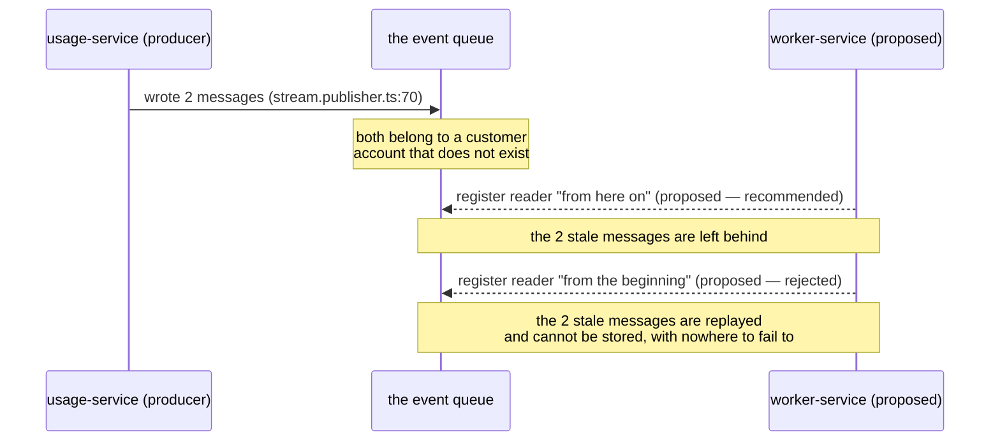
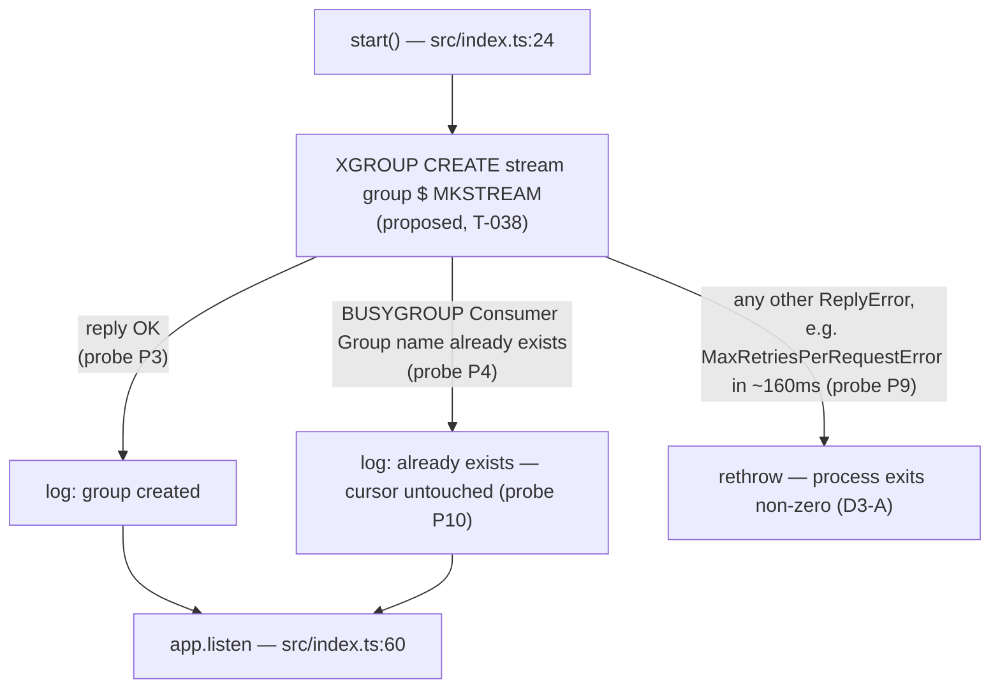

# T-038 — Consumer Group Bootstrap

**Epic**: 7 — Worker Service · **Milestone**: v1-mvp
**Base revision**: `45679c6`, working tree clean
**Predecessor**: T-037 (`7ad9375`) — env schema, landed
**Gate**: 1 (Task Planner). No code written. Ends at the approval gate.

**Prior plan for this task**: none. `ls docs/plans/ | grep -i 038` returns nothing; the plan
series jumps from `t-037-worker-service-env-schema.md` to `t-066-*`. This is a new plan, not an
extension or a replacement.

---
---

# Part 1 — For the analyst

## 1. In plain terms

Usage events are already being written into a queue. Nothing has ever taken them out. This task
installs the *reader registration* — the one-time act that tells the queue "a worker fleet
exists, start keeping track of what it has and has not seen for them."

It does not read anything yet. Reading is the next task. What it buys is the bookkeeping that
makes reading safe: without it, a worker either sees nothing at all, or sees messages with no
record of which ones it already handled — so a crash mid-way would either lose events or bill a
customer twice.

**Who notices:** nobody, today. No customer-visible behaviour changes, no API changes, no
database changes. The only observable difference is that the queue now reports one registered
reader group instead of none.

**What it costs if this is wrong.** Three distinct failure modes, in descending order of cost:

| If we get this wrong | What happens | Recoverable? |
|---|---|---|
| Register the reader at the wrong position | The two messages sitting in the queue are either silently abandoned or replayed into a customer's usage record | Abandoned: yes, replay by hand. Replayed: **no** — they belong to a customer account that does not exist, and there is no failure destination built yet, so they would jam the reader permanently |
| Registration is not repeat-safe | Every worker restart, and every additional worker instance, crashes at startup | Yes, immediately visible |
| Registration silently rewinds the bookkeeping | A restart re-processes everything already handled — duplicate billing | Only by reconstructing the ledger |

The second and third are the ones a naive implementation gets wrong. Both are addressed below,
and both are backed by measurements against a running queue rather than by reasoning
(Appendix A).

### The choice that matters, in one picture



Solid arrow: already happening, with the source location. Dashed arrows: the two options this
task must choose between. Neither exists yet.

---

## 2. Decisions needed from you

Four. **D1 and D2 change the diff.** D3 and D4 are small and I have a clear recommendation, but
they are behaviour, not taste, so they are stated as choices rather than buried.

---

### D1 · Where does the reader start? — **RECOMMENDED: from now on (`$`)**

**Question:** should the new reader group be positioned to skip the two messages already in the
queue, or to consume them?

| Option | Effect | Diff |
|---|---|---|
| **A · `$` — start from now on** *(recommended, and what the epic specifies)* | The 2 existing messages are never delivered. Everything published after bootstrap is. | one constant |
| B · `0` — start from the beginning | The 2 existing messages are delivered to the first worker that reads, in T-039/T-040. | one constant, plus a cleanup obligation before T-040 lands |
| C · `$` now, with a separate one-shot replay tool | Same as A, plus a deliberate way to re-inject anything worth keeping. | A, plus a new script and its tests — out of T-038's scope; this is really "A, and file a follow-up" |

**Why A.** The backlog is not production data and cannot be stored even if we tried:

- Both messages carry `tenantId = 11111111-1111-4111-8111-111111111111`.
  That tenant **does not exist**: the `Tenant` table holds exactly 2 rows, neither with that id.
- `Event.tenantId` has a foreign key to `Tenant(id)`, so T-040's insert is rejected by the
  database (`foreign_key_violation`). **The `ON DELETE` action is not the reason** — it governs
  deletion of the *parent* `Tenant` row and has nothing to do with whether a child `Event`
  insert succeeds. Measured two ways (Appendix A, P0b): the real insert in a rolled-back
  transaction gives `ERROR: insert or update on table "Event" violates foreign key constraint
  "Event_tenantId_fkey"`, and temp tables with `ON DELETE CASCADE`, `SET NULL` and `NO ACTION`
  reject the identical insert with the identical error class. An earlier revision of this plan
  attributed the rejection to `ON DELETE RESTRICT` in four places; the conclusion holds, the
  reason did not.
- The second message's idempotency key is literally `idem-no-internal-secret` — a test artefact
  left by the S-4 internal-auth work.
- The failure destination that would catch a message like this (`DEAD_LETTER_STREAM`, T-041) is
  **deliberately deferred behind Q10**. A message that cannot be stored and cannot be dead-lettered
  stays in the pending list and is re-claimed forever by T-039's recovery path.

Choosing B therefore does not mean "we keep the data" — it means "T-040 ships with two guaranteed
poison messages and no way to drain them."

**The reassurance that makes A safe:** `$` does not mean "skip whatever arrives before the worker
starts." On a queue that does not exist yet, creating it and positioning at `$` puts the cursor at
the very beginning — measured: `last-delivered-id` came back `0-0`, and nothing is skipped
(Appendix A, probe P3/P6). `$` only skips a backlog that already exists. On a fresh developer
machine or in CI, A and B are indistinguishable.

**What changes per answer:** the value of one constant and the expectation in one test. If you
pick C, add a follow-up ticket; the T-038 diff is identical to A.

---

### D2 · Does this task wire the bootstrap into startup, or only export it? — **RECOMMENDED: wire it**

**Question:** after T-038 is merged, does the queue actually have a reader group registered, or is
that still pending?

| Option | After T-038 merges | Files touched |
|---|---|---|
| **A · Wire it into service startup** *(recommended)* | Registration happens on every worker start. The queue has a group. | 4 source/test files + docs |
| B · Export it, wire it in T-039 | Registration exists as a function nothing calls. The queue still has no group. | 2 files |
| C · Wire it into the web-app bootstrap so it also runs under test | Registration happens, but every existing worker test now needs a live queue | rejected — see below |

**Why A.** B ships a function with no caller. This repository has already booked that exact shape
as a defect: S-6 (`INGEST_BATCH_MAX` is dead config — declared, validated, read by nothing). T-037
was allowed to declare unread configuration because configuration is inert by nature and the
forward reference was documented; a *code path* that never runs is a different thing, and the
reviewer will read it as the same finding with a new number.

It also makes the task's own acceptance untestable in the way that matters: the only end-to-end
proof that T-038 worked is that the group exists after the worker starts.

**Why C is rejected, specifically.** Attaching the bootstrap to the Fastify app (an `onReady` hook
in `src/app.ts`) looks tidier, but `onReady` fires on `listen()`, and
`apps/worker-service/tests/smoke.test.ts:19` calls `app.listen({ port: 0 })`. Every smoke run —
including the compose-based `pnpm test:smoke:compose` leg in CI — would then require a reachable
queue to return a health check. That converts a health-check test into an infrastructure test.

**What changes per answer:**

- **A**: `src/index.ts` gains one call inside `start()`, before `app.listen`. That forces a change
  to `apps/worker-service/tests/index.graceful-shutdown.unit.test.ts` — its fake container's Redis
  object currently exposes only `disconnect` (file lines ~57-59), so it needs an `xgroup` stub or
  those 8 tests go red. Add one integration test.
- **B**: `src/index.ts` and the shutdown test are untouched. Two files total. T-039's plan inherits
  the wiring, and the "T-038 done" claim carries an asterisk.

---

### D3 · Queue unreachable at startup: stop, or start anyway? — **RECOMMENDED: stop**

| Option | Behaviour |
|---|---|
| **A · Fail closed** *(recommended, matches the epic's snippet)* | Any error other than "already registered" propagates; the worker exits non-zero |
| B · Fail open | Log the error and continue; the reader loop will discover the problem later |

**Why A.** It matches the fail-closed stance already documented and implemented for the producer
side (`apps/usage-service/src/events/stream.publisher.ts:22`, *"Fail-closed. On any Redis error, log
and throw"*), so the two ends of the same pipe behave alike. And the failure is fast and legible
rather than a hang: with worker-service's exact client options, a command against an unreachable
queue rejected in **~160 ms** with `MaxRetriesPerRequestError` (Appendix A, probe P9) — not a
timeout, not a silent stall.

B's cost is a worker that reports healthy on `/health` while consuming nothing.

**What changes per answer:** one `throw` versus one `logger.error` in the same catch block.

---

### D4 · How is "already registered" recognised? — **RECOMMENDED: prefix match, not substring**

The epic writes `err.message.includes("BUSYGROUP")`. I recommend
`err instanceof Error && err.message.startsWith(<BUSYGROUP constant>)`.

**Why, with the falsifying case.** The two differ on a real reply from this Redis, measured:

```
XGROUP CREATECONSUMER probe:b BUSYGROUP c1
  -> "NOGROUP No such consumer group 'BUSYGROUP' for key name 'probe:b'"
     includes("BUSYGROUP")   = true      <- would be swallowed
     startsWith("BUSYGROUP") = false     <- correctly rethrown
```

**Stated no stronger than I measured:** that reply comes from `CREATECONSUMER`, not from `CREATE`,
which is the only subcommand T-038 issues. I probed four `XGROUP CREATE` error replies
(Appendix A, probe P7) and found **no** case where the two predicates disagree. So this is
prophylaxis for T-039/T-041, which will issue other `XGROUP` subcommands against the same
group name, not a live bug in T-038. I am not claiming `includes` is unsafe here — I am claiming
it is looser than it needs to be, and that the looseness is demonstrable on this Redis rather than
hypothetical.

**What changes per answer:** one method name and one test case.

---

## 3. Scope and non-goals

**In scope**

- One new module that registers the consumer group, idempotently, against the queue.
- Its wiring at worker startup (subject to D2).
- Constants for the subcommand tokens, the start position, and the error prefix.
- Unit tests with a mocked client, and one integration test against a real queue.
- A `.env.example` comment correction — it currently says the consumer group is created on startup
  and that no group exists; after this task, one of those two statements changes.

**Non-goals, and what is deliberately left as it was**

| Not doing | Why |
|---|---|
| Reading from the queue (`XREADGROUP`) | T-039 |
| Recovering stranded messages (`XAUTOCLAIM`) | T-039 |
| Writing events to the database | T-040 |
| Retry counting / dead-letter | T-041, behind **Q10** |
| `MAX_RETRY_COUNT`, `DEAD_LETTER_STREAM` env vars | T-037 deferred them to T-041 on purpose. **T-038 needs neither** — `XGROUP CREATE` takes no retry or dead-letter argument. Confirmed against the client's type signatures (Appendix B). If an implementer finds themselves adding either, that is a finding, not a small extension. |
| Registering the consumer itself (`XGROUP CREATECONSUMER`) | Not in the epic, and `XREADGROUP` creates consumers implicitly. Adding it now is scope creep with no behavioural gain in T-038. |
| Anything touching PostgreSQL | This task issues no SQL. In particular it does **not** touch `apps/worker-service/src/repositories/base.repository.ts`, which is one of the five divergent `TenantScopedRepository` copies and is **not** UTC-pinned (**S-19**). Leaving that broken is deliberate: S-19 explicitly says the fix must be its own task across all five services. |
| Draining the 2 stale messages | Under D1-A they are simply left in place. They are unreachable by the new group and harmless. Recorded here rather than silently cleaned so the next person is not surprised to find them. |
| Fixing `pnpm format:check` | **S-12** — has never passed on any revision. Baseline captured below so it is not scored against this change. |

---
---

# Part 2 — For the implementer

## 4. Ground truth: where the epic is right, and where it is not

Unusually for this repository, **the epic's two substantive claims about Redis semantics are both
correct.** I verified them rather than assuming, given S-5, S-6, S-16, S-17 and T-037's two prior
divergences.

| Epic claim (`docs/epics/epic-7-worker-service.md`, T-038) | Verdict | Evidence |
|---|---|---|
| "`MKSTREAM`: Creates the stream key if it doesn't exist yet" | **Correct** | Probe P1 vs P3 — without it, `ERR The XGROUP subcommand requires the key to exist…` and the key is not created (`EXISTS` → 0); with it, `OK`, key created, `XLEN` 0 |
| "`$`: Only process messages published after group creation — not historical backlog" | **Correct** | Probe P8 — group at `$` on a 2-entry stream got `last-delivered-id` = the last entry id and `XREADGROUP >` returned nil; the same stream with a group at `0` returned both entries |
| "`BUSYGROUP` error… safe to continue" | **Correct, and stronger than stated** | Probe P10 — a re-issued `CREATE` after a partial read left `last-delivered-id` and `pending` *unchanged* |

Four divergences worth planning against:

1. **The epic's snippet is a free function over module-scope `redis`, `streamName`, `groupName`.**
   That is not this repository's shape. The neighbouring producer,
   `apps/usage-service/src/events/stream.publisher.ts:25-38`, is a class taking
   `(redis, logger, env)` through its constructor. Mirror that (CLAUDE.md, "Preserve existing
   architecture"). See §6 Slice 1.
2. **`includes("BUSYGROUP")`** — see D4.
3. **The epic's snippet contains five magic literals** (`"CREATE"`, `"MKSTREAM"`, `"$"`,
   `"BUSYGROUP"`, and the implicit group/stream reads). `.claude/rules/constants.md` is a
   *required review gate*, not a preference. All five must be named constants.
4. **The epic never says who calls it** — D2.

**One rules-vs-code divergence found while planning the test strategy, reported not worked around:**
`.claude/rules/testing.md` states that `*.integration.test.ts` files "are excluded from the default
vitest config and run via their own script and CI step." That is **false at this revision**.
`apps/usage-service/vitest.config.mjs:5` and `apps/worker-service/vitest.config.mjs:5` both use
`include: ["tests/**/*.test.ts"]` with no exclusion, and `vitest list --filesOnly` for
usage-service lists `rls.enforcement.integration.test.ts`, `usage.integration.test.ts` and
`usage.timezone.integration.test.ts` among the files the default run collects. Consequence for this
plan: an integration test added here **will** run under `pnpm test` and `pnpm --filter … test`, and
therefore needs a reachable queue in both places. CI provides one (§8).

> **Implementer's correction (Gate 3, amended at Gate 3 rework).** The second half of the
> paragraph above is wrong and no gap was filed. `.claude/rules/testing.md` **as read from
> disk at `45679c6`** does not claim these suites are excluded — line 37 reads *"Do not
> describe these suites as excluded or opt-in."*, and lines 24-35 state the opposite of what
> is attributed to it, naming the same five `vitest.config.mjs` files and the same `include`
> pattern. T-036's implementer raised and withdrew the identical objection. The *consequence*
> stated above is still correct and was relied on: the new integration suite runs under
> `pnpm test`, and it does need a reachable Redis in both places.
>
> **Commit attribution corrected.** This box originally said the text was fixed in `3374cf9`.
> It was fixed in **`1b872b3`** — `git log --oneline -- .claude/rules/testing.md` returns
> exactly `1b872b3` and `a3877ad`, and `git show --stat 3374cf9` does not list the file
> (`3374cf9` merely postdates the fix).
>
> **Why both a planner and two implementers "misread" the same rule file.** The `.claude/rules/*`
> content injected into the agent session context is a **stale snapshot**, not the working
> tree. Verified for this session: the injected `testing.md` carries the pre-`1b872b3`
> sentence *"They are excluded from the default vitest config and run via their own script and
> CI step"*, and the injected `known-gaps.md` ends at S-10 while the file on disk runs to
> S-22. The Gate-4 reviewer reported the same divergence independently. Practical rule for
> anyone downstream: `cat` a rule file before citing it, and say that you did.

---

## 5. Files to change

### Existing

| File | Change | Gated on |
|---|---|---|
| `apps/worker-service/src/constants.ts` | Extend `WORKER_STREAM_CONSTANTS` (or add a sibling object) with the `XGROUP`/`CREATE`/`MKSTREAM` tokens, the start-position id, and the `BUSYGROUP` reply prefix | always |
| `apps/worker-service/src/index.ts` | Call the bootstrap inside `start()`, after `buildWorkerServiceApp()` and **before** `app.listen` | **D2-A only** |
| `apps/worker-service/tests/index.graceful-shutdown.unit.test.ts` | Add `xgroup` to the fake container's Redis object (currently `{ disconnect }`, ~lines 57-59) and assert bootstrap ran before `listen` | **D2-A only** |
| `apps/worker-service/.env.example` | Line 37-38 currently reads "Consumer group the worker will create on startup (T-038)… No group exists yet: `xinfo groups telemetry:events` returns empty." Both halves stop being true. Correct them. | always |

### New

| File | Purpose |
|---|---|
| `apps/worker-service/src/events/stream.consumer.ts` | `StreamConsumer` (or `ConsumerGroupBootstrap`) — constructor `(redis, logger, env)`, one public `ensureConsumerGroup()` |
| `apps/worker-service/tests/stream.consumer.unit.test.ts` | Mocked-client unit suite |
| `apps/worker-service/tests/stream.consumer.integration.test.ts` | Live-queue suite (see §7 for the isolation constraint) |
| `apps/worker-service/tests/integration.constants.ts` | Only if the integration test lands — mirrors `apps/usage-service/tests/integration.constants.ts` |

### Deliberately not modified

- `apps/worker-service/src/config/env.ts` — T-037 settled it; T-038 only *reads* `REDIS_STREAM_NAME`
  and `REDIS_CONSUMER_GROUP`.
- `apps/worker-service/src/config/container.ts` — the Redis client already exists there with
  `lazyConnect: true` (lines 22-26), which is exactly right: the first command auto-connects
  (measured, probe P9), so no explicit `connect()` is needed and no test that never issues a
  command pays a connection cost.
- `apps/worker-service/src/app.ts` — see D2-C.
- `apps/worker-service/src/middleware/internal-auth.middleware.ts` — **S-8**, not this task.
- `apps/worker-service/src/repositories/base.repository.ts` — **S-19**, not this task.
- `apps/worker-service/vitest.config.mjs` — its coverage block excludes `src/events/**` (line 18),
  so the new file is outside the coverage measurement. **This has no enforced effect today**:
  `apps/worker-service/package.json` declares no `test:coverage` script, and
  `.github/workflows/ci.yml:90-99` runs coverage for auth-service only. Removing the exclusion
  would change nothing that any gate reads, and would pre-emptively include T-039/T-040 code that
  does not exist. Left alone; noted for whoever adds worker coverage.

---

## 6. Implementation slices

### Controlling code path

Startup, under D2-A:

```
src/index.ts  start()
  └─ buildWorkerServiceApp()            src/app.ts:17     (builds container, redis lazyConnect)
  └─ ensureConsumerGroup()              src/events/stream.consumer.ts   [NEW]
       └─ redis.xgroup("CREATE", env.REDIS_STREAM_NAME, env.REDIS_CONSUMER_GROUP, "$", "MKSTREAM")
            ├─ resolves "OK"                → log created
            ├─ rejects BUSYGROUP…           → log already-exists, return normally
            └─ rejects anything else        → rethrow  (D3-A)
  └─ app.listen(...)                    src/index.ts:60
```

The ordering is the contract: **bootstrap before `listen`**. A worker that is accepting health
checks while its group does not exist reports healthy and consumes nothing.

### The three branches, with the replies I measured



`src/index.ts:24` and `:60` exist today. Everything between them is *proposed*.

### Slices, smallest safe first

**Slice 1 — constants.**
Add to `apps/worker-service/src/constants.ts`: the `xgroup` subcommand token, the `MKSTREAM`
token, the start-position id (D1), and the `BUSYGROUP` reply prefix (D4). Keep them in or beside
`WORKER_STREAM_CONSTANTS` so the stream-name constant and its consumers stay together.

*Falsifiable hypothesis:* adding these constants changes no behaviour.
**Falsified if** `pnpm --filter @telemetry/worker-service test` is not still 5 files / 49 tests
passing (baseline measured, §8).

**Slice 2 — the module, tests first (pseudo-TDD, CLAUDE.md).**
Write `tests/stream.consumer.unit.test.ts` with all §7 scenarios, **confirm red**, then implement
`src/events/stream.consumer.ts`. Constructor `(redis: Redis, logger: Logger, env: ServiceEnv)`,
mirroring `StreamPublisher`'s shape at `apps/usage-service/src/events/stream.publisher.ts:29-38`.

*Falsifiable hypothesis:* `ensureConsumerGroup()` resolves on both `OK` and `BUSYGROUP`, and
rejects on everything else.
**Falsified if** the unit test that makes the mocked `xgroup` reject with
`new Error("WRONGTYPE Operation against a key holding the wrong kind of value")` does **not** see
the call reject.

**Slice 3 — wiring (D2-A only).**
Add the call to `src/index.ts` `start()`. Update the shutdown test's Redis mock. Assert the
*ordering* — bootstrap resolved before `listen` was called — not merely that both happened.

*Falsifiable hypothesis:* the bootstrap runs before the HTTP listener binds.
**Falsified if** moving the call to after `await app.listen(...)` leaves the ordering assertion
green. The implementer must make that edit, watch the test go red, and revert it. Do not write
"bootstrap always precedes listen" in a comment without doing so.

**Slice 4 — the integration test.**
Against a live queue in an isolated logical database (§7). Prove three things: the group
genuinely appears in `XINFO GROUPS`; a second call is a no-op that leaves the cursor alone; and
the group is created at the position D1 chose.

> **Corrected at the Gate-4 re-review (LOW-1).** This sentence read "Prove three things a mock
> cannot". Restated precisely, per test rather than per bullet:
>
> - **Beyond a mock:** that the group appears in `XINFO GROUPS` at all, and that a repeat
>   `CREATE` leaves `last-delivered-id` and `pending` untouched (`I3`) — Redis facts, not
>   call-vector facts.
> - **Partly within a mock's reach, but less than the previous revision of this note claimed:**
>   `U1` (`tests/stream.consumer.unit.test.ts:101`) asserts the whole `xgroup` vector by exact
>   equality, so a *code* change that swapped the subcommand — `CREATE` to `SETID` — reddens
>   it. It does **not** catch a change to the start id, because it compares against
>   `WORKER_CONSUMER_GROUP_BOOTSTRAP.START_ID_NEW_ENTRIES_ONLY` rather than against a literal:
>   both sides of the assertion move together.
> - **Beyond a mock, and this is the real content of the third bullet:** that the group is
>   *actually* positioned at `$` — the pre-bootstrap backlog is not delivered and the fresh
>   entry is. **`I5` is the only guard on this, unit or integration.**
>
> Measured twice. QA (F1) edited `src/constants.ts:132` from `"$"` to `"0"` and ran the unit
> file alone. Gate 6 re-derived it across the **whole worker package**, which is the run that
> settles "only `I5`": sole red of all 7 test files is `I5`, `Tests 1 failed | 64 passed (65)`,
> failing at `tests/stream.consumer.integration.test.ts:279`
> (`expected [ Array(2) ] to not include …`) — the `not.toContain(backlogId)` assertion, since
> a group created at `0` delivers the backlog. The literal pin is a separate assertion at
> `:283`. Do not delete `I5` on the strength of unit coverage; there is none.
>
> **This sentence has now been wrong three times** — the original "a mock cannot", the Gate-4
> L1 correction of it, and the Gate-4-re-review LOW-1 rewrite, which asserted the `U1` redness
> that QA then measured false. Recorded rather than quietly replaced for that reason: the
> failure mode is a reviewer or implementer trusting a *correction* without re-running it, and
> it has recurred at every gate. The load-bearing fact is the one-line claim above: **only
> `I5`.**
>
> §9 R5 and the integration file's header were corrected for this in the Gate-3 rework; this
> line was missed. The integration cases are still the right tests — only the claim about what
> *only* they can do was too broad.

*Falsifiable hypothesis:* the group is created at `$`, so a message published **before** bootstrap
is not delivered and one published **after** is.
**Falsified if** the case that publishes one entry, bootstraps, publishes a second, and then reads
with `XREADGROUP >` returns the first entry's id.

**Slice 5 — docs.**
`.env.example` lines 37-38. Nothing else.

---

## 7. Test plan and acceptance-coverage mapping

The epic states no numbered acceptance criteria for T-038. Derived from its story text, D1-D4, and
the epic's own two callouts on `$` and `MKSTREAM`:

| AC | Statement | Proving test(s) | Kind |
|---|---|---|---|
| **AC1** | On a queue with no such group, bootstrap creates it | U1, I1 | unit + integration |
| **AC2** | On a queue that already has the group, bootstrap succeeds and does nothing | U2, I2 | unit + integration |
| **AC3** | Repeat bootstrap does not move the group's cursor or discard pending work | I3 | integration only — a mock can catch the *call*, not the *effect* (see Gate-4 correction below) |
| **AC4** | Any reply other than already-exists propagates (D3-A) | U3, U4 | unit |
| **AC5** | The already-exists check is a prefix match, not a substring match (D4) | U5 | unit |
| **AC6** | The queue key is created if absent (`MKSTREAM`) | I4 | integration |
| **AC7** | The group starts at the position D1 chose | I5 | integration |
| **AC8** | Stream name and group name come from the parsed env, not from literals | U6 | unit |
| **AC9** | Bootstrap runs before the HTTP listener binds (D2-A only) | U7 | unit |

### Unit suite — `tests/stream.consumer.unit.test.ts`

Mock the client the way `apps/usage-service/tests/stream.publisher.unit.test.ts:25-42` does —
a `Record<string, ReturnType<typeof vi.fn>>` cast to `Redis`, a `vi.fn()`-per-method logger, and a
`Partial<ServiceEnv>`. Do not mock the whole `ioredis` module.

- **U1** — `xgroup` resolves `"OK"` → `ensureConsumerGroup()` resolves; asserts the *argument
  vector* `["CREATE", <stream>, <group>, <startId>, "MKSTREAM"]`, not just that it was called.
- **U2** — `xgroup` rejects `new Error("BUSYGROUP Consumer Group name already exists")` →
  resolves, and logs at info/debug rather than error.
- **U3** — `xgroup` rejects `new Error("WRONGTYPE …")` → rejects with that same error.
- **U4** — `xgroup` rejects a non-`Error` (e.g. a string) → rejects. Guards the
  `err instanceof Error` branch the epic's snippet includes.
- **U5** — `xgroup` rejects `new Error("NOGROUP No such consumer group 'BUSYGROUP' for key name 'x'")`
  → **rejects**. This is the case that separates `startsWith` from `includes`; under the epic's
  `includes` it passes silently. This exact message is a real reply from this Redis
  (Appendix A, probe P7), not invented.
- **U6** — construct with a non-default `REDIS_STREAM_NAME` / `REDIS_CONSUMER_GROUP` and assert both
  reach `xgroup`. Negative half, per `.claude/rules/testing.md`: assert the *default* values are
  **absent** from the argument vector, so a hard-coded literal cannot pass this test.
- **U7** *(D2-A)* — in `tests/index.graceful-shutdown.unit.test.ts`, assert bootstrap resolved
  before `appListen` was invoked. Use call-order assertions (`mock.invocationCallOrder`), not two
  independent `toHaveBeenCalled()`s.

Per `.claude/rules/constants.md`, which applies to tests: import `WORKER_STREAM_CONSTANTS` for the
defaults and the `BUSYGROUP` prefix rather than re-typing them.

### Integration suite — `tests/stream.consumer.integration.test.ts`

- **I1** — fresh stream, bootstrap, `XINFO GROUPS` reports exactly one group with the configured name.
- **I2** — bootstrap twice; the second call resolves; still exactly one group.
- **I3** — bootstrap, publish 2, read 1 with `XREADGROUP >`, capture `last-delivered-id` and
  `pending`, bootstrap **again**, assert both are byte-identical. This is AC3 and it is the case
  that catches an implementation that reached for `XGROUP SETID`. Probe P10 measured exactly this
  contrast: `CREATE` left the cursor at `1789023385216-0`, `SETID` moved it to `1789023385229-0`.
- **I4** — against a key that does not exist: bootstrap; `EXISTS` → 1, `TYPE` → `stream`, `XLEN` → 0.
- **I5** *(AC7, D1-A)* — publish entry A; bootstrap; publish entry B; `XREADGROUP >` returns **only**
  B. Assert A's id is *absent* from the result, not merely that one entry came back.

### The isolation constraint — read this before writing the integration test

Two hazards, both concrete:

1. **Do not touch logical database 0.** That is where the real `telemetry:events` lives, with the
   2 entries and zero groups this plan's D1 argument rests on. A test that bootstraps against it
   would create a group on the developer's actual stream and quietly invalidate the measurement.
2. **Do not reuse logical database 15.** `apps/usage-service/tests/integration.constants.ts:64`
   reserves index 15 for T-036 and issues `FLUSHDB` against it. `turbo.json` sets no
   `--concurrency`, and turbo's `--concurrency` flag is documented as a *limit* ("Use 1 for serial")
   — so package test tasks are not serialized by default. I did **not** measure an actual
   collision; I am saying the two suites would both flush the same database if they ever overlap,
   which is cheap to avoid and expensive to debug.

Recommended: index **14**, verified empty (`redis-cli -n 14 DBSIZE` → 0; `CONFIG GET databases` →
16, so 0-15 are valid), plus a per-run stream-name prefix following
`INTEGRATION_REDIS.STREAM_NAME_PREFIX`. Follow T-036's harness shape: override `REDIS_URL`'s
pathname to the reserved index in `beforeAll`, `flushdb` that index only, never `FLUSHALL`, and
restore the original `REDIS_URL` in `afterAll` (see `apps/usage-service/tests/usage.integration.test.ts:446-451`).

---

## 8. Validation commands

### Baselines measured at `45679c6` — compare against these, not against zero

| Command | Result now |
|---|---|
| `pnpm --filter @telemetry/worker-service test` | **5 files, 49 tests, all passing** (877 ms) |
| `pnpm --filter @telemetry/worker-service lint` | **clean — 0 errors, 0 warnings** |
| `pnpm format:check` | **264 files** (265 `^\[warn\]` lines — the 265th is prettier's `Code style issues found in N files` summary, not a file) — S-12, has never passed. Any delta must be spot-checked against the files this task touched, not accepted or scored as a regression |

### Task-scoped, in order, fail fast

```bash
pnpm --filter @telemetry/worker-service typecheck
pnpm --filter @telemetry/worker-service lint
pnpm --filter @telemetry/worker-service exec vitest run tests/stream.consumer.unit.test.ts
pnpm --filter @telemetry/worker-service exec vitest run tests/index.graceful-shutdown.unit.test.ts   # D2-A
pnpm --filter @telemetry/worker-service exec vitest run tests/stream.consumer.integration.test.ts
pnpm --filter @telemetry/worker-service test
pnpm --filter @telemetry/worker-service build
```

Note the scoping form: `pnpm --filter <pkg> test -- <file>` does **not** filter — vitest runs the
whole package suite (CLAUDE.md, `.claude/rules/testing.md`). Use `exec vitest run <file>`.

### The one manual check that proves the task

```bash
redis-cli XINFO GROUPS telemetry:events        # before: empty
pnpm --filter @telemetry/worker-service dev    # start, then stop
redis-cli XINFO GROUPS telemetry:events        # after: one group named worker-group
redis-cli XINFO STREAM telemetry:events | grep -A1 '^groups$'
```

**This mutates developer state.** It creates a real group on the real stream, which is the point,
but it also means the 2 stale entries become permanently skipped under D1-A. That is the intended
outcome; recording it so it is a decision and not a surprise. To undo:
`redis-cli XGROUP DESTROY telemetry:events worker-group`.

### Full gate

```bash
pnpm build && pnpm test && pnpm lint && pnpm typecheck    # 13 packages
```

### Environment, verified by command rather than assumed

- **Redis**: host-installed `redis-server` **7.0.15** on `127.0.0.1:6379`
  (`pgrep -a redis-server` → `/usr/bin/redis-server 127.0.0.1:6379`; `ss -ltn` confirms the
  listener). The `redis` service in `docker/docker-compose.yml:39-47` publishes **no host port** and
  is not running — it is reachable only from inside the compose network, which is what
  `pnpm test:smoke:compose` uses.
- **PostgreSQL**: host-installed **16.13 (Ubuntu)** on `127.0.0.1:5432`. The `postgres-db` container
  visible in `docker ps` is an unrelated stack and publishes no host port. Not needed by this task,
  but relevant because the worker suite's `tests/setup.ts:6` points at it.
- **CI**: `.github/workflows/ci.yml:55-58` provisions `redis:7-alpine` with `6379:6379` published.
  `apps/worker-service/tests/setup.ts:9` defaults `REDIS_URL` to `redis://localhost:6379` as a
  literal in the setup file, which is what makes it survive turbo's strict env mode (the job-level
  `REDIS_URL` at `ci.yml:31` does **not** reach `pnpm test` — see the comment at `ci.yml:25-30`).
  So the integration test will find a queue in CI.
- Not verifiable from here: behaviour against Redis 6.x, against a cluster, or against a managed
  provider that restricts `XGROUP`. Every semantic claim in this plan is scoped to Redis 7.0.15
  standalone via ioredis 5.11.1.

---

## 9. Risks and mitigations

| # | Risk | Severity | Mitigation |
|---|---|---|---|
| R1 | D1-A abandons the 2 backlog entries irreversibly once a worker starts | LOW | They are test debris for a non-existent tenant (§2 D1). Recorded in the plan and in the `.env.example` comment so the loss is deliberate. Reversible before first run via `XGROUP DESTROY`. |
| R2 | The integration test flushes a logical database another suite is using | MEDIUM | Reserve index 14, not 15; `FLUSHDB` only; never `FLUSHALL`; never index 0. §7. |
| R3 | Under D2-A the worker now refuses to start without a queue | MEDIUM | Intended (D3-A). But it is a **behaviour change to startup**: a developer with no Redis running who could previously `pnpm dev` the worker no longer can. Call this out in the commit message. If unacceptable, D3-B. |
| R4 | The shutdown suite's Redis mock goes stale as T-039/T-040 add calls | LOW | Add `xgroup` to the shared mock object in T-038 rather than stubbing at the call site, so T-039 extends one place. |
| R5 | A future contributor "simplifies" the bootstrap to `XGROUP SETID` or adds a destroy-and-recreate | HIGH if it happens | I3 is the guard **and so is the unit suite** — both SETID mutation shapes were measured red in `tests/stream.consumer.unit.test.ts` too (adding a `SETID` call reddens U2; replacing `CREATE` with it reddens U1). What only I3 can prove is that a repeat `CREATE` leaves `last-delivered-id` and `pending` untouched, which is a Redis fact rather than a call-vector fact. Probe P10 is the measurement it encodes. An earlier revision said "a mock cannot distinguish the two"; that is refuted — see §4's Gate-4 correction. |
| R6 | The consumer name default `worker-1` is fixed across replicas (Q9) | LOW for T-038 | **T-038 does not read `REDIS_CONSUMER_NAME` at all** — `XGROUP CREATE` takes no consumer argument (verified against the client's type overloads, Appendix B). The consequence lands in T-039; measured findings are in §10 so T-039's planner does not have to re-derive them. |
| R7 | `pnpm format:check` delta is scored as a regression | LOW | S-12. Baseline 264 files recorded above; count files, not `[warn]` lines. |
| R8 | Reviewer flags magic literals in the new module | LOW | Slice 1 lands the constants **before** the module, so there is never a revision where the literals exist. |

---

## 10. Findings handed forward to T-039 (measured here, not guesses)

Recorded because the brief for this task raised the concern and because re-deriving it costs
another round of probes. None of it changes T-038's diff.

**The worry:** a fixed `REDIS_CONSUMER_NAME` (`worker-1`) shared across replicas breaks pending-list
ownership, and therefore breaks T-039's `XAUTOCLAIM` recovery.

**What I measured says the recovery path is fine, and the loss is elsewhere.** With two live
connections both reading as `worker-1` (Appendix A, probe P11/P12):

- Work still distributes: the two connections received **disjoint** message sets, zero overlap.
  Redis does not double-deliver to a shared name.
- Pending-list idle time is tracked **per entry**, not per consumer. With one connection's entries
  aged 1204 ms and another's aged 3 ms — while `XINFO CONSUMERS` reported the *consumer's* idle as
  `0`, kept warm by the live connection — `XAUTOCLAIM` with `min-idle-time 1000` reclaimed exactly
  the two stale entries and left the two fresh ones. So T-039's recovery works under a shared name.
- **What is actually lost is observability**: `XINFO CONSUMERS` collapses to a single row
  (`[["name","worker-1","pending",4,"idle",0]]`), so an operator cannot tell *which* replica is
  stuck. With distinct names the same scenario reported two rows with their own pending counts.

**Recommendation for T-039, not T-038:** default `REDIS_CONSUMER_NAME` to something instance-unique
(hostname, or pod name) while keeping `worker-1` as the documented single-instance value. Do not
change it here — T-037 settled the default and T-038 does not read it.

**Two more facts T-039 will need:**

- The group survives producer-side trimming. 50 `XADD … MAXLEN ~ 1` left the group intact; even
  `XTRIM MAXLEN 0` left `EXISTS` → 1 and the group present (probe P13). So `stream.publisher.ts`'s
  `MAXLEN ~` cannot orphan the group.
- The group does **not** survive `DEL` of the key. After `DEL`, `XINFO GROUPS` → `ERR no such key`,
  and `XREADGROUP` against a missing group fails with
  `NOGROUP No such key '…' or consumer group '…' in XREADGROUP with GROUP option` (probes P14/P15).
  T-039's loop should therefore treat a `NOGROUP` reply as "re-bootstrap", which is why §5 asks for
  `ensureConsumerGroup()` to be a re-callable public method rather than a one-shot startup side
  effect.

---

### Handed forward at Gate 6 — LOW-4, the unguarded error-path log fields

`src/events/stream.consumer.ts:114`. Measured at Gate 6: changing `String(error)` to the literal
`"unknown"` leaves **all 65 tests green**, because `U3` and `U4` assert only
`expect(mockLogger.error).toHaveBeenCalled()` — the same field-agnostic shape QA's F2 found on
the *success* path, on the one path F2 did not scope. The behaviour is correct; the guard is
absent.

Deliberately **not** fixed in T-038 (user decision at the Gate-6 gate): folding it in would
re-open Gates 3 and 4 for a third test-only loop-back over a LOW finding, and T-039 has to hold
loop state in this class anyway, so it will touch this file and both its suites.

**For T-039's planner:** mirror what `U9`/`U10` did for the success path — assert the error log's
fields, not just that it was called. Note the F1 trap while doing it: an assertion that compares
a value against the same constant the implementation reads catches a *code* change and not a
change to the constant's value, so say in the test which of the two it catches.

## 11. Pending task checklist

- [x] **User answers D1 (start position) and D2 (wire or not)** — answered: **D1-A (`$`)**, **D2-A (wire it)**
- [x] User confirms or overrides D3 (fail-closed) and D4 (prefix match) — both confirmed as recommended
- [x] Slice 1 — constants; worker suite still 5 files / 49 tests *(verified after the edit)*
- [x] Slice 2 — unit test skeletons → bodies → **confirmed red** (6/6, against a null
      implementation so each failed for its own reason) → implement module → green
- [x] Slice 3 — wired into `index.ts`; shutdown mock extended with `xgroup` + `env`; ordering
      asserted by `invocationCallOrder`, and the move-the-call mutation was performed
      (U7 red: `expected 82 to be less than 81`; U8 also red) and reverted
- [x] Slice 4 — integration suite on reserved logical db 14; I3 written as the `SETID` guard and
      **proved** by mutation (`last-delivered-id` moved `…-0` → `…-1`)
- [x] Slice 5 — `.env.example` — both false halves of the T-037 comment corrected
- [x] Task-scoped typecheck / lint / test / build — all clean
- [x] Manual `XINFO GROUPS` before-and-after check; recorded verbatim in the Gate 3 report.
      Group destroyed afterwards; `telemetry:events` left at 2 entries / 0 groups
- [x] Full gate across 13 packages; `format:check` **264 → 271 files**, delta exactly the 7 new
      prettier-visible files (S-12; the modified files were proved already-unformatted at
      `HEAD`, so they contribute 0). **Corrected at Gate 5 (QA finding F4):** this line read
      "265 → 270", which mixed the `^\[warn\]` *line* count with the *file* count —
      `grep -c '^\[warn\]'` includes prettier's trailing
      `Code style issues found in N files` summary line, so every such figure is one higher
      than the number of files. It also undercounted the new files as 5 by omitting the plan
      and review `.md`s. Re-measured after the QA report landed: 273 warn lines / **272
      files** = 264 baseline + 7 task files + `docs/qa/t-038-consumer-group-bootstrap.md`
- [x] ~~File the `.claude/rules/testing.md` integration-exclusion divergence (§4) as a new gap
      item~~ — **withdrawn, the finding is false.** See the correction box in §4
- [x] Hand §10 to T-039's planner — carried verbatim into the Gate 3 report

### Gate 4 → Gate 3 rework (CONDITIONAL verdict, `docs/reviews/t-038-consumer-group-bootstrap.md`)

- [x] **H1** — every `FLUSHDB` in `tests/stream.consumer.integration.test.ts` now routes through
      `flushReservedDb()`, which re-asserts `CLIENT INFO` contains `db=14` on each call.
      Defect proved first (guard mutated + sentinel key in db 14 -> `Tests 6 skipped`, DBSIZE
      1 -> 0); fix proved by the same mutation (DBSIZE stayed 1). (Numeral restated at Gate 6:
      the measurement read `5 skipped` when taken and was correct then — `I6` has since made
      the suite 6 cases.) Claim in the test file
      narrowed to what is true.
- [x] **H1** — `.claude/rules/known-gaps.md` S-22: false universal corrected and the fix
      direction now prescribes the guarded-every-flush shape rather than the half-guard
- [x] **M2** — `stream.consumer.ts` cross-reference corrected; both schema shapes re-measured
      against the real `EnvSchema`s. Decision (no fallback in the consumer) unchanged.
      Asymmetry filed as **S-23**. `usage-service/src/config/env.ts` and T-037's
      `constants.ts:41-44` deliberately untouched
- [x] **M3** — flakiness narrative replaced with the measured mechanism: **deterministic**
      `9 failed | 1 passed`, 20 runs across 2/5/10/20 microtask turns, same nine every time.
      Harness non-vacuity re-proved by the `loadLocalEnv()` mutation
- [x] **L1** — "a mock cannot distinguish CREATE from SETID" refuted and corrected in all three
      places (integration header, §7 AC3, §9 R5); both mutation shapes measured
- [x] **L2** — `ON DELETE RESTRICT` removed from the argument in all four places; replaced with
      the FK's existence, proved by a rolled-back insert *and* by three temp children differing
      only in `ON DELETE` action
- [x] **L3** — `MKSTREAM`-hides-a-typo warning added to `.env.example`, where an operator reads it
- [x] **N1** "seven casts" -> **ten**, counted · **N2** both cite lines · **N3** `3374cf9` ->
      `1b872b3` · **N4** `INTEGRATION_FIELD_PAIR_STRIDE` split from `INTEGRATION_COUNTS.PAIR`
- [x] **L4** — `vi.waitFor` left on its default timeout, per the brief
- [x] L5 (shared `redis://localhost:6379` constant) and the per-suite-logical-db convention:
      the reviewer recommended two further `known-gaps.md` entries. **Decided at the Gate-4
      re-review (D-C): file nothing.** The re-review did not condition its verdict on them and
      recommended the same — the URL duplication is one `grep` away (13 occurrences across 6
      packages, correcting the first pass's "at least five files"), and the convention hazard is
      already stated in S-22's closing sentence. Revisit if CI's Redis moves to a managed
      instance, which is the event that turns the second item into a real defect
- [x] Full gate re-run with `--force` across 13 packages

### Gate 4 re-review → Gate 3 (verdict `APPROVED FOR COMMIT`, `docs/reviews/t-038-consumer-group-bootstrap-rereview.md`)

Three prose findings, no code change. All three were false claims the *rework* introduced or
left behind, which is the `.claude/rules/review-standards.md` § *Claims the Change Makes* gate
doing its job on corrective text.

- [x] **LOW-2** — `src/constants.ts` sibling-object rationale: "those **five** values are env
      defaults (each is a `.default(...)`)" was wrong twice over. `WORKER_STREAM_CONSTANTS` has
      **seven** members, and `BATCH_SIZE_MIN`/`BATCH_SIZE_MAX` are the `.min()`/`.max()` bounds
      on `STREAM_BATCH_SIZE` (`env.ts:52-53`) rather than defaults — so "no operator may
      override these four" was not the distinguishing line, because no operator can override
      those two either. Replaced with the distinction `grep` measures: all seven members feed
      `env.ts` (`grep -c 'WORKER_STREAM_CONSTANTS\.' src/config/env.ts` → 7, one per member),
      while the bootstrap four feed no env field and are referenced only by
      `src/events/stream.consumer.ts`. The superseded claim is recorded in place, because the
      **first** Gate-4 pass cleared it explicitly ("true of every member of both objects, which
      I checked one by one")
- [x] **LOW-3** — `.claude/rules/known-gaps.md` S-23: "Both fields were also probed with
      `undefined`, which yields the shared default `telemetry:events` on both sides" read
      against the three-row table as worker's two fields, for which it is false — worker's
      `REDIS_CONSUMER_GROUP` defaults to `worker-group`. Antecedent pinned to the two
      `REDIS_STREAM_NAME` fields, which is the pair the divergence is about, and the consumer
      group's own default stated. Verified while fixing: usage-service declares no
      consumer-group field at all (`grep -rn CONSUMER apps/usage-service/src/config/env.ts` →
      no match)
- [x] **LOW-1** — plan §Slice 4's surviving "Prove three things a mock cannot". L1 had been
      corrected in §9 R5 and the integration file's header; this line was missed. Restated per
      test: `I3`'s cursor/pending invariance and the group's existence are beyond a mock, and so
      is Redis *honouring* `$` (`I5`) — but the start-position **argument** is not, since `U1`
      (`tests/stream.consumer.unit.test.ts:101`) asserts the whole `xgroup` vector by exact
      equality including `START_ID_NEW_ENTRIES_ONLY`. A first draft of this correction mis-cited
      `U6` (which asserts the stream/group *names* come from parsed env, not the start position);
      caught by reading `U1`/`U6` rather than trusting the summary

### Gate 5 (QA) → Gate 3 (verdict **PASS**, `docs/qa/t-038-consumer-group-bootstrap.md`)

QA passed the task and confirmed AC1-AC9, each by mutating the implementation and watching a
named test go red. It also **executed the two claims the first review could only reason about**,
and both hold: `pnpm test:smoke` passes with Redis unreachable (scoped override to port 6390),
and the worker fails closed end to end (exit 1, port never bound, `MaxRetriesPerRequestError`).
Four findings, none a defect in shipped behaviour.

- [x] **F1** — the Slice-4 note's claim that `U1` reddens on a start-id change is **false**;
      `U1` compares against the constant, so both sides move together (`"$"` → `"0"` leaves the
      unit suite 6/6 green). Corrected in place, with the measurement. **`I5` is the only guard
      on the start position**, and the note now says so explicitly, because the standing risk is
      someone deleting `I5` believing unit coverage exists
- [x] **F4** — `format:check` "265 → 270" mixed `^\[warn\]` *lines* with *files* (prettier
      appends a summary line, so every such figure is one high) and undercounted the new files
      as 5 by omitting the plan and review `.md`s. Corrected to **264 → 271 files** at all three
      sites; Appendix A's transcript is left verbatim, since the command shown there *is* the
      line count
- [x] **F2** — the success-path `logger.info` fields are unguarded, and worse than the Gate-4
      review reported: deleting the entire block leaves **all 21 tests passing**, and `U2`'s
      `toHaveBeenCalled()` is message-agnostic. QA's positive control against a live Redis
      confirmed the fields are *correct* (`startId: "$"`, right stream, right group) — a missing
      guard, not a latent bug. **Approved for a test-only fix**
      — **Fixed at the Gate-5 → Gate-3 loop-back, tests only.** `U9` (created path) and `U10`
      (already-exists path) added to `tests/stream.consumer.unit.test.ts`, both using the
      non-default `OVERRIDE` names so a hard-coded literal cannot satisfy them, and both with a
      negative half asserting the *other* path's message was not logged — which is the half that
      makes the two paths distinguishable, the specific weakness in `U2`. `U2` was **not**
      altered: it asserts the already-exists path's *resolve* contract, a different claim from
      what that path logs. Red proved by three mutations, each varying a different dimension:
      (1) QA's `M8`, deleting the whole success-path block → `U9` red,
      `expected "spy" to be called 1 times, but got 0 times`; (2) dropping only the `startId`
      field, keeping the call → `U9` red on the `toHaveBeenCalledWith` line, diff
      `- "startId": "$"`, so the field assertion is live and not carried by the call-count line;
      (3) making the already-exists branch log `"Created stream consumer group"` → `U10` red,
      **and `U2` green**, reproducing F2's point directly. Reverted after each; source
      `md5sum -c` OK and `git diff --stat` back to `5 files changed, 341 insertions(+), 15
      deletions(-)`. **Scope, per F1 and not overclaimed** — `startId` is asserted against
      `WORKER_CONSUMER_GROUP_BOOTSTRAP.START_ID_NEW_ENTRIES_ONLY`, the constant the
      implementation also reads, so `U9` catches a **code** change (field dropped, renamed,
      re-expressed, message reworded) and **not** a change to the constant's *value*. `"$"`
      itself is still guarded by `I5` alone. That scope is stated in the suite's own comment
- [x] **F3** — **no concurrent-bootstrap test**, missed by both review passes. Swallowing
      `BUSYGROUP` rather than locking is this task's central decision and its justification is
      multi-replica startup, yet nothing committed exercises more than one caller. QA's probe:
      8 clients via `Promise.allSettled` → 8/8 fulfilled, exactly 1 group. **Approved for a
      test-only fix**
      — **Fixed at the Gate-5 → Gate-3 loop-back, tests only.** `I6` added to
      `tests/stream.consumer.integration.test.ts`: 8 independent ioredis connections opened
      from the same reserved-db URL, one `StreamConsumer` each on one shared stream/group,
      `Promise.allSettled`, then `rejections` asserted `toEqual([])` and the group read back
      through `readOnlyGroup` (which itself asserts exactly one and throws on none). Client
      count is `INTEGRATION_CONCURRENCY.BOOTSTRAP_CLIENTS` in
      `tests/integration.constants.ts`, not inline. Rejections are mapped to reply *strings*
      rather than counted, so a failure names the reply. Red proved by deleting the
      already-exists branch's `return` path from `src/events/stream.consumer.ts` so every reply
      rethrows: `I6` red with `expected [ …(7) ] to deeply equal []` and the received array
      listing **7** × `ReplyError: BUSYGROUP Consumer Group name already exists` — 1 winner, 7
      losing racers, matching QA's probe and the plan's Appendix A "8 → 1 `OK`, 7 `BUSYGROUP`,
      exactly 1 group". Full red set under that mutation, measured across the whole package
      rather than the one file — `U2`, `U10`, `I2`, `I3`, `I6`
      (`Tests 5 failed | 60 passed (65)`). A first draft of this line said "`I2` and `I3` …
      nothing else did", which was the integration suite's red set written up as the package's;
      corrected by running `pnpm --filter @telemetry/worker-service test` under the mutation.
      Reverted; source `md5sum -c` OK. **Scope, stated as measured:** the case proves the losing
      racer's *outcome* — that N independent connections all resolve and leave one group, the
      shape a lock would otherwise be needed for. It does **not** prove anything about the
      interleaving Redis chose, because a fully serialized execution would also yield 1 `OK` and
      N-1 already-exists replies and would be red under the same mutation. The suite comment
      says exactly that rather than claiming a race was observed.
      **Redis hygiene:** every `FLUSHDB` still routes through `flushReservedDb()` — `I6`'s
      clients only ever issue `XGROUP CREATE` and `CLIENT INFO`, and are `quit()`-ed in a
      `finally` via `allSettled`. Each is additionally checked to report
      `db=14` before use (a write-side sanity check on the URL, not a flush guard; the comment
      says so). db 0 verified unchanged around the whole loop-back: `DBSIZE` 1 → 1,
      `XLEN telemetry:events` 2 → 2, entry ids `1787746970722-0` / `1788171536033-0` identical,
      `XINFO GROUPS` empty before and after. dbs 12/13/14/15 all `DBSIZE 0` after.
- [x] No new `known-gaps.md` entries — F2/F3 are this task's own coverage and are being fixed;
      F5 (db 0 gaining a TTL'd `denylist:*` key during `pnpm test`) is S-22 reproducing, not
      T-038

### Gate 6 (final review) → Gate 3 (verdict **CONDITIONAL**, `docs/reviews/t-038-consumer-group-bootstrap-final.md`)

The substance held under attack: F1 re-derived across the **whole package** (sole red of 7 test
files is `I5`, `Tests 1 failed | 64 passed (65)`, at `stream.consumer.integration.test.ts:279`);
`U9`'s field assertion proved independently live; the implementer's corrected F3 red set
reproduced; and `I6`'s scope claim tested from both sides — the reviewer rewrote `I6` as a
serialized loop, green on the committed tree and red under the same mutation.

What needed fixing was the **arithmetic of the transcripts**, and the cause is worth recording
because it will recur on any task that adds tests after taking measurements: `I6` grew the
integration suite from 5 cases to 6, and `U9`/`U10` grew the unit suite from 6 to 8, so every
quoted suite total and every `file:line` past an insertion point went stale. Each figure was
correct when taken.

- [x] `docs/plans/…` F1 bullet — `:271` → **`:279`** (the failing assertion is
      `not.toContain(backlogId)`; the literal pin is separate, at `:283`), and the stale
      `Tests 6 passed (6)` replaced with Gate 6's package-wide run, which is the stronger
      evidence for "only `I5`"
- [x] `tests/stream.consumer.unit.test.ts:191` — cross-reference `:275` → **`:283`**
- [x] `.claude/rules/known-gaps.md` S-22, `tests/stream.consumer.integration.test.ts:158`, and
      the plan's H1 checklist entry — `Tests 5 skipped (5)` → **`6 skipped (6)`**, re-measured
      at Gate 6 (sentinel survived, `DBSIZE 1 → 1`). The plan's entry says the original was
      correct when taken
- [x] **LOW-4** (error-path log fields unguarded — `String(error)` → `"unknown"` keeps all 65
      green) — **carried to T-039** by user decision; written into §10's handoff
- [x] **D-2** — the stale `.claude/rules/` snapshot filed as **S-24**, by user decision. Written
      to record only what was observed: two sightings by two review agents, mechanism explicitly
      **not** established, plus the `cat`-before-citing working practice that caught both
- [x] `LOG_MESSAGE` fixture ruled **acceptable, not a finding** — every log message in all seven
      apps is an inline literal, `.claude/rules/constants.md` scopes to error codes and
      messages, and the duplication is what makes `U9` falsifiable
- [x] F6 accepted (not fixed, not filed); F7 accepted and handed to T-039 without an id; F5 is
      S-22 reproducing, not T-038

---

## 12. Approval gate

**Planning is complete. No production code and no tests have been written.**

This plan is ready for implementation once **D1** and **D2** are answered — both change the file
set. D3 and D4 have recommendations that the implementer can carry unless overridden.

Nothing proceeds to Gate 2 (Task Implementer) without explicit approval.

---
---

# Appendix A — Probe transcripts

All probes run at `45679c6` against host Redis **7.0.15** (`redis-cli INFO server`) via `redis-cli`
and via **ioredis 5.11.1** (the version resolved in this workspace:
`node_modules/.pnpm/ioredis@5.11.1/`). Scratch work used logical database **9**, which was
`FLUSHDB`-ed before and after; logical database 0 was read-only throughout and re-verified at 2
entries / 0 groups afterwards.

### P0 — the live stream, before anything

```
$ redis-cli --scan --pattern 'telemetry*'
telemetry:events

$ redis-cli TYPE telemetry:events            -> stream
$ redis-cli XLEN telemetry:events            -> 2
$ redis-cli XINFO GROUPS telemetry:events    -> (empty)
$ redis-cli XINFO STREAM telemetry:events
length 2 · entries-added 2 · groups 0
recorded-first-entry-id 1787746970722-0 · last-generated-id 1788171536033-0

entry 1  1787746970722-0
  eventId 7c05417c-4e79-461e-97d6-222ecd8fe913
  tenantId 11111111-1111-4111-8111-111111111111
  eventType api.request · quantity 10 · unit request
  occurredAt 2026-01-01T00:00:00Z · idempotencyKey idem_1 · sourceId sdk-web
entry 2  1788171536033-0
  eventId d2e0419d-86aa-46a7-9da8-8ae5d65ceb79
  tenantId 11111111-1111-4111-8111-111111111111
  eventType api.request · quantity 1 · unit request
  occurredAt 2026-08-31T10:18:56.002Z · idempotencyKey idem-no-internal-secret
```

Re-checked after all probes: `groups` still `0`, `XLEN` still `2`.

### P0b — the backlog's tenant does not exist (the D1 argument)

```
$ psql -h localhost -U postgres -d telemetry -tAc \
    "select id,name from \"Tenant\" where id='11111111-1111-4111-8111-111111111111';"
(no rows)

$ ... "select count(*) from \"Tenant\";"                     -> 2
$ ... "select id,name from \"Tenant\";"
d4101ff1-8a17-47f7-9765-73c73ccf0441|Acme Inc
456793cd-6625-44f6-af63-142a86019e1a|Acme Inc

$ ... "select \"idempotencyKey\" from \"Event\"
       where \"idempotencyKey\" in ('idem_1','idem-no-internal-secret');"
(no rows)

$ ... "select conname, pg_get_constraintdef(oid) from pg_constraint
       where conrelid='\"Event\"'::regclass and contype='f';"
Event_tenantId_fkey|FOREIGN KEY ("tenantId") REFERENCES "Tenant"(id) ON UPDATE CASCADE ON DELETE RESTRICT

# The rejection itself, in a rolled-back transaction (Gate-3 rework; the `ON DELETE` action
# plays no part -- what rejects the insert is that the FK exists and the parent row does not):
$ psql ... <<'SQL'
  BEGIN;
  INSERT INTO "Event" (...,"tenantId",...)
  VALUES (...,'11111111-1111-4111-8111-111111111111',...);
  ROLLBACK;
SQL
ERROR:  insert or update on table "Event" violates foreign key constraint "Event_tenantId_fkey"
DETAIL:  Key (tenantId)=(11111111-1111-4111-8111-111111111111) is not present in table "Tenant".

# The dimension varied, so the reason is measured rather than assumed: three temp children of
# one temp parent, differing only in ON DELETE action, all reject the same missing-parent
# insert:
ON DELETE CASCADE   -> ERROR ... violates foreign key constraint "probe_child_cascade_pid_fkey"
ON DELETE SET NULL  -> ERROR ... violates foreign key constraint "probe_child_setnull_pid_fkey"
ON DELETE NO ACTION -> ERROR ... violates foreign key constraint "probe_child_noaction_pid_fkey"

$ ... "select relname,relrowsecurity,relforcerowsecurity from pg_class
       where relname in ('Event','UsageLine');"
Event|t|t
UsageLine|t|t
```

### P1-P6 — `MKSTREAM` and repeat `CREATE`

```
P1  XGROUP CREATE probe:missing g1 $
    -> ERR The XGROUP subcommand requires the key to exist. Note that for CREATE you may
       want to use the MKSTREAM option to create an empty stream automatically.
P2  EXISTS probe:missing                     -> 0        (the failure created nothing)
P3  XGROUP CREATE probe:mk g1 $ MKSTREAM     -> OK
    EXISTS probe:mk -> 1 · TYPE -> stream · XLEN -> 0
P4  XGROUP CREATE probe:mk g1 $ MKSTREAM     -> BUSYGROUP Consumer Group name already exists
P5  XGROUP CREATE probe:mk g2 $ MKSTREAM     -> OK       (different name, no conflict)
P6  XINFO GROUPS probe:mk
    g1  consumers 0  pending 0  last-delivered-id 0-0  lag 0
    g2  consumers 0  pending 0  last-delivered-id 0-0  lag 0
```

**P3/P6 is the reassurance behind D1-A**: `$` against a stream created by `MKSTREAM` yields
`last-delivered-id 0-0`. On a fresh environment `$` skips nothing.

### P8 — `$` vs `0` on a stream that already has entries

```
XADD probe:s * eventId e1 tenantId t1
XADD probe:s * eventId e2 tenantId t1        (XLEN 2)

XGROUP CREATE probe:s gDollar $ MKSTREAM     -> OK
XINFO GROUPS -> gDollar  last-delivered-id 1789023086103-0  (== the last entry)
XREADGROUP GROUP gDollar c1 COUNT 10 STREAMS probe:s >
    -> (nil)                                 <-- backlog abandoned

XGROUP CREATE probe:s gZero 0 MKSTREAM       -> OK
XREADGROUP GROUP gZero c1 COUNT 10 STREAMS probe:s >
    -> probe:s
       1789023086097-0  eventId e1  tenantId t1
       1789023086103-0  eventId e2  tenantId t1     <-- backlog replayed
```

### P7 — ioredis error shapes for `XGROUP` (run from `apps/worker-service`)

```
duplicate CREATE
  ctor ReplyError · name ReplyError · instanceof Error true
  message "BUSYGROUP Consumer Group name already exists"
  own keys ["stack","message","command"]
  command  {"name":"xgroup","args":["CREATE","probe:s","g1","$","MKSTREAM"]}
  code     undefined                       <-- no structured code; the message is the only discriminator

missing key, no MKSTREAM
  message "ERR The XGROUP subcommand requires the key to exist. …"
WRONGTYPE
  message "WRONGTYPE Operation against a key holding the wrong kind of value"
invalid id
  message "ERR Invalid stream ID specified as stream command argument"

ioredis version: 5.11.1
```

**The D4 falsification.** Four `XGROUP` calls with the group name set to the literal `BUSYGROUP`:

```
CREATE probe:b BUSYGROUP zz MKSTREAM
  -> "ERR Invalid stream ID specified as stream command argument"
     startsWith=false  includes=false
CREATE probe:absent2 BUSYGROUP $
  -> "ERR The XGROUP subcommand requires the key to exist. …"
     startsWith=false  includes=false
DESTROY probe:b BUSYGROUP
  -> OK/0    (no error)
CREATECONSUMER probe:b BUSYGROUP c1
  -> "NOGROUP No such consumer group 'BUSYGROUP' for key name 'probe:b'"
     startsWith=false  includes=TRUE                <-- the predicates disagree
```

Scope of the claim, stated as measured: the disagreement occurs on `CREATECONSUMER`, which T-038
does not issue. No `XGROUP CREATE` reply I produced makes them disagree.

### P9 — `lazyConnect`, and an unreachable queue

```
new Redis(url, { maxRetriesPerRequest: 2, enableReadyCheck: true, lazyConnect: true })
   status immediately after construct : wait
   status right after issuing xgroup  : connecting
   xgroup result                      : OK
   status after await                 : ready
```

So the container's existing client (`src/config/container.ts:22-26`) needs no explicit `connect()`.

With those exact options against a port nothing listens on:

```
container-options unreachable
  -> MaxRetriesPerRequestError: "Reached the max retries per request limit (which is 2).
     Refer to \"maxRetriesPerRequest\" option for details."  after 160ms
```

`startsWith("BUSYGROUP")` is false for that message, so D3-A rethrows it. (An earlier run with a
custom `retryStrategy` returned `Error: "Connection is closed."` in 108 ms — the message depends on
the retry configuration, which is why the number above was re-measured with the container's own
options.)

### P10 — repeat `CREATE` does not move the cursor; `SETID` does

The mutation that establishes AC3, rather than a claim about it:

```
XADD probe:i * n 1 ; XADD probe:i * n 2
XGROUP CREATE probe:i g 0 MKSTREAM
  last-delivered-id 0-0
XREADGROUP GROUP g c1 COUNT 1 STREAMS probe:i >
  last-delivered-id 1789023385216-0        pending 1

XGROUP CREATE probe:i g $ MKSTREAM   -> BUSYGROUP Consumer Group name already exists
  last-delivered-id 1789023385216-0        pending 1      <-- UNCHANGED

--- swap CREATE for SETID, the falsifying edit ---
XGROUP SETID probe:i g $             -> OK
  last-delivered-id 1789023385229-0                       <-- MOVED
```

### P11/P12 — one consumer name across two live connections

```
P11  group at 0, 6 entries, two connections both reading as "worker-1", COUNT 3 each
     w1 got: 1789023147600-0, 1789023147601-0, 1789023147601-1
     w2 got: 1789023147601-2, 1789023147601-3, 1789023147601-4
     overlap: []                                   <-- no double delivery
     XINFO CONSUMERS: [["name","worker-1","pending",6,"idle",0]]    <-- one row

P12  same, with distinct names
     worker-a: 3 ids · worker-b: 3 ids
     XINFO CONSUMERS: [["name","worker-a","pending",3,"idle",1],
                       ["name","worker-b","pending",3,"idle",1]]    <-- two rows
```

Pending-list idle is per entry, so recovery still works under a shared name:

```
     "crashed" connection claims 2 as worker-1, waits 1200ms;
     live connection claims 2 more as worker-1
     XINFO CONSUMERS  -> [["name","worker-1","pending",4,"idle",0]]   (consumer idle 0)
     XPENDING per entry:
       1789023180938-0  worker-1  idle 1204  deliveries 1
       1789023180938-1  worker-1  idle 1204  deliveries 1
       1789023180938-2  worker-1  idle    3  deliveries 1
       1789023180939-0  worker-1  idle    3  deliveries 1
     XAUTOCLAIM probe:pel g worker-recover 1000 0
       -> ["0-0", [ 1789023180938-0, 1789023180938-1 ], []]           (exactly the stale two)
```

### P13/P14/P15 — trimming, deletion, and a missing group

```
P13  XGROUP CREATE probe:trim g $ MKSTREAM
     50 x  XADD probe:trim MAXLEN ~ 1 * n <i>
       -> XLEN 50   groups 1
     XTRIM probe:trim MAXLEN 0
       -> XLEN 0    EXISTS 1   groups 1        <-- group survives trimming to empty
P14  DEL probe:trim
       -> EXISTS 0
     XINFO GROUPS probe:trim   -> "ERR no such key"
     XGROUP CREATE probe:trim g $ MKSTREAM -> OK      <-- bootstrap recovers cleanly
P15  XREADGROUP GROUP nope c1 COUNT 1 STREAMS probe:ng >
       -> "NOGROUP No such key 'probe:ng' or consumer group 'nope' in XREADGROUP with GROUP option"
```

### P16 — concurrent bootstrap from 8 independent connections

```
8 x  xgroup("CREATE","probe:c","gc","$","MKSTREAM")   issued via Promise.allSettled
  -> OK=1   BUSYGROUP=7   other=0
     XINFO GROUPS probe:c -> exactly 1 group
```

This is the measurement behind "idempotent across multiple worker instances": swallowing
`BUSYGROUP` is sufficient, and no lock or check-then-create is needed.

### P17 — environment

```
$ pgrep -a redis-server        1844 /usr/bin/redis-server 127.0.0.1:6379
$ ss -ltn | grep -E ':6379|:5432'
  LISTEN 127.0.0.1:6379    LISTEN [::1]:6379    LISTEN 127.0.0.1:5432
$ redis-cli CONFIG GET databases     -> 16
$ redis-cli INFO keyspace            -> db0:keys=1   db6:keys=12
$ redis-cli -n 14 DBSIZE -> 0        $ redis-cli -n 15 DBSIZE -> 0
$ psql ... "select version(), inet_server_addr(), inet_server_port();"
  PostgreSQL 16.13 (Ubuntu 16.13-0ubuntu0.24.04.1) … | 127.0.0.1 | 5432
$ docker ps --format '{{.Names}}\t{{.Ports}}'
  postgres-db        5432/tcp                     (no host mapping)
  supertokens-core   0.0.0.0:3567->3567/tcp
```

Neither running container belongs to `docker/docker-compose.yml`; that stack is down, and its
`redis` service (lines 39-47) declares no `ports:` block at all.

### P18 — baselines

```
$ pnpm --filter @telemetry/worker-service test
  Test Files  5 passed (5)   Tests  49 passed (49)   Duration 877ms
$ pnpm --filter @telemetry/worker-service lint
  (no output — clean)
$ pnpm format:check | grep -c '^\[warn\]'
  265
```

---

# Appendix B — `xgroup` type overloads (ioredis 5.11.1)

From `node_modules/.pnpm/ioredis@5.11.1/node_modules/ioredis/built/utils/RedisCommander.d.ts`:

```ts
:5898  xgroup(subcommand: "CREATE", key: RedisKey, groupname: string | Buffer,
              id: string | Buffer | number, mkstream: "MKSTREAM",
              callback?: Callback<unknown>): Result<unknown, Context>;
:5902  xgroup(subcommand: "CREATE", key: RedisKey, groupname: string | Buffer,
              newId: "$", mkstream: "MKSTREAM",
              callback?: Callback<unknown>): Result<unknown, Context>;
```

Three things the implementer should know:

1. **Both D1 options typecheck.** A `"$"` literal matches `:5902`; a `"0"` literal (or a constant
   widened to `string`) matches `:5898`. Whether `WORKER_STREAM_CONSTANTS` keeps `as const` does not
   change which options are available.
2. **The return type is `Result<unknown, Context>`** — i.e. `Promise<unknown>`. Asserting
   `result === "OK"` requires narrowing first. Prefer keying the log on "did it throw" rather than
   on the reply value.
3. **No overload accepts a consumer name.** `CREATE` takes subcommand, key, group name, id, and
   optionally `MKSTREAM` / `ENTRIESREAD`. This is the type-level basis for §3's claim that T-038
   does not read `REDIS_CONSUMER_NAME`, and for R6.
