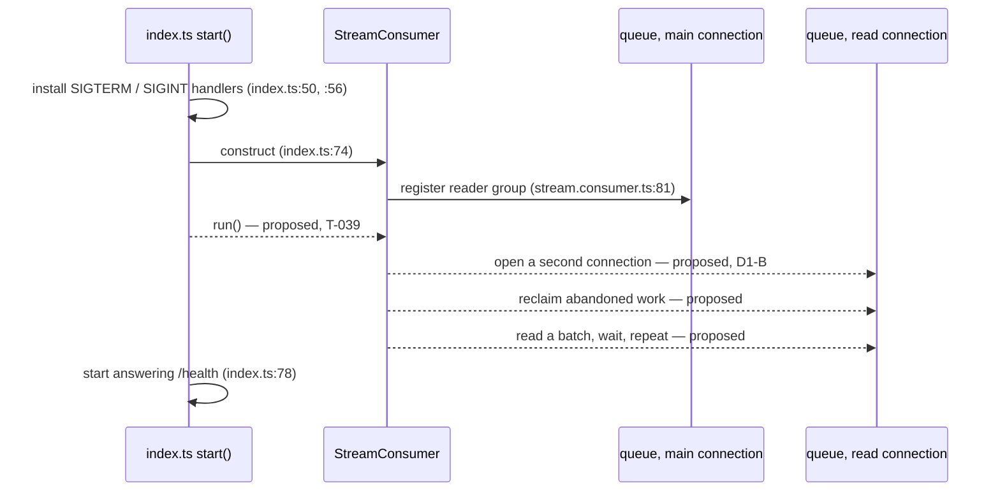
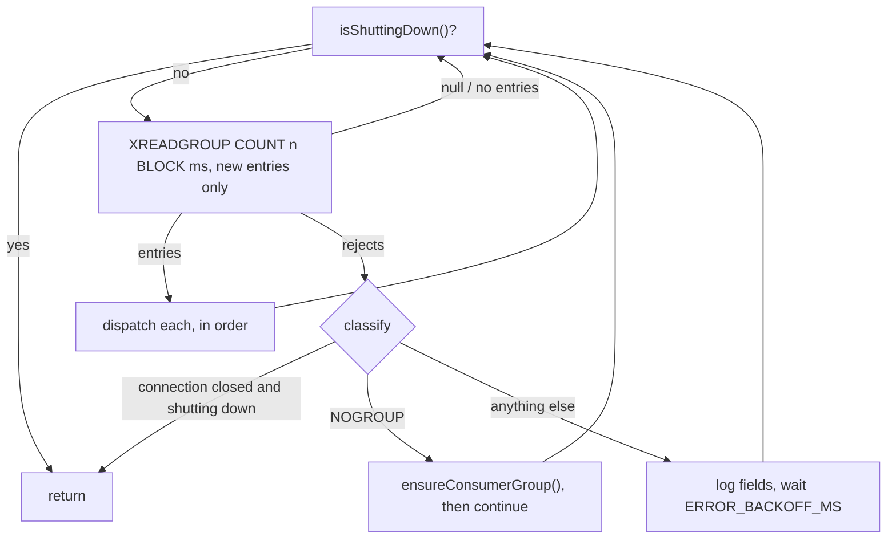

# T-039 — Stream Consumer Loop

**Epic**: 7 — Worker Service · **Milestone**: v1-mvp
**Base revision**: `b558641` (*feat(worker-service): implement T-038 consumer group bootstrap*), working tree clean
**Predecessors**: T-037 (`7ad9375`, env schema) · T-038 (`b558641`, group bootstrap)
**Spec**: `docs/epics/epic-7-worker-service.md:80` — the heading `## T-039 · Stream consumer loop`
**Gate**: 1 (Task Planner). No production code and no tests written. Ends at the approval gate.

**Prior plan for this task**: none. `ls docs/plans/ | grep -i 039` returns nothing; the series runs
`t-038-consumer-group-bootstrap.md` → this file. New plan, not an extension or a replacement.

---
---

# Part 1 — For the analyst

## 1. In plain terms

A queue of usage events exists, and as of the last task a worker is *registered* to read it.
Nothing has ever actually read it. This task builds the reading loop: the part that takes
messages off the queue, one small batch at a time, forever, and stops cleanly when the service
is asked to shut down.

It still does **not** store anything. Turning a message into a billable usage line is the next
task. What this task delivers is the conveyor belt, plus the two safety behaviours a conveyor
belt needs: it must not stall permanently when the queue hiccups, and it must pick up work that
a crashed worker left half-finished.

**Who notices:** no customer, today. No API changes, no database changes, no schema changes.
An operator notices two things — the worker now holds a second, idle connection to the queue,
and messages read but not yet stored appear in the queue's "in flight" list instead of vanishing.

**What it costs if this is wrong**

| If we get this wrong | What happens | Recoverable? |
|---|---|---|
| The loop swallows a failure and stops silently | The service keeps answering "healthy" while consuming nothing. Events pile up until the queue's retention window drops them — then they are gone | Only the events still inside retention |
| The loop treats every failure as fatal, or retries with no pause | A brief queue outage becomes either a crash loop or a flood of error logs at ~6/second (measured: a failed read returns in 153 ms) | Yes, but noisy and expensive |
| Half-finished work is never picked back up | A worker that dies mid-message leaves that message owned by a dead name forever. It is never retried and never reported | Yes, by hand, and only if someone notices |
| The loop acknowledges messages it has not stored | Silent data loss: the queue is told "done" for work nobody did | **No** |
| Shutdown waits for the loop | Every deploy takes up to the full wait window longer. Measured on the shared connection: 4.8 s | Yes, but it compounds across replicas |

The fourth row is the reason for decision **D2** below, and the fifth is the reason for **D1**.

### What already exists, and what this task adds



Solid arrows exist today at the cited `file:line`. Dashed arrows are this task's proposal and
exist nowhere yet. The second connection is dashed twice over: it is both proposed *and*
conditional on decision D1.

> **Every line number in this diagram, and in §S6's controlling-path list and the references at
> §4, §6 and §10, is as of base `b558641` — this task moves all of them.** They resolve against
> the base tree and none of them against the tree being committed: `index.ts:50`/`:56` (signal
> handlers) are now `:79`/`:85`, `:74` (construct) is `:103`, `:78` (`/health`) is `:139`, and
> `stream.consumer.ts:81` (register reader group) is `:319`. Recorded rather than re-pointed,
> because a re-pointed number is stale again after the next task and gives no warning; naming
> the tree does. Flagged at the Gate-4 Round-2 review (L-10) as the **third** stale-citation
> instance in this plan — Round 1 found the other two, AC11's proving case and S1's carrier
> order, and both were corrected in place.
>
> Related: the flowchart in §S5 draws the shutdown check at the **top** of the loop. That is the
> reading Round 1's L-7 refuted — the committed `runLoop()` checks between recovery pages and
> before each read, and its docstring says so. The flowchart is labelled *"Every node is
> proposed; none of it exists"*, so it is a plan-time artifact rather than a false claim about
> shipped code, but it is where the L-7 misconception originated.

---

## 2. Decisions — **ANSWERED at Gate 2 (2026-09-11)**

> **All three answered, and the plan is approved for implementation.**
>
> | Decision | Answer | Effect on the diff |
> |---|---|---|
> | **D1** | **B — a second, dedicated connection** duplicated from the existing one | `run()` reads on its own connection and `stop()` exists; ~15 lines plus `duplicate`/`disconnect` in two test mocks. Enables Hypothesis C (`I12`) and the `.env.example` `STREAM_BLOCK_MS` note. The measured case against sharing: a `PING` during a 2 000 ms block returned after 2 080 ms, and `quit()` waited the block out at 4 813 ms |
> | **D2** | **A — injected handler, default logs and does *not* acknowledge** | Messages stay pending, so nothing published between T-039 and T-040 is lost; T-040 replaces one constructor argument. Assert via `XPENDING`, not via the handler alone |
> | **D3** | **A — keep `worker-1`; revisit in T-043** | No change to `src/config/env.ts`, `.env.example`'s consumer-name line, or T-037's two assertions. Rationale is the measured leak: a name that has consumed leaves a consumer row **permanently**, even at `pending 0` and even after reclaim (P10/P15), while a name that consumed nothing leaves none (P9) — so an instance-unique default trades T-038's observability blind spot for a slow leak whose fix (`XGROUP DELCONSUMER` on clean shutdown) is T-043's |
>
> Read the three subsections below for the evidence; the answers above govern.

All three change the diff; none reshapes the plan, so the slices, tests and risks below
hold whichever way they go. Each says what changes per answer.

Already settled before this plan and **not** re-opened: the shutdown signal is passed to the
loop as an injected predicate (option A at Gate 0), and `export let shuttingDown` stays in
`index.ts`.

---

### D1 · Which connection does the blocking read use? — **RECOMMENDED: a second, dedicated one**

**Question:** the read parks on the connection for up to 5 seconds waiting for work. Should it
park on the service's single existing queue connection, or on a connection of its own?

| Option | Effect | Diff |
|---|---|---|
| **B · Dedicated connection, opened by the consumer from the existing one** *(recommended)* | Nothing else waits behind the read. Shutdown interrupts it in ~0.2 s | ~15 lines in one class, a `stop()` call in `index.ts`, `duplicate`/`disconnect` added to two test mocks |
| A · Share the service's existing connection *(what the epic snippet implies)* | Every other command on that connection waits out the read; shutdown waits out the read | ~0 extra lines |
| C · Do not block at all — poll and sleep | No connection is ever parked, but every read costs a round trip and new work waits for the next poll | similar to B, worse latency, diverges from the epic |

**Why B, measured rather than argued** (Appendix A, probes P11–P14, Redis 7.0.15 / ioredis 5.11.1):

- On the **same** connection, a `PING` issued during a 2 000 ms blocking read returned after
  **2 080 ms**. On a **separate** connection it returned after **0 ms**.
- `quit()` — which is what `app.close()` triggers through the `onClose` hook at
  `apps/worker-service/src/app.ts:32-36` — waited out the block: **4 813 ms** against a 5 000 ms
  read. On the default `STREAM_BLOCK_MS=5000`, option A therefore adds up to ~5 s to every
  shutdown.
- `disconnect()` on the connection ended the in-flight read after **202 ms**, rejecting it with
  `Error: Connection is closed.` That is the clean interrupt option B uses.
- A duplicated connection inherited the same logical database (`CLIENT INFO` → `db=14`), so
  nothing about the reserved-database test hygiene changes.

**What changes per answer:** with A, `stop()` and the `duplicate()` call disappear, integration
case `I12` (shutdown interrupt) is replaced by a case asserting the ~`STREAM_BLOCK_MS` wait is
tolerated, and the shutdown ordering in `index.ts` gains a documented delay. With C, the
`BLOCK` token and `STREAM_BLOCK_MS` leave the read path and become a sleep interval — that
contradicts the epic and T-037's env field, so it should only be chosen deliberately.

---

### D2 · What does the loop do with a message, before the processor exists? — **RECOMMENDED: hand it to a no-op handler and leave it unacknowledged**

**Question:** T-040 builds the part that stores a message. Until then, what does the loop do with
what it reads?

| Option | Effect | Diff |
|---|---|---|
| **A · Dispatch to an injected handler; the default handler logs and does not acknowledge** *(recommended)* | Messages read before T-040 stay in the "in flight" list and are re-delivered later. Nothing is lost. T-040 replaces one constructor argument | handler type + default, ~10 lines |
| B · Log and acknowledge | The queue is drained by a worker that stores nothing — silent loss of every event published between this task and T-040 | ~2 lines |
| C · Do not start the loop in production; export it for tests only | Zero runtime effect; the loop ships unexercised | removes the `index.ts` wiring — **contradicts the Gate-0 decision** that `index.ts:74` passes the predicate |

**Why A.** It is what the epic specifies for the failure case ("On failure, leave in PEL"), it
keeps acknowledgement where T-040 puts it (after the database transaction commits), and it makes
the seam T-040 needs explicit today rather than a rewrite tomorrow. Its cost is honest and small:
until T-040 lands, anything the worker reads sits in the in-flight list. Today that list is
empty and the producer is idle — the queue holds 2 messages, both from before the group existed,
and neither is deliverable (see §4, finding 6).

**What changes per answer:** B removes the "still pending" assertions from `I7` and makes them
"acknowledged" assertions, and adds a data-loss note to the release record. C deletes slice S6
and its shutdown-suite cases.

---

### D3 · Does this task change the `REDIS_CONSUMER_NAME` default? — **RECOMMENDED: no, keep `worker-1`**

**Question:** T-038 handed forward a recommendation to default the consumer's identity to
something instance-unique (hostname/pod) instead of the fixed `worker-1`, for observability.
Do that here?

| Option | Effect | Diff |
|---|---|---|
| **A · Keep `worker-1`; revisit in T-043** *(recommended)* | No change. `XINFO CONSUMERS` shows one row for the whole fleet | none |
| B · Default to a hostname-derived name now | Per-replica visibility. Every distinct name that ever consumed leaves a permanent row in the group | one default in `config/env.ts`, one line in `.env.example`, two env-schema unit tests |
| C · B, plus deregistering the name on graceful shutdown | B without the accumulating rows | B, plus shutdown work that belongs to T-043 |

**Why A, and why this refines rather than rejects the T-038 handoff.** The handoff's two
measured claims still hold and I did not re-derive them (marked inherited): recovery works under
a shared name because idle time is tracked per entry, and what a shared name costs is
observability. What the handoff did not measure is the cost of the fix, which I did:

- A consumer name that has never received a message leaves **no** row —
  three names each did a blocking read against an empty stream, `XINFO CONSUMERS` → `[]` (P9).
- A consumer name that *has* received a message leaves a row **permanently**, even after it
  acknowledges everything and its pending count returns to 0 — three names, three rows at
  `pending 0` (P10). Reclaiming a dead consumer's work does not remove it either: after
  `XAUTOCLAIM`, the dead name remained with `pending 0` (P15).

So B trades one blind spot for a slow leak, and the thing that fixes the leak
(`XGROUP DELCONSUMER` on clean shutdown) belongs to T-043, which owns shutdown. One local
instance is what runs today, and `.env.example` already tells an operator to set the name per
instance.

**What changes per answer:** B adds one slice touching `config/env.ts`, `constants.ts` and
`tests/env.schema.unit.test.ts`, and changes two assertions T-037 pinned. Nothing in the loop
itself changes — it reads `env.REDIS_CONSUMER_NAME` either way.

---

## 3. Scope and non-goals

**In scope**

1. The read loop — batch read, dispatch, repeat, exit on the injected shutdown predicate.
2. Startup recovery of work abandoned by a previous worker (`XAUTOCLAIM`, paginated).
3. Failure handling in the loop: missing group → re-register; anything else → log and pause
   before retrying; connection closed during shutdown → exit quietly.
4. Wiring in `index.ts`: pass the predicate, start the loop, stop it on shutdown, correct the
   stale comment at `index.ts:20-22`, and resolve the three-way flag-naming collision.
5. Inherited **LOW-4**: assert the *fields* of the bootstrap error log, not merely that it fired.
6. A docs-only correction to `.claude/rules/known-gaps.md` **S-15** (§6, slice S1) — kept in its
   own slice so it cannot entangle the feature work.

**Explicit non-goals**

| Not doing | Owner |
|---|---|
| Parsing the message into an `Event` / `UsageLine`, the Prisma transaction, and the acknowledgement that follows it | T-040 |
| Retry counting, dead-letter routing, `MAX_RETRY_COUNT`, `DEAD_LETTER_STREAM` | T-041 (gated on Q10) |
| Draining in-flight work on shutdown, BullMQ close, `XGROUP DELCONSUMER` | T-043 |
| Periodic (as opposed to startup) reclaim of stranded work | not specified by the epic; see §10 |
| Any change to the group's start position | settled in T-038 (D1-A, `$`) |

**Deliberately left broken / unchanged, with reasons**

- **The 2 messages on `telemetry:events` stay unconsumed.** They belong to a tenant that does not
  exist and T-041's failure destination is not built. Nothing in this task changes that; §4
  finding 6 corrects how one might think of retrieving them.
- **S-23** (usage-service accepts `REDIS_STREAM_NAME=""`, worker-service rejects it) is not fixed
  here — it changes another service's startup contract. Its fix direction names
  `apps/worker-service/src/constants.ts:38-44`, the `WORKER_STREAM_CONSTANTS` docblock whose
  "never reaches the fallback" sentence is stale for the empty-string case. This plan therefore
  adds loop constants in a **new sibling object**, not inside `WORKER_STREAM_CONSTANTS`, and does
  not edit that docblock — so an S-23 fix and this task touch disjoint lines.
- **S-8** (worker's internal-auth guard uses `!==`, `preHandler`, and a literal `401`) is
  untouched: the loop has no HTTP surface. Noted rather than omitted.
- **S-19** (five copies of `TenantScopedRepository`; only usage-service has the UTC pin) does not
  bite here — this task opens no database connection and no repository. It bites T-040.
- **S-12** (`pnpm format:check` cannot pass) stays out, as in every recent task.
- **Coverage exclusion.** `apps/worker-service/vitest.config.mjs` excludes `src/events/**` from
  coverage collection, so the file this task grows the most is not measured by the service's
  80/75 thresholds. Not changed here: removing the exclusion is a coverage-policy change whose
  effect on the thresholds is not this task's to absorb. Flagged in §10 for epic-12.

---
---

# Part 2 — For the implementer

## 4. Ground truth: where the epic is right, where it is not, and what I re-ran

> **Added at Gate 5 (QA finding F-2): a fourth epic divergence, decided rather than overlooked.**
>
> `docs/epics/epic-7-worker-service.md:84` says T-039 should "Read batches from the stream,
> process each message, **acknowledge on success**." The shipped loop acknowledges **nothing** —
> that is decision **D2-A**, answered by the user at Gate 2.
>
> The epic is not wrong so much as writing for a T-039 that already had T-040's processor. With
> no processor, "success" has no meaning yet: acknowledging would drain the stream while storing
> nothing, silently losing everything published between this task and T-040. Leaving entries
> pending is the strictly safer direction, costs nothing (they are reclaimable by `XAUTOCLAIM`,
> which `I10` proves), and is consistent with the epic's **own** T-040 entry, which is where
> processing lands. `I7`, `I9` and `I10` assert the non-acknowledgement through `XPENDING`, so
> the divergence is pinned by tests rather than merely intended.
>
> Recorded here because it was previously recorded nowhere: a reader comparing `:84` against the
> code would find a contract mismatch and no note saying it was deliberate. Per `CLAUDE.md`, epic
> specs are shorthand and are sometimes wrong — this is the fourth divergence this task found in
> this one epic entry, after the missing error handling, the cursor-less `XAUTOCLAIM`, and the
> unreachable pre-group backlog. **T-040 is where the acknowledgement arrives**, and it should
> read this note before treating `:84` as its own contract.

The epic's T-039 snippet is directionally right — `XREADGROUP` with `GROUP`/`COUNT`/`BLOCK`/
`STREAMS` and `>`, `XAUTOCLAIM` for stranded work — and wrong in four ways that matter. Every
statement below names the probe that produced it; transcripts are in Appendix A.

**1. The snippet has no error handling at all.** `while (!shuttingDown) { const results = await
redis.xreadgroup(...) }` — one rejection escapes the loop and the loop is over. The process stays
alive, Fastify keeps answering `/health` with `{"status":"ok"}` (`app.ts:48-54`), and consumption
has silently ceased. This is a *missing branch*, not a wrong constant, so a test written from the
epic's wording would pass against an implementation that has the defect.

**2. `if (!results) continue` is correct for the timeout, and the type system will not tell you
so.** Measured: a `BLOCK 300` read with nothing to deliver resolved to `null` after 369 ms (P2);
a read with entries resolved to `[[stream, [[id, [field, value, …]], …]]]` (P1); a read at an
explicit id rather than `>` resolved to `[[stream, []]]` — non-null, zero entries (P-D form 3).
But `xreadgroup`'s declared return type in ioredis 5.11.1 is `Result<unknown[], Context>`
(`node_modules/.pnpm/ioredis@5.11.1/node_modules/ioredis/built/utils/RedisCommander.d.ts:6336-6346`,
the `GROUP/COUNT/BLOCK/STREAMS` overload) — i.e. **not** nullable. Two type probes, compiled with
`--strict --noUncheckedIndexedAccess`:
`const asArray: unknown[] = reply` compiles, and `if (reply === null)` also compiles without
`TS2367` (that comparison is allowed against non-nullable types generally — checked separately
against `string` and `unknown[]`, both accepted). So the compiler neither forces the guard nor
objects to it: the guard must be a deliberate runtime narrowing, and the reply must be parsed by
a shape-checking helper rather than a cast, or the `no-unsafe-*` lint rules fire.

**3. "Re-claim them with `XAUTOCLAIM`" omits the cursor.** `XAUTOCLAIM` is paginated. With 5
entries pending under a dead consumer and `COUNT 2`, three calls were needed — cursors
`…582-2`, `…583-1`, then `0-0`, returning 2 + 2 + 1 (P15). A single call, which is what the
snippet implies, leaves the remainder stranded until the next restart. The reply on 7.0.15 has
**three** elements — `[nextCursor, entries, deletedIds]` — and the third is not decoration: an
entry that was trimmed away while pending came back in that third slot and was removed from the
pending list (P16). Treating the reply as two elements, or as a flat entry list, is the natural
bug here.

**4. The snippet's `shuttingDown` is a free variable, and the comment at `index.ts:20-22` tells
this task to import it. Doing that boots the worker.** Measured, not inherited. Working from a
copy of `src/` under the gitignored `dist/` (never the real tree), I added
`import { shuttingDown } from "../index";` to the copy's `stream.consumer.ts` and then imported
*only* the consumer module:

- Unpatched copy: `exit 0`, no Redis traffic, nothing started.
- Patched copy: the module's evaluation ran `index.ts`'s top level — `initTracing(...)` at
  `index.ts:18` and `void start()` at `:81` — which built the app, attempted the group bootstrap
  against the unreachable Redis the probe pointed at, and killed the process with **exit 1**.

So any test file, and any future module, that imports `StreamConsumer` would boot a worker.
**Two nuances I measured rather than assumed**, because the inherited phrasing overstates one of
them:

- The import cycle (`index` → dynamic `stream.consumer` → static `index`) did **not** throw in
  either direction. Loaded consumer-first or index-first, `shuttingDown` read `false` and
  `StreamConsumer` was a function. The fatal part is the side effect, not a temporal-dead-zone
  error. Do not write "it cycles and crashes"; write "importing it starts the service".
- The ESM binding *would* have worked: with the probe worker running and a real `SIGTERM`
  delivered, a function defined in the consumer module reading the imported binding printed
  `false` before the flip and `true` after. Option B at Gate 0 was rejected for the boot side
  effect alone, not because the value would have been stale.
- Two line numbers handed to this task were off and are corrected above: `initTracing(...)` is
  at `index.ts:18`, not `:17`, and `void start()` is at `:81`, not `:88`
  (`grep -n "initTracing\|void start" src/index.ts` at `b558641`). The dynamic import of the
  consumer at `:30` was right. The conclusion is unaffected; the citations were not.

**5. T-043 owns shutdown, and says the loop "exits after current batch."** That fixes the
granularity of the predicate check: once per iteration, at the top, not between messages within
a batch. This plan follows it.

**6. Correction to an inherited environment claim.** The briefing for this task says the two
messages already on `telemetry:events` "sit before the start position and will not be delivered.
Any test expecting to consume them needs `XAUTOCLAIM` or a `0` start." The first half is right;
the `XAUTOCLAIM` half is **false**, and this matters because it is exactly the kind of
almost-true statement that produces a vacuously green test. Entries that were never *delivered*
are not in the pending list, and `XAUTOCLAIM` only walks the pending list. Measured in four
forms on a fixture reproducing the live shape (2 pre-group entries, group created at `$`):

| Form | Result |
|---|---|
| `XAUTOCLAIM … 0 0-0` immediately after group creation | `["0-0", [], []]` — nothing (P6) |
| Same, after a later entry had been delivered and acknowledged, so the group has history | `["0-0", [], []]` — nothing (P-D form 2) |
| `XREADGROUP … STREAMS <s> 0` (this consumer's own pending list) | `[[stream, []]]` — nothing (P-D form 3) |
| `XGROUP SETID <s> <g> 0`, then `XREADGROUP … >` | both backlog entries delivered (P-D form 4) |

Only moving the group's cursor reaches them. **Consequence for the test strategy:** no
integration case in this task may depend on consuming a pre-group backlog, and `I9` exists to
pin that negative.

**7. `REDIS_CONSUMER_NAME`'s documentation and its default disagree.**
`apps/worker-service/.env.example:60` sets `worker-1` under the comment "must be unique per
running instance". Both cannot be true for a fleet. That is D3; nothing in this task depends on
which way it goes.

**8. Inherited finding LOW-4, re-run rather than trusted.** At `b558641` I changed
`stream.consumer.ts:114` — the line reading
`const errorMessage = error instanceof Error ? error.message : String(error);` — to the literal
`"unknown"`, ran the service suite (**7 files / 65 tests, all passing**), and reverted with
`git checkout --`. The unguarded-error-fields finding is live on the committed tree, exactly as
handed over. Slice S2 closes it.

**9. Inherited finding F7 (SIGTERM during bootstrap) — accepted as described, not re-derived.**
The ordering it depends on is directly readable: handlers at `index.ts:50` and `:56`, bootstrap
at `:75`. This task extends the exposed window (the loop runs between bootstrap and shutdown),
which is why shutdown-during-loop gets its own cases (`U26`, `I12`) rather than a note.

---

## 5. Files to change

### Existing

| File | Change |
|---|---|
| `apps/worker-service/src/events/stream.consumer.ts` | The loop, the recovery pass, the read connection, the message-handler seam. `ensureConsumerGroup` is **not** modified — it is called from a new place |
| `apps/worker-service/src/constants.ts` | New sibling object for the read/recovery tokens and timings. `WORKER_STREAM_CONSTANTS` and its docblock (lines 38-44, the S-23 collision) are left alone |
| `apps/worker-service/src/index.ts` | Pass the predicate at the construction site (line 74 today), start the loop, stop it in `shutdown`, fix the comment at `:20-22`, rename the local re-entrancy flag |
| `apps/worker-service/tests/stream.consumer.unit.test.ts` | New cases `U11`–`U26`; `U3`/`U4` left as they are, with the field assertions added alongside (the shape `U9`/`U10` used for the success path) |
| `apps/worker-service/tests/stream.consumer.integration.test.ts` | New cases `I7`–`I12`. `flushReservedDb()` stays the only `FLUSHDB` route |
| `apps/worker-service/tests/integration.constants.ts` | Fixture vocabulary for the new cases; existing `t038` prefixes untouched, new `t039` prefixes added |
| `apps/worker-service/tests/index.graceful-shutdown.unit.test.ts` | Container mock gains `xreadgroup`, `xautoclaim`, `duplicate`, `disconnect`; new ordering cases |
| `apps/worker-service/.env.example` | One line: `STREAM_BLOCK_MS`'s note gains the shutdown-interrupt behaviour (D1-B only) |
| `.claude/rules/known-gaps.md` | S-15 correction, slice S1 only |

### New

None. No new source file, no new test file, no migration, no dependency.

### Deliberately not modified

`src/app.ts` (no route changes; the `onClose` hook keeps quitting the *main* connection),
`src/config/env.ts` (unless D3-B is chosen), `src/config/container.ts` (the consumer opens its
own read connection from the container's client rather than the container registering a second
one — keeps the change inside one class and out of a file every service copies),
`src/middleware/**` (S-8's), `vitest.config.mjs`.

---

## 6. Implementation slices

Pseudo-TDD per `docs/task-implementer-workflow.md`: write the cases for a slice, confirm red,
implement, refactor on green. Slices are ordered smallest-safe-first; each states the code path
it controls and a hypothesis with the mutation that would refute it.

### Naming: resolving the three-way collision first

`index.ts` today has two flags, and this task adds a third name:

| Name | Where | Role |
|---|---|---|
| `shuttingDown` | `index.ts:22`, exported `let` | the process-wide flag. **Stays** (Gate-0 decision) |
| `isShuttingDown` | `index.ts:33`, function-local `let` | signal re-entrancy guard — *not* the same thing |
| `isShuttingDown()` | new, injected into `StreamConsumer` | the predicate the loop reads |

**Proposal:** rename the local guard at `index.ts:33` to **`signalHandled`**, keep the exported
flag as `shuttingDown`, and keep the injected predicate named `isShuttingDown` (the name settled
at Gate 0). After the rename each name means exactly one thing, and the only name inside
`stream.consumer.ts` is the predicate. `shutdownStarted` is an equally good name for the local;
what is not acceptable is leaving `isShuttingDown` meaning two different things in two files.
No test refers to the local by name — the duplicate-signal case asserts behaviour — so the rename
is contained.

### S1 · S-15 correction in `known-gaps.md` (docs only)

**Controlling path:** `.claude/rules/known-gaps.md:243-244`, the clause
"`T-024C`, `T-024D`, `T-067A`, `T-067B`, `T-067C` have plans and commits but no epic declaration."

Two measured corrections:

- **"and commits" is false.** `git log --all --format="%h %s%n%b" | grep -icE
  "T[- ]?024[CD]|T[- ]?067[ABC]"` → `0`, grep exit 1. None of the five ids appears in any commit
  subject or body, in any spelling tried (hyphen, space, or none). What shipped is the *plan
  files*, as payload of differently-titled commits — and there are five carriers, not the two the
  briefing named: `d68e719` (t-024c), `e3d7556` (t-024d), `21c9a9e` (t-067a), `f47b7d8`
  (t-067b), `eb3ef10` + `4925e4a` (t-067c). Naming all five matters, because the point of the
  clause is that id-based archaeology fails.

  **Corrected at Gate-3 rework (Round 1, S1 row):** this line originally wrote the t-067c pair
  as `4925e4a` + `eb3ef10`, i.e. in the wrong order. `eb3ef10` **added** the plan file and
  `4925e4a` **modified** it. Re-derived rather than copied from the review:
  `git log --name-status --diff-filter=AM --oneline -- docs/plans/t-067c-*.md` reports
  `eb3ef10 A` and `4925e4a M`. `known-gaps.md` itself always carried the correct order.
- **Add the count mismatch.** `docs/epics/README.md:138` reads `| **Total** | **73** | |`, and the
  per-epic column above it sums to 73 — internally consistent. The epic files declare **76**
  task headings resolving to **75** distinct ids (`T-070` declared twice). The three extra
  headings are `T-024B`, `T-025A` and the duplicate `T-070`. State it that way; "73 against 75"
  alone invites the reader to look for two extra ids when one of the three is a duplicate.

Keep both inside S-15. Do not renumber, do not close the gap, and change nothing else in the file.

**Hypothesis:** this slice is independent of every other. *Falsified if* `git diff --stat` for S1
touches any file under `apps/`.

### S2 · Close LOW-4 — assert the bootstrap error log's fields (tests only)

**Controlling path:** `stream.consumer.ts:114-123`, the error branch of `ensureConsumerGroup`
(the `errorMessage` line and the `logger.error({ streamName, groupName, error }, "Failed to
ensure stream consumer group")` call that follows it).

Add `U22` (an `Error` rejection: assert the three fields and the message) and `U23` (a non-`Error`
rejection: assert `error` is the `String(...)` form). Leave `U3`/`U4` untouched — they assert the
rethrow contract, which is a different claim, exactly as `U9`/`U10` were added beside `U2`.

**Hypothesis:** after S2, the mutation from §4 finding 8 goes red. *Falsified if* replacing
`String(error)` with `"unknown"` still leaves the suite green — in which case the new case is
asserting the call, not the field, and is worthless.

**The F1 trap, to write into the test file:** assert the error *message text* against the literal
the probe observed, not against a constant the implementation also reads. An assertion whose two
sides move together catches a code change and not a value change; say which one the case catches.

### S3 · Constants and the reply parser (no behaviour change)

**Controlling path:** `constants.ts` after the `WORKER_CONSUMER_GROUP_BOOTSTRAP` object
(which ends at line 153 today), and a module-private parser in `stream.consumer.ts`.

New sibling object — name it for what it is (`WORKER_STREAM_READ`) and keep it out of
`WORKER_STREAM_CONSTANTS` for the reason T-038 gave for its own sibling: that object's members
all feed `config/env.ts`, these feed only the consumer. Members, each with the probe that
justifies it:

| Member | Value | Why |
|---|---|---|
| `SUBCOMMAND_GROUP`, `OPTION_COUNT`, `OPTION_BLOCK`, `OPTION_STREAMS` | `"GROUP"`, `"COUNT"`, `"BLOCK"`, `"STREAMS"` | ioredis resolves the overload on these literals (`RedisCommander.d.ts:6336-6346`) |
| `NEW_ENTRIES_ONLY` | `">"` | undelivered entries only (P1) |
| `PENDING_START_ID` | `"0-0"` | `XAUTOCLAIM` start cursor, and the value Redis returns when the scan is complete (P15). One constant, documented as serving both roles — two names for one literal is the DRY finding |
| `RECOVERY_IDLE_MULTIPLIER` | `2` | the epic's `blockMs * 2`; the idle threshold is derived from `STREAM_BLOCK_MS`, never a second literal |
| `ERROR_BACKOFF_MS` | `1_000` | a failed read against an unreachable server returned in 153 ms, then 603 ms (P17). Without a pause the loop logs ~6 errors/second |
| `MISSING_GROUP_ERROR_PREFIX` | `"NOGROUP"` | the reply when the group or the key is gone (P7, P8) |
| `CONNECTION_CLOSED_ERROR_MESSAGE` | `"Connection is closed."` | what an in-flight read rejects with when the connection is disconnected (P14) |

Prefix matching for `NOGROUP` uses `startsWith`, for the reason T-038's
`ALREADY_EXISTS_ERROR_PREFIX` docblock records: `includes` can be satisfied by an operator-chosen
group *name* appearing inside an unrelated reply. Note in the docblock, as measured: the two
replies observed here (`NOGROUP No such key '…' or consumer group '…' in XREADGROUP with GROUP
option`, for both a missing key and a missing group) satisfy both predicates, so this is
prophylaxis, not a fix for an observed disagreement.

The parser turns `unknown` into `Array<[id: string, fields: string[]]>` by checking shapes, and
returns `[]` for `null` and for a stream tuple with no entries. It must not cast.

**Hypothesis:** the parser is total over the three observed reply shapes (`null`,
`[[stream, entries]]`, `[[stream, []]]`). *Falsified if* a unit case feeding any of the three
throws or yields the wrong count. Scope stated as measured: three shapes observed on 7.0.15 —
this is not a claim that no other shape exists.

### S4 · Startup recovery (`XAUTOCLAIM`, paginated)

**Controlling path:** new `recoverPendingMessages()` on `StreamConsumer`, called once by `run()`
before the first read.

Behaviour: loop `XAUTOCLAIM <stream> <group> <consumer> <blockMs × multiplier> <cursor> COUNT
<batch>` from `PENDING_START_ID` until the returned cursor is `PENDING_START_ID` again; dispatch
every returned entry through the same handler as the main loop; log a count when non-zero. A
failure here is logged and does **not** prevent the loop from starting — recovery is best-effort,
and a worker that refuses to start because it could not reclaim old work is strictly worse than
one that starts and reclaims on the next restart. Guard the pagination with a bounded iteration
count so a server that never returns `0-0` cannot spin forever.

**Hypothesis:** a single `XAUTOCLAIM` call is insufficient. *Falsified if* an integration case
seeding more pending entries than `COUNT` and then running recovery still reclaims all of them
after the loop is replaced by one call — the mutation is "delete the `while`", and `I10` must go
red on it.

### S5 · The read loop

**Controlling path:** new `run()` (and `stop()` under D1-B) on `StreamConsumer`.



Every node is proposed; none of it exists. The three rejection classes come from P14, P7/P8 and
P17 respectively.

Details that are decisions, recorded rather than asked:

- **The predicate is read once per iteration, at the top** — T-043's "exits after current batch".
  A mid-batch check would abandon messages already delivered to this consumer; under D2-A they
  are unacknowledged anyway, but the simpler rule is also the specified one.
- **`ensureConsumerGroup()` is reused, not duplicated**, for the `NOGROUP` path. T-038 made it
  public and re-callable for exactly this. If the re-registration itself throws, treat it as the
  generic error branch (log, back off) rather than letting it escape the loop.
- **Logging discipline:** log entry ids and counts, never the field payload. The messages carry
  `tenantId` and customer-shaped metadata (the producer writes every event property as a flat
  field — the `Object.entries(event)` loop at `apps/usage-service/src/events/stream.publisher.ts:63-66`), and this task has no
  redaction layer. No tenant context is derived anywhere in this task.

**Hypothesis A:** the loop survives a transient failure. *Falsified if* a unit case whose mocked
read rejects once and then resolves does not produce a second read.
**Hypothesis B:** the loop terminates on the predicate without relying on the connection closing.
*Falsified if* a unit case whose predicate returns `true` after the first iteration, with a read
that resolves normally, does not stop at exactly one read.
**Hypothesis C (D1-B only):** shutdown does not wait out `STREAM_BLOCK_MS`. *Falsified if* `I12`,
with a live 5 000 ms block interrupted by `stop()`, takes longer than a small fraction of it —
the measured interrupt was 202 ms (P14).

### S6 · Wiring in `index.ts`

**Controlling path:** `index.ts:20-22` (the stale comment), `:33` (the local guard), `:35-48`
(`shutdown`), `:74-75` (construction and bootstrap), `:77-78` (listen).

- Replace the comment at `:20-22`. It currently instructs T-039 to
  `import { shuttingDown } from "../index"` inside the consumer. Write what §4 finding 4
  measured: that import boots the service from any module that touches the consumer, so the flag
  is passed as `() => shuttingDown` at the construction site instead. Keep it short and name the
  probe's outcome, not the theory.
- Pass the predicate as the 4th constructor argument at `:74`.
- After `await streamConsumer.ensureConsumerGroup()`, start the loop **without awaiting it**
  (`void streamConsumer.run()`, matching the `void start()` idiom at `:81`; the
  `no-floating-promises` rule is a warning and `void` is how this repo satisfies it), then bind
  the listener. Startup order becomes: handlers → bootstrap → loop started → `listen`. `/health`
  therefore never answers before the group exists *or* before the loop is running, which is the
  property `U7` already guards for the bootstrap half.
- In `shutdown`, call `await streamConsumer.stop()` **before** `app.close()` (D1-B). Order
  matters and is measured: `app.close()` triggers the `onClose` hook at `app.ts:32-36`, which
  calls `quit()`; `quit()` waits for an in-flight blocking read (4 813 ms, P13) while
  `disconnect()` ends it in 202 ms (P14). Under D1-A there is no `stop()` and the ~5 s wait is
  the accepted cost.
- Rename the local guard to `signalHandled`.

**Hypothesis:** the loop is started before the listener binds and does not delay it. *Falsified
if* a shutdown-suite case cannot observe both "`xautoclaim` invoked before `listen`" and "`listen`
resolved while the first read was still pending".

---

## 7. Test plan and acceptance-coverage mapping

Baseline to beat, measured at `b558641` (Appendix B): worker-service **7 files / 65 tests**,
all passing; scoped lint and typecheck clean; root `pnpm test`, `typecheck`, `lint`, `build` all
**13/13 packages, 0 cached**.

### Acceptance criteria → the cases that prove them

| AC | Criterion | Proven by |
|---|---|---|
| AC1 | The read issues `GROUP/COUNT/BLOCK/STREAMS >` with group, consumer, batch size and block ms taken from parsed env, not from defaults | `U11` (argument vector with non-default env; negative half asserts the defaults are absent from the vector) |
| AC2 | A `null` reply is a normal timeout: no throw, no error log, loop continues | `U12`; `I8` on a live empty stream |
| AC3 | Every delivered entry reaches the handler once, in stream order | `U13`; `I7` |
| AC4 | The loop exits when the predicate is true, checked once per iteration | `U14` (true before the first iteration → zero reads), `U15` (flips after one batch → exactly one read) |
| AC5 | Startup recovery reclaims entries idle beyond `STREAM_BLOCK_MS × RECOVERY_IDLE_MULTIPLIER`, paginating to completion, dispatching through the same handler | `U19` (idle argument + pagination over a mocked non-zero cursor), `U20` (handler), `I10` (live, more pending than `COUNT`) |
| AC6 | A `NOGROUP` reply re-registers the group and the loop continues | `U16`; `I11` (live `DEL` of the key mid-run) |
| AC7 | Any other read failure logs stream, group, consumer and error message, then pauses `ERROR_BACKOFF_MS` before retrying | `U17` (fields asserted, fake timers for the pause), `U18` (non-`Error` rejection) |
| AC8 | A read interrupted by shutdown ends quietly: no unhandled rejection, no error-level log, loop terminates | `U26`; `I12` |
| AC9 | No literals in the loop: tokens, ids, multiplier and backoff all from constants | reviewer gate, plus `U11`/`U19` importing the same constants |
| AC10 | The bootstrap error path's log fields are asserted (LOW-4) | `U22`, `U23` |
| AC11 | Startup order: bootstrap → recovery → loop started → listen, and the loop does not delay the listener | `U25`, `U31` in the shutdown suite — **corrected in place at the Gate-3 rework.** This row originally read "`U24`, `U25` in the shutdown suite", which is wrong twice: §7's own case list assigns `U24` to the *unit* suite (reads happen on the duplicated connection), and AC11's second half — the `stop()`-before-`close()` ordering — is proven by `U31`. Recorded as a deviation in Round 1 rather than edited, which left the wrong citation in the one place a reader looks |
| AC12 | Docs: S-15's "and commits" clause corrected with the five carriers; the 76/75/73 count stated | inspection at Gate 4 — no test |
| AC13 | The pre-group backlog remains unreachable, and no case depends on consuming it | `I9` (negative: neither the loop nor recovery delivers it) |

### Gate-3 deviations from the table above (recorded at implementation, not planned)

Four cases were added beyond §7's list, and one citation in the table is wrong. Each is
listed with why, because "the plan said N cases" is a thing the reviewer checks.

| Id | Where | Why it was not in the plan |
|---|---|---|
| `U27` | unit | The plan's S3 hypothesis requires all **three** observed reply shapes, but the case list only had `U12` (`null`) and `U13` (entries). `[[stream, []]]` is truthy, so a `!reply` guard alone does not cover it and no listed case did |
| `U28` | unit | `U26` alone is vacuous: classifying *every* `Connection is closed.` as a clean shutdown passes it, and silently turns a dropped connection into a stopped consumer. `U28` is the negative half — same text, no stop requested, must still be an error |
| `U29` | unit | **Ratified at the Gate-3 transition (2026-09-11): the per-entry catch stays in T-039**, rather than moving to T-040 — the user chose this over removing it, so it is a settled decision and not an implementer liberty. Rationale: the default handler cannot fail, so removing the catch would ship a latent misbehaviour that first appears when T-040 wires a handler that can reject. Implementation choice this gate made: a handler rejection is caught per entry rather than falling into the read-error classifier. Without the catch, one poison entry abandons the rest of the batch and pauses the loop. New behaviour needs its own case |
| `U30` | unit | §6 S5 requires "if the re-registration itself throws, treat it as the generic error branch"; no case in §7 covered that branch. An exception escaping there ends the loop |
| `U31` | shutdown | §6 S6 requires `stop()` **before** `app.close()`, and no case in §7 asserted that ordering — the measured 4 813 ms vs 205 ms difference had no test |

### Cases added at the Gate-3 rework (Round 1 fixes, all user-approved)

| Id | Where | Why |
|---|---|---|
| `U32` | unit | **H-1.** `run()` rejected when `duplicate()` threw. Constructed with a throwing `duplicate`, asserts `run()` resolves and logs `Stream consumer loop failed`. Red before the fix: `promise rejected "Error: duplicate is not a function" instead of resolving` |
| `U33` | unit | **H-1**, the second uncaught path: a shutdown predicate that throws — on its *second* call, so the case also covers the `finally` that closes the read connection. Red before the fix, at `shouldStop` inside the `do`/`while` condition |
| `U34` | unit | **D-2.** `buildDefaultMessageHandler` is what `index.ts` constructs, and nothing asserted it. Covers the log fields, the id-only-never-payload negative across *every* logger method, and `xack` never called (D2-A) |
| `U35` | unit | **D-1 / M-1.** A `stop()` landing on an in-flight `XAUTOCLAIM` logged at `error`, contradicting AC8. Red before the fix on `expect(mockLogger.error).not.toHaveBeenCalled()`. Also pins the one read that still follows recovery (L-7's real sequence) |
| `U36` | unit | **D-1 / M-1**, second half: recovery re-checks the predicate between pages. Red before the fix on `xautoclaim` called twice instead of once |
| `U37` | unit | **L-3.** The `malformed` warn branch and the parser's "a non-string field makes the *whole entry* malformed" design claim, neither of which anything exercised |
| `U38` | unit | **L-3.** The `RECOVERY_MAX_PAGES` liveness bound, which no case reached |

`U37` and `U38` cover behaviour that already existed, so they were green on arrival; each was
mutated to prove it is not vacuous (removing the warn → `U37` red; the page bound written as a
literal `10` → `U38` red).

**AC11's "`U24`, `U25`" is a plan error.** `U24` is assigned to the unit suite in §7's own case
list (reads happen on the duplicated connection). AC11 is proven by `U25` (bootstrap →
recovery → listen ordering, and `listen` resolving while the first read is outstanding) and
`U31` (stop before close), both in the shutdown suite.

### Unit suite — `tests/stream.consumer.unit.test.ts`

Continues the `U`-numbering (`U1`–`U10` exist). Mock shape follows the file's existing choice: a
named-method object rather than `Record<string, …>`, to keep `noUncheckedIndexedAccess` from
forcing a cast at every call site. The mock gains `xreadgroup`, `xautoclaim`, `duplicate`
(returning the read mock) and `disconnect`. Helpers that locate a call must throw when it is
missing, as `xgroupArgs()` does — a vacuous pass here is the main risk in a loop suite.

`U11` argument vector · `U12` null reply · `U13` dispatch order and arity · `U14`/`U15` predicate
granularity · `U16` NOGROUP → `ensureConsumerGroup` then continue · `U17` generic error: fields +
backoff · `U18` non-`Error` rejection · `U19` recovery idle argument and pagination · `U20`
recovery dispatch · `U21` recovery failure does not prevent the loop starting · `U22`/`U23`
LOW-4 · `U24` reads happen on the duplicated connection and never on the container's (D1-B;
negative half: the main mock's `xreadgroup` is never called) · `U26` connection-closed during
shutdown exits without an error log.

Every case that drives the loop must terminate it deterministically — a predicate that flips
after N iterations, not a timer.

### Integration suite — `tests/stream.consumer.integration.test.ts`

Continues the `I`-numbering (`I1`–`I6` exist). Constraints that are not negotiable:

- **Logical database 14 only**, and **every** `FLUSHDB` through `flushReservedDb()`, which
  re-asserts `CLIENT INFO` contains `db=14` on each call. This is S-22's certified pattern and it
  exists because a one-guard-in-`beforeAll` shape was measured to let teardown flushes through.
  A duplicated connection inherits the index (`CLIENT INFO` → `db=14`, P12), but any *new* client
  the new cases open must be built from `reservedDbUrl`, as `I6` does.
- **Per-case unique stream and group names** via `nextFixtureNames()`; add `t039` prefixes to
  `integration.constants.ts` rather than reusing the `t038` ones.
- **Never db 0.** The live `telemetry:events` must still show `XLEN 2` and zero groups when the
  suite finishes; that is the fixture T-038's D1 argument rests on.
- **Short block values.** These cases pass their own `ServiceEnv` object, so use a small
  `STREAM_BLOCK_MS` (tens of ms) except in `I12`, which needs a long one to prove the interrupt.

`I7` end-to-end: entries added after bootstrap reach the handler and are **still pending**
afterwards (D2-A) — assert via `XPENDING`, not via the handler alone · `I8` empty stream: the
read times out and the loop survives · `I9` the pre-group backlog is delivered by neither the
loop nor recovery (the anti-vacuity case; assert the specific backlog ids are absent) · `I10`
recovery across a `COUNT` boundary, seeded under a different consumer name · `I11` `DEL` the
stream mid-run → the group is re-registered and consumption resumes · `I12` `stop()` interrupts a
long block promptly.

### Shutdown suite — `tests/index.graceful-shutdown.unit.test.ts`

The container mock at the shared object (the plan-R4 shape T-038 chose so this task extends one
place) gains `xreadgroup`, `xautoclaim`, `duplicate`, `disconnect`. Existing cases must stay green
unchanged — in particular `U7` (bootstrap before listen) and `U8` (fail-closed on unreachable
Redis). New: `U25` recovery invoked before `listen`, and `listen` resolves while the first read is
still pending.

---

## 8. Validation commands

### Task-scoped, in order, fail fast

```bash
# the two suites this task grows, scoped properly — `--filter <pkg> test -- <file>` does NOT filter
pnpm --filter @telemetry/worker-service exec vitest run tests/stream.consumer.unit.test.ts
pnpm --filter @telemetry/worker-service exec vitest run tests/stream.consumer.integration.test.ts
pnpm --filter @telemetry/worker-service exec vitest run tests/index.graceful-shutdown.unit.test.ts

pnpm --filter @telemetry/worker-service typecheck
pnpm --filter @telemetry/worker-service lint
pnpm --filter @telemetry/worker-service test
pnpm --filter @telemetry/worker-service build
```

**Do not pass `--force` to a filtered script.** `--force` is turbo's, and
`pnpm --filter @telemetry/worker-service lint --force` forwards it to eslint, which fails with
`Invalid option '--force' - perhaps you meant '--format'?` and exit status 2. Measured. It
belongs on the root commands below, where turbo consumes it.

### Full gate (the reviewer runs this with `--force`, so cached results cannot be replayed)

```bash
pnpm build --force && pnpm test --force && pnpm lint --force && pnpm typecheck --force
```

### The manual check that proves the task

**Corrected at the Gate-3 rework. The block this replaces would have damaged the live fixture,
and running it as written was the wrong instruction, not merely an unlucky one.** It prescribed
`pnpm --filter @telemetry/worker-service dev` — which takes `REDIS_URL=redis://localhost:6379`
from the root `.env`, i.e. logical database **0**, where the real `telemetry:events` lives — and
then an `XADD` followed by an `XDEL`. Three irreversible consequences, each measured on a
disposable database rather than reasoned about:

- `XADD` then `XDEL` leaves `entries-added` at **2 → 3** and `last-generated-id` moved. Both are
  monotonic; `XDEL` restores neither (`XADD` ×2 → `entries-added 2`; `XDEL` the second id →
  still `entries-added 2`, `last-generated-id` = the deleted id).
- It creates `worker-group` on the real stream, plus a consumer row for `worker-1`. A name that
  has consumed leaves that row **permanently**, even at `pending 0` and even after its work is
  reclaimed (P10/P15).
- `XINFO GROUPS telemetry:events` going from empty to one group destroys the fixture T-038's D1
  argument and `I9`'s premise both rest on.

Run it against the reserved database and a disposable stream instead. This is the shape that was
actually used, both at the first Gate 3 and again at the rework:

```bash
cd apps/worker-service
set -a; . ../../.env; set +a                     # DATABASE_URL, OTEL endpoint, ...
export REDIS_URL="redis://localhost:6379/14"     # reserved index, never 0
export REDIS_STREAM_NAME="t039-manual:events" REDIS_CONSUMER_GROUP="t039-manual-group"
export REDIS_CONSUMER_NAME="t039-manual-worker" STREAM_BLOCK_MS=5000
export PORT=4299                                 # a dev worker may already hold the default
export INTERNAL_API_SECRET="<32+ characters>"    # the root .env's value is shorter than
                                                 # SECRET_MIN_LENGTH and `parseEnv` throws
node --import tsx src/index.ts &                 # not `dev`: `tsx watch` would restart the
                                                 # worker on every edit made while it is up

redis-cli -n 14 XINFO GROUPS t039-manual:events
redis-cli -n 14 XADD t039-manual:events '*' eventId probe-t039-manual \
  tenantId 11111111-1111-4111-8111-111111111111
redis-cli -n 14 XPENDING t039-manual:events t039-manual-group   # D2-A: still pending
redis-cli CLIENT LIST | grep cmd=xreadgroup                     # the parked read, db=14
kill -TERM <pid>                                                # and time it
redis-cli -n 14 DEL t039-manual:events                          # leave db 14 at DBSIZE 0
```

Observed at the rework, with `STREAM_BLOCK_MS=5000`: group created; `CLIENT LIST` showed one
parked row carrying `db=14` and `cmd=xreadgroup`; the added entry reached the **default** handler
(`"Received stream entry; no processor is wired yet"`, with `entryId` and no field payload);
`XPENDING` reported it still pending under `t039-manual-worker`; `SIGTERM` → `"Shutdown
complete"` in **50 ms**; and the whole run wrote **zero** `warn`- or `error`-level lines, which
is AC8 end-to-end. Afterwards `redis-cli -n 14 DBSIZE` → `0`, and db 0 was untouched:
`DBSIZE 1`, `XLEN 2`, `entries-added 2`, `last-generated-id 1788171536033-0`, `XINFO GROUPS`
empty.

### Environment, verified by command rather than assumed (Appendix B)

Redis 7.0.15 on `127.0.0.1:6379`; db 0 holds exactly `telemetry:events` (`XLEN` 2,
`entries-added` 2, ids `1787746970722-0` and `1788171536033-0`, `XINFO GROUPS` empty); db 14
`DBSIZE` 0. CI provisions `redis:7-alpine` and `REDIS_URL=redis://localhost:6379`
(`.github/workflows/ci.yml`), where db 14 is necessarily empty. The `XAUTOCLAIM` three-element
reply is a Redis ≥ 7.0 shape; measured on 7.0.15 only, and CI's `7-alpine` is also 7.x — not
verified on any other server.

---

## 9. Risks and mitigations

| # | Risk | Severity | Mitigation |
|---|---|---|---|
| R1 | A case passes vacuously because it expects the live backlog to be consumable | HIGH | `I9` pins the negative in both directions (loop and recovery); §4 finding 6 records the four forms measured |
| R2 | The blocking read starves everything else on the connection | MEDIUM | D1-B; measured 2 080 ms vs 0 ms (P11/P12) |
| R3 | Shutdown gains a multi-second wait | MEDIUM | D1-B and `stop()` before `app.close()`; measured `quit()` 4 813 ms vs `disconnect()` 202 ms (P13/P14) |
| R4 | Hot error loop against an unreachable server | MEDIUM | `ERROR_BACKOFF_MS`; measured rejection latencies 153 ms then 603 ms (P17); `U17` asserts the pause with fake timers |
| R5 | Recovery leaves entries stranded because the cursor loop is missing | MEDIUM | `U19` + `I10`; measured 3 rounds for 5 entries at `COUNT 2` (P15) |
| R6 | `unknown[]` hides the `null` reply and invites a cast | MEDIUM | Shape-checking parser (S3); the `no-unsafe-assignment`/`no-unsafe-member-access` lint warnings surface a cast-based shortcut |
| R7 | Unacknowledged messages accumulate before T-040 | LOW today | D2-A with the cost stated; the producer is idle and the queue's only entries predate the group |
| R8 | Timing-dependent integration cases turn flaky in CI | MEDIUM | Small block values everywhere except `I12`; assert on state (`XPENDING`, `XINFO`) rather than on elapsed time, except the one case whose subject *is* elapsed time — and there, assert "much less than the block", not a tight bound |
| R9 | The change collides with S-23's fix area | LOW | New sibling constants object; `WORKER_STREAM_CONSTANTS`' docblock (lines 38-44) untouched |
| R10 | A test file importing `StreamConsumer` boots the worker | HIGH if reintroduced | Never import `../index` from `src/**`; the comment at `index.ts:20-22` is corrected in S6 so the next reader is not told to |
| R11 | Stale line citations in this plan after the diff lands | LOW | Every cited line says what is at it; cases are referenced by id, not by line |
| R12 | Suite totals in later gate reports drift from the 65 recorded here | LOW | §7 states the baseline and its revision; re-measure rather than quoting this number after the diff |

---

## 10. Handed forward (measured here, not guesses)

- **To T-040.** The handler seam is `(id: string, fields: string[]) => Promise<void>`; the fields
  array is the flat key/value list the producer writes from `Object.entries(event)`
  (`apps/usage-service/src/events/stream.publisher.ts:63-66`, the `Object.entries(event)` loop). Acknowledgement belongs on the
  T-040 side of that seam, after the transaction commits. **S-19 lands there, not here**: the
  four non-usage copies of `TenantScopedRepository` have no UTC session pin, and worker-service
  is one of them.
- **To T-041.** An entry trimmed away while pending is reported in `XAUTOCLAIM`'s third reply
  element and removed from the pending list (P16) — a dead-letter design should not assume every
  pending id still has a payload.
- **To T-043.** Consumer rows persist for any name that has ever consumed, at `pending 0`, and
  are not removed by reclaiming their work (P10, P15). If D3 is ever answered B, pair it with
  `XGROUP DELCONSUMER` on clean shutdown. T-043 also owns draining in-flight work; this task
  deliberately does not await the loop's current message on shutdown.
- **To epic-12.** `apps/worker-service/vitest.config.mjs` excludes `src/events/**` from coverage,
  so the service's most logic-dense file is outside its own 80/75 thresholds.

---

## 11. Pending task checklist

- [done] **User answers D1 (read connection), D2 (acknowledgement policy) and D3 (consumer-name default)**
- [done] Gate 2 approval of this plan
- [done] S1 — S-15 correction, docs only; `git diff --stat` after the edit listed only `.claude/rules/known-gaps.md`, no `apps/` file
- [done] S2 — `U22`/`U23` added. Mutation `String(error)` → `"unknown"` (the exact inherited one): **on the final tree it reddens two cases, `U23` and `U18`** — re-run at the Gate-3 rework rather than copied from the review (`Tests 2 failed | 32 passed (34)`). The original line said "`U23` red, `U22` and U1-U10 green", which was true *when S2 ran* — `U18` did not exist yet — and read as "U23 only" afterwards. Corrected per Round 1, L-6. Dropping the whole `error` field: `U22` **and** `U23` red. Neither was catchable before
- [done] S3 — `WORKER_STREAM_READ` added as a sibling object (`constants.ts` diff is 114 insertions, **0** deletions, so lines 38-44 are untouched). Parser is shape-checking, no cast. Three observed shapes re-measured on 7.0.15 and covered by `U12` (`null`), `U13` (entries), `U27` (`[[stream, []]]`)
- [done] S4 — `recoverPendingEntries()`, paginated and bounded. Mutation `while` → `if` (a single `XAUTOCLAIM`, the epic's wording): `U19` red and `I10` red. Mutation dropping the multiplier: `U19` red
- [done] S5 — `run()`/`stop()`, all three rejection classes. Mutations each red in the case that owns them: no backoff → `U17`; NOGROUP not repaired → `I11`; classify on the message alone → `U28`; read on the container connection → `U24` (+15 others); `stop()` stops disconnecting → `I12`; acknowledge what was read → `I7`, `I9`, `I10`
- [done] S6 — wiring, comment correction, `signalHandled` rename. `U7`/`U8` green unchanged. Mutations: `await run()` → 10 cases red; loop started after `listen` → `U25` only; `stop()` after `app.close()` → `U31` only. The T-038 mock also emitted 8 unhandled rejections once `run()` was wired (`duplicate is not a function`) while still reporting 10 passed — fixed, now 0
- [done] Task-scoped: worker typecheck/lint/build clean, 7 files / **92** tests (baseline 65, +27). Root `--force`: build 13/13, test 13/13, lint 13/13, typecheck 13/13, 0 cached. 14 lint warnings, all pre-existing and proven so
- [done] db 0 `telemetry:events`: `XLEN 2`, zero groups, `last-generated-id 1788171536033-0` — identical to baseline. db 14 `DBSIZE 0`. db 0 did gain a self-expiring `denylist:<jti>` key during the root `pnpm test` — that is auth-service writing to db 0, i.e. **S-22**, not this change
### Gate-3 rework, after Gate 4 returned CONDITIONAL (Round 1)

Scope: the four required fixes, both answered decisions (**D-1 = A**, **D-2 = A**), and every
LOW. Every line below is a measurement taken on this tree, not a restatement of the review.

- [done] **H-1** — `run()` really could reject. Fixed in the owning module rather than at the
  call site: `run()` is now a `try`/`catch` around a private `runLoop()`, so its body is a
  single statement and there is no "outside the `try`" left inside the method. Red first:
  `U32` (`promise rejected "Error: duplicate is not a function" instead of resolving`) and
  `U33` (same, from `shouldStop` in the `do`/`while` condition). Mutation on the final tree —
  delete the `catch` — `Tests 2 failed | 32 passed (34)`, exactly `U32` and `U33`. Both
  comments rewritten to the scoped claim, each naming that mutation. **Ratified by the user at
  the Gate-4 Round-1 transition (2026-09-11): no second `.catch()` in `index.ts`** — this was
  the one judgement call the rework flagged as overturnable, and it stands, so it is a settled
  decision rather than an implementer liberty. **Deliberately not also `.catch()`-ing at
  `index.ts`, and the reason is *not* unreachability.** An earlier revision of this entry said
  "that branch is unreachable and no test could cover it". **Refuted at the Gate-4 Round-2
  review (M-7)** by a nine-line probe: give the consumer a `logger.error` that throws, and
  `run()` rejects. `stream.consumer.ts:374-376` already said as much — the plan was
  contradicting its own source, which is the one place a reader would have checked.

  The decision stands, on the better reason the refutation exposes: a `.catch()` at
  `index.ts:120` would log through `container.logger`, **the same object that just threw**, so
  it would be inert in precisely the case that makes it reachable. Defence in depth that shares
  a dependency with the failure it guards is not defence in depth. What would make a `.catch()`
  the right answer later is a *different* sink — `process.stderr.write`, or a second logger —
  and the comment at the call site says so
- [done] **M-2** — the tautological flag deleted, not repaired, and the comment now credits
  `appListen`. Vacuity measured in situ before deleting: with the first read changed to
  `mockResolvedValueOnce(null)` so it genuinely settles, `firstReadSettled()` still reported
  `false` and the file still reported `12 passed`. `U25` gained a real ordering assertion in
  its place, and the measured order was a surprise worth recording — the first **read** lands
  *after* `listen` (invocation orders 118 vs 119), because `void run()` runs synchronously only
  as far as the first `XAUTOCLAIM`. That pair is labelled in the case as recording an order
  rather than detecting a defect: the two available mutations redden earlier assertions
- [done] **M-3** — `hasParkedRead()` was server-wide. False positive reproduced at two levels:
  at the shell (a blocking `XREADGROUP` parked on **db 13** satisfied `CLIENT LIST |
  grep cmd=xreadgroup` with `grep 'db=14'` matching nothing), and in the suite (with that read
  parked and the old one-line body restored, `I12` failed in 13 ms on the new
  `expect(await hasParkedRead()).toBe(false)`). Fixed by matching this suite's own
  `connectionName` and the blocked command **on the same row** — narrower than the reviewer's
  suggested `db=14`, because the database reservation is a convention and the name is not, and
  `duplicate()` inherits `connectionName` (measured: a client and its duplicate both reported
  `name=t039-probe db=14`). With the same foreign read still parked, the file passes 12/12
- [done] **M-5** — `LOG_MESSAGE` extended and all seven inline literals replaced. Each was
  judged, not swept: all seven are the message argument the implementation passes, which is
  what the object already holds. The file's *deliberately literal* fixtures — the observed
  Redis reply texts — were left literal, because their exact wording is the thing under test
- [done] **D-1 = A** — recovery now classifies its own failures with the existing
  `isShutdownInterrupt` and re-checks `shouldStop()` between pages. Red first: `U35` on
  `expect(mockLogger.error).not.toHaveBeenCalled()`, `U36` on `xautoclaim` called twice.
  Mutations on the final tree: classification removed → `U35` only; guard removed → `U36` only.
  The guard sits **between pages** rather than at the top of the loop — `run()` checks
  immediately before calling recovery, so a check before the first page is the same check twice
- [done] **D-2 = A** — `U34` covers the default handler: the `info` fields and message, `xack`
  never called on either connection, and the payload absent from **every** logger method's
  calls. Mutation: add `fields` to the default handler's log object → `U34` only. The manual
  check exercised the same path against a real Redis and logged `entryId` with no payload
- [done] **L-1** — five cases reddened by a 5 000 ms timeout under the "read on the container
  connection" mutation. Now zero do. Before: `U16 5004ms`, `U18 5001ms`, `U28 5005ms`,
  `U29 5002ms`, `U30 5004ms`. After: `3ms`, `2ms`, `2ms`, `1002ms`, `3ms` — all assertion
  failures. Mechanism: `U29` dropped fake timers and asserts `not.toHaveBeenCalledWith(...,
  READ_FAILED)` (the reviewer's verified fix); `U16` keeps fake timers but now asserts the
  immediate retry explicitly after `advanceTimersByTimeAsync(0)`, because dropping them there
  would have lost the "repaired but also backed off" detector; `U17`/`U18`/`U28`/`U30` use a
  bounded `settleWithBackoffs` helper that throws a named error instead of hanging. The two new
  condition-driven cases (`U36`, `U38`) carry a wall-clock deadline for the same reason and
  fail at ~2 s rather than 5 s under the same mutation
- [done] **L-2** — `readNewEntryIds` takes a consumer name; `I10` passes
  `ABANDONED_CONSUMER_NAME`, so the constant is read and a t039 fixture no longer seeds under
  T-038's `t038-reader`
- [done] **L-3** — all three untested branches now have cases rather than a disposition:
  `U37` (malformed elements, and the "whole entry" design claim), `U38` (the
  `RECOVERY_MAX_PAGES` bound), and the two loop log lines asserted in `U14` and `U24`. Both new
  cases were green on arrival and were mutated to prove they are not vacuous
- [done] **L-4** — `READ_REPLY_ENTRIES_INDEX`, `CLAIM_REPLY_CURSOR_INDEX`,
  `CLAIM_REPLY_ENTRIES_INDEX` on `WORKER_STREAM_READ`. The third `XAUTOCLAIM` element is
  deliberately left unnamed: naming it would imply this code reads it
- [done] **L-6** — the S2 mutation line re-run and corrected above (`U23` **and** `U18`)
- [done] **L-7** — `run()`'s docstring replaced with the real sequence, including the one read
  that still follows a predicate flip during recovery. `U35` asserts that read rather than
  letting the comment gloss it
- [done] **Plan corrections** — §8's manual check replaced with the db-14 shape and the reason;
  AC11's row corrected **in place**; S1's carrier order corrected and re-derived
  (`git log --name-status --diff-filter=AM` → `eb3ef10 A`, `4925e4a M`)
- [done] **`known-gaps.md` S-25** filed: the `src/events/**` coverage exclusion (777 lines
  against 764 for the whole rest of `src/`) and the read-side hole in the per-suite Redis
  database convention. It corrects one thing the review said in passing: `CLIENT INFO` is
  **not** server-wide — `redis-cli -n 7 CLIENT INFO` reports `db=7` and `-n 3` reports `db=3` —
  which is exactly why `flushReservedDb()` can use it
- [done] **Validation** — worker-service 7 files / **99** tests (92 before this round, +7),
  typecheck/lint/build clean. Root with `--force`: build **13/13**, test **13/13**, lint
  **13/13**, typecheck **13/13**, all `0 cached`. 14 lint warnings, all pre-existing and proven
  so (10 `no-misused-promises` in `apps/auth-service/tests/auth.service.unit.test.ts`,
  `git log -1` → `d68e719`; 4 `no-unsafe-assignment` in
  `apps/usage-service/tests/ingestion.service.unit.test.ts` → `b0f6921`; neither file appears in
  `git diff --name-only`). `grep -c no-unsafe-return` over the lint log → **0**
- [done] **Redis discipline** — db 0 `telemetry:events` unchanged throughout: `XLEN 2`,
  `entries-added 2`, `last-generated-id 1788171536033-0`, `XINFO GROUPS` empty, and both entry
  ids (`1787746970722-0`, `1788171536033-0`) still present. `DBSIZE` went 1 → 3 across the two
  root `pnpm test` runs this round, the extra keys being one self-expiring `denylist:<jti>` per
  run (`TTL 794` when first observed) written by **auth-service** — S-22 again, one key per run,
  not this change. db 14 `DBSIZE 0` before and after (the manual check's stream `DEL`eted by hand; every
  suite `FLUSHDB` went through `flushReservedDb()`). db 13 was used for two disposable probes
  and returned to `DBSIZE 0`. Postgres and Redis left running; the pre-existing worker dev
  process (pid 184537) untouched — and, for the record, it is **not** currently parked on
  `XREADGROUP`: it runs pre-T-039 code, its one connection is idle on db 12, which is why M-3's
  false positive was demonstrated with a read parked deliberately rather than with that process

- [ ] Gate 4 (Senior Reviewer, pre-QA) → Gate 5 (QA) → Gate 6 (final) → CI gate → commit approval

---

### Gate 4 Round 2 → Gate 3 (verdict CONDITIONAL, `docs/reviews/t-039-stream-consumer-loop.md` § Round 2)

Every Round-1 finding was confirmed fixed by mutation, and all three of the rework's challenges
to Round 1 were upheld. Six new items, none changing runtime behaviour, all applied at the
transition rather than in another implementer pass.

- [x] **M-6** — `tests/integration.constants.ts` `RUN_DEADLINE_MS` was `10_000` against vitest's
      **5 000 ms** per-case default, which nothing in this package overrides, so the deadline
      could never fire and its docblock claimed exactly the property it lacked. Now `3_000`,
      with the budget named as the reason. **Proved by the mutation Round 2 nominated** (recovery
      `while` → `if` at `stream.consumer.ts:631`): `I10` now fails at **3026 ms** with
      `AssertionError: expected [ Array(2) ] to deeply equal [ '1789114243919-0', …(4) ]`, where
      Round 2 measured `Test timed out in 5000ms` at 5009 ms. Mutation reverted, `md5sum -c` OK
- [x] **M-7** — the plan justified the no-`.catch()` decision with "that branch is unreachable
      and no test could cover it". Refuted by a nine-line probe (a throwing `logger.error` makes
      `run()` reject), and `stream.consumer.ts:374-376` already said so — the plan was
      contradicting its own source. **The ratified decision stands on the better reason the
      refutation exposes:** a `.catch()` at `index.ts` would log through `container.logger`, the
      same object that just threw, so it would be inert precisely when reachable. Defence in
      depth sharing a dependency with the failure it guards is not defence in depth
- [x] **L-8** — `index.ts` claimed the first read lands after `listen` "by one microtask turn".
      Measured: **three**, and against a mock whose `xautoclaim` resolves immediately — in
      production that turn waits on a real round trip, so any microtask count understates the
      gap rather than bounding it. Quantity dropped, direction kept (`U25` asserts it)
- [x] **L-9** — `INTEGRATION_REDIS`' docblock claimed a `connectionName` on every client the
      suite opens; eight of nine were unnamed (`I6`'s bootstrap clients). Named them, which makes
      the claim true rather than narrower and makes those rows attributable in `CLIENT LIST`.
      They only `XGROUP CREATE` and never park, so `hasParkedRead` is unaffected — stated at the
      site so the name is not mistaken for that helper's mechanism
- [x] **L-10** — the §1 sequence diagram's four citations, §S6's controlling-path list and five
      further references are all **base-`b558641`** numbers, stale on the committed tree.
      Recorded as such rather than re-pointed: a re-pointed number goes stale again after the
      next task and gives no warning, whereas naming the tree does. Third instance of this class
      in this plan — Round 1 found AC11's proving case and S1's carrier order. The §S5 flowchart
      drawing the shutdown check at the top of the loop is noted as where L-7's misconception
      originated, and is labelled proposed rather than shipped
- [x] **L-11** — `CALLS`, a call-count object, was used as an array index in five places, the
      worst being `ENTRY.FIRST.fields[CALLS.ONCE]` — the payload the redaction negative searches
      for. Added a sibling `INDEX` object (`FIRST`, `SECOND`, `FIELD_VALUE`) and converted all
      five plus the three `nthReadArgs`/`nthClaimArgs` index arguments. `CALLS` keeps only its
      counting uses
- [x] Re-validated: worker **7 files / 99 tests**, typecheck clean, lint silent. db 0 unchanged
      (`XLEN 2`, zero groups); db 13 and db 14 at `DBSIZE 0`

**Observed while fixing L-11, deliberately not changed:** `vi.advanceTimersByTimeAsync(CALLS.NONE)`
at two sites passes a call-count constant as a **millisecond duration**. Same category error as
L-11 and not in Round 2's list, so it is recorded here rather than folded in silently — expanding
a rework's scope past the approved list is the habit this pipeline exists to prevent. One line if
anyone agrees it should move to a duration constant.

---

### Gate 6 (final review) → Gate 3 (verdict CONDITIONAL, review § Round 3 — final)

The implementation was approved as it stands. **All three HIGH findings were against the S-26
entry written after QA** — a gap entry about tests asserting things production may not do, which
itself overclaimed and named the wrong tests. Fixed here; no production code changed.

- [x] **H-2** — "never emitted in production" was a false universal generalised from three runs
      that all used the default `STREAM_BLOCK_MS=5000`. Nine real `SIGTERM` runs across three
      block values: emitted in **4 of 5** at `20`, 0 of 3 at `500`, 0 of 1 at `5000`. Mechanism
      from timestamps: the shutdown handler completes in 3-6 ms while `disconnect()` takes
      ~205 ms to reject the parked read, so the line appears only when the read expires inside
      that window. S-26 now states the condition, not the conclusion, and the condition is a
      value an operator sets (`env.ts:44-48` accepts any positive integer)
- [x] **H-3** — S-26 named the wrong tests and the scope comments landed on cases asserting
      nothing relevant: `U26` pinned only the *negative*, `U35` asserts a different message, and
      `I12` makes no logger assertion at all. `"Stream consumer loop stopped"` is asserted by
      **`U14`** and **`U24`**; `"Stream read interrupted by shutdown"` was asserted by **nothing**
      until M-8. Comments removed from `U35`/`I12` and placed on `U14`/`U24`/`U26`
- [x] **H-4** — the fix direction claimed dropping the `void` would "break `U25`, which asserts
      the loop starts *after* the listener binds". `U25` asserts the **opposite** (`claimOrder <
      listenOrder`), and the real failure is far wider: `await streamConsumer.run()` never
      returns while the loop runs, so `listen` is never reached — measured `Tests 10 failed |
      2 passed (12)`
- [x] **M-8** — AC8's own line had no `LOG_MESSAGE` member and no assertion, which is how it
      escaped both M-5's sweep and H-3's mis-citation. Added `READ_INTERRUPTED` and a
      fields-and-text assertion in `U26`. Proved: rewording the source message reddens `U26`
      alone (`expected "spy" to be called with arguments`), `Tests 1 failed | 33 passed (34)`;
      reverted, `md5sum -c` OK
- [x] **L-12, L-13** — three more stale numerals the F-3 sweep missed: `RUN_DEADLINE_MS`' docblock
      said it sits "below" `BLOCK_MS_LONG` when F-3 made them equal, and two `5 000 ms`
      references in the integration suite. Corrected with the reason each number is what it is
- [x] Re-validated: worker **7 files / 99 tests**, typecheck clean, lint silent

**Coverage, measured at Gate 6 with the S-25 exclusion lifted:** `stream.consumer.ts` is
**97.03% statements / 93.25% branches / 100% functions**, every error path covered. Six defensive
parser branches are uncovered (L-18); one of them, the non-string cursor at `:166`, has a
documented behaviour and no case. Worth knowing that the exclusion was hiding a good number, not
a bad one.

### Handed forward — the deadline-vs-budget class is **not** closed

Three instances so far, one per gate: Round 1 **L-1** (five unit cases redden by 5 000 ms timeout),
Round 2 **M-6** (`RUN_DEADLINE_MS` above the budget), Gate 5 **F-3** (`BLOCK_MS_LONG` equal to it).
Each was fixed as a constant. Two residuals keep a fourth instance likely, and the user's decision
at the Gate-6 transition was to hand the structural fix forward rather than widen T-039:

1. **Nothing pins the 5 000 ms budget.** It is vitest's default and no config declares it, so
   adding a `testTimeout` would silently invalidate three docblocks with nothing going red.
2. **Nothing bounds the *sum*.** `I12` composes `RUN_DEADLINE_MS` + `BLOCK_MS_LONG` = 6 000
   against a 5 000 budget; it passes only because `I12` uses the former as a `vi.waitFor` on a
   ~26 ms event rather than as a loop deadline.

**Structural close, ~10 lines, for T-040 or T-043:** declare `testTimeout` in `vitest.config.mjs`,
export it as `CASE_BUDGET_MS`, and assert each deadline — and `I12`'s sum — below it. Then the
next violation fails at the config rather than at the third stale docblock.

Also still open for a successor, recorded so neither evaporates: **L-18**'s uncovered non-string
cursor branch, and the `vi.advanceTimersByTimeAsync(CALLS.NONE)` category error (a call-count
constant used as a millisecond duration — the Gate-6 reviewer endorsed deferring it but recorded
it as a NIT so it survives this plan).

---

## 12. Approval gate

**Gate 1 complete. No production code and no tests were written.** The only file created is this
plan; the only edits to the repository during planning were a mutation probe on
`stream.consumer.ts:114` and a throwaway copy of `src/` under the gitignored `dist/`, both
reverted and removed — `git status` is clean and `git status --short` prints nothing.

**Answered and approved at Gate 2 on 2026-09-11: D1-B, D2-A, D3-A.** See the table in §2, which
governs. Gate 3 (Task Implementer) may proceed on that basis.

---
---

# Appendix A — Probe transcripts

All probes ran against Redis 7.0.15 (`redis_version:7.0.15`) on `127.0.0.1:6379`, logical
database **14**, through ioredis 5.11.1, from `apps/worker-service`. Every fixture key was
deleted by the probe that made it; `redis-cli -n 14 DBSIZE` → `0` afterwards, and db 0 was never
written.

### P1 / P2 — reply shapes

```
P1 shape: [["probe:t039:a",[["1789047222228-0",["eventId","e1"]],["1789047222228-1",["eventId","e2"]]]]]
P2 timeout reply: null typeof: object elapsed ms: 369       # BLOCK 300, nothing to deliver
P3 xpending:      [2,"1789047222228-0","1789047222228-1",[["c1","2"]]]
```

### P4 / P5 / P15 / P16 — `XAUTOCLAIM`

```
P4  xautoclaim(min-idle 0):     ["0-0",[[id,[...]],[id,[...]]],[]]     # 3 elements
P5  xautoclaim(min-idle 60000): ["0-0",[],[]]                          # idle filter works

P15 pending before: 5
P15 round 1: cursor=1789096545582-2 got=2 deleted=[]
P15 round 2: cursor=1789096545583-1 got=2 deleted=[]
P15 round 3: cursor=0-0             got=1 deleted=[]
P15 total claimed: 5 of 5
P15 consumers: [["name","dead-worker","pending",0,"idle",2],["name","live-worker","pending",5,"idle",0]]
P15 XREADGROUP > after claim: null

P16 after XDEL of a pending entry: ["0-0",[],["1789096545589-0"]]  | xpending: [0,null,null,null]
```

### P6 / P-D — the pre-group backlog, in four forms

```
P6      backlog added, group created at $, xautoclaim 0-0 min-idle 0 -> ["0-0",[],[]]
        xpending -> [0,null,null,null]   xlen -> 1
form2   after a later entry was delivered and acked: xautoclaim -> ["0-0",[],[]]
form3   XREADGROUP ... STREAMS <s> 0     -> [["probe:t039:k",[]]]        # non-null, empty
form4   XGROUP SETID <s> <g> 0; XREADGROUP ... > -> both backlog ids delivered
```

### P7 / P8 — `NOGROUP`

```
P7 NOGROUP: ReplyError | NOGROUP No such key 'probe:t039:a' or consumer group 'nope-group' in XREADGROUP with GROUP option | code: undefined
P8 missing key: ReplyError | NOGROUP No such key 'probe:t039:gone' or consumer group 'g-a' in XREADGROUP with GROUP option
```

### P9 / P10 — consumer-row persistence (D3)

```
P9  three names, each a blocking read against an empty stream:
    XINFO CONSUMERS -> []
P10 three names, each delivered one entry and acked it (xack -> 1 each):
    XINFO CONSUMERS -> [["name","w-1","pending",0,"idle",3],["name","w-2","pending",0,"idle",1],["name","w-3","pending",0,"idle",1]]
    XPENDING -> [0,null,null,null]
```

### P11 – P14 — connection behaviour (D1)

```
P11 PING on the SAME connection during BLOCK 2000: PONG | waited ms: 2080
P11 blocking read resolved: null | total ms: 2081
P12 PING on a SEPARATE connection during BLOCK:    PONG | waited ms: 0
P12 duplicate() CLIENT INFO -> db=14
P13 quit() issued 200 ms into a BLOCK 5000: quit() resolved at ms 4813; read resolved null at ms 5014
P14 disconnect() issued 200 ms into a BLOCK 5000: read rejected at ms 202 — Error | Connection is closed.
    status after disconnect: end
```

### P17 — failure latency against an unreachable server (container's own client options)

```
P17 rejected after ms: 153 | MaxRetriesPerRequestError | Reached the max retries per request limit (which is 2)...
P17 second rejection after ms: 603 | MaxRetriesPerRequestError
```

### P-BOOT — importing `index.ts` from the consumer module

Run against a copy of `src/` placed under the gitignored `dist/`, with `REDIS_URL` pointed at a
port nothing listens on so the real stream could not be touched. The copy was deleted afterwards.

```
# unpatched copy, entry imports ONLY ./src/events/stream.consumer
[probe] entry evaluated; StreamConsumer typeof = function
EXIT=0

# same entry, after adding `import { shuttingDown } from "../index";` to the copy's consumer
[probe] stream.consumer.ts evaluated; shuttingDown = false
[probe] entry evaluated; StreamConsumer typeof = function
MaxRetriesPerRequestError: Reached the max retries per request limit (which is 2)...
EXIT=1                     # index.ts top level ran: initTracing(:18) and void start()(:81)

# same patched copy, run index-first (the production order): also runs, also exits 1,
# no temporal-dead-zone error in either direction

# live ESM binding, patched copy against a reachable Redis on db 14, real SIGTERM:
[probe] before flip, consumer module sees: false
[probe] after  flip, consumer module sees: true
```

### P-TYPE — ioredis typings

```
tsc --noEmit --strict --noUncheckedIndexedAccess  (ioredis 5.11.1)
  const reply = await r.xreadgroup("GROUP","g","c","COUNT",1,"BLOCK",1,"STREAMS","s",">");
  const asArray: unknown[] = reply;     -> accepted (declared type is unknown[], not nullable)
  if (reply === null) { ... }           -> accepted, no TS2367
  control: `const a: string = "x"; a === null`      -> also accepted, exit 0
  control: `const a: unknown[] = []; a === null`    -> also accepted, exit 0
xautoclaim(...) declared Result<unknown[], Context>  (RedisCommander.d.ts:5068-5071)
xreadgroup GROUP/COUNT/BLOCK/STREAMS overload        (RedisCommander.d.ts:6336-6346)
```

### P-MUT — inherited LOW-4, re-run at `b558641`

```
sed: stream.consumer.ts:114  String(error) -> "unknown"
pnpm --filter @telemetry/worker-service test
  Test Files  7 passed (7)
  Tests      65 passed (65)
git checkout -- apps/worker-service/src/events/stream.consumer.ts   # tree clean
```

### P-DOCS — S-15 corrections

```
git log --all --format="%h %s%n%b" | grep -icE "T[- ]?024[CD]|T[- ]?067[ABC]"   -> 0 (exit 1)
carriers: d68e719 test(services): expand coverage for singleton, container, and shutdown flows   (t-024c plan)
          e3d7556 fix(auth): align prisma register contract and pretest generation               (t-024d plan)
          21c9a9e ci: replace pnpm action setup with corepack activation                          (t-067a plan)
          f47b7d8 ci: remove setup-node pnpm cache coupling                                       (t-067b plan)
          4925e4a ci: generate prisma client before auth coverage                                 (t-067c plan)
          eb3ef10 ci: allow prisma build scripts for fresh installs                               (t-067c plan)
docs/epics/README.md:138 -> | **Total** | **73** | |   ; per-epic column sums to 73
epic task headings: 76 total, 75 distinct (T-070 declared twice); suffixed ids: T-024B, T-025A
```

---

# Appendix B — Baselines at `b558641`

```
redis_version:7.0.15
db 0: DBSIZE 1 — telemetry:events, XLEN 2, entries-added 2,
      first 1787746970722-0, last-generated 1788171536033-0, XINFO GROUPS -> (empty)
db 14: DBSIZE 0

pnpm --filter @telemetry/worker-service test       ->  Test Files 7 passed (7) / Tests 65 passed (65)
pnpm --filter @telemetry/worker-service lint       ->  clean, exit 0
pnpm --filter @telemetry/worker-service typecheck  ->  clean

pnpm test --force       -> Tasks: 13 successful, 13 total | 0 cached
pnpm typecheck --force  -> Tasks: 13 successful, 13 total | 0 cached
pnpm lint --force       -> Tasks: 13 successful, 13 total | 0 cached
pnpm build --force      -> Tasks: 13 successful, 13 total | 0 cached

pnpm --filter @telemetry/worker-service lint --force
  -> Invalid option '--force' - perhaps you meant '--format'?   (exit status 2)
```
