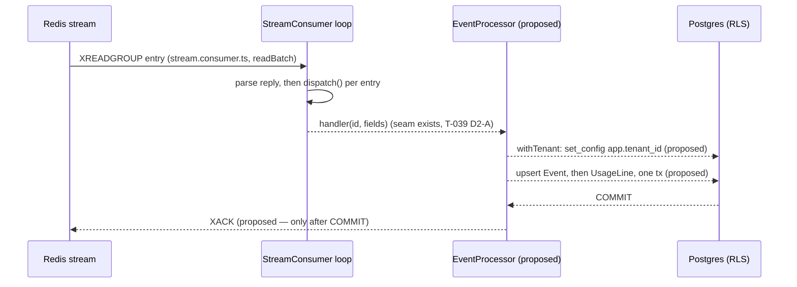

# T-040 — Event → UsageLine Processor

**Epic**: 7 — Worker Service · **Milestone**: v1-mvp
**Base commit**: `7dc7392` (T-039, stream consumer loop), working tree clean
**Status**: Gate 1 — plan written, **no code, no tests, awaiting approval**
**Plan file**: this file. There was **no prior T-040 plan**; this is a new plan, not an extension.

Every `file:line` in this document refers to the **`7dc7392` tree** unless it says otherwise.
Where a line is cited, the thing at that line is named, so the citation survives a shifted line.

---

# Part 1 — For the analyst

## 1. In plain terms

Today the platform accepts usage events over HTTP, deduplicates them, and writes them onto a
Redis stream. A worker reads that stream (T-038 bootstrapped the consumer group, T-039 built the
read loop) and then **throws the message away** — it logs "no processor is wired yet" and moves
on. Nothing reaches the database. There are **0 rows in `Event` and 0 in `UsageLine`** on the
development database right now (measured, Appendix A/P-STATE).

T-040 is the missing middle. It turns a stream message into two durable rows: the raw `Event`
(the audit record) and the `UsageLine` (the billing-safe record derived from it). Both are
written in one database transaction, and the stream message is only acknowledged **after** that
transaction commits — so a worker that dies mid-write re-reads the message rather than losing it.

**Who notices.** Nobody externally, today. This is the plumbing that unblocks Epic 8 (billing
cannot invoice what was never turned into `UsageLine` rows) and makes usage-service's existing
`/v1/usage/summary` endpoint return real numbers instead of only what test fixtures seeded.

**What it costs if this is wrong.** Three things, in descending order of expense:

1. **A cross-tenant collision.** The idempotency key travelling on the stream deliberately does
   not contain a tenant id, and today the database enforces that key as **globally** unique. So
   if two tenants ever submit an event with the same key, the second tenant's message is
   rejected by the database forever — a message that can never succeed and is never discarded,
   retried until someone notices. Measured, three different ways (Appendix A/P1–P3). Fixing that
   is decision 1 below, already settled at Gate 0.
2. **Silent precision loss on money.** Quantities are stored with six decimal places. Reading a
   quantity off the stream as an ordinary JavaScript number loses digits **without any error** —
   `12345678901.123456` was stored as `12345678901.123460` (Appendix A/P-DEC). That is a
   rounding error in a billing input that no test would notice unless it is written to.
3. **Duplicate billing.** If the message is acknowledged before the write commits, or if the
   write is not idempotent, a retry double-counts usage. The whole design below exists to make
   both impossible to express.

### The path a message takes, and where the new work sits



Solid arrows exist on the `7dc7392` tree: `readBatch` issues the `XREADGROUP` and calls
`dispatch`, and `dispatch` calls `this.handler(entry.id, entry.fields)` inside a `try` whose
`catch` logs and continues (`apps/worker-service/src/events/stream.consumer.ts`, methods
`readBatch` and `dispatch`). Dashed arrows are **proposed** and do not exist yet. The handler
seam itself exists — `StreamMessageHandler = (id: string, fields: string[]) => Promise<void>`,
declared at the top of that file — and its docstring already says acknowledgement is T-040's job.

---

## 2. Decisions

### Already settled at Gate 0 — recorded here, not re-opened

| # | Decision | Consequence carried into this plan |
|---|---|---|
| G0-1 | **The `Event` upsert keys on a new compound unique `@@unique([tenantId, idempotencyKey])`**, via a forward-only migration that replaces the current global `@unique` on `idempotencyKey`. | §5 slice S2; migration `v1_6`. Verified below that it removes all three cross-tenant failure modes and that **no rows exist** that would violate it. |
| G0-2 | **ORM-only for timestamp writes** — no `$queryRaw` binding of a `Date`. | §4 D-ORM. Worker's `withTenant` lacks usage-service's `TimeZone` pin (S-19); the ORM path is the mitigation, and it is measured safe. |
| G0-3 | T-040 **also absorbs** three inherited items, sliced separately from the processor. | §5 slice S1. |
| G0-4 | Q10 (DLQ policy) is ranked as **not blocking** T-040. | §3; the disagreement between `docs/epics/README.md` and the epic file is reported, not resolved. |

### Needed from you before Gate 3 — **ALL FOUR ANSWERED at Gate 2 (2026-09-11)**

> **Answered, and the plan is approved for implementation.** The subsections below carry the
> evidence; this table governs.
>
> | Decision | Answer | What the implementer writes |
> |---|---|---|
> | **D1** `metricKey` | **`eventType` alone** | Three shipped artifacts (`prisma/seed.ts`'s `DEFAULT_METRICS`, usage-service's integration fixtures, epic-8's `Meter` lookup) beat one line of epic shorthand. The epic's `${eventType}.${unit}` yields `"api.request.request"` against the live stream, matching no seeded `Meter` — every `UsageLine` would be unpriceable. Record the epic as wrong in §4 |
> | **D2** `periodStart`/`periodEnd` | **the event instant** (`occurredAt` for both) | Calendar-day bucketing would collapse every bucket to midnight and regress `granularity=hour` in the already-shipped usage-summary endpoint, in a service this task does not own |
> | **D3** `Event.metadata` | **every non-envelope stream field, as strings** | Q1's envelope is not on the wire; metadata arrives flattened as sibling string fields. Collecting all non-envelope fields preserves `sourceId`, which the narrow reading discards **permanently** — the stream entry is the only copy, and it is trimmed after acknowledgement |
> | **D4** repositories | **one** — `EventRepository.upsertEventWithUsageLine` | Keeps both writes in one transaction without exporting `TransactionClient`. The epic's two-repository split would force editing `base.repository.ts` in one service alone (what S-19 forbids) or split the transaction and lose the atomicity the epic itself requires |

Four questions. **None of them changes the file set, the migration, the test strategy or which
service owns the work** — each changes one expression in one pure function, plus the assertions
that pin it. They are here rather than buried at the end because getting them wrong writes
wrong data that a later backfill would have to repair.

---

#### D1 · What is `metricKey` derived from? — **RECOMMENDED: `eventType` alone**

The epic says `${event.eventType}.${event.unit}` (`docs/epics/epic-7-worker-service.md`, the
*`metricKey` derivation* note under T-040). **Three independent artifacts in the repository
disagree with it**, all treating `metricKey` as the bare `eventType`:

- `prisma/seed.ts` seeds `Meter` rows with `DEFAULT_METRICS = ["api.request", "storage.write",
  "storage.read"]` — no unit suffix.
- `apps/usage-service/tests/integration.fixtures.ts` seeds each pair with
  `eventType: spec.metricKey` and `metricKey: spec.metricKey`, over values like `"api.request"`
  and `"storage.gb"`.
- `docs/epics/epic-8-billing-service.md` prices by looking up "active `Meter` rate" per
  `metricKey`. A `Meter` is keyed `@@unique([tenantId, metricKey, activeFrom])`.

Against the two entries actually on the live stream (`eventType: "api.request"`,
`unit: "request"` — Appendix A/P-STREAM), the epic's rule produces `"api.request.request"`,
which matches **no** seeded `Meter`. Every `UsageLine` T-040 writes would then be unpriceable.

| Option | What it writes | What changes |
|---|---|---|
| **A (recommended)** | `metricKey = eventType` | One expression in the mapper; assertions in U39/U40 and I13. Billing can price the rows. |
| B | `metricKey = ` `` `${eventType}.${unit}` `` (epic's literal text) | Same one expression. `prisma/seed.ts`' `DEFAULT_METRICS` and epic-8 would have to be corrected in a later task, or nothing is billable. |

**Recommendation: A.** Three shipped artifacts beat one line of shorthand, and `CLAUDE.md`
instructs planning against the code. Either way the epic line is a divergence to report — under
A, the epic text is wrong; under B, the seed and the usage fixtures are.
**Changes the diff:** yes — one expression and ~4 assertions.

---

#### D2 · What do `periodStart` / `periodEnd` mean on a `UsageLine`? — **RECOMMENDED: the event instant, `periodStart = periodEnd = occurredAt`**

The epic does not say. The columns are `NOT NULL`, so something must be chosen.

Evidence on the current tree: usage-service's summary endpoint buckets with
`DATE_TRUNC(<granularity>, "periodStart")` and supports **hour** granularity
(`apps/usage-service/src/repositories/usage.repository.ts`, the `GRANULARITY_SQL` map), and it
never reads `periodEnd` at all. Its fixtures already write `periodEnd ?? periodStart` — i.e. the
existing corpus is equal-bounds.

| Option | What it writes | What changes |
|---|---|---|
| **A (recommended)** | `periodStart = periodEnd = occurredAt` | Hour/day/week granularity all keep working, because bucketing happens at query time. |
| B | Calendar-day bucket: `periodStart = floor(occurredAt, day)`, `periodEnd = +1 day` | Same one function. **But** `granularity=hour` in the existing summary endpoint collapses to a single midnight bucket per day — a behaviour regression in a shipped endpoint, caused by a worker change. |

**Recommendation: A**, and note that B would break an endpoint T-035 already shipped.
**Changes the diff:** yes — one function and ~6 assertions.

---

#### D3 · What goes into `Event.metadata`? — **RECOMMENDED: every non-envelope stream field, as strings**

The producer does **not** publish a `metadata` object. It flattens metadata into sibling
top-level stream fields (`apps/usage-service/src/services/ingestion.service.ts`, the loop that
copies `event.metadata` entries into `publishEvent` while skipping `RESERVED_STREAM_FIELDS`),
and `XADD` stores every value as a string. The live stream shows this: entry `1787746970722-0`
carries `sourceId: "sdk-web"` as a top-level field (Appendix A/P-STREAM).

| Option | What it writes | What changes |
|---|---|---|
| **A (recommended)** | `metadata = { <every field not in the envelope set>: string }`, or `null` when there are none | ~8 lines in the parser; original value *types* are not recoverable (everything is a string) and the plan says so rather than pretending otherwise. |
| B | `metadata = null` always | Fewer lines. Throws away `sourceId` and anything else a customer sent, permanently — the stream is trimmed at `MAXLEN ~ 100000`. |

**Recommendation: A.** Losing customer-supplied metadata is not recoverable; losing its JSON
types is cosmetic. **Changes the diff:** yes — ~8 lines plus U41.

---

#### D4 · One repository or two? — **RECOMMENDED: one, `event.repository.ts`, owning both writes in one transaction**

The epic names two files, `repositories/event.repository.ts` **and**
`repositories/usage-line.repository.ts`, and in the same breath requires that the "entire
operation runs in a Prisma transaction". On this codebase those two requirements conflict.

`TenantScopedRepository.withTenant` opens the transaction and hands `tx` to a callback; the
`TransactionClient` type is **module-private** — declared without `export` at line 4 of
`apps/worker-service/src/repositories/base.repository.ts`, and identically in all five copies
(verified by `grep -n TransactionClient apps/*/src/repositories/base.repository.ts`). So two
repositories each calling `withTenant` are two transactions, and sharing one `tx` between them
requires **exporting that type from `base.repository.ts`** — the exact file S-19 says must not
be edited in one service alone (`md5sum` shows worker's, analytics' and billing's copies are
byte-identical at `13a533a2e2c2dcc1ff9db28fb5c7a1fd`).

| Option | Shape | What changes |
|---|---|---|
| **A (recommended)** | `EventRepository.upsertEventWithUsageLine()` — one class, one `withTenant`, both `upsert`s inside it | File set: one new repository instead of two. Atomicity is structural. No edit to `base.repository.ts`. |
| B | Two repositories, `UsageLineRepository` taking the caller's `tx` | Requires exporting `TransactionClient` from worker's `base.repository.ts` → S-19 drift, and a decision about the other four copies. **This would reshape the plan** and I do not recommend it. |
| C | Two repositories, two transactions | Violates the epic's own atomicity sentence. A crash between them leaves an `Event` with no `UsageLine`, which nothing would ever repair. Not recommended. |

**Recommendation: A**, reporting the epic's two-file list as a divergence.
**Changes the diff:** yes — one file instead of two.

---

## 3. Scope and non-goals

**In scope**

- Forward-only migration `v1_6`: drop the global unique on `Event.idempotencyKey`, add
  `@@unique([tenantId, idempotencyKey])`; matching `prisma/schema.prisma` edit.
- A stream-message parser turning the flat `[k, v, k, v, …]` field list into a typed payload.
- `EventRepository` (worker's first real `TenantScopedRepository` subclass) with a single
  `upsertEventWithUsageLine` inside one `withTenant`.
- `EventProcessorService` — parse, call the repository through a per-message factory, then
  `XACK` on the container's Redis connection.
- Wiring the processor into the loop as `StreamConsumer`'s `handler` argument.
- Constants for every new literal; unit + integration tests; the three inherited items (S1).

**Non-goals, and what stays broken**

| Left alone | Why |
|---|---|
| Retry counting, dead-letter stream, `telemetry_dead_letter_total` | T-041. A failing message stays in the pending list, which is the epic's stated behaviour for T-040. **Consequence, stated plainly:** a message that can never succeed (e.g. a tenant id with no `Tenant` row — see §4 F6) is reclaimed and retried on every worker restart, indefinitely, until T-041 lands. |
| Bounded drain of the loop before `process.exit(0)`; `XGROUP DELCONSUMER` | S-26, explicitly T-043's. |
| Promoting `TenantScopedRepository` to a shared package | S-19's own fix direction says do it as its own task across all five services, not inside the next repository change. T-040 obeys that and accepts being the first subclass of an un-pinned copy; D-ORM (§4) is the mitigation. |
| `src/events/**` coverage exclusion | S-25 part 1, owned by epic-12/T-070. T-040 plans *around* it (§6) rather than changing the service's coverage policy inside a feature commit. |
| S-8 (worker's internal-auth guard), S-23 (`REDIS_STREAM_NAME` strictness), S-16, S-17 | Off this task's path; each names a different service or a different task. |
| The Q1 envelope (`receivedAt`, `source`, `version`, `payload`) | Decided in `docs/epics/README.md` but **not on the wire** — see §4 F5. T-040 parses what the producer actually publishes and reports the gap. |

**A disagreement noted, not resolved:** `docs/epics/README.md`'s dependency table gates all of
Epic 7 on Q10, while `docs/epics/epic-7-worker-service.md`'s own *Depends on* line reads
"Epic 2, Epic 3, Epic 6" and Q10's substance (max retries, retry delay, dead-letter destination)
lives in T-041. Gate 0 ranked on the epic file. This is the same class of defect as S-15.

---

# Part 2 — For the implementer

## 4. Ground truth — every claim re-derived, with the command that established it

All probes ran against the live PostgreSQL 16.13 and Redis 7.0.15 on this host, inside
`BEGIN … ROLLBACK` (or with explicit cleanup verified). Transcripts in **Appendix A**.

### Where the epic is wrong

**F1 · The epic's T-040 snippet cannot run.** It writes a bare `prisma.$transaction` with no
tenant context. Re-derived through Prisma as `telemetry_app` (probe `E1`): the `create` fails
with PostgreSQL `42501`. The same insert preceded by `SELECT set_config('app.tenant_id', …,
true)` succeeds (`E2`). `Event` and `UsageLine` both have `relrowsecurity = t` and a policy
`("tenantId" = current_setting('app.tenant_id', true))` for both `USING` and `WITH CHECK`
(`pg_policies`, probe `P-POL`). **T-040 must route through `withTenant`.**

**F2 · `where: { idempotencyKey }` is a cross-tenant poison pill.** All three ways an upsert can
compile fail cross-tenant against the current global unique. Measured as `telemetry_app`:

| Compilation | Result as tenant B, when tenant A holds the key | Probe |
|---|---|---|
| read-then-write | `SELECT` returns 0 rows (RLS hides A's row), then `INSERT` → `duplicate key value violates unique constraint "Event_idempotencyKey_key"` | `P1` |
| `ON CONFLICT … DO NOTHING` | `INSERT 0 0`, **transaction stays alive and would commit** — the worker would `XACK` a message it never stored | `P2` |
| `ON CONFLICT … DO UPDATE` | `ERROR: new row violates row-level security policy (USING expression) for table "Event"` | `P3` |

**F3 · The compound unique removes all three — this is G0-1's load-bearing claim, and it is
measured.** Simulating the migration inside a rolled-back transaction (`DROP INDEX
"Event_idempotencyKey_key"; CREATE UNIQUE INDEX … ("tenantId","idempotencyKey")`), then acting
as `telemetry_app`:

| | Result | Probe |
|---|---|---|
| read-then-write, tenant B | `INSERT 0 1` — succeeds | `Q1` |
| `DO NOTHING`, tenant B | `INSERT 0 1`, returns the new id | `Q2` |
| `DO UPDATE`, tenant B | 1 row, no RLS error | `Q3` |
| same-tenant replay | `DO NOTHING` returns **no id**; `DO UPDATE` returns the existing id; table holds 1 row | `Q4` |

The probes ran under `SET LOCAL ROLE telemetry_app` from a superuser session, because the DDL
needs the owner. A **control** (`P0`) established that this reproduces a direct `telemetry_app`
login: `current_user = telemetry_app`, `rolbypassrls = f`, tenant A's row invisible to B, and
the identical `duplicate key` error. Scope: the control covers these probes' shapes, not a
general claim about `SET ROLE`.

**F4 · Prisma 6.19.3 compiles `upsert` to read-then-write, not `ON CONFLICT`, inside an
interactive transaction.** Measured with `log: ["query"]` against the compound-unique schema
(probe `P-UPSERT`): `SELECT "Event"."id" … WHERE tenantId = $1 AND idempotencyKey = $2` followed
by `INSERT … RETURNING "id"`. No `ON CONFLICT` clause appeared in any of the four upserts
observed. Two consequences:

- Row 1 of F2's table — the one that raises a duplicate-key error cross-tenant — is the
  compilation T-040 actually gets. That is *why* G0-1 matters rather than being belt-and-braces.
- **Read-then-write is not atomic against a concurrent writer.** Two workers processing the same
  key concurrently both `SELECT` nothing and both `INSERT`; one wins, the other gets Prisma
  `P2002` (probe `P-RACE`, run against the existing global unique with both sides on the *same*
  tenant, so the conflict is the same-tenant one the compound index would also raise). Under
  Q9's horizontal-worker design this is reachable. It is **self-healing** — the loser throws, is
  not `XACK`ed, and the retry's `SELECT` finds the committed row — and §9 R3 records it.
  Scope: measured on the global index; the compound index is the same mechanism (a unique btree)
  but was not itself raced, because it does not exist yet.
  Noted: the `P2002` message rendered its target as `(not available)`, so the handler cannot
  discriminate by `meta.target`.

**F5 · The Q1 envelope is not what is on the wire.** `docs/epics/README.md` records Q1 as decided
with required envelope fields `eventId, tenantId, eventType, occurredAt, receivedAt, source,
idempotencyKey, version, payload`. The producer publishes `eventId, tenantId, eventType,
quantity, unit, occurredAt, idempotencyKey, timestamp` plus flattened metadata — no `receivedAt`,
no `source`, no `version`, no `payload` (`XRANGE telemetry:events`, probe `P-STREAM`; and
`ingestion.service.ts`'s `publishEvent` literal). Parse the wire format; report the gap.

**F6 · `Event.tenantId` carries a foreign key to `Tenant`.** `pg_constraint` shows
`Event_tenantId_fkey`. The two entries on the live stream carry
`tenantId = 11111111-1111-4111-8111-111111111111`, which is **not** one of the two `Tenant` rows
that exist. Processing either would raise a FK violation. They are unreachable in practice —
T-038 creates the group at `$` (new entries only) — but a message for an unknown tenant is a
permanently-failing message, which is the §3 non-goal about T-041.

**F7 · The existing unique is an index, not a constraint.** `pg_constraint` for `"Event"` lists
only `Event_pkey` and `Event_tenantId_fkey`; `Event_idempotencyKey_key` appears in `pg_indexes`
as `CREATE UNIQUE INDEX`. So the migration is `DROP INDEX` / `CREATE UNIQUE INDEX`, exactly the
shape of `prisma/migrations/v1_1_user_email_global_unique/migration.sql`, which is the
precedent. (PostgreSQL still calls it a "constraint" in the violation message — F2 row 1.)

**F8 · Nothing would break when the global unique goes away, and no row violates the new one.**
`grep -rn "idempotencyKey" apps/*/src packages/*/src prisma/*.ts` (excluding `dist/`) returns
**no query against the `Event` table at all** — every hit is usage-service's dedup/ingestion
path, a validator, or a shared type. And `Event` currently holds **0 rows** (`P-STATE`), so the
migration needs no backfill and no deduplication pass. Both re-derive at implementation time;
the row count is the one that can change.

### Where the epic is right

`XACK` after commit, "on failure do NOT `XACK`", idempotent upsert, and one transaction are all
correct and are what this plan builds. The T-039 seam was built for it: `dispatch` catches a
handler rejection, logs `"Stream entry handler failed"` with the entry id only, and continues
the batch — so "throw ⇒ no ack ⇒ stays in PEL" needs no new machinery.

### D-ORM · The timestamp decision, stated explicitly (G0-2)

**Every timestamp T-040 writes goes through the Prisma ORM. No `$queryRaw` binds a `Date`.**

Worker's `withTenant` issues only `set_config('app.tenant_id', …, true)` — `grep -c TIME_ZONE
apps/worker-service/src/repositories/base.repository.ts` → 0, against 1 for usage-service (S-19).
So a raw timestamp predicate written here inherits S-18 exactly. `CLAUDE.md` § *Raw SQL and
timestamps* records that the ORM path was measured safe under four session zones and that the
mechanism behind that is inference rather than measurement; this plan relies on the **measured**
half. Re-derived here: `P-UPSERT`'s query log shows `occurredAt` bound as
`"2026-09-11 00:00:00 UTC"` — already UTC-normalised by the client.

This is a *decision*, not an observation: a future `$queryRaw` in this service is the regression,
and §9 R4 names the mutation that would catch it.

### D-DEC · Decimal handling, and the mutation that proves it matters

`Event.quantity` and `UsageLine.quantity` are `Decimal(18,6)`. Probe `P-DEC` wrote five values
through three bind forms, each in its own rolled-back transaction:

| Input | as `Prisma.Decimal` | as `string` | as JS `number` |
|---|---|---|---|
| `999999999999.999999` | exact | exact | **error** `22003` |
| `12345678901.123456` | exact | exact | **stored `…123460`, no error** |
| `0.000001` | exact | exact | exact |
| `1.0000005` | `1.000001` | `1.000001` | `1.000001` (column scale, all three) |
| `9007199254740993` | error `22003` | error `22003` | error `22003` |

**The stream already carries `quantity` as a string** (`XADD` stores strings; the producer writes
`String(event.quantity)`). So the rule is: pass the string through untouched, never
`Number(...)`/`parseFloat`. A non-numeric string is rejected by Prisma *before* the query, as
`PrismaClientValidationError` (probe `E4`) — it fails loudly, which makes it the safe mistake.
Values are normalised to string in exactly one place (the repository's return mapping) so
`Prisma.Decimal` never escapes the repository.

### D-TX · Transaction budget

Worker's `withTenant` calls `this.prisma.$transaction(fn)` with **no options**, so Prisma's
defaults apply. Measured (probe `E5`): a transaction exceeding the limit fails with **`P2028`**
and the message names `The timeout for this transaction was 5000 ms`. The processor's
transaction is two upserts, so this is ample; §9 R5 records it as a bound to respect rather than
a problem to fix, and T-040 does **not** change the base class to pass options (S-19).

### D-ISO · How the tenant predicate gets onto both writes

Both writes use the existing `this.where({...})` helper, so the tenant id can only ever come from
the repository's bound context. Verified at the type level and at the SQL level:

- `this.where({ eventId })` **satisfies** `UsageLineWhereUniqueInput`, and
  `this.where({ tenantId_idempotencyKey: { … } })` **satisfies** `EventWhereUniqueInput` — both
  compile (probe `P-TYPE`, `tsc --strict`).
- `this.where({ idempotencyKey })` **does not compile** — `TS2322`, "missing the following
  properties … id, tenantId_idempotencyKey". This is the mutation: writing the naive form is a
  compile error, not a runtime leak. (Scope: this is a claim about *this* input type on the
  compound-unique schema, established by that one `tsc` run.)
- The emitted SQL carries the predicate. Probe `P-WHERE`: the `Event` lookup becomes
  `WHERE (("tenantId" = $1 AND "idempotencyKey" = $2) AND "tenantId" = $3)` and the `UsageLine`
  lookup becomes `WHERE ("eventId" = $1 AND "tenantId" = $2)`.
- **Honest limit:** the read-back Prisma issues *after* an `INSERT` is `WHERE "id" = $1` with no
  tenant predicate (visible in `P-UPSERT`). RLS covers it and it reads a row the same transaction
  just wrote. Stated rather than glossed — the "explicit predicate on every query" property holds
  for the queries this code writes, not for every statement Prisma emits.

The repository is constructed **per message** through a container factory, never a singleton
(`.claude/rules/tenant-isolation.md`), mirroring `usageRepositoryFactory` in
`apps/usage-service/src/config/container.ts`.

---

## 5. Files to change

### Existing

| File | Change |
|---|---|
| `prisma/schema.prisma` | `Event`: remove `@unique` from `idempotencyKey`, add `@@unique([tenantId, idempotencyKey])` |
| `apps/worker-service/src/constants.ts` | New `WORKER_EVENT_PROCESSING` object: envelope field names, the reserved-field set, `metricKey` separator (if D1→B), log messages |
| `apps/worker-service/src/config/container.ts` | Add `eventRepositoryFactory: (tenantId: TenantId) => EventRepository` and `eventProcessor: EventProcessorService` to `AppContainer` |
| `apps/worker-service/src/index.ts` | Pass the processor's handler as `StreamConsumer`'s 5th constructor argument (the `handler?` parameter that already exists) |
| `apps/worker-service/vitest.config.mjs` | **S1**: declare `testTimeout` explicitly |
| `apps/worker-service/tests/integration.constants.ts` | **S1**: export `CASE_BUDGET_MS`; assert every deadline below it |
| `apps/worker-service/tests/stream.consumer.unit.test.ts` | **S1**: the two `CALLS.NONE`-as-duration sites; `STOP_DEADLINE_MS` budget assertion; new L-18 case |

### New

| File | Purpose |
|---|---|
| `prisma/migrations/v1_6_event_tenant_idempotency_key/migration.sql` | `DROP INDEX` + `CREATE UNIQUE INDEX`, mirroring `v1_1` |
| `apps/worker-service/src/validators/stream-message.validator.ts` | Flat field list → typed `StreamEventPayload`; Zod; quantity stays a string |
| `apps/worker-service/src/repositories/event.repository.ts` | `EventRepository extends TenantScopedRepository`, one `upsertEventWithUsageLine` (D4→A) |
| `apps/worker-service/src/services/event-processor.service.ts` | Parse → repository → `XACK`; exposes `buildHandler(): StreamMessageHandler` |
| `apps/worker-service/tests/stream-message.validator.unit.test.ts` | Parser cases |
| `apps/worker-service/tests/event-processor.service.unit.test.ts` | Ordering, ack-after-commit, throw-no-ack |
| `apps/worker-service/tests/event.processor.integration.test.ts` | Real Postgres + Redis db 14, as `telemetry_app` |

### Deliberately not modified

`apps/worker-service/src/repositories/base.repository.ts` (S-19 — five byte-comparable copies);
`apps/worker-service/src/events/stream.consumer.ts` **except** that its default handler stops
being what production uses (no edit to the file is required — `index.ts` supplies the 5th
argument); the other four services; `.claude/rules/known-gaps.md` (S-25 part 1 and S-26 both stay
open; T-040 closes no gap entry).

---

## 6. Implementation slices — smallest safe first

Pseudo-TDD throughout (`docs/task-implementer-workflow.md`): write the whole test file from this
plan, **confirm it red**, then implement, then refactor.

**A note on where the tests must live (S-25).** `vitest.config.mjs` excludes `src/events/**` from
coverage. T-040's own files — `src/services/`, `src/repositories/`, `src/validators/` — are
*inside* coverage, so this task will show healthy numbers while its **integration point**
(`index.ts` supplying the handler, and `dispatch` calling it) is unmeasured. Do not let the
coverage report stand in for evidence there: the wiring is proved by `U46` (an `index.ts`
construction-argument assertion, in the existing shutdown suite, which is where `U7`/`U25`
already assert startup ordering) and by the integration suite end-to-end, not by a percentage.

---

### S1 · The three inherited items (tests and test-config only, no `src/` change)

Sliced first and separately so they cannot entangle the processor work, per G0-3.

1. **Deadline-vs-budget, structurally.** Declare `testTimeout` in
   `apps/worker-service/vitest.config.mjs`; export the same number as `CASE_BUDGET_MS` from
   `tests/integration.constants.ts`; assert each existing deadline below it — `RUN_DEADLINE_MS`,
   `STOP_BUDGET_MS`, `BLOCK_MS_LONG`, the unit suite's `STOP_DEADLINE_MS`, **and `I12`'s
   `RUN_DEADLINE_MS + BLOCK_MS_LONG` sum**. The sum is the one the two prior fixes missed: today
   both are `3_000`, so a case that spends both is at `6_000` against a `5_000` budget.
2. **The two `CALLS.NONE`-as-duration sites.** `tests/stream.consumer.unit.test.ts` line 902 (in
   `U16`, after `const runPromise = buildLoopConsumer(stopAfter(CALLS.TWICE)).run()`) and line
   931 (the same shape in `U17`) both pass a **call-count** constant to
   `vi.advanceTimersByTimeAsync`, which takes **milliseconds**. Introduce a duration constant
   (e.g. `ADVANCE_NO_TIME_MS`) and use it at both. Two sites, not one.
3. **L-18 · the uncovered non-string-cursor branch.** `src/events/stream.consumer.ts` line 166 is
   `nextCursor: typeof rawCursor === "string" ? rawCursor : null`, inside `parseClaimReply`. The
   documented behaviour — a non-string cursor means "stop paginating", never "start over" — has
   no test. Add `U39`.

> **Hypothesis.** These are three independent test-hygiene defects with no behavioural coupling
> to the processor. **Falsified if** `pnpm --filter @telemetry/worker-service test` is not
> 99/99 green immediately before S1 and ≥100 green immediately after, with no `src/` file other
> than nothing appearing in `git diff --name-only` for this slice.
> **Refuting mutation for (1):** set `RUN_DEADLINE_MS` to `CASE_BUDGET_MS` — the new assertion
> must go red. **For (3):** change the `typeof` guard to `String(rawCursor)` — `U39` must go red.

---

### S2 · The migration and the schema edit

Controlling path: `prisma/schema.prisma` `model Event`, and Prisma Migrate's
`migrate deploy`/`migrate status` via `DIRECT_DATABASE_URL` (the owner) — CI runs both
(`.github/workflows/ci.yml`, the `migrate deploy` and `migrate status` steps, which today target
`apps/auth-service`).

`prisma/migrations/v1_6_event_tenant_idempotency_key/migration.sql`, mirroring `v1_1`:

```sql
-- T-040. The idempotency key on the stream is tenant-less by construction, so a GLOBAL unique
-- turns any cross-tenant key collision into a message that can never be processed. Scope it to
-- the tenant. Forward-only; no data change (Event held 0 rows when this was written).
DROP INDEX IF EXISTS "Event_idempotencyKey_key";
CREATE UNIQUE INDEX "Event_tenantId_idempotencyKey_key" ON "Event"("tenantId", "idempotencyKey");
```

Order matters: schema edit and migration file land together, `migrate deploy` runs before any
test that touches `Event`, and the generated client must be regenerated (the client lives in the
shared pnpm store — `node_modules/.pnpm/@prisma+client@6.19.3…/node_modules/.prisma/client` — so
one `prisma generate` serves all 13 packages).

> **Hypothesis.** The new index is strictly weaker than the one it replaces and nothing reads the
> old one, so no existing suite changes behaviour. **Falsified if** any package's suite goes red
> after `migrate deploy` + `generate`, or if `prisma migrate status` reports drift.
> **Refuting mutation:** re-run probes `P1`/`P2`/`P3` after the real migration — all three must
> now behave as `Q1`/`Q2`/`Q3` did. Also re-run `SELECT count(*) FROM "Event"` **before**
> applying; a non-zero count means the backfill assumption in F8 has expired and this slice
> needs a deduplication step first.

---

### S3 · The stream-message parser (pure, no I/O)

Controlling path: `dispatch` hands `(id, fields)` where `fields` is the flat
`[k, v, k, v, …]` list; the parser folds it to a record and validates.

- Envelope fields consumed: `eventId`, `tenantId`, `eventType`, `quantity`, `unit`,
  `occurredAt`, `idempotencyKey`. `timestamp` is producer bookkeeping and is not persisted.
- `tenantId` validated as a **UUID** — `.claude/rules/tenant-isolation.md` layer 3 requires it,
  and `Tenant.id` is `String @default(uuid())`.
- `quantity` stays a **string**, validated as a decimal literal. Never `Number()` (D-DEC).
- `occurredAt` validated as ISO-8601, converted with `new Date(...)` for the ORM (D-ORM).
- Everything not in the envelope set → `metadata` (D3→A), or `null` if empty.
- Odd-length field lists, missing envelope fields, non-UUID tenant → **throw**. A throw is what
  leaves the entry in the pending list.

> **Hypothesis.** Every field the processor needs is present on the wire, and no field needs a
> type the wire cannot carry. **Falsified if** either live stream entry fails the parser for a
> reason other than the unit/metadata questions in D1/D3 (probe `P-STREAM` shows both entries'
> full field lists; the second has no `sourceId`, so the empty-metadata branch is real data).

---

### S4 · `EventRepository.upsertEventWithUsageLine` (D4→A)

Controlling path: `TenantScopedRepository.withTenant` → `set_config('app.tenant_id', …, true)` as
the transaction's **first** statement → `tx.event.upsert` → `tx.usageLine.upsert`.

```
withTenant(async tx => {
  event = tx.event.upsert({
    where:  this.where({ tenantId_idempotencyKey: { tenantId: <bound>, idempotencyKey } }),
    create: { …, quantity: <string>, occurredAt: <Date> },
    update: {},                       // replay is a no-op read (P-UPSERT, R2)
  })
  tx.usageLine.upsert({
    where:  this.where({ eventId: event.id }),
    create: { tenantId: <bound>, eventId, metricKey, quantity, periodStart, periodEnd },
    update: {},
  })
  return { eventId, created: boolean }   // Decimals normalised to string here, and only here
})
```

The `where` clauses go through `this.where(...)` for the reason in D-ISO. The bound tenant id
inside the compound object comes from the repository's own `this.tenantId`, never from the parsed
message — the parsed `tenantId` is what *selects* the repository from the factory, and the
repository is what *writes* it.

> **Hypothesis.** Both writes are idempotent and atomic, and neither can address another
> tenant's row. **Falsified if** a replay creates a second `Event` or a second `UsageLine`, or
> if the `UsageLine` insert can land when the `Event` insert rolled back.
> **Refuting mutations:** (a) replace `this.where({ eventId })` with a bare `{ eventId }` — `I15`
> (the cross-tenant case) must go red or the assertion is not testing isolation; (b) split the
> two upserts into two `withTenant` calls — `I16` (an `Event` write forced to fail after the
> `UsageLine` write) must go red; (c) remove the `set_config` line from `withTenant` — every
> integration case must fail with `42501`, which is what proves RLS is live rather than decorative.

**Gate-3 outcome — (b) and (c) hold; (a) is falsified; and the hypothesis missed a fourth
mutation entirely.** Recorded here rather than by rewriting the prediction above, so that what
was predicted and what was measured are both readable.

- **(b) confirmed.** Splitting into two `withTenant` calls turns `I16` red with
  `expected 1 to be +0` — the orphaned `Event` that survives the rolled-back second
  transaction. Also reddens `U47` and `U52`.
- **(c) confirmed, with one correction to "every".** Removing `set_config` reddens
  **8 of 10** integration cases with
  `42501, new row violates row-level security policy for table "Event"`. `I16` and `I18` stay
  green because their subject *is* a failure — they assert zero rows, and zero rows is what a
  `42501` also produces. So the mutation is caught, but not by every case, and the plan's
  "every integration case must fail" was too strong. (Recorded as **6 of 8** when first
  measured, which was right for the suite as it then stood; `I21` and `I22` were added
  afterwards and both redden, so the ratio moved while the finding did not. Re-measured at the
  Gate-5 review — QA-3.)
- **(a) falsified.** The bare `{ eventId }` mutation leaves `I15` and **all** integration cases
  green; the only failure is `U51`, which asserts the *shape* of the `where` object.
  `UsageLine.eventId` is globally `@unique` and is always an `Event.id`, itself a global primary
  key, so addressing another tenant's `UsageLine` through that key is unrepresentable and no
  integration case can be written. The predicate is **kept** — `.claude/rules/tenant-isolation.md`
  requires it and the property should survive a schema where `eventId` is not globally unique —
  but it is belt-and-braces with no reachable exploit, which is filed as **S-28**. Do not read
  the prediction above as evidence that the isolation assertions are broken; do not delete the
  predicate on the grounds that removing it is green. `event.repository.ts`'s docstring carries
  the same caveat next to the code.
- **The mutation this section should have named, and did not.** Dropping `this.where(...)` from
  the **`Event` `create`** and writing `create: { tenantId: payload.tenantId, ... }` typechecks
  clean and, at the Gate-4 review, left the package **126/126 green** — reproduced at this
  rework. That is the tenant-*write* invariant, and nothing tested it, because no fixture in the
  package built a repository for a tenant other than the one its payload carried. Closed by
  **`U58`** (unit: the `create` carries the bound tenant while the payload carries another) and
  **`I21`** (live PostgreSQL as `telemetry_app`: RLS's `WITH CHECK` rejects the write with
  `42501`). Both confirmed red against that mutation before it was reverted.

---

### S5 · `EventProcessorService` and the `XACK`

Controlling path: `buildHandler()` returns a `StreamMessageHandler`; `dispatch` calls it.

```
handler(id, fields):
  payload = parse(fields)                        // throws → dispatch logs, no ack, stays in PEL
  repo    = eventRepositoryFactory(payload.tenantId)
  result  = await repo.upsertEventWithUsageLine(payload)
  await redis.xack(streamName, groupName, id)    // AFTER the commit resolves. Never before.
  logger.info({ entryId: id, eventId, created }, "…")
```

Three properties, each with a named test:

- **`XACK` strictly after the commit.** Ordering, not "both happened" (`U43`).
- **`XACK` on the container's connection, not the loop's.** `run()` opens a private
  `duplicate()` for the blocking read and keeps it in `readConnection`; the container's client is
  free. Sending the ack on a connection parked on a `BLOCK` read would queue behind it (T-039
  measured an unrelated `PING` on a shared connection returning after 2 080 ms against a
  `BLOCK 2000`). `U44` asserts the identity of the client the ack was sent on.
- **Log the entry id and event id only — never the fields.** They carry `tenantId` and
  customer metadata and this service has no redaction layer, which is the rule
  `buildDefaultMessageHandler` already follows. `U45` asserts it across *every* logger method.

> **Hypothesis.** No path exists that acknowledges an entry whose transaction did not commit.
> **Falsified if** moving the `xack` above the `await` on the repository leaves the suite green.
> **Refuting mutation:** do exactly that — `U43` must go red.
> **Scope, stated honestly:** this is a claim about the code T-040 writes, not an impossibility.
> Nothing in the type system stops a future `xack` elsewhere in the service.

---

### S6 · Wiring

`index.ts` passes `container.eventProcessor.buildHandler()` as `StreamConsumer`'s existing
`handler?` argument, at the construction site currently at `index.ts:103-108` (the
`new StreamConsumer(container.redis, container.logger, container.env, () => shuttingDown)` call).
`buildDefaultMessageHandler` stays in the file as the no-handler fallback and keeps `U34`.

> **Hypothesis.** The production worker now runs the processor, not the default logger.
> **Falsified if** deleting the 5th argument leaves the suite green. **Refuting mutation:** delete
> it — `U46` must go red. This matters more than usual because `src/events/**` is outside coverage
> (S-25), so a threshold will not notice.

---

## 7. Test plan and acceptance-coverage mapping

New ids continue the existing series (highest today: `U38`, `I12`).

| AC | Statement | Proved by |
|---|---|---|
| **AC1** | A stream message is deserialised into a typed payload; a malformed one throws | `U40` (envelope fields), `U41` (metadata collection / empty), `U42` (odd-length list, missing field, non-UUID tenant, non-numeric quantity — each throws) |
| **AC2** | `Event` is upserted idempotently on `(tenantId, idempotencyKey)` | `I13` (first write creates), `I14` (replay: still one row, same id) |
| **AC3** | A `UsageLine` is created for the event, idempotent on `eventId` | `I13`, `I14` |
| **AC4** | Both writes run in **one** transaction inside `withTenant` | `I16` (forced mid-transaction failure leaves **zero** rows of both kinds), `U47` (the repository calls `withTenant` once, and `set_config` is its first statement) |
| **AC5** | `XACK` happens only after the transaction commits | `U43` (ordering), `I17` (`XPENDING` is empty after success) |
| **AC6** | A failing transaction does **not** ack; the entry stays pending | `I18` (`XPENDING` still lists the entry; `dispatch` logged `"Stream entry handler failed"`) |
| **AC7** | `metricKey` derivation (per D1) | `U40`, `I13` |
| **AC8** | Tenant isolation: explicit predicate on both writes, per-message factory, no singleton | `U48` (factory called with the parsed tenant id; a second message with a different tenant gets a **different** repository instance), `I15` (two tenants, **same** idempotency key — both persist, neither sees the other), **`U58`** and **`I21`** (an entry whose `tenantId` is not the repository's cannot write: `U58` asserts the spy and its own premise, `I21` gets `42501` from RLS's `WITH CHECK` as `telemetry_app`). **Corrected at the Gate-6 review (MEDIUM-5):** this row credited `I19`, which is Round 1's refuted HIGH-1 claim surviving in the plan. `I19` asserts that the subject's connection is a non-superuser, non-`BYPASSRLS` role and the policies are live — a necessary precondition, not the invariant. `U58` and `I21` were written for this and both were confirmed red against the mutated code |
| **AC9** | `Decimal(18,6)` precision survives end-to-end | `I20` (`quantity: "12345678901.123456"` on the stream → `quantity::text` reads back **exactly**; the JS-`number` form is the mutation that makes it red), `U49` (the repository's return value is a `string`, **not** an instance of `Prisma.Decimal`) |
| **AC10** | Schema and migration stay aligned; forward-only | `prisma migrate status` clean in §8; `I13`'s write is itself the proof the index exists |
| **AC11** | *(S1)* Every test deadline sits below the runner's per-case budget | `U50` (each deadline `<` `CASE_BUDGET_MS`; and `RUN_DEADLINE_MS + BLOCK_MS_LONG` `<` `CASE_BUDGET_MS`) |
| **AC12** | *(S1)* A non-string `XAUTOCLAIM` cursor stops pagination | `U39` |

**Negative assertions carried deliberately** (`.claude/rules/testing.md`): no other tenant's id
appears in any bound value in `I15`; the ack is **not** called in `I18`; the logger is **not**
called with any stream field value in `U45`; the returned quantity is **not** an instance of
`Prisma.Decimal` in `U49`.

**Integration-suite hygiene.** Reuse worker's reserved Redis logical database **14** and route
every `FLUSHDB` through a helper that re-asserts `CLIENT INFO` contains `db=14` **on each call** —
the shape `flushReservedDb()` already uses in `tests/stream.consumer.integration.test.ts`, and the
shape S-22 says not to weaken to a single `beforeAll` guard. Database fixtures seed `Tenant` rows
through `DIRECT_DATABASE_URL` (RLS blocks `telemetry_app` on `"Tenant"`) and assert through
`telemetry_app`, so an RLS test is never run as a superuser. Clean up in `afterAll` as well as
`beforeEach`, and by explicit id — the failure mode S-20 documents in auth-service.

---

## 8. Validation commands

**Task-scoped first, fail fast.** `pnpm --filter <pkg> test -- <file>` does **not** filter.

```bash
# after the schema edit, before anything reads Event
pnpm --filter @telemetry/worker-service exec prisma migrate deploy --schema=../../prisma/schema.prisma
pnpm --filter @telemetry/worker-service exec prisma migrate status --schema=../../prisma/schema.prisma
cp prisma/schema.prisma apps/worker-service/schema.ci.prisma \
  && pnpm --filter @telemetry/worker-service exec prisma generate --schema=./schema.ci.prisma \
  && rm -f apps/worker-service/schema.ci.prisma

# the suites this task adds or grows, actually scoped
pnpm --filter @telemetry/worker-service exec vitest run tests/stream-message.validator.unit.test.ts
pnpm --filter @telemetry/worker-service exec vitest run tests/event-processor.service.unit.test.ts
pnpm --filter @telemetry/worker-service exec vitest run tests/event.processor.integration.test.ts
pnpm --filter @telemetry/worker-service exec vitest run tests/stream.consumer.unit.test.ts      # S1
pnpm --filter @telemetry/worker-service exec vitest run tests/index.graceful-shutdown.unit.test.ts

pnpm --filter @telemetry/worker-service typecheck
pnpm --filter @telemetry/worker-service lint
pnpm --filter @telemetry/worker-service test          # baseline at 7dc7392: 7 files, 99 tests, 1.41 s

# the schema change is global — these must be re-run even though they are untouched
pnpm --filter @telemetry/usage-service test
pnpm --filter @telemetry/auth-service test
```

**Full gate** (the reviewer runs this with `--force`; turbo otherwise replays a cached run):

```bash
pnpm build && pnpm test && pnpm lint && pnpm typecheck     # 13 packages each
```

**The manual check that proves the task.** Against the reserved database, never db 0:

```bash
redis-cli -n 14 XADD telemetry:events:t040 '*' eventId "$(uuidgen)" tenantId <a-real-Tenant-id> \
  eventType api.request quantity 12345678901.123456 unit request \
  occurredAt 2026-09-11T00:00:00.000Z idempotencyKey t040-manual sourceId sdk-web
# then, as telemetry_app with app.tenant_id set:
#   SELECT quantity::text FROM "Event"      -> 12345678901.123456   (exact)
#   SELECT count(*) FROM "UsageLine"        -> 1
#   XPENDING telemetry:events:t040 <group>  -> empty
```

**Environment, verified by command rather than assumed** (transcripts in Appendix A):
PostgreSQL 16.13, `telemetry_app` is `rolbypassrls = f`; Redis 7.0.15; db 0 holds
`DBSIZE 1`, `XLEN telemetry:events` = 2, **zero** consumer groups; db 14 `DBSIZE 0`;
`Event` and `UsageLine` both 0 rows; `Tenant` 2 rows.

---

## 9. Risks and mitigations

| # | Risk | Severity | Mitigation |
|---|---|---|---|
| R1 | The migration drops a constraint that something depends on | LOW | F8 — no production code queries `Event` by `idempotencyKey`; re-derive the grep and the row count immediately before applying. `IF EXISTS` on the drop makes re-application safe. |
| R2 | Worker becomes the first live subclass of an un-pinned `TenantScopedRepository` (S-19) | MEDIUM | D-ORM: no raw timestamp binds in this service. §5 explicitly excludes `base.repository.ts` from the diff. The gap stays open and owned by its own task. |
| R3 | Two workers race the same key → `P2002` (F4) | LOW | Self-healing: the loser throws, is not acked, and the retry's `SELECT` finds the committed row. T-041 owns bounding the retries. Not tested here — constructing a deterministic two-worker race in CI is a flake source; recorded rather than asserted. |
| R4 | A future `$queryRaw` in this service re-introduces S-18 | MEDIUM | D-ORM is written as a decision in the repository's docstring, naming worker's missing `TimeZone` pin. **Mutation that would catch it:** none exists today, and this plan does not claim one — `grep -rn '\$queryRaw' apps/worker-service/src` returning only `base.repository.ts`'s `set_config` is the check, and it is a review check, not a test. |
| R5 | Prisma's 5 000 ms interactive-transaction timeout (`P2028`, probe `E5`) | LOW | Two upserts. Not raised here; raising it means editing `base.repository.ts` (S-19). |
| R6 | A permanently-failing message retries forever (F6: unknown tenant, or a malformed payload) | MEDIUM | Explicitly T-041's, and named in §3 so it is not discovered in production. The entry stays in the pending list and is reclaimed on each restart; nothing is lost, nothing is bounded. |
| R7 | S-25: the wiring seam is outside coverage, so the report will look better than the evidence | LOW | `U46` asserts the construction argument; §6 says not to read the percentage as coverage of the seam. |
| R8 | The integration suite touches shared Redis/Postgres that other work depends on | MEDIUM | db 14 only, `FLUSHDB` behind a per-call `CLIENT INFO` guard; fixtures cleaned by explicit id in `afterAll` **and** `beforeEach`. Never db 0. |
| R9 | D1/D2/D3 answered differently after implementation starts | LOW | Each is one expression in a pure function plus its assertions — deliberately isolated in S3, not spread through the repository. |

---

## 10. Pending task checklist

- [done] **Gate 2** — user answers D1, D2, D3, D4; plan approved
- [done] S1 · inherited items (deadline/budget structure, two `CALLS.NONE` sites, `U39`) — red, then green.
  `U50` was red on the **sum** (`expected 6000 to be less than 5000`), which is the defect the
  slice predicted; `RUN_DEADLINE_MS` lowered 3 000 -> 1 500. Both refuting mutations confirmed.
- [done] S2 · `prisma/schema.prisma` + `v1_6` migration; `migrate deploy`, `migrate status` clean, `generate`
- [done] Re-derive F8's grep and `SELECT count(*) FROM "Event"` immediately before applying S2 —
  grep returns no query against `Event` by `idempotencyKey`; count was 0
- [done] S3 · parser + `U40`–`U42` — confirmed red (module absent), then implemented
- [done] S4 · `EventRepository` + `U47`, `U49`, `U51`–`U53`, `I13`–`I16`, `I19`, `I20`
- [done] S5 · `EventProcessorService` + `U43`–`U45`, `U48`, `U54`–`U56`, `I17`, `I18`
- [done] S6 · `index.ts` wiring + `U46`, and `U57` for the container factory
- [done] Constants sweep — `FIELD_VALUE_OFFSET`, per-file `CALLS`/`INDEX_FIRST`,
  `INTEGRATION_PROCESSOR_*`; no bare route/field/message/number added
- [done] Run each S4/S5/S6 refuting mutation; record which named test went red.
  **S4(a) does not reproduce** — see the deviation note below.
- [done] Task-scoped validation, then `pnpm build/test/lint/typecheck --force` across 13 packages —
  13/13 each, 0 cached; 14 pre-existing lint warnings, no new ones
- [done] Confirm environment left as found: db 0 `XLEN 2`/`entries-added 2`/no groups, db 14 empty,
  `Event` and `UsageLine` at 0 rows, `Tenant`/`User` at 2 each. db 0 `DBSIZE` is 2 rather than 1:
  the extra key is `denylist:<jti>` with a TTL, written by auth-service's suite during the root
  test gate — S-22, not this change.
- [done] Report divergences found (F1, F5, D1's three-artifact conflict, D4's two-file conflict) —
  Gate 4 ruled; four entries filed as **S-27** (envelope parity, MEDIUM), **S-28** (untestable
  `UsageLine` predicate, LOW), **S-29** (epic-7 divergences, LOW) and **S-30** (pre-existing
  `User` default drift, LOW)

### Gate-4 Round 1 → Gate-3 rework (CONDITIONAL, R1-R3)

The reviewer found **no** defect in shipped code — no isolation defect, no injection, no
correctness bug — and re-derived the `v1_6` migration's cross-tenant measurements as
`telemetry_app`. What failed was the change's account of itself, plus one genuinely missing test.

- **R1 / HIGH-1 · done, and it was a real untested invariant, not a bad sentence.**
  `stream-message.validator.ts` claimed "`I19` is the case that fails" when a future edit drops
  `this.where(...)` from the `Event` `create` and writes `payload.tenantId`. Reproduced the
  reviewer's mutation here: it typechecks with **0 errors** and the package stayed **126/126
  green**. Cause: no fixture in the package built a repository for a tenant *other* than the one
  its payload carried, so `U49`'s `not.toContain(OTHER_TENANT_ID)` was also measuring nothing.
  Closed with two cases, both written against the mutated code and confirmed red before it was
  reverted:
  - **`U58`** — red with
    `expected 'd4101ff1-…' to be '456793cd-…'`;
  - **`I21`** — red with
    `42501, new row violates row-level security policy for table "Event"`, i.e. RLS's `WITH CHECK`
    is an independent backstop for the same edit. `I21` was not in the review's proposed fix; it
    was added because a database-level rejection is stronger evidence than a spy assertion for
    the platform's core invariant.
  The docstring now names both, and records that the *other* nearby edit — `tenantId` written
  **inside** `this.where({...})` — really is a compile error, re-derived here as
  `TS2322: Type 'TenantId' is not assignable to type 'undefined'`.
- **R2 / MEDIUM-1 · done.** "The coupling that matters is pinned by a test instead" was false and
  is replaced with what is measured: the two sets match 8/8 in the same order (compared
  programmatically, not by eye), `U41` pins worker's constant against worker's parser only, and
  a producer-side addition is exposed — feeding the parser Q1's three fields returned
  `metadata = {"receivedAt":…,"source":"sdk-web","version":"1"}`. Filed as S-27.
- **R3 / MEDIUM-2 · done.** Gate-3 outcome appended under §6 S4 **in place**, leaving the original
  prediction readable. (a) falsified, (b) confirmed, (c) confirmed with "every" corrected —
  **8 of 10** on the committed suite (recorded as 6 of 8 when first measured, which was right
  before `I21` and `I22` were added; both redden, so the ratio moved and the finding did not) —
  plus the fourth mutation the hypothesis never named, which is what HIGH-1 turned out to be.
- **R3 / MEDIUM-3 · done, and the corrected number is not the one requested.** The review measured
  5 of 5 failures with `fileParallelism` removed; **this host measured 3 of 10** (and 1 of 3 at
  Gate 3). The comment now states all three observations and claims **no rate at all** — what is
  reproducible is the *cause* and that the T-039 file alone is 12/12. (Gate 6 added a fifth
  rate, 10 of 14, and refuted the *signature*: one of its failures was `I9` asserting a wrong
  delivery set, with no `NOGROUP` and no key named. So "the failure names the stream key every
  time" is false — see the corrected comment in `vitest.config.mjs`.) Cost stated: serial 5.07-5.24 s vs parallel 1.87-1.99 s, ~2.6x.
  Setting kept; per-prefix deletion rejected (reopens S-22).
- **LOW-1 and LOW-3 · done** in a second approved pass. **LOW-2, LOW-4 and both NITs stay undone
  by decision.**

### Gate-4 Round 1 follow-up — LOW-1 and LOW-3

- **LOW-1 · promoted, and two of the three sites were judged rather than replaced.**
  `"Stream entry handler failed"` reached a third copy when `I18` asserted it from a second test
  file, which is the copy `.claude/rules/constants.md` asks to prevent. Added
  `WORKER_STREAM_READ.LOG.HANDLER_FAILED`; the producing site in `stream.consumer.ts` and `I18`
  now reference it. **`stream.consumer.unit.test.ts`'s `LOG_MESSAGE.HANDLER_FAILED` stays a
  literal**, annotated with the reason: `U29` asserts the exact wording, so an expectation
  sourced from the constant the subject writes would hold whatever either said. Established by
  mutation rather than argued — changing the production constant's text turns **`U29` red** and
  leaves `I18` green, which is the split the two sites are supposed to have. Only this one
  message was promoted; the other thirteen are at two copies and below the threshold.
- **LOW-3 · the offset path was already correct, so the new cases pin it.** No production change.
  Measured before writing anything, across three input forms and two session zones:
  `+05:30`, `-05:00` and `Z` all parse to `2026-01-01T00:00:00.000Z` and all store
  `2026-01-01 00:00:00` in `Event."occurredAt"`, `UsageLine."periodStart"` and `"periodEnd"`.
  - **`U40` extended** with both offset signs — one sign cannot distinguish an offset *discarded*
    from one applied *backwards*. Red under the discarded-offset mutation
    (`new Date` fed the string with its offset stripped, which is what `CLAUDE.md` says a
    text -> `timestamp` cast does): `expected '2026-01-01T05:30:00.000Z' to be
    '2026-01-01T00:00:00.000Z'`.
  - **`I22` added**, reading `::text` off both columns through the owner connection on a
    connection whose session zone it **pins itself**. Red under the same mutation with the three
    stored values printed: `2026-01-01 00:00:00 | 2026-01-01 05:30:00 | 2025-12-31 19:00:00`.
  - **Two findings worth carrying forward.** First, this developer server's `TimeZone` is
    `Asia/Kolkata` (`pg_settings`, source `configuration file`), **not** UTC — so the whole
    T-040 integration suite has been running non-UTC all along, which is stronger than the
    change previously claimed. Second, the pinned zone had to be changed from `Asia/Kolkata` to
    `America/New_York`: with `Asia/Kolkata` the guard that the pin took effect could not fail
    here, because a silently-ignored pin left the session on the server default, which was the
    very value being asserted. Measured — the bare `?timezone=` form left `I22` **green** under
    `Asia/Kolkata` and reddens under `America/New_York`
    (`expected 'Asia/Kolkata' to be 'America/New_York'`).
  - **Stated as measured, against the obvious over-claim:** the session pin is **not** what makes
    `I22` catch today's mutation — that failure comes from the JavaScript side and reproduces
    under any zone, because the ORM binds an absolute instant against a naive column. The pin is
    there so the case is already running where a *future* raw-SQL cast would be caught, which is
    the S-18 shape worker-service is exposed to for want of a `TimeZone` pin in `withTenant`
    (S-19).

### Gate-3 deviations from this plan

1. **S4's refuting mutation (a) cannot be made to fail an integration case, and the plan's
   prediction was wrong.** The plan says replacing `this.where({ eventId })` with a bare
   `{ eventId }` must turn `I15` red "or the assertion is not testing isolation". Measured: with
   that mutation the whole integration suite stays green and only `U51` — a *shape* assertion on
   the `where` object — goes red. The reason is structural: `UsageLine.eventId` is globally
   `@unique` and is always an `Event.id`, a global primary key, so another tenant's `UsageLine`
   is unaddressable through that key whether or not the predicate is there. The predicate is
   kept (`.claude/rules/tenant-isolation.md` requires it, and it should survive a schema where
   `eventId` is not globally unique), and the repository docstring now records that it is
   belt-and-braces with no reachable exploit rather than implying a test proves otherwise.
   The `Event` lookup's predicate *is* load-bearing and `I15` does exercise it.
2. **Two test files rather than one.** The plan's file list names only
   `tests/event-processor.service.unit.test.ts`; `U47`/`U49` are repository-level assertions, so
   `tests/event.repository.unit.test.ts` was added rather than filing them under the processor.
3. **`fileParallelism: false` added to `vitest.config.mjs`.** Not in the plan. worker-service now
   has two live-Redis suites and one reserved logical database (14); under vitest's default
   per-file parallelism T-040's guarded `FLUSHDB` deleted T-039's stream mid-case. Measured:
   T-039's file alone was 12/12 on three runs, and 1 of 3 runs failed with
   `NOGROUP No such key 'telemetry:events:t039:…'` when the two ran together. Serialized rather
   than dropping the `FLUSHDB` chokepoint S-22 argues for.
4. **One extra `SELECT` per message.** `upsert` cannot report whether it inserted, and every
   zero-cost inference is wrong for a redelivered entry, so `created` comes from an explicit
   `findUnique` inside the same transaction.
5. **Derivation lives in the parser, not the repository.** D1/D2 are one expression each in
   `stream-message.validator.ts`, which is what §9 R9 asks for; the repository writes only what
   it is handed.

---

### Gate 6 (final review) → Gate 3 (verdict CONDITIONAL, review § Round 2 — final)

Code approved: no isolation hole, no injection, no correctness defect, gates 13/13, and every
Round-1 closure re-derived by mutation. All five requested rulings came back clean — the
double-duty `U58` negative is one broad invariant rather than two bolted together and should
**not** be split; MEDIUM-3's no-rate treatment is honest (Gate 6's 10-of-14 is a fifth
disagreeing rate); the `Asia/Kolkata` account is accurate; S-19 byte-identity intact and
release-readiness is *ship*; coverage is **96.17 % statements / 88.67 % branch** on the measured
files.

What blocked was the change's account of itself, for the third round running.

- [x] **MEDIUM-4** — `vitest.config.mjs` claimed the suite collision "always" dies as `I8` with
      `NOGROUP`, naming the stream key "every time". Refuted in 14 parallel runs: 10 failed and
      the tenth was **`I9`**, `AssertionError: expected [] to deeply equal [ '1789368476068-2' ]`
      — no error, no key named, the same collision producing a **silently wrong result**. A
      reader told to look for `NOGROUP` would take that for a T-039 loop bug. Comment now
      documents both shapes, and the "names the key every time" sub-claim is withdrawn because
      the `I9` shape names nothing. Four observers across three gates had seen only the one
      shape across ~24 runs
- [x] **MEDIUM-5** — the AC8 row still credited `I19` with the tenant-write invariant, which is
      Round 1's refuted HIGH-1 claim surviving in the plan after being corrected everywhere else.
      `I19` asserts a *precondition* (the connection is a non-superuser, non-`BYPASSRLS` role and
      the policies are live). Re-pointed to **`U58`** and **`I21`**
- [x] **LOW-7** — S-19's own body said "latent, not live … exactly one real subclass", which
      **this change falsifies**, in a file the diff already edits. Corrected: two real subclasses
      now, and worker-service is the first service running a live tenant-scoped data path over a
      copy **without** the `TimeZone` pin. Verified by `grep`: `UsageRepository` and worker's
      `EventRepository`, the other three base classes still unsubclassed
- [x] **LOW-5, LOW-6, LOW-8** — another stale "6 of 8" (now 8 of 10); the log-message tally
      (fourteen/thirteen → measured **16 calls / 15 messages**); and "the only thing that catches
      it", which contradicted the validator docstring — `I21` catches the same edit at the
      database. That comment now also records what `U58` **is** uniquely load-bearing for: the
      tenant-*read* edit found at Gate 5, which leaves all ten integration cases green
- [x] **Decision C** — the refuted universal added to `.claude/rules/review-standards.md`'s table,
      with the generalisation the table's closing paragraph was missing: this one had four
      observers across three gates before a fifth varied the run count, so a universal surviving
      several independent reviews is not evidence it is true
- [x] **Decision D** — `docs/releases/t-040-v1_6-event-tenant-idempotency-key.md` written. The
      load-bearing section is the rollback: recreating the global unique **can fail**, because
      post-T-040 `Event` may legitimately hold two rows sharing an `idempotencyKey` across
      tenants — which is what the migration exists to permit. The note gives the duplicate-check
      query and says the real lever is rolling back the *application*, since a pre-T-040 worker
      writes no `Event` rows and the compound index is inert for it
- [x] Declined by decision and given dispositions rather than re-found: **QA-4** (the
      `?? event.quantity` dead arm — Gate 6 notes `event.repository.ts:174` is the measured
      file's *only* uncovered branch, which is objective evidence for it), **QA-6** (quantity
      scale/precision boundaries), Round 1's **LOW-2**, **LOW-4**, and both NITs

---

## 11. Approval gate

**Stopped here for approval. No production code and no tests were written.**

What Gate 1 produced: this plan, the probe transcripts in Appendix A, and the verification that
the Gate-0 measurements reproduce. The database and both Redis logical databases were left as
found (§8, last paragraph) — every DDL probe ran inside a transaction that was rolled back, the
one probe that had to commit (`P-RACE`) deleted its row and the table was re-checked at 0, the
scratch Prisma client was generated to a scratch directory and the shared client's `index.d.ts`
md5 is unchanged, and `git status --short` is empty.

**Answered and approved at Gate 2 on 2026-09-11: D1 = `eventType` alone, D2 = the event instant,
D3 = every non-envelope field as strings, D4 = one repository.** See the governing table in §2.
Gate 3 (Task Implementer) may proceed on that basis.

*(Original text retained below for the record.)* **Before Gate 3, four answers are needed:** D1
(`metricKey` derivation), D2 (`periodStart` /
`periodEnd` semantics), D3 (`Event.metadata` reconstruction), D4 (one repository or two). Each
changes the diff; none changes the file set except D4, and for D4 options B and C would reshape
this plan rather than adjust it.

Already settled and **not** re-opened: G0-1 (compound unique + forward-only migration), G0-2
(ORM-only timestamps), G0-3 (the three inherited items, sliced separately), G0-4 (Q10 does not
block T-040).

---

# Appendix A — Probe transcripts

All probes: PostgreSQL 16.13 on `localhost:5432/telemetry`, Redis 7.0.15 on `localhost:6379`,
Prisma 6.19.3, zod 3.25.76, vitest 2.1.9, node 22.22.2. Date: 2026-09-11.
Tenant A = `456793cd-6625-44f6-af63-142a86019e1a`, B = `d4101ff1-8a17-47f7-9765-73c73ccf0441`.

### P-STATE — starting and ending state (identical)

```
psql -Atc "select relname, relrowsecurity, relforcerowsecurity from pg_class where relname in (...)"
  Event|t|t     UsageLine|t|t     Tenant|t|t
  InvoiceLineItem|f|t              RefreshToken|f|t          (S-10, unchanged)
psql -Atc "select indexname from pg_indexes where tablename='Event'"
  Event_pkey / Event_idempotencyKey_key / Event_tenantId_occurredAt_idx / Event_tenantId_eventType_idx
psql -Atc "select conname, contype from pg_constraint where conrelid='\"Event\"'::regclass"
  Event_pkey|p     Event_tenantId_fkey|f          <- no unique CONSTRAINT; it is an index (F7)
row counts: Event 0 | UsageLine 0 | Tenant 2 | User 2
redis-cli -n 0 DBSIZE -> 1 ; XLEN telemetry:events -> 2 ; XINFO GROUPS telemetry:events -> (empty)
redis-cli -n 14 DBSIZE -> 0
git status --short -> (empty)
```

### P-POL — the policies

```
Event|event_tenant_isolation|PERMISSIVE|{public}|ALL
  qual       = ("tenantId" = current_setting('app.tenant_id'::text, true))
  with_check = ("tenantId" = current_setting('app.tenant_id'::text, true))
UsageLine|usage_line_tenant_isolation|PERMISSIVE|{public}|ALL   (same qual / with_check)
```

### P-STREAM — the two entries on the live stream, read-only

```
1787746970722-0  eventId 7c05417c-… tenantId 11111111-1111-4111-8111-111111111111
                 eventType api.request  quantity 10  unit request
                 occurredAt 2026-01-01T00:00:00Z  idempotencyKey idem_1
                 timestamp 1787746970722  sourceId sdk-web
1788171536033-0  … idempotencyKey idem-no-internal-secret  timestamp 1788171536032   (no sourceId)
```

Neither `tenantId` matches a row in `Tenant` (F6). `quantity` is a string on the wire.

### P0 — control: `SET LOCAL ROLE telemetry_app` reproduces a direct login

```
current_user | session_user | bypassrls
telemetry_app|   postgres   |     f
visible_to_b -> 0
ERROR:  duplicate key value violates unique constraint "Event_idempotencyKey_key"
```

### P1 / P2 / P3 — the three upsert compilations, cross-tenant, current global unique

```
P1 read-then-write   visible_to_b -> 0
                     ERROR: duplicate key value violates unique constraint "Event_idempotencyKey_key"
P2 DO NOTHING        (0 rows)  INSERT 0 0
                     SELECT 'still-alive' -> still-alive          <- transaction would COMMIT
P3 DO UPDATE         ERROR: new row violates row-level security policy (USING expression) for table "Event"
```

### Q1 / Q2 / Q3 / Q4 — the same three, after the simulated migration

```
Q1 read-then-write, tenant B   visible_to_b -> 0 ; INSERT 0 1 ; rows_now -> 1
Q2 DO NOTHING, tenant B        id 114f58b8-… ; INSERT 0 1
Q3 DO UPDATE, tenant B         id dc59af33-… ; INSERT 0 1        (no RLS error)
Q4 same-tenant replay          DO NOTHING -> (0 rows) INSERT 0 0
                               DO UPDATE  -> id ab5a8509-…       total_rows -> 1
```

Each of Q1–Q4 ran `DROP INDEX "Event_idempotencyKey_key"; CREATE UNIQUE INDEX
"Event_tenantId_idempotencyKey_key" ON "Event" ("tenantId","idempotencyKey");` as the owner, then
`SET LOCAL ROLE telemetry_app`, then `ROLLBACK`.

### P-UPSERT — what Prisma emits for `upsert` (compound-unique client, in `$transaction`)

```
### effective role=telemetry_app bypassrls=false
R1 create path:
  SELECT "Event"."id" FROM "Event" WHERE (("tenantId" = $1 AND "idempotencyKey" = $2) AND 1=1) OFFSET $3
  INSERT INTO "Event" (...) VALUES ($1..$9) RETURNING "Event"."id"
  PRM [... ,"2026-09-11 00:00:00 UTC", ...]        <- occurredAt already UTC-normalised (D-ORM)
  SELECT ... FROM "Event" WHERE "Event"."id" = $1 LIMIT $2 OFFSET $3     <- no tenant predicate (D-ISO caveat)
R2 replay, same tenant:  SELECT id -> found ; no INSERT, no UPDATE ; same id as R1 -> true
R3 same key, tenant B:   SELECT id -> (none) ; INSERT 0 1 ; id distinct from A's -> true
R4 usageLine.upsert on eventId:  SELECT id -> (none) ; INSERT ; quantity 2.5
visible to tenant B under RLS: [{"tenantId":"d4101ff1-…","n":1}]
ROLLBACK
```

No `ON CONFLICT` appeared in any of the four upserts (F4).

### P-WHERE — the SQL when `tenantId` rides alongside the unique

```
Event:     SELECT "Event"."id" FROM "Event"
           WHERE (("tenantId" = $1 AND "idempotencyKey" = $2) AND "tenantId" = $3) OFFSET $4
UsageLine: SELECT "UsageLine"."id" FROM "UsageLine"
           WHERE ("eventId" = $1 AND "tenantId" = $2) OFFSET $3
```

### P-TYPE — `tsc --strict` against the compound-unique client

`where()`'s signature copied verbatim from `base.repository.ts`. Four assignments; **one** error:

```
where.probe.ts(14,7): error TS2322:
  Type 'Omit<{ idempotencyKey: string; }, "tenantId"> & { tenantId: TenantId; }'
  is not assignable to type 'EventWhereUniqueInput'.
    ... is missing the following properties from type
    '{ id: string; tenantId_idempotencyKey: EventTenantIdIdempotencyKeyCompoundUniqueInput; }':
    id, tenantId_idempotencyKey
```

Line 14 is `const b: Prisma.EventWhereUniqueInput = where({ idempotencyKey: "k" });`.
The other three — `where({ eventId })` → `UsageLineWhereUniqueInput`, the nested compound
literal, and `where({ tenantId_idempotencyKey: {…} })` → `EventWhereUniqueInput` — compiled.

### P-DEC — `Decimal(18,6)`, five values × three bind forms, each in its own rolled-back transaction

```
OK   in=999999999999.999999  as Decimal -> db=999999999999.999999  isDecimal=true
OK   in=999999999999.999999  as string  -> db=999999999999.999999
ERR  in=999999999999.999999  as number  -> ConnectorError / PostgresError 22003
OK   in=12345678901.123456   as Decimal -> db=12345678901.123456
OK   in=12345678901.123456   as string  -> db=12345678901.123456
DIFF in=12345678901.123456   as number  -> db=12345678901.123460   orm=12345678901.12346
OK   in=0.000001             as Decimal/string/number -> db=0.000001
DIFF in=1.0000005            as Decimal/string/number -> db=1.000001        (column scale)
ERR  in=9007199254740993     as Decimal/string/number -> 22003
```

### E1 / E2 / E3 / E4 / E5 — Prisma as `telemetry_app`

```
E1  $transaction, NO tenant context: PrismaClientUnknownRequestError, PostgresError code "42501"
E2  same insert after SELECT set_config('app.tenant_id', …, true): inserted id 3c9d8ee5-… (rolled back)
E3  quantity "9007199254740993": PostgresError code "22003"
E4  quantity "not-a-number":    PrismaClientValidationError  — client-side, never reaches the DB
E5  transaction exceeding the limit: P2028
      "Transaction already closed: ... The timeout for this transaction was 5000 ms"
```

### P-RACE — concurrent read-then-write, same tenant, existing global unique (committed, then cleaned)

```
worker1: {"path":"create","id":"2fbbc0bc-…"}
worker2: P2002:  Invalid `prisma.event.create()` invocation: Unique constraint failed on the (not available)

rows committed for the key: 1
cleanup: deleted 1; "Event" total rows now = 0
```

Both sides `SELECT`ed, both found nothing, both were released from a gate, one `INSERT` won.
`meta.target` rendered as `(not available)`.

### P-GEN — scratch client generation did not disturb the shared client

```
before: 7a32ad6214b55d4b9e8016241e4dbe02  .pnpm/@prisma+client@6.19.3…/.prisma/client/index.d.ts
after : 7a32ad6214b55d4b9e8016241e4dbe02  (identical)
apps/worker-service/schema.probe.prisma -> removed; git status --short -> empty
```

### P-BASE — S-19 re-derived at `7dc7392`

```
md5sum apps/*/src/repositories/base.repository.ts
  13a533a2e2c2dcc1ff9db28fb5c7a1fd  analytics   <- identical
  8b12b7d596af50a038f5a79c1361b8a5  auth
  13a533a2e2c2dcc1ff9db28fb5c7a1fd  billing     <- identical
  d2e8d92fd494fb779f4dea7238273b4a  usage       <- the one with the TimeZone pin
  13a533a2e2c2dcc1ff9db28fb5c7a1fd  worker      <- identical
grep -rn "extends TenantScopedRepository" apps/*/src
  -> one real subclass: apps/usage-service/src/repositories/usage.repository.ts:150 (UsageRepository)
     every other hit is the EventRepository example inside a docstring
grep -n TransactionClient apps/*/src/repositories/base.repository.ts
  -> declared at :4 in all five, exported in none
```

### P-BASELINE — worker-service suite at `7dc7392`

```
Test Files  7 passed (7)
     Tests  99 passed (99)
  Duration  1.41s
```
