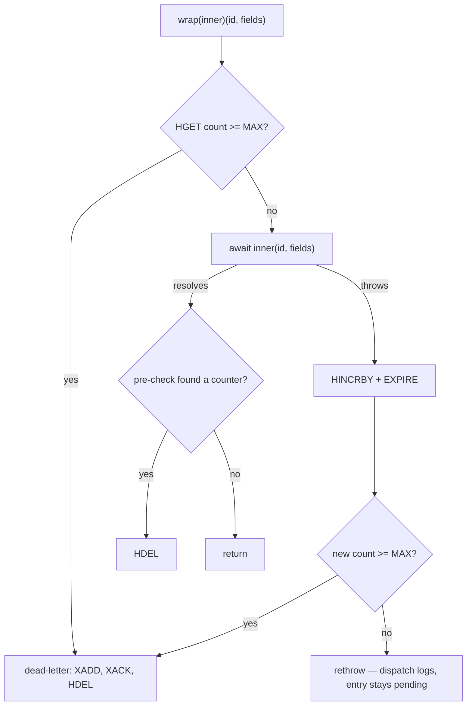

# T-041 — Retry tracking + dead-letter handler

| | |
|---|---|
| **Task** | T-041 · Retry tracking + dead-letter handler |
| **Epic** | `docs/epics/epic-7-worker-service.md:150-177` |
| **Service** | `worker-service` (only) |
| **Base** | `c88a933` (T-040), working tree clean |
| **Gate** | 1 — Task Planner. No code, no tests, no commits. |
| **Prior plan** | None. `docs/plans/` has no `t-041-*` file; this is a new plan, not an extension. |

**Every `file:line` in this plan refers to the working tree at `c88a933`.** Line numbers in
`src/events/stream.consumer.ts` in particular have gone stale at nearly every prior gate; where
a behaviour has a test id, the test id is cited in preference to the line.

---

# Part 1 — For the analyst

## 1. In plain terms

A usage event that the worker cannot process today is stuck. It is never thrown away — that
part is right and deliberate — but it is also never resolved: it sits in Redis' "delivered but
not finished" list, and the worker tries it again only when the process restarts. A message
that can *never* succeed (a malformed one, or one naming a customer that does not exist) is
retried on every deploy, forever, and the only record of why it failed is a log line that says
"invalid" without saying which field.

This task gives failure an ending:

- **Count the failures.** Each entry gets a failure counter in Redis.
- **Retry within the running worker.** After about ten seconds an entry that failed is offered
  to the processor again, instead of waiting for the next deploy.
- **Give up after three, on purpose.** On the third failure the entry is copied to a separate
  `telemetry:dead-letter` queue, with its original contents and the reason, and then cleared so
  it stops being retried.
- **Say what was wrong.** A malformed message now names the offending *field*, never its
  contents.

**Who notices.** Nobody on the customer path — no API, no response shape, no database column
changes. The people who notice are whoever operates the worker: a poisoned message stops being
an invisible permanent resident of the pending list and becomes a visible entry in a queue
somebody can read.

**What it costs if this is wrong.** Three things, in descending order of seriousness.

1. **Giving up too easily.** If the retry budget is spent during a normal database blip, good
   usage data lands in the dead-letter queue instead of being billed. Mitigated by spacing the
   attempts about ten seconds apart rather than retrying three times instantly — see risk R1.
2. **Duplicate work.** Retrying means a message can be processed twice. T-040 already made the
   write idempotent, so a duplicate attempt produces no duplicate row — but it does cost a
   wasted cycle, and it can consume a retry (R2).
3. **A queue nobody reads.** A dead-letter stream that grows unwatched is a silent data-loss
   ledger. The alerting counter that would have made it visible needs a metrics library this
   repository does not have yet, so it is deferred to T-057 and named as an open risk (R5).

### Where the new work sits

```mermaid
sequenceDiagram
    autonumber
    participant L as StreamConsumer loop
    participant W as retry wrapper (proposed S3)
    participant P as EventProcessorService
    participant R as Redis
    L->>W: handler(id, fields) (dispatch, stream.consumer.ts:760)
    W->>R: HGET retries:{stream} id (proposed S3)
    W->>P: process(id, fields) (event-processor.service.ts:87 buildHandler)
    P--x W: throws — parse or write failure (T-040 contract)
    W->>R: HINCRBY + EXPIRE (proposed S3)
    alt count < MAX_RETRY_COUNT
        W--x L: rethrow; dispatch logs HANDLER_FAILED, no XACK (stream.consumer.ts:764-773)
        L->>R: XAUTOCLAIM on cadence (proposed S5) — redelivers after the idle threshold
    else count >= MAX_RETRY_COUNT
        W->>R: XADD dead-letter, then XACK, then HDEL (proposed S3)
    end
```

Solid arrows exist on `c88a933` at the line cited. Every arrow marked *proposed* is this task.
The `XAUTOCLAIM` arrow exists as a method today (`recoverPendingEntries`, `stream.consumer.ts:624`)
but is called **once, at startup** (`:442`); what S5 proposes is the cadence, not the command.

## 2. Decisions

Everything below is **settled**. Nothing in this plan is waiting on an answer. Gate 1 halted
once already, on the redelivery question (§4 F1), and was resumed with the answer recorded here.

### Settled at Gate 0 — Q10, the DLQ retry policy

| | Decision | Effect on the work |
|---|---|---|
| Max retries | **3** (`MAX_RETRY_COUNT`, `z.coerce.number().int().min(1).max(10).default(3)`) | S1 |
| Dead-letter destination | **`telemetry:dead-letter`**, a Redis stream (`DEAD_LETTER_STREAM`) | S1, S3 |
| Retry delay | **None** — no `sleep`, no scheduled re-add, no backoff ladder | S3, S5 — see the note below |
| `telemetry_dead_letter_total` | **Deferred to T-057.** `prom-client` is in no `package.json` in the workspace (§4 F10) | out of scope |

**"No retry delay" is honoured, and the sense matters.** This task adds no timer, no sleep and
no re-scheduling. What spaces the attempts is a threshold that already exists and already had a
job: `STREAM_BLOCK_MS × WORKER_STREAM_READ.RECOVERY_IDLE_MULTIPLIER` (10 s at defaults), the
minimum idle time `XAUTOCLAIM` requires before an entry may be taken — which exists so a worker
does not steal work a live peer is still doing. After S5 that one threshold **does double duty**:
it is both the peer-safety margin and the retry spacing. A future change to `STREAM_BLOCK_MS`
or to `RECOVERY_IDLE_MULTIPLIER` therefore moves the retry spacing too, and **nothing in the
code or the tests would flag that** — the constant's docblock is the only place it is said.
S5 puts it there.

### Settled at Gate 1 — the redelivery question (the halt)

**Option 3: count + periodic reclaim.** The other three readings, and why not:

| Rejected | Why |
|---|---|
| **1 · Count only** | Faithful to the shipped code, and ships a dead-letter path that cannot fire in a worker that does not restart (§4 F1). The AC "3 failures → DLQ" would be demonstrable only by restarting the process three times. |
| **2 · Count + fail fast on unparseable** | Fixes the poison case by classifying errors, and leaves every *other* permanent failure (unknown tenant, column overflow) needing three restarts. Option 3 covers both without an error taxonomy. |
| **4 · In-delivery retry loop** | Three immediate attempts with no spacing turns a five-second database blip into three dead-lettered events. Rejected on R1. |

### Settled at Gate 1 — A to E, accepted by the user as framed

- **A · The seam is a handler decorator**, built in `src/config/container.ts`, wrapping
  `eventProcessor.buildHandler()`. Retry policy does not go inside `StreamConsumer.dispatch`
  (it would falsify that method's "nothing is acknowledged here" contract and force edits to
  four docstrings in the file with the worst stale-citation record), nor inside
  `EventProcessorService.process` (it would falsify that class's documented "anything this
  method throws propagates to `StreamConsumer.dispatch`"). Retryable failures still rethrow, so
  `dispatch`'s existing `HANDLER_FAILED` log keeps its meaning and `U29`/`I18` keep theirs.
- **B · The file is `src/services/dead-letter.service.ts`**, not the epic's
  `src/events/dead-letter.handler.ts`, because `apps/worker-service/vitest.config.mjs:79`
  excludes `src/events/**` from coverage collection (S-25). New failure-handling code should be
  inside the thresholds this package sets for itself. Reported as a divergence (§4 F2), not
  changed silently.
- **C · The dead-letter record carries the original field list**, not just the entry id —
  because a pending entry's payload can be evicted from the source stream while its id stays
  pending (§4 F7, probe P-TRIM). A DLQ record holding only `originalId` is unreplayable.
- **D · The counter is the epic's `retries:<streamName>` hash, plus a key-level TTL** refreshed
  on each increment. `HEXPIRE` does not exist on Redis 7.0.15 (probe P-HEXP) and trimmed
  entries leave orphaned counter fields with nothing to collect them (§4 F8, probe P-ORPHAN).
- **E · Q10 is marked decided** in `docs/epics/README.md` and in both Q10 mentions in
  `docs/epics/epic-7-worker-service.md`. This is the S-15/Q5 lesson: a gate settled in code and
  left unmarked in the table costs the router a re-derivation every run.

### Settled at Gate 1 — smaller calls, recorded so they are not silent

- **No `MAXLEN` on the dead-letter stream.** The source stream trims at `~100_000`
  (`STREAM_CONSTANTS.DEFAULT_MAX_LEN`); the DLQ must not, because a trimmed dead letter is
  data loss with no record. Unbounded growth is accepted and filed as R5.
- **The reclaim cadence is a derived constant, not an env var.** It is
  `blockMs × RECOVERY_IDLE_MULTIPLIER` — the same expression as the idle threshold, reusing the
  same constant rather than adding a second numeral under a second name (`.claude/rules/constants.md`
  DRY). S-6 is the live example of the alternative: `INGEST_BATCH_MAX` is declared, validated,
  and read by nothing.
- **The new integration cases go in `tests/event.processor.integration.test.ts`**, not a third
  live-Redis file. That file already fixtures a deterministic permanent failure
  (`INTEGRATION_PROCESSOR_EVENT.UNKNOWN_TENANT_ID`, which `Event_tenantId_fkey` rejects) and
  already has the guarded `FLUSHDB` helper. A third file would mean a third copy of that
  helper, which `.claude/rules/constants.md` asks to promote before it happens; not creating
  the third copy is cheaper than promoting it inside this task.

## 3. Scope and non-goals

**In scope.** Two env fields and their `.env.example` notes; a `DeadLetterService` with retry
accounting and the dead-letter write; container and `index.ts` wiring; a reclaim cadence in the
consumer loop; the S-31 diagnosis half in the stream-message parser; the Q10 docs slice;
correcting two false claims in shipped comments (§4 F1).

**Not in scope, deliberately.**

| Left out | Why |
|---|---|
| `telemetry_dead_letter_total` and any metrics dependency | No `prom-client` in the workspace; T-057 owns the substrate (§4 F10). |
| Replay *out of* the dead-letter stream | Not specified by T-041. `/v1/internal/worker/replay` exists as a stub (`app.ts`) and stays one. |
| Bounded drain before `process.exit(0)`; `XGROUP DELCONSUMER` on clean shutdown | **T-043's**, explicitly (S-26 fix direction). |
| The S-31 *error-classification* half (a typed parse error) | Option 3 makes poison messages terminate in ~20–30 s without a taxonomy. |
| S-19 (five copies of `TenantScopedRepository`), S-27 (envelope drift), S-25 (coverage exclusion), S-23 (usage-service `.min(1)`) | Each is another service's or another task's contract. B sidesteps S-25 rather than fixing it. |
| Any Prisma, repository or migration change | See the S-18 note in §5. |

**Left deliberately broken.** A dead letter is written and logged and *nothing watches the
stream*. Until T-057 there is no counter and no alert; the operational lever is
`XLEN telemetry:dead-letter`. This is a known hole, and it is better than today's hole
(a permanently stuck entry with no record at all), but it is a hole.

---

# Part 2 — For the implementer

## 4. Ground truth — every claim re-derived, with the command that established it

Transcripts in Appendix A. `.claude/rules/known-gaps.md` S-29 already records that this epic
file's T-040 section diverges from the code in four ways; **T-041's section diverges in five
more**, listed here as F2–F6. Do not file them — whether they extend S-29 or need their own id
is a Gate-4 call. The recommendation is a **new entry**: S-29 is scoped to the T-040 section by
its own title and body, and four of these five are about a code snippet S-29 never examined.

### F1 · The finding that halted this gate — a failed entry is not redelivered, and a shipped comment says it is

Two measurements, either of which is sufficient:

- **`XREADGROUP … >` does not redeliver an unacknowledged entry** (probe P-REDEL): the second
  read of the same group returned empty while `XPENDING` still reported 1.
- **`recoverPendingEntries` runs once per `run()`.** `grep -n "recoverPendingEntries"` on
  `src/events/stream.consumer.ts` gives one call site, `:442`, before the `do`/`while` at
  `:444-449`. Its own docstring (`:606`) says "once, at startup", and `:620-622` says periodic
  reclaim "is not specified by the epic and is not done here". `index.ts:152` calls `run()` once.

So on `c88a933`, an entry's **second** delivery requires a `run()` to begin — a restart, or
another worker instance starting. In a worker that stays up, a failed entry is never retried.

**The false claim.** `src/events/stream.consumer.ts:742-744` (the `dispatch` docstring) says:

> "…a failed entry stays in the pending list and **comes back through `recoverPendingEntries`
> after the idle threshold**; that is the epic's 'on failure, leave in PEL', and retry
> accounting for it is T-041's."

Read literally that describes continuous, idle-threshold-driven redelivery. The method it names
is startup-only, per its own docstring 136 lines above. This is a false claim in production
code, of the class `.claude/rules/review-standards.md` § *Claims the Change Makes* treats as a
finding; it is also, on the evidence of the Gate-0 answer to Q10, a claim that was believed and
acted on. **S5 corrects it** — and after S5 the sentence becomes true, which is the cleanest
available resolution. S5 must also correct `:606`'s "once, at startup" and `:620-622`'s
"periodic reclaim … is not done here", both of which S5 falsifies.

### F2 · The epic names a file outside this package's coverage thresholds

`docs/epics/epic-7-worker-service.md:151` → `src/events/dead-letter.handler.ts`.
`apps/worker-service/vitest.config.mjs:79` lists `"src/events/**"` in `coverage.exclude`, against
thresholds of `lines/functions/statements: 80`, `branches: 75` (`:86-90`). Decision B.

Incidental, reported and not filed: S-25 cites `vitest.config.mjs:18` for that exclusion. On
`c88a933` it is `:79` — the file grew a long `fileParallelism` docblock at T-040. A stale
citation in a gaps entry, not a wrong claim.

### F3 · The epic's snippet is a free function over module scope

`:160-171` closes over `redis`, `streamName`, `groupName`, `originalPayload`, `lastError`,
`retryCount` — none of which exist in this repository's shape. Every collaborator here is
constructor-injected `(redis, logger, env, …)`. The same objection is already recorded for
T-038's snippet in `ensureConsumerGroup`'s docblock. `originalPayload` in particular has no
referent: the handler seam is `(id: string, fields: string[])`, so "the original payload" is
the flat field list.

### F4 · "Increment a Prometheus counter" has no substrate

`:154`, `:177`. `grep -rn "prom-client" --include=package.json .` (outside `node_modules`) → no
match. Deferred to T-057 at Gate 0.

### F5 · "Clear from PEL so it doesn't block the consumer" is false as stated

`:154`. A pending entry blocks nothing: `>` delivers only entries never handed to any consumer
(probe P-REDEL, and `WORKER_STREAM_READ.NEW_ENTRIES_ONLY`'s docblock, which measured the same
thing from the other side). What a stuck entry actually costs is a permanent PEL row and a
recovery page on every start. The `XACK` in the snippet is right; the reason given for it is
not. **Do not reproduce this sentence in a comment.**

### F6 · `:156`'s pre-check costs a round trip on the happy path

"Fetch count before processing" means one `HGET` per *successful* message. Kept — it is the only
thing that catches a crash between the `HINCRBY` and the `XADD`/`XACK`, and it is what makes
`retryCount >= max` on arrival terminal rather than a fourth attempt. Recorded as a stated trade
(§9 R4), not adopted silently. The matching `HDEL` on success is made conditional on the
pre-check having found a counter, so the happy path costs exactly one extra command, not two.

### F7 · A pending entry's payload can be evicted while its id stays pending — the load-bearing probe

Probe **P-TRIM**, verbatim in Appendix A. Five entries delivered and unacknowledged, then one
`XADD … MAXLEN 1`:

```
XLEN                 -> 1
XPENDING <s> <g>     -> 5          (summary count unchanged)
XPENDING <s> <g> - + -> all five ids still listed
XRANGE               -> only the surviving entry
```

The producer publishes with `MAXLEN ~ <STREAM_MAX_LEN>`, default `100_000`
(`apps/usage-service/src/events/stream.publisher.ts:56-58`, `STREAM_CONSTANTS.DEFAULT_MAX_LEN`).
So a dead-letter record holding only `originalId` is unreplayable once 100 000 events have gone
by. **This is the justification for decision C.**

Two corollaries, both measured in the same probe:

- `XACK` of an id whose data has been evicted returns `1` and removes it from the PEL. The
  dead-letter `XACK` therefore works for trimmed entries too.
- `XAUTOCLAIM` over evicted pending ids returns them in the **third** reply element with an
  empty entry list, and removes them from the PEL (pending 4 → 0). `parseClaimReply` reads only
  elements 0 and 1 by design (`WORKER_STREAM_READ.CLAIM_REPLY_*`), so those entries never reach
  the handler again — see F8.

### F8 · Orphaned retry counters, and why the key gets a TTL

From F7's corollary: an entry whose data is trimmed vanishes from the PEL without ever reaching
the handler again, so its `retries:` hash field is never `HDEL`ed. `HEXPIRE` is not available on
Redis 7.0.15 (probe P-HEXP → `ERR unknown command 'HEXPIRE'`), so there is no per-field TTL.
Decision D's answer is a **key-level** `EXPIRE`, refreshed on every `HINCRBY`: the hash exists
only while failures are ongoing and self-expires after a quiet period. Losing a stale counter is
benign — at worst an entry gets its three attempts again.

`WORKER_DEAD_LETTER.RETRY_KEY_TTL_SECONDS` mirrors usage-service's
`DEDUP_CONSTANTS.KEY_TTL_SECONDS` (`apps/usage-service/src/constants.ts:108`, `86400`), which is
the nearest precedent for "a Redis bookkeeping key whose loss is not a correctness event".

### F9 · S-31 — what a Zod failure can and cannot leak

Probe **P-ZOD** (Appendix A) reconstructs the module-private `envelopeSchema` field-for-field
from the same `WORKER_EVENT_PROCESSING` constants and the same `iso8601Schema` import — it is a
copy, stated as a copy, because the real object has no `export`. Four malformed records, each
seeded with sentinel values and one sentinel **metadata key**:

- `issues[].path` was always a subset of the seven declared envelope names.
- **No sentinel appeared anywhere in the serialized issues** in any of the four cases —
  including `invalid_type`'s `received`, which is the *type name* `"undefined"`, not the value.
- **The boundary, established by mutation (P-ZOD case E):** the same schema made `.strict()`
  yields `{"code":"unrecognized_keys","keys":["SENTINEL-META-KEY"],…}` — a customer-supplied
  metadata key, in both `keys` and `message`.

So the claim is written conditionally and never as a universal: **measured on the shipped
non-strict schema; `.strict()` falsifies it.** S2 therefore logs `issues[].code` and
`issues[].path` only, never `issues[].message`, and `U60` pins the negative with sentinel
values *and* a sentinel metadata key — which makes the `.strict()` mutation a red test rather
than an unguarded boundary.

### F10 · Related environment facts

- Redis **7.0.15** (`INFO server`). Database 0 holds the real stream: `XLEN telemetry:events` 2,
  `XINFO GROUPS` empty, `DBSIZE` 1. Never written to during planning; re-checked after every
  probe.
- Exactly **one** production `xadd` call site exists in the workspace —
  `apps/usage-service/src/events/stream.publisher.ts:70` — and it passes `"*"`. Relevant because
  an explicit-id `XADD` *is* legal (probe P-EXPLICIT accepted `9999999999999-0`), so "entry ids
  are not caller-chosen" is a property of this platform's one producer, not of Redis.
- `toThrowError("<string>")` is a **substring** match on vitest 2.1.9 (probe P-THROW: a message
  with diagnostic detail appended matched; a message lacking the base text did not). This is why
  S2 can extend the thrown message without reddening `U42`.

### F11 · Baseline

`pnpm --filter @telemetry/worker-service test` at `c88a933` → **11 files, 129 tests, all
passing, 4.91 s**. Next free ids: **`U59`**, **`I23`**.
`tests/env.schema.unit.test.ts` uses no `U` ids (it cites ACs instead); new cases there are
referred to by exact title, everywhere else by id.

## 5. Files to change

### Existing

| File | Change |
|---|---|
| `apps/worker-service/src/constants.ts` | `WORKER_STREAM_CONSTANTS`: `DEFAULT_MAX_RETRY_COUNT`, `MAX_RETRY_COUNT_MIN/MAX`, `DEFAULT_DEAD_LETTER_STREAM` (every member of that object feeds `env.ts`, per its docblock — these do). New sibling `WORKER_DEAD_LETTER`. One new member on `WORKER_EVENT_PROCESSING.ERROR` for the diagnostic format. |
| `apps/worker-service/src/config/env.ts` | `MAX_RETRY_COUNT`, `DEAD_LETTER_STREAM`. |
| `apps/worker-service/.env.example` | Both, with the operational notes §9 names. |
| `apps/worker-service/src/validators/stream-message.validator.ts` | S-31 diagnosis half; correct the docstring paragraph that says retries are unbounded "until T-041". |
| `apps/worker-service/src/config/container.ts` | Construct `DeadLetterService`; expose it and the wrapped handler. |
| `apps/worker-service/src/index.ts` | `:116` passes the wrapped handler. |
| `apps/worker-service/src/events/stream.consumer.ts` | S5: the reclaim cadence, and the three comment corrections F1 names. |
| `apps/worker-service/src/services/index.ts` | Barrel (`export {}` today). |
| `docs/epics/README.md`, `docs/epics/epic-7-worker-service.md` | Q10 decided (E). |
| Four test files | §7. |

### New

- `apps/worker-service/src/services/dead-letter.service.ts` (decision B).
- `apps/worker-service/tests/dead-letter.service.unit.test.ts`.

### Deliberately not modified

- **Any repository, any Prisma artifact, any migration.** T-041 is Redis-only: `HGET`,
  `HINCRBY`, `EXPIRE`, `HDEL`, `XADD`, `XACK`, `XAUTOCLAIM`. **Nothing writes a timestamp to
  PostgreSQL** — in particular there is no `failedAt` column and no `failedAt` bind. `failedAt`
  is a string field *inside the Redis dead-letter entry*. This matters: worker-service's
  `withTenant` has no `set_config('TimeZone','UTC',true)` pin (S-19), so a raw timestamp
  predicate written in this service would inherit S-18 whole. There is none, and there is no
  repository call on any path this task adds.
- `apps/worker-service/src/services/event-processor.service.ts` — the decorator wraps it from
  outside; its documented contract is unchanged.
- `apps/worker-service/src/middleware/internal-auth.middleware.ts` (S-8), the other four
  `base.repository.ts` copies (S-19), `apps/usage-service/**` (S-23, S-27).

## 6. Implementation slices — smallest safe first

Pseudo-TDD throughout: write the whole case body first, **confirm red**, then implement.

### S1 · Env schema, constants, `.env.example`

**Controlling code path:** `EnvSchema` in `src/config/env.ts`; nothing reads the two new fields
until S3.

`MAX_RETRY_COUNT: z.coerce.number().int().min(WORKER_STREAM_CONSTANTS.MAX_RETRY_COUNT_MIN).max(…MAX).default(…DEFAULT_MAX_RETRY_COUNT)`
— the epic's shape at `:175`, which is one of the few parts of its T-041 section that survives
checking.
`DEAD_LETTER_STREAM: z.string().min(1).default(WORKER_STREAM_CONSTANTS.DEFAULT_DEAD_LETTER_STREAM)`
— `.min(1)`, matching the three sibling stream-name fields, which is the strictness S-23 says
usage-service lacks. **No `.trim()`**: `env.ts:37-40` records why the stream-name fields are
deliberately untrimmed (trimming one side of a producer/consumer pair recreates the divergence
the shared defaults exist to prevent). `.trim()` stays on `INTERNAL_API_SECRET` only.

**Hypothesis:** adding two defaulted fields changes no existing behaviour, and both reject the
values their bounds say they reject.
**Falsified if:** the baseline 129 does not stay green, or `MAX_RETRY_COUNT=0`, `=11`, `=2.5`
or `DEAD_LETTER_STREAM=""` parses.
**Refuting mutation to run:** drop `.min(1)` from `DEAD_LETTER_STREAM` → the blank-name case
must go red. (This is S-23's defect, reproduced deliberately in the service that has the guard.)

### S2 · The parser's diagnosis half (S-31)

**Controlling code path:** `parseStreamMessage` → `envelopeSchema.safeParse(record)` in
`src/validators/stream-message.validator.ts`, and `foldFields`' odd-length throw.

The thrown message becomes the existing constant **plus** a formatted detail suffix built from
`issues.map(i => `${i.code}:${i.path.join(".")}`)`. `ERROR.INVALID_MESSAGE` and
`ERROR.ODD_FIELD_LIST` keep their exact text as the prefix; the separators and the wrapper live
in `WORKER_EVENT_PROCESSING.ERROR` as constants. The odd-list throw gains the field-list
**length** — a count, not a value.

Because the detail rides on `error.message`, it reaches both consumers for free:
`describeError` in `dispatch` (`stream.consumer.ts:190-191`) and the DLQ record's
`failureReason` (S3).

**Hypothesis:** the thrown message names the offending fields by `code` and `path`, and no
message value and no metadata key reaches it.
**Falsified if:** a sentinel value or the sentinel metadata key appears in the message, or if
the paths do not identify the broken fields.
**Refuting mutations to run, both:** (a) revert to the bare constant → `U59` red; (b) append
`JSON.stringify(record)` to the message → `U60` red. Mutation (b) is the one that matters — a
negative assertion nobody has seen fail is not evidence.
**Inherited-and-verified:** `U42` stays green because `toThrowError(string)` is a substring
match (F10/P-THROW, re-measured here rather than taken from the docs).

### S3 · `DeadLetterService`

**Controlling code path:** the `StreamMessageHandler` returned by `wrap(inner)`, invoked from
`StreamConsumer.dispatch` at `stream.consumer.ts:760`.



*Proposed in full; no node in this flowchart exists on `c88a933`.*

Order inside the dead-letter step is **`XADD` → `XACK` → `HDEL`**, and it is the epic's order
(`:169-171`) for a reason worth writing down: a crash between `XADD` and `XACK` leaves the entry
pending with an exhausted counter, so the pre-check dead-letters it again — a duplicate DLQ
record, which is recoverable. `HDEL` first would reset the counter and grant three more
attempts; `XACK` first would risk a dead letter that was acknowledged and never recorded.
At-least-once, in the direction that keeps the record.

The DLQ entry fields are decision C: `originalId`, `streamName`, `groupName`, `payload`
(`JSON.stringify` of the flat field list), `failureReason` (`describeError`-style), `failedAt`
(ISO string), `retryCount`. Field names are constants in `WORKER_DEAD_LETTER`.

**Redis connection:** the container's client, never the loop's `duplicate()` — the same argument
`EventProcessorService`'s docstring and `container.ts:55-58` already make (a command queued
behind a parked `BLOCK` read waits it out; an unrelated `PING` during a `BLOCK 2000` was
measured at 2 080 ms).

**Keyspace, against `.claude/rules/tenant-isolation.md`'s Redis clause.** The retry key is
`WORKER_DEAD_LETTER.RETRY_KEY_PREFIX + streamName`, built by the service that writes it, from
its own prefix plus operator configuration — never from a caller-supplied value. The hash
*field* is the Redis entry id. Neither key nor field is tenant-scoped, and that is correct
rather than an omission: the counter is per stream entry, and the stream itself is cross-tenant
by design (one worker fleet reads every tenant's events). No tenant id is read, written or
logged by this service. Scope of "not caller-supplied", stated as measured: an explicit-id
`XADD` is legal on Redis (P-EXPLICIT), and what makes ids server-assigned here is that the
workspace's single production `xadd` call site passes `"*"` (F10).

**Hypotheses and their refuting mutations:**

| Hypothesis | Falsified if | Mutation to run |
|---|---|---|
| A failure increments the counter and rethrows | the wrapper resolves, so `dispatch` logs nothing and the entry looks handled | delete the `throw` → `U62` red |
| The third failure dead-letters instead of rethrowing | the entry is rethrown a third time and stays pending forever | change `>=` to `>` → `U63` red |
| The DLQ record carries the original field list | only the id is written, and a trimmed entry becomes unreplayable (F7) | drop `payload` from the `XADD` → `U64` red |
| `XACK` follows the `XADD`, never precedes it | a dead letter can be acknowledged without being recorded | swap the two calls → `U65` (call-order) red |
| A success clears a counter that exists | counters accumulate for every entry that ever failed once | delete the conditional `HDEL` → `U66` red |
| An entry arriving already exhausted is dead-lettered **without** being processed | a fourth attempt runs | move the pre-check below `inner` → `U67` red (asserts `inner` was not called) |

### S4 · Wiring

**Controlling code path:** `createContainer` (`container.ts:31-74`) → `index.ts:111-117`.

`container.messageHandler` becomes the wrapped handler and `index.ts:116` passes it.
`AppContainer` gains `deadLetterService` and `messageHandler`.

**Hypothesis:** the consumer's fifth constructor argument is the *wrapped* handler in
production.
**Falsified if:** the raw `eventProcessor.buildHandler()` is still passed — in which case every
test in S3 passes and the feature is wired to nothing.
**Refuting mutation:** revert `index.ts:116` to `container.eventProcessor.buildHandler()` →
`U69` red. This mutation is the reason `U69` exists; an S3-only suite cannot see it.

### S5 · The reclaim cadence

**Controlling code path:** `runLoop`'s `do`/`while` (`stream.consumer.ts:444-449`).

After `readBatch` returns un-interrupted, call `recoverPendingEntries` when
`blockMs × WORKER_STREAM_READ.RECOVERY_IDLE_MULTIPLIER` has elapsed since the last pass, tracked
by a local in `runLoop`. No new numeric constant; no new env var. The startup pass at `:442` is
unchanged and stays first.

Also in this slice, and not optional — the three comment corrections F1 names:
`recoverPendingEntries`' "once, at startup" (`:606`), its "periodic reclaim … is not done here"
(`:620-622`), and `dispatch`'s false "comes back … after the idle threshold" (`:742-744`). The
last becomes true when this slice lands; the other two become false and must change with it.
The `RECOVERY_IDLE_MULTIPLIER` docblock gains the double-duty sentence from §2.

**Hypothesis:** a failed entry is re-offered to the handler inside one `run()`, without a
restart, after roughly the idle threshold.
**Falsified if:** the entry is delivered exactly once per `run()` (today's behaviour).
**Refuting mutations, both:** (a) delete the cadence call → `U70` and `I23` red; (b) set the
cadence to `Number.POSITIVE_INFINITY` → same two red, which distinguishes "the call is missing"
from "the interval never elapses".
**Explicitly not claimed:** that this bounds redelivery latency. The check happens after a read
that may block for `STREAM_BLOCK_MS`, so the observed spacing is the threshold *plus* up to one
block. At defaults that is 10–15 s per cycle, which is why §1 says a dead letter lands ~20–30 s
after the first failure rather than naming one number.

### S6 · Integration, end to end

**Controlling code path:** the whole loop, against live Redis on **database 14** and live
PostgreSQL.

`I23` goes in `tests/stream.consumer.integration.test.ts` (it needs T-039's loop harness and
`BLOCK_MS_SHORT`, making the threshold 40 ms). `I24`–`I26` go in
`tests/event.processor.integration.test.ts`, reusing `INTEGRATION_PROCESSOR_EVENT.UNKNOWN_TENANT_ID`
— a UUID absent from `Tenant`, which `Event_tenantId_fkey` rejects — as a deterministic
permanent failure.

**Redis hygiene, non-negotiable (S-22, S-25):** database 14 only; every `FLUSHDB` through the
existing `flushReservedDb()` helper, which re-asserts `CLIENT INFO` contains `db=14` on **every**
call, never once in `beforeAll`; per-run key prefixes (`t041`), added to
`tests/integration.constants.ts` alongside the `t038`/`t039`/`t040` sets; never database 0.
Any new connection carries `INTEGRATION_REDIS.CLIENT_NAME` so a `CLIENT LIST` predicate can be
attributed (S-25 part 2).

**PostgreSQL hygiene:** the processor suite deletes its fixtures by explicit id in `afterEach`
*and* `afterAll` (the half S-20 records auth-service missing). Any new fixture id joins that
list. `Event` and `UsageLine` must be back at 0 rows afterwards.

**Hypothesis:** three failures inside one worker lifetime put the entry in
`telemetry:dead-letter` with its payload, clear it from the pending list, and delete its counter.
**Falsified if:** the entry is still pending, or the DLQ is empty, at the end of the case.
**Refuting mutation:** S5's mutation (a) — with the cadence removed, `I26` must fail on the
pending list still holding the entry, not on a timeout. If it fails as
`Test timed out in 5000ms` instead, the case is mis-sized and must be fixed (this has been the
same defect three times in this package: `RUN_DEADLINE_MS`, `BLOCK_MS_LONG`, and their sum —
see `CASE_BUDGET_MS` and `U50`, which pins the config against the constant).

## 7. Test plan and acceptance-coverage mapping

| AC | Statement | Proven by |
|---|---|---|
| **AC1** | `MAX_RETRY_COUNT` and `DEAD_LETTER_STREAM` parse with the Q10 defaults and reject out-of-bound values | `tests/env.schema.unit.test.ts`, new cases: "defaults MAX_RETRY_COUNT to 3 and coerces an override from string", "rejects a MAX_RETRY_COUNT outside the configured bounds", "rejects a fractional MAX_RETRY_COUNT", "defaults DEAD_LETTER_STREAM to 'telemetry:dead-letter'", "rejects a blank DEAD_LETTER_STREAM" |
| **AC2** | A handler failure increments the counter, sets the key TTL, and rethrows; the entry is not acknowledged | `U62`; `I24` (pending list still holds it, counter is 1) |
| **AC3** | The `MAX_RETRY_COUNT`-th failure writes the DLQ record, then `XACK`s, then `HDEL`s — in that order | `U63`, `U64`, `U65`; `I26` |
| **AC4** | An entry arriving with an exhausted counter is dead-lettered without being processed | `U67` |
| **AC5** | A success clears a counter that exists, and issues no `HDEL` when the pre-check found none | `U66`; `I25` |
| **AC6** | A failed entry is retried inside one `run()`, with no restart | `U70`; `I23`. **`U71` was listed here and is not evidence for this AC** — corrected at the Gate-4 review (L-1). Measured, twice independently: with the cadence block deleted, `U70` and `I23` go red by assertion (`expected 1 to be greater than or equal to 2`) and `U71` stays **green**. |
| **AC6b** | The cadence is the idle threshold, not every read — a reclaim is not issued per iteration | `U71`. Green before the fix *and* after it; it reddens only under the over-correction (an unconditional `recoverPendingEntries` in the loop body), which was run. It guards a wrong fix, not the absence of the right one, and is listed that way rather than counted as regression evidence. |
| **AC7** | A malformed message's reason names `code`+`path`; no message value and no metadata key reaches the message, the log, or the DLQ record | `U59`, `U60`; `I27` (asserts the sentinel is absent from the DLQ `failureReason`) |
| **AC8** | Nothing tenant-bearing is logged | `U68` (logger assertions across every method, mirroring `U45`'s shape) |
| **AC9** | Q10 recorded as decided | Review of `docs/epics/README.md` and `docs/epics/epic-7-worker-service.md` at Gate 4 — a docs change with no test, stated as such |
| **AC10** | No repository call, no Prisma client use, no new dependency on any path this task adds | `U61` (the wrapper's collaborators are `redis` and the inner handler only); `git diff` over `package.json` and `prisma/` empty at Gate 4 |

New ids: `U59`–`U71` (13 unit cases), `I23`–`I27` (5 integration cases). Expected total after
this task: **129 + 18 = 147**, minus nothing — no existing case is deleted. If any existing case
needs *editing*, that is a finding to report at Gate 3, not a silent fix; the one expected edit
is `U46`/`U69`'s neighbourhood in `tests/index.graceful-shutdown.unit.test.ts`, where the
argument passed to `StreamConsumer` changes.

**Quality bar (`.claude/rules/testing.md`).** Every assertion is on behaviour, never on a mock's
own return value; the call-order assertions (`U65`) use invocation order, not two independent
call checks, matching `U7`'s shape; helpers that locate a call throw when it is missing rather
than passing vacuously; every branch gets a negative case, and the S-31 negative (`U60`) is the
one the whole entry is LOW rather than MEDIUM for.

## 8. Validation commands

Task-scoped first, in this order, after the first substantive edit of each slice:

```bash
# S1-S5, narrowest first
pnpm --filter @telemetry/worker-service exec vitest run tests/env.schema.unit.test.ts
pnpm --filter @telemetry/worker-service exec vitest run tests/stream-message.validator.unit.test.ts
pnpm --filter @telemetry/worker-service exec vitest run tests/dead-letter.service.unit.test.ts
pnpm --filter @telemetry/worker-service exec vitest run tests/stream.consumer.unit.test.ts
pnpm --filter @telemetry/worker-service exec vitest run tests/index.graceful-shutdown.unit.test.ts

# S6 — live Redis (db 14) and live PostgreSQL
pnpm --filter @telemetry/worker-service exec vitest run tests/stream.consumer.integration.test.ts
pnpm --filter @telemetry/worker-service exec vitest run tests/event.processor.integration.test.ts

# package gate
pnpm --filter @telemetry/worker-service typecheck
pnpm --filter @telemetry/worker-service lint
pnpm --filter @telemetry/worker-service test          # expect 147
pnpm --filter @telemetry/worker-service build
```

`pnpm --filter <pkg> test -- <file>` does **not** scope to a file; `exec vitest run <file>` does.

Manual verification after S6, read-only except where noted:

```bash
redis-cli -n 14 DBSIZE            # 0 — the suite's own teardown
redis-cli -n 0  XLEN telemetry:events   # 2, unchanged — db 0 is never written
psql "$DIRECT_DATABASE_URL" -Atc 'select count(*) from "Event"; select count(*) from "UsageLine";'  # 0, 0
```

Full gate, before handoff (`--force`, because turbo replays cached task results):

```bash
pnpm build --force && pnpm test --force && pnpm lint --force && pnpm typecheck --force
```

All four across 13 packages. `pnpm format:check` is **not** run: it cannot pass on any revision
of this repository (S-12) and is not in CI.

## 9. Risks and mitigations

| # | Risk | Severity | Mitigation, at its real strength |
|---|---|---|---|
| **R1** | A transient outage spends the retry budget and dead-letters good usage data | HIGH | Attempts are spaced by the idle threshold (~10 s at defaults), not immediate — which is why option 4 was rejected. Three attempts over ~20–30 s still will not survive a multi-minute outage: an operator raising `MAX_RETRY_COUNT` to its cap of 10 buys ~2 minutes. **Not fully mitigated**; the DLQ is the backstop and replay is T-041's non-goal. |
| **R2** | Periodic reclaim makes peer-stealing steady-state, not startup-only | MEDIUM | The idle threshold still guards it: an entry is taken only after `blockMs × 2` of no activity. T-040's `@@unique([tenantId, idempotencyKey])` upsert makes a double-process **idempotent at the database** — measured by **`I14`** ("a replay of the same entry leaves one `Event` and one `UsageLine`, with the same ids"), which is T-040's evidence and is inherited here rather than re-run. It does **not** make stealing harmless: the stolen entry still costs an `XAUTOCLAIM`→process cycle, and if the peer's own attempt then fails it can increment the same counter twice for one logical failure. That second effect is **reasoned, not measured** — no probe exercised two live workers — and is the honest weak point of this row. |
| **R3** | The retry hash grows without bound | LOW | Key-level TTL refreshed on each increment (D, F8). Bounded by "failures in the last `RETRY_KEY_TTL_SECONDS`", not by total events. |
| **R4** | One extra `HGET` per successful message | LOW | Measured trade, not silent (F6). The `HDEL` is conditional, so the happy path costs exactly one extra round trip on the container's connection — never on the loop's parked one. |
| **R5** | The dead-letter stream is unbounded and unwatched — in **growth** and in **retention** | MEDIUM | No `MAXLEN` deliberately (a trimmed dead letter is data loss with no record). Until T-057 the lever is `XLEN telemetry:dead-letter`; `.env.example` says so. **Second half, added at the Gate-4 review (L-6):** the record holds the whole original field list — `tenantId` and all flattened customer metadata — and nothing expires it, while the *source* stream trims at `MAXLEN ~ 100000`. So a payload that would have aged out of Redis persists indefinitely once dead-lettered. The design reason (decision C, replayability) is unchanged and sound; what was missing was saying that unbounded **retention** of customer data is part of the accepted cost, not only unbounded length. A retention lever belongs with T-057. |
| **R6** | Editing the 777-line `stream.consumer.ts` reintroduces a stale citation | MEDIUM | S5 is a small diff with three *mandated* comment corrections (F1). Every line number this plan cites is re-derived at Gate 3 before it is quoted in a comment. |
| **R7** | The idle threshold now sets retry spacing as well as peer safety, and nothing flags a change | MEDIUM | Recorded in the constant's docblock (S5) and in §2. **No test asserts the coupling** — it cannot be asserted without pinning a wall-clock relationship, which this package has three prior incidents against (`CASE_BUDGET_MS`). Stated as a documented coupling, not a guarded one. |
| **R8** | The dead-letter record re-serializes the producer's envelope, inheriting S-27's drift | LOW | It copies the wire bytes verbatim and classifies nothing, so it adds no new exposure decision — but if the producer ever publishes a field worker does not expect, it lands in the DLQ payload exactly as it lands in `Event.metadata` today. Same gap, not a new one. |

## 10. Pending task checklist

- [done] S1 · constants, `EnvSchema`, `.env.example`; 7 env cases red then green (plan named 5; 2 extra — bounds-accepted and override-honoured). Refuting mutation run: dropping `.min(1)` reddened "rejects a blank DEAD_LETTER_STREAM".
- [done] S2 · parser diagnosis; `U59`/`U60` red then green; both refuting mutations run, plus a third (`.strict()`) that measured F9's conditional — see the report.
- [done] S3 · `DeadLetterService`; `U61`–`U68` red then green (8 cases); all six mutations run, each reddening its nominated case.
- [done] S4 · container + `index.ts`; `U69` red then green (`U68` belongs to S3 per §7's AC table); `U46` edited deliberately; the `index.ts` revert mutation run, plus a container-composition mutation.
- [done] S5 · reclaim cadence + the three comment corrections (plus a fourth, the `runLoop` sequence paragraph); `U70` red then green; `U71` green before and after and red under the over-correction; `I10` edited deliberately.
- [done] S6 · `I23`–`I27`; db 14 only, guarded flush, fixtures deleted by id. `I23`/`I26` fail by assertion under the cadence mutation, not by timeout.
- [done] E · Q10 marked decided in `docs/epics/README.md` (gate table + a new decision note) and `docs/epics/epic-7-worker-service.md` (both mentions).
- [done] Propose F2–F6 to Gate 4 as a new `known-gaps.md` entry (recommendation: not an S-29 extension). Not filed here; carried in the Gate-3 report.
- [done] Package gate: typecheck, lint, build clean; test 155 (not 147 — 8 extra cases, itemised in the report).
- [done] Full gate with `--force`, 13 packages, statuses reported for all 13.
- [done] Environment restored: `Event` 0, `UsageLine` 0, db 14 `DBSIZE` 0, db 0 back to `DBSIZE` 1 / `XLEN` 2 / no groups. **A defect in a Gate-3 test wrote to db 0 and was cleaned up** — reported in full.
- [done] Pre-existing warnings distinguished from new ones and proven.

### Gate 4 Round 1 → Gate 3 Round 2 (rework)

- [done] **H-1** · S-31 removed from `.claude/rules/known-gaps.md` (both halves closed: the
  diagnosis by `describeIssues`, the retries-forever by the wired dead-letter path). The id is
  retired, never reused. Two code comments that cited it as a *live* entry in that file were
  reworded to cite it as retired.
- [done] **M-2** · `tests/setup.ts` pins `REDIS_URL` to `redis://localhost:6379/14`. Verified
  structurally, not by inspection: with the `hincrby` stub removed from the container case and no
  `REDIS_URL` override, `retries:telemetry:events` landed in **db 14** (`HGETALL` →
  `1789101023800-0 1`) and db 0's `KEYS *` stayed `telemetry:events` alone. Key deleted, db 14
  back to `DBSIZE 0`. All 156 tests re-run after the change.
- [done] **M-3** · `RECOVERY_MAX_PAGES` docblock: "per startup" → "per recovery pass", "next
  restart" → "next cadence pass", plus the log-repetition consequence, marked reasoned-not-measured.
- [done] **M-4** · the fourth F1 site. The "same check twice" justification is now stated as true
  of the startup call site and **false of the cadence one**, where this guard is the first check
  the pass makes. The optional top-of-method guard was **declined**, with the reason recorded in
  the comment: `stopAfter(n)` counts predicate *checks*, so an extra check per pass shifts every
  case that uses it — a suite-wide change for a one-page exposure this guard already ends.
- [done] **M-5** · the `xadd` universal. Re-counted: **two** production call sites, not one, the
  second being this change's own. Restated as "the only `xadd` onto the **source** stream", with
  both sites and their `"*"` arguments named.
- [done] **M-6** · decision **A**. `.superRefine` on the object (cross-field, so it cannot live on
  either field), `WORKER_STREAM_CONSTANTS.DEAD_LETTER_STREAM_COLLISION` for the message, one env
  case covering an explicit collision, a collision against the *default* `REDIS_STREAM_NAME`, the
  message identity, and an anti-vacuity pair that still parses. Confirmed red before the
  refinement existed, and red again under the refuting mutation.
- [done] **L-1** · AC6's proof column corrected; `U71` moved to its own **AC6b** row, described as
  green before *and* after the fix.
- [done] **L-5** · **S-32** filed (not an S-29 extension, per the reviewer's ruling), including the
  caveat that the epic self-corrects at `:184-202` while the wrong claims remain at `:151`/`:154`.
  Its `>`-does-not-redeliver claim was **re-measured** on db 14 rather than inherited.
- [done] **L-2** · the two "until the next restart" understatements in `recoverPendingEntries`.
- [done] **L-6** · the retention half of R5 recorded here and in `.env.example`: a dead-lettered
  payload never expires, while the source stream trims at `MAXLEN ~ 100000`.
- [done] **L-7** · `DEAD_LETTER_STREAM: deadLetterStream ?? ""` replaced with a conditional spread,
  so no value the schema rejects is ever constructed.
- **L-3 declined for this commit** (the remaining inline `describeError` in
  `event-processor.service.ts`) — the reviewer accepted this disposition. Two copies, not three;
  fold it in with the next worker-service change.
- **L-4 accepted as-is** (the two barrels export things nothing imports). `src/services/index.ts`
  is a deliverable this plan's §5 lists; `src/utils/index.ts` was made consistent with it. Do not
  add a third.
- **N-1 accepted** (the record-folding helper written twice, once per suite). Promote if a third
  appears.

### Gate 6 review → Gate 3 Round 4

- [done] **R3-9** · `U72` (`tests/env.schema.unit.test.ts`, in the "dead-letter configuration"
  block) pins `MAX_RETRY_COUNT_MIN`. Worker 156 → **157**.

  **The gap, reproduced before the case was written.** Setting `MAX_RETRY_COUNT_MIN` to `0` left
  the package **156/156 green**. The reason is that the only bounds case derives its input as
  `String(MAX_RETRY_COUNT_MIN - 1)`, so it moves with the constant it is testing. Measured both
  ways: at `MIN: 1` that input is `"0"` and `safeParse("0").success` is `false`; at `MIN: 0` the
  input becomes `"-1"` and is still rejected — while `safeParse("0").success` becomes **`true`**.
  An input computed from the constant under test cannot detect the constant changing.

  **What the case asserts.** The property first and the numeral second, and the order was chosen
  by measurement rather than by taste: assertions short-circuit, so whichever runs first names
  the failure. With the numeral first, the floor mutation failed at `expected +0 to be 1` and the
  property line never executed. Ordered property-first, the same edit fails at
  `expected true to be false` on a `safeParse` of `MAX_RETRY_COUNT=0` — which says that a budget
  of zero became configurable, rather than that a numeral moved. A **literal** `"0"` is used,
  never `String(MAX_RETRY_COUNT_MIN - 1)`.

  **Why the floor is worth pinning**, connected to the measurement rather than to the reasoning:
  `readRetryCount`'s coercion of a non-numeric counter to `0` is inert at every budget `>= 1` —
  Gate 5 measured byte-identical command sequences and outcomes with the coercion and with a bare
  `return parsed`. It stops being inert at exactly one value: at `maxRetryCount === 0`, `0 >= 0`
  is true while `NaN >= 0` is false, and Gate 5 measured the divergence end to end — with the
  coercion `cmds=[hget,xadd,xack,hdel]` and `inner` never ran; without it `cmds=[hget]` and
  `inner` ran once. `MAX_RETRY_COUNT_MIN: 1` was the only thing keeping that unreachable, and
  nothing pinned it.

  **Citations made real rather than asserted.** The case comment says it is cited from
  `readRetryCount`'s docstring; that was not true when written, so both sites now name `U72` — the
  docstring, and `MAX_RETRY_COUNT_MIN`'s own docblock, which is where an editor would look before
  lowering the floor.

  **Convention departure, recorded:** this file otherwise cites ACs rather than `U` ids (plan
  §4 F11). `U72` carries an id because two `src/` docblocks cite it by name and need a stable
  handle. It lives here rather than in `tests/dead-letter.service.unit.test.ts` because the
  assertion is about `EnvSchema`, and moving it would mean a second copy of `buildBaseEnv`.

### Gate 5 QA → Gate 3 Round 3

- [x] **F-3** · `readRetryCount`'s NaN guard. **Resolved at the Gate-6 transition: keep the
  guard, correct the docstring** (option A). QA asked for one unit case proven red by replacing
  the guard with `return parsed;`. **No such case can be written through the public seam**, and
  the reason is measured rather than argued — see below. Three writable alternatives were
  declined and Gate 6 ruled that declining was right; it also found a fourth nobody had proposed,
  which *is* writable and is now `U72` (R3-9: nothing pinned `MAX_RETRY_COUNT_MIN`, the floor the
  guard's unreachability depends on — setting it to `0` left the suite green). The docstring was
  then corrected twice: its original claim was false, and so was its first replacement — see the
  R3-3 note in `dead-letter.service.ts`.

  **What was measured, and how.**

  1. *The guard is reached.* A non-numeric value is storable in the hash
     (`HSET t041nan:retries id-1 "not-a-number"` → `1`) and `HGET` returns it as a string, so it
     passes the `raw === null` check and `Number.parseInt(raw, 10)` yields `NaN`. Through ioredis:
     `HGET` of a field holding `""` → `""`, of a corrupt field → `"not-a-number"`, of a missing
     field → `null` — so `""` and `"not-a-number"` both reach the guard and are distinguishable
     from absence. `HINCRBY` against such a field replies
     `ERR hash value is not an integer`, so a corrupt value persists rather than being overwritten.
  2. *The guard is nonetheless unobservable.* A probe drove `wrap()` over
     {`"not-a-number"`, `""`, `"2"`} x {inner succeeds, inner fails}, recording the Redis command
     sequence, whether `inner` ran, and whether the handler resolved or threw. With the guard and
     with `return parsed;` the six rows are **byte-identical**. That is why QA saw 156/156.
  3. *Why.* `priorCount` has exactly two use sites — `priorCount >= this.maxRetryCount` and
     `priorCount > RETRY_COUNT_NONE` — and a third (`deadLetter(..., priorCount)`) reachable only
     through the first. Measured: `NaN >= n` is `false` for every `n`, and `0 >= n` is `false` for
     every `n >= 1`; `NaN > 0` and `0 > 0` are both `false`. `MAX_RETRY_COUNT` is
     `.min(WORKER_STREAM_CONSTANTS.MAX_RETRY_COUNT_MIN)` with `MAX_RETRY_COUNT_MIN: 1`, so `0` and
     `NaN` are indistinguishable at every site, for every configuration the schema admits.
  4. *The falsifying case, run rather than reasoned.* At `MAX_RETRY_COUNT: 0` the guard becomes
     observable — `0 >= 0` is `true`, `NaN >= 0` is `false`. With the guard a corrupt counter
     dead-letters on arrival (`cmds=[hget,xadd,xack,hdel]`, `inner` not called); without it the
     entry is processed (`cmds=[hget]`, `inner` called once). That is the **only** distinguishing
     configuration, and `MAX_RETRY_COUNT_MIN` forbids it.

  **Consequence for the docstring, which is the real finding.** It currently says a corrupt
  counter "would silently grant unlimited retries, where zero grants the normal budget". Both
  clauses are false at any legal `MAX_RETRY_COUNT`: the two values grant *identically*, because
  neither ever satisfies the pre-check; and the retry budget on the failure path is driven by
  `HINCRBY`'s return value, not by `priorCount` — and `HINCRBY` against a corrupt field errors
  rather than counting, so "unlimited retries" does not describe either branch.

  **Not done, deliberately:** a case asserting the corrupt-counter behaviour would be green with
  and without the guard (a coverage tick, which QA's own wording rules out); a case reaching the
  private `readRetryCount` by cast would go red but asserts an implementation value rather than
  behaviour, and would enshrine the false justification; a case pinning `MAX_RETRY_COUNT: 0`
  through an `as ServiceEnv` cast would go red but constructs a configuration the shipped schema
  rejects — the same anti-pattern the Gate-4 review filed as L-7 and this change fixed.

## 11. Approval gate

**Approved at Gate 2 on 2026-09-14. Gate 3 (Task Implementer) may proceed.**

Gate 1 halted once, on F1, and was resumed with the answer recorded in §2 — there are **no
decisions outstanding**: Q10 is settled (3 retries, `telemetry:dead-letter`, no retry delay,
counter deferred to T-057), the retry model is **option 3** (count + periodic reclaim), and
decisions A–E were accepted as framed.

*(Original gate text, for the record.)* **This plan is complete and stops here.** No production
code, no tests, and no commits have been written; the only file created is this one.

Approve to proceed to Gate 2 (Task Implementer) with slices S1–S6 in order.

---

# Appendix A — Probe transcripts

All probes ran against the live Redis 7.0.15 and PostgreSQL on this host. **Database 0 was read
only** (`XLEN`, `XINFO GROUPS`, `DBSIZE`); every write went to worker-service's reserved
database **14**, which was left at `DBSIZE 0`. `Event` and `UsageLine` were 0 rows before and
after. Working tree clean throughout.

### P-STATE — before and after, identical

```
$ redis-cli INFO server | head -2        -> redis_version:7.0.15
$ redis-cli -n 0 XLEN telemetry:events   -> 2
$ redis-cli -n 0 XINFO GROUPS telemetry:events -> (empty)
$ redis-cli -n 0 DBSIZE                  -> 1
$ redis-cli -n 14 DBSIZE                 -> 0
$ psql ... -Atc 'select count(*) from "Event", ... "UsageLine", ... "Tenant";'
                                         -> 0|0|2
```

The two `Tenant` rows are pre-existing S-20 residue from auth-service's integration suite, not
this task's.

### P-REDEL — `>` does not redeliver an unacknowledged entry; `XAUTOCLAIM` does

```
$ redis-cli -n 14 XGROUP CREATE t041b:s g '$' MKSTREAM        -> OK
$ redis-cli -n 14 XADD t041b:s '*' f poison                   -> 1789371113912-0
$ redis-cli -n 14 XREADGROUP GROUP g worker-1 COUNT 10 STREAMS t041b:s '>'
  -> t041b:s 1789371113912-0 f poison
$ redis-cli -n 14 XREADGROUP GROUP g worker-1 COUNT 10 BLOCK 50 STREAMS t041b:s '>'
  -> (empty)                                   # NOT redelivered
$ redis-cli -n 14 XPENDING t041b:s g           -> 1
$ redis-cli -n 14 XAUTOCLAIM t041b:s g worker-1 0 0-0 COUNT 10
  -> 0-0  1789371113912-0 f poison             # same consumer reclaims its own
$ redis-cli -n 14 XPENDING t041b:s g - + 10
  -> 1789371113912-0 worker-1 8 2              # id consumer idle delivery-count
$ redis-cli -n 14 XAUTOCLAIM t041b:s g worker-1 100 0-0 COUNT 10   # min-idle 100ms
  -> 0-0  1789371113912-0 f poison
$ redis-cli -n 14 XPENDING t041b:s g - + 10
  -> 1789371113912-0 worker-1 7 3
```

Note the fourth column: Redis maintains its own per-entry **delivery** count. It was considered
and rejected as the retry counter — it counts deliveries rather than failures (a successful
delivery increments it too), a peer's reclaim inflates it, and `parseClaimReply` reads no
`XPENDING`. The Gate-0 answer named `HINCRBY`, and `HINCRBY` counts the right thing.

### P-TRIM — the load-bearing probe: `MAXLEN` evicts data from under the pending list

```
$ redis-cli -n 14 XADD t041probe:s '*' f v1     -> 1789370969117-0
$ redis-cli -n 14 XGROUP CREATE t041probe:s g 0 -> OK
  ... four more XADDs (v2..v5) ...
$ redis-cli -n 14 XREADGROUP GROUP g c1 COUNT 10 STREAMS t041probe:s '>'
  -> all five entries delivered, none acknowledged
$ redis-cli -n 14 XPENDING t041probe:s g
  -> 5 1789370969117-0 1789370969144-0 c1 5
$ redis-cli -n 14 XADD t041probe:s MAXLEN 1 '*' f v6   -> 1789370969163-0
$ redis-cli -n 14 XLEN t041probe:s                     -> 1
$ redis-cli -n 14 XPENDING t041probe:s g
  -> 5 1789370969117-0 1789370969144-0 c1 5            # unchanged
$ redis-cli -n 14 XPENDING t041probe:s g - + 10
  -> 1789370969117-0 c1 35 1  1789370969127-0 c1 35 1  1789370969133-0 c1 35 1
     1789370969138-0 c1 35 1  1789370969144-0 c1 35 1  # all five ids still pending
$ redis-cli -n 14 XRANGE t041probe:s - +
  -> 1789370969163-0 f v6                              # only the survivor has data
```

Decision C rests on this: five ids are pending and four of their payloads no longer exist.

### P-ACK-TRIMMED and P-ORPHAN — the two corollaries

```
$ redis-cli -n 14 XACK t041probe:s g 1789370969117-0   -> 1
$ redis-cli -n 14 XPENDING t041probe:s g | head -1     -> 4
   # XACK works on an id whose data was evicted

$ redis-cli -n 14 XAUTOCLAIM t041probe:s g c2 0 0-0 COUNT 10
  -> 0-0  (empty entry list)  1789370969127-0 1789370969133-0 1789370969138-0 1789370969144-0
$ redis-cli -n 14 XPENDING t041probe:s g | head -1     -> 0
   # the evicted ids come back in the THIRD reply element and leave the PEL;
   # parseClaimReply reads elements 0 and 1 only, so they never reach the handler
```

P-ORPHAN is why decision D adds a key-level TTL: those entries' counter fields would never be
`HDEL`ed by any code path.

### P-HEXP and P-HASH — counter semantics on 7.0.15

```
$ redis-cli -n 14 HEXPIRE t041probe:retries 60 FIELDS 1 x
  -> ERR unknown command 'HEXPIRE', ...        # no per-field TTL on 7.0.15
$ redis-cli -n 14 HGET t041probe:retries missing -> (nil)
$ redis-cli -n 14 HINCRBY t041probe:retries id-1 1 -> 1
$ redis-cli -n 14 HINCRBY t041probe:retries id-1 1 -> 2
$ redis-cli -n 14 HDEL t041probe:retries id-1      -> 1
$ redis-cli -n 14 HDEL t041probe:retries id-1      -> 0     # idempotent
$ redis-cli -n 14 EXISTS t041probe:retries         -> 0     # empty hash deletes itself
```

### P-EXPLICIT — entry ids are server-assigned by convention, not by protocol

```
$ redis-cli -n 14 XADD t041probe:s 9999999999999-0 f explicit -> 9999999999999-0
```

An explicit id is accepted. What bounds it here is the workspace, not Redis:
`grep -rn "xadd" apps packages --include=*.ts` excluding `dist/` and tests returns exactly one
production call site, `apps/usage-service/src/events/stream.publisher.ts:70`, which passes `"*"`.

### P-ZOD — what a Zod envelope failure carries, four cases plus the boundary mutation

The probe reconstructs `envelopeSchema` from `WORKER_EVENT_PROCESSING` and `iso8601Schema`,
because the real object has no `export`. It is a copy; the measurement is about Zod's issue
shape, which is a property of the schema definition and the library version (zod 3.25.76).

```
### A missing every envelope field  success=false
paths:  [["eventId"],["tenantId"],["eventType"],["quantity"],["unit"],["occurredAt"],["idempotencyKey"]]
codes:  ["invalid_type", x7]
FULL:   [{"code":"invalid_type","expected":"string","received":"undefined","path":["eventId"],"message":"Required"}, ...]
sentinels present in full issues JSON: NONE

### B bad uuid + bad quantity + bad datetime  success=false
codes:  ["invalid_string","invalid_string","too_small","invalid_string","too_small","invalid_string","too_small"]
messages: ["Invalid uuid","Invalid uuid","String must contain at least 1 character(s)","Invalid",
           "String must contain at least 1 character(s)","Invalid datetime","String must contain at least 1 character(s)"]
sentinels present in full issues JSON: NONE

### C valid envelope + customer metadata key/value  success=true   (no issues at all)

### D metadata present AND envelope broken  success=false
sentinels present in full issues JSON: NONE

### E .strict() variant — the mutation that shows the boundary  success=false
FULL: [{"code":"unrecognized_keys","keys":["SENTINEL-META-KEY"],"path":[],
        "message":"Unrecognized key(s) in object: 'SENTINEL-META-KEY'"}]
```

Inputs carried sentinels in `eventId`, `tenantId`, `quantity`, `idempotencyKey`, one metadata
**key** and one metadata **value**. `received` in case A is the type name `"undefined"`, not the
value. Case E is why the claim in §4 F9 is conditional and why `U60` seeds a sentinel metadata
key as well as sentinel values.

### P-THROW — `toThrowError(string)` is a substring match on vitest 2.1.9

```
✓ matches a message that has diagnostic detail appended
✓ does not match a message that lacks the base text
Test Files 1 passed (1) / Tests 2 passed (2)
```

Run from a scratchpad root, outside the repository. This is what lets S2 extend the thrown
message without reddening `U42`.

### P-BASELINE — worker-service at `c88a933`

```
$ pnpm --filter @telemetry/worker-service test
 Test Files  11 passed (11)
      Tests  129 passed (129)
   Duration  4.91s
```

Highest ids in use: `U58`, `I22`. `tests/env.schema.unit.test.ts` carries no ids by local
convention.
