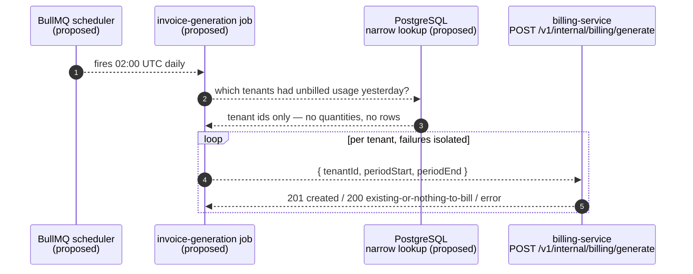

# T-042 · BullMQ daily invoice-generation job — worker-service

**Task**: `docs/epics/epic-7-worker-service.md:206-240` · **Milestone**: v1 · **Epic**: 7 (last
unimplemented task; T-037–T-041 and T-043 are committed)
**Planned against**: `5cb454a` (T-046), clean tree
**Gate**: 1 of `/ship`. No production code and no tests were written. No migration was applied
and no database role was created — the migration below is specified, not executed.

**Status of this file**: new. No prior `docs/plans/t-042-*.md` exists
(`ls docs/plans/ | grep -i 042` → no match), so this replaces nothing and extends nothing.

---

# Part 1 — for the analyst

## 1. In plain terms

Every night the platform should turn yesterday's metered usage into draft invoices. Today it
does not: billing-service can generate an invoice **for a tenant you name**, and nothing names
any tenants. This task adds the thing that names them — a scheduled job inside worker-service
that, once a day, works out which customers used the product yesterday and asks billing-service
to invoice each of them.

**Who notices.** Nobody externally, on the day it ships. There are no draft invoices in the
system at all right now, so this is the first step of the billing pipeline becoming automatic
rather than manual. Internally, operations gains a nightly log line per tenant and a queue they
can inspect.

**What it costs if this is wrong**, in descending order of seriousness:

1. **A tenant is silently skipped** → usage is metered, never invoiced, and the revenue is
   simply never billed. Nothing raises an alarm, because "no invoice" looks the same as "no
   usage". This is the expensive failure and it drives almost every design choice below.
2. **The day boundary is off by a few hours** → an invoice covers 20:00-to-20:00 instead of
   midnight-to-midnight. Usage lands on the wrong invoice, and because each usage record is
   marked billed once, the error is not self-correcting. This is a live hazard rather than a
   theoretical one: the development machine's database runs on India time, and a naive
   implementation shifts by exactly that offset (measured, §A.2).
3. **A tenant is invoiced twice** → a customer-visible billing error. Billing-service already
   defends against this and we rely on that defence rather than reimplementing it.

**The part that needed your decision, and why.** To find "which customers used the product
yesterday", the job has to look across *all* customers at once. The platform is built so that
this is impossible by default — every service's database connection can only see one customer's
rows at a time, and that is deliberately enforced by the database, not just by convention. So
the job needs a narrow, explicitly-granted exception. You chose the option that bounds the
exception by mechanism: a new, separate database identity for worker-service that may call one
purpose-built lookup, and nothing else. The other three options are recorded as rejected in §2.

**What ships**: a scheduled job, one database migration creating that narrow lookup and the
identity allowed to call it, an ordered deployment note, and the tests that prove the exception
is as narrow as claimed.



Every arrow is dashed and labelled *proposed*: none of this exists today. The one existing fact
in the picture is billing's endpoint, whose contract is read from
`apps/billing-service/src/validators/generate-invoice.validator.ts:22-37` and
`apps/billing-service/src/controllers/internal.controller.ts:35-60`.

---

## 2. Decisions

### D1 — How the job reads across all tenants · **SETTLED BY YOU: option A2**

**Decision: A2 — a `SECURITY DEFINER` resolver owned by a new `NOLOGIN` definer role, callable
only by a new fourth application role `telemetry_worker_app`, which worker-service connects as.**

The premise is measured, not assumed. As the role worker-service connects as today
(`telemetry_app`), the epic's `getTenantsWithUnbilledUsage` returns **zero rows** — and so does
any attempt to list tenants at all (§A.1):

| Probe as `telemetry_app` (NOSUPERUSER, NOBYPASSRLS) | Result |
|---|---|
| `SELECT count(*) FROM "UsageLine"` — no tenant context | `0` |
| `SELECT DISTINCT "tenantId" FROM "UsageLine" WHERE billed = false` | 0 rows |
| the same inside a txn after `set_config('app.tenant_id', <A>, true)` | tenant A only |
| `SELECT count(*) FROM "Tenant"` — no tenant context | `0` |
| the first query as `postgres` (owner) | both tenants |

So this was never a policy question about documenting an exception — the exception does not
exist yet and must be built.

**Why A2 over the alternatives**, recorded because a later reader will ask:

| Rejected | Reason |
|---|---|
| **A1** — same resolver, `EXECUTE` granted to the shared `telemetry_app` | Hands usage-, billing- and analytics-service the same cross-tenant read. `v1_5` refused exactly this for the auth resolvers and said why, in its own header: `telemetry_app` "is shared by the other five services". A2 bounds the reach to one service by mechanism; A1 bounds it by nobody misusing it. |
| **B** — worker maintains a per-day Redis set of tenant ids as it processes events | Does not remove the cross-tenant exception, it **moves it to a layer with no enforcement at all** — Redis has no RLS. It also changes the question from *has unbilled usage* to *had usage that passed through this worker fleet*, so any usage that arrived another way is silently never invoiced. A silently missed invoice is lost revenue, which is precisely what T-045's D1 already ruled against when it chose to refuse loudly rather than quietly omit a metric. |
| **C** — point the job at `DIRECT_DATABASE_URL` (the owner connection) | Smallest diff; contradicts `.claude/rules/tenant-isolation.md` ("Never point a running service at `DIRECT_DATABASE_URL`") and `CLAUDE.md` outright. Listed so the rejection is on the record. |

**What A2 obliges, and what makes the bound testable rather than asserted** — each item has a
slice and a test in Part 2:

- `EXECUTE` granted to `telemetry_worker_app` **alone**; revoked from `PUBLIC` *and* from
  `telemetry_app`. (S1, S2; tests `R6`, `R7`.)
- Neither application role may be a **member** of the definer role. Membership is the
  escalation path and, for the role that legitimately holds `EXECUTE`, the privilege checks
  cannot notice — which is why `v1_5` asserts it directly with `pg_has_role`. Mirrored. (S1;
  test `R8`.)
- The function returns **tenant ids only** — `SETOF text`, never a quantity, never a
  `UsageLine` id. A test asserts the catalog return type so a future widening goes red. (S2;
  test `R5`.)
- `telemetry_worker_app`'s table grants are enumerated, with **no** blanket `ALTER DEFAULT
  PRIVILEGES … GRANT`, so a future table has to be granted deliberately — the mistake
  `.claude/rules/tenant-isolation.md` calls out about copying `telemetry_app`'s blanket grant.
  (S1; test `R9`.)
- S-11 applies to the migration and is read before writing it: `PUBLIC` gets `EXECUTE` on every
  new function; the database-scoped `ALTER DEFAULT PRIVILEGES REVOKE EXECUTE ON FUNCTIONS FROM
  PUBLIC` already installed by `v1_5` covers functions created by the migration role — and the
  same statement written `IN SCHEMA "public"` does **nothing at all**. Revoke explicitly anyway.
  (S1.)
- `apps/auth-service/tests/rls.integration.test.ts` asserts the **exact set** of `SECURITY
  DEFINER` functions with `toEqual` (`:478-481`), so this migration makes another package's
  suite red until the list is extended. That is a slice (S3), not a footnote.

### D2 — How the day range crosses into SQL · **decided: `text` parameters, cast in the body**

The resolver takes timestamp bounds, so `CLAUDE.md` § *Raw SQL and timestamps* governs it. This
is the first task in worker-service where the hazard is **live rather than latent**:
`grep -c TimeZone` on `base.repository.ts` is `2` for usage-service and `0` for analytics, auth,
billing and worker (S-19), and this host's PostgreSQL session zone is `Asia/Kolkata`, not UTC.

Measured on this host across three session zones, read-only, via `options=-c timezone=…`
(§A.2). `PREPARE p(timestamptz) AS SELECT $1::timestamp(3)` — which is exactly what happens when
a bound JS `Date` meets a naive `timestamp(3)` parameter — given `'2026-09-15T00:00:00.000Z'`:

| session `TimeZone` | `timestamptz` param → `timestamp(3)` | `text` param → `::timestamp(3)` |
|---|---|---|
| `UTC` | `2026-09-15 00:00:00` | `2026-09-15 00:00:00` |
| `Asia/Kolkata` | **`2026-09-15 05:30:00`** | `2026-09-15 00:00:00` |
| `America/New_York` | **`2026-09-14 20:00:00`** | `2026-09-15 00:00:00` |

So **declaring the function's parameters as `timestamp(3)` does not protect it** — the coercion
happens in the caller's session before the body runs, and under `America/New_York` the
"previous UTC day" silently becomes a window starting on the day before that.

**Decision: declare the resolver's parameters as `text`** and cast inside the body
(`$1::timestamp(3)`), with the caller binding `new Date(iso).toISOString()` strings. The reason
is that this makes the wrong call **loud instead of silent**. Measured, on built-in functions
used as stand-ins for parameter resolution (§A.2, probes D/E):

- a `timestamptz` argument does **not** satisfy a `text` parameter —
  `ERROR: function upper(timestamp with time zone) does not exist` (SQLSTATE `42883`);
- a `text` argument does not satisfy a `timestamp` parameter either —
  `ERROR: function date_trunc(unknown, text) does not exist`;
- and CLAUDE.md's `42883` claim reproduces here verbatim:
  `operator does not exist: timestamp without time zone >= text`.

**Scope of that, stated as measured rather than generally:** probes D and E resolved against
`upper(text)` and `date_trunc(text, timestamp)`, i.e. built-ins, not against the resolver, which
does not exist yet. The claim "binding a `Date` to this function raises `42883`" must be
re-measured against the real signature at Gate 3 before it is written into a comment. What *is*
established generally on this host is the table above — a silent shift with a `timestamp`
parameter, no shift with a `text` one, across three zones.

Rejected alternatives: **pin worker's `withTenant` with `set_config('TimeZone','UTC',true)`** as
usage-service does — that is S-19's fix and it belongs to its own cross-service task, and it
would not cover this call anyway, because the resolver is invoked *outside* `withTenant` by
construction. **Commit to the ORM for every date predicate**, as T-040 and T-045 did — not
available here: the whole point of the resolver is a query Prisma's tenant-scoped ORM path
cannot express.

### D3 — BullMQ topology · **decided**

BullMQ is the workspace's first queue dependency (`grep -rn "bullmq" --include=package.json .`
→ no match, re-derived; the epic and S-35 both record the same). Latest is `bullmq@6.3.6` and
the registry is reachable. Four sub-decisions, three of them forced by measured library
behaviour read out of the published tarball (§A.3):

1. **The BullMQ `Worker` gets its own ioredis connection, not `container.redis`.**
   `RedisConnection`'s constructor calls `checkBlockingOptions(deprecationMessage, this.opts,
   true)` on the "existing client instance" branch, which **throws** when
   `maxRetriesPerRequest` is truthy and the connection is blocking. The container's client is
   built with `maxRetriesPerRequest: 2` (`apps/worker-service/src/config/container.ts`), so
   handing it over is a startup crash, not a warning. Pass connection *options* instead and let
   BullMQ set `maxRetriesPerRequest: null` itself (same file, the non-instance branch).
2. **Namespacing uses BullMQ's `prefix` option, not an ioredis `keyPrefix`.** The same
   constructor throws `BullMQ: ioredis does not support ioredis prefixes, use the prefix option
   instead.` Default prefix is `'bull'` (`dist/cjs/classes/queue-keys.js:5`).
3. **Logical database: production keeps db 0** (where `telemetry:events` lives), with a distinct
   `prefix` for separation; **tests use worker-service's reserved db 14**, via
   `INTEGRATION_REDIS.LOGICAL_DB_INDEX` and the existing `flushReservedDb` chokepoint (S-22,
   S-25). Rejected: giving BullMQ its own production logical database — the stream consumer and
   the queue are one process and one operational surface, and a second production index is a
   convention no mechanism enforces (S-22's own closing caveat). The `prefix` gives the
   separation that matters without a second thing to get wrong.
4. **The repeat schedule sets `tz` explicitly.** `RepeatOptions.tz` exists
   (`dist/esm/interfaces/repeat-options.d.ts`); omitted, `cron-parser` evaluates
   `"0 2 * * *"` in the **process** local zone, which on this host is UTC+5:30 — i.e. 20:30 UTC,
   silently shifting the boundary D2 exists to protect. `tz: "UTC"` and the pattern both become
   constants.

Cost of being wrong on any of these: a small edit. Recorded as decisions rather than asked.

### D4 — `src/jobs/**` coverage exclusion (S-25's open half) · **decided: lift it in this task**

`apps/worker-service/vitest.config.mjs` lists `"src/jobs/**"` in `coverage.exclude` against
thresholds of lines/functions/statements 80, branches 75. T-042 puts the first production code
in that directory.

**Recommendation: remove `"src/jobs/**"` from the exclusion list in this task**, and leave the
other excluded globs alone. The argument from the numbers: the job is small (one file, one
loop, one HTTP call, a handful of branches) and is the code most directly responsible for the
"silently skipped tenant" failure in §1. S-25 exists because `src/events/**` — 777 lines,
larger than the rest of `src/` combined — was excluded and three untested branches were found
by a reviewer reading a diff rather than by a threshold. Repeating that with the billing
trigger is the specific mistake S-25 warns about, in the sentence "that is how S-25 happened the
first time".

**Recorded alternative**: hand it to epic-12's `T-070`, which owns service coverage thresholds,
and leave the exclusion in place. Reason it is not chosen: `T-070` is declared twice across two
epics with different meanings (S-15), so "epic-12 will own it" is a weaker commitment than it
sounds, and `src/events/**` has been waiting there since T-039.

**Boundary of the decision, so it does not creep:** this task removes **one** glob. Lifting
`src/events/**` would change what the thresholds mean for the whole service and needs the file
measured first — that stays with `T-070`, and S-25 stays open on that half. If removing the
`jobs` glob drops a threshold below its bound, the fix is more tests for the job, not a lower
threshold; if that proves impossible inside this task, restore the glob and say so at Gate 3
rather than moving a number.

### D5 — Idempotency, re-runs and the job's own success signal · **decided**

Read against the code, not the epic:

- **Re-running a day that is already billed is safe and does not double-invoice.**
  `BillingService.generateInvoice` checks `invoiceRepository.findByPeriod(periodStart,
  periodEnd)` and returns the existing invoice with `created: false` → `200` **before any
  further read** (`apps/billing-service/src/services/billing.service.ts:75-82`, and the ordering
  comment at `:38-48` says the early return exists for exactly this). `Invoice
  @@unique([tenantId, periodStart, periodEnd])` is the backstop, caught as `P2002` and re-read
  (S-38 — that catch has unit coverage only; not this task's to close, and this task must not be
  read as having closed it). (All three citations in this decision were off by 1-3 lines and were
  corrected at the Gate-6 rework, LOW-3; re-derived with
  `awk 'NR>=34 && NR<=95' apps/billing-service/src/services/billing.service.ts`. `.claude/rules/known-gaps.md`
  S-45 carried `:75-82` and `:38-48` correctly throughout.)
- **A tenant with nothing to bill answers `200 { data: { invoiceId: null } }`**
  (`billing.service.ts:90-92`). So an over-inclusive tenant list is harmless and an
  under-inclusive one is not — which is the asymmetry that ruled out option B in D1.
- **One tenant's failure must not end the run.** The loop catches per tenant, logs the outcome
  with the tenant id and the status, and continues. Rejected: `Promise.all`, which rejects the
  whole batch on the first failure and also removes any bound on concurrent load against
  billing.
- **The job's own signal**: the job **fails** (throws, so BullMQ retries it) if the *enumeration*
  fails, because then it does not know whom it skipped. It **succeeds** if the enumeration
  succeeded and one or more per-tenant calls failed, returning a summary
  `{ tenants, succeeded, failed }` and logging each failure — because a BullMQ retry of the
  whole job would re-call every tenant that already succeeded. That is safe (the endpoint is
  idempotent) but it is noise, and it would mask a persistently failing tenant behind repeated
  whole-job retries. A failed tenant is recovered by the next night's run, which will still see
  its usage unbilled.
  **Trade-off stated rather than hidden:** a tenant whose call fails every night is invisible
  except in logs until T-057 adds metrics. The counter in the return value is what a later
  alert hangs off.
- **BullMQ retries cannot double-invoice** *through this path*, because every retry goes through
  the same idempotent endpoint. Stated as scoped to this path, not as a universal: it rests on
  billing's early return and its unique constraint, both of which are another service's code.

---

## 3. Scope and non-goals

**In scope**: the scheduled job and its queue wiring; the `v1_7` migration (definer role,
targeted `FOR SELECT` policy on `"UsageLine"`, the resolver, `telemetry_worker_app` and its
enumerated grants); worker's env schema gaining `BILLING_SERVICE_URL` and its `.env.example`
entry; the `await bullWorker.close()` obligation S-35 assigned to this task; extending
auth-service's standing definer-function assertions; the ordered release note; lifting
`src/jobs/**` from `coverage.exclude`.

**Non-goals**, with what is deliberately left broken:

- **S-19** — the five copies of `TenantScopedRepository`, and the `TimeZone` pin that reached
  only usage-service. Untouched. D2 routes around it rather than fixing it; the resolver runs
  outside `withTenant` so the pin would not have covered it anyway.
- **S-8** — worker becomes a *caller* of billing's internal endpoint. Worker's caller side is
  already covered: `INTERNAL_API_SECRET` is `z.string().trim().min(INTERNAL_AUTH_CONSTANTS
  .SECRET_MIN_LENGTH)` in `apps/worker-service/src/config/env.ts` (T-037). Billing's *guard* is
  still a `!==` string comparison in a `preHandler`. Not this task's to fix; noted and moved on.
- **S-38** — the `P2002` re-read path in billing still has no test against a real connection.
  This task increases how often that path can be hit (a nightly job plus a retry), and does not
  close it.
- **S-25 part 1** — `src/events/**` stays excluded from coverage. Only `src/jobs/**` is lifted.
- **S-34** — the consumer-registry leak. Not this task's. One sentence is owed and is paid in
  §9 R6: this task adds a **second Redis client** to the process, so shutdown now closes two.
- **S-16, S-17, S-23, S-29, S-32, S-35, S-37, S-39** — unchanged.
- **Replay / backfill for a missed night** is not built. Recovery is "the next night's run sees
  it still unbilled", which works for a skipped tenant but not for a skipped *day*, since the
  window is always yesterday. Recorded as R3.
- **Metrics and alerting** stay deferred to T-057 (Q10).

---

# Part 2 — for the implementer

## 4. Files to change

### New

| Path | What |
|---|---|
| `prisma/migrations/v1_7_worker_billing_enumerator/migration.sql` | definer role, `FOR SELECT` policy on `"UsageLine"`, the resolver, `telemetry_worker_app` + enumerated grants, catalog guard, functional guard |
| `apps/worker-service/src/repositories/billing-enumeration.repository.ts` | the one caller of the resolver; deliberately **not** a `TenantScopedRepository` |
| `apps/worker-service/src/jobs/invoice-generation.job.ts` | `getPreviousDayRange()` + the per-tenant loop |
| `apps/worker-service/src/services/billing-client.service.ts` | the HTTP call to billing's internal endpoint |
| `apps/worker-service/src/queues/invoice-generation.queue.ts` | BullMQ `Queue` + `Worker` + the job scheduler upsert |
| `apps/worker-service/tests/invoice-generation.job.unit.test.ts` | job loop, range maths, failure isolation |
| `apps/worker-service/tests/billing-client.service.unit.test.ts` | request shape, headers, status handling |
| `apps/worker-service/tests/billing-enumeration.integration.test.ts` | the resolver, live, as `telemetry_worker_app`, with a pinned non-UTC session |
| `apps/worker-service/tests/invoice-generation.queue.unit.test.ts` | queue/scheduler options, connection separation |
| `docs/releases/t-042-worker-billing-enumerator.md` | ordered deploy + rollback levers |

### Existing

| Path | Change |
|---|---|
| `apps/worker-service/package.json` | add `bullmq` dependency |
| `apps/worker-service/src/config/env.ts` | add `BILLING_SERVICE_URL` (`z.string().url()`), and the job/queue settings |
| `apps/worker-service/src/constants.ts` | new `WORKER_INVOICE_JOB` and `WORKER_BILLING_CLIENT` groups; the resolver name and role names |
| `apps/worker-service/src/config/container.ts` | register the billing client, the enumeration repository (a **singleton** — see S4), and the queue |
| `apps/worker-service/src/index.ts` | `await bullWorker.close()` **before** `streamConsumer.stop()` (S-35) |
| `apps/worker-service/src/jobs/index.ts` | currently `export {};` — becomes a real barrel |
| `apps/worker-service/vitest.config.mjs` | remove `"src/jobs/**"` from `coverage.exclude` (D4) |
| `apps/worker-service/tests/setup.ts` | `DATABASE_URL` default → `telemetry_worker_app` |
| `apps/worker-service/.env.example` | new DSN, `BILLING_SERVICE_URL`, job settings |
| `apps/auth-service/tests/rls.integration.test.ts` | extend the exact definer-function set (S3) |
| `apps/auth-service/src/constants.ts` | add the worker definer/app role names if the assertions need them |
| `docker/postgres/init/01-app-role.sql` | create `telemetry_worker_app` — compose does **not** run Prisma migrations |
| `docker/docker-compose.yml` | worker-service DSN + `BILLING_SERVICE_URL: http://billing-service:3004` |
| `.github/workflows/ci.yml` | job-level `WORKER_DATABASE_URL`, documented like `AUTH_DATABASE_URL` |
| `.claude/rules/known-gaps.md` | S-25 note that the `jobs` half is closed; S-19 note that worker now has a query outside `withTenant` |

---

## 5. Implementation slices

Smallest safe first. Each names its controlling code path and a falsifiable hypothesis.

### S1 · `v1_7` — roles, policy, grants (migration file only; **do not apply**)

**Controlling path**: `prisma/migrations/v1_7_worker_billing_enumerator/migration.sql`, modelled
section-for-section on `prisma/migrations/v1_5_auth_tenant_resolvers/migration.sql`.

Sections, in `v1_5`'s order:

1. `telemetry_worker_definer` — `NOLOGIN NOSUPERUSER NOBYPASSRLS NOCREATEDB NOCREATEROLE
   NOREPLICATION`, created conditionally, attributes clamped, then a `RAISE EXCEPTION` guard if
   they are still wrong (`v1_5:48-92`).
2. `GRANT USAGE ON SCHEMA "public"` + `GRANT SELECT ON TABLE "UsageLine"` to the definer, and
   nothing else.
3. `CREATE POLICY "usageline_worker_definer_read" ON "UsageLine" FOR SELECT TO
   telemetry_worker_definer USING (true)` — created conditionally, never `DROP`+`CREATE`
   (`v1_5:118-134` gives the reason: the recovery path has an operator re-running the file
   through psql, and a failure between the two leaves the table without its policy).
4. `telemetry_worker_app` — `LOGIN`, same clamps and guard; `GRANT CONNECT ON DATABASE` via
   `format(... current_database())`; `GRANT USAGE ON SCHEMA "public"`.
5. **Enumerated table grants, no blanket default.** Worker touches exactly `"Event"` and
   `"UsageLine"` through `EventRepository.upsertEventWithUsageLine`
   (`apps/worker-service/src/repositories/event.repository.ts:118-179`) — a `findUnique` and
   `upsert` on `Event`, an `upsert` on `UsageLine`. So:
   `GRANT SELECT, INSERT, UPDATE ON TABLE "Event"` and the same on `"UsageLine"`. **No
   `DELETE`** (worker deletes nothing), **no** `ALTER DEFAULT PRIVILEGES … GRANT`, and the
   `v1_5:…` revoke loop over every other relation, so re-application converges.
   **Open question for Gate 3, flagged rather than guessed:** `Event.tenantId` has a foreign key
   to `"Tenant"`. PostgreSQL's referential-integrity triggers do not consult the *calling* role's
   privileges, so no `SELECT` grant on `"Tenant"` should be needed — **this was not probed** and
   must be verified before the grant list is final. If a probe shows otherwise, add
   `GRANT SELECT ON TABLE "Tenant"` and say so.
6. S-11's revokes: `REVOKE ALL ON FUNCTION … FROM PUBLIC` and `FROM telemetry_app`, then
   `GRANT EXECUTE … TO telemetry_worker_app`. The database-scoped `ALTER DEFAULT PRIVILEGES
   REVOKE EXECUTE ON FUNCTIONS FROM PUBLIC` is already installed by `v1_5` and is **not**
   repeated; the explicit revokes are written anyway, exactly as `v1_5:` does, because the
   default is recorded per creating role.
   **Do not add `IN SCHEMA "public"` to any `ALTER DEFAULT PRIVILEGES` here** — S-11 records
   that the schema-scoped form is accepted and does nothing at all, and that it cost a review
   round.
7. Catalog guard mirroring `v1_5:` — the function is `prosecdef` and owned by the definer;
   `PUBLIC` cannot execute it; `telemetry_app` cannot execute it; `telemetry_worker_app` can;
   the policy exists and names the definer; and **`pg_has_role('telemetry_app', …)` and
   `pg_has_role('telemetry_worker_app', 'telemetry_worker_definer', 'USAGE')` are both false**.
   Also the `aclexplode` check that `telemetry_worker_app` holds no table or column privileges
   outside `"Event"`/`"UsageLine"` — read from `pg_class`/`pg_attribute`, **not**
   `information_schema.role_table_grants`, which `v1_5` notes passes vacuously under a
   non-superuser migration role.
8. Functional guard: inside the migration's transaction, seed a tenant + event + usage line,
   clear `app.tenant_id`, call the resolver, delete the rows, and `RAISE EXCEPTION` if it did
   not return the probe tenant. This is the check that catches the `v1_5`-class failure where a
   definer with no policy returns `NULL` **silently**.

**Falsified if**: the guard section passes while `telemetry_app` can still execute the function
(then the revoke ordering is wrong), or the functional guard returns `NULL` (then the policy is
missing or `FORCE ROW LEVEL SECURITY` is doing something the plan did not account for —
`"UsageLine"` has `rowsecurity = t` and one policy today, §A.1).

### S2 · The resolver function

**Controlling path**: section 5 of the same migration.

```
public.worker_resolve_tenants_with_unbilled_usage(p_period_start text, p_period_end text)
  RETURNS SETOF text
  LANGUAGE sql STABLE STRICT SECURITY DEFINER
  SET search_path = pg_catalog, pg_temp
```

Body: `SELECT DISTINCT ul."tenantId" FROM public."UsageLine" ul WHERE ul."billed" = false AND
ul."periodStart" >= p_period_start::timestamp(3) AND ul."periodStart" < p_period_end::timestamp(3)`.

Four properties, each with its reason:

- **`text` parameters, cast in the body** — D2. The measurement that forces it is §A.2's
  three-zone table; the measurement that makes the mistake loud is probe D, whose scope is
  limited to built-ins and must be re-run against this signature at Gate 3.
- **`SETOF text`, nothing wider.** No quantity, no `UsageLine` id, no period. The narrower the
  return, the smaller the exception. `R5` asserts `pg_get_function_result` so widening goes red.
- **`STRICT`** so a `NULL` bound short-circuits without touching the table, and **`STABLE`**
  because it only reads — both copied from `v1_5:`.
- **`SET search_path = pg_catalog, pg_temp`** with every reference schema-qualified, so the body
  cannot be captured by a caller-controlled `search_path`.

**Half-open interval `[start, end)`**, matching billing's own
`sumUnbilledByMetricKey(periodStart, periodEnd)` semantics and the validator's
`periodStart < periodEnd` refinement. Filtering on `periodStart` alone rather than on the
`(periodStart, periodEnd)` pair: a `UsageLine`'s period is written by the worker as the event's
own day window, so `periodStart` in yesterday's window is the same set — **verify this against
`EventProcessorService`'s derivation at Gate 3** rather than taking it from this sentence.

**Index coverage, stated as measured and no further.** `"UsageLine"` has four indexes; the two
non-unique ones are `("tenantId","periodStart","periodEnd")` and `("tenantId","billed")` —
**both lead with `tenantId`**, which this predicate does not have. `EXPLAIN` on the enumeration
returns a `Seq Scan`, but the table holds 0 rows, so the plan choice proves nothing; the durable
observation is the leading-column one. **Recommendation: do not add an index in this task.**
Adding `("billed","periodStart")` is a schema change with its own write-path cost, on a table
whose real cardinality nobody has measured. Record it as R2 and revisit when the table has data.

**Falsified if**: the function returns rows for a tenant whose usage is already `billed = true`,
or returns a tenant whose `periodStart` equals `periodEnd` of the window (the half-open boundary
is wrong), or returns anything under a pinned non-UTC session that it does not return under UTC.

### S3 · Extend auth-service's standing definer assertions

**Controlling path**: `apps/auth-service/tests/rls.integration.test.ts:478-481` —

```ts
expect(definerFunctions.map((row) => row.signature)).toEqual([
    AUTH_DATABASE.RESOLVE_TENANT_BY_EMAIL_FN,
    AUTH_DATABASE.RESOLVE_TENANT_BY_REFRESH_TOKEN_HASH_FN
]);
```

`toEqual` on an `ORDER BY signature` list. Adding a third `prosecdef` function in `public` turns
this red — **by design**, and `.claude/rules/tenant-isolation.md` names this suite as what
catches a missing revoke. The slice extends the expected list (the new name sorts last:
`public.auth_resolve_tenant_by_email`, `public.auth_resolve_tenant_by_refresh_token_hash`,
`public.worker_resolve_tenants_with_unbilled_usage`) and keeps the loop that asserts neither
`PUBLIC` nor `telemetry_app` can execute **any** of them — which already covers the new function
with no edit.

**Also decide, in this slice, whether the new role belongs in this file's assertions.** The
suite connects as `telemetry_auth_app` and asserts three role names via `AUTH_DATABASE`.
Recommendation: add the two new role names as constants and assert that
`telemetry_worker_app` **cannot** execute the two *auth* resolvers — the symmetric negative, and
the one that would catch a future grant made to the wrong role. Do **not** move the worker
resolver's positive assertions here; those belong in worker's own integration suite, running as
worker's own role (S5).

**Falsified if**: the suite is green after the migration is applied without editing this file —
that would mean the exact-set assertion is not doing what `:478` reads as doing, and the
premise of this slice is wrong.

### S4 · `BillingEnumerationRepository` — the one caller, deliberately not tenant-scoped

**Controlling path**: `apps/worker-service/src/repositories/billing-enumeration.repository.ts`.

It does **not** extend `TenantScopedRepository`, and the class docblock must say why, in the
shape `.claude/rules/tenant-isolation.md` uses for auth-service's pre-tenant path: the contract
binds `tenantId` as a *constructor* argument, and this repository is the one place where the
tenant set is *discovered*. It is registered in the container as a **singleton**, not a factory
— and that is not a violation of the factory rule, because the rule exists so that a
tenant-scoped repository cannot pin one tenant process-wide, and this one binds no tenant at all
(the same reasoning `container.ts` already applies to `deadLetterService`).

One method:

```ts
listTenantsWithUnbilledUsage(periodStart: string, periodEnd: string): Promise<TenantId[]>
```

taking **already-normalized ISO strings**, issuing
`this.prisma.$queryRaw(Prisma.sql\`SELECT * FROM ${RESOLVER_FRAGMENT}(${periodStart}, ${periodEnd}) AS "tenantId"\`)`
with the function name as a frozen `Prisma.sql` fragment built from a constant — never
`Prisma.raw` on anything caller-supplied, per `CLAUDE.md` § *Raw SQL*. Both bounds are **bound
parameters**.

**How this is prevented from becoming a general-purpose escape hatch** — three mechanisms, and
one convention, labelled as such:

1. The database grants it nothing but `EXECUTE` on one function plus DML on two tables. It
   cannot read `"UsageLine"` broadly: the definer policy is scoped `TO telemetry_worker_definer`
   and worker's role is not a member (asserted, S1 §7). **This is the mechanism; the rest are
   weaker.**
2. The function returns `SETOF text`. There is nothing else to read out of it.
3. The repository's public surface is one method returning `TenantId[]`.
4. *Convention only*: nothing in the type system stops a second method being added to this
   class. The review check is that `grep -rn 'worker_resolve' apps/worker-service/src` returns
   the constant and this one call site.

**Falsified if**: a test connecting as `telemetry_worker_app` can `SELECT` from `"UsageLine"`
directly with no tenant context and get rows (then the definer policy is reachable from the
application role and the whole bound is wrong).

### S5 · Live resolver test, as worker's own role, under a pinned non-UTC session

**Controlling path**: `apps/worker-service/tests/billing-enumeration.integration.test.ts`.

Shape borrowed from `apps/auth-service/tests/rls.integration.test.ts:104-140`: resolve
`current_user` from `pg_roles` in `beforeAll` and **throw** if it is not
`telemetry_worker_app`, or if it is a superuser or holds `BYPASSRLS`. Without that guard every
assertion below is vacuous — the same reason auth's suite has it.

Fixtures seeded through the **owner** connection (`DIRECT_DATABASE_URL`), because as the role
under test the inserts are themselves subject to the policies under test. Cleaned up in
`afterAll` as well as `beforeEach` — S-20 records what `beforeEach`-only cleanup with a
run-unique filter costs, and that leak is permanent. Use a **stable** prefix plus a per-run
infix so an earlier run's residue is collectable, which is S-20's own fix direction.

**The session-zone case is the one that earns the suite.** A second Prisma client built with
`?options=-c%20timezone%3DAsia%2FKolkata` — `options=-c timezone=…`, because a bare
`?timezone=…` is accepted and **silently ignored** (`CLAUDE.md`). CI's `postgres:16-alpine`
defaults to UTC, where the broken and correct forms are identical, so a case that does not pin
its own zone asserts nothing.

**Falsified if**: the non-UTC case passes when the body's `::timestamp(3)` casts are removed and
the parameters are redeclared `timestamp(3)` — that is the S-21 failure mode, where two guards
each cover the other and neither is isolated. Run that mutation at Gate 3 and record whether the
case goes red; if it does not, the case is decoration and must be rewritten before it ships.

### S6 · `BillingClientService`

**Controlling path**: `apps/worker-service/src/services/billing-client.service.ts`.

Constructor-injected `(env, logger)`, mirroring every other collaborator in this service — the
epic's free-function-over-module-scope snippet is S-32's recurring objection and is not followed
(§8).

- URL: `${env.BILLING_SERVICE_URL}${BILLING_GENERATE_PATH}`. **Worker has no billing URL today**
  — `grep -n "BILLING" apps/worker-service/src/config/env.ts apps/worker-service/.env.example`
  → no match — so `BILLING_SERVICE_URL: z.string().url()` is new, matching gateway's declaration
  at `apps/gateway/src/config/env.ts:17`. Reuse the path **value**
  `BILLING_ROUTES.INTERNAL_BILLING_GENERATE` (`apps/billing-service/src/constants.ts:15`) —
  but do **not** import across service boundaries. Declare it in worker's constants with a
  comment naming the billing constant it must match, exactly as `BILLING_HEADERS.TENANT_ID`
  documents its own derived value. Flag at Gate 3 whether it should instead be promoted to
  `@telemetry/shared-types` — this is the **second** copy, and `.claude/rules/constants.md`
  asks for promotion before the third (this is precisely the S-39 shape).
- Headers: `Content-Type: application/json` and `INTERNAL_AUTH_HEADERS.INTERNAL_SECRET` (the
  shared constant, `packages/shared-types/src/index.ts:74-76`) carrying
  `env.INTERNAL_API_SECRET`, which worker already declares with `.trim().min(...)` (T-037).
- Transport: Node 22's global `fetch` (`node -v` → `v22.22.2`); no new HTTP dependency.
- Timeout: `AbortSignal.timeout(...)` from a constant. Without one, a hung billing-service
  wedges the whole nightly loop.
- Status handling: `201` created, `200` existing-or-nothing-to-bill, anything else an error
  carrying the status and the response `code` if the body has one. **Do not log the response
  body wholesale** — same rule `EventProcessorService` follows about never logging fields.

**Falsified if**: billing returns `400 VALIDATION_ERROR` for the body this service sends — which
would mean `getPreviousDayRange()`'s key names or offset format do not match
`generateInvoiceRequestSchema` (§8, the epic's `{ tenantId, ...yesterday }` hazard).

### S7 · The job

**Controlling path**: `apps/worker-service/src/jobs/invoice-generation.job.ts`.

`getPreviousDayRange(now: Date): { periodStart: string; periodEnd: string }` — computed in UTC
via `Date.UTC(getUTCFullYear(), getUTCMonth(), getUTCDate())` and emitted as
`toISOString()`. **Never** `new Date(y, m, d)`, which is local-midnight: this host is UTC+5:30
(`Intl.DateTimeFormat().resolvedOptions().timeZone` → `Asia/Calcutta`, offset `-330`), so the
local form is wrong here and right on CI — the exact asymmetry that makes it survive review.

The key names `periodStart` / `periodEnd` are **not** decoration: they are what
`generateInvoiceRequestSchema` requires. The epic's `{ tenantId, ...yesterday }` only works if
the helper returns exactly those two names, which the epic never says (§8).

Then: enumerate → loop → per-tenant `try`/`catch` → log each outcome with tenant id and status →
return `{ tenants, succeeded, failed }` (D5). Sequential, not `Promise.all` (D5); if concurrency
is wanted later it needs a bound and its own decision.

**Falsified if**: a unit test with a stub that rejects for the second of three tenants ends the
run — the first and third must still be called, and the helper that locates those calls must
**throw** when the call is missing rather than passing vacuously (`.claude/rules/testing.md`).

### S8 · Queue wiring, and S-35's shutdown obligation

**Controlling path**: `apps/worker-service/src/queues/invoice-generation.queue.ts` and
`apps/worker-service/src/index.ts`.

Queue and `Worker` built from connection **options** with their own `prefix` (D3), the scheduler
registered with `pattern` and `tz: "UTC"` from constants. Job name, queue name, cron pattern,
timezone, timeout, retry/backoff settings — all constants in `WORKER_INVOICE_JOB`
(`.claude/rules/constants.md` applies to tests too; no literal `"0 2 * * *"` in a spec file).

**The shutdown edit, which is the inherited obligation** (S-35, and `docs/epics/epic-7-worker-service.md:234-248`):

```mermaid
sequenceDiagram
    participant S as SIGTERM handler (index.ts)
    participant B as BullMQ worker (proposed)
    participant C as StreamConsumer
    participant A as Fastify app
    S->>S: shuttingDown = true (index.ts:57)
    S-->>B: await bullWorker.close() (proposed, T-042)
    S->>C: await streamConsumer.stop() (index.ts:105)
    S->>A: await app.close() (index.ts:106)
    S->>S: prisma.$disconnect(); redis.disconnect(); exit(0) (index.ts:107-110)
```

Solid arrows cite `apps/worker-service/src/index.ts`; the one dashed arrow is what this task
adds, and it goes **before** `streamConsumer.stop()` so the scheduler stops producing work
before the consumer drains what it holds.

**What this plan expects of the drain, and what it does not claim.** `stop()` races the retained
loop promise against `WORKER_SHUTDOWN.DRAIN_TIMEOUT_MS` (3 000 ms,
`apps/worker-service/src/constants.ts:508`). Adding `bullWorker.close()` *before* it adds
unbounded time **ahead of** the drain, not inside it, so the drain's own budget is unchanged —
but total shutdown time grows, and `close()` waits for an in-flight job, which here means an
in-flight nightly billing run. Two consequences to state rather than discover:

- The existing ordering comment at `index.ts:65-100` says shutdown is bounded by
  `DRAIN_TIMEOUT_MS` "plus two unbounded round trips"; this adds a third unbounded wait. Update
  that comment in the same change — it is a claim the diff makes false.
- `tests/index.graceful-shutdown.unit.test.ts` asserts shutdown ordering by **invocation
  order**. Expect it to need a new case (`U-new`, "closes the BullMQ worker before stopping the
  stream consumer") and to need its existing order assertions re-checked. Do not renumber
  existing cases.

**Falsified if**: moving `bullWorker.close()` after `streamConsumer.stop()` leaves the suite
green — then the ordering is asserted by nothing and the new case is not doing its job.

### S9 · Environment, compose, CI, docs

- `apps/worker-service/tests/setup.ts` — `DATABASE_URL` default flips to
  `telemetry_worker_app`. This is what makes `pnpm test` exercise the real role: turbo runs in
  strict env mode, so the CI job-level vars do **not** reach `pnpm test`
  (`.github/workflows/ci.yml:25-30`).
- `docker/postgres/init/01-app-role.sql` — **compose does not run Prisma migrations.** That file
  creates `telemetry_app` and `telemetry_auth_app` so the stack can start; the definer role and
  the functions come from migrations and are deliberately absent. `telemetry_worker_app` is a
  `LOGIN` role and belongs there, on the same reasoning the file already states for
  `telemetry_auth_app`. Without it, worker in compose points at a role that does not exist —
  and **compose smoke tests would not catch it**, because they only hit `/health`, which touches
  no database.
- `docker/docker-compose.yml` — worker's DSN, plus `BILLING_SERVICE_URL:
  http://billing-service:3004` (gateway already uses that exact value at `:175`).
- `.github/workflows/ci.yml` — add `WORKER_DATABASE_URL` alongside `AUTH_DATABASE_URL`, with the
  same explanatory comment, and update the `NOTE` block at `:25-30` which enumerates "the same
  three roles".
- `apps/worker-service/.env.example` — the new DSN and `BILLING_SERVICE_URL`, in the house style
  of that file (it explains *why*, at length, and this entry should say why worker has a role of
  its own).
- `docs/releases/t-042-worker-billing-enumerator.md` — §7.

---

## 6. Test plan and acceptance-coverage mapping

Pseudo-TDD per `docs/task-implementer-workflow.md`: every case below is written **before** the
implementation and **confirmed red**. `pnpm --filter <pkg> test -- <file>` does not filter — use
`pnpm --filter <pkg> exec vitest run <file>`.

Acceptance criteria, derived from `docs/epics/epic-7-worker-service.md:206-248` and from the
obligations this task carries:

| AC | Statement | Tests (planned) | Tests (**shipped**) |
|---|---|---|---|
| AC1 | A scheduled job runs daily at 02:00 **UTC** | `Q1`, `Q2` | `Q1` |
| AC2 | It resolves the previous **UTC** calendar day as `[00:00, next 00:00)` | `J1`–`J4` | `J1`–`J5`, **`J12`** |
| AC3 | It finds every tenant with unbilled `UsageLine` rows in that window | `R1`–`R4`, `I-E1` | `R1`–`R4`, `I-E1`, `I-TZ1` |
| AC4 | It calls `POST /v1/internal/billing/generate` per tenant with the internal secret | `B1`–`B4` | `B1`–`B4`, `B8` |
| AC5 | One tenant's failure does not block the others | `J5`, `J6` | `J7`, `J8` |
| AC6 | Each tenant's result is logged separately | `J7` | `J9` |
| AC7 | The cross-tenant read is reachable by worker's role **and by nothing else** | `R5`–`R9`, `A-1`, `A-2` | `R5`–`R9`, `I-E1`, plus **three** `rls.integration.test.ts` cases (named below) |
| AC8 | Shutdown closes the BullMQ worker **before** stopping the stream consumer (S-35) | `U-new`, and the existing ordering cases re-checked | `U87` |

**Two columns, because the planned numbering and the shipped one are not the same and pretending
otherwise would make this table a false record.** The job file shipped eleven cases at Gate 4 —
twelve with `J12` — where this plan listed seven, so every planned id from `J4` onward names a
different case in the file: the
shipped `J5` is the key-names case this plan called `J4`, the shipped `J4` is a month/leap-year
rollover case this plan gave no id at all, and the shipped `J7`/`J8` are the failure-isolation
pair this plan called `J5`/`J6`. Derived with
`grep -n 'it("J' apps/worker-service/tests/invoice-generation.job.unit.test.ts`; the case-by-case
list below is left as written at planning time and is **not** a description of the shipped file.
`J12` was added at the Gate-5 rework (F-1) and is the only id in the shipped column that did not
exist at Gate 4.

**AC7's shipped column, in full**, corrected at the Gate-6 rework (LOW-4), which found it omitting
the auth-service half entirely. That file uses prose titles rather than ids, so the planned `A-1`
and `A-2` have no shipped ids to map onto; the three cases are, from
`grep -n 'it("enumerates the exact set\|it("does not let' apps/auth-service/tests/rls.integration.test.ts`:

- `:464` *"enumerates the exact set of SECURITY DEFINER functions in the schema, none of them
  reachable by PUBLIC or the shared role"* — planned `A-1`. The title changed (it read "is the only
  SECURITY DEFINER function in the schema", false once `v1_7` landed) and the assertion is still an
  exact-set `toEqual`, extended from two names to three, not weakened.
- `:506` *"does not let worker-service's role execute either auth resolver"* — planned `A-2`.
- `:545` *"does not let either auth role assume worker-service's definer role"* — **not planned**;
  added because membership, not privilege, is what reaches a `USING (true)` policy, and no `EXECUTE`
  check can notice it.

Case-by-case (planning-time numbering, see above):

**Migration / RLS — `apps/worker-service/tests/billing-enumeration.integration.test.ts`** (live
PostgreSQL, as `telemetry_worker_app`, guarded in `beforeAll`):

- `R1` returns exactly the tenants with `billed = false` rows inside the window — two tenants
  seeded, one of them fully billed, and the billed one must be **absent**.
- `R2` excludes a row whose `periodStart` equals the window's `periodEnd` (half-open boundary).
- `R3` returns each tenant **once** even with several unbilled rows (`DISTINCT`).
- `R4` returns an empty set for a window with no unbilled usage — not an error.
- `R5` `pg_get_function_result` is exactly `SETOF text` and `pronargs` is 2. *Goes red if the
  return type widens* — the D1 obligation.
- `R6` `has_function_privilege('public', …, 'EXECUTE')` is `false`.
- `R7` `has_function_privilege('telemetry_app', …, 'EXECUTE')` is `false`; the worker role's is
  `true`.
- `R8` `pg_has_role('telemetry_worker_app', 'telemetry_worker_definer', 'USAGE')` is `false`,
  and the same for `telemetry_app`. Mirrors `v1_5`'s direct assertion, which exists because for
  the role holding `EXECUTE` legitimately the privilege checks cannot notice.
- `R9` `telemetry_worker_app` holds no table or column privilege outside `"Event"`/`"UsageLine"`
  (`aclexplode` over `pg_class` and `pg_attribute`, not `information_schema`).
- `I-E1` **the negative that carries the most weight**: as `telemetry_worker_app`, a direct
  `SELECT * FROM "UsageLine"` with no tenant context returns **zero rows** — the definer policy
  is not reachable from the application role. This is the assertion that makes "bounded by
  mechanism" a measurement rather than a claim.
- `I-TZ1` the same window resolves to the same tenant set under a connection pinned to
  `Asia/Kolkata` as under UTC. **Must be confirmed red** against the `timestamp(3)`-parameter
  variant, or it is decoration (S-21).

**Job — `apps/worker-service/tests/invoice-generation.job.unit.test.ts`**:

- `J1`–`J3` `getPreviousDayRange` at three instants: mid-day UTC, one minute past UTC midnight,
  and one minute before — each asserting exact ISO strings. `J4` asserts the keys are literally
  `periodStart` and `periodEnd` (the §8 hazard) and that both parse as UTC instants.
- `J5` three tenants, the second's call rejects → the first and third are still called. The
  helper that locates each call **throws** if absent.
- `J6` the job **resolves** when a tenant fails, with `failed: 1`; the job **rejects** when the
  enumeration itself fails (D5).
- `J7` one log entry per tenant carrying the tenant id and the outcome; no response body logged.

**Billing client — `apps/worker-service/tests/billing-client.service.unit.test.ts`**:

- `B1` URL is `BILLING_SERVICE_URL` + the generate path; method `POST`.
- `B2` headers carry `INTERNAL_AUTH_HEADERS.INTERNAL_SECRET` with the env secret, and
  `Content-Type: application/json`.
- `B3` body is exactly `{ tenantId, periodStart, periodEnd }` — asserted against the *parsed*
  JSON, and additionally fed through billing's own `generateInvoiceRequestSchema`… **no**: that
  would import across services. Assert the shape locally and add a comment naming the billing
  validator it must satisfy; verify the real round trip at QA.
- `B4` `201` and `200` are both successes; `4xx`/`5xx` throws carrying the status; a timeout
  throws.

**Queue — `apps/worker-service/tests/invoice-generation.queue.unit.test.ts`**:

- `Q1` the scheduler is registered with the constant cron pattern and `tz: "UTC"` — red if `tz`
  is dropped (D3.4).
- `Q2` the BullMQ `Worker` is constructed with its **own** connection options and not with
  `container.redis` — red if the container client is passed (D3.1, whose failure is a startup
  throw).
- `Q3` the `prefix` is the constant, not BullMQ's `'bull'` default.
- `Q4`–`Q6` added during implementation: the logical database survives the hand-parse, the
  processor runs the injected job, and `close()` shuts the Worker before the Queue.
- `Q7`–`Q9` added at the Gate-3 rework, answering the review's MEDIUM-2 and MEDIUM-4: `rediss://`
  maps to a TLS connection and `redis://` does not; the Queue's `defaultJobOptions` equal the
  constants; the `"failed"` handler logs `WORKER_INVOICE_JOB.LOG.JOB_FAILED`.

**Shutdown — `apps/worker-service/tests/index.graceful-shutdown.unit.test.ts`** (existing file):

- `U-new` `bullWorker.close()` is invoked **before** `streamConsumer.stop()`, asserted by
  invocation order, matching how that file already asserts the bootstrap/listen ordering.

**Cross-package — `apps/auth-service/tests/rls.integration.test.ts`** (existing file):

- `A-1` the exact `prosecdef` set now contains three names.
- `A-2` `telemetry_worker_app` **cannot** execute either auth resolver (the symmetric negative).

---

## 7. Validation commands

Task-scoped first, while iterating:

```
pnpm --filter @telemetry/worker-service exec vitest run tests/invoice-generation.job.unit.test.ts
pnpm --filter @telemetry/worker-service exec vitest run tests/billing-client.service.unit.test.ts
pnpm --filter @telemetry/worker-service exec vitest run tests/invoice-generation.queue.unit.test.ts
pnpm --filter @telemetry/worker-service exec vitest run tests/billing-enumeration.integration.test.ts
pnpm --filter @telemetry/worker-service exec vitest run tests/index.graceful-shutdown.unit.test.ts
pnpm --filter @telemetry/worker-service typecheck
pnpm --filter @telemetry/worker-service lint
```

Migration, in this order (Gate 3, on the development database — **not** at Gate 1):

```
pnpm --filter @telemetry/auth-service exec prisma migrate deploy --schema=../../prisma/schema.prisma
pnpm --filter @telemetry/auth-service exec prisma migrate status --schema=../../prisma/schema.prisma
pnpm --filter @telemetry/auth-service exec vitest run tests/rls.integration.test.ts
```

The third is listed with the first two deliberately: applying `v1_7` makes that suite red until
S3 lands, and discovering it from a full-gate run is worse than expecting it.

Then the full gate across all 13 packages:

```
pnpm build && pnpm test && pnpm lint && pnpm typecheck
```

Pass `--force` at the review gate; turbo replays cached results otherwise
(`.claude/rules/review-standards.md`). `pnpm format:check` is **not** run — S-12 records that it
cannot pass on any revision of this repository and that no CI step invokes it.

---

## 8. Epic-vs-code divergences found (report; do not silently conform)

The T-042 section joins S-29 (T-040), S-32 (T-041) and S-35 (T-043) as the **fourth** section of
`docs/epics/epic-7-worker-service.md` that diverges from the code. Whether that becomes a new
`known-gaps.md` id or an extension is a Gate-3 call; the ids rule forbids folding it into any of
the three, since each of their titles is scoped to its own section.

1. **`:214-231`'s snippet is a free function closing over module scope** — `billingServiceUrl`
   and `env` are captured from nowhere. Every collaborator in this service is
   constructor-injected `(redis, logger, env, …)`. This is S-32's recurring objection, now in a
   fourth section.
2. **`{ tenantId, ...yesterday }` is only correct if `getPreviousDayRange()` returns exactly
   `periodStart` and `periodEnd`** — the names `generateInvoiceRequestSchema` requires
   (`apps/billing-service/src/validators/generate-invoice.validator.ts:22-37`). The epic never
   says what the helper returns. A helper returning `{ from, to }` or `{ start, end }` produces
   a `400 VALIDATION_ERROR` from a snippet that looks right.
3. **`getTenantsWithUnbilledUsage(yesterday)` cannot be written as the epic implies.** Measured:
   zero rows as `telemetry_app`, and zero tenants too (§A.1). The epic describes a query the
   platform's own isolation model forbids, with no mention of the exception it needs.
4. **"BullMQ handles retries with exponential backoff" is an option, not a default.** Retries
   and backoff are per-job `attempts`/`backoff` settings; without them a failed job is not
   retried at all.
5. **No `bodyLimit`, timeout or error-status handling is mentioned** for a `fetch` to another
   service. A hung billing-service would wedge the loop indefinitely (S6 adds a timeout).

Do **not** "fix" any of these by editing a test. Report them; the tests pin the shipped
behaviour.

---

## 9. Risks and mitigations

**R1 · The migration creates a role, and role creation needs privilege.** `CREATE ROLE` requires
`CREATEROLE` or superuser, and `ALTER FUNCTION … OWNER TO` requires the migration role to be a
*member* of the definer. `v1_5`'s header documents the out-of-band provisioning path for managed
PostgreSQL; `v1_7` must carry the same note, and every block must be idempotent so a
hand-applied re-run converges. *Mitigation*: copy `v1_5`'s `DO $$ … IF NOT EXISTS`-guarded
structure exactly; do not "tidy" it into bare DDL.

**R2 · No index serves the enumeration.** Both non-unique `"UsageLine"` indexes lead with
`tenantId`. On a large table the nightly enumeration is a full scan. *Measured*: the leading
columns; **not** measured: the cost, because the table has 0 rows. *Mitigation*: do not add an
index in this task; record the observation, and revisit when the table has representative data.
A nightly full scan of a table that is currently empty is not a defect worth a schema change
today.

**R3 · A missed night is not recoverable by the job.** The window is always *yesterday*, so a
worker that was down for a day never bills that day. *Mitigation*: out of scope, recorded here
and in §3. The data is not lost — the rows stay `billed = false` — but nothing will pick them
up without a manual call to billing's endpoint, which is the documented recovery in §7's release
note.

**R4 · Adding a second thing to close changes shutdown timing** (S-26 / S-36). `bullWorker.
close()` waits for an in-flight job, which is a nightly billing run that may be making HTTP
calls. *Plan expectation*: the drain's own `DRAIN_TIMEOUT_MS` budget is unchanged because the
close happens before it; total shutdown time grows by however long the in-flight job takes.
S-36 records that the drain's timeout path has no live-Redis regression guard and that
`CASE_BUDGET_MS` (5 000, `apps/worker-service/tests/integration.constants.ts`) is why. This task
must not push any integration case past that budget. *Mitigation*: bound the BullMQ close the
way `stop()` bounds its drain, or accept it and say so at Gate 3 — decide with the measurement,
not in advance.

*Resolved: accepted unbounded, with its worst case measured rather than reasoned.* Open question
5 above carries the numbers — 10 s per remaining tenant, 9 116 ms at one and ~19 s at two against
36-39 ms idle. No integration case drives this path, so `CASE_BUDGET_MS` is untouched; the
measurement was taken out-of-suite against a real signalled process, which is the only place it
can be taken (S-36's own objection to writing a live drain-timeout case applies here too).
A second, unforeseen consequence surfaced in the same measurement and is recorded in **S-26**'s
T-042 addendum: while the close waits, the parked stream read expires on its own, so
`"Stream read interrupted by shutdown"` is not written at all on that path.

**R5 · The `v1_7` migration turns another package's suite red on application.** By design (S3).
*Mitigation*: S3 is a named slice and the validation order in §7 puts the auth suite
immediately after `migrate deploy`.

**R6 · A second Redis client in one process** (adjacent to S-34). Worker already holds the
container client plus the consumer's private `duplicate()`; BullMQ adds at least two more (queue
and blocking worker). *Mitigation*: both are closed on the shutdown path, and the connection
count is worth one line in the release note. This does **not** change S-34, which is about
consumer-registry rows, not connections.

**R7 · The exception is bounded by mechanism but reviewed by convention.** Nothing stops a later
task adding a second method to `BillingEnumerationRepository`, or a second resolver. *Mitigation
*: `R5`'s return-type assertion, `A-1`'s exact-set assertion, and the migration's own section-7
loop over every `prosecdef` function. Stated honestly: those catch a *new function* and a
*widened return*, not a widened SQL body inside the existing function. Nothing catches that but
review.

**R8 · `BILLING_SERVICE_URL` becomes a second copy of a value gateway already holds**, and the
generate path becomes a second copy of `BILLING_ROUTES.INTERNAL_BILLING_GENERATE`. This is the
S-39 shape, one step before the threshold `.claude/rules/constants.md` names. *Mitigation*: flag
at Gate 3 whether the path constant should be promoted to `@telemetry/shared-types` now rather
than at the third copy.

---

## 10. Pending task checklist

- [done] **S1** `v1_7` migration — definer role, policy, `telemetry_worker_app`, enumerated grants,
      catalog guard, functional guard. Probe the `"Tenant"` FK grant question first.
- [done] **S2** the resolver — `text` params, `SETOF text`, `STRICT STABLE SECURITY DEFINER`,
      pinned `search_path`. Re-measure the `42883` claim against the real signature.
- [done] **S3** extend `apps/auth-service/tests/rls.integration.test.ts`'s exact definer set and add
      the symmetric negative for the new role.
- [done] **S4** `BillingEnumerationRepository` — singleton, not tenant-scoped, docblock explaining
      why in `.claude/rules/tenant-isolation.md`'s idiom.
- [done] **S5** live resolver suite as `telemetry_worker_app`, with a pinned `Asia/Kolkata`
      connection; confirm the mutation makes it red.
- [done] **S6** `BillingClientService` — constructor-injected, timeout, constants for path and
      headers.
- [done] **S7** the job — UTC-only `getPreviousDayRange`, sequential loop, per-tenant isolation,
      summary return.
- [done] **S8** queue wiring + `await bullWorker.close()` before `streamConsumer.stop()`; update the
      shutdown-ordering comment the diff makes false.
- [done] **S9** env schema, `.env.example`, `tests/setup.ts`, compose init SQL, compose worker env,
      CI `WORKER_DATABASE_URL`, `vitest.config.mjs` coverage glob, release note.
- [done] Update `.claude/rules/known-gaps.md`: S-25's `jobs` half closed; a note on S-19 that worker
      now issues a raw query outside `withTenant`; the epic-vs-code divergences of §8.
- [done] Full gate with `--force`; report all 13 packages; distinguish pre-existing warnings with
      `git diff --name-only` / `git log -1 <file>`.

### Gate-3 rework, answering Gate 4's CONDITIONAL

`docs/reviews/t-042-invoice-generation-job.md` § *Round 1*. Each item re-measured here rather
than taken from the review.

- [done] **HIGH-1** S-25's coverage figures re-measured and corrected, with the command that
      produced them and the note that `pnpm test` enforces no threshold. **The figures this item
      landed — `98.13 / 92.91 / 94.73 / 98.13` at 230 cases — are superseded** and are kept only as
      the record of what this item did: the Gate-5 rework's `Q7`–`Q9` and `J12` took the suite to
      **234 cases, 17 files** at **`98.26 / 93.07 / 94.73 / 98.26`**, which is what S-25 carries and
      what `pnpm --filter @telemetry/worker-service exec vitest run --coverage` returns on the tree
      that ships. Labelled at the Gate-6 rework (LOW-2); do not read the first set as live.
- [done] **HIGH-2** S-42's five epic citations re-derived with `grep -n` against the shipped tree
      and replaced; the false "re-derived at Gate 3" sentence replaced with the account of why it
      was false, plus the anchor-text commands so the next insertion can be re-run rather than
      re-guessed.
- [done] **MEDIUM-1** the enumerate-then-name widening reproduced as `telemetry_worker_app` and
      compared against `telemetry_app`; the overclaim rewritten in the `I-E1` comment, the
      repository docblock and the release note, and filed as **S-43**.
- [done] **MEDIUM-2** `rediss://` mapped (option **A**, the user's choice); `Q7` confirmed red
      first.
- [done] **MEDIUM-3** rollback lever 1 replaced with two sequences that were *run*, plus the
      firing measurement showing the documented `DEL` lets one more run fire; production logical
      database named.
- [done] **MEDIUM-4** `Q8` (`defaultJobOptions`) and `Q9` (the `"failed"` handler) added; `Q9`
      red before green, `Q8` confirmed red under the `attempts`/`backoff` deletion mutation.
- [done] **MEDIUM-5** the `worker_resolve` review check rewritten as a comment-filtered command
      that returns exactly the line the docblock claims.
- [done] **MEDIUM-6** `M1` and `M4` re-run against the 14-case suite (`8 failed | 6 passed` and
      `4 failed | 10 passed`), plus the UTC-pinned `M4` run that reddens `I-TZ1` alone.
- [done] **MEDIUM-7** S-19's count corrected to seven; `base.repository.ts:98` deliberately left
      alone, with the reason recorded in S-19 rather than in this plan.
- [done] **MEDIUM-8** the `GENERATE_PATH` promotion-threshold grep restated as a re-runnable
      command with its real output.
- [done] **LOW-1** `PREVIOUS_DAY_OFFSET`'s docblock; **LOW-2** CI's unread `WORKER_DATABASE_URL`
      deleted; **LOW-3** billing's exhaustiveness assertion restored and confirmed red on a third
      compose consumer; **LOW-4 / LOW-6** filed as **S-44**; **LOW-7** recorded in the method
      docblock; **LOW-8** `EVENT_FAILED` promoted to a constant; **NIT-1** `bullmq` reordered.

### Gate-3 rework round 2, answering Gate 5's FAIL

`docs/qa/t-042-invoice-generation-job.md` § *2. Defects*. All three items are test-guard or
record; **no production behaviour changed**. Each re-measured here rather than taken from the QA
report.

- [done] **F-1** (decision D-QA-1, option **A**) — `apps/worker-service/vitest.config.mjs` now pins
      `test.env.TZ = "Asia/Kathmandu"` (+05:45, no DST, different from this host's ambient zone and
      from both session-zone pins), with the zone choice argued at the declaration. The
      local-midnight mutation, which Gate-5 QA measured at `11 passed (11)` under `TZ=UTC` on
      the 11-case file that predates `J12`, is now `Tests 6 failed | 6 passed (12)` — `J1`-`J6` —
      **identically** with `TZ` unset and with an outer `TZ=UTC` (re-derived here; the pre-pin
      arm is QA's, since removing the pin to reproduce it would also redden `J12`). New case `J12` reads `test.env.TZ` out of the config at runtime (the shape
      `U50` uses for `testTimeout`) and asserts the pin is applied and moves `Date`; deleting the
      pin turns it red with `vitest.config.mjs declares no string test.env.TZ (got undefined)`, and
      pointing it at a zone ICU does not know turns it red on the offset. `J5`'s scope comment and
      `getPreviousDayRange`'s docblock, both of which said the case could not discriminate on a UTC
      host, corrected in the same change. Whole package re-proved under the pin: **234/234**, twice,
      nothing else moved (233 + `J12`).
- [done] **F-2** (decision D-QA-2, option **A**) — reproduced independently end to end against the
      real billing-service and the real job, then filed as **S-45**. Late row `billed=f` after the
      re-run, invoice unchanged at `0.120000`, summary `succeeded:1 failed:0`, and `tenants:0` on
      the next night's window. The universal at
      `apps/worker-service/src/repositories/billing-enumeration.repository.ts` requalified in place.
      Not fixed: the fix is billing's early return (S-8's one-task-per-commit objection).
- [done] **F-3** — S-26's "both teardown lines are emitted" narrowed to its condition, with a
      five-run table and the mechanism (the parked read expires by itself while
      `invoiceQueue.close()` waits, so there is no read left to interrupt). `U86` is green and
      correctly scoped; a scope comment was added to it rather than changing what it asserts. The
      shutdown bound recorded in open question 5, in R4, and at the `index.ts` call site.

---

## 11. Approval gate

**I stopped here for approval. No production code and no tests were written. No migration was
applied, no database role was created, nothing was staged, committed or branched.**

Database left exactly as found and re-counted: `Tenant` 2; `Event`, `UsageLine`, `Invoice`,
`InvoiceLineItem`, `Meter` all 0. Roles unchanged (`telemetry_app`, `telemetry_auth_app`,
`telemetry_auth_definer`). `SECURITY DEFINER` functions unchanged (the two auth resolvers).
Redis was not written to at all, on any logical database. `git status --porcelain` is empty
apart from this file.

### Settled, recorded, no further input needed

| # | Decision | Outcome |
|---|---|---|
| D1 | Cross-tenant enumeration mechanism | **A2** — your call. A1, B and C recorded as rejected in §2 with reasons. |
| D2 | How the day range crosses into SQL | `text` parameters, cast in the body; caller binds `toISOString()` strings. Three-zone measurement in §A.2. |
| D3 | BullMQ topology | Own connection; `prefix`, not `keyPrefix`; production db 0 with a distinct prefix, tests on db 14; explicit `tz: "UTC"`. |
| D4 | `src/jobs/**` coverage exclusion | Lift it in this task; `src/events/**` stays with `T-070`. Alternative recorded. |
| D5 | Idempotency, re-runs, failure signal | Rely on billing's early return + unique constraint; sequential loop with per-tenant catch; job fails only if the enumeration fails. |

### Still open before Gate 3 — decide these at implementation, from a measurement

These are *not* questions for you now; they are marked so they are not answered silently:

1. Does `telemetry_worker_app` need `SELECT` on `"Tenant"` for `Event_tenantId_fkey`? Probe
   before finalising the grant list (S1 §5).
2. Does the `42883` loudness of a `text` parameter hold for a user-defined function, or only for
   the built-ins probed? Re-measure against the real signature (S2, §A.2 scope note).
3. Does `I-TZ1` go red under the `timestamp(3)`-parameter mutation? If not, it is decoration and
   must be rewritten (S5, the S-21 failure mode).
4. Should `BILLING_SERVICE_URL` / the generate path be promoted to `@telemetry/shared-types` now
   rather than at the third copy? (R8, S-39 shape.)
5. Does `bullWorker.close()` need its own bound, or is the in-flight-job wait acceptable? Decide
   from the measurement, not in advance (R4).
   **Answered at Gate 3, confirmed at Gate 5, and re-measured at the Gate-5 rework: accepted
   unbounded, and the worst case is `WORKER_BILLING_CLIENT.TIMEOUT_MS` (10 000) x the tenants
   still to be called, sequentially.** Real `SIGTERM` against a real process with the billing
   calls hanging against a stub, Redis db 14: **9 116 ms at one tenant**, **19 106 / 19 079 ms at
   two**, against **36-39 ms idle** — job never truncated, every per-tenant outcome logged, exit
   code 0. The decision does not change; what changes is that it now states its bound. Recorded
   at the call site in `apps/worker-service/src/index.ts`, and in R4 below. A deployment's
   termination grace period must exceed `TIMEOUT_MS x tenants_with_unbilled_usage`.

### Proposed slice order

**S1 → S2 → S3 → S5 → S4 → S6 → S7 → S8 → S9.**

The migration and its live proof come first because everything else is downstream of whether the
exception can be built as specified, and because S3 is the cross-package breakage that applying
it causes — better discovered on purpose in slice three than by a full-gate run in slice nine.
S5 before S4 is deliberate: prove the database behaves before writing the TypeScript that
assumes it does.

**Awaiting approval to proceed to Gate 2 (implementation).**

---

# Appendix — evidence

All probes read-only except A.1's seed, which was inserted through the owner connection and
deleted in the same session; counts re-verified afterwards.

## A.1 — Cross-tenant visibility, RLS, indexes

```
$ psql -U postgres -d telemetry -Atc "select tablename, rowsecurity, (select count(*) from pg_policies p where p.tablename=t.tablename) from pg_tables t where schemaname='public' order by 1"
Event|t|1
ExportAudit|t|1
Invoice|t|1
InvoiceLineItem|f|0
Meter|t|1
MetricRollup|t|1
RefreshToken|f|1
Tenant|t|4
UsageLine|t|1
User|t|2
_prisma_migrations|f|0

$ psql -U postgres -Atc "select polname, polcmd, pg_get_expr(polqual, polrelid) from pg_policy where polrelid='public.\"UsageLine\"'::regclass"
usage_line_tenant_isolation|*|("tenantId" = current_setting('app.tenant_id'::text, true))
```

Seeded through the owner connection: 3 `Event` + 3 `UsageLine` rows across the two existing
tenants — tenant A with one unbilled row in the window and one `billed = true` row outside it,
tenant B with one unbilled row in the window.

```
=== P1: telemetry_app, NO tenant context, cross-tenant enumeration ===
SELECT DISTINCT "tenantId" FROM "UsageLine" WHERE billed = false
  -> 0 rows
=== P1b ===
SELECT count(*) FROM "UsageLine"            -> 0
=== P2: telemetry_app WITH tenant context = A ===
BEGIN; SELECT set_config('app.tenant_id','456793cd-…',true); SELECT DISTINCT "tenantId" FROM "UsageLine" WHERE billed=false; COMMIT;
  -> 456793cd-…   (set_config's own row, then the one distinct tenant)
=== P3 ===
SELECT coalesce(current_setting('app.tenant_id', true),'<NULL>')   -> <NULL>
=== P4: owner ===
SELECT DISTINCT "tenantId" FROM "UsageLine" WHERE billed=false
  -> 456793cd-…
  -> d4101ff1-…
=== P5: Tenant enumeration as telemetry_app, no context ===
SELECT count(*) FROM "Tenant"               -> 0
```

`current_setting('app.tenant_id', true)` is `NULL` when unset, so `"tenantId" = NULL` is `NULL`
— not true — for every row. That is the mechanism; the zero counts are the measurement.

Indexes and plan (0 rows, so the plan choice is **not** evidence about scale; the leading
columns are):

```
$ psql -U postgres -Atc "select indexname, indexdef from pg_indexes where tablename='UsageLine'"
UsageLine_pkey                                CREATE UNIQUE INDEX … (id)
UsageLine_eventId_key                         CREATE UNIQUE INDEX … ("eventId")
UsageLine_tenantId_periodStart_periodEnd_idx  CREATE INDEX … ("tenantId", "periodStart", "periodEnd")
UsageLine_tenantId_billed_idx                 CREATE INDEX … ("tenantId", billed)

$ EXPLAIN SELECT DISTINCT "tenantId" FROM "UsageLine"
   WHERE billed = false AND "periodStart" >= '2026-09-15'::timestamp(3)
     AND "periodStart" < '2026-09-16'::timestamp(3);
 Unique  (cost=1.64..1.65 rows=1 width=37)
   ->  Sort …
         ->  Seq Scan on "UsageLine"  (cost=0.00..1.63 rows=1 width=37)
```

Cleanup and re-count:

```
DELETE 3 / DELETE 3
Tenant|2  Event|0  UsageLine|0  Invoice|0  InvoiceLineItem|0  Meter|0
roles: telemetry_app, telemetry_auth_app, telemetry_auth_definer
prosecdef functions: auth_resolve_tenant_by_email(text),
                     auth_resolve_tenant_by_refresh_token_hash(text)
git status --porcelain: (empty)
```

## A.2 — Timestamps: the three-zone measurement

Host state:

```
$ psql -Atc "show timezone"                     -> Asia/Kolkata
$ node -e "console.log(Intl.DateTimeFormat().resolvedOptions().timeZone, new Date().getTimezoneOffset())"
Asia/Calcutta -330
$ for s in analytics auth billing usage worker; do grep -c TimeZone apps/$s-service/src/repositories/base.repository.ts; done
0 0 0 2 0
```

Zones applied with `options=-c timezone=…` in the DSN (a bare `?timezone=…` is accepted and
silently ignored — `CLAUDE.md`). Confirmed applied before use:

```
UTC              -> UTC
Asia/Kolkata     -> Asia/Kolkata
America/New_York -> America/New_York
```

**Probe B** — a bound `timestamptz` (what Prisma binds a JS `Date` as) meeting a naive
`timestamp(3)` parameter, given `'2026-09-15T00:00:00.000Z'`:

```
PREPARE p(timestamptz) AS SELECT $1::timestamp(3); EXECUTE p('2026-09-15T00:00:00.000Z');
UTC                -> 2026-09-15 00:00:00
Asia/Kolkata       -> 2026-09-15 05:30:00
America/New_York   -> 2026-09-14 20:00:00
```

**Probe C** — a bound `text` cast in place, same input:

```
PREPARE q(text) AS SELECT $1::timestamp(3); EXECUTE q('2026-09-15T00:00:00.000Z');
UTC                -> 2026-09-15 00:00:00
Asia/Kolkata       -> 2026-09-15 00:00:00
America/New_York   -> 2026-09-15 00:00:00
```

**Probes D, E, F** — loudness, under `Asia/Kolkata`:

```
D  PREPARE r(timestamptz)  AS SELECT upper($1);
   ERROR: function upper(timestamp with time zone) does not exist            [42883]
   control: PREPARE r2(text) AS SELECT upper($1); EXECUTE r2('ok');  -> OK

E  PREPARE r3(text) AS SELECT date_trunc('day', $1);
   ERROR: function date_trunc(unknown, text) does not exist                  [42883]

F  PREPARE r4(text) AS SELECT '2026-09-15 00:00:00'::timestamp(3) >= $1;
   ERROR: operator does not exist: timestamp without time zone >= text       [42883]
```

**Scope**: D and E used built-ins as stand-ins for parameter resolution against a function that
does not exist yet. The generalisation "binding a `Date` to *this* resolver raises `42883`" is
**not** established and must be re-measured at Gate 3. The B/C table is established, across
three zones, on this host, on PostgreSQL 16.

## A.3 — BullMQ, read from the published tarball

`npm view bullmq version dependencies` → `6.3.6`, deps `tslib, semver, msgpackr, cron-parser,
node-abort-controller`. Registry reachable. Tarball unpacked to the scratchpad and read; nothing
installed into the workspace, `pnpm-lock.yaml` untouched.

`dist/cjs/classes/redis-connection.js`:

```js
// non-instance branch
if (this.extraOptions.blocking) { this.opts.maxRetriesPerRequest = null; }

// instance branch
if (this._client.options.keyPrefix) {
    throw new Error('BullMQ: ioredis does not support ioredis prefixes, use the prefix option instead.');
}
this.checkBlockingOptions(deprecationMessage, this.opts, true);

checkBlockingOptions(msg, options, throwError = false) {
    if (this.extraOptions.blocking && options && options.maxRetriesPerRequest) {
        if (throwError) { throw new Error(msg); } else { console.error(msg); }
    }
}
// const deprecationMessage = 'BullMQ: Your redis options maxRetriesPerRequest must be null.'
```

`dist/cjs/classes/queue-keys.js:5` → `constructor(prefix = 'bull')`.
`dist/esm/interfaces/repeat-options.d.ts` declares `pattern`, `every`, `tz`, `startDate`,
`endDate`, `limit`, `immediately`, `offset`.

Against `apps/worker-service/src/config/container.ts`, whose client is
`new RedisClient(env.REDIS_URL, { maxRetriesPerRequest: 2, enableReadyCheck: true, lazyConnect: true })`
— so the instance branch's `throwError = true` applies. **Not executed**: this is read from
source, not reproduced by constructing a `Worker`. Reproduce at Gate 3 once the dependency is
installed.

## A.4 — Structural facts relied on

```
$ grep -rn "bullmq" --include=package.json .              -> no match (outside node_modules)
$ grep -n "BILLING" apps/worker-service/src/config/env.ts
  apps/worker-service/.env.example                        -> no match
$ ls docs/plans/ | grep -i 042                            -> no match
$ grep -rn "pg_policies\|policyname" apps/*/tests/*.ts
  -> only apps/auth-service/tests/rls.integration.test.ts; `toContain` on Event/User,
     and an exact-set `toEqual` on the prosecdef function list at :478-481.
     No test asserts the policy set of "UsageLine", so adding
     usageline_worker_definer_read does not redden one.
$ node -v                                                 -> v22.22.2
```

- `apps/billing-service/src/constants.ts:15` — `INTERNAL_BILLING_GENERATE: "/v1/internal/billing/generate"`.
- `apps/billing-service/src/validators/generate-invoice.validator.ts:22-37` — `{ tenantId:
  tenantIdSchema, periodStart: iso8601Schema, periodEnd: iso8601Schema }` refined
  `periodStart < periodEnd`; `iso8601Schema` is `z.string().datetime({ offset: true })`
  (`packages/shared-validation/src/index.ts:20`).
- `apps/billing-service/src/controllers/internal.controller.ts:47-57` — `201` when created,
  `200` otherwise, body `{ data: { invoiceId } }`.
- `apps/billing-service/src/services/billing.service.ts:75-91` — the existing-invoice early
  return and the `invoiceId: null` no-billable-usage return.
- `apps/worker-service/src/index.ts:57-110` — the shutdown handler; `stop()` then `app.close()`
  then `$disconnect()` then `disconnect()` then `exit(0)`.
- `apps/worker-service/src/constants.ts:508` — `DRAIN_TIMEOUT_MS: 3_000`.
- `apps/worker-service/tests/integration.constants.ts` — `CASE_BUDGET_MS: 5_000`,
  `INTEGRATION_REDIS.LOGICAL_DB_INDEX: 14`, `CLIENT_NAME`.
- `apps/worker-service/vitest.config.mjs` — `coverage.exclude` includes `"src/jobs/**"` and
  `"src/events/**"`; thresholds 80/80/80/75.
- `.github/workflows/ci.yml:12-40` — job-level `DATABASE_URL` (`telemetry_app`),
  `DIRECT_DATABASE_URL` (owner), `AUTH_DATABASE_URL`; the `NOTE` at `:25-30` records that turbo's
  strict env mode keeps these out of `pnpm test`.
- `docker/postgres/init/01-app-role.sql` — creates `telemetry_app` and `telemetry_auth_app`;
  its header states the definer role and the resolvers are **not** created there because they
  come from Prisma migrations.
- `docker/docker-compose.yml:175` — gateway's `BILLING_SERVICE_URL: http://billing-service:3004`.

## A.5 — Environment left as found

Postgres and Redis were left running. Nothing was written to any Redis logical database,
including db 0. No role was created, no migration applied, no function created. The three probe
`Event` rows and three probe `UsageLine` rows were deleted and the counts re-verified. The only
file this session created is this plan.
