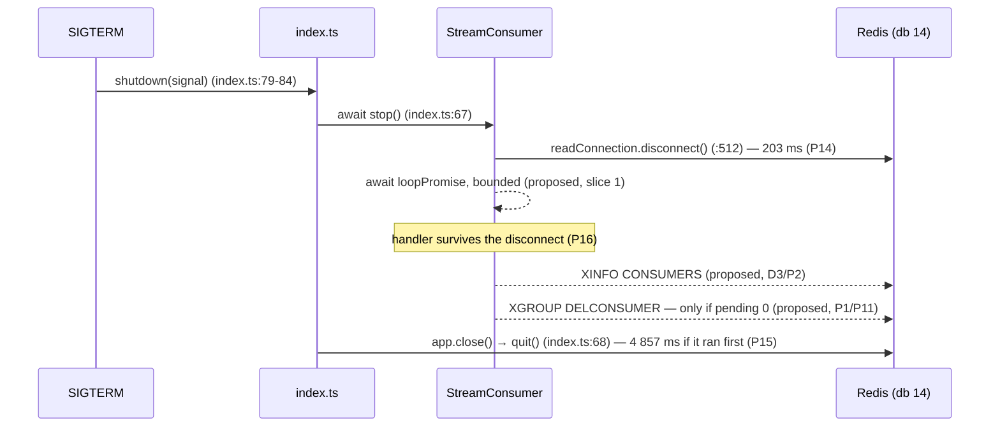

# T-043 · Worker graceful shutdown

**Service:** worker-service · **Base:** `fc66bd3` (T-041), working tree clean ·
**Gate:** 1 (Task Planner) · **Status:** awaiting approval

Line numbers in this document refer to the working tree at **`fc66bd3`** unless stated
otherwise. Probe ids (`P1`…`P16`) refer to Appendix A, all run during this gate against the
live host Redis on the reserved database 14.

---

# Part 1 — For the analyst

## 1. In plain terms

When an operator redeploys or restarts the worker, the worker is told to stop. Today it stops
by hanging up the phone mid-sentence: it interrupts whatever it was reading and exits within a
few milliseconds, without waiting for the work already in its hands to finish, and without
telling the message broker that this instance has gone away.

Nothing is *lost* when that happens — the platform is built so that unfinished work stays
claimable by the next worker — but two things are wrong. Work that was seconds from completion
is thrown back for someone else to redo, after a ten-second delay. And every worker instance
that has ever run leaves behind a permanent registration entry, which nothing removes.

This task makes shutdown orderly: finish the work in hand (up to a time limit, so a stuck job
cannot hold a deploy hostage), then deregister cleanly, then exit.

### The thing that nearly went wrong

The obvious way to deregister — a single "remove this worker" command — **destroys any
unfinished work that worker still holds**, permanently. Measured, not reasoned about
(**P1**): a worker holding two unfinished items was deregistered, and both items became
unreachable to every other worker forever, while still sitting in the stream. That is exactly
the data loss this task's own acceptance criteria forbid, introduced by the task whose purpose
is orderly shutdown.

So the deregistration is **conditional**: it happens only once we can show this worker holds
nothing unfinished.

That guard alone is not enough, and this is the second finding. Every worker instance
currently shares a **single identity** (`worker-1`). Two instances therefore share one
registration entry and one pile of unfinished work, so the guard and the competing instance are
looking at the same row: instance A can check "nothing unfinished", instance B can pick up an
item a millisecond later, and A's deregistration then destroys B's item. Measured end to end
(**P11**). Giving each instance its own identity removes the race by construction (**P12**),
and is the other half of a decision the team already took — see §2.

### What it costs if this is wrong

Getting the guard wrong silently deletes customer usage events that have been received but not
yet billed. There is no alarm and no retry: the events remain visible in the stream while being
invisible to every consumer, so the failure looks like an under-count on an invoice weeks
later. That is the single highest-consequence outcome in this task, and it is why the guard,
not the drain, is the centre of the test plan.

Getting the drain wrong is far cheaper: too short a limit and some work is redone; too long and
a deploy waits. Neither loses data.

## 2. Decisions

### D1 · Consumer identity and deregistration — **settled at Gate 2**

**Answered by the user: option B** — the pending-zero guard **plus** an instance-unique
`REDIS_CONSUMER_NAME` default of `` `${os.hostname()}-${process.pid}` ``.

**Why this is not a shutdown task reaching into startup.** T-039 decision **D3** put this
question here on purpose. Its option **C** was, in its own words, *"B, plus deregistering the
name on graceful shutdown — B, plus shutdown work that belongs to T-043"*, and option **A**
was chosen as *"keep `worker-1`; **revisit in T-043**"*
(`docs/plans/t-039-stream-consumer-loop.md:93`, `:162-189`). The env change is the second half
of a decision already taken and already approved, not new scope. A reviewer looking for the
justification should look there first and at §9 R1 here.

**Why B is the *smaller* correct change, not the larger one.** Under the shared `worker-1`
name, deregistration **does not achieve its purpose even when it is safe**. P7 measured that
the registration row returns on the very next read — so a surviving replica recreates
immediately what the departing one deleted, and D3's accumulating-row leak is not fixed at all.
Option A would therefore have paid the P11 data-loss risk for no benefit. Option B is the only
arrangement in which the deregistration means anything.

**Why `hostname` alone was rejected, and it is a measured reason rather than a stylistic
one.** Two workers on one host collide under a bare hostname — and one host running several
workers is the *local* and *docker-compose* case, i.e. the common configuration rather than an
edge case. Appending the pid makes the identity unique per process.

**The trade B accepts, stated plainly.** The pid changes across a restart, so a worker that
died uncleanly no longer reclaims its own unfinished work under the same name. **Verified that
something else does (P13):** the restarted worker under a new name issues
`XAUTOCLAIM` and recovers both orphaned entries, moving them to the new name's pending list —
and `XREADGROUP … >` does *not* (empty reply), which is why the reclaim path is the one that
matters. T-041's recovery cadence is what makes this ongoing rather than startup-only. The
cost is **latency, not loss**: at the shipped defaults an entry is not claimable until it has
been idle `STREAM_BLOCK_MS × RECOVERY_IDLE_MULTIPLIER` = 10 000 ms, and P13 confirmed a fresh
entry is refused by `XAUTOCLAIM … 10000` and stays pending. That latency already applied to any
crashed worker; B extends it to *restarts of a worker that previously exited uncleanly*.

### D2 · Is the drain timeout a constant or an environment variable? — **my call: constant. Override me if you disagree.**

| Option | Effect | Diff |
|---|---|---|
| **A · A `WORKER_SHUTDOWN.DRAIN_TIMEOUT_MS` constant** *(recommended)* | One value, chosen once | `constants.ts` only |
| B · A `SHUTDOWN_DRAIN_TIMEOUT_MS` env field | Operators tune it against their orchestrator's grace period | Adds `config/env.ts`, `.env.example`, new env-schema cases, and a 13th `WORKER_STREAM_CONSTANTS.` reference that invalidates the counted taxonomy at `constants.ts:128-145` (S-33) |

**Recommended A**, because no operator need has been demonstrated, the repo has no deployment
manifests at all (`ls docker-compose*.yml k8s/ deploy/` → nothing) so there is no grace period
to tune against, and B can be added later without changing any of the logic this task writes.
This is a preference-level decision: it does not change behaviour at the default, only who can
change it. **Recorded rather than asked** because the cost of being wrong is one field.

### D3 · How is the pending count read? — **my call: `XINFO CONSUMERS`**

Rejected `XPENDING <key> <group>`: its summary reply has **two shapes** — P2 showed a
zero-pending group returning a nil breakdown, while P8b showed a populated one returning
`[total, min, max, [[name, count], …]]` — so the predicate becomes "absent from a list that is
sometimes nil", which is an inference rather than a reading. `XINFO CONSUMERS` has one uniform
shape and reports `pending` per name as a number, including zero (P2, P8). The parse mirrors
the reply-shape helpers already in `stream.consumer.ts`.

### Still open for the user before Gate 3

**None.** D1 is settled by the coordinator, D2 and D3 are recorded calls within the planner's
remit. §11 lists what an approver is agreeing to.

## 3. Scope and non-goals

**In scope**

1. A bounded drain of in-flight work inside `StreamConsumer.stop()`.
2. A pending-zero-guarded `XGROUP DELCONSUMER` on clean shutdown.
3. An instance-unique `REDIS_CONSUMER_NAME` default (D1/B).
4. Narrowing the three S-26 scope comments the drain invalidates.

**Non-goals, and what is deliberately left as it is**

- **`bullWorker.close()` is not implemented, and that is correct.** `grep -rn "bullmq"
  --include=package.json .` and `grep -rn "bullWorker\|bullmq" apps packages --include=*.ts`
  both return nothing, so the epic's line would `await undefined.close()`. **Recorded as a
  forward obligation on T-042**, which introduces the BullMQ scheduler and must re-open
  `index.ts`'s shutdown handler to add it. The epic's line is not silently dropped; it is
  reassigned.
- **S-26 is not closed by this task, only narrowed.** The teardown log lines still race
  `process.exit(0)` for any code path that does not go through `stop()`.
- **The epic's five divergences are reported, not filed.** See §10; filing is Gate 4's call.
- **No change to the acknowledgement policy** (T-039 D2-A). The handler still owns `XACK`, and
  `stream.consumer.ts` still acknowledges nothing.
- **`index.ts:158`'s `void streamConsumer.run()` does not change** — see §5 slice 1.

---

# Part 2 — For the implementer

## 4. Files

**Changed**

| File | Change |
|---|---|
| `apps/worker-service/src/events/stream.consumer.ts` | Retain the loop promise; bounded drain and guarded deregistration in `stop()` |
| `apps/worker-service/src/constants.ts` | `WORKER_SHUTDOWN` block; `DEFAULT_CONSUMER_NAME` literal → builder |
| `apps/worker-service/src/config/env.ts` | `REDIS_CONSUMER_NAME` default sourced from the builder |
| `apps/worker-service/.env.example` | Consumer-name line and its comment |
| `apps/worker-service/src/index.ts` | **Comments only** — `:62-66`'s shutdown-ordering note gains the drain |
| `apps/worker-service/tests/stream.consumer.unit.test.ts` | `U73`–`U84`; narrow the S-26 comments on `U14`/`U24`/`U26` |
| `apps/worker-service/tests/env.schema.unit.test.ts` | Rewrite the two T-037 consumer-name assertions; add `U85` |
| `apps/worker-service/tests/index.graceful-shutdown.unit.test.ts` | `U86` |
| `apps/worker-service/tests/stream.consumer.integration.test.ts` | `I28`–`I31` |
| `apps/worker-service/tests/integration.constants.ts` | T-043 fixture block |

**New:** none.

## 5. Implementation slices

### Slice 1 — retain the loop promise, drain it with a bound

**Controlling code path:** `stream.consumer.ts:387-401` (`run()`), `:444-494` (`runLoop()`),
`:510-513` (`stop()`).

`run()` currently awaits `runLoop()` and **retains nothing** — verified, there is no
`loopPromise` field anywhere in the file. Add one, assigned inside `run()`'s `try` and cleared
in a `finally`. `stop()` then sets the flag, disconnects the read connection as it does today,
and awaits the retained promise raced against `WORKER_SHUTDOWN.DRAIN_TIMEOUT_MS`.

**Why the drain belongs in `stop()` and not in `index.ts`.** S-26's fix direction says "await
the loop with a bounded timeout before `process.exit(0)`", and the naive reading of that —
dropping the `void` at `index.ts:158` — was measured as a wide failure. That baseline
(`Tests 10 failed | 2 passed (12)`) is **stale**: the file now holds **14** tests, confirmed by
this gate's run. The direction stands regardless. Putting the drain behind `stop()`, which
`index.ts:67` already `await`s, means `index.ts:158` never changes and the mutation is avoided
**structurally rather than by warning**. `stop()`'s docstring already reserves this
(`:507-508`: *"`async` with nothing awaited today, deliberately: T-043 owns draining in-flight
work on shutdown, and that drain belongs here"*).

**The drain's premise, measured (P16):** disconnecting the read connection does **not** abort
in-flight handler work. An entry was delivered, the read connection was disconnected while the
handler was mid-flight, and the handler completed 302 ms later and acked successfully on the
container's connection (`XPENDING` → 0). Without this the drain would be pointless — it is what
makes "the work in hand" survive long enough to be waited for.

**Falsifiable hypothesis:** awaiting the retained promise in `stop()` makes an in-flight
`dispatch` complete before `stop()` resolves.
**Falsified if** `U73` — whose handler resolves after a delay — observes `stop()` resolving
first.
**Mutation that establishes it:** delete `await this.drain()` from `stop()`; `U73` and `U86`
must go red. If they stay green the drain is decorative and the slice has not landed.

**Second hypothesis:** the bound is real.
**Falsified if** a handler that never settles blocks `stop()` indefinitely.
**Mutation:** replace the timeout race with a bare `await this.loopPromise`; `U74` must go red
(it will time out rather than assert).

Timer hygiene: the losing timer must be cleared, or an `unref`ed handle used, so a fast drain
does not hold the event loop open past `process.exit(0)` — irrelevant in production, where the
exit is explicit, but it is what makes `U74` deterministic under fake timers.

### Slice 2 — pending-zero-guarded `XGROUP DELCONSUMER`

**Controlling code path:** new private method on `StreamConsumer`, called from `stop()` after
the drain resolves.

**Order is the contract, and every step of it is load-bearing:**

1. Drain first. Deregistering before the drain would hit exactly P1 — our own in-flight entries
   are still pending at that moment.
2. Only if the drain **completed**. On a timeout we cannot show what we still hold, so we must
   not delete. Fail closed.
3. Read `XINFO CONSUMERS <stream> <group>` and find our own name (D3).
4. Delete **only** when our row reports `pending === 0`, or when our name is absent entirely
   (P3: a name that consumed nothing leaves no row; P4: deleting an unknown name returns `0`
   and does not error, so the operation is idempotent).
5. Anything else — a non-zero count, an unreadable reply, a failed `XINFO` — logs and skips.
   A lingering registration row is a cosmetic leak; a destroyed pending entry is unrecoverable
   data loss. The asymmetry decides every branch here.

**Error handling, and the S-33-shaped trap in it.** Neither failure mode may throw out of
`stop()` and block shutdown. The two are **not** classifiable by one prefix:

| Situation | Reply | Probe |
|---|---|---|
| Group gone | `NOGROUP No such consumer group '…' for key name '…'` | P5 |
| Stream key gone | `ERR The XGROUP subcommand requires the key to exist. …` | P6 |

`WORKER_STREAM_READ.MISSING_GROUP_ERROR_PREFIX` is `"NOGROUP"` (`constants.ts:368`) and
classifies **only the first**. Its name implies a coverage it does not have — the same shape
S-33 records — so reusing it here without a second constant would silently reclassify a
deleted-key shutdown as an unexpected error. Add a sibling constant with its own probe citation
rather than widening the existing one; widening it would also change how the *read* loop
classifies failures, which is out of scope.

**Falsifiable hypothesis:** the guard prevents the P1 loss.
**Falsified if** a consumer holding pending entries is deregistered anyway.
**Mutation:** remove the `pending === 0` condition and delete unconditionally; `U78` and `I29`
must both go red, and `I29` must go red **by observing `XPENDING` drop to 0** — not merely by
observing that the command was issued.

### Slice 3 — instance-unique consumer-name default

**Controlling code path:** `constants.ts:62` (`DEFAULT_CONSUMER_NAME: "worker-1"`),
`config/env.ts:43`, `.env.example:60`.

Replace the literal with a builder returning `` `${hostname()}-${process.pid}` ``, with the
separator as its own constant. `node:os` in `constants.ts` is safe: `index.ts` imports only
`startup.constants.ts` before `initTracing(...)` (`index.ts:1-2, :18`), and `constants.ts` is
reached through the dynamic imports at `:40-44`.

**Keep the reference count at 12.** `constants.ts:128-145` carries a counted taxonomy —
*"7 as a `.default(...)` … 4 as bounds … 1 as the `.superRefine` message — 7 + 4 + 1 = 12"* —
citing `grep -c 'WORKER_STREAM_CONSTANTS\.' src/config/env.ts` → **12**, re-derived this gate as
**12**. Replacing the member **in place** keeps that at 12 and the docblock true. Adding a
*second* member that `env.ts` also references breaks it, and per S-33 the docblock must then be
corrected **in the same change**, not after. This is the third recorded instance of that
docblock going stale; do not make it the fourth.

**Rewriting the two T-037 assertions:** compute the expected value in the test from `node:os`
and `process.pid` **directly**, not by calling the implementation's builder. A test that calls
the builder keeps agreeing with the builder after the builder changes — the objection the
suite already states for `XAUTOCLAIM_EMPTY_REPLY`
(`index.graceful-shutdown.unit.test.ts:18-20`).

**Falsifiable hypothesis:** the default is unique per process on one host.
**Falsified if** two processes on one host derive the same name.
**Mutation:** drop the pid segment; `U85` — which asserts the name contains `process.pid` —
must go red. Note what this does *not* establish: nothing here proves uniqueness across hosts
with colliding hostnames. State it as "unique per process on a host", which is what is
measured.

### Slice 4 — narrow the S-26 comments and index.ts's ordering note

The identical nine-line scope comment on `U14` (`:955-963`), `U24` (`:1157-1165`) and `U26`
(`:1188-1196`) says the teardown lines are in a race with the exit because *"draining is
T-043's"*. Once the drain lands that clause is false for the `stop()` path. Narrow each to the
paths the drain does not cover, rather than deleting them — the race is genuinely still there
for an unclean exit. Same edit in all three; do not let them drift (S-14/S-19's mechanism).

`index.ts:62-66`'s comment explains `stop()`-before-`close()` with two measured figures. Both
were **re-derived this gate on ioredis 5.11.1 / Redis 7.0.15** and both hold:

| Claim in tree | Re-derived | Probe |
|---|---|---|
| `disconnect()` ends an in-flight `BLOCK 5000` read in ~205 ms | **203 ms**, `Connection is closed.` | P14 |
| `quit()` waits it out — 4 813 ms | **4 857 ms** after issue (5 057 ms total) | P15 |

The ordering rationale is unchanged; the comment needs one clause noting that `stop()` now also
drains, so shutdown duration is bounded by `DRAIN_TIMEOUT_MS` rather than by the ~205 ms
disconnect. **Not re-derived, and marked inherited-and-unverified:** S-26's *"3–6 ms whole
handler"* and *"4 of 5 runs at `STREAM_BLOCK_MS=20`"* tables, and `U25`'s *"three turns, not
one"*. They require nine real SIGTERM process runs and a microtask trace; none is load-bearing
for this diff's correctness, and the drain changes the first of them by construction.

## 6. Sequence

Solid arrows exist at `fc66bd3` and carry their `file:line`. Dashed arrows are **proposed** by
this task and carry the probe that establishes the behaviour.



The two dashed Redis arrows are the whole of slice 2, and the `Note` is why the drain is
worth waiting for rather than a formality.

## 7. Acceptance criteria → tests

Next free ids, checked against the suites rather than assumed: **`U73`**, **`I28`**
(max in tree: `U72` in `env.schema.unit.test.ts`, `I27` in `event.processor.integration.test.ts`).

| AC | Source | Status | Tests |
|---|---|---|---|
| **AC1** Current batch completes before shutdown | epic `:277` | **Already satisfied — needs a test, not implementation** | `U83` |
| **AC2** Nothing lost; mid-transaction rolls back, entry stays in PEL | epic `:278` | **Already satisfied — needs a test, not implementation** | existing `I18`; new `I29` |
| **AC3** In-flight work drains before exit | S-26 fix direction | new | `U73`, `U86`, `I30` |
| **AC4** The drain is bounded | S-26 fix direction | new | `U74` |
| **AC5** A clean shutdown deregisters the consumer | T-039 D3 | new | `U77`, `I28` |
| **AC6** Deregistration never destroys pending entries | **P1** | new | `U78`, `U79`, `U82`, `I29` |
| **AC7** Deregistration failures never block exit | P5, P6 | new | `U80`, `U81` |
| **AC8** Consumer identity is unique per process on a host | D1/B | new | `U85`, rewritten T-037 pair |
| **AC9** `index.ts:158`'s `void run()` is unchanged | S-26 | structural | existing `U25` |

### Why AC1 and AC2 need tests rather than code

**AC1 is already true.** `runLoop`'s shutdown predicate is read **once per read iteration**, at
the bottom of the `do`/`while` (`:485`), *after* `readBatch` has returned — and `readBatch`
awaits `dispatch`, which walks the batch sequentially (`:831-…`). So a predicate that flips
mid-batch cannot truncate the batch; the loop exits at the next iteration boundary. The
docstring records this as T-043's criterion (`:428-431`). What is missing is a case that *pins*
it: `U83` delivers a multi-entry batch, flips the predicate after the first handler, and
asserts **every** handler in the batch still ran.

**AC2 is already true.** Nothing in `stream.consumer.ts` acknowledges anything (T-039 D2-A);
`dispatch` logs a handler rejection against its entry id and continues (`:845-…`). A rolled-back
transaction therefore leaves the entry pending by construction. `I18` covers the failure→pending
half. `I29` adds the half this task puts at risk: that the entry is **still** pending after
`stop()` has run and declined to deregister.

Planning implementation work for either would be planning work that exists.

### Unit cases — `tests/stream.consumer.unit.test.ts`

| Id | Behaviour |
|---|---|
| `U73` | `stop()` does not resolve until an in-flight handler settles |
| `U74` | `stop()` resolves at the bound when the handler never settles, and logs the timeout |
| `U75` | `stop()` before `run()` resolves and issues no Redis command (`loopPromise` null) |
| `U76` | `stop()` twice deregisters at most once |
| `U77` | Deregisters when our row reports `pending 0` |
| `U78` | **Does not** deregister when our row reports `pending > 0`; warns with the count |
| `U79` | Does not deregister when the drain timed out |
| `U80` | A `NOGROUP` reply is logged and does not throw out of `stop()` |
| `U81` | The missing-key `ERR The XGROUP subcommand requires the key to exist…` reply likewise (P6 — the distinct prefix) |
| `U82` | An `XINFO CONSUMERS` failure suppresses the delete and does not throw |
| `U83` | **AC1** — a predicate flipping mid-batch still lets every entry in the batch reach the handler |
| `U84` | The deregistration is issued **after** the drain, by invocation order — not two independent `toHaveBeenCalled()`s |

`U84` is the ordering case, and it must assert invocation order for the reason `U7`/`U25`/`U31`
already do in this repo: two independent call checks pass in either order, and order is the
entire safety property here.

### Integration cases — `tests/stream.consumer.integration.test.ts`, live Redis db 14

| Id | Behaviour |
|---|---|
| `I28` | Pending 0 → `stop()` removes the row from `XINFO CONSUMERS` (P2) |
| `I29` | Pending > 0 → `stop()` leaves the row **and** leaves `XPENDING` unchanged (P1's guard) |
| `I30` | An in-flight handler completes during the drain: entry acked, `XPENDING` 0, row removed (P16) |
| `I31` | Entries orphaned under a previous consumer name are reclaimed by a new name via the recovery pass (P13) |

`I31` is the case that protects D1's accepted trade. Without it, a future change to the recovery
cadence would silently strand every restarted worker's in-flight entries.

**Redis hygiene, non-negotiable.** db **14** is worker's reserved database and `tests/setup.ts`
pins `REDIS_URL` to it — do not override it in the new cases. Every `FLUSHDB` goes through the
existing `flushReservedDb()` helper, which re-asserts `CLIENT INFO` contains `db=14` **on each
call** (`stream.consumer.integration.test.ts:206-216`); never a bare `redis.flushdb()` (S-22).
db 0 holds the real stream (`XLEN telemetry:events` = 2, zero groups) and must not be written
to. New fixture names belong in `integration.constants.ts` alongside the `t038-`/`t039-`/
`t040-`/`t041-` blocks; use a `t043-` prefix and explicit consumer names, as those suites do —
they build `ServiceEnv` by cast with `REDIS_CONSUMER_NAME` set, so slice 3's default change does
not reach them.

### Coverage will not tell you anything — named cases are the only signal

**S-25: 100 % of this diff is outside coverage collection.** `vitest.config.mjs` excludes both
`src/events/**` and `src/**/index.ts`, and `src/constants.ts` and `src/config/env.ts` contain no
executable branches this task adds. **No coverage percentage will move whether this change is
tested or not.** Do not treat a stable coverage number as evidence at any gate. The test list
above is the entire signal, which is why each row states a behaviour rather than a line.

## 8. Validation

Task-scoped, while iterating:

```bash
pnpm --filter @telemetry/worker-service exec vitest run tests/stream.consumer.unit.test.ts
pnpm --filter @telemetry/worker-service exec vitest run tests/env.schema.unit.test.ts
pnpm --filter @telemetry/worker-service exec vitest run tests/index.graceful-shutdown.unit.test.ts
pnpm --filter @telemetry/worker-service exec vitest run tests/stream.consumer.integration.test.ts
pnpm --filter @telemetry/worker-service typecheck
pnpm --filter @telemetry/worker-service lint
```

`pnpm --filter <pkg> test -- <file>` does **not** filter; use `exec vitest run <file>`.

Package gate, then the full gate:

```bash
pnpm --filter @telemetry/worker-service test      # baseline 157/157, 12 files
pnpm build --force && pnpm test --force && pnpm lint --force && pnpm typecheck --force
```

`--force` matters: turbo replays cached results and `13 cached · FULL TURBO` establishes nothing
about the revision under review.

**Baseline measured at this gate**, so a regression is attributable: worker-service
**157 passed (157)**, 12 files, 5.77 s, with Postgres and Redis up as host services.
`index.graceful-shutdown.unit.test.ts` reports **14 tests**.

## 9. Risks

| # | Risk | Severity | Mitigation |
|---|---|---|---|
| R1 | Slice 3 changes a startup contract inside a shutdown task — the one-task-per-commit objection that kept S-8 out of S-4 | MEDIUM | Not opportunistic: T-039 D3-C scoped this pairing into T-043 in advance, and D1 above records the approval. Keep it as its own slice so it can be dropped without unpicking slices 1–2 |
| R2 | The drain masks a hung handler — shutdown looks clean while work is abandoned | MEDIUM | The timeout path logs at WARN **and suppresses the deregistration** (`U79`), so a timed-out drain leaves the row and the pending entries visible to an operator |
| R3 | `DRAIN_TIMEOUT_MS` exceeds an orchestrator's grace period; SIGKILL lands mid-drain | LOW | Nothing is acknowledged until the handler commits, so a SIGKILL mid-drain is exactly today's behaviour — entries stay pending and are reclaimed. Recovery cost only |
| R4 | The P11 race is only *narrowed* if an operator sets `REDIS_CONSUMER_NAME` to the same value on two instances | LOW | `.env.example` already says the name must be unique per instance; slice 3 makes the default satisfy that rather than contradict it. Cannot be closed in code — Redis offers no conditional delete |
| R5 | `U74` flakes under real timers | LOW | Fake timers plus a cleared/`unref`ed handle; never a wall-clock sleep |
| R6 | The S-26 comment narrowing drifts across the three copies | LOW | Identical edit, reviewed together. **Restated at Gate 4:** the check is that the three blocks stay **byte-identical**, not that `grep -c "S-26"` stays at 3 — the narrowed comment names S-26 three times, so the count is 9 and the mention count was only ever a proxy for the drift this row is about |

## 10. Findings to report at Gate 4 — reported here, filed by the reviewer

**F1 · The epic's T-043 snippet (`docs/epics/epic-7-worker-service.md:238-254`) diverges from
the shipped code in five ways.** Same class as S-29 (T-040 section) and S-32 (T-041 section) in
the same file:

1. It logs before setting `shuttingDown`; `index.ts:59-60` sets first, then logs.
2. `"Worker shutting down"` vs the shipped `"Shutting down gracefully"`.
3. `"Worker shutdown complete"` vs the shipped `"Shutdown complete"`.
4. `await bullWorker.close()` — no such dependency exists anywhere in the workspace.
5. No `try`/`catch` and no `exit(1)` path; `index.ts:61-76` has both.

Plus the structural objection S-32 already records for T-041's snippet: it closes over a
module-scope `logger`, `prisma` and `redis`, where every collaborator here is
constructor-injected or reached through `container`. And its **File:** line names only
`src/index.ts`, while the work lands almost entirely in `src/events/stream.consumer.ts`.

**Proposed disposition, left to Gate 4:** extend **S-32** rather than opening a new id — its
title is scoped to the T-041 section, so extending it would make that title false; a new id is
therefore cleaner, but three sibling entries (S-29, S-32, + one) for one file argues for a
single consolidated entry instead. Genuinely a judgement call. **This plan files nothing.**

**F2 · `MISSING_GROUP_ERROR_PREFIX` implies a coverage it does not have** (slice 2, P5/P6).
S-33-shaped. Addressed inside this task by adding a sibling constant rather than widening it.

**F3 · S-26's measured baseline is stale.** It cites `Tests 10 failed | 2 passed (12)`; the file
holds **14** tests. S-33's own pattern occurring inside a gap entry that documents the pattern.
Correct it when S-26 is narrowed.

## 11. Pending-task checklist

- [x] Verify the environment by running commands, not by inference
- [x] Re-derive T-039's D3 probes (P9/P10/P15) — done as P2, P3, P8
- [x] Establish `XGROUP DELCONSUMER` semantics under pending entries — **P1**
- [x] Establish the shared-name race — **P11**, **P12**
- [x] Verify the reclaim path recovers entries orphaned by a pid change — **P13**
- [x] Re-derive the `disconnect()`/`quit()` timing claims — **P14**, **P15**
- [x] Verify the drain's premise (handler survives the read disconnect) — **P16**
- [x] Check every line of the epic snippet against the code — F1
- [x] Confirm next free test ids from the suites — `U73`, `I28`
- [x] Measure the worker-service baseline — 157/157
- [x] Leave the environment as found
- [x] **User approves this plan** ← the gate (2026-09-14, D1 = option B)
- [x] Gate 3 · re-run the load-bearing probes before touching the guard — **P1**, **P11**, **P12**
      reproduced exactly; **P4/P5/P6**, **P14/P15/P16** re-derived
- [x] Gate 3 · slice 3 (instance-unique consumer name) — tests **confirmed red**
      (`expected 'worker-1' to be 'linuxconfig-1604175'`), then implemented
- [x] Gate 3 · slices 1–2 (bounded drain, guarded deregistration) — 12 unit cases **confirmed red**
      against the pre-T-043 `stop()` (`expected [ 'stop' ] to deeply equal []`,
      `XGROUP DELCONSUMER was never issued`), then implemented. **Re-measured at the Gate-4
      rework with `U90` added: 13 red, `U75`/`U79`/`U83` still the only three not red**, plus
      `U86`, `I28` and `I30` — 16 of 86 across the three touched suites
- [x] Gate 3 · `U86` and `I28`/`I30` **confirmed red** against the undrained `stop()`
- [x] Gate 3 · slice 4 — the three S-26 scope comments narrowed against a **measurement**, not a
      claim: without the drain the log at the instant of `process.exit` held neither teardown line
- [x] Gate 3 · re-run the slice mutations in §5 and record which case went red for each — **9
      mutations, all recorded in the report and in the cases' own comments**
- [x] Gate 4 · Senior Reviewer (pre-QA) — **CONDITIONAL**, Round 1; F1 disposed as option A + the
      epic block, F2 and F3 already addressed in the diff
- [x] Gate 4 rework · HIGH-1, MEDIUM-1, MEDIUM-2, MEDIUM-3 (→ S-34), F1 (→ S-35 + epic block),
      LOW-1…LOW-6 and the NITs — all landed, each mutation re-run
- [x] Gate 4 · Round 2 (scoped re-review)
- [x] Gate 5 · QA
- [x] Gate 6 · final review
- [x] Gate 6 rework · `U91` — the drain's **rejection** arm, the one path nothing reached
- [ ] Gate 7 · CI validation · Gate 8 · commit approval

### Gate 3 outcome

**Implemented; Gate-4 Round-1 and Gate-6 rework applied.** worker-service **180/180**, 12 files
(Gate-6 baseline 179, Gate-3 178, original baseline 157). Root gate 13/13 on
`build`/`test`/`lint`/`typecheck`, `0 cached` on each; 14 lint warnings, all pre-existing
(10 @ `d68e719`, 4 @ `b0f6921`, neither file in the diff).

Test ids added: `U73`–`U91` (19) and `I28`–`I31` (4). `U87`, `U88`, `U89`, `U90` and `U91` are
beyond the plan's list; each is recorded in the report and in its own comment with the reason it
exists.

**Five** deviations from the plan, each with its mutation. An earlier revision of this section
said three and omitted the last two — corrected at Gate 4 (LOW-6), which is the S-33 shape
occurring in the plan rather than in a comment:

1. `loopPromise` is **not** cleared in a `finally` (§5 slice 1 said it should be). Clearing it
   makes "never ran" indistinguishable from "ran and finished", which breaks `U75` and would
   deregister a name a bootstrap-only consumer never used. **APPROVED at Gate 4.**
2. An **absent** registry row **skips** the delete rather than issuing it (§5 slice 2 step 4 said
   issue it). Identical end state, one fewer round trip, and it closes the R4 residual where a
   peer creates the row between the read and the delete. `U88` pins it. **APPROVED at Gate 4**,
   and judged the better call.
3. `DEFAULT_CONSUMER_NAME` is a **computed constant**, not a builder function. Keeps
   `src/config/env.ts` textually unchanged, so the counted taxonomy at `constants.ts` stays at
   **12** (re-derived). **APPROVED at Gate 4.**
4. **`DRAIN_TIMEOUT_MS = 3 000`, which §5 did not specify.** Floored by
   `WORKER_STREAM_READ.ERROR_BACKOFF_MS` (1 000): a bound **below** it makes a shutdown
   landing in a failing loop's pause liable to time out (**not** "every time" — measured
   false both ways at Gate 5, QA-1: at a bound equal to the backoff it essentially never times
   out, at 500 ms it timed out at 3 of 4 sampled offsets), and a timed-out drain suppresses the
   deregistration — so the guard would stop deregistering exactly when a worker is unhealthy.
   Pinned from both sides rather than narrated: `U74` asserts the floor, `U50` asserts it stays
   under `CASE_BUDGET_MS`. **APPROVED at Gate 4.**
5. **R6 is superseded, not met.** §9 R6 says `grep -c "S-26"` on
   `tests/stream.consumer.unit.test.ts` must stay at **3**; it is **9** — each of the three
   narrowed comments names S-26 three times. The property R6 exists to protect is *drift between
   the three copies*, and a mention count was only ever a proxy for it. **Restate R6 as: the three
   scope-comment blocks must remain byte-identical.** Verified at Gate 3 and re-verified at Gate 4
   — three blocks, `diff`-clean, three mentions each. **APPROVED on the merits at Gate 4**, with
   the record corrected here.

### Gate 6 rework — `U91`, the drain's rejection arm

**The gap.** `drain()` maps the loop promise through `.then(onFulfilled, onRejected)` and both arms
return `COMPLETED`. Mutating the **rejected** arm to `TIMED_OUT` left the package **179/179
green** — no case reached it. Found at Gate 6.

**Why it is reachable cheaply, and therefore worth a case.** `this.redis.duplicate()` is called
**outside** `runLoop`'s `try`, so a throw there rejects the loop promise rather than being
swallowed — the same seam `U32` exists for. `Promise.race` then settles on an already-rejected arm
in a microtask and the losing timer is cleared, so the case needs no wedged handler, no fake
timers and no wall-clock wait. Measured: `U91` runs in **8 ms**.

**What it pins is the consequence, not the branch.** A rejected drain classified as `TIMED_OUT`
would suppress the deregistration and emit the abandoned-work WARN, so every worker whose loop died
on a bad connection would leak a registry row and report abandoned work it does not hold. That is
the fail-closed direction — the mutation loses a row, it does not destroy an entry — which is why
the gap was LOW.

**Two mutations, because one of them is the isolation check** (line numbers re-derived against the
current tree; `:710` is `onFulfilled`, `:711` is `onRejected`):

| Mutation | Result |
|---|---|
| `onRejected` (`:711`) `COMPLETED` → `TIMED_OUT` | **`U91` alone red** — `XGROUP DELCONSUMER was never issued`; `Tests 1 failed \| 54 passed (55)` |
| `onFulfilled` (`:710`) `COMPLETED` → `TIMED_OUT` | 11 red — `U76 U77 U78 U80 U81 U82 U84 U87 U88 U89 U90` — and **`U91` is not among them** |

The second run is what answers the distinguishability question the coordinator raised: `U91` does
not pass on the fulfilment path, so it cannot be satisfied by the ordinary completed-drain state.
Its two anti-vacuity assertions carry the same load from the other side — `LOOP_FAILED` is written
only by `run()`'s `catch`, and no read is ever issued, so the loop demonstrably rejected rather than
exiting tidily.

### Gate 4 rework (Round 1 → Round 2)

Verdict was **CONDITIONAL**; the engineering was confirmed sound and the Gate-3 redness disclosure
was verified exact (12 red, precisely `U75`/`U79`/`U83` not red). Fixed:

- **HIGH-1** — a measurement attached to the wrong mutation. The three-element log array quoted in
  `known-gaps.md` S-26 and in the three scope comments is what the **pre-T-043** `stop()` produces;
  the drain-removed body yields **four** entries, because the deregistration still runs. Re-measured
  all three bodies (7 / 4 / 3 entries) and labelled each array with the mutation that produces it,
  at all four sites. The conclusion holds under both mutations; only the attribution was wrong.
  Added as a new shape under **S-33**.
- **MEDIUM-1** — `U90` added for the unclassified `XGROUP DELCONSUMER` failure, the branch that
  decides whether a real Redis fault surfaces at ERROR. Two mutations recorded: deleting the
  `catch` (reddens `U80`/`U81`/`U90`) and classifying everything as benign (reddens `U82`/`U90`
  alone, which is the half that pins the *level*). `LOG_MESSAGE.DEREGISTER_FAILED` is no longer
  declared-and-unasserted.
- **MEDIUM-2** — `.env.example`'s commented example is now empty rather than `worker-1`. Measured
  first: a *descriptive placeholder* would have **parsed successfully** and been shared verbatim
  across replicas, so it would have recreated the hole; `""` is rejected by the field's `.min(1)`,
  which is a mechanism rather than a convention.
- **MEDIUM-3 → S-34**, **F1 → S-35** plus a "what T-043 actually shipped" block in
  `docs/epics/epic-7-worker-service.md`, and the `bullWorker.close()` forward obligation recorded
  under that file's T-042 section as well as in S-35.
- **LOW-1** — `U26`/`U35` now assert `disconnect` was called **before** awaiting the run promise,
  so deleting `stop()`'s `disconnect()` reports `expected "spy" to be called at least once` at
  ~3 s instead of `Test timed out in 5000ms`.
- **LOW-2** — the `dispatch`-guard mutation reddens **eleven** cases, not nine; `U37` and `U70`
  added to the list. **LOW-3/LOW-4/LOW-5** — three false comment claims corrected, the
  `index.ts` "bounded by `DRAIN_TIMEOUT_MS`" one included: the two deregistration round trips
  follow the drain **unbounded**, held only by the client's `maxRetriesPerRequest: 2`.
- **NITs** — long lines wrapped, the misplaced `CONSUMER_INFO_*` docblock reattached, the T-043
  cases reordered monotonically (`U73`–`U90`), bare `13`/`0` literals named, `.env.example`'s
  shutdown paragraph given the drain clause, and the epic AC citations corrected below.

## 12. Approval gate

**Approved at Gate 2 on 2026-09-14. Gate 3 (Task Implementer) may proceed.**

D1 was settled by the user (option B: pending-zero guard **plus** an instance-unique
`REDIS_CONSUMER_NAME` default of `${os.hostname()}-${process.pid}`). **D2 and D3 stand as the
planner recorded them** — the drain timeout is a constant rather than an env var, and the pending
count is read with `XINFO CONSUMERS` — both offered for override at approval and neither
overridden. No decisions remain outstanding.

*(Original gate text, for the record.)* **Gate 1 is complete and stops here. No production code
and no tests were written.**

Approving this plan means agreeing to:

1. The bounded drain living in `StreamConsumer.stop()` so that `index.ts:158` never changes.
2. `XGROUP DELCONSUMER` guarded on a pending count of zero, skipped on any doubt — accepting a
   lingering registration row rather than risking the P1 loss.
3. **D1/B as settled:** `REDIS_CONSUMER_NAME` defaults to `` `${os.hostname()}-${process.pid}` ``,
   changing a startup contract and two T-037 assertions, and accepting the reclaim-latency trade
   verified in P13.
4. **D2 (constant, not env var)** and **D3 (`XINFO CONSUMERS`)** as the planner's recorded calls.
5. AC1 and AC2 being served by new tests rather than new code.

**Environment left exactly as found**, verified after the last probe: db 14 back to `DBSIZE 0`
with no `probe:t043:*` keys; db 0 untouched at `DBSIZE 1`, `XLEN telemetry:events` = 2, zero
consumer groups; `git status` clean at `fc66bd3`.

---

# Appendix A — Probe transcripts

All probes run during Gate 1 against the host Redis **7.0.15**, logical database **14**, via
`redis-cli -n 14`; P14–P16 via `node` with **ioredis 5.11.1**. All `probe:t043:*` keys deleted
afterwards.

## P1 — `XGROUP DELCONSUMER` with pending entries destroys them *(load-bearing — re-run this before touching the guard)*

```
XGROUP CREATE probe:t043:p1 g1 $ MKSTREAM   -> OK
XADD x2, XLEN                               -> 2
XREADGROUP GROUP g1 c1 COUNT 10 STREAMS … > -> both entries delivered
XPENDING probe:t043:p1 g1                   -> 2  …664-0  …669-0  c1 2
XINFO CONSUMERS                             -> name c1 pending 2 idle 13

XGROUP DELCONSUMER probe:t043:p1 g1 c1      -> 2
XPENDING probe:t043:p1 g1                   -> 0
XINFO CONSUMERS                             -> (empty)
XAUTOCLAIM probe:t043:p1 g1 c2 0 0-0        -> 0-0  (no entries)
XREADGROUP GROUP g1 c2 COUNT 10 STREAMS … > -> (empty)
XLEN probe:t043:p1                          -> 2   <- still in the stream, unreachable via the group
```

Two entries permanently lost. Contradicts T-043's own AC2.

## P2 / P3 / P4 — the safe cases *(re-derives T-039 P9/P10)*

```
P2  consumer that consumed and ACKED everything:
    XACK                -> 1
    XPENDING            -> 0
    XINFO CONSUMERS     -> name c1 pending 0 idle 19     <- row PERSISTS at pending 0
    XGROUP DELCONSUMER  -> 0
    XINFO CONSUMERS     -> (empty)

P3  consumer whose read returned nothing:
    XINFO CONSUMERS     -> (empty)                       <- no row was ever created
    XGROUP DELCONSUMER  -> 0

P4  DELCONSUMER on a name that never existed:
                        -> 0, no error                   <- idempotent
```

## P5 / P6 — two different error shapes

```
P5  group missing: NOGROUP No such consumer group 'no-such-group' for key name 'probe:t043:p3'
P6  key missing:   ERR The XGROUP subcommand requires the key to exist. Note that for CREATE
                   you may want to use the MKSTREAM option to create an empty stream automatically.
```

`WORKER_STREAM_READ.MISSING_GROUP_ERROR_PREFIX` = `"NOGROUP"` classifies P5 only. F2.

## P7 — deletion is not sticky

```
read as c1 -> DELCONSUMER -> XADD -> read as c1 again
XINFO CONSUMERS -> name c1 pending 1 idle 5
```

The row returns on the next read. This is why option A would not have fixed D3's leak.

## P8 — reclaim moves the PEL row, then deletion is safe *(re-derives T-039 P15)*

```
after dead read         -> name dead pending 2 idle 8
after live XAUTOCLAIM   -> name dead pending 0 idle 24 | name live pending 2 idle 8
DELCONSUMER dead        -> 0
after delete            -> name live pending 2 idle 21
XPENDING total          -> 2      (live still owns them)

P8b XPENDING summary shape: 2 | …677-0 | …682-0 | live | 2
    XINFO CONSUMERS shape:  name live pending 2 idle 39
```

## P11 — the shared-name race: the guard cannot prevent it

```
replica A reads entry a, acks it            -> XACK 1
A's shutdown guard reads pending            -> name worker-1 pending 0     <- "safe to delete"
replica B (SAME name) reads a new entry     -> name worker-1 pending 1
A proceeds with DELCONSUMER                 -> 1                           <- destroyed B's entry
XPENDING after                              -> 0
XAUTOCLAIM from 0-0                         -> (empty)
XLEN                                        -> 2                           <- unreachable via the group
```

The guard and the racing read observe the **same row**, so no check-then-act ordering fixes it.

## P12 — instance-unique names remove the race by construction

```
rows                            -> name worker-aaa pending 0 | name worker-bbb pending 1
A deletes its OWN name          -> 0
rows after                      -> name worker-bbb pending 1
XPENDING after                  -> 1        (B untouched)
```

## P13 — the reclaim path recovers entries orphaned by a pid change

```
worker boots as host-111, reads 2, crashes before acking
    rows                                  -> name host-111 pending 2 idle 6
restart -> new pid -> name host-222:
    XREADGROUP GROUP g1 host-222 … >      -> (empty)      <- '>' never redelivers
    XAUTOCLAIM … host-222 0 0-0           -> both entries returned
    rows after                            -> name host-111 pending 0 | name host-222 pending 2

at the shipped idle threshold (STREAM_BLOCK_MS 5000 x RECOVERY_IDLE_MULTIPLIER 2 = 10000):
    XAUTOCLAIM … host-222 10000 0-0 immediately -> 0-0 (empty; entry too fresh)
    XPENDING                                     -> 1
```

Latency, not loss. D1's accepted trade.

## P14 / P15 — shutdown timing, re-derived (ioredis 5.11.1)

```
P14 disconnect() 200 ms into a BLOCK 5000 read:
    {"ok":false,"ms":203,"msg":"Connection is closed."}          (tree claims ~205 ms — holds)

P15 quit() 200 ms into a BLOCK 5000 read:
    quit() resolved at ms 5057 (waited 4857 after issue)
    read settled: {"ok":true,"ms":5057}                          (tree claims 4 813 ms — holds)
```

## P16 — the drain's premise: a read disconnect does not abort handler work

```
entries delivered                                   -> 1
dup.disconnect()                                    (stop() fires mid-handler)
handler completes 300 ms later, XACK on the
container connection                                -> 1, at ms 302
XPENDING after                                      -> 0
```

## Environment verification

```
redis-cli ping                              -> PONG        (redis_version:7.0.15)
pg_isready                                  -> accepting connections
docker ps                                   -> daemon down (irrelevant: both are host services)
pnpm --filter @telemetry/worker-service test-> Test Files 12 passed (12) / Tests 157 passed (157)
                                               index.graceful-shutdown.unit.test.ts (14 tests)
grep -rn "bullmq" --include=package.json .  -> (no match)
grep -rn "bullWorker\|bullmq" apps packages --include=*.ts -> (no match)
grep -c 'WORKER_STREAM_CONSTANTS\.' apps/worker-service/src/config/env.ts -> 12
max test ids in apps/worker-service/tests   -> U72, I27
```

## Environment left as found

```
redis-cli -n 14 KEYS 'probe:t043:*'         -> (empty)
redis-cli -n 14 DBSIZE                      -> 0
redis-cli -n 0  DBSIZE                      -> 1
redis-cli -n 0  XLEN telemetry:events       -> 2
redis-cli -n 0  XINFO GROUPS telemetry:events -> (empty)
git status --short                          -> (clean)
```
