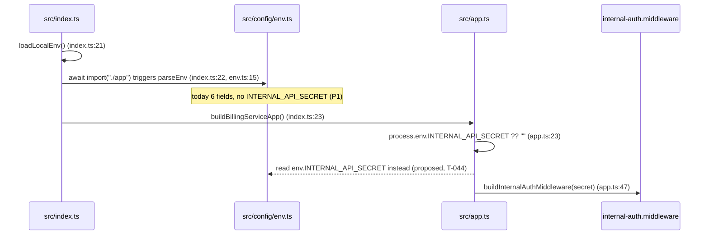

# T-044 · Billing service env schema

**Task**: T-044 (Epic 8 — Billing Service, `docs/epics/epic-8-billing-service.md:36-48`)
**Service**: `billing-service`
**Base commit**: `961d222` (T-043). Working tree clean at the time of writing; **all `file:line`
anchors in this plan refer to that tree.**
**Gate**: 1 (Task Planner). No code and no tests were written. Plan stops at the approval gate.

---

# Part 1 — for the analyst

## 1. In plain terms

billing-service is one of the services that only accepts calls from *inside* the platform. It
proves the caller is internal by comparing a shared secret. Today that secret is picked up as
raw text at startup, with **no checks at all**: a one-character secret starts the service
cleanly, and so does a secret made entirely of spaces. Every other service that uses this
secret checks it; billing is the one that does not. This is recorded as open gap **S-8 item 2**.

This task moves billing's secret into the same validated configuration block the rest of its
settings already live in, so that a service configured with a weak or blank secret **refuses to
start** instead of starting and accepting weak authentication. It also corrects a second, purely
cosmetic mismatch: billing's configuration block claims the service listens on port 3000, while
the service, the container image and the gateway all use 3004.

**Who notices.** Nobody, on a correctly configured system — compose, CI and the checked-in
example file all already carry a 45-, 45- and 37-character secret respectively (all verified,
Appendix P7). An operator running billing with a short, missing or whitespace-only secret
notices immediately, at startup, with a named error — which is the point.

**What it costs if this is wrong.** Two ways it can be wrong. If the validation is too loose,
nothing improves and the gap stays open while looking closed. If it is too tight, billing
refuses to boot on a configuration that used to work — a startup outage, not a data problem, and
visible in the first second of a deploy. One exotic input changes behaviour for real: a secret
padded with non-breaking spaces stops matching (Appendix P6). That is noise an operator can only
create by pasting a secret out of a formatted document, it fails closed with a `401`, and it is
documented in the example file by this task.

**What it does *not* do.** Nothing about pricing, invoices or usage data. No database access, no
migration, no new endpoint. The billing endpoint this secret guards is still the stub shipped
earlier; T-045 builds the real one.

### Where the check moves



Solid arrows are the committed tree at `961d222`, each with the line it comes from. The one
dashed arrow is what this task adds. The picture is the whole change: the secret stops being read
from raw process environment at *app-build* time and starts being read from the validated block
parsed at *module-load* time, which is strictly earlier — `index.ts:22` imports `./app`, which
imports `./config/env`, whose module body calls `parseEnv` (`env.ts:15`).

## 2. Decisions needed from the user

### D1 — Does this task also align usage-service's `INTERNAL_API_SECRET`? *(changes the diff)*

`known-gaps.md` S-8's fix direction says billing should get `.trim().min(...)` and adds: *"Note
usage-service still carries the untrimmed `.min()` form and should be aligned in the same change,
so all three end up identical."* The Gate-0 brief scoped T-044 to billing. Both readings are
defensible; they differ by one file and one suite.

| | A — billing only **(recommended)** | B — billing + usage-service |
|---|---|---|
| Files | billing only | + `apps/usage-service/src/config/env.ts` (one `.trim()`), + 2 cases in `apps/usage-service/tests/env.schema.unit.test.ts` (217 lines today) |
| Validation | billing suite (18 tests today) | + usage-service suite (230 tests, needs live Postgres **and** Redis) |
| Risk | none outside billing | changes the startup contract of the live ingestion service inside a billing task |
| S-8 after | item 2 shrinks to "usage-service only" | item 2 closes entirely |

**Recommendation: A.** The one-task-per-commit rule is the reason S-8 exists as a gap at all — it
was kept out of S-4 on exactly this argument, and T-037 kept billing out of the worker change for
the same reason. Aligning usage-service is a two-line edit whose *risk* is not two lines: it makes
a currently-bootable ingestion configuration unbootable, and it belongs in a commit whose title
says so. If you choose B, the billing slices below are unchanged and Slice 4 is appended.

### D2 — Does the `internalApiSecret` build option stay unvalidated? *(changes the diff)*

`buildBillingServiceApp({ internalApiSecret })` (`app.ts:13-23`) lets a caller pass a secret
directly, bypassing any schema. `tests/smoke.test.ts:18` uses it with the 11-character
`"test-secret"`.

- **A (recommended)** — keep it, and pin it with a test that says out loud that it is the one
  remaining path to a short secret. This is exactly what T-037 did for worker
  (`apps/worker-service/tests/env.schema.unit.test.ts:813`).
- **B** — apply the same minimum to the option. Then `smoke.test.ts` must change its literal, and
  billing's smoke test stops matching worker's and usage-service's.

**Recommendation: A**, for parity with the template service. The option is not operator-reachable:
`src/index.ts:23` calls `buildBillingServiceApp()` with no arguments. Choosing B adds one edit to
`tests/smoke.test.ts` and one more guard; it does not reshape the plan.

### Settled at Gate 0 — recorded, not re-opened

- Scope is the **schema half of S-8 only**. S-8 item 1 (the `!==` comparison at
  `src/middleware/internal-auth.middleware.ts:9`) and item 3 (`preHandler` rather than `onRequest`
  at `app.ts:49`, and the un-`return`ed `reply.send`) stay **open**. Both are request-path
  security changes; folding them into an env-schema task is the objection S-8 itself cites twice.
- `PORT`'s default is corrected to 3004 in this task, because it is one line in the file being
  rewritten (finding F1).
- Q2 (pricing model) is untouched and stays undecided. It gates T-045 step 7, not this task.

## 3. Scope and non-goals

**In scope**

1. `INTERNAL_API_SECRET` added to billing's `EnvSchema` as
   `z.string().trim().min(INTERNAL_AUTH_CONSTANTS.SECRET_MIN_LENGTH)`.
2. `PORT` default 3000 → `BILLING_SERVICE_STARTUP.DEFAULT_PORT` (3004).
3. `app.ts:23` reads the parsed value instead of `process.env`.
4. `HTTP_STATUS_OK` / `HTTP_STATUS_UNAUTHORIZED` added to `BILLING_RESPONSES` so the new tests can
   assert status codes without literals (`.claude/rules/constants.md` applies to tests).
5. A new `apps/billing-service/tests/env.schema.unit.test.ts`, modelled on worker's.
6. `.env.example`, `docs/reviewer-checklist.md:30`, and S-8 in `.claude/rules/known-gaps.md`.

**Deliberately left broken / open**

- **S-8 items 1 and 3** for billing *and* worker — timing-unsafe comparison, `preHandler`
  registration, literal `401` in the middleware. Untouched here; see D-settled above.
- **S-9** — analytics-service still has no internal-auth guard and no `INTERNAL_API_SECRET`.
- **S-23 class divergence remains** after this task: `INTERNAL_API_SECRET` is declared in four
  places with two strictnesses (finding F5). Under D1-A, billing and worker trim; gateway and
  usage-service do not.
- **No repository, no query, no migration.** Which matters for one specific reason: billing's
  `src/repositories/base.repository.ts` is one of S-19's four copies without the
  `set_config('TimeZone','UTC',true)` pin (`grep -c TimeZone` → `0`; the tenant setting is an
  inline literal at `:98`). **S-19/S-18 do not apply to T-044** — it touches no repository and
  binds no timestamp. They apply squarely to **T-045/T-046**, which filter `Invoice.periodStart`
  / `periodEnd` (`prisma/schema.prisma:97-98`, `:125-126`, `@@unique` at `:135`) in a service
  that never received S-18's fix. Handed forward, not addressed.
- **`pnpm format:check`** (S-12) is not run and nothing is reformatted.
- `BILLING_RUNTIME.DEFAULT_PORT` (`constants.ts:22`) and `BILLING_SERVICE_STARTUP.DEFAULT_PORT`
  (`startup.constants.ts:3`) both hold 3004 (finding F7). Left duplicated — worker has the same
  pair, and de-duplicating across five services is its own task.

## 4. Findings against the epic spec and the code

The epic is treated as prose, not contract. Every field in the T-044 block was checked against
`apps/billing-service/src/config/env.ts` at `961d222`.

| # | Finding | Evidence | Disposition |
|---|---|---|---|
| F1 | Epic says `PORT … .default(3004)`; code says `3000`. `constants.ts:22`, `startup.constants.ts:3` and `apps/gateway/.env.example:23` all say 3004. | P1 | **Epic is right, code is wrong.** Fixed here. |
| F2 | Epic writes `INTERNAL_API_SECRET: z.string().min(32)` — a magic number and no `.trim()`. | epic `:47` | **Plan against the code + rules, escalate the prose.** Implement `.trim().min(INTERNAL_AUTH_CONSTANTS.SECRET_MIN_LENGTH)` per S-8 and `constants.md`; the epic block is not edited by this task. |
| F3 | The other six fields match the epic exactly (names, types, defaults). | P1 | No action. |
| F4 | S-8 item 2 is live, not theoretical: billing boots and authenticates with a 5-character secret. | P2 | This task closes it. |
| F5 | `INTERNAL_API_SECRET` is declared four times with two strictnesses — gateway `env.ts:14` and usage `env.ts:14` are `.min()`; worker `env.ts:33` is `.trim().min()`; billing has none. S-23 class. | P8 | Reported. Billing joins the `.trim()` side; D1 decides whether usage moves. |
| F6 | `BILLING_RESPONSES` has no HTTP status constants, so the new tests would need literal `200`/`401`. Worker added `HTTP_STATUS_OK`/`HTTP_STATUS_UNAUTHORIZED` in T-037 for this reason (`apps/worker-service/src/constants.ts:38-40`). | read | Added in Slice 1. Middleware keeps its literal `401` — that is S-8 item 3's to adopt. |
| F7 | `DEFAULT_PORT` 3004 is defined twice in billing. | read | Noted, not fixed. |
| F8 | `app.ts:34`'s blank-secret guard (`InternalApiSecretMissingError`) is referenced by no billing test. | grep over `apps/**/*.ts` | Covered by AC10. |

---

# Part 2 — for the implementer

## 5. Files to change

**Modified**

| File | Change |
|---|---|
| `apps/billing-service/src/config/env.ts` | add `INTERNAL_API_SECRET`; `PORT` default from `BILLING_SERVICE_STARTUP.DEFAULT_PORT`; import `INTERNAL_AUTH_CONSTANTS` and the startup constant |
| `apps/billing-service/src/constants.ts` | add `HTTP_STATUS_OK: 200`, `HTTP_STATUS_UNAUTHORIZED: 401` to `BILLING_RESPONSES` |
| `apps/billing-service/src/app.ts` | line 23: `process.env.INTERNAL_API_SECRET ?? ""` → `env.INTERNAL_API_SECRET` |
| `apps/billing-service/.env.example` | comment the `INTERNAL_API_SECRET` line (line 20) with the requirement and the trim; the value itself is already 37 chars and stays |
| `docs/reviewer-checklist.md` | line 30, billing row, middle column → `yes (env schema, T-044)` |
| `.claude/rules/known-gaps.md` | S-8 item 2: remove billing, keep usage-service's untrimmed form (D1-A) or close item 2 (D1-B); refresh the `app.ts:23` citation |

**New**

| File | Purpose |
|---|---|
| `apps/billing-service/tests/env.schema.unit.test.ts` | the whole test surface for this task |

**Not touched:** `src/middleware/internal-auth.middleware.ts`, `src/errors/index.ts`,
`src/repositories/**`, `prisma/**`, any other service (under D1-A).

## 6. Implementation slices

Pseudo-TDD: write `tests/env.schema.unit.test.ts` with **all** cases first, confirm red per case
with the reason, then implement Slice 1 → 2 → 3.

### Slice 1 — declare the field and fix the port

*Controlling code path:* `apps/billing-service/src/config/env.ts:4-11` (the `z.object`), consumed
by `parseEnv` at `:15` (`packages/shared-config/src/index.ts:6-17`, which throws on failure).

*Edit:* add
`INTERNAL_API_SECRET: z.string().trim().min(INTERNAL_AUTH_CONSTANTS.SECRET_MIN_LENGTH)` and change
`PORT`'s default to `BILLING_SERVICE_STARTUP.DEFAULT_PORT`. Mirror worker's comment discipline
(`apps/worker-service/src/config/env.ts:9-33`) but do **not** copy its header-stripping paragraph
verbatim — re-derive or cite P6 below, which measured it for billing's actual caller.

*Hypothesis H1:* **`.trim()` placed before `.min()` is what rejects an all-whitespace secret; the
reverse order does not.**
*Falsified if:* reordering to `z.string().min(SECRET_MIN_LENGTH).trim()` leaves
`"rejects an all-whitespace INTERNAL_API_SECRET at the minimum length"` green. Measured
independently of this repo's code in P4: with 32 spaces, `.min(32)` → accepted verbatim,
`.trim().min(32)` → rejected, `.min(32).trim()` → **accepted, parsed to `""`**. The implementer
must run the reorder against the real schema and record the named test going red; if it does not
go red, H1 is refuted and the plan's justification for the ordering is wrong.

*Hypothesis H2:* **the length minimum is unenforced today** — falsified if a 31-character
`INTERNAL_API_SECRET` already fails billing's schema before the edit. P1 and P2 say it does not
(the field is absent from the parsed object entirely, and a 5-character secret boots).

### Slice 2 — read the parsed value in `app.ts`

*Controlling code path:* `apps/billing-service/src/app.ts:23`, whose result is passed to
`buildInternalAuthMiddleware` at `:47`.

*Edit:* `const internalApiSecret = options.internalApiSecret ?? env.INTERNAL_API_SECRET;`
(`env` is already imported at `app.ts:3`). Keep the `options` arm (D2-A) and keep the blank-secret
throw at `:34-36` — after this change the env arm can no longer produce a blank value, so the
guard covers the option arm only. Say that in the comment; do not claim it is unreachable.

*Hypothesis H3:* **the declaration is decoration unless `app.ts` reads it.**
*Falsified if:* AC8's test passes with `app.ts:23` left as `process.env.INTERNAL_API_SECRET ?? ""`.
P2 establishes today's behaviour directly: after mutating `process.env.INTERNAL_API_SECRET`
post-module-load, a freshly built app authenticated the **new** value (200) and rejected the old
one (401). AC8 asserts the inverse, so it must be red before this edit and green after — this is
the single test that distinguishes a real fix from a comment. (T-037's equivalent, AC12, was the
one case that stayed red after its schema change.)

### Slice 3 — documentation and gap accounting

*Edits:* `.env.example` line 20 comment; `docs/reviewer-checklist.md:30`; S-8 in
`.claude/rules/known-gaps.md`.

*Hypothesis H4:* **nothing that must boot today stops booting.** *Falsified if:* any of the four
supply paths carries a secret under 32 characters after trimming. Measured (P7):
`docker/docker-compose.yml:112` → 45, `.github/workflows/ci.yml:34` → 45,
`apps/billing-service/.env.example:20` → 37, `apps/billing-service/tests/setup.ts:12` → 45. An
operator's untracked local `.env` is outside this check — that is the residual, and it is why the
`.env.example` comment is part of the change rather than a nicety.

No test asserts documentation. Stated so the reviewer does not look for one.

### Slice 4 — *only if D1-B is chosen*

Add `.trim()` to `apps/usage-service/src/config/env.ts:14`, add the all-whitespace and
padded-value cases to `apps/usage-service/tests/env.schema.unit.test.ts` (which already has an
`INTERNAL_API_SECRET` block from S-4), and close S-8 item 2 outright. Validation gains
`pnpm --filter @telemetry/usage-service test` — live Postgres and Redis required.

## 7. Test plan and acceptance-coverage mapping

New file `apps/billing-service/tests/env.schema.unit.test.ts`, mirroring
`apps/worker-service/tests/env.schema.unit.test.ts` in structure: a `buildBaseEnv()` fixture, a
`buildEnvWithout(key)` helper that **throws** if the key is absent from the fixture, an
`expectIssueOn(parsed, field)` helper, and `afterEach` restoration of
`process.env.INTERNAL_API_SECRET` plus `vi.resetModules()`.

**Test ids.** Checked, not assumed: billing's four existing suites use no id scheme at all
(`grep` for `"[A-Z][0-9]+ - "` across `apps/*/tests` matches **worker-service only** — U1–U91,
I1–I31 — and usage-service uses file-local `A*`/`B*` prefixes). T-044 therefore introduces no new
series and does **not** consume worker's U-numbers (next free there is U92). It uses `AC` tags in
comments with descriptive `it()` titles, exactly as worker's env suite does.

| AC | Behaviour | Test(s) | Red before? |
|---|---|---|---|
| AC1 | `INTERNAL_API_SECRET` is required with no default | `rejects an env with no INTERNAL_API_SECRET` | yes — field absent today (P1) |
| AC2 | rejects empty, and one character below the minimum | `rejects an empty INTERNAL_API_SECRET`; `rejects an INTERNAL_API_SECRET one character below the shared minimum` | yes |
| AC3 | rejects `SECRET_MIN_LENGTH` whitespace characters | `rejects an all-whitespace INTERNAL_API_SECRET at the minimum length` | yes. Also the H1 mutation target |
| AC4 | a padded valid secret parses to the trimmed value | `strips surrounding whitespace from an otherwise valid INTERNAL_API_SECRET` | yes |
| AC5 | accepts exactly at `INTERNAL_AUTH_CONSTANTS.SECRET_MIN_LENGTH` (imported, not `32`) | `accepts an INTERNAL_API_SECRET exactly at the shared minimum length` | yes |
| AC6 | module load fails fast when absent; loads when present | `fails fast at module load when INTERNAL_API_SECRET is absent`; `loads at module load when INTERNAL_API_SECRET is present` | yes |
| AC7 | `PORT` defaults to the port `index.ts:56` binds (3004) | `defaults PORT to the port index.ts binds` | yes — default is 3000 today (P1) |
| AC8 | `app.ts` uses the parsed secret, not `process.env` | `authenticates with the parsed secret after process.env.INTERNAL_API_SECRET is mutated` — old secret → `HTTP_STATUS_OK`, new secret → `HTTP_STATUS_UNAUTHORIZED` + `{ code: CODE_UNAUTHORIZED }` | yes — P2/P3 show today's behaviour is the inverse |
| AC9 | an explicit `internalApiSecret` option still wins (D2-A) | `still lets an explicit internalApiSecret option override the parsed value` | no — pre-existing behaviour, labelled a regression guard, not counted as red |
| AC10 | a blank/whitespace option still throws `InternalApiSecretMissingError` | `rejects a blank internalApiSecret option` | no — pre-existing guard (F8), first coverage |
| AC11 | the other five fields still parse and still reject when missing | `rejects an env with no DATABASE_URL` / `REDIS_URL` / `OTEL_EXPORTER_OTLP_ENDPOINT` | no — regression guards |

Notes for the implementer:

- AC8's test builds a real Fastify app and uses `app.inject`; it must touch neither Postgres nor
  Redis. The container's ioredis client is `lazyConnect` (`src/config/container.ts:22-26`) and
  nothing calls `connect()`. `await app.close()` in a `finally`. P3 ran exactly this shape against
  the committed source with `REDIS_URL` pointed at a closed port and no connection was attempted.
- Do **not** use `app.inject` to test the trim: injection bypasses the HTTP parser. Assert the
  schema's output value directly (AC4). What the wire does to padding is P6, and it is the
  `.env.example`'s subject, not a test's.
- Route and header must come from `BILLING_ROUTES.INTERNAL_BILLING_GENERATE` and
  `BILLING_HEADERS.INTERNAL_SECRET`; statuses from the new `BILLING_RESPONSES.HTTP_STATUS_*`.
- Baseline to beat: billing is **4 files / 18 tests, all passing** (P5). Report the new total.

## 8. Validation commands

Task-scoped first:

```bash
pnpm --filter @telemetry/billing-service exec vitest run tests/env.schema.unit.test.ts
pnpm --filter @telemetry/billing-service test
pnpm --filter @telemetry/billing-service typecheck
pnpm --filter @telemetry/billing-service lint
pnpm --filter @telemetry/billing-service build
```

Neighbours that could be disturbed (billing's constants are imported nowhere else, but
`shared-types` is shared and the gateway holds billing's URL):

```bash
pnpm --filter @telemetry/gateway test
```

Full gate before handoff, `--force` so turbo re-runs rather than reprints:

```bash
pnpm build --force && pnpm test --force && pnpm lint --force && pnpm typecheck --force
```

`pnpm test` needs live Postgres and Redis (`.claude/rules/testing.md`). Both are up as host
services. `pnpm format:check` is **not** run (S-12).

## 9. Risks and mitigations

| # | Risk | Severity | Mitigation |
|---|---|---|---|
| R1 | A secret padded with whitespace the HTTP parser does **not** strip (U+00A0 measured) matches today and stops matching after the trim → `401`. | LOW | Fails closed and visibly. P6 measured that SP and HTAB padding *is* stripped in transit by both undici (the stack `@fastify/http-proxy` uses) and a raw socket, so ordinary padding is unaffected. Documented in `.env.example`. |
| R2 | Startup now fails on a missing/short secret where it previously succeeded. | MEDIUM by blast radius, LOW by likelihood | All four checked-in supply paths verified ≥32 after trim (P7). An untracked local `.env` is the residual; `.env.example` gains the requirement. |
| R3 | `turbo.json`'s `test` task declares no `env` passthrough, so a CI-level `INTERNAL_API_SECRET` may not reach vitest. | LOW | Not a new exposure: `tests/setup.ts:12` sets it with `??=` (45 chars), which is why the suite parses a now-required field. Implementer must confirm the full `pnpm test` gate green, not just the filtered run. |
| R4 | The parse now happens at module load, earlier than the old app-build read. | LOW | `src/index.ts:21-22` calls `loadLocalEnv()` **before** `await import("./app")`, precisely so a local `.env` is in `process.env` first. Unchanged by this task; stated because a reviewer will ask. |
| R5 | Scope creep into S-8 items 1/3 while inside this file's neighbourhood. | MEDIUM | `internal-auth.middleware.ts` is on the do-not-touch list; the new status constants are added but deliberately not adopted by the middleware. |
| R6 | S-19/S-18 in billing. | not this task | Explicitly handed to T-045/T-046 (§3). |
| R7 | Copying worker's comments verbatim would import claims measured for worker's caller, not billing's. | LOW | P6 re-measured the transport question against undici; anything not re-measured must be marked inherited. |

## 10. Pending task checklist

- [done] Gate 1 approval, with D1 and D2 answered — D1 = A, D2 = A
- [done] Write `tests/env.schema.unit.test.ts` in full; run; record red/green per case with reasons
      — 16 cases, first run **12 failed / 4 passed** against `961d222`'s source
- [done] Slice 1 — schema field + `PORT` default + `BILLING_RESPONSES` status constants
- [done] Run the H1 mutation (`.min().trim()` order) and record which named test goes red
      — H1 **confirmed**: the reorder turns `rejects an all-whitespace INTERNAL_API_SECRET at the
      minimum length` and `rejects an INTERNAL_API_SECRET that reaches the minimum only by its
      padding` red, while `strips surrounding whitespace …` stays green under both orders. The
      bare `.min(...)` form (usage/gateway's) turns all three red.
- [done] Slice 2 — `app.ts`; AC8 was the **only** test still red after Slice 1 (`expected 401 to
      be 200`) and flipped green on this edit alone. H3 confirmed.
- [done] Slice 3 — `.env.example`, `docs/reviewer-checklist.md:30`, S-8 in `known-gaps.md`
- [n/a] Slice 4 only if D1-B — D1 = A, usage-service untouched
- [done] Task-scoped validation, then full 13-package gate with `--force` — 13/13 on
      build/test/lint/typecheck, 0 cached
- [done] Report new billing test count against the 18-test baseline — **5 files / 34 tests**
      (was 4 / 18); the 14 lint warnings are pre-existing (10 @ `d68e719`, 4 @ `b0f6921`), neither
      file in this diff
- [done] Gate 3 handoff → Senior Reviewer (pre-QA)
- [done] Gate 5 QA follow-up — replace the constant-vs-constant port assertion (dead once
      `BILLING_RUNTIME.DEFAULT_PORT` was derived at Gate 4) with `pins DEFAULT_PORT to the port
      every deploy artifact publishes`, reading `.env.example` and `docker/docker-compose.yml`
      at test time. QA option C. Four sites pinned: `.env.example` `PORT`, compose
      `environment.PORT`, both halves of the `"3004:3004"` mapping, and gateway's
      `BILLING_SERVICE_URL`. Proved red three ways — startup constant → 9999
      (`expected '3004' to be '9999'`, 1 failed / 34 passed), `.env.example` key renamed
      (locator throws, `found 0`), mapping duplicated (locator throws, `found 2`). Stale comment
      on the surviving assertion corrected. Billing now **5 files / 35 tests**.
- [done] Gate 6 M-1 — fifth locator added to the same case (count stays 35): gateway's
      `apps/gateway/.env.example` `BILLING_SERVICE_URL`, which the reviewer mutated to 9999 for
      billing 17/17 and gateway 38/38 green. Now red on that mutation
      (`expected '9999' to be '3004'`), and loud in both directions (`found 0` on a renamed key,
      `found 2` on a duplicated line), each message naming `apps/gateway/.env.example` rather
      than billing's. The sixth copy of the number, `apps/billing-service/tests/setup.ts`, is
      documented in the case as deliberately unpinned: a test fixture, not a deploy artifact,
      and nothing reads `env.PORT`.

## 11. Approval gate

**Approved at Gate 2 on 2026-09-15. Gate 3 (Task Implementer) may proceed.**

Both open decisions were answered as recommended: **D1 = A** (billing only; usage-service's
untrimmed `.min()` stays open under S-8, because reaching into another service's startup contract
from a billing env task is the move S-8 twice declined) and **D2 = A** (keep
`buildBillingServiceApp({ internalApiSecret })` and pin it with a test, mirroring worker-service —
`tests/smoke.test.ts:18` passes an 11-character value, so removing the option would break a suite
this task does not own). Settled earlier at Gate 0: the schema half of S-8 only, the `PORT` default
fixed here, and nothing pricing-shaped (Q2 stays deferred and blocks T-045, not this).

*(Original gate text, for the record.)* **Planning stopped here. No production code and no tests
were written; the only file created is this plan.** The repository is unchanged at `961d222`
(`git status --porcelain` empty after all probes).

Implementation may not begin until the user approves this plan **and answers D1 and D2**. D1
decides whether `apps/usage-service/src/config/env.ts` is in the diff; D2 decides whether
`tests/smoke.test.ts` is. Everything else is settled.

---

# Appendix — probe transcripts

All probes were read-only. They ran against `961d222`, used ephemeral ports, and touched neither
Postgres nor Redis. Post-probe state confirmed: `redis-cli -n 0 XLEN telemetry:events` → `2`,
`XINFO GROUPS telemetry:events` → empty, `DBSIZE` → `1`; `git status --porcelain` → empty. The
environment was left as found. Scratch files live in the session scratchpad, not in the repo.

### P1 — billing's compiled schema, as committed

```
$ DATABASE_URL=… REDIS_URL=… OTEL_EXPORTER_OTLP_ENDPOINT=… INTERNAL_API_SECRET=z \
  node --input-type=module -e 'import("…/apps/billing-service/dist/src/config/env.js") …'
parsed env keys: NODE_ENV, PORT, DATABASE_URL, REDIS_URL, OTEL_EXPORTER_OTLP_ENDPOINT, LOG_LEVEL
PORT default    : 3000
INTERNAL_API_SECRET on parsed env: undefined
safeParse with 1-char secret: true  NODE_ENV,PORT,DATABASE_URL,REDIS_URL,OTEL_EXPORTER_OTLP_ENDPOINT,LOG_LEVEL
```

Six fields, `PORT` 3000, and a one-character secret parses because the field does not exist.
`dist/src/config/env.js` was verified to match `src/config/env.ts` line for line.

### P2 / P3 — the app's secret read site (tsx, against `src/`, not `dist/`)

```
$ DATABASE_URL=postgresql://x REDIS_URL=redis://127.0.0.1:6399 … INTERNAL_API_SECRET=short \
  apps/billing-service/node_modules/.bin/tsx <scratch>.mts
P1 built with INTERNAL_API_SECRET='short' (5 chars) -> 200
P2 after process.env mutation, header=NEW value     -> 200
P3 after process.env mutation, header=OLD value     -> 401 {"code":"UNAUTHORIZED"}
```

Line 1 is S-8 item 2, live. Lines 2–3 are the read-site behaviour AC8 inverts. `REDIS_URL` pointed
at a closed port and nothing errored, which also confirms the lazy client never connects during
`buildBillingServiceApp()` + `app.inject`.

### P4 — `.trim()` ordering (zod 3.25.76, the version billing resolves)

```
input 32 spaces  [raw len 32]
  .min(32)         OK   -> "                                " (len 32)
  .trim().min(32)  FAIL -> String must contain at least 32 character(s)
  .min(32).trim()  OK   -> "" (len 0)

input 32 tabs  [raw len 32]        .min(32) OK   .trim().min(32) FAIL   .min(32).trim() OK -> "" 
input 32 NBSP  [raw len 32]        .min(32) OK   .trim().min(32) FAIL   .min(32).trim() OK -> ""
input "  <31 core>  " [len 35]     .min(32) OK -> len 35   .trim().min(32) FAIL   .min(32).trim() OK -> len 31
input "  <32 core>  " [len 36]     .min(32) OK -> len 36   .trim().min(32) OK -> len 32 (trimmed)
input "<31 core>"     [len 31]     all three FAIL
```

Three whitespace forms, not one. Two consequences: `.min()` alone accepts an all-whitespace secret
(S-8's claim, re-derived rather than repeated), and **order matters** — `.min(32).trim()` accepts
32 spaces and yields `""`, and accepts a 31-character core padded to 35. `String.prototype.trim()`
removes U+00A0 (`JSON.stringify(" ".repeat(32).trim())` → `""`).

### P5 — billing baseline

```
$ pnpm --filter @telemetry/billing-service test
 Test Files  4 passed (4)
      Tests  18 passed (18)
```

### P6 — what reaches billing when the secret is padded

Fastify 5.10.0 server on an ephemeral port, echoing the received `x-internal-secret`; clients were
undici 7.29.0 (the stack `@fastify/http-proxy` → `@fastify/reply-from` uses) and a raw
`net.Socket`.

```
undici exact core    status 200  arrived: <32-core>                 equalsTrimmed=true
undici SP-padded     status 200  arrived: <32-core>                 equalsTrimmed=true
undici HTAB-padded   status 200  arrived: <32-core>                 equalsTrimmed=true
undici NBSP-padded   status 200  arrived: U+00a0<32-core>U+00a0     equalsTrimmed=false
socket exact core    status 200  arrived: <32-core>                 equalsTrimmed=true
socket SP-padded     status 200  arrived: <32-core>                 equalsTrimmed=true
socket HTAB-padded   status 200  arrived: <32-core>                 equalsTrimmed=true
socket NBSP-padded   status 200  arrived: U+00c2U+00a0<32-core>…    equalsTrimmed=false
```

Scope of the claim: four padding forms, two client stacks, one server (fastify 5.10.0 on this
host). SP and HTAB padding was stripped in every case measured; U+00A0 survived (and over the raw
socket its UTF-8 bytes arrived decoded as latin-1, a second way to not match). This is why R1 is
LOW rather than absent, and it is measured for **billing's** transport rather than inherited from
worker's `env.ts` comment.

Relevant only once a gateway-proxied route is guarded: `GATEWAY_PROXY_PREFIXES.BILLING` is
`/v1/billing` (`apps/gateway/src/constants.ts:36`) and the proxy sets `x-internal-secret` on every
proxied request (`apps/gateway/src/plugins/proxy.plugin.ts:33-36`), while billing's only guarded
route today is `/v1/internal/billing/generate`, which that prefix does not cover.

### P7 — every checked-in supply path for the secret

```
 37  apps/billing-service/.env.example:20   dev-local-secret-change-in-production
 45  apps/billing-service/tests/setup.ts:12 test-internal-api-secret-change-in-production
 45  .github/workflows/ci.yml:34            ci-internal-api-secret-with-at-least-32-chars
 45  docker/docker-compose.yml:112          ci-internal-api-secret-with-at-least-32-chars
 11  apps/billing-service/tests/smoke.test.ts:18  test-secret   (build-option path, D2)
```

All four operator paths clear 32 after trimming. The 11-character one is the `options` override,
which by design does not go through the schema (D2).

### P8 — `INTERNAL_API_SECRET` declarations across the workspace

| Site | Declaration |
|---|---|
| `apps/gateway/src/config/env.ts:14` | `z.string().min(INTERNAL_AUTH_CONSTANTS.SECRET_MIN_LENGTH)` |
| `apps/usage-service/src/config/env.ts:14` | `z.string().min(INTERNAL_AUTH_CONSTANTS.SECRET_MIN_LENGTH)` |
| `apps/worker-service/src/config/env.ts:33` | `z.string().trim().min(INTERNAL_AUTH_CONSTANTS.SECRET_MIN_LENGTH)` |
| `apps/billing-service/src/config/env.ts` | **absent** (P1) |
| `apps/analytics-service/src/config/env.ts` | **absent** (S-9) |

`INTERNAL_AUTH_CONSTANTS.SECRET_MIN_LENGTH` is `32`
(`packages/shared-types/src/index.ts:92-94`); `parseEnv` throws on the first issue
(`packages/shared-config/src/index.ts:9-14`).
