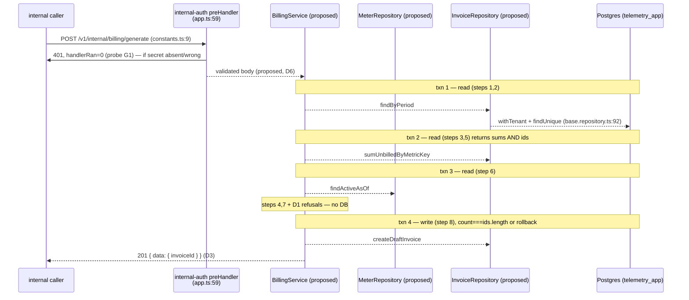

# T-045 · Internal metering endpoint — `POST /v1/internal/billing/generate`

**Service**: `billing-service` · **Epic**: `docs/epics/epic-8-billing-service.md` (T-045, `:52-77`)
**Base**: `7f359db` (T-044, billing-service env schema) · working tree clean
**Every `file:line` in this plan refers to that tree.** Every measurement was taken on it, on this
host (PostgreSQL 16.13, Node 22.22.2, fastify 5.10.0, @prisma/client 6.19.3, zod 3.25.76).

**Status**: Gate 1 output. Awaiting approval. No production code, no tests, no commits.

---

# Part 1 — For the analyst

## 1. In plain terms

Billing can produce an invoice today only in the sense that a doorbell produces a meal. The
endpoint exists, it checks the shared service password, and it answers `accepted`. It creates
nothing. This task makes it real.

What changes: an internal caller — a scheduler, an operator, eventually the billing cron — names
a customer and a billing period. The service adds up that customer's unbilled metered usage for
the period, prices each metric against the rate card in force at the start of the period, writes
a draft invoice with one line per metric, and stamps the usage records as billed so they cannot
be charged twice. Calling it again for the same customer and period returns the same invoice
rather than a second one.

Who notices: nobody outside yet. This endpoint is not reachable from the internet — the gateway
forwards `/v1/billing` and has no route for `/v1/internal`, verified at
`apps/gateway/src/constants.ts:33-36`. The invoice this produces is what the customer-facing
screens in Epic 11 will read, through T-046 and T-047, which are not in this task.

What it costs if this is wrong, in descending order of how much it would hurt:

- **Money quietly missing.** An invoice that omits a metric still looks like a finished invoice.
  Nobody audits a document that balances. This is why we chose to refuse rather than to
  improvise — see decision **D1** below.
- **Money charged twice.** Usage marked billed by an invoice that then failed to commit, or not
  marked at all by one that did.
- **A customer's data in another customer's invoice.** The platform's core invariant. See
  section 3, which is the one place in this plan where we are knowingly building on ground the
  database does not defend.

The work is a controller, a service, two repositories, a request validator and one write
transaction. It is the largest single slice in `billing-service` to date; the comparable
usage-service slice is roughly 543 lines of source.

## 2. Decisions

### Settled at Gate 0 — not re-opened here

**Q2 — pricing model: flat only for v1.** `amount = summedQuantity × unitPrice`.
`Meter.tierJson` (`prisma/schema.prisma:113`) stays `null` and unread: no Zod schema for it, no
tier evaluation, no tier tests. Epic step 7 (`:70`) reads *"flat: `quantity × unitPrice`; tiered:
evaluate `tierJson`"*; only the first arm is in scope.

**The tiered path is deferred, not forgotten.** It is deferred for a reason that a later task must
confront rather than infer: *graduated* and *volume* tiering give **different totals for the same
input and the same tier table*. Graduated charges each band's rate on the quantity falling in that
band; volume charges the whole quantity at the band the total lands in. The `tierJson` column
records neither, so a later implementer reading the column cannot recover which was intended. That
is a pricing product decision and must be answered before code, not during it. Q2 is marked
**decided** in `docs/epics/README.md` by this task (slice S0), the way T-041 did for Q10 — S-15's
standing complaint is that settled gates never get recorded, and Q5 is still unmarked as proof.

**Q3 — UTC period boundaries, assumed not decided.** `docs/epics/epic-8-billing-service.md:14`
says "midnight UTC assumed until Q3 is answered". This plan uses that assumption and writes it
down rather than inheriting it silently: **`periodStart` and `periodEnd` are instants supplied by
the caller and compared in UTC**, and this task introduces no local-midnight logic anywhere. Note
a documentation disagreement worth resolving outside this task: `docs/epics/README.md`'s decision
table scopes Q3 to **Epic 9**, while `epic-8-billing-service.md:9-14` claims it for Epic 8 too.
Neither is authoritative over the other today. This task does not resolve it; it is listed in
§9 as a follow-up.

### Answered at Gate 1 — these shape the plan

#### D1 — Unpriceable usage refuses the whole request (`422 METER_NOT_FOUND`)

If any `metricKey` with unbilled usage in the period has no active `Meter` as of `periodStart`,
the request fails with `422 METER_NOT_FOUND` naming the offending keys. **No invoice is created
and no `UsageLine` is marked billed.** The same treatment applies to the currency sibling: if the
matched meters disagree on `currency`, reject with `422 METER_CURRENCY_CONFLICT` rather than pick
one, because `Invoice.currency` (`prisma/schema.prisma:129`) is a single column and any choice
would be silently wrong.

*Why revenue-safety beats self-healing here.* The rejected alternative was to skip unmetered
metrics, invoice the rest, and leave those lines `billed = false` for a later run. It is more
forgiving and it is worse, because an invoice that silently omits a metric is money quietly
missing from a document that looks complete — and nothing downstream is built to notice. A
refusal is money visibly missing from a queue, which somebody fixes.

*And this path is reachable on day one, not exotic.* `metricKey` is the bare `eventType` — worker
T-040 decision D1, `apps/worker-service/src/validators/stream-message.validator.ts:261` — so a
tenant that starts emitting a new event type produces unpriceable usage immediately, with no
schema change and no deploy. Measured on this tree: `Meter` is at **0 rows**, and the only thing
that would create any is `prisma/seed.ts:56-68`, which cannot run (S-13). So the very first real
call to this endpoint takes the D1 path.

#### D2 — Two repositories, epic-faithful, with a count assertion on the billed update

`repositories/meter.repository.ts` and `repositories/invoice.repository.ts`, as the epic names at
`:54`. The transaction boundary:

- `MeterRepository.findActiveAsOf(...)` reads the rate card in its own `withTenant` read.
- `InvoiceRepository.findByPeriod(...)` and `.sumUnbilledByMetricKey(...)` read in their own
  `withTenant`, and the sum method **returns the `UsageLine` ids it summed**, not just the totals.
- `BillingService` does the pricing arithmetic and the D1 checks — business logic in the service
  layer, per `CLAUDE.md` ("thin controllers; service and repository layers").
- `InvoiceRepository.createDraftInvoice(...)` writes invoice + line items + the billed update in
  **one** `withTenant` transaction, and the update is
  `updateMany({ where: { id: { in: ids }, billed: false }, data: { billed: true } })` with an
  assertion that `count === ids.length`, throwing — and so rolling back the whole transaction — if
  it does not.

*Why this is forced rather than preferred.* `TransactionClient` is declared **without `export`**
at `apps/billing-service/src/repositories/base.repository.ts:4`, and `withTenant` (`:92-110`) owns
the transaction and hands `tx` to a callback. Two repositories therefore cannot share one
transaction without editing `base.repository.ts` — which is exactly the five-copy edit S-19's fix
direction says must be its own task across all five services. worker-service hit this at T-040 and
resolved it the other way, by collapsing to one repository (decision D4-A, written up at
`apps/worker-service/src/repositories/event.repository.ts:26-36`). We diverge from that precedent
deliberately: worker's atomic unit was a single upsert pair with no arithmetic between the reads
and the writes, so there was nothing for a service layer to own. Here there is.

*The count assertion is a **stronger** guard than one long transaction, not a weaker substitute
for it.* A single transaction spanning the read and the write would **serialise against** a
concurrent writer — the second caller blocks and then proceeds, and nobody learns anything. The
count assertion **detects** one: if another process billed any of those lines between our read and
our write, `count < ids.length`, we throw, the transaction rolls back, and the caller gets a
diagnosable failure instead of a quietly different invoice. It also bounds the damage precisely,
because we mark exactly the ids we priced rather than re-deriving a set that may have moved.

*The residual, measured.* The existence check (`findByPeriod`) and the insert are in different
transactions, so the check alone does not serialise two concurrent identical requests. The real
idempotency serializer is `Invoice @@unique([tenantId, periodStart, periodEnd])`
(`prisma/schema.prisma:135`). Probe **R1**: the loser gets Prisma **`P2002` with
`meta.target = null`** — measured, not assumed — so a handler **cannot** discriminate which
constraint fired from the error object. *(Universal, and here is its mutation — **corrected at Gate 4**. This
originally offered "add a second unique constraint to `Invoice`" as the refuting edit, and named
the constraint count and the Prisma version as the scope. Both are the wrong dimension. The
cheap refuting edit is **run the same duplicate insert as the owner role**, and it refutes:
measured one dimension at a time, the owner connection returns
`target: ["tenantId","periodStart","periodEnd"]` for a plain create, inside a `$transaction` with
`set_config`, with a nested `lineItems` create, and with session-level context outside a
transaction — while `telemetry_app` returns `null` both inside a transaction and outside one. The
pairs differ only in the role. So the correct scope is: **`meta.target` is `null` on the
connection this service runs as, and the connection role is the controlling variable.** Mechanism
not established. This matters because the fixtures seed through `DIRECT_DATABASE_URL`, so the
next debugger sees a populated `target` and may "simplify" the re-read into a `meta.target`
branch that then fails only in production — and the unit double seeds `{ target: null }`, so no
test would catch it.)* Consequence for the code:
`createDraftInvoice` must **catch `P2002` and re-read** by period to return the existing
`invoiceId`, and must not rely on `meta`. That machinery is in scope regardless of D2.

Left unguarded and stated rather than hidden: the meter read is outside the write transaction. A
rate-card edit landing between the two would price against the older rate. Meters are keyed on
`activeFrom <= periodStart` — historical reference data — so this is accepted, not solved.

#### D3 — One response envelope: `{ data: { … } }`, always

`201 { data: { invoiceId } }` on create · `200 { data: { invoiceId } }` on idempotent hit ·
`200 { data: { invoiceId: null } }` when there is no billable usage.

The epic contradicts itself three ways — `:65` says `200 { invoiceId }`, `:67` says
`200 { invoiceId: null, message: 'No billable usage' }`, `:75` says `201 { data: { invoiceId } }`.
A bare body and a `data`-wrapped body cannot both be the contract. We take the wrapped form
because it matches `apps/usage-service/src/controllers/usage.controller.ts:49` and `ApiResponse<T>`
in `packages/shared-types/src/index.ts:46`. The epic's `message` field in a *success* body appears
nowhere else in this repo and is dropped; the no-usage case is distinguishable by
`invoiceId === null`. Recorded as divergence **E2** in §10.

### Decided here with reasoning — small edits, not reshapes

| # | Decision | Reasoning |
|---|---|---|
| **D4** | **Every date predicate goes through the Prisma ORM. No `$queryRaw` in this task except the `set_config` already inside `withTenant`.** | Section 3. Measured, four session zones. |
| **D5** | **Half-open `[periodStart, periodEnd)` on `UsageLine.periodStart`.** | Decidable without asking, because of a fact the epic does not mention: worker writes `periodStart === periodEnd === occurredAt` (T-040 decision D2, `apps/worker-service/src/validators/stream-message.validator.ts:261-262`). `UsageLine` periods are **point instants**, not intervals. So the only difference between "fully contained" and "half-open" is whether the boundary instant is included, and a closed upper bound would let an event at exactly the period end fall into two consecutive periods — arbitrated only by whichever invoice ran first. Half-open also matches usage-service's shipped summary contract (`apps/usage-service/src/repositories/usage.repository.ts:185-187`) and uses the leading two columns of `UsageLine_tenantId_periodStart_periodEnd_idx`. |
| **D6** | **No tenant-context middleware; `tenantId` comes from the request body and is parsed with `tenantIdSchema`.** | The epic (`:56-61`) specifies a body field and no JWT. This does not breach `.claude/rules/tenant-isolation.md`: the rule forbids a *repository* deriving its tenant from a caller-supplied field, and it still does not — the body value is what **selects** the repository from the container factory, and every predicate inside comes from `this.where({})`. `tenantIdSchema` (`packages/shared-validation/src/index.ts:38`) is `uuidSchema.transform(v => v as TenantId)`, which both enforces the UUID requirement the rule states and produces the branded type the constructor needs. The caller is already proven internal by the guard that runs first. |
| **D7** | **T-045 does not absorb S-8 items 1 and 3.** | One-task-per-commit — the same objection that kept S-8 out of S-4 and out of T-037. And we can decline safely rather than hopefully, because the guard was **measured** rather than assumed (probe **G1**): with billing's exact `preHandler` + un-returned `reply.status(401).send(...)` shape at fastify 5.10.0, a wrong secret yields `401` with `handlerRan = 0` — the route body does not execute. So T-045's own AC ("returns `401` if absent or mismatched", `:56`) is met by the shipped guard. The residual S-8 item 3 describes is real and now measured: `bodyParsed = 1`. An unauthenticated caller's body is parsed and validated before rejection — a cost that **grows** under this task, because T-045 replaces a bodyless stub with a real schema. S-8 item 1 (`!==` rather than a timing-safe compare) is untouched and remains open. Recorded as a decision, not an omission. |
| **D8** | **Decimals normalise to string in exactly one layer: the repository return mappings, via `String(...)`.** | Precedent in both existing normalizers — `apps/worker-service/src/repositories/event.repository.ts:174` and `apps/usage-service/src/repositories/usage.repository.ts:141`. Arithmetic uses `Prisma.Decimal`, never `number`: probe **D1** measured `Decimal('1234567.123456').mul('0.000001')` → `1.234567123456` against float's `1.2345671234559998`. Note `String(Decimal('0.010000'))` → `"0.01"`, trailing zeros dropped (probe **D2**); that is the shipped convention and we match it rather than introduce a second one. **The reason the single layer matters more than it looks**: `JSON.stringify` of a `Prisma.Decimal` silently yields a *string* (probe **D3**: `{"x":"0.0375"}`), so a leaked Decimal reaching a response would **not** be visibly wrong. `CLAUDE.md`'s prohibition is not self-enforcing here. |
| **D9** | **Billing needs no Redis for T-045.** | Nothing in the epic's T-045 logic touches a cache or a stream. Billing has no reserved logical database (usage reserves 15, worker 14, S-22); this task neither needs one nor creates the hazard, and the container's existing Redis client (`apps/billing-service/src/config/container.ts:22-26`) is left exactly as it is. Stated so it is a checked "no", not an unexamined one. |
| **D10** | **Test-id scheme for billing: `BU<n>` for unit, `BI<n>` for integration, starting at `BU1` / `BI1`.** | Billing has no scheme today (`grep` over `apps/billing-service/tests` returns none). Worker uses bare `U1`–`U91` / `I1`–`I31`; usage uses letter groups including `B1`–`B11`. A bare `B<n>` in billing would collide with usage's group under a cross-service grep, and a bare `U<n>` with worker's. `BU`/`BI` is unambiguous repo-wide. Verified free: `grep -rn '"B[UI][0-9]' apps packages` returns nothing on this tree. |

## 3. The two things that must not be buried

### 3a. The timezone landmine is green in CI and red on this machine — the opposite of the usual asymmetry

Step 2 of the epic (`:65`) is an **equality** match on
`Invoice @@unique([tenantId, periodStart, periodEnd])`. `CLAUDE.md` § *Raw SQL and timestamps*
names that exact constraint and records that equality "fails worse than a range". We re-measured it
here, on the real `Invoice` table, connected as `telemetry_app`, inside transactions that rolled
back, across four session zones set with `options=-c timezone=…` (probe **P**, appendix A.2):

| | `UTC` | `Asia/Kolkata` | `America/New_York` | `Asia/Kathmandu` (+05:45) |
|---|---|---|---|---|
| **P1** ORM `findUnique` on the compound unique, JS `Date` bounds | **FOUND** | **FOUND** | **FOUND** | **FOUND** |
| **P2** `$queryRaw` equality, bound JS `Date` | 1 row | **0 rows** | **0 rows** | **0 rows** |
| **P3** `$queryRaw` equality, `.toISOString()` + `::timestamp(3)` | 1 row | 1 row | 1 row | 1 row |

And the environment, measured not inferred:

- This host: `pg_settings` → `TimeZone = Asia/Kolkata`, source `configuration file`
  (`/etc/postgresql/16/main/postgresql.conf`).
- CI: `postgres:16-alpine` (`.github/workflows/ci.yml:43`), which defaults `TimeZone` to `UTC`.

**So the raw-SQL form of this check is green in CI and red on the developer's machine.** That is
the reverse of the usual "works on my machine", and it has a specific hazard attached: somebody
debugging a local-only failure will be tempted to fix it by pinning the local session to UTC. That
would delete the only signal and ship the defect to every operator whose server is not UTC. **The
fix is the bound, never the session and never the column.**

This is why **D4** commits to the ORM for every date predicate. All four operations the epic
requires — the existence check, the unbilled fetch, the metric grouping and the write — are
expressible as `findUnique` / `findMany` / `groupBy` / `$transaction`, and P1, P4 and P5 measured
each of them correct under `Asia/Kolkata`. If a raw predicate ever turns out to be unavoidable in
this task, we pay S-19's `set_config('TimeZone','UTC',true)` pin inside billing's `withTenant`
here rather than deferring it — and we do **not** promote `TenantScopedRepository` to a shared
package, which S-19's own fix direction reserves for its own task across all five services.

Note what the failure would actually look like, because it is not what one would guess: a missed
existence check does not silently create a duplicate invoice. The unique constraint catches the
insert and the second call returns a `500`/`409` instead of the idempotent `200`. Loud, but still
a broken contract — and the epic calls out idempotency twice (`:65`, `:77`).

### 3b. `InvoiceLineItem` has RLS inert, and T-045 ships the platform's first rows into it

Live `pg_class` on this host: `InvoiceLineItem` has `relrowsecurity = f`, `relforcerowsecurity = t`,
and no policy. `v1_2_force_row_level_security/migration.sql:17` `FORCE`s it; nothing ever `ENABLE`s
it, and `FORCE` without `ENABLE` is a no-op. It also has no `tenantId` column of its own
(`prisma/schema.prisma:145-153`), which is why writing a policy for it would require a join through
`"Invoice"`. Every other table this task touches is `relrowsecurity = t` with a tenant policy:
`Invoice`, `Meter`, `UsageLine`, `Tenant`, `Event`.

Measured rather than read off the migration (probe **P7**, appendix A.2), inside the same
transaction where T-045 will write:

```
P7_InvoiceLineItem_visible_to_other_tenant :: 1
P7_Invoice_visible_to_other_tenant         :: 0
```

After writing an `Invoice` and its `InvoiceLineItem` under tenant A, switching `app.tenant_id` to a
different tenant and counting: the **invoice disappears, the line item does not**. Same result
under all four session zones.

This is S-10's second half going from documented-but-dormant to **load-bearing**, because until now
nothing in the platform wrote that table. T-045 is the first writer.

**The only tenant control on line items is the application-layer join through `Invoice`.** So this
plan commits to:

1. Every `InvoiceLineItem` write happens **inside** the `withTenant` transaction that also creates
   its `Invoice`, through Prisma's nested `create` on the invoice — never as a standalone
   `invoiceLineItem.create` addressing an `invoiceId` that arrived from anywhere else.
2. **No query in this task reaches `InvoiceLineItem` by a bare `invoiceId` from a request.** T-045
   reads no line items at all; T-047 will, and inherits this constraint. The repository shape in
   slice S3 makes the un-joined read absent rather than merely discouraged — there is no method
   that takes an `invoiceId`.
3. The integration suite (slice S6, case **BI9**) asserts the gap *as it currently is*, so that the
   day S-10 is fixed the test goes red and somebody updates it deliberately. A test that asserted
   isolation here would fail, and a test that asserted nothing would let the fix pass unnoticed.

**T-045 does not attempt to fix S-10.** It is a migration with a backfill and a policy join, and it
touches `RefreshToken` — the highest-blast-radius table in the platform. It is its own task. What
this plan refuses to do is let the gap ship as an unremarked inheritance.

## 4. Scope and non-goals

**In scope**: the nine logic steps at `epic-8-billing-service.md:63-75`, under D1/D2/D3; the request
validator; two tenant-scoped repositories registered as **factories**; the service and controller;
replacing the stub route at `apps/billing-service/src/app.ts:56-67`; unit and integration tests;
the Q2 decision record; the S-19 text correction.

**Explicitly not in scope, and deliberately left as they are:**

| Left broken / unchanged | Why |
|---|---|
| **S-10** — `InvoiceLineItem` RLS inert | Migration + backfill + `RefreshToken`. Own task. §3b says what we do instead. |
| **S-19** — five copies of `TenantScopedRepository`, four without the TimeZone pin | Own task across five services. D4 makes billing not need the pin. We *correct S-19's text* (S7) without doing its work. |
| **S-8 items 1 and 3** — billing's `!==` and `preHandler` | D7, with the measurement that makes declining safe. |
| **S-13** — `prisma/seed.ts` cannot run | Means no meters exist, which is why D1's path is day-one reachable. Fixing the seed is not this task. |
| **T-046 / T-047 / T-048** | Separate tasks. S3 shapes `invoice.repository.ts` so T-048 does not need the `tenantId`-as-parameter signature the epic gives it (§10, E4). |
| Tiered pricing | Q2, Gate 0. |
| A partial index on `UsageLine (tenantId, billed)` | §8 R6. Adding an index inside a feature task is a migration this plan has no evidence to justify at 0 rows. |

---

# Part 2 — For the implementer

## 5. Files

### New — `apps/billing-service/src/`

| File | Contents |
|---|---|
| `validators/generate-invoice.validator.ts` | `generateInvoiceRequestSchema`: `tenantId` via `tenantIdSchema`, `periodStart`/`periodEnd` via `iso8601Schema`, `.refine` that `periodStart < periodEnd`. Mirrors `apps/usage-service/src/validators/usage-summary.validator.ts:28-49`. |
| `repositories/meter.repository.ts` | `MeterRepository extends TenantScopedRepository`. One method: `findActiveAsOf(metricKeys, asOf)`. |
| `repositories/invoice.repository.ts` | `InvoiceRepository extends TenantScopedRepository`. `findByPeriod`, `sumUnbilledByMetricKey`, `createDraftInvoice`. |
| `services/billing.service.ts` | `BillingService`. Orchestration, pricing, D1 refusals. Takes two repository **factories**. |
| `controllers/internal.controller.ts` | `InternalController.generate(request, reply)`. Thin: validate → delegate → envelope. |
| `routes/internal.routes.ts` | `registerInternalBillingRoutes(scope, controller)`. Mirrors `apps/usage-service/src/routes/usage.routes.ts`. |

### Modified — `apps/billing-service/src/`

| File | Change |
|---|---|
| `constants.ts` | Add `BILLING_RESPONSES` codes/messages/statuses (`422`, `201`, `METER_NOT_FOUND`, `METER_CURRENCY_CONFLICT`, `VALIDATION_ERROR`, `TENANT_NOT_FOUND`, `USAGE_LINES_CHANGED`) and a `BILLING_METERING` object (`INVOICE_STATUS_DRAFT`, `DEFAULT_CURRENCY`). No literal survives in the controller, service, routes or tests — `.claude/rules/constants.md` is a gate, not a preference. |
| `errors/index.ts` | Add `MeterNotFoundError`, `MeterCurrencyConflictError`, `TenantNotFoundError`, `UsageLinesChangedError`, each extending `AppError` with constants only. Shape mirrors `apps/usage-service/src/errors/index.ts:8-16`. |
| `config/container.ts` | Add `meterRepositoryFactory`, `invoiceRepositoryFactory`, `billingService`, `internalController`. **Factories, never singletons** — a singleton pins one tenant process-wide (`.claude/rules/tenant-isolation.md`). Shape mirrors `apps/usage-service/src/config/container.ts:57-61`. |
| `app.ts:56-67` | Replace the stub handler with `registerInternalBillingRoutes(internalRoutes, container.internalController)`. The `internalRoutes.addHook("preHandler", internalAuth)` at `:59` **stays exactly where it is** (D7). |
| `repositories/index.ts` | Re-export the two new repositories alongside `TenantScopedRepository`. |
| `services/index.ts`, `controllers/index.ts`, `routes/index.ts`, `validators/index.ts` | Currently `export {};`. Replace with real re-exports. |

### Modified — repo docs

| File | Change |
|---|---|
| `docs/epics/README.md` | Mark **Q2 decided** in the gate table and add a "Day 1 decision notes" subsection, matching the Q10 entry's shape. |
| `.claude/rules/known-gaps.md` | Correct S-19's "exactly one real subclass" (slice S7). |

### New — `apps/billing-service/tests/`

`generate-invoice.validator.unit.test.ts` · `meter.repository.unit.test.ts` ·
`invoice.repository.unit.test.ts` · `billing.service.unit.test.ts` ·
`internal.controller.unit.test.ts` · `internal-billing.route.test.ts` ·
`billing.integration.test.ts` · `integration.constants.ts` · `integration.fixtures.ts`

## 6. Request flow

Solid arrows exist on `7f359db` with the anchor shown. Dashed arrows are **proposed** by this task
and exist nowhere yet. Boxes mark the four transaction boundaries D2 creates.



Every arrow's basis: `C->>G` and the `401` from `apps/billing-service/src/app.ts:56-59` plus probe
**G1**; `withTenant` from `base.repository.ts:92-110`. Everything else is labelled *proposed* and
has no code today — `apps/billing-service/src/{services,controllers,routes,validators}/index.ts`
are all literally `export {};`.

## 7. Slices

Pseudo-TDD throughout (`docs/task-implementer-workflow.md`): write the full test file first,
**confirm red**, then implement. A test that never failed proves nothing.

---

### S0 · Record Q2 as decided

**Controlling path**: `docs/epics/README.md` gate table + Day 1 notes.
**No code, no tests.** First because the decision is made now, not after the code.
**Hypothesis**: the epic index is the single authority it claims to be, and a settled gate that
is not recorded there is indistinguishable from an unsettled one (S-15).
**Falsified if**: `grep -n "Q2" docs/epics/README.md` after the edit still shows no `decided`
marker, or the entry's shape diverges from Q10's.

---

### S1 · Constants, errors, validator

**Controlling path**: `constants.ts`, `errors/index.ts`,
`validators/generate-invoice.validator.ts`.
**Tests**: `generate-invoice.validator.unit.test.ts` — **BU1**–**BU8**.
**Hypothesis**: a non-UUID `tenantId`, a non-ISO timestamp, and `periodStart >= periodEnd` are all
rejected by the schema before any repository is constructed, so an invalid tenant can never reach
a `withTenant` call.
**Refuting mutation**: drop the `.refine` and assert **BU6** ("rejects `periodEnd` equal to
`periodStart`") goes red. If it stays green the `.refine` is decoration.
**Note**: `tenantIdSchema` already brands to `TenantId`
(`packages/shared-validation/src/index.ts:38`), so the repository constructor's type is satisfied
without a cast — verify that at the type level rather than asserting it here.

---

### S2 · `MeterRepository` — billing's first `TenantScopedRepository` subclass

**Controlling path**: `repositories/meter.repository.ts`, extending
`apps/billing-service/src/repositories/base.repository.ts:63`.

```
findActiveAsOf(metricKeys: readonly string[], asOf: Date): Promise<ActiveMeter[]>
  withTenant → meter.findMany({ where: this.where({
      metricKey: { in: metricKeys },
      activeFrom: { lte: asOf },
      OR: [{ activeTo: null }, { activeTo: { gt: asOf } }]
  }), orderBy: { activeFrom: "desc" } })
```

Returns `{ metricKey, unitPrice: string, currency: string }`, Decimal normalised here (**D8**).
Where a tenant has several meters for one key with `activeFrom <= asOf`, the most recent wins —
`orderBy activeFrom desc`, first per key.

> **Added at Gate 5 (D-QA-2): the meter window is half-open `[activeFrom, activeTo)`, and this
> plan wrote the predicate without ever naming the asymmetry.** `activeFrom` is **inclusive**
> (`lte`) and `activeTo` is **exclusive** (`gt`), so a meter whose `activeTo` is exactly the
> instant another's `activeFrom` begins has already expired. That is what makes consecutive rate
> cards tile with no gap and no overlap: at the changeover instant exactly one meter is in force,
> by construction rather than by the `orderBy` tie-break. It also matches the half-open
> `[periodStart, periodEnd)` usage window (**D5**), so the two boundaries agree.
>
> Selection is **as of `periodStart`**, not "any time within the period", so a rate change
> landing mid-period does not apply to that period.
>
> Pinned by **BI13** against a live database, which asserts the *priced result* rather than the
> query shape. Both halves confirmed red by mutation: `lte` → `lt` on `activeFrom` drops the
> meter that begins exactly at `periodStart` and the request becomes
> `422 METER_NOT_FOUND` (`expected 422 to be 201`); dropping the `activeTo` bound lets an expired
> promotional meter with a *later* `activeFrom` win the ordering (`expected '0.07' to be '0.5'`).
> The second shape is the only one that can outrank a live meter, which is why BI13 seeds it.
>
> Related and still open: the reviewer's **NIT-3** notes the *usage* window's lower bound has no
> integration case of its own (`gte` → `gt` on `sumUnbilledByMetricKey` reddens **BU21** only).
> That is a different predicate from this one and is left as recorded.

**Tests**: `meter.repository.unit.test.ts` — **BU9**–**BU15**, mocked `PrismaClient`.
**Hypothesis**: the emitted `where` carries `tenantId` from `this.where({})` and from nowhere else,
and the method signature has no `tenantId` parameter to supply one
(`.claude/rules/tenant-isolation.md`: "query-input types must not even have a `tenantId` field").
**Refuting mutation**: replace `this.where({...})` with a bare object literal; **BU11** ("the
`where` object carries the bound tenant id") must go red. If it does not, the assertion is
inspecting the mock rather than the query.
**Negative assertion** (`.claude/rules/testing.md`): **BU12** asserts no *other* tenant id appears
anywhere in the captured argument tree.
**Probe P5** measured this query shape returning the seeded meter under `Asia/Kolkata`.

---

### S3 · `InvoiceRepository` — the transaction, the count assertion, the P2002 re-read

**Controlling path**: `repositories/invoice.repository.ts`.

```
findByPeriod(periodStart, periodEnd)            // txn 1 — findUnique on the compound unique
sumUnbilledByMetricKey(periodStart, periodEnd)  // txn 2 — groupBy + findMany(select id)
createDraftInvoice(input)                       // txn 4 — nested create + updateMany + assert
```

- `findByPeriod` uses `findUnique({ where: { tenantId_periodStart_periodEnd: { … } } })` with JS
  `Date` bounds. **Probe P1** measured this FOUND under all four session zones. **Not**
  `$queryRaw` (**D4**; probe **P2** measured that shape missing the row under three of four).
- `sumUnbilledByMetricKey` runs `groupBy({ by: ["metricKey"], _sum: { quantity: true } })` and a
  `findMany({ select: { id: true } })` over the **same** predicate, inside one `withTenant`, and
  returns both. Predicate (**D5**):
  `this.where({ billed: false, periodStart: { gte: periodStart, lt: periodEnd } })`.
  Probe **P4** measured `_sum.quantity` arriving as a `Prisma.Decimal`; it is normalised to string
  here and nowhere above (**D8**).
- `createDraftInvoice` opens one `withTenant` and:
  1. `invoice.create` with **nested** `lineItems: { create: [...] }` — §3b item 1: the line items
     are never addressed by a free `invoiceId`;
  2. `usageLine.updateMany({ where: this.where({ id: { in: ids }, billed: false }), data: { billed: true } })`;
  3. `if (result.count !== ids.length) throw new UsageLinesChangedError(...)` → the transaction
     rolls back, invoice and line items with it;
  4. catches `P2002`, re-reads by period, returns the existing id (**D2** residual — the error
     object carries no usable `meta.target`, measured in **R1**).

**Tests**: `invoice.repository.unit.test.ts` — **BU16**–**BU30**.
**Hypothesis 3a**: the billed update cannot mark a row the pricing did not see, because it is keyed
on captured ids and guarded by a count equality.
**Refuting mutation 3a**: change the `updateMany` predicate from `{ id: { in: ids } }` to the range
predicate; **BU24** ("marks exactly the summed ids") goes red.
**Hypothesis 3b**: a short count rolls the invoice back rather than leaving an invoice whose lines
are not billed.
**Refuting mutation 3b**: change `throw` to a log; **BU26** ("does not commit an invoice when the
billed count is short") goes red. This one is the reason the assertion is a guard and not a
comment — verify it actually goes red before believing it.
**Hypothesis 3c**: a `P2002` on the invoice insert produces the existing invoice id, not a `409`.
**Refuting mutation 3c**: remove the catch; **BU29** goes red — and note *why* it matters:
`registerGlobalErrorHandler` (`packages/shared-utils/src/index.ts:138-140`) turns an uncaught
`P2002` into `409 { code: CONFLICT }`, which is a plausible-looking wrong answer, not a crash.
That handler is already registered at `apps/billing-service/src/app.ts:31`.

**Shape note for T-048** (§10, E4): no method here takes a `tenantId` parameter, and none takes a
bare `invoiceId` for a line-item read. T-048's epic signature
`update(id, tenantId, data)` (`epic-8-billing-service.md:147`) is therefore unnecessary in this
file and should not be introduced by it.

---

### S4 · `BillingService` — orchestration, pricing, the D1 refusals

**Controlling path**: `services/billing.service.ts`. Takes
`(createMeterRepository, createInvoiceRepository, logger)` — factories, per
`apps/usage-service/src/services/usage.service.ts:12`.

Order of operations, and the order is the contract:

1. Tenant existence (step 1) — `invoiceRepo.tenantExists()` inside `withTenant`; probe **T1**/**T2**
   measured `FOUND` for a real tenant and `MISS` for an absent one under the RLS policy
   `tenant_self_select`. Absent → `404 TENANT_NOT_FOUND`.
2. `findByPeriod` → present ⇒ `200 { data: { invoiceId } }`, **return before any further read**
   (step 2, idempotent).
3. `sumUnbilledByMetricKey` → empty ⇒ `200 { data: { invoiceId: null } }` (step 4, **D3**).
4. `findActiveAsOf(keys, periodStart)` (step 6).
5. **D1 refusals, before any write**: missing keys ⇒ `422 METER_NOT_FOUND` naming them; >1 distinct
   currency ⇒ `422 METER_CURRENCY_CONFLICT`.
6. Price with `Prisma.Decimal` (step 7), sum to `totalAmount`.
7. `createDraftInvoice` (step 8) ⇒ `201` (step 9).

**Tests**: `billing.service.unit.test.ts` — **BU31**–**BU50**.
**Hypothesis 4**: no `UsageLine` is marked billed on any D1 path.
**Refuting mutation 4**: move the meter check to after `createDraftInvoice`. **Measured at Gate 5
(QA-1): `BU41` stays green and `BU40b` alone reddens** — `meterFor` throws for the first
unresolvable key before the write is reached, so the batch check is not the guard that stops it.
The hypothesis *is* covered, by a different mutation than this line originally claimed: removing
**both** guards reddens `BU40`, `BU40b`, `BU41` and `BI4`. They are two guards on one invariant,
which is also why `BU40b` had to be written — see the S5 note. Corrected here rather than left,
because this plan ships in the commit and a checklist that names a mutation nobody ran is the
defect this task has now corrected twice elsewhere.
**Hypothesis 4b**: the idempotent hit short-circuits — it does not re-read usage or meters.
**Refuting mutation 4b**: remove the early `return`; **BU36** goes red. This is behaviour, not
tidiness: without the short-circuit a second call re-reads and, because the first call set
`billed = true`, takes the *no billable usage* branch and answers `invoiceId: null` for a period
that has an invoice.

---

### S5 · Controller, routes, container, and retiring the stub

**Controlling path**: `controllers/internal.controller.ts`, `routes/internal.routes.ts`,
`config/container.ts`, `app.ts:56-67`.

Controller mirrors `apps/usage-service/src/controllers/usage.controller.ts:25-72`: `safeParse` →
`400 VALIDATION_ERROR` with joined issues; delegate; `AppError` → its own status and code;
anything else → `500`. Constants only.

**Tests**: `internal.controller.unit.test.ts` (**BU51**–**BU60**) and
`internal-billing.route.test.ts` (**BU61**–**BU70**, `app.inject` against the real app with a
stubbed container).
**Hypothesis 5**: the guard still runs before the handler after the stub is replaced, and the
route is still inside the `app.register` scope that carries it.
**Refuting mutation 5**: move `registerInternalBillingRoutes` outside the `app.register` callback;
**BU61** ("rejects a request with no `X-Internal-Secret` with 401") goes red. Worth running: this
is precisely the mistake that makes an internal endpoint public, and the stub's scoping is the only
thing preventing it today.
**BU62** asserts the un-authenticated request produces **no** repository construction — the
service-layer spy records zero calls — which is the observable form of `handlerRan = 0` (**G1**).

---

### S6 · Integration suite

**Controlling path**: `tests/billing.integration.test.ts` against live Postgres, plus
`integration.constants.ts` / `integration.fixtures.ts` modelled on
`apps/usage-service/tests/integration.*`.

Fixtures seed through `DIRECT_DATABASE_URL` (the owner connection) and assert through
`DATABASE_URL` (`telemetry_app`, `NOSUPERUSER NOBYPASSRLS`) — `.claude/rules/tenant-isolation.md`
requires that a passing RLS test not be seeded by the connection it is testing. Both are already
set in `apps/billing-service/tests/setup.ts:6-8`. Every fixture is torn down in **both**
`afterEach` and `afterAll`, with a stable collectable prefix — S-20 is the worked example of what
`beforeEach`-only cleanup plus a run-unique filter costs, and billing starts clean rather than
inheriting it.

| Id | Case |
|---|---|
| **BI1** | Seed tenant + meter + usage lines → generate → `201`, `Invoice` row with the expected `totalAmount` *as a string*, one `InvoiceLineItem` per metric, all seeded `UsageLine.billed = true`. |
| **BI2** | Generate twice → second returns `200` with the **same** `invoiceId`; `Invoice` count is 1. |
| **BI3** | No usage lines → `200 { data: { invoiceId: null } }`, no `Invoice` row. |
| **BI4** | Metric with usage but no meter → `422 METER_NOT_FOUND` naming the key; `Invoice` count 0; every `UsageLine.billed` still `false`. **The negative half is the point.** |
| **BI5** | Two meters, different currencies → `422 METER_CURRENCY_CONFLICT`; nothing written. |
| **BI6** | Missing `X-Internal-Secret` → `401`; wrong secret → `401`; identical bodies (`INTERNAL_AUTH_RESPONSES` is deliberately indistinguishable). |
| **BI7** | **The timezone case.** Same fixture, run with the connection URL carrying `options=-c timezone=Asia/Kolkata`, asserting the idempotent `200` from **BI2**. Pinned non-UTC *in the test's own connection string*, because CI's server is UTC (`.github/workflows/ci.yml:43`) and a test that does not pin its session asserts nothing here — S-21 is the standing example of a timezone suite that did not isolate the guard it was written for. |
| **BI8** | Fractional and high-precision quantities seeded through the owner connection → `totalAmount` exact to 6 dp, and `typeof body.data…totalAmount === "string"`; assert the response contains no `Prisma.Decimal` instance. Seeded through the owner because nothing in this task's HTTP surface can express them. |
| **BI9** | **The S-10 marker.** Under a second tenant's `app.tenant_id`, `Invoice` is invisible and `InvoiceLineItem` is **not** (probe **P7**). Asserts the gap *as it is today*, with an inline comment naming S-10, so that closing S-10 turns this red and somebody updates it deliberately. |

**Hypothesis 6**: **BI7** fails on a raw-SQL existence check and passes on the ORM one.
**Refuting mutation 6**: temporarily rewrite `findByPeriod` as `$queryRaw` with a bound `Date`;
**BI7** must go red. **If BI7 does not go red, the suite is not testing what it claims and the
docstring must be corrected rather than the result explained away** — that is the exact failure
S-21 records.

> **Corrected at Gate 3, and again at Gate 4 — this line originally read "while **BI2**
> (UTC-default session) stays green", which is false on this host.** Measured under that exact
> mutation here: **BI2 goes red as well** (`Tests 2 failed | 11 passed (13)`). BI2 runs on the
> *ambient* session, and this host's PostgreSQL is `TimeZone = Asia/Kolkata` from its
> configuration file — not UTC. The asymmetry holds on a **UTC** server (CI's
> `postgres:16-alpine`), where BI2 would stay green and BI7 would be the only signal; that
> CI-side half is inference from the one-zone result, not a CI run.
>
> The half that *is* verified, and the one that matters: **BI7's own pin is load-bearing.** With
> the same raw-SQL defect present and `INTEGRATION_SESSION_TIME_ZONE.AHEAD_OF_UTC` changed from
> `"Asia/Kolkata"` to `"UTC"`, BI7 **passes** (`1 passed | 12 skipped`). So the case is a guard
> rather than a restatement of this machine's server default — which is precisely the property
> S-21 records the S-18 suite as lacking.

---

### S7 · Correct S-19's subclass count

**Controlling path**: `.claude/rules/known-gaps.md`, S-19.
Current text: *"`grep -rn "extends TenantScopedRepository" apps/*/src` finds exactly one real
subclass in the whole repository — `UsageRepository`"*. Measured on `7f359db`, that grep returns
**two** real subclasses — `apps/usage-service/src/repositories/usage.repository.ts:150` and
`apps/worker-service/src/repositories/event.repository.ts:64` (T-040) — plus five docstring
matches. This task makes it **four** (S2 and S3 both add one), in **three** services.

Last slice on purpose: writing the new count before the subclasses exist would make the file
briefly wrong, and `known-gaps.md` is designated authoritative — a false claim there is a **HIGH**
finding under `.claude/rules/review-standards.md`.
**Falsified if**: the grep after S3 does not return four `extends TenantScopedRepository` matches
outside docstrings.

## 8. Acceptance criteria → tests

| # | AC (source) | Proven by |
|---|---|---|
| AC1 | `401` when `X-Internal-Secret` is absent or mismatched (`:56`) | BU61, BU62, BI6 |
| AC2 | Body `{ tenantId, periodStart, periodEnd }` validated; `400 VALIDATION_ERROR` otherwise (`:58-61`) | BU1–BU8, BU51–BU53 |
| AC3 | Unknown tenant → `404 TENANT_NOT_FOUND` (step 1, `:64`) | BU33, BU34 |
| AC4 | Existing invoice for the period → `200` with that `invoiceId`, no duplicate (steps 2 + idempotency, `:65`, `:77`) | BU35, BU36, BU29, BI2, **BI7** |
| AC5 | Only `billed = false` lines in `[periodStart, periodEnd)` are considered (step 3, `:66`; **D5**) | BU19–BU22, BI1 |
| AC6 | No usage → `200 { data: { invoiceId: null } }`, nothing written (step 4, `:67`; **D3**) | BU37, BI3 |
| AC7 | Grouped by `metricKey`, quantities summed exactly (step 5, `:68`) | BU20, BI1, BI8 |
| AC8 | Meter resolved as active at `periodStart` (step 6, `:69`) | BU9–BU15, BI1 |
| AC9 | `amount = quantity × unitPrice`, flat only (step 7, `:70`; **Q2**) | BU43–BU46, BI1, BI8 |
| AC10 | Missing meter → `422 METER_NOT_FOUND`, nothing written (**D1**) | BU40, BU41, **BI4** |
| AC11 | Meter currency conflict → `422 METER_CURRENCY_CONFLICT`, nothing written (**D1**) | BU42, BI5 |
| AC12 | One transaction: `Invoice` DRAFT + one `InvoiceLineItem` per metric + `billed = true` (step 8, `:71-74`) | BU23–BU27, BI1 |
| AC13 | Concurrent modification rolls the whole write back (**D2**) | BU24, BU26 |
| AC14 | Success → `201 { data: { invoiceId } }` (step 9, `:75`; **D3**) | BU54, BI1 |
| AC15 | No `Prisma.Decimal` in any response; all amounts are strings (**D8**, `CLAUDE.md` § Prisma) | BU47, BI8 |
| AC16 | Every tenant-scoped query carries an explicit `tenantId` predicate **and** runs inside `withTenant` (`.claude/rules/tenant-isolation.md`) | BU11, BU12, BU17, BU21, BU25 |
| AC17 | Both repositories are registered as **factories**, not singletons (same rule) | BU63 (two calls with different tenants yield different instances) |
| AC18 | The `InvoiceLineItem` RLS gap is asserted as-is, not assumed away (§3b) | **BI9** |

## 9. Validation

Task-scoped first, iterating:

```bash
pnpm --filter @telemetry/billing-service typecheck
pnpm --filter @telemetry/billing-service lint
pnpm --filter @telemetry/billing-service exec vitest run tests/billing.service.unit.test.ts
pnpm --filter @telemetry/billing-service exec vitest run tests/billing.integration.test.ts
pnpm --filter @telemetry/billing-service test
pnpm --filter @telemetry/billing-service build
```

`pnpm --filter <pkg> test -- <file>` does **not** filter — vitest runs the whole package suite
(`CLAUDE.md`, `.claude/rules/testing.md`). Use `exec vitest run <file>`.

Full gate before handoff, **with `--force`** so turbo replays nothing
(`.claude/rules/review-standards.md`):

```bash
pnpm build --force && pnpm test --force && pnpm lint --force && pnpm typecheck --force
```

Integration tests need live Postgres and Redis and **run inside `pnpm test`** — they are not
opt-in. Both are up on this host.

## 10. Epic-8 vs the code — divergences found (report, do not silently conform)

`docs/epics/epic-8-billing-service.md` had never been checked against the schema before this task.
S-29, S-32 and S-35 each record 4–5 such divergences in epic-7; epic-8 has five.

| # | Epic says | The code/schema says | Disposition |
|---|---|---|---|
| **E1** | Step 7 (`:70`): flat **or** tiered via `tierJson` | `Meter.tierJson` (`prisma/schema.prisma:113`) is `Json?`, unread by any service, and encodes neither graduated nor volume semantics | Flat only (Q2). Tiered deferred with the graduated-vs-volume note. |
| **E2** | Three different success envelopes at `:65`, `:67`, `:75` | `ApiResponse<T>` (`packages/shared-types/src/index.ts:46`) and `apps/usage-service/src/controllers/usage.controller.ts:49` use `{ data }` uniformly | **D3**. Epic's `message` field in a success body dropped. |
| **E3** | `:54` names two repositories; `:71` requires one transaction | `TransactionClient` is unexported at `apps/billing-service/src/repositories/base.repository.ts:4`, so two repositories cannot share one `withTenant` | **D2-A**. Both files exist; the atomic unit is step 8 alone, guarded by the count assertion. |
| **E4** | T-048 (`:147-155`): `findById(id, tenantId)` / `update(id, tenantId, data)` | `TenantScopedRepository` binds `tenantId` as a **constructor** argument (`base.repository.ts:66-70`), and `.claude/rules/tenant-isolation.md` forbids a `tenantId` field on a query-input type | Out of scope, but S3 shapes `invoice.repository.ts` so the signature is unnecessary. Flag for T-048. |
| **E5** | Nothing reconciles per-meter `Meter.currency` (`:112`) with the single `Invoice.currency` (`:129`) | Both columns exist; the epic never says which wins | **D1** currency sibling: reject rather than pick. |

Related, already recorded: T-044 found the `PORT` default divergence at `:41`. And a **fourth S-8
divergence** not currently listed in `known-gaps.md`:
`apps/billing-service/src/middleware/internal-auth.middleware.ts:7` does
`Array.isArray(provided) ? provided[0] : provided` — it picks the *first* of a duplicated header,
where usage-service (`internal-auth.middleware.ts:50`) rejects any non-string as smuggling.
**Measured before calling it a hole, and it is not one** (probe **H1**): over a real
`node:http`/`net` socket and via `app.inject`, a duplicated `x-internal-secret` arrives **joined as
a string** — `"good-secret, evil"` — never as an array, so the `provided[0]` arm is unreachable
through HTTP here and the joined value fails the comparison into a `401`. **Scope of that claim:
this header, fastify 5.10.0, Node 22.22.2, two transports.** Nothing was measured about other
headers (`set-cookie` is a documented exception to the joining behaviour) or other versions.
Report it as a divergence worth listing under S-8; do **not** report it as a vulnerability.

## 11. Risks

| # | Risk | Severity | Mitigation / disposition |
|---|---|---|---|
| **R1** | A raw timestamp predicate reintroduces S-18 on the idempotency check. Green in CI (UTC), red here (`Asia/Kolkata`) — and the tempting local "fix" is to pin the session, which deletes the signal. | **HIGH** | **D4** ORM-only, measured over four zones (§3a). **BI7** pins a non-UTC session in the test's own URL. Review check: `grep -rn '\$queryRaw' apps/billing-service/src` must return only `base.repository.ts:98`. Carried by review, not by the type system — stated as a decision, not a guarantee. |
| **R2** | `InvoiceLineItem` RLS inert; T-045 writes the platform's first rows into it. Cross-tenant read measured (**P7**). | **HIGH** | §3b: nested create inside the invoice's `withTenant`; no method takes a bare `invoiceId`; **BI9** pins the gap as-is. **S-10 not fixed here** — migration, own task. |
| **R3** | Concurrent generate for the same period double-bills or half-bills. | MEDIUM | Count assertion (**D2**) rolls back on a short count; `@@unique` serialises the insert; `P2002` caught and re-read (**R1** probe). Residual: the two reads are not serialisable against each other, only detectable. |
| **R4** | `Decimal(18,6)` precision lost to float, or a `Prisma.Decimal` reaching JSON. | MEDIUM | **D8**, one layer, `Prisma.Decimal` arithmetic. Sharpened by probe **D3**: `JSON.stringify` of a Decimal yields a *string*, so a leak is invisible, not loud. AC15 asserts the type explicitly rather than eyeballing the value. |
| **R5** | `Invoice.totalAmount` is `Decimal(18,6)` — 12 integer digits. A large enough total overflows the column. | LOW | Not defended in this task; no realistic tenant reaches it at v1 scale (`docs/epics/README.md` envelope). Failure is a loud Postgres `22003` inside the transaction, which rolls back. Recorded so it is a known bound, not a surprise. |
| **R6** | Index coverage on the unbilled fetch. `EXPLAIN` picks `UsageLine_tenantId_periodStart_periodEnd_idx` with `billed` as a **Filter**, not an index condition — so a tenant with a long billed history rescans it each run. | LOW | Accepted for v1. **Caveat stated because it matters: that plan was taken over a 0-row table with `enable_seqscan=off`, which is not evidence about behaviour at scale.** A partial index `(tenantId, periodStart) WHERE billed = false` is the obvious answer and belongs to a task with real data behind it. |
| **R7** | S-8 items 1 and 3 remain open under a route whose `401` is now load-bearing. | LOW | **D7**, with the measurement (`handlerRan = 0`, `bodyParsed = 1`). The cost grows under this task because the body becomes a real schema; recorded so the next S-8 reader sees it. |
| **R8** | Billing gets no tenant-context middleware, unlike usage-service. | LOW | **D6**. Deliberate: the tenant is a body field of an internal contract, not a gateway header. If a JWT-authenticated route lands in billing (T-046/T-047), it needs one, and that is that task's. |

## 12. Pending-task checklist

- [done] S0 — Q2 marked decided in `docs/epics/README.md`, shaped like the Q10 entry
- [done] S1 — constants, errors, validator + **BU1–BU8** (red first)
- [done] S2 — `MeterRepository` + **BU9–BU15**, refuting mutation run for BU11
- [done] S3 — `InvoiceRepository` + **BU16–BU30**, refuting mutations run for BU24, BU26, BU29
- [done] S4 — `BillingService` + **BU31–BU50**, refuting mutations run for BU41, BU36
- [done] S5 — controller, routes, container, stub retired + **BU51–BU70**, refuting mutation run for BU61
- [done] S6 — integration suite **BI1–BI9**; **BI7 confirmed red under the raw-SQL mutation** before it is believed
- [done] S7 — S-19 subclass count corrected (after S3, verified by grep)
- [done] Task-scoped typecheck / lint / test / build green
- [done] Full gate `--force`, 13/13 packages, pre-existing warnings distinguished with `git diff --name-only` / `git log -1 <file>`
- [done] Fixtures leave `Event`/`UsageLine`/`Invoice`/`InvoiceLineItem`/`Meter` at 0 rows and `Tenant` at 2
- [done] Every universal in the diff (code comments included) names the mutation that establishes it
- [done] Gate 3 (Task Implementer) complete. **No commit made.** Hand to Gate 4 (Senior Reviewer, pre-QA).

### Gate 4 Round 1 rework — CONDITIONAL, addressed

- [done] **MEDIUM-1** — billed `updateMany` chunked at `BILLED_UPDATE_CHUNK_SIZE` (1 000), counts
  summed across chunks and compared against the whole id set. Ceiling re-derived independently:
  32 764 ids OK, 32 765 → `P2035`. New cases **BU24b** (partitioning, exact multiple and one
  over), **BU27b** (sum, not per chunk), **BI11** (real 2 001-line multi-chunk success),
  **BI12** (32 765 ids past the old ceiling). All four confirmed red under their own mutation.
- [done] **MEDIUM-2** — `meta.target` scope rewritten to name the **connection role** in
  `constants.ts`, `invoice.repository.ts` and D2. Re-derived with a sixth case the review did not
  have (owner and `telemetry_app`, session context, *outside* a transaction), which isolates the
  role at both transaction states.
- [done] **MEDIUM-3** — §7 S6's "BI2 stays green" corrected in place to the measured result, with
  the verified half (BI7's pin is load-bearing) kept.
- [done] **LOW-1** — S-19 subclass citations re-derived; `invoice.repository.ts` is `:94` on the
  shipped tree, not `:87` or `:92`, and the table now names the grep that re-derives it.
- [done] **D-B answered A** — `UsageLinesChangedError` is `409`, not `500`. New case **BU58b**,
  confirmed red on a revert to `500`.
- [done] **D-A answered A** — plain existence kept for soft-deleted tenants; filed as
  **S-37** in `.claude/rules/known-gaps.md` (next free id; S-36 was the highest).
- [done] **LOW-3** — `currencies[0]` vs `meterFor` documented as a typing device, not a guard.
- [done] Re-validated: billing 12 files / 124 tests; full root gate `--force`, 13/13, 0 cached.
- [done] Fixtures and probes left `Event`/`UsageLine`/`Invoice`/`InvoiceLineItem`/`Meter` at 0
  and `Tenant` at 2. **No commit made.** Back to Gate 4.

### Gate 5 QA — PASS, with one case to add

- [done] **D-QA-2** — **BI13** pins meter selection at the period boundary and across a rate
  change against a live database, asserting the priced result rather than the query shape. Three
  decoy meters for `api.request` (superseded at exactly `periodStart`, correct, future) and two
  for `storage.gb` (correct, expired promo with a later `activeFrom`). Red under both
  meter-selection mutations, by different halves — see the S2 note above for the verbatim
  failures. Billing 124 → 125.
- [done] The half-open `[activeFrom, activeTo)` asymmetry is now **stated** in §7 S2 rather than
  left implicit in the predicate — it was not written down anywhere before this case.
- [done] Re-validated: billing 12 files / 125 tests; root gate `--force` 13/13, 0 cached, 806
  tests. Meters cleaned up by the suite's existing scoped `reset()` (`meter.deleteMany` by tenant
  id) in both `afterEach` and `afterAll`, with `assertRunStateEmpty` counting `Meter` among the
  six tables. **No commit made.**

---

# Appendix — evidence

Environment: PostgreSQL 16.13 (Ubuntu), `TimeZone = Asia/Kolkata` from the configuration file;
Node 22.22.2; @prisma/client 6.19.3; fastify 5.10.0. All database probes ran inside transactions
that rolled back, or were verified by re-count afterwards. Probe scripts live only in the session
scratchpad and were never written into the repository.

## A.1 Schema, RLS and grants

```
$ psql -At -c "select relname, relrowsecurity, relforcerowsecurity from pg_class
               where relname in ('Invoice','InvoiceLineItem','Meter','UsageLine','Tenant','Event')"
Event|t|t
Invoice|t|t
InvoiceLineItem|f|t      <-- RLS NOT enabled; FORCE without ENABLE is a no-op (S-10)
Meter|t|t
Tenant|t|t
UsageLine|t|t

$ psql -At -c "... role_table_grants ... grantee in ('telemetry_app','telemetry_auth_app','PUBLIC')"
Invoice|telemetry_app|DELETE,INSERT,SELECT,UPDATE
InvoiceLineItem|telemetry_app|DELETE,INSERT,SELECT,UPDATE
Meter|telemetry_app|DELETE,INSERT,SELECT,UPDATE
Tenant|telemetry_app|DELETE,INSERT,SELECT,UPDATE
Tenant|telemetry_auth_app|DELETE,INSERT,SELECT,UPDATE
UsageLine|telemetry_app|DELETE,INSERT,SELECT,UPDATE

$ psql -At -c "select name, setting, source, sourcefile from pg_settings where name='TimeZone'"
TimeZone|Asia/Kolkata|configuration file|/etc/postgresql/16/main/postgresql.conf
```

Policies from `prisma/migrations/v1_0_initial_tenant_usage_rls/migration.sql:172-183` — `Invoice`,
`Meter`, `UsageLine`, `Tenant` all have `USING`/`WITH CHECK` on
`current_setting('app.tenant_id', true)`. **`InvoiceLineItem` has none**, and has no `tenantId`
column to write one against (`prisma/schema.prisma:145-153`).

## A.2 Probe P — ORM vs raw timestamps, and the line-item leak

As `telemetry_app` (`NOSUPERUSER NOBYPASSRLS`), session zone set with
`?options=-c%20timezone%3D<zone>`. Seeded `Event`×2, `UsageLine`×2, `Meter`, `Invoice`,
`InvoiceLineItem` inside a `$transaction`, then threw to roll back.

```
### Asia/Kolkata                        ### UTC
session_tz :: Asia/Kolkata              session_tz :: UTC
P1_orm_findUnique_equality :: FOUND     P1_orm_findUnique_equality :: FOUND
P2_raw_Date_equality       :: 0         P2_raw_Date_equality       :: 1
P3_raw_cast_equality       :: 1         P3_raw_cast_equality       :: 1
P4_orm_groupBy   :: [["api.call","3.75"]]
P4_sum_is_Decimal :: true
P5_orm_meter_lookup :: 0.01
P7_InvoiceLineItem_visible_to_other_tenant :: 1
P7_Invoice_visible_to_other_tenant         :: 0

### America/New_York                    ### Asia/Kathmandu (+05:45)
P1 :: FOUND   P2 :: 0   P3 :: 1         P1 :: FOUND   P2 :: 0   P3 :: 1
P7_InvoiceLineItem :: 1  P7_Invoice :: 0 P7_InvoiceLineItem :: 1  P7_Invoice :: 0
```

P7 mechanism: after writing invoice + line item under tenant A, the probe issued
`set_config('app.tenant_id', '00000000-…-000000000000', true)` and re-counted. The invoice
vanished; the line item did not. Same in all four zones.

Direct SQL confirmation of the same equality asymmetry on the real table, rolled back:

```
BEGIN; INSERT INTO "Invoice" (… periodStart '2026-01-01 00:00:00' …);
A_cast_equality  ('…Z'::timestamp(3))  -> 1
B_tstz_equality  ('…Z'::timestamptz)   -> 0
pg_typeof_tstz -> timestamp with time zone
session_tz     -> Asia/Kolkata
ROLLBACK;  -- post-rollback "Invoice" count: 0
```

## A.3 Probe D / T / R — decimals, tenant visibility, conflict

```
D1_decimal_mul :: 1.234567123456 :: float :: 1.2345671234559998
D2_String_vs_toFixed :: 0.01 :: | :: 0.010000
D3_JSON_of_Decimal :: {"x":"0.0375"}          <-- a leaked Decimal serialises as a string
T1_existing_tenant :: FOUND
T2_absent_tenant   :: MISS
T3_tenants_visible_without_context :: 0        <-- RLS enforcing for telemetry_app
R1_duplicate_code  :: P2002 :: target= :: null <-- meta.target carries nothing
```

## A.4 Probe G1 / H1 — the internal-auth guard

`G1` reconstructs `apps/billing-service/src/middleware/internal-auth.middleware.ts:9-11`
byte-for-byte as a `preHandler` on a real fastify 5.10.0 instance, with a `preValidation` counter:

```
status        : 401
body          : {"code":"UNAUTHORIZED"}
handlerRan    : 0      <-- the un-returned reply.send does short-circuit the handler
bodyParsed    : 1      <-- but the body is parsed and validated first (S-8 item 3's cost)
authed status : 200 handlerRan: 1
```

`H1` — duplicate `x-internal-secret`, two transports:

```
real socket, duplicate header -> {"type":"string","value":"\"good-secret, evil\""}
app.inject, array header      -> {"type":"string","value":"\"good-secret,evil\""}
```

Type is `string` in both. The `Array.isArray(...) ? provided[0]` arm at
`internal-auth.middleware.ts:7` is therefore unreachable through HTTP here, and the joined value
fails the comparison into a `401`. Scope: this header, this fastify/Node version, these two
transports.

## A.5 Query plan — unbilled fetch (0 rows; not evidence about scale)

```
$ psql -c "set enable_seqscan=off; EXPLAIN SELECT metricKey, sum(quantity) FROM UsageLine
           WHERE tenantId=… AND billed=false AND periodStart>=… AND periodEnd<=… GROUP BY metricKey"
GroupAggregate
  ->  Sort
        ->  Index Scan using "UsageLine_tenantId_periodStart_periodEnd_idx" on "UsageLine"
              Index Cond: (tenantId = … AND periodStart >= … AND periodEnd <= …)
              Filter: (NOT billed)
```

`billed` is a Filter, not an Index Cond (**R6**). `UsageLine_tenantId_billed_idx` exists
(`prisma/schema.prisma:103`) and was not chosen. Over an empty table the planner's choice says
nothing about behaviour at scale; recorded as the shape of the question, not its answer.

## A.6 Structural facts relied on

```
$ grep -rn "extends TenantScopedRepository" apps/*/src   # real subclasses, docstrings excluded
apps/usage-service/src/repositories/usage.repository.ts:150
apps/worker-service/src/repositories/event.repository.ts:64          # two, not one (S-19 text is stale)

$ grep -c TimeZone apps/{analytics,auth,billing,usage,worker}-service/src/repositories/base.repository.ts
0 0 0 2 0                                                            # only usage has the S-18 pin

$ grep -n "TransactionClient" apps/billing-service/src/repositories/base.repository.ts
4:  type TransactionClient = Omit<        # no `export` -> two repositories cannot share one txn
93:   fn: (tx: TransactionClient) => Promise<T>

$ cat apps/billing-service/src/{services,controllers,routes,validators,middleware}/index.ts
export {};  export {};  export {};  export {};  export {};

$ psql -At -c "select count(*) ..."
Tenant 2 | Event 0 | UsageLine 0 | Invoice 0 | InvoiceLineItem 0 | Meter 0
$ redis-cli -n 0 DBSIZE
1
```

`periodStart === periodEnd === occurredAt` for every `UsageLine`:
`apps/worker-service/src/validators/stream-message.validator.ts:261-262`, with the reasoning at
`:64-67`. `metricKey` is the bare `eventType` at `:260`.

## A.7 Environment left as found

`Event`, `UsageLine`, `Invoice`, `InvoiceLineItem` and `Meter` are all back at **0 rows**; `Tenant`
unchanged at **2**. Redis db 0 `DBSIZE` unchanged at **1**, nothing written to it — and nothing in
this task needs Redis (**D9**). Postgres and Redis left running. Working tree clean at `7f359db`;
the only file this Gate created is this plan.

---

## Approval gate

**Approved at Gate 2 on 2026-09-15. Gate 3 (Task Implementer) may proceed.**

The three returned decisions were answered as recommended — **D1-A** (`422 METER_NOT_FOUND`, the
currency conflict treated the same way), **D2-A** (two repositories with the `updateMany` count
assertion), **D3-A** (uniform `{ data }` envelope) — and the seven the planner settled with
reasoning stand. The three accepted risks were offered for override and **not** overridden: **R2**
(the inert `InvoiceLineItem` RLS, mitigated here and left to S-10), **R6** (the `billed` Filter on
the unbilled fetch, deferred because the `EXPLAIN` behind it was taken over a 0-row table with
`enable_seqscan=off` and is explicitly not evidence about scale) and **D7**. No decisions remain
outstanding.

*(Original gate text, for the record.)* **Stopped for approval. No production code and no tests
were written.**

Settled before this plan and recorded in it as decided: **Q2** (flat pricing only; tiered deferred
with the graduated-vs-volume note), **Q3** (midnight-UTC assumption written down, README-vs-epic
scope disagreement flagged), **D1-A** (`422 METER_NOT_FOUND`, same treatment for the currency
conflict), **D2-A** (two repositories, count assertion, `P2002` re-read), **D3-A** (uniform
`{ data }` envelope), and the decided-with-reasoning set **D4**–**D10**.

**Decisions still required from you before Gate 3 — none.** Nothing in this plan is waiting on an
answer. The following are stated as accepted risks rather than open questions, and are yours to
overrule if you disagree: **R2** (ship the first `InvoiceLineItem` rows into a table with RLS
inert, marking the gap in **BI9** rather than fixing S-10 here), **R6** (no partial index on
`UsageLine`), and **D7** (S-8 items 1 and 3 stay open under a route whose `401` this task makes
load-bearing).

Approve to proceed to **Gate 3 — Task Implementer**, which starts at slice **S0** and writes every
test file before its implementation. No commit will be made at any point before the CI validation
gate and your explicit go-ahead.
