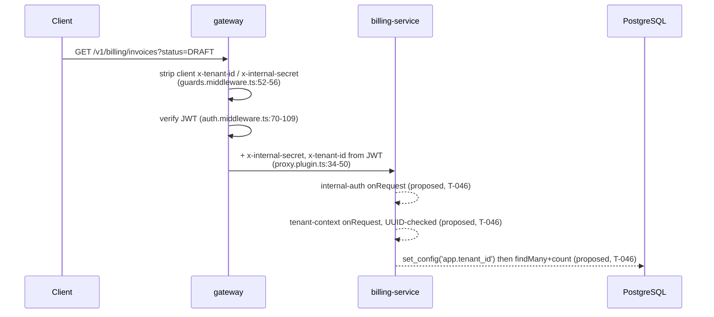

# T-046 · Invoice list — `GET /v1/billing/invoices`

**Service**: billing-service · **Epic**: `docs/epics/epic-8-billing-service.md` (T-046 entry)
**Base**: `ed670b3` (T-045, internal metering endpoint), working tree clean
**Gate**: 1 of `/ship` — plan only. No production code, no tests, no commits.
**Prior plan for this task**: none. `ls docs/plans/ | grep t-046` returns nothing, so this
plan is new rather than an extension or replacement.

---

# Part 1 — for the analyst

## 1. In plain terms

Today a customer's invoices exist only in the database. billing-service can *create* an invoice
(T-045, an internal scheduler-only endpoint) but there is no way for a customer to see one.
T-046 adds the first customer-facing billing screen's data source: **a paged, filterable list of
that tenant's invoice headers** — period, status, total, currency — with the line-item breakdown
deliberately left to T-047.

**Who notices.** Tenant users, through the dashboard (Epic 11). Nobody else: no existing endpoint
changes behaviour, no database migration, no schema change, no other service is touched.

**What it costs if this is wrong.** This is billing-service's *first externally reachable route*.
Everything before it was either unauthenticated health or an internal-only endpoint the gateway
never proxies. So T-046 is the task that introduces the tenant-context layer into this service,
and the failure mode is the expensive one in this platform: **one tenant seeing another tenant's
invoice totals**. The invoice header carries revenue figures, so a leak is commercially sensitive
as well as a compliance breach.

Two things make that risk lower than it sounds, and both were measured rather than assumed:

- PostgreSQL row-level security on `"Invoice"` **is** live and enforcing. As the service role
  `telemetry_app`, a query with *no* tenant filter at all returned only the context tenant's rows,
  and a query naming another tenant while the context said otherwise returned nothing
  (probes M1/M2/M3, appendix A.2).
- The repository base class this endpoint inherits already carries the application-level tenant
  predicate and the transaction-local RLS context.

The one place the platform is genuinely thin is **T-047, not T-046** — see §3.



Solid arrows exist today at the cited `file:line` on base `ed670b3`. Dashed arrows are *proposed*
by this plan and do not exist yet. The two billing-service hooks are drawn in that order because
probe P14 shows that order runs auth first and never derives tenant context for an unauthenticated
caller; probe P13 shows the ordering is **not** a matter of registration order (appendix A.1).

## 2. Decisions needed from you

### D1 — Does the new route sit behind billing-service's internal-auth guard? **Decided: yes.**

Gate 0 returned this unresolved. It is now settled with evidence rather than escalated, because
the two answers do **not** produce materially different plans — the difference is one
`app.register` block, not a different file set, test strategy or owner.

| Option | Consequence |
|---|---|
| **A · guarded (recommended)** | Route lives in a new encapsulated `app.register` scope carrying internal-auth then tenant-context, both `onRequest`. `/health` and the existing internal scope are untouched. |
| B · unguarded | billing-service becomes S-9's shape: a tenant-scoped route with no service-to-service auth, reachable by anything that can open a socket to billing's port. |

**Why A.** `.claude/rules/tenant-isolation.md` layer 2 states the guard runs *before* tenant
context is derived; S-9's fix direction says to add the guard "before the first tenant-scoped
route, not after", and T-046 is that first route. The gateway already sends `X-Internal-Secret`
unconditionally on every proxied request (`apps/gateway/src/plugins/proxy.plugin.ts:34-37`), so
option A costs the client nothing. usage-service is the precedent `CLAUDE.md` instruction 5 points
at (`apps/usage-service/src/app.ts:27-28`).

This changes the diff (one `app.register` block plus two hook registrations). It is not preference.

### D2 — Do we fold S-8's billing-service items into T-046? **Recommended: no.**

Reusing billing's shipped guard means the new route inherits S-8's open defects: a `!==`
comparison rather than the timing-safe `secretsMatch` helper, and a secret that bypasses the env
schema.

| Option | Consequence |
|---|---|
| **A · reuse `buildInternalAuthMiddleware` unchanged (recommended)** | Zero edits to `internal-auth.middleware.ts` or the existing internal scope. S-8 stays open and intact as a three-service task. |
| B · fold S-8 items 1–3 for billing into T-046 | Also edits `middleware/internal-auth.middleware.ts`, `app.ts`'s internal scope, `config/env.ts`, and re-verifies T-045's route tests. Leaves usage- and worker-service still divergent, so S-8 does not close. |

**Why A.** The repo's standing precedent is to refuse exactly this fold: S-8 was kept out of S-4,
S-19 out of S-18, S-22 out of T-038, each for the one-task-per-commit rule. And the added exposure
is measurable and near zero: the timing oracle needs direct network access to billing's port,
which is the same access already needed to probe `/v1/internal/billing/generate` — through the
gateway an attacker cannot reach the comparison at all, because the gateway *overwrites*
`x-internal-secret` with its own value on every path (`proxy.plugin.ts:34-37`).

Note the one asymmetry option A creates: the same guard function is registered as `onRequest` in
the new external scope and remains `preHandler` in the internal scope. That is forced, not
stylistic — see D3 — and the promotion of the internal scope belongs to S-8 item 3.

This changes the diff. Flipping it to B adds ~3 files and ~6 tests and re-opens T-045's contract.

### D3 — Hook phase: `onRequest` or `preHandler`? **Decided: `onRequest`, and it is forced.**

Not a style question. Measured at fastify 5.10.0 (appendix A.1):

- With internal-auth as `preHandler` and tenant-context as `onRequest`, the run order is
  `["tenant","auth"]` — **tenant context is derived before the caller has proved it is the
  gateway**. `.claude/rules/tenant-isolation.md` § *Forbidden* names exactly that ordering.
- Registration order does not fix it: probe P13 ran both registration orders and got
  `["tenant","auth"]` in each.

So if tenant-context is `onRequest` (the usage-service shape), internal-auth **must** be
`onRequest` too. The shipped `buildInternalAuthMiddleware` factory works unchanged in that phase —
probe P11 confirms its un-`return`ed `reply.status(401).send(...)` still short-circuits later
`onRequest` hooks — so this needs no edit to the middleware file and no second copy of it.

**Correction to this decision's heading, at the Gate-3 rework round 3.** The body above states the
right thing — a *conditional* — and the heading's bare "and it is forced" does not. What is forced
is the guard's phase **given** that tenant-context is `onRequest`; the phase pairing itself is a
choice among three that order correctly. Gate 4 measured seven configurations and Gate 6 re-derived
six independently: both-`onRequest` (guard first), both-`preHandler` (guard first) and
guard-`onRequest`/tenant-`preHandler` all give run order `["auth"]`, while crossing the phases the
other way gives `["tenant","auth"]` in **both** registration orders. `app.ts` and
`middleware/tenant-context.middleware.ts` now both state the condition (review LOW-1, first and
second rounds). The decision is unchanged; only its headline was stronger than the measurement.

### D4 — Sort order for the page. **Recommended: `periodStart DESC, id DESC`.**

The epic specifies none, and offset pagination without a deterministic total order silently
overlaps or skips rows between pages.

| Option | Consequence |
|---|---|
| **A · `periodStart DESC, id DESC` (recommended)** | Newest billing period first. `@@unique([tenantId, periodStart, periodEnd])` makes `periodStart` near-unique per tenant, and `id` makes ties total. |
| B · `createdAt DESC, id DESC` | Orders by when the invoice was *generated*, which for a backfill run puts an old period at the top. |

Preference, one line of diff either way. A is recommended because a billing UI is period-ordered.

### D5 — Which layer normalizes `Decimal(18,6)` and `Date`? **Recommended: the repository.**

`InvoiceRepository` already owns this: `toAmountString` at
`apps/billing-service/src/repositories/invoice.repository.ts:63` is T-045's precedent, and it means
`Prisma.Decimal` never leaves the repository at all. Dates are normalized in the same place, so the
returned `InvoiceHeader` is all-strings and matches the epic's declared type honestly.

**This one has a trap worth stating on page one.** Fastify serializes a raw `Prisma.Decimal` to a
JSON **string** anyway, because `Decimal` defines `toJSON` — measured, probe D6: the wire body
carried `"totalAmount":"1234567.123456"` with no normalization layer present at all, and
`typeof` on the parsed wire value was `"string"`. So **an HTTP-level assertion cannot detect a
Decimal leak.** The test that catches it must assert below the HTTP boundary, on the repository's
or service's return value (`BU75`, `BU82` in §6).

Preference in shape, not in outcome; the diff is which file the `String(...)` lives in.

### D6 — Epic-8 Q2 documentation fix (folded in, one line)

`docs/epics/epic-8-billing-service.md:13` still lists Q2 (pricing model) as an open
pre-coding decision, while `docs/epics/README.md:18` marks it **decided** (flat only for v1). T-045
updated the index and not the epic, one commit ago. Both verified by `grep` (appendix A.4). This is
the two-sources-disagree shape S-15 exists for; T-046 corrects the epic to cite the index.

**Second divergence, also verified, also corrected in the same line-pair:** epic-8:14 lists Q3 as a
pre-coding decision for Epic 8, but `docs/epics/README.md:19` scopes Q3 to **Epic 9**. See §3.

## 3. Scope and non-goals

**In scope**

- `GET /v1/billing/invoices` — `status` / `page` / `pageSize` query params, `PaginatedResult<InvoiceHeader>`.
- billing-service's first tenant-context middleware, UUID-validated, registered after internal-auth.
- A list-and-count method on `InvoiceRepository`, shaped so T-047 and T-048 can inherit it.
- The epic-8 Q2/Q3 documentation correction (D6).

**Explicitly not in scope**

- **Line items.** T-047 owns `GET /v1/billing/invoices/:id`. T-046 returns headers only.
- **S-8.** billing's internal-auth guard is reused byte-for-byte (D2). Items 1, 2 and 3 stay open.
- **S-19.** billing's `base.repository.ts` has no `set_config('TimeZone','UTC')` pin, unlike
  usage-service's. **T-046 does not add it and must not.** The endpoint has no timestamp predicate
  at all — it filters on `tenantId` and `status` and returns stored values — so S-18's
  session-zone hazard cannot reach it. Promoting the base class is S-19's task, across five services.
- **Q3 (UTC aggregation boundary).** Stays open **deliberately, and it does not reach T-046**:
  this endpoint chooses no bucket boundary and binds no timestamp. Q3 *does* block **T-042**
  (`docs/epics/epic-7-worker-service.md:206-211`), the daily job that selects "the previous
  calendar day" — that is where the boundary is actually chosen. Recorded so no reader has to
  wonder why an open gate did not stop this task.
- **Tenant existence check.** No `404` for an unknown tenant. The tenant id arrives from a
  gateway-verified JWT, and an empty list is the correct answer for a tenant with no invoices.
- **Sorting/filtering beyond `status`.** No date-range filter, no `currency` filter.

**Deliberately left broken, and handed forward**

**S-10 does not bite T-046, but it will bite T-047 — state it now.** Re-verified on the live
database at Gate 1 (appendix A.2): `"Invoice"` has `relrowsecurity = t` with the
`invoice_tenant_isolation` policy (`ALL`, `USING ("tenantId" = current_setting('app.tenant_id', true))`),
while `"InvoiceLineItem"` has `relrowsecurity = f` and **no policy at all**. T-046 returns invoice
headers only, so the list path has both layers — application predicate *and* enforcing RLS.
**T-047's detail endpoint includes `lineItems`**, and there a cross-tenant `404` test would pass on
the application predicate alone, with nothing behind it. T-047 inherits the repository T-046 shapes;
whoever plans it must read S-10 first and must not treat a green cross-tenant test as evidence.

**S-13 means manual verification returns an empty list, and that is not a bug.** Measured at Gate 1:
the development database holds `Tenant=2` and `Event=UsageLine=Invoice=InvoiceLineItem=Meter=0`
(appendix A.2). `prisma/seed.ts` cannot run (S-13), so there is no seeded invoice to list.
`curl`ing the endpoint by hand will legitimately return `{"data":{"items":[],"total":0,...}}`.
The integration suite seeds its own rows and is unaffected.

---

# Part 2 — for the implementer

## 4. Files to change

### Existing — modified

| File | Change |
|---|---|
| `apps/billing-service/src/constants.ts` | `BILLING_ROUTES.INVOICES`; `BILLING_HEADERS.TENANT_ID`; tenant-context codes/messages on `BILLING_RESPONSES`; new `BILLING_INVOICE_LIST` (pagination bounds, sort field names). |
| `apps/billing-service/src/errors/index.ts` | `TenantContextMissingError`, `TenantContextInvalidError` — both `401`, mirroring `apps/usage-service/src/errors/index.ts:18-44`. |
| `apps/billing-service/src/types/index.ts` | Replace `export {}` with the `FastifyRequest` augmentation (see §5 slice 2). |
| `apps/billing-service/src/app.ts` | `import "./types";` and one new `app.register` scope after the existing internal one. **Do not touch the internal scope.** |
| `apps/billing-service/src/config/container.ts` | Register `invoiceService` and `billingController`. `invoiceRepositoryFactory` already exists as a per-request factory at `:56` — do not re-solve it. |
| `apps/billing-service/src/repositories/invoice.repository.ts` | Add `listInvoices`; export `InvoiceHeader` and the query input type. |
| `apps/billing-service/src/repositories/index.ts` · `controllers/index.ts` · `routes/index.ts` · `services/index.ts` · `validators/index.ts` · `middleware/index.ts` | Barrel exports for the new symbols (`middleware/index.ts` is currently `export {};`). |
| `apps/billing-service/tests/integration.fixtures.ts` | `seedInvoices(specs)` — the generate endpoint only produces `DRAFT`, so `FINALIZED`/`PAID` rows must be seeded through the owner connection. |
| `apps/billing-service/tests/integration.constants.ts` | List fixture vocabulary (statuses, periods, page sizes, precise totals). |
| `apps/billing-service/tests/billing.integration.test.ts` | New `describe` block, cases `BI14`+. |
| `docs/epics/epic-8-billing-service.md` (lines 13–14) | D6 documentation fix. |

### New

| File | Purpose |
|---|---|
| `apps/billing-service/src/middleware/tenant-context.middleware.ts` | Mirrors `apps/usage-service/src/middleware/tenant-context.middleware.ts` (62 lines). |
| `apps/billing-service/src/validators/invoice-list.validator.ts` | `status`/`page`/`pageSize` query schema. |
| `apps/billing-service/src/services/invoice.service.ts` | Resolves the repository factory, wraps in `PaginatedResult`. |
| `apps/billing-service/src/controllers/billing.controller.ts` | Thin; mirrors `apps/usage-service/src/controllers/usage.controller.ts` (73 lines). |
| `apps/billing-service/src/routes/billing.routes.ts` | Registers the route **on the passed scope**, mirroring `routes/internal.routes.ts`. |
| `apps/billing-service/tests/invoice-list.validator.unit.test.ts` | |
| `apps/billing-service/tests/tenant-context.middleware.unit.test.ts` | |
| `apps/billing-service/tests/invoice.service.unit.test.ts` | |
| `apps/billing-service/tests/billing-invoices.route.test.ts` | Route-level wiring, mirroring `tests/internal-billing.route.test.ts`. |

**Size estimate, re-derived rather than inherited.** The usage-service comparable is
`wc -l` of controller 73 + service 61 + validator 51 + routes 18 + tenant-context middleware 62 +
public-routes 18 + types 8 = **291 source lines**, not 543 — Gate 0's 543 appears to have included
`usage.repository.ts` (189) and a barrel. T-046 needs no `public-routes.ts` (encapsulation replaces
the allowlist — see slice 2) and adds a repository method rather than a repository. So: **~230–290
new source lines**, plus ~60 lines of edits to existing files. Gate 0's 250–350 is the right order
of magnitude; the lower half of it is the realistic target.

## 5. Implementation slices

Pseudo-TDD throughout (`.claude/rules/testing.md`): skeletons → bodies → **confirm red** →
implement → refactor on green. Test ids continue billing's existing scheme — the current
high-water mark is **BU70** and **BI13**, measured by grepping `apps/billing-service/tests/*.ts`
(appendix A.4), so this task allocates **BU71+** and **BI14+**.

### Slice 1 — Query contract (validator + constants), no behaviour

**Controlling code path**: `src/validators/invoice-list.validator.ts`, consumed by
`BillingController.listInvoices`.

Shape, mirroring `apps/usage-service/src/validators/usage-summary.validator.ts:28-49`:
`status` optional, `page`/`pageSize` `z.coerce.number().int()` with `.min()`/`.max()`/`.default()`
from a new `BILLING_INVOICE_LIST` constant block (defaults 1 / 20, max 100 — the epic's numbers,
matching `USAGE_SUMMARY_CONSTANTS`). `pageSize` above the max is **rejected, not clamped**, so a
client never silently receives a different page size than it asked for.

`status` must be derived from Prisma's generated `InvoiceStatus` enum, not re-typed as
`z.enum(["DRAFT","FINALIZED","PAID"])` — `BILLING_METERING.INVOICE_STATUS_DRAFT` at
`constants.ts:113` is the established precedent, and `Object.keys(InvoiceStatus)` was measured as
`DRAFT,FINALIZED,PAID` (probe D10). A schema rename then becomes a compile error here rather than a
runtime `500`.

**Falsifiable hypothesis**: *an unknown `status` value is rejected by the validator with `400`
before Prisma ever sees it.*
**Falsified if**: a request with `status=BOGUS` returns anything other than `400 VALIDATION_ERROR`.
**Mutation that must go red**: delete the `status` field from the schema so the value passes through
untouched — `BU71` must fail, and the integration equivalent must surface a `500`, because Prisma
rejects an unknown enum member with `PrismaClientValidationError` (measured, probe D9).

### Slice 2 — Tenant context middleware, errors, types, and the guarded scope

**Controlling code path**: `src/middleware/tenant-context.middleware.ts` +
`src/app.ts`'s new `app.register` block.

Mirror `apps/usage-service/src/middleware/tenant-context.middleware.ts` (62 lines): read
`BILLING_HEADERS.TENANT_ID`, throw `TenantContextMissingError` when absent/blank/non-string,
**validate as a UUID** and throw `TenantContextInvalidError` otherwise, then assign. Both errors are
`401` in usage-service (`errors/index.ts:18-44`) — match that, do not invent `400`.

**Two deliberate divergences from the mirrored source, both improvements, both checkable:**

1. **Parse with `tenantIdSchema`, not `uuidSchema`.** billing's repository factories are typed
   `(tenantId: TenantId) => …` (`services/billing.service.ts:20-21`), where usage-service's is
   `(tenantId: string)`. `tenantIdSchema` is `uuidSchema.transform(v => v as TenantId)`
   (`packages/shared-validation/src/index.ts:38`), so it enforces the same UUID rule *and* hands
   back the branded type the constructor demands. Claim, stated at the strength it can be checked:
   assigning a plain `string` to the factory is a **TS2345** compile error, not an unrepresentable
   state — the implementer must confirm that error by attempting the assignment before writing the
   sentence into a code comment.
2. **Declare `tenantId?: TenantId` optional** in the `FastifyRequest` augmentation, where
   usage-service declares it non-optional `string` (`apps/usage-service/src/types/index.ts:1-5`).
   Optional is honest — `/health` and the internal scope never run the hook — and it makes the
   controller's `if (!tenantId)` guard type-required rather than decorative.
   *Risk to check*: two packages augmenting `FastifyRequest.tenantId` with different types would
   conflict if ever compiled together. Nothing imports both today; confirm with
   `grep -rn "usage-service" apps/billing-service/src apps/billing-service/package.json`.

**Wiring** — the security contract, and the part probes exist for:

```ts
app.register(async (billingApi) => {
  billingApi.addHook("onRequest", buildInternalAuthMiddleware(internalApiSecret)); // D2: reused as-is
  billingApi.addHook("onRequest", billingTenantContextHandler);                    // D3: must be onRequest
  registerBillingRoutes(billingApi, container.billingController);
});
```

**No `public-routes.ts`.** usage-service needs a route allowlist because its hooks are global;
billing's encapsulated scope means `/health` and the internal routes are *structurally* outside the
hook, which is stronger than an allowlist — there is no list to forget to update. Probe P1 confirms
`/health` runs neither hook, P2 confirms the internal scope runs neither (appendix A.1).

**Falsifiable hypothesis**: *no request reaching the invoice list handler has skipped either the
internal-auth guard or UUID tenant validation, and internal-auth runs first.*
**Falsified if**: a request with a valid `X-Tenant-Id` and no `X-Internal-Secret` reaches the
handler or returns anything but `401`; or a request with a valid secret and
`X-Tenant-Id: not-a-uuid` reaches the handler.
**Mutations that must go red**:
- move `registerBillingRoutes` outside the `app.register` callback → `BU78` (unauthenticated `200`);
- swap the two `addHook` calls → `BU79`, which must assert the *order*, not just the status code —
  both orders return `401` for a request missing both headers, so a status-only assertion is
  vacuous (probe P8 vs P14 give the same status with opposite orders);
- change the tenant check from UUID to non-empty-string → `BU77` (`X-Tenant-Id: abc` must not 200).

### Slice 3 — `InvoiceRepository.listInvoices`

**Controlling code path**: `src/repositories/invoice.repository.ts`, alongside the four existing
methods.

```ts
export interface InvoiceHeader {           // all strings: D5
  readonly id: string;
  readonly periodStart: string;
  readonly periodEnd: string;
  readonly status: InvoiceStatus;
  readonly totalAmount: string;
  readonly currency: string;
  readonly createdAt: string;
  readonly finalizedAt: string | null;
}

async listInvoices(query: { status?: InvoiceStatus; page: number; pageSize: number })
  : Promise<{ items: readonly InvoiceHeader[]; total: number }>
```

Four properties this signature must preserve, each one a live constraint:

1. **No `tenantId` parameter.** The existing docblock at `:68-89` asserts that no method here takes
   one, and `where<T extends { tenantId?: never }>` at `base.repository.ts:85` makes passing one
   *into `this.where(...)`* a compile error. The tenant comes from `this.where({})`.
2. **T-048's declared signatures diverge from this shape, and this shape must not repeat them.**
   The epic at `docs/epics/epic-8-billing-service.md:141` writes
   `update(id: string, tenantId: TenantId, data)` and `findById(id, tenantId)` — a `tenantId`
   parameter. Report as a finding; do not implement it. T-047/T-048 should inherit
   `listInvoices`' shape: identifiers in, tenant from context.

   **Corrected at the Gate 3 rework (review MEDIUM-2).** This item previously said the epic's
   signatures "cannot be implemented against that constraint". They can. Three probes, each a
   temporary subclass of `TenantScopedRepository` under
   `pnpm --filter @telemetry/billing-service typecheck`:

   | Probe | Body | Result |
   |---|---|---|
   | A | `async findById(id: string, tenantId: TenantId)` calling `this.where({ id })`, parameter discarded | **compiles, 0 errors** |
   | B | the same method calling `this.where({ id, tenantId })` | `error TS2322: Type 'TenantId' is not assignable to type 'undefined'.` |
   | C | the same method building `where: { id, tenantId }` by hand, never calling `this.where` | **compiles, 0 errors** |

   So the constraint rejects one thing — feeding a caller-supplied tenant into `this.where(...)`
   — and the error is **TS2322**, not the TS2345 that the `InvoiceRepositoryFactory` claim in
   `src/types/index.ts` cites. Keeping tenant out of the signature remains the right call, but as
   a convention the call-site shape supports, not as a type-level impossibility. Probe C is the
   reason the weaker word is the accurate one: a hand-built predicate carrying a caller-supplied
   tenant compiles today. Stated as measured per
   `.claude/rules/review-standards.md` § *Universals Must Cite Their Mutation*.
3. **`findMany` and `count` run inside one `withTenant` transaction**, so the page and the total
   describe the same row set. Measured working as `telemetry_app` (probe D1/D2/D7).
4. **Normalize before returning** (D5): `String(row.totalAmount)` — reuse the existing
   `toAmountString` at `:63` rather than adding a second copy — and `.toISOString()` on the three
   date columns. `finalizedAt` is nullable; preserve `null`, do not coerce to `""`.

Order by `periodStart desc, id desc` (D4).

**Index note, stated no stronger than measured.** `Invoice_tenantId_status_idx` on
`("tenantId", status)` exists (`pg_indexes`, appendix A.2), matching the schema's
`@@index([tenantId, status])`. But `EXPLAIN` of the filtered query on a 4-row table produced a
**Seq Scan** with a Sort node above it (probe D8). That is the planner behaving correctly at that
size; it means **index *use* at scale is unverified by this plan**, and the `ORDER BY periodStart`
is not covered by that index, so a sort will appear. Do not write "index-covered" into a comment.

**Falsifiable hypothesis**: *the list returns only the bound tenant's invoices, and it does so
through two independent layers.*
**Falsified if**: with `app.tenant_id` set to tenant A, any row belonging to tenant B appears.
**Mutations that must go red**:
- remove the `this.where({})` predicate → `BI17` (the cross-tenant case) must still pass on RLS
  alone (that is the *point* — it proves RLS is load-bearing), while `BU74`'s negative assertion on
  the generated `where` object goes red;
- bypass `withTenant` (query on `this.prisma` directly) → `BI17` must go red, proving the
  application predicate is not silently doing all the work.
Run **both** mutations. S-21 is the worked example of a two-guard fix whose suite only ever
exercised one guard: removing either alone left it green.

### Slice 4 — Service, controller, routes, container

**Controlling code path**: `src/services/invoice.service.ts` → `src/controllers/billing.controller.ts`.

`InvoiceService.listInvoices(tenantId, query)` mirrors
`apps/usage-service/src/services/usage.service.ts:28-60`: resolve the factory, delegate, echo the
effective `page`/`pageSize` into `PaginatedResult<InvoiceHeader>` (`@telemetry/shared-types:51-56`).
The validator has already applied defaults, so this layer performs no pagination arithmetic.

`BillingController` mirrors `apps/usage-service/src/controllers/usage.controller.ts` exactly:
`safeParse` → `400 VALIDATION_ERROR` with issues joined into `message`; missing `tenantId` →
`400`; success → `200 { data: PaginatedResult }`; `AppError` → its own status/code; anything else →
`500` with a body that says nothing about the failure. All literals from `BILLING_RESPONSES`.

`registerBillingRoutes(scope, controller)` takes the **scope**, not the root app — copy the
docblock discipline from `routes/internal.routes.ts:5-12`, which explains why.

**Falsifiable hypothesis**: *the response envelope is `{ data: { items, total, page, pageSize } }`
and `totalAmount` is a JS string at every layer below HTTP.*
**Falsified if**: any layer returns a `Prisma.Decimal` or a `Date`.
**Mutation that must go red**: delete the normalization in `listInvoices` and return the raw Prisma
rows. `BU75`/`BU82` (below HTTP) must go red. **`BI14` must NOT go red** — and that is the finding,
not a defect: probe D6 measured that Fastify serializes a raw `Prisma.Decimal` to a JSON string via
its `toJSON`, so the wire body is byte-identical either way. Confirm this by running the mutation;
if `BI14` *does* go red, the D6 measurement is wrong and this plan's D5 reasoning needs revisiting.

### Slice 5 — Integration coverage and fixtures

**Controlling code path**: `tests/integration.fixtures.ts` + `tests/billing.integration.test.ts`.

Add `seedInvoices(specs)` to `BillingFixtures`, running on the owner connection like every other
seeder there (the class docblock at `:59` explains why: as `telemetry_app` an unscoped `DELETE` is
filtered by the policy and silently affects zero rows). It must seed `FINALIZED` and `PAID` rows
with non-null `finalizedAt`, which the generate endpoint cannot produce — it only writes `DRAFT`
(`BILLING_METERING.INVOICE_STATUS_DRAFT`, `invoice.repository.ts:195`).

`reset()` at `:260` already deletes `Invoice` and `InvoiceLineItem` scoped to the suite's tenant
ids, and `assertRunStateEmpty` at `:294` already checks it. Extend neither; add the seeder only.

**Environment invariant to preserve**: the suite's tenant ids are fixed constants
(`INTEGRATION_TENANT.A`/`.B`), so an earlier run's residue is collectable by exact id — S-20's
lesson, already applied here. Keep it.

## 6. Test plan and acceptance-coverage mapping

Acceptance criteria are derived from the epic's T-046 entry, **checked against the shipped code and
schema** rather than taken on trust (§8 records what diverged).

| # | Acceptance criterion | Tests |
|---|---|---|
| AC1 | `GET /v1/billing/invoices` returns `200 { data: PaginatedResult<InvoiceHeader> }` for the calling tenant | BU80, BI14 |
| AC2 | `status=DRAFT\|FINALIZED\|PAID` filters the list; an unknown value is `400` | BU71, BU81, BI15 |
| AC3 | `page`/`pageSize` default to 1/20; `pageSize > 100` is `400`; `page`/`pageSize` < 1 is `400` | BU72, BU73, BU81 (rework, route level), BI16 |
| AC4 | Response items carry exactly the eight `InvoiceHeader` fields, no `lineItems` | BU82, BI14 |
| AC5 | `totalAmount` is a string preserving `Decimal(18,6)`; `Prisma.Decimal` never leaves the repository | BU75, BU82, BI18 |
| AC6 | `createdAt`/`periodStart`/`periodEnd` are ISO strings; `finalizedAt` is an ISO string or `null` | BU76, BI14 |
| AC7 | Another tenant's invoices are never returned | BU74, BI17 |
| AC8 | Missing/blank `X-Tenant-Id` → `401 TENANT_CONTEXT_MISSING` | BU77a, BI19 |
| AC9 | Non-UUID `X-Tenant-Id` → `401 TENANT_CONTEXT_INVALID` | BU77b, BU77d (rework, duplicated header), BI19 |
| AC10 | Missing/wrong `X-Internal-Secret` → `401 UNAUTHORIZED`, and the route is inside the guarded scope | BU78, BI20 |
| AC11 | internal-auth runs **before** tenant context | BU79 |
| AC12 | `/health` and `POST /v1/internal/billing/generate` are unaffected by the new hooks | BU83, and T-045's existing BU54–BU70 re-run green |
| AC13 | Empty result is `200 { items: [], total: 0 }`, not `404` | BU84, BI21 |

**Unit / route (`BU71`–`BU84`)**

- `invoice-list.validator.unit.test.ts` — BU71 (unknown status → fail), BU72 (defaults applied),
  BU73 (`pageSize=101` rejected, `page=0` rejected, `pageSize=100` accepted — the boundary on both
  sides), BU76 (parsed output types).
- `tenant-context.middleware.unit.test.ts` — BU77a/BU77b (missing vs non-UUID, asserting the two
  *distinct* error codes, not just the shared `401`).
- `invoice.service.unit.test.ts` — BU74 (the `where` handed to the repository carries the bound
  tenant and **no other tenant id appears in it** — a negative assertion per `.claude/rules/testing.md`),
  BU75 (`typeof totalAmount === "string"` **and** `!(value instanceof Prisma.Decimal)`), BU84.
- `billing-invoices.route.test.ts` — BU78, BU79, BU80, BU81, BU82, BU83. Stubs the service on the
  real container, exactly as `internal-billing.route.test.ts` does, so these cases test wiring and
  not arithmetic.

**BU79 needs care and is the case most likely to be written vacuously.** Probes P8 and P14 return
the *same* `401` for opposite hook orders. The test must therefore observe the order — e.g. send a
valid secret with a non-UUID tenant and assert `TENANT_CONTEXT_INVALID`, *and* send no secret with a
valid tenant and assert `UNAUTHORIZED`; the second is what goes red when the hooks are swapped.

**Controller unit (`BU88`–`BU91`, added at the Gate 3 rework — review MEDIUM-4 / decision D-B)**

`tests/billing.controller.unit.test.ts`, mirroring `internal.controller.unit.test.ts`:
BU88 (success control — `200 { data }` and the parsed query reaching the service),
BU89 (`!tenantId` → `400` + `MESSAGE_TENANT_CONTEXT_REQUIRED`, **and the service not reached**),
BU90 (`AppError` → its own status/code/message, nothing logged as unexpected),
BU91 (`500` leaks nothing — exact-equality on the two-field body, plus the detail present in the
log). These do not map to a new acceptance criterion; they cover the controller's three error
branches, which no case reached. The `!tenantId` branch is not reachable through the real app, so
a unit case is the only level at which it can be exercised at all.

**Integration (`BI14`–`BI21`)**, appended to `billing.integration.test.ts`, seeded through the owner
connection and read through the service connection as `telemetry_app`:

- BI14 — seed 3 invoices for tenant A across three statuses, list, assert order (D4), field set, ISO
  dates.
- BI15 — `status=FINALIZED` returns only that one; `total` is 1, not 3.
- BI16 — `pageSize=2` gives items 1–2 with `total=3`; `page=2` gives item 3. Page 1 ∪ page 2 must
  equal the full set with **no duplicate id** — that is the assertion that catches a
  non-deterministic sort, and it is the reason D4 exists.
- BI17 — tenant B's invoice is absent from tenant A's list, run as `telemetry_app` with a real
  `app.tenant_id`. Assert against rows tenant A could not have created.
- BI18 — `totalAmount = "1234567.123456"` survives the round trip exactly (float would give
  `1234567.1234559999`).
- BI19 — missing and non-UUID `X-Tenant-Id` → `401`, distinct codes.
- BI20 — no `X-Internal-Secret` → `401`, handler never reached.
- BI21 — tenant with zero invoices → `200`, `items: []`, `total: 0`.

## 7. Validation commands

Task-scoped first, while iterating:

```bash
cd /home/admin1/personal-workspace/telemetry-platform
pnpm --filter @telemetry/billing-service exec vitest run tests/invoice-list.validator.unit.test.ts
pnpm --filter @telemetry/billing-service exec vitest run tests/tenant-context.middleware.unit.test.ts
pnpm --filter @telemetry/billing-service exec vitest run tests/invoice.service.unit.test.ts
pnpm --filter @telemetry/billing-service exec vitest run tests/billing-invoices.route.test.ts
pnpm --filter @telemetry/billing-service exec vitest run tests/billing.integration.test.ts
pnpm --filter @telemetry/billing-service typecheck
pnpm --filter @telemetry/billing-service lint
pnpm --filter @telemetry/billing-service test        # whole package, including T-045's suites
```

Note `pnpm --filter <pkg> test -- <file>` does **not** filter — use `exec vitest run <file>`
(`CLAUDE.md`, `.claude/rules/testing.md`).

Then the full gate, with `--force` so turbo replays nothing:

```bash
pnpm build --force && pnpm test --force && pnpm lint --force && pnpm typecheck --force
```

Integration tests need live Postgres and Redis; both are host services and were up at Gate 1.
`pnpm format:check` is **not** part of the gate — it cannot pass on any revision of this repo (S-12).

## 8. Epic-vs-code divergences found (report, do not silently "fix")

Checked every field, status code and type the T-046 entry names against `prisma/schema.prisma` and
the shipped code.

| # | Epic says | Code/schema says | Disposition |
|---|---|---|---|
| 1 | `docs/epics/epic-8-billing-service.md:13` — Q2 open | `docs/epics/README.md:18` — Q2 **decided** (flat only, v1) | Fix the epic (D6). T-045 updated the index only. |
| 2 | epic-8:14 — Q3 is an Epic 8 pre-coding decision | README:19 scopes Q3 to **Epic 9** | Fix the epic in the same line-pair; Q3 stays open (§3). |
| 3 | T-046 "Auth: JWT required" | billing-service verifies **no JWT**. The gateway does (`auth.middleware.ts:70-109`), then injects `X-Tenant-Id` from the verified claim. billing trusts the header + `X-Internal-Secret`. | Shipped architecture, same as usage-service. Epic wording is shorthand; do not add JWT verification to billing. |
| 4 | T-046 lists files as `controllers/billing.controller.ts`, `services/invoice.service.ts` only | Also needs a middleware, a validator, a routes module, a repository method, container and types edits | Epic file list is incomplete, not wrong. Noted for the reviewer so the extra files are not read as scope creep. |
| 5 | T-048 `findById(id, tenantId)` / `update(id, tenantId, data)` | `where<T extends { tenantId?: never }>` (`base.repository.ts:85`) makes a `tenantId` parameter a compile error | Known-wrong, out of T-046's scope. `listInvoices` is shaped so T-047/T-048 inherit the correct form (slice 3). |

**Good news worth recording:** the epic's `InvoiceHeader` field list is **accurate**. All eight
fields exist on `model Invoice` with the stated nullability — `finalizedAt DateTime?` is the only
nullable one — and `InvoiceStatus` is exactly `DRAFT, FINALIZED, PAID` (probe D10). No divergence.

## 9. Risks and mitigations

| # | Risk | Severity | Mitigation |
|---|---|---|---|
| R1 | A hook-ordering mistake derives tenant context for an unauthenticated caller | **HIGH** | D3 forces both hooks to `onRequest`; BU79 asserts order via distinct error codes, not a shared status. Probes P8/P13/P14 establish the mechanism. |
| R2 | `Prisma.Decimal` reaches the response and nobody notices | MEDIUM | D5 normalizes in the repository; BU75/BU82 assert **below** HTTP, because probe D6 shows an HTTP assertion cannot see it. |
| R3 | Non-deterministic sort makes page 2 overlap page 1 | MEDIUM | D4's total order; BI16 asserts the union of two pages has no duplicate id. |
| R4 | The new `app.register` scope accidentally covers, or fails to cover, the wrong routes | MEDIUM | Probes P1/P2/P3 measured encapsulation both ways; BU83 re-asserts `/health` and the internal route are unaffected. |
| R5 | T-047 inherits the list path and assumes `lineItems` are RLS-protected | **HIGH, deferred** | S-10 stated explicitly in §3 and handed forward. T-046 itself does not touch line items. |
| R6 | Index use at production scale is unverified | LOW | `Invoice_tenantId_status_idx` exists; EXPLAIN at 4 rows is a Seq Scan (probe D8). Plan says so rather than claiming coverage. Re-EXPLAIN with realistic volume is a follow-up, not a T-046 gate. |
| R7 | The `FastifyRequest.tenantId` augmentation conflicts with usage-service's | LOW | Different packages, no cross-import today. Implementer to confirm with a grep before relying on it. |
| R8 | Manual smoke returns an empty list and is read as a bug | LOW | S-13 noted in §3; the database genuinely has 0 invoices. |
| R9 | Reused internal-auth guard carries S-8's `!==` onto an externally-routed path | LOW | D2 reasoning: gateway overwrites the header on every path, so the oracle needs direct port access, unchanged from today. Flip D2 to close it. |

## 10. Pending task checklist

- [done] D1–D6 confirmed at Gate 2; all six stand as recorded
- [done] Slice 1 — validator + constants; suite red (module absent), then green. Mutation
      "delete the `status` field from the schema" run: **BU71 and BU76 red**, 2 failed / 2 passed
- [done] Slice 2 — middleware, errors, types, guarded scope; all three mutations run red —
      routes moved outside `app.register` (**BU78 + 4 others red** at route level, and the
      Gate-4 review measured **BI14–BI21** red as well: 13 failed / 144 passed), `addHook` calls
      swapped, UUID check replaced by non-empty-string (**BU77b red**).
      The TS2345 claim in `src/types/index.ts` was confirmed by making the assignment
- [done] Slice 3 — `listInvoices`; **both** isolation mutations run. Removing `this.where({})`
      left BI17 green (RLS is load-bearing — the point) and turned **BU74/BU74b red**;
      bypassing `withTenant` turned **BI17 red** (`expected +0 to be 3` — no context means no
      rows, not a leak)

- [done] Slice 4 — service, controller, routes, container; decimal mutation run. Deleting the
      normalisation turned **BU75 and BI18 red** and left **BI14 and BU82 green**, confirming
      the plan's D6 measurement that an HTTP-level assertion cannot see a `Decimal` leak
- [done] Slice 5 — `seedInvoices` + BI14–BI21. BI18's precision fixture was **changed**:
      `"1234567.123456"` round-trips losslessly through a double (measured), so it proved
      nothing; `"123456789012.123456"` degrades to `"123456789012.12346"` and does
- [done] D6 epic-8 Q2/Q3 documentation fix applied (lines 13–14)
- [done] Task-scoped lint / typecheck / build / test green — billing 16 files / 157 tests
- [done] Full gate `--force`: build 13/13, test 13/13, lint 13/13, typecheck 13/13, **0 cached**
      on every one. 838 tests (806 baseline + 32). 14 pre-existing warnings unchanged —
      10 in `apps/auth-service/tests/auth.service.unit.test.ts` (`d68e719`) and 4 in
      `apps/usage-service/tests/ingestion.service.unit.test.ts` (`b0f6921`); neither file
      appears in `git diff --name-only`. Zero `no-unsafe-return`
- [done] Database left at `Tenant=2`, all other tables 0
- [done] Gate 3 complete — handoff to `senior-reviewer` (pre-QA)

### Gate 3 rework — answering Gate 4's `CONDITIONAL`

- [done] **MEDIUM-1** — `invoice.repository.ts` docblock invariant 3. Grep re-run from the file's
      own directory: `grep -n "^  async" invoice.repository.ts` lists **five** —
      `tenantExists`, `findByPeriod`, `sumUnbilledByMetricKey`, `createDraftInvoice`,
      `listInvoices`. Count corrected from four, the five names written in so the numeral can be
      checked without re-deriving them, and the substance re-verified: none of the five takes a
      `tenantId` or a bare `invoiceId`. The clause "every `invoiceId` in the file is a returned
      field or a comment" was **also** slightly wrong — `createDraftInvoice` has a local
      `const invoiceId` — so it now reads "a local binding, a returned field or a comment, never
      a parameter"
- [done] **MEDIUM-2** — "cannot be implemented against that constraint" removed from
      `invoice.repository.ts` and from this plan. **Three** probes re-run, each a temporary
      subclass of `TenantScopedRepository` under `pnpm --filter @telemetry/billing-service
      typecheck`: (A) the epic's `findById(id: string, tenantId: TenantId)` calling
      `this.where({ id })` — **compiles, exit 0**; (B) the same calling
      `this.where({ id, tenantId })` — `error TS2322: Type 'TenantId' is not assignable to type
      'undefined'.`; (C) the same building `where: { id, tenantId }` by hand — **compiles,
      exit 0**. Probe C is mine, not the reviewer's, and it is why the replacement text says
      *convention the call-site shape supports* rather than substituting a second universal
- [done] **MEDIUM-3 (D-A)** — tie-break mutation. Recorded here at the Gate-3 rework round 3
      answering Gate 6's `CHANGES REQUESTED`, and deliberately **smaller** than the two entries it
      replaces. What holds: deleting `{ [SORT_FIELD_ID]: desc }` from `INVOICE_LIST_ORDER_BY`
      reddens **BU74c** in every run where its own outcome was recorded (14 of 20 in the
      exploratory series) — it asserts the `orderBy` structurally and
      does not touch the database, and it is the guard. **BI16's redness is not reproducible**:
      four gates measured it four different ways on an unchanged tree with a byte-identical
      mutation, and Gate 6 observed it flip green→red between two consecutive runs with nothing
      touched. **The cause is not established.** Row count in `"Invoice"` was proposed as the
      variable by the previous revision of this entry and Gate 6 refuted it by measuring the
      opposite in both states; planner statistics move on their own; a per-`OFFSET` plan split was
      observed inside a single state, which rules out labelling a whole run with one plan. Those
      are observations that did not resolve it, and this entry does not offer a mechanism —
      recording one is what went wrong at each of the previous four gates. **This record replaces
      two earlier ones.** The first reported the **pre-rework** totals
      (`Test Files 1 failed | 15 passed (16)` / `Tests 1 failed | 156 passed (157)`) as the result
      of a re-run on a 17-file / 162-test tree — a measurement carried forward rather than a typo.
      The second recorded a two-state dichotomy (0 rows ⇒ BI16 green, 129 unrelated rows ⇒ BI16
      red) as fact; Gate 6 measured the opposite in both states. Per-outcome totals are the one
      numeric thing that survived both: a green BI16 gives `Tests 1 failed | 161 passed (162)` and
      a red one `Tests 2 failed | 160 passed (162)`. The comment at
      `invoice.repository.unit.test.ts` now states only that BU74c is the guard, that BI16 is not
      to be deleted on the strength of a green run, and that the cause is unknown; the paragraph
      arguing against writing a behavioural case remains **deleted** — one exists and sometimes
      fires. Filed as **S-41**, whose title and severity now follow the shrunken content ("a guard
      whose redness is not reproducible, cause unknown"). T-047 inherits this fixture. BI16 **not**
      widened
- [done] **MEDIUM-4 (D-B)** — new `tests/billing.controller.unit.test.ts`, four cases
      (**BU88**–**BU91**), mirroring `internal.controller.unit.test.ts`. One case was red on its
      first run for a real reason — `BU89`'s helper used a *default parameter*, which JavaScript
      re-applies when the caller passes `undefined`, so the "no tenant context" fixture carried a
      tenant. Test defect, fixed, recorded in the file docblock. The other three were green on
      arrival (the controller already shipped), so each was confirmed by mutating its branch out
      in turn: guard deleted → **BU89** red; `instanceof AppError` arm deleted → **BU90** red;
      500 body given the error's own message → **BU91** red; `{ data: … }` envelope removed →
      **BU88** red. One case red per mutation, three green, every time
- [done] **LOW-1** — `app.ts` "forced rather than stylistic" → forced *given* the tenant-context
      hook is `onRequest`, with the two other correct pairings the review measured named
      explicitly so the conditional cannot be dropped again
- [done] **LOW-2** — duplicate-header behaviour re-measured before the comment was written, four
      forms at fastify 5.10.0 / Node 22.22.2: `app.inject` with an array value and with a
      pre-joined string both give `"<a>,<b>"`; two and three real `X-Tenant-Id` header lines over
      a `net` socket give `"<a>, <b>"` and `"<a>, <b>, <a>"`. **All four are `typeof === "string"`,
      never an array** — and note the separator differs by transport (`,` vs `, `), which the
      review's single `app.inject` measurement did not show. `@throws` clause corrected; new
      **BU77d** asserts `401 TENANT_CONTEXT_INVALID` for both separators **and** that neither uuid
      appears in the body. Confirmed red by mutating the hook to `header.split(",")[0]?.trim()`:
      `Tests 1 failed | 4 passed (5)`, the failure being BU77d
- [done] **LOW-3** (reviewer-optional, done) — extra assertion in **BU81**, at route level as the
      review asked, since the bound was proved at schema level only: `?pageSize=101` → `400` +
      `CODE_VALIDATION_ERROR`, and the service is not reached. Confirmed red by deleting
      `.max(BILLING_INVOICE_LIST.MAX_PAGE_SIZE)` from the validator: **BU73 and BU81** red.
      Recorded in the test that *reject rather than clamp* is this plan's choice —
      `docs/epics/epic-8-billing-service.md:92` says only `// default 20, max 100`
- [done] **LOW-4** — both slice mutation records re-run and corrected; see the table below
- [done] **NIT-1** — disposition **file, do not fold**. The "not a UUID" tenant fixture is
      declared three times with two values (`billing-invoices.route.test.ts` and
      `tenant-context.middleware.unit.test.ts` both `"abc"`; `integration.constants.ts`
      `"not-a-uuid"`), and `QUERY_KEY_STATUS` twice. Promoting them is not free: the two unit
      files deliberately do **not** import `integration.constants.ts`, which pulls in live
      connection strings, so a shared home would be a new test-constants module — a new file and
      three edits inside a rework answering a review. That is the S-39 precedent (promote when
      the change owns the files anyway; file it otherwise). Recorded, not done
- [done] **NIT-2** — **agree with the reviewer: leave** `(query.page - 1) * query.pageSize`.
      The `1` is the origin of offset arithmetic, not the `MIN_PAGE` bound; substituting the
      constant would assert a relationship between them that is coincidental
- [done] Billing package suite after the test work: **17 files / 162 tests, 0 failures**
      (was 16 / 157; +5 = BU88–BU91 and BU77d, plus an added assertion inside existing BU81)
- [done] Database re-counted after every mutation run: `Tenant=2`; `Event`, `UsageLine`,
      `Invoice`, `InvoiceLineItem`, `Meter` all **0**. Every mutated file restored and `diff`ed
      to zero

### Corrections to the slice-2 and slice-3 mutation records, re-measured at the Gate 3 rework (review LOW-4)

Both slice records under-stated how many cases the mutation reddens. Under-stating is the safe
direction, but the plan ships in the commit, so its account of itself is part of the change. Both
were re-run on the shipped tree, whole billing suite, after the rework's four new cases landed
(162 total):

| Mutation | Recorded | Measured on the shipped tree |
|---|---|---|
| Slice 2 — swap the two `addHook` calls (`app.ts`) | "**BU79 red, and only BU79**" | **BU79 and BI20** red · `Test Files 2 failed \| 15 passed (17)` · `Tests 2 failed \| 160 passed (162)`. BI20 was written later, in slice 5, so "only BU79" was true when written and false by the time the task finished. |
| Slice 3 — `this.withTenant(` → `this.prisma.$transaction(`, **confined to `listInvoices`** | "BI17 red **and BU74/BU74b/BU74c/BU74d red**" | **BU74 + BI14/BI15/BI16/BI17/BI18** red · `Tests 6 failed \| 156 passed (162)`. **BU74b, BU74c and BU74d stay green** — they assert `where`, `orderBy`/`skip`/`take` and the transaction count, none of which the bypass changes. The recorded four-case result only reproduces under a repository-**wide** replacement, which additionally reddens T-045's BI1–BI13. |

The load-bearing half of the slice-3 record is unchanged and reproduced exactly: **BI17 fails at
`expected +0 to be 3`** — zero rows, *not* a cross-tenant leak. Without the session context RLS
returns nothing rather than everything, which is why that case cannot on its own discriminate the
`where` predicate from the `withTenant` wrapper, and why the diff does not claim it does.

### Gate 3 rework round 3 — answering Gate 6's `CHANGES REQUESTED`

**No production behaviour changed.** Every edit in this round is markdown or a comment. The user's
ruling for this round was **C1: record the outcome, drop the mechanism** — so the round is
subtractive, and no new BI16 series was run. A sixth characterisation would have been a sixth
claim, and the evidence says it would not hold either.

- [done] **HIGH-1 + HIGH-2 + MEDIUM-1** — the coverage note at
      `apps/billing-service/tests/invoice.repository.unit.test.ts` and the **S-41** body in
      `.claude/rules/known-gaps.md` rewritten to claim only: BU74c reddens under the mutation
      (holds at every gate, and it is the guard); BI16 sometimes reddens and sometimes does not,
      on an unchanged tree, measured differently at four gates and observed by Gate 6 to flip
      between two consecutive runs; **do not delete BI16 on the strength of a green run**; the
      cause is **not established**. **Deleted, not replaced:** both run tables, both `EXPLAIN`
      plan blocks and the index-prefix argument built on them, the "which plan gets chosen is a
      property of `"Invoice"`'s statistics" generalisation, the "which half of BI16 does the work"
      attribution, the 20-run exploratory series, and the "what 28 runs support" sentence
      (MEDIUM-1, which blended the 20 runs the same comment disclaimed two sentences earlier).
      Row count, autonomous statistics movement and the per-`OFFSET` plan split are kept as
      **observations that did not resolve it**, not as a mechanism. S-41's title and severity now
      follow the shrunken content; its disclosure about the missing pre-probe `pg_class` baseline
      is kept, because Gate 6 confirmed it was the right thing to have said
- [done] **MEDIUM-2** — S-40's "did not reproduce here for any `page` value tried" corrected.
      Re-measured live against a billing-service process on port 3117 (`telemetry_app` DSN, Redis
      db 12): `?page=1e306` logs QA's text **verbatim** —
      `` Unable to fit value 2e+307 into a 64-bit signed integer for field `skip` ``. The entry's
      own sweep jumps `1e18` → `9223372036854775807` → `1e400` and skips the band the value sits
      in. Measured in four forms (`page=1e306` with the default `pageSize`, `&pageSize=20`,
      `page=1e307&pageSize=2`, `page=2e306&pageSize=10` — all `2e+307`; `page=1e306&pageSize=1`
      → `1e+306`), which is also the evidence for the value-dependence the entry keeps. The
      `instanceof PrismaClientValidationError` claim and the "reproduce the fault, not the string"
      guidance are unchanged. **QA was right and the sweep missed it**, stated plainly
- [done] **LOW-1** — `src/middleware/tenant-context.middleware.ts`'s headline no longer says the
      phase is "forced rather than chosen". It now states the condition `app.ts` states: the phase
      is a choice among three pairings that order correctly, and what is forced *given* this hook
      is `onRequest` is that the guard must be `onRequest` too and registered first. D3's heading
      above carries the same correction
- [done] **LOW-2** — `packages/shared-types/src/index.ts`'s `TENANT_CONTEXT_HEADERS` docblock no
      longer calls the header "the only source of tenant identity a downstream service may read".
      Narrowed to the services that receive their tenant from the gateway (usage-service and
      billing-service today), with auth-service named as the exception that reads no tenant header
      at all — `grep -rn "x-tenant-id\|X-Tenant-Id" apps/auth-service/src --include=*.ts` returns
      nothing (exit 1), and `.claude/rules/tenant-isolation.md` § *auth-service's pre-tenant path*
      was re-read on this tree before being cited. auth-service does import this package
      (`apps/auth-service/package.json:20`), so the false universal was readable by the service it
      was false about
- [done] **LOW-3** — F-3/F-4/F-5 dispositions recorded in the section below (user's choice **D3**:
      the plan, not `known-gaps.md`), plus a scale note on the `toAmountString` docblock in
      `src/repositories/invoice.repository.ts` so T-047 inherits the answer with the helper
- [done] Billing suite re-run: **17 files / 162 tests, 0 failures** — unchanged, as a
      markdown-and-comment round should be. No root gate this round; Gate 7 runs it
- [done] Database re-counted after the S-40 probe: `Tenant=2`; `Event`, `UsageLine`, `Invoice`,
      `InvoiceLineItem`, `Meter` all **0**. The probe opened and rolled back transactions and
      wrote no row. Redis db 12 left empty; db 0 untouched

### Gate-5 NIT dispositions — QA's F-3, F-4 and F-5 (recorded at the rework round 3)

Gate 5 returned five findings. F-1 became the MEDIUM-3 rework and **S-41**; F-2 became **S-40**.
The other three had no disposition anywhere on the tree until now, which Gate 6 raised as LOW-3.
**All three are deliberately deferred, none is fixed here, and none is filed in
`.claude/rules/known-gaps.md`** — the user's D3 ruling at the rework round 3 was to record them
once, in the plan, rather than open three gap ids for two NITs and one platform-wide property.

- **F-3 · `totalAmount` is not fixed-scale.** `toAmountString`
  (`apps/billing-service/src/repositories/invoice.repository.ts`) is `String(value ?? 0)`, and
  `String` on a `Prisma.Decimal` drops trailing zeros: measured through `@prisma/client` in this
  package, `String(new Prisma.Decimal("10.500000"))` is `"10.5"` and
  `String(new Prisma.Decimal("4.000000"))` is `"4"`. Not a defect — the contract is `string` and
  no precision is lost — and changing it is a response-shape change that does not belong in a
  rework. Deferred with a note on the helper's docblock, because **T-047 inherits the same helper**
  for the detail endpoint and would otherwise re-derive the question; if a fixed scale is ever
  wanted it should be decided once, there, for both endpoints.
- **F-4 · `?status[]=DRAFT` returns an unfiltered `200` rather than a `400`.** fastify's default
  query parser produces the key `"status[]"`, and `invoiceListQuerySchema`
  (`src/validators/invoice-list.validator.ts`) is a non-strict `z.object`, which strips unknown
  keys — so no `status` reaches the repository and the caller gets the unfiltered page. Confirmed
  at code level here (the parser behaviour and the absent `.strict()`), and live by QA; **not
  re-driven live at this gate**. No leak: the result is a superset the caller is already entitled
  to, tenant-scoped exactly as the filtered page is. Closing it means adding `.strict()`, which
  turns every unknown query key into a `400` — a contract change affecting callers this endpoint
  does not have yet, and not something to decide inside a rework.
- **F-5 · an unauthenticated caller gets `401` on a registered path and `404` on an unregistered
  one**, so it can enumerate which paths exist. A structural consequence of the (correct)
  `app.register` encapsulation — routing resolves before the scope's `onRequest` hooks run — and
  therefore platform-wide rather than a T-046 defect. billing is not directly exposed; the gateway
  is the public surface. Deferred as out of scope for a single service's feature task.

Recorded here and not in `known-gaps.md` on the user's instruction. `CLAUDE.md` is explicit that
`docs/plans/` is not evidence of completion, so this paragraph is a disposition record, not a
claim that anything was fixed.

## 11. Approval gate

**Approved at Gate 2 on 2026-09-15. Gate 3 (Task Implementer) may proceed.**

All six decisions stand as recorded: **D1** yes (route behind the guard), **D2** no (S-8 not folded
in — and D3's finding means no middleware edit is needed, so it stays whole), **D3** `onRequest`
for both hooks (**forced given this scope's tenant-context hook is `onRequest`** — three of the
four pairings order correctly, so `onRequest` is not the unique answer), **D4** `periodStart DESC, id DESC` — the
`id` tie-break is what makes pagination deterministic when two invoices share a period, **D5**
normalize `Decimal` and `Date` in the repository (T-045's precedent), **D6** the epic-8 Q2 line
fix folded into this commit. D4 was the only one offered as a preference; the other five were
offered for override and none was overridden.

*(Original gate text, for the record.)* **Gate 1 complete. Stopped for approval. No production
code and no tests were written.**

The plan is complete — no ambiguity was found whose different readings would produce materially
different plans, so nothing was escalated mid-plan. D1, which Gate 0 returned unresolved, is
**settled here with measured evidence** (probes P1–P14) rather than escalated, because the two
answers differ by one `app.register` block rather than by file set, test strategy or owner.

**Decisions you must still make before Gate 3** (all six are answerable by choosing; none require
reading the plan first):

1. **D1** — route behind the internal-auth guard? *Recommend yes.* Changes the diff.
2. **D2** — fold S-8's billing items in? *Recommend no.* Changes the diff (~3 files, ~6 tests).
3. **D3** — `onRequest` hook phase? *Recommend yes, and it is forced by probe P8/P13.* Changes the diff.
4. **D4** — sort by `periodStart DESC` or `createdAt DESC`? *Recommend `periodStart`.* Preference, one line.
5. **D5** — normalize `Decimal`/`Date` in the repository? *Recommend yes.* Changes which file holds it.
6. **D6** — fold the epic-8 Q2/Q3 documentation fix into this commit? *Recommend yes.* Two lines.

**Settled at Gate 0 and carried in as given, not re-decided here:** Q3 stays open and does not
reach T-046 (§3); the epic-8 Q2 divergence is folded in as a one-line fix (D6).

Implementation does not begin until you approve.

---

# Appendix — evidence

Every probe below ran on base `ed670b3` with a clean working tree, against the live host Postgres
(PostgreSQL 16.13) and the installed fastify 5.10.0 / @prisma/client 6.19.3 / zod 3.25.76.
Probe scripts live in the session scratchpad, not in the repository.

## A.1 — Fastify hook encapsulation and phase ordering

Probe: a Fastify instance with `registerGlobalErrorHandler` from `@telemetry/shared-utils`, a root
`/health`, one `app.register` scope reproducing T-045's shipped shape (`preHandler` + an
un-`return`ed `reply.status(401).send(...)`, byte-equivalent to
`apps/billing-service/src/middleware/internal-auth.middleware.ts:5-12`), and a second scope
reproducing this plan's proposal.

```
P1 health unguarded by both scopes
  ok   status: 200
  ok   hooks run: []
P2 scope-2 onRequest hooks do not run for scope-1 route
  ok   status: 401
  ok   hooks run: ["internal-preHandler"]
P3 scope-1 preHandler does not run for scope-2 route; order preserved
  ok   status: 200
  ok   hooks run: ["ext-auth","ext-tenant","ext-handler"]
P4 throw from scope-2 onRequest reaches ROOT error handler
  ok   status: 401
  ok   body: {"code":"UNAUTHORIZED","message":"no secret"}
  ok   hooks run: ["ext-auth"]
P5 secret ok, no tenant header -> 400, auth ran first
  ok   status: 400
  ok   hooks run: ["ext-auth","ext-tenant"]
P6 MUTATION reversed registration -> tenant derived before auth (the forbidden order)
  ok   status: 400
  ok   hooks run: ["ext-tenant"]
P7 wrong secret short-circuits before any query parsing
  ok   status: 401
  ok   hooks run: ["ext-auth"]

fastify 5.10.0  pass=15 fail=0
```

Phase-ordering probes. The two lines marked **FAIL** below are *this planner's expectations* being
refuted, and they are the decisive results — they are reproduced verbatim rather than tidied away:

```
P8 preHandler auth + onRequest tenant, auth registered FIRST
  FAIL run order
       got  ["tenant","auth"]          <- tenant context derived BEFORE the guard
       want ["auth","tenant","handler"]
  ok   status: 401
P9 BOTH preHandler, shipped un-returned reply.send, auth first
  FAIL run order
       got  ["auth"]                   <- handler never ran; the un-returned send DOES short-circuit
       want ["auth","handler"]
  ok   status: 401
P10 un-returned reply.send vs a later same-phase hook  (preHandler)
  ok   run order: []
  ok   status: 401
P11 same guard as onRequest, later onRequest hook
  ok   run order: []
  ok   status: 401
P12 good secret, missing tenant header, both onRequest
  ok   run order: ["tenant"]
  ok   status: 401
```

Varying registration order, both directions (the second dimension P8 alone did not test):

```
P13 auth=preHandler tenant=onRequest registerAuthFirst=true  -> order=["tenant","auth"] status=401
P13 auth=preHandler tenant=onRequest registerAuthFirst=false -> order=["tenant","auth"] status=401
P14 BOTH onRequest, auth first                               -> order=["auth"]          status=401
```

**What these establish, stated at measured strength.** At fastify 5.10.0, on this repo's
`registerGlobalErrorHandler`: (a) hooks added inside an `app.register` callback did not run for
routes in a sibling scope or at the root, in both directions tested; (b) an `AppError` thrown from
an `onRequest` hook inside an encapsulated scope reached the root error handler with its own status
and code; (c) registration order did **not** lift a `preHandler` above an `onRequest` in either
registration order; (d) the shipped guard's un-`return`ed `reply.status(401).send(...)`
short-circuited later same-phase hooks in both the `preHandler` and the `onRequest` phase.
Not claimed: that this generalizes to other Fastify versions or to other hook phases.

*Probe artefact worth recording, because it cost a round:* the first run of P4–P7 returned
`500 INTERNAL_ERROR` instead of the `AppError` status. Cause was the probe, not the code — it
imported `AppError` from `packages/shared-types/dist/`, a different module instance from the one
`registerGlobalErrorHandler` closes over (`@telemetry/shared-types` resolves to `src/index.ts` via
the package's `exports`), so `instanceof` failed. Re-pointing the import to the same specifier gave
`pass=15 fail=0`. Anyone reproducing this must import from `@telemetry/shared-types`, not from dist.

## A.2 — Database state, RLS, indexes, serialization

Baseline and final row counts (the probe seeds, measures, deletes and re-counts):

```
== baseline counts == {"tenant":2,"invoice":0,"lineItem":0}
== final counts == {"tenant":2,"invoice":0,"lineItem":0,"usageLine":0,"meter":0,"event":0}
```

RLS state, live `pg_class` / `pg_policies`:

```
Invoice|t|t                 (relrowsecurity | relforcerowsecurity)
InvoiceLineItem|f|t
Tenant|t|t
UsageLine|t|t

Invoice|invoice_tenant_isolation|ALL|("tenantId" = current_setting('app.tenant_id'::text, true))
                                        -- no row for InvoiceLineItem: S-10 confirmed
```

Indexes on `"Invoice"`:

```
Invoice_pkey                                UNIQUE btree (id)
Invoice_tenantId_periodStart_periodEnd_key  UNIQUE btree ("tenantId","periodStart","periodEnd")
Invoice_tenantId_status_idx                 btree ("tenantId", status)
```

List behaviour and isolation, as `telemetry_app` (NOSUPERUSER, NOBYPASSRLS), 3 invoices for tenant
A and 1 for tenant B:

```
D1 tenant A all: 3 PAID,FINALIZED,DRAFT
D2 tenant A status=DRAFT: 1 DRAFT
D3 tenant B all: 1
M1 RLS alone (no tenantId predicate), ctx=A: 3   <- RLS enforces
M2 ctx=A but predicate=B: 0                      <- RLS blocks the crossed read
M3 no tenant context, telemetry_app: 0           <- RLS is on
D7 page2/size2 -> items: 1 total: 3
```

Decimal and Date serialization — the D5 trap:

```
D4 totalAmount ctor: i | instanceof Prisma.Decimal: true | String(): "1234567.123456"
   | toFixed(6): "1234567.123456" | Number(): 1234567.123456
D5 JSON.stringify of the RAW row:
   {"totalAmount":"1234567.123456","createdAt":"2026-09-15T11:24:52.673Z","finalizedAt":"2026-04-01T00:00:00.000Z"}
D6 fastify wire body (NO normalization layer present):
   {"data":{"items":[{"id":"c0013312-…","periodStart":"2026-03-01T00:00:00.000Z",
    "periodEnd":"2026-04-01T00:00:00.000Z","status":"PAID","totalAmount":"1234567.123456",
    "currency":"USD","createdAt":"2026-09-15T11:24:52.673Z","finalizedAt":"2026-04-01T00:00:00.000Z"}]}}
D6 typeof totalAmount on the wire: string
```

Query plan and enum behaviour:

```
D8 EXPLAIN SELECT id FROM "Invoice" WHERE "tenantId"=$1 AND status=$2 ORDER BY "periodStart" DESC LIMIT 20
   Limit  (cost=1.92..1.92 rows=1 width=40)
     ->  Sort  (cost=1.92..1.92 rows=1 width=40)
           Sort Key: "periodStart" DESC
           ->  Result  (cost=0.01..1.91 rows=1 width=40)
                 One-Time Filter: (current_setting('app.tenant_id'::text, true) = '…a'::text)
                 ->  Seq Scan on "Invoice"  (cost=0.01..1.91 rows=1 width=40)
                       Filter: (("tenantId" = '…a'::text) AND (status = ('DRAFT'::cstring)::"InvoiceStatus"))

D9  Prisma rejects status=BOGUS: PrismaClientValidationError
D10 InvoiceStatus enum values: DRAFT,FINALIZED,PAID
```

**Environment restored.** Every probe row was deleted and the tables re-counted in a `finally`
block; the final counts above match the state found at Gate 1 (`Tenant=2`, `Event`, `UsageLine`,
`Invoice`, `InvoiceLineItem`, `Meter` all 0). Postgres and Redis were left running. Nothing was
written to Redis at any point — no probe in this plan opened a Redis connection.

## A.3 — Gateway path, read not inferred

- `apps/gateway/src/constants.ts:36` — `GATEWAY_PROXY_PREFIXES.BILLING = "/v1/billing"`.
- `apps/gateway/src/constants.ts:50-56` — `GATEWAY_PUBLIC_ROUTES` contains only the two health
  routes and three auth routes. `/v1/billing/*` is **not** listed, so
  `gatewayJwtAuthPreHandler` (`app.ts:30`) requires a Bearer token for it.
- `apps/gateway/src/constants.ts:21-26` — `GATEWAY_SPOOFABLE_HEADERS` includes
  `x-tenant-id`, `x-user-id`, `x-user-role`, `x-internal-secret`; all four are deleted at
  `guards.middleware.ts:52-56`.
- `apps/gateway/src/plugins/proxy.plugin.ts:34-37` — `x-internal-secret` is set **unconditionally**,
  before the auth-context branch, on every proxied path.
- `apps/gateway/src/plugins/proxy.plugin.ts:45-50` — `x-tenant-id` / `x-user-id` / `x-user-role`
  come from the verified `authContext`, i.e. the JWT.

## A.4 — Counts, greps and the documentation divergence

```
$ grep -n "Q2\|Q3" docs/epics/epic-8-billing-service.md docs/epics/README.md
epic-8-billing-service.md:13:| Q2 — Pricing model | Flat rate, tiered volume, or per-seat? …
epic-8-billing-service.md:14:| Q3 — UTC aggregation | Billing period boundaries …
README.md:18:| Q2 — Pricing model (**decided**: flat only for v1 …) | Epic 8 |
README.md:19:| Q3 — UTC aggregation timezone | Epic 9 |
```

Test-id high-water mark (the reason T-046 starts at BU71 / BI14):

```
$ grep -ohE "\bBU[0-9]+" apps/billing-service/tests/*.ts | sort -u -t U -k2 -n | tail -1   ->  BU70
$ grep -ohE "\bBI[0-9]+" apps/billing-service/tests/*.ts | sort -u -t I -k2 -n | tail -1   ->  BI13
```

Comparable-size derivation (§4):

```
$ wc -l apps/usage-service/src/{controllers/usage.controller.ts,services/usage.service.ts,\
validators/usage-summary.validator.ts,routes/usage.routes.ts,\
middleware/tenant-context.middleware.ts,middleware/public-routes.ts,types/index.ts}
  73 + 61 + 51 + 18 + 62 + 18 + 8 = 291
```

Existing billing-service surface (`wc -l apps/billing-service/src/**/*.ts` = 1328 total), with the
pieces T-046 extends: `repositories/invoice.repository.ts` 261, `services/billing.service.ts` 181,
`constants.ts` 169, `base.repository.ts` 111, `errors/index.ts` 85, `controllers/internal.controller.ts` 77,
`config/container.ts` 76, `config/env.ts` 55, `validators/generate-invoice.validator.ts` 39,
`routes/internal.routes.ts` 20, `middleware/internal-auth.middleware.ts` 13,
`middleware/index.ts` 1 (`export {};`), `types/index.ts` 1 (`export {};`).
