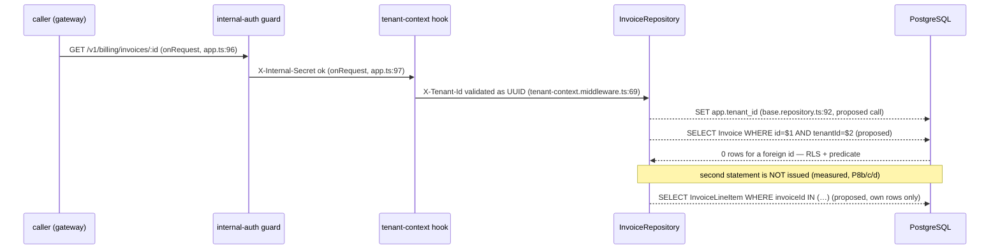

# T-047 · Invoice detail — `GET /v1/billing/invoices/:id`

**Service:** billing-service · **Gate 1 (Task Planner)** · **HEAD at planning:** `21497bd`, tree clean, level with `origin/main`
**Spec:** `docs/epics/epic-8-billing-service.md:113` — *read as a draft, not as a contract* (S-15). Four divergences reported in §3.4.
**Rules revision read:** `.claude/rules/known-gaps.md` **from disk**, 2742 lines, `md5sum ec0bc877032d7848f74494d977cc96cb`, headings `S-5 … S-46`. The copy injected into the planning session ended at **S-39** — an eighth sighting of **S-24**. Every gap cited below was re-read from the file on disk.

**No prior plan exists for T-047.** `ls docs/plans/ | grep -i 047` returns nothing. This is a new plan, not an extension.

---

# Part 1 — for the analyst

## 1. In plain terms

A customer can already ask "show me my invoices" and get a list of headers — period, status, total, currency. They cannot yet ask "show me *that* invoice" and see what it is made of. T-047 adds that: one invoice, plus the priced lines that sum to its total.

**Who notices.** Any tenant-facing UI or API consumer that wants to show a customer why their bill is what it is. Today the total is an unexplained number.

**What it costs if this is wrong.** This is the first thing on the platform to hand out invoice *line items*, and line items live in the one billing table the database does not protect. `InvoiceLineItem` has row-level security switched off and no security policy at all — measured, not assumed. Every other tenant-scoped table on the platform has a policy that quietly refuses to return another customer's rows even when the application code forgets to ask correctly. This table does not. If this endpoint reads line items by the invoice's identifier directly rather than through the invoice itself, it will return another customer's billing detail — the metrics they bought, the quantities, the prices they pay — and nothing in the database will stop it. I measured that exact leak while planning (§3.1); it is a live read, not a theoretical one.

The mitigation is structural rather than vigilant: the endpoint reads line items only as an attachment to an invoice the tenant already proved it owns, and the data layer offers no way to ask for line items by invoice identifier alone. That property exists today and the plan's job is to not spend it.

The second cost, smaller and customer-facing: a bill that shows the same metric twice. That is already true in the database — a late-arriving batch of usage is appended to an existing invoice as its own line rather than merged into the old one — and T-047 is the first thing that renders it. The decision below is to show it honestly (§2, D1).



Solid arrows exist today at the `file:line` shown. Dashed arrows are *proposed* — T-047 does not exist yet. The `Note` is the load-bearing claim and it is measured in §3.1, not reasoned.

## 2. Decisions

### Answered by the user during planning — settled, not open

**D1 · Repeated `metricKey` renders as one JSON line per stored row. (Option A)**

A single invoice can hold two `api.request` lines because `absorbLateUsage` appends rather than merges (`invoice.repository.ts:507-513`). T-047 shows both.

*Rejected — B, group by `metricKey` and sum.* Measured through the **real shipped repository** (§3.2): the two tranches came back as `unitPrice 1` and `unitPrice 5`. `unitPrice` is one column per line, so a merged line has **no correct value** for it — any blend is a rate no meter ever charged, and omitting it silently removes the field the customer most wants. This is S-45's own D1 argument one level down: `Invoice.currency` is one column, so a period whose meters disagree is refused rather than reconciled. Grouping also remains available later as a presentation layer over A, with no migration and no change to what is stored — so A is the reversible choice and B is not.

*Rejected — C, rows plus a grouped `totals` block.* Largest response contract and the most tests, to deliver a view the client can compute itself from A. Not refused on principle; refused on cost against a consumer that does not exist yet.

**D2 · Line items are ordered `metricKey asc, id asc`, both keys as named constants. (Option A)**

*Rejected — B, `id asc` alone.* Deterministic, but `InvoiceLineItem.id` is `@default(uuid())` and the ids Prisma generated in the probe carried version nibble `4` — random — so the order is stable noise and duplicates of one metric scatter apart, which is the opposite of what D1 wants a reader to see.

*Rejected — C, no `orderBy` at all.* **Refuted by measurement, not disliked.** Probe P3: a freshly inserted invoice read back unordered gave `10,20,30`; after a single `UPDATE` of the first row the same read gave `20,30,10`. Postgres returns heap order and an update relocates the tuple. Any test asserting positions would be flaky rather than wrong, which is worse.

Note what D2 **cannot** deliver, because the schema does not record it: `prisma/schema.prisma:145-153` declares six fields — `id`, `invoiceId`, `metricKey`, `quantity`, `unitPrice`, `amount` — with no timestamp and no sequence. **Tranche order is not recoverable from the stored data by any sort key.** "The original lines, then the late ones" is not an option anyone can choose today; it would need a column and a migration. Stated here so a later reader does not think it was overlooked.

### Decided in this plan, with reasoning — small edits if wrong

**D3 · `404` for unknown and for foreign, byte-identical.** One error, `INVOICE_NOT_FOUND`, one body `{ code, message }` matching every other error this service emits. Anything that distinguishes the two is an existence oracle: a caller could enumerate invoice ids and learn which exist on the platform. Proved by a test that asserts the two responses are *deep-equal*, not merely both `404` (§6, `BI29`).

**D4 · The `:id` param is validated as a UUID in its own validator module, and a malformed one is `400 VALIDATION_ERROR`.** Consistent with T-046, which rejects an over-large `pageSize` rather than clamping it (`invoice-list.validator.ts:36-41`). A non-UUID cannot be any tenant's invoice id — `Invoice.id` is `String @default(uuid())` — so `400` leaks nothing that `404` would hide. It is also the honest answer: the request is malformed, not pointed at a missing resource. Rejected: returning `404` for a malformed id to "reduce the surface"; it conflates two diagnoses in the log for no gain.

**D5 · The response is T-046's eight header fields plus `lineItems`, via an explicit Prisma `select`.** `tenantId` is excluded for the reason `INVOICE_HEADER_SELECT` already gives (the caller knows it; echoing it invites a client to key on it), and `invoiceId` is excluded from each line item — it is the parent's `id`, repeated on every row. **Five** line-item fields — `id`, `metricKey`, `quantity`, `unitPrice`, `amount` — matching the epic at `docs/epics/epic-8-billing-service.md:128-132`. (Corrected at the Gate 3 rework, review L-5: this read "Four … (five, …)", and cited `:126-131`, where `:126` is `...InvoiceHeader`, `:127` is `lineItems: Array<{` and `:131` stops one line before `amount`. Re-derived with `grep -n`.)

**D6 · `Decimal` and `Date` normalise in the repository**, reusing `toAmountString` and `toIsoString` (`invoice.repository.ts:201`, `:204`) rather than adding a second helper. `Decimal(18,6)` now has a *second* surface — line-item `quantity`, `unitPrice` and `amount` — where the list endpoint had only `totalAmount`.

**D7 · No `TimeZone` pin, no date predicate, no raw SQL.** A lookup by id binds no timestamp, so S-19's missing pin in billing's `base.repository.ts` cannot bite here. Committed explicitly: if any date predicate is ever added to this path it goes through the ORM (`CLAUDE.md` § *Raw SQL and timestamps*).

**Nothing is left for the user to decide before Gate 3.** D1 and D2 were the two that could have reshaped the plan and both are answered.

## 3. What the planning measured

### 3.1 The leak this endpoint must not open

As `telemetry_app` (`rolsuper=f, rolbypassrls=f`, checked in `pg_roles`), with tenant **B**'s context set, asking about tenant **A**'s invoice:

| Probe | Query | Result |
|---|---|---|
| P1a | `invoice.findFirst({id: A_INV, tenantId: B})` + nested `lineItems` | `null` |
| P1b | `invoice.findFirst({id: A_INV})` — **tenant predicate removed** | `null` |
| **P1c** | **`invoiceLineItem.findMany({where: {invoiceId: A_INV}})`** | **A's two line items, with `metricKey` and `amount`** |
| P1d | `invoiceLineItem.findMany({where: {invoice: {tenantId: B}, invoiceId: A_INV}})` | `[]` |
| **P1e** | **`invoiceLineItem.count({})` — no filter at all** | **3 — every tenant's rows** |

`pg_class`: `InvoiceLineItem` is `relrowsecurity = f`, `relforcerowsecurity = t`, and `pg_policy` returns **zero** policies for it. `Invoice` is `relrowsecurity = t` with `invoice_tenant_isolation` (`polcmd = *`). That is S-10 exactly, measured on this tree.

**P1c and P1e are why `InvoiceRepository` exposes no method taking a bare `invoiceId`, and why T-047 must not add one.** Re-verified on the current tree rather than trusted from the docblock: `grep -nE "^  (private )?async" src/repositories/invoice.repository.ts` returns seven signatures — `tenantExists`, `findByPeriod`, `sumUnbilledByMetricKey`, `markUsageLinesBilled` (private), `createDraftInvoice`, `absorbLateUsage`, `listInvoices` — and none takes one.

### 3.2 The duplicate `metricKey`, driven through the shipped code

`createDraftInvoice` then `absorbLateUsage` on one tenant, one period, one invoice:

```
api.request  qty 10  unitPrice 1  amount 10
api.request  qty 3   unitPrice 5  amount 15
distinct metricKeys = 1 | rows = 2 | distinct unitPrices for api.request = 2
invoice totalAmount = 25 | sum of line amounts = 25
```

Two tranches of one metric, **two different unit prices**. That is D1's evidence.

How the rates come to differ, read from the code rather than driven end to end: `readAndPrice` prices against `findActiveAsOf(metricKeys, periodStart)` (`billing.service.ts:230`; `meter.repository.ts:43-51`, `activeFrom desc`). The meter is chosen by `periodStart` **at the moment of each call**, so two tranches agree unless the rate card changed between them — an operator inserting a `Meter` row with a later `activeFrom` still `<= periodStart`, or closing one with `activeTo`. Reachable by construction; not measured through the HTTP path.

### 3.3 Why the nested `select` is safe, and exactly how far that goes

Prisma 6.19.3 does **not** emit a JOIN for a nested relation `select`. With the query log captured inside the transaction, the own-tenant read emitted:

```
0 BEGIN
1 SELECT set_config('app.tenant_id', $1, true)
2 SELECT "Invoice"."id" FROM "Invoice" WHERE ("Invoice"."id" = $1 AND "Invoice"."tenantId" = $2) LIMIT $3 OFFSET $4
3 SELECT "InvoiceLineItem"."id", "InvoiceLineItem"."invoiceId" FROM "InvoiceLineItem" WHERE "InvoiceLineItem"."invoiceId" IN (…
4 COMMIT
```

Statement 3 **is** the shape P1c showed to be dangerous. What makes it safe is that its `IN` list is bound from statement 2's tenant-filtered result — and that Prisma **skips it entirely** when statement 2 returns nothing. Measured in three forms, counting statements mentioning `"InvoiceLineItem"`:

| Context | `where` | Result | `InvoiceLineItem` statements |
|---|---|---|---|
| A | `{id: A_INV, tenantId: A}` | the invoice | **1** |
| B | `{id: A_INV, tenantId: B}` | `null` | **0** |
| B | `{id: A_INV}` (no tenant predicate) | `null` | **0** |
| A | `{id: <unknown uuid>, tenantId: A}` | `null` | **0** |

**Scope this claim precisely.** It is a behaviour of **@prisma/client 6.19.3 on this schema**, not a guarantee of the schema and not something the database enforces — `InvoiceLineItem` has `relrowsecurity = f` and zero policies, so nothing else is holding it. A Prisma major bump, or enabling the `relationJoins` preview feature (which rewrites nested reads as `LEFT JOIN LATERAL`), changes the emitted SQL and this table must be re-measured before the upgrade lands. The re-verification is exactly the four rows above. Recorded in the repository docblock by slice S5.

**S-46 inverts only partially, and my planning brief was corrected by the measurement.** S-46 says an integration test over an RLS-*enabled* table cannot isolate the application tenant predicate. That still holds for the `Invoice` lookup here — P1a and P1b are both `null`, so **deleting the tenant predicate from the invoice read is invisible to any behavioural test**, exactly as S-46 describes. What *is* isolable on `InvoiceLineItem` is not the predicate but the **routing**: re-routing the line-item read through `tx.invoiceLineItem` keyed by a bare `invoiceId` returns another tenant's rows (P1c). So the falsifiable mutation for the isolation case is the re-route, and §6 specifies it that way. The predicate on the `Invoice` read is kept regardless, because `.claude/rules/tenant-isolation.md` requires it and S-46's own conclusion is "keep the predicate; do not delete one on the evidence that deleting it is green."

### 3.4 Epic divergences — reported, not conformed to

Four, against `docs/epics/epic-8-billing-service.md:113-136`. Same class as S-17, S-29, S-32, S-35, S-42. **None is fixed by this task**; §9 proposes a `known-gaps` entry.

1. **`:115` — "File: `controllers/billing.controller.ts`".** A controller alone cannot deliver this. The change needs a repository method, a service method, a param validator, a route registration and constants. Same defect as S-29's first item and S-32's first item.
2. **`:118` — "Fetch `Invoice` by `id` with `lineItems` included".** No tenant predicate. `.claude/rules/tenant-isolation.md` § *Required* is explicit: "Every tenant-scoped query carries an explicit `tenantId` predicate **and** runs inside `withTenant`. Belt and braces — neither alone." The plan carries the predicate.
3. **`:119` — "Verify `invoice.tenantId === req.tenantId`".** Two problems. It is dead code under RLS — P1a/P1b show the foreign row never arrives, so the comparison can only ever see `true`. And it requires **selecting `tenantId`**, which T-046 deliberately excluded (`INVOICE_HEADER_SELECT`, `invoice.repository.ts:141-150`, pinned by `BU75b`). Conforming to `:119` would reverse a decision another task made on purpose. The plan filters in the `where`, which is where the tenant belongs.
4. **`:122-136` — the response block** declares no ordering for `lineItems` and takes no position on a repeated `metricKey`. D1 and D2 fill both gaps; the epic does not contradict them, it is silent.

### 3.5 `Decimal` is invisible on the wire — the catching assertion must sit below HTTP

`JSON.stringify` of the **un-normalised** repository row and of the normalised one are byte-identical:

```
RAW (Prisma.Decimal objects)  -> {"data":{"totalAmount":"60","lineItems":[{"amount":"20"},…]}}
NORMALISED (String())         -> {"data":{"totalAmount":"60","lineItems":[{"amount":"20"},…]}}
typeof totalAmount = object | instanceof Prisma.Decimal = true
```

`Prisma.Decimal` defines `toJSON`. So a route-level `typeof x === "string"` assertion passes either way — this is exactly BU75/BI18's precedent (`invoice.repository.unit.test.ts:737`, `billing.integration.test.ts:1420`), and line-item `amount`, `quantity` and `unitPrice` inherit it as a *second* Decimal surface.

One trap for the fixture: `String()` on a `Prisma.Decimal` **drops trailing zeros** — `String(new Prisma.Decimal("10.500000"))` is `"10.5"` and `String(new Prisma.Decimal("4.000000"))` is `"4"`. A fixture amount like `"10.000000"` is therefore useless for discriminating; the case must use a value whose 18-significant-digit form does not survive a `Number` round trip, as `BI18` does with `TOTAL_PRECISE`.

## 4. Scope and non-goals

**In scope:** one new read endpoint, its validator, one repository method, one service method, one controller method, constants, and tests at four levels.

**Deliberately left broken / untouched, each with its reason:**

- **S-10 is not closed.** `InvoiceLineItem` RLS stays inert. Fixing it is a migration adding a `tenantId` column or a policy joining `"Invoice"` — the wrong thing to fold into a read endpoint, and S-10's own fix direction says so. `BI9` (`billing.integration.test.ts:604`) stays as the standing marker and stays green; T-047 adds a second marker from the endpoint's own side.
- **S-8 is not fixed.** The `X-Internal-Secret` guard this route sits behind is still `!==` rather than timing-safe (`middleware/internal-auth.middleware.ts`), still `preHandler` in the internal scope, and still writes a literal `401`. The user chose to ship T-047 ahead of it knowingly. Noted, not touched — reaching into that file from a read-endpoint task is the one-task-per-commit objection S-8 itself records.
- **S-37 — `Tenant.deletedAt`.** T-047 makes the same implicit choice billing already made: no `deletedAt` predicate anywhere, so a soft-deleted tenant's invoices are readable. That is not re-derived here; S-37 records it, nothing writes the column, and inventing a policy inside a read endpoint is the silent resolution `CLAUDE.md` forbids.
- **S-19 — billing's `base.repository.ts` has no `TimeZone` pin.** Stays clear of this task because the lookup binds no timestamp (D7). Explicit commitment: any future date predicate on this path goes through the ORM.
- **S-39** — gateway and usage-service still hold their own `x-tenant-id` literal. Billing already derives from the shared constant; nothing to do here.
- **T-048** is not started. No `update`, no repository-wide immutability guard. S-45 already pre-commits what *generate* does with a non-`DRAFT` invoice.
- **No `InvoiceLineItem` index is added.** The table has exactly one index, `InvoiceLineItem_pkey`; `EXPLAIN` on the `invoiceId` filter is a `Seq Scan`. That was measured at **0 rows**, where a Seq Scan is the correct plan and proves nothing about volume. §8 R3 carries it as a risk with the measurement that would settle it.

---

# Part 2 — for the implementer

## 5. Files

**New (3)**

| Path | Contents |
|---|---|
| `apps/billing-service/src/validators/invoice-detail.validator.ts` | `invoiceDetailParamsSchema` — `{ id: uuidSchema }` from `@telemetry/shared-validation`, plus the inferred type |
| `apps/billing-service/tests/invoice-detail.validator.unit.test.ts` | `BU103`–`BU106` |
| `apps/billing-service/tests/billing-invoice-detail.route.test.ts` | `BU115`–`BU120` |

**Changed (12)**

| Path | Change |
|---|---|
| `src/constants.ts` | `BILLING_ROUTES.INVOICE_DETAIL`; `BILLING_RESPONSES.CODE_/MESSAGE_INVOICE_NOT_FOUND`; new `BILLING_INVOICE_DETAIL` block |
| `src/errors/index.ts` | `InvoiceNotFoundError extends AppError` → `404 INVOICE_NOT_FOUND` |
| `src/repositories/invoice.repository.ts` | `InvoiceLineItemView`, `InvoiceDetail`, `INVOICE_LINE_ITEM_SELECT`, `INVOICE_LINE_ITEM_ORDER_BY`, `async findDetailById(id: string)` |
| `src/services/invoice.service.ts` | `async getInvoice(tenantId, params)` → throws `InvoiceNotFoundError` on `null` |
| `src/controllers/billing.controller.ts` | `async getInvoice(request, reply)` |
| `src/routes/billing.routes.ts` | `scope.get(BILLING_ROUTES.INVOICE_DETAIL, …)` |
| `src/validators/index.ts` | barrel export |
| `tests/integration.constants.ts` | `INTEGRATION_INVOICE_DETAIL` fixture vocabulary |
| `tests/integration.fixtures.ts` | `lineItems?` on `InvoiceSpec`, written through the nested `create` |
| `tests/billing.integration.test.ts` | `BI28`–`BI33` |
| `tests/invoice.repository.unit.test.ts` | `BU107`–`BU111` |
| `tests/invoice.service.unit.test.ts` | `BU112`–`BU114` |

(Re-count from the table rather than trusting the numeral in the heading — S-33 is the entry about exactly that failure.)

**Not changed:** `src/app.ts` (the route registers inside the existing guarded scope via `registerBillingRoutes`, so no new hook wiring — `BU120` is what notices if that stops being true), `src/config/container.ts` (`InvoiceService` and `BillingController` are already registered), `prisma/schema.prisma`, any migration, any other service.

### 5.1 The shapes

```
// constants.ts — the route path derives the param name, so the two cannot drift
BILLING_ROUTES.INVOICE_DETAIL = `${BILLING_ROUTES.INVOICES}/:${BILLING_INVOICE_DETAIL.PARAM_ID}`

BILLING_INVOICE_DETAIL = {
  PARAM_ID: "id",
  SORT_FIELD_METRIC_KEY: Prisma.InvoiceLineItemScalarFieldEnum.metricKey,  // verified present
  SORT_FIELD_ID:         Prisma.InvoiceLineItemScalarFieldEnum.id,
  SORT_DIRECTION_ASC:    Prisma.SortOrder.asc
}
```

Field names come from Prisma's generated `InvoiceLineItemScalarFieldEnum` and the direction from `SortOrder`, matching `BILLING_INVOICE_LIST`'s existing discipline (`constants.ts:219-221`) — a schema rename becomes a compile error rather than a runtime surprise. Both enums verified to exist on `@prisma/client` 6.19.3.

```
// invoice.repository.ts
const INVOICE_LINE_ITEM_SELECT = { id, metricKey, quantity, unitPrice, amount } // no invoiceId
const INVOICE_LINE_ITEM_ORDER_BY = [
  { [SORT_FIELD_METRIC_KEY]: SORT_DIRECTION_ASC },
  { [SORT_FIELD_ID]: SORT_DIRECTION_ASC }
]

interface InvoiceLineItemView { id, metricKey, quantity: string, unitPrice: string, amount: string }
interface InvoiceDetail extends InvoiceHeader { lineItems: readonly InvoiceLineItemView[] }

async findDetailById(id: string): Promise<InvoiceDetail | null>
```

**The signature takes an `id` and no tenant** — identical in shape to `listInvoices(query)`: identifiers in, tenant from `this.where({})`. That is the convention the repository docblock at `:106-124` asks T-047 to inherit, and it is a *convention*, not a type-level impossibility: that docblock records three measured probes showing `where<T extends { tenantId?: never }>` rejects only feeding a caller-supplied tenant *into `this.where(...)`*, and that both `findById(id, tenantId)` and a hand-built `where: { id, tenantId }` compile clean. Do not restate it as compiler-enforced.

`findFirst`, not `findUnique`. Both work — `findUnique({ where: { id, tenantId } })` is legal at Prisma 6.19.3 (extended `where` unique, GA since 5.0) and compiles to **identical** SQL, `LIMIT/OFFSET` included, measured side by side. `findFirst` is chosen because it composes with `this.where({ id })` without depending on that feature.

## 6. Slices

Pseudo-TDD per `docs/task-implementer-workflow.md`: all tests written before any implementation, **confirmed red as its own named slice**, then implement bottom-up.

### S1 · Constants, error, fixture vocabulary — no behaviour
Controlling path: `src/constants.ts`, `src/errors/index.ts`, `tests/integration.constants.ts`, `tests/integration.fixtures.ts` (`InvoiceSpec.lineItems`).
*Falsified if:* `pnpm --filter @telemetry/billing-service typecheck` reports an error, or `BILLING_ROUTES.INVOICE_DETAIL` does not evaluate to `/v1/billing/invoices/:id`. The existing suite must stay green — this slice adds declarations only.

### S2 · Write every test file, **confirm red**
Controlling path: the five test files in §5.
*Falsified if:* any new case passes before the implementation exists, or the suite fails only with module-resolution errors and no assertion failures once the modules are stubbed. **Record the verbatim failure output per case** — `.claude/rules/testing.md`: a test that never failed proves nothing. Expect TS errors first (missing exports), then assertion failures once stubs return `null`/`undefined`.

Two reds are specifically required and must be captured:
- `BI28` red before `findDetailById` exists (the endpoint 404s or the route is absent).
- **`BI30` red under the re-route mutation** — see §7. This is the slice that must not be skipped, because it is the only evidence the isolation case guards anything (S-46's whole lesson).

### S3 · The param validator
Controlling path: `src/validators/invoice-detail.validator.ts`, exercised by `invoiceDetailParamsSchema.safeParse`.
*Falsified if:* `BU103`–`BU106` do not all go green, or a non-UUID parses successfully.

### S4 · `InvoiceRepository.findDetailById`
Controlling path: `invoice.repository.ts`, inside `withTenant`, `where: this.where({ id })`, nested `lineItems: { select, orderBy }`.
*Falsified if:* `BU107`–`BU111` are not green; or if the emitted Prisma args carry `include` rather than `select`; or if `tx.invoiceLineItem` is called at all (`BU109` asserts the double's `invoiceLineItem.findMany` was never invoked).

### S5 · `InvoiceService.getInvoice`
Controlling path: `invoice.service.ts`, resolving the repository from the injected factory and mapping `null` → `InvoiceNotFoundError`.
*Falsified if:* `BU112`–`BU114` are not green, or the service constructs a repository outside the factory.

### S6 · Controller + route registration
Controlling path: `billing.controller.ts:getInvoice`, `billing.routes.ts`.
*Falsified if:* `BU115`–`BU120` are not green; in particular if `BU120` shows `/health` or the internal route answering `401`, which would mean the route was registered on the root instance rather than inside the guarded scope.

### S7 · Integration, then docblocks
Controlling path: `billing.integration.test.ts`, then the comments recording §3.3's Prisma-version scope on `findDetailById` and the S-10 note.
*Falsified if:* `BI28`–`BI33` are not green against live Postgres as `telemetry_app`; or if the row counts after the suite are not back to `Tenant` 2 and the other five at 0.

## 7. Test plan

New: **18 unit/route cases** (`BU103`–`BU120`) and **6 integration cases** (`BI28`–`BI33`). Highest existing ids re-derived at planning: `BU102b` and `BI27`.

### Unit — validator (`invoice-detail.validator.unit.test.ts`)
| Id | Asserts |
|---|---|
| `BU103` | a valid UUID parses and yields `{ id }` unchanged, byte-identical |
| `BU104` | a non-UUID (`"abc"`) is rejected |
| `BU105` | an empty string and a UUID with surrounding whitespace are both rejected — no trimming, no normalisation |
| `BU106` | **`uuidSchema` is permissive about version and variant, and the case pins that rather than assuming.** Measured against `z.string().uuid()` at zod 3.25.76: v1, v7, a version nibble of `0`, an invalid variant nibble of `c`, the nil UUID and an uppercase value **all parse `true`**; a leading space and the empty string parse `false`. So the validator guarantees *shape*, not *version* — the nil UUID reaches the repository and simply matches nothing. Note `tenantIdSchema` is the same `uuidSchema` (`packages/shared-validation/src/index.ts:19`, `:38`), so this is the platform's existing behaviour on `X-Tenant-Id`, not a new looseness introduced here |

### Unit — repository (`invoice.repository.unit.test.ts`)
| Id | Asserts |
|---|---|
| `BU107` | the `where` sent to `invoice.findFirst` is exactly `{ id, tenantId }` with the **bound** tenant — the shape case S-46 says is the only thing that catches a predicate deletion |
| `BU108` | the `select` carries exactly the eight header keys plus `lineItems`, no `tenantId`, no `include` — the `BU75b` pattern extended |
| `BU109` | **`tx.invoiceLineItem` is never touched.** The double's `invoiceLineItem.findMany`/`findUnique`/`count` all assert `not.toHaveBeenCalled()`. This is the `BU99` pattern and it is what makes the routing property a test rather than a grep |
| `BU110` | the nested `orderBy` is `[{metricKey: asc}, {id: asc}]` **from the constants**, not literals |
| `BU111` | `null` from Prisma returns `null` from the method — no throw at this layer |

The helper that locates a Prisma call must **throw** when the call is missing, not return `undefined` — `firstArg(mock.invoiceFindFirst, "invoice.findFirst")`, matching the existing `firstArg` in this file (`.claude/rules/testing.md`).

### Unit — service (`invoice.service.unit.test.ts`)
| Id | Asserts |
|---|---|
| `BU112` | the repository is built through the injected factory with the request's tenant, and the detail is returned unchanged |
| `BU113` | `null` from the repository becomes `InvoiceNotFoundError` with `statusCode` `BILLING_RESPONSES.HTTP_STATUS_NOT_FOUND` and code `CODE_INVOICE_NOT_FOUND` |
| `BU114` | a repository rejection propagates unchanged — the controller owns status mapping (`invoice.service.ts:21`) |

### Route (`billing-invoice-detail.route.test.ts`, service stubbed on the real container)
| Id | Asserts |
|---|---|
| `BU115` | no `X-Internal-Secret` → `401 UNAUTHORIZED`, and `getInvoice` **never called** |
| `BU116` | doubly-invalid request answers `UNAUTHORIZED` not `TENANT_CONTEXT_MISSING` — the `BU79` shape, the only one that observes hook order |
| `BU117` | authenticated + tenant-scoped → `200 { data: … }`, and `getInvoice` called with the validated tenant and the parsed `id` |
| `BU118` | malformed `:id` → `400 VALIDATION_ERROR`, `getInvoice` never called |
| `BU119` | the response object carries exactly the eight header keys plus `lineItems`; no `tenantId`; each line item has exactly five keys and no `invoiceId`; `typeof amount === "string"` — **with the inline caveat that this last assertion cannot see a Decimal leak** (§3.5), pointing at `BI33` |
| `BU120` | `/health` and `POST /v1/internal/billing/generate` still answer without a tenant header — the `BU83` shape, proving the new route did not drag hooks onto the root instance |

### Integration (`billing.integration.test.ts`, seeded through `DIRECT_DATABASE_URL`, asserted through `telemetry_app`)
| Id | Asserts |
|---|---|
| `BI28` | own invoice with two line items → `200`, eight header fields, both lines, totals matching |
| `BI29` | **the 404 oracle case.** Unknown UUID and tenant B's real invoice id, both requested as tenant A. Assert `statusCode` equal, and `expect(unknownBody).toEqual(foreignBody)` — deep-equal, not merely both `404`. A differing `message` would fail this and a status-only assertion would not |
| `BI30` | **the isolation case.** Tenant A holds an invoice with line items; tenant B requests it by id → `404`, and a direct owner-connection read confirms A's line items still exist (so the `404` is refusal, not absence). **The mutation this is written against is the re-route**, see below |
| `BI31` | **D1/D2.** One invoice carrying two `api.request` lines at different unit prices plus one `storage.write` line → the response has **three** lines, ordered `api.request, api.request, storage.write`, and the two `api.request` lines carry **different** `unitPrice` values. Seeded with ids that make `id asc` a decidable tie-break rather than accidental |
| `BI32` | malformed `:id` → `400 VALIDATION_ERROR`; `BI9`'s sibling marker: a raw owner-connection read confirms `InvoiceLineItem` rows for another tenant are still visible under the wrong context, so **closing S-10 turns this red deliberately** |
| `BI33` | **`Decimal(18,6)` precision.** Asserts the wire value *and* then calls `repository.findDetailById` directly, asserting `typeof lineItems[0].amount === "string"`, `not.toBeInstanceOf(Prisma.Decimal)`, and that the value is not the float-round-tripped form — the `BI18` pattern, now on a line-item amount. Fixture amount chosen so `String(Number(x)) !== x` (§3.5's trailing-zero trap) |

**The mutation `BI30` is written against, stated precisely.** Replace the nested `lineItems` select with a second statement:

```
const invoice = await tx.invoice.findFirst({ where: this.where({ id }), select: INVOICE_HEADER_SELECT });
const lineItems = await tx.invoiceLineItem.findMany({ where: { invoiceId: id }, select: INVOICE_LINE_ITEM_SELECT });
return { ...invoice, lineItems };            // note: no early return on a null invoice
```

Under that edit, tenant B's request for A's invoice returns A's line items (P1c), so `BI30` must go red. **Confirm it at S2 and record the verbatim output.** If it does not go red, that is a finding and the case is measuring something else — say so rather than shipping it.

**What `BI30` cannot do, stated plainly.** It cannot isolate the tenant *predicate* on the `Invoice` read. P1a and P1b are both `null`, so deleting `tenantId` from `this.where({ id })` leaves every integration case green — `"Invoice"` RLS supplies the same answer. That is **S-46**, and `BU107` is the shape case that stands in for it, exactly as `BU98` does for `absorbLateUsage`. Keep the predicate regardless.

### Acceptance-coverage mapping

The epic states no numbered ACs, so these are derived from `:113-136` plus the decisions above.

| AC | Statement | Proven by |
|---|---|---|
| AC1 | A tenant can fetch its own invoice with its line items, `200` | `BU117`, `BI28` |
| AC2 | Unknown id and another tenant's id are indistinguishable `404`s | `BU113`, **`BI29`** (deep-equal), `BI30` |
| AC3 | A malformed id is `400 VALIDATION_ERROR`, before any repository is built | `BU104`, `BU105`, `BU118`, `BI32` |
| AC4 | The route sits behind internal-auth then tenant-context, both `onRequest`, in that order | `BU115`, `BU116`, `BU120` |
| AC5 | No `Prisma.Decimal` and no `Date` leaves the repository | `BU111`, **`BI33`** (below HTTP) |
| AC6 | `tenantId` and `invoiceId` never appear in the response | `BU108`, `BU119` |
| AC7 | A repeated `metricKey` renders as separate lines, deterministically ordered (D1, D2) | `BU110`, **`BI31`** |
| AC8 | Line items are reachable only through the `Invoice` relation; no method takes a bare `invoiceId` | **`BU109`**, `BI30`, plus the `grep -nE "^  (private )?async"` check re-run at Gate 3 |

### T-049 residue

The router judged T-049 largely delivered as payload of T-045/T-046/S-45, with two cases uncovered (`docs/epics/epic-8-billing-service.md:184-185`):

- **"Invoice detail for different tenant's invoice → `404`" — closed here, by `BI30`** (the refusal) together with `BI29` (that it is indistinguishable from an unknown id, which the epic's one-liner does not ask for and which is the part that matters).
- **"Attempt to update `FINALIZED` invoice → `409 INVOICE_IMMUTABLE`" — not closed here.** S-45 covers the *generate/absorb* path (`BI23`); the *update* path is T-048's, and T-048 has no `update` method to test yet. T-047 adds nothing to it.

So T-047's test slice absorbs one of the two. Say that rather than claiming T-049 is done.

## 8. Validation

Task-scoped first, while iterating:

```
pnpm --filter @telemetry/billing-service exec vitest run tests/invoice-detail.validator.unit.test.ts
pnpm --filter @telemetry/billing-service exec vitest run tests/invoice.repository.unit.test.ts
pnpm --filter @telemetry/billing-service exec vitest run tests/billing-invoice-detail.route.test.ts
pnpm --filter @telemetry/billing-service exec vitest run tests/billing.integration.test.ts
pnpm --filter @telemetry/billing-service typecheck
pnpm --filter @telemetry/billing-service lint
pnpm --filter @telemetry/billing-service test
```

`pnpm --filter <pkg> test -- <file>` does **not** scope to a file — vitest runs the whole package suite (`CLAUDE.md`, `.claude/rules/testing.md`). Use `exec vitest run <file>`.

Full gate before handoff, **with `--force`** so turbo replays nothing:

```
pnpm build --force && pnpm test --force && pnpm lint --force && pnpm typecheck --force
```

All 13 packages reported. `pnpm format:check` is **not** run — S-12: it cannot pass on any revision of this repository and no CI step invokes it.

Post-suite database check, every time:

```
psql -h localhost -U postgres -d telemetry -Atc 'SELECT (SELECT count(*) FROM "Tenant"), (SELECT count(*) FROM "Invoice"),
  (SELECT count(*) FROM "InvoiceLineItem"), (SELECT count(*) FROM "UsageLine"), (SELECT count(*) FROM "Event"), (SELECT count(*) FROM "Meter");'
```
Expected `2|0|0|0|0|0`. The two `Tenant` rows are S-20 residue from auth-service and are **left alone**.

## 9. Risks

| # | Risk | Mitigation |
|---|---|---|
| **R1** | **A later change adds a repository method taking a bare `invoiceId`.** P1c shows that is a live cross-tenant read and the database will not stop it. | `BU109` fails if the line-item read moves off the relation. The docblock at `:217-227` already states the property; slice S7 extends it with §3.1's measurement. It is a **convention plus one test**, not a compiler guarantee — do not write it up as unrepresentable. |
| **R2** | **A Prisma major upgrade, or enabling `relationJoins`, changes the emitted SQL** and §3.3's suppression no longer holds. | Recorded in the `findDetailById` docblock with the exact four-row re-verification (§3.3). `BU109` catches a code-level re-route but **not** a Prisma-level plan change, because the call surface would be unchanged — stated as a limit, not papered over. |
| **R3** | **No index on `InvoiceLineItem.invoiceId`.** The only index is `InvoiceLineItem_pkey`; `EXPLAIN` gave a `Seq Scan`. | Measured at **0 rows**, where a Seq Scan is correct and proves nothing. Not an index claim in either direction. Settle it with `EXPLAIN (ANALYZE)` at realistic volume before adding an index; adding one speculatively inside this task would be a migration with no measurement behind it. |
| **R4** | **The isolation case passes vacuously** — green whether or not the routing property holds. | S2 requires the re-route mutation to be applied and `BI30`'s redness captured verbatim. S-46 and S-38 are both worked examples of a guard that turned out to be decoration. |
| **R5** | `String()` drops trailing zeros, so a fixture like `"10.000000"` cannot discriminate a Decimal leak. | `BI33` uses an 18-significant-digit value on the `BI18` pattern and asserts against the float-round-tripped form. |
| **R6** | **Integration fixtures leak**, the S-20 shape. | `InvoiceSpec.lineItems` writes through the existing nested `create`; `fixtures.reset` already deletes line items by `invoice: { tenantId: { in: ids } }` (`integration.fixtures.ts:320-329`), so no new teardown path is needed. Suite already tears down in **both** `afterEach` and `afterAll` under a stable prefix. Re-count the five tables after every run. |
| **R7** | `readLineItems` orders by `metricKey` alone (`integration.fixtures.ts:311-318`), which is **not** a total order once two rows share a key — `BI31` seeds exactly that. | `BI31` asserts against the *response*, which carries D2's two-key order. Do not assert `BI31`'s ordering off `readLineItems`; if the fixture helper is used for a cross-check, add `id` as a second key in the same slice. |
| **R8** | The `409`/`422` contract changes S-45 introduced (`known-gaps` S-45 residual 5) touch the *generate* path only. | T-047 adds no write path and no new status. No interaction. |

## 10. Pending task checklist

- [done] S1 constants, error class, fixture vocabulary — typecheck clean, existing suite green
- [done] S2 all five test files written; **red confirmed and captured verbatim**, including `BI30` under the re-route mutation
- [done] S3 validator green (`BU103`–`BU106`)
- [done] S4 repository green (`BU107`–`BU111`); `grep -nE "^  (private )?async" invoice.repository.ts` re-run and the count re-derived in the docblock, not copied
- [done] S5 service green (`BU112`–`BU114`)
- [done] S6 controller + route green (`BU115`–`BU120`)
- [done] S7 integration green (`BI28`–`BI33`); docblocks record §3.3's Prisma-version scope and §3.1's measurement
- [done] Task-scoped lint / typecheck / test green
- [done] Full gate `--force`, 13/13 packages, pre-existing warnings distinguished with `git diff --name-only` / `git log -1 <file>`
- [done] Database re-counted: `Tenant` 2, other five 0
- [done] `known-gaps.md`: added **S-47** (next free id re-derived from disk; headings ran S-5..S-46). Whether it lands in this commit is for the reviewer — a new entry for §3.4's four epic-vs-code divergences in the **T-047** section of `epic-8-billing-service.md` — a new id, not an extension of S-29/S-32/S-35/S-42, whose titles are each scoped to their own section (the objection S-32 records for not folding into S-29). Decide with the reviewer whether it lands in this commit
- [done] Nothing staged, committed or branched

## 11. Approval gate

**Planning is complete and stopped here. No production code and no tests have been written.**

Two decisions were put to the user during planning and answered; they are settled and are recorded in §2 as D1 and D2, with the measurements behind the rejected options:

| # | Decision | Chosen | Rejected, and why |
|---|---|---|---|
| **D1** | Rendering a repeated `metricKey` | **A — one JSON line per stored row** | **B (group and sum)**: measured two tranches at `unitPrice` 1 and 5, and `unitPrice` is one column per line, so a merged line has no correct value and any blend is a rate no meter ever charged; grouping stays available later as a presentation layer over A with no migration. **C (rows + grouped totals)**: largest contract and most tests for a view the client can compute |
| **D2** | Line-item ordering | **A — `metricKey asc, id asc`, both as named constants** | **B (`id asc`)**: v4 uuids, so stable noise, and duplicates scatter. **C (no `orderBy`)**: **refuted by measurement** — P3 read `10,20,30` fresh and `20,30,10` after one `UPDATE` |

Decided in this plan without asking, each a small edit if wrong: **D3** identical `404` for unknown and foreign, proved deep-equal; **D4** UUID param validation in its own validator, `400` on malformed; **D5** eight header fields plus five-field line items, `tenantId` and `invoiceId` excluded by explicit `select`; **D6** normalise in the repository, reusing the existing helpers; **D7** no date predicate, so no `TimeZone` exposure, with an explicit ORM-only commitment if one ever appears.

**Nothing remains for the user to decide before Gate 3.**

Proposed slice order: **S1 → S2 (confirm red) → S3 → S4 → S5 → S6 → S7**.

**Awaiting approval to proceed to Gate 2 (Task Implementer).**

---

## 12. Gate 3 rework — answering Gate 4's `CONDITIONAL`

Round 1 of `docs/reviews/t-047-invoice-detail-endpoint.md` cleared the change with no BLOCKER and
no HIGH, and required four fixes. All four are done, plus the three recommended ones. Every
mutation below was re-performed at this rework rather than quoted from the review, and each names
the suite it was run against.

| Item | What changed | Measured |
|---|---|---|
| **M-1** | `billing-invoice-detail.route.test.ts` BU115's comment — the false "makes this a 200 carrying an invoice" | Mutation re-performed (detail route re-registered with `app.get(...)` on the root instance). **That file:** `4 failed \| 2 passed (6)` — BU115/BU116 `expected 400 to be 401`, BU117 `expected 400 to be 200`, BU119 `TypeError`. **Whole package:** `9 failed \| 198 passed (207)` across 2 files, adding BI28–BI31 and BI33. (Totals re-derived at the Gate-5 rework: this cell first read `196 passed (205)`, the **pre-M-2** package size, because the mutation was re-run before `BU121`/`BU122` landed and the arithmetic was not revisited — Gate 5's F-3. The nine red cases, the two files and the file-scoped `4 failed \| 2 passed (6)` were all re-confirmed unchanged on the shipped tree.) Body captured through `app.inject`: `{"code":"VALIDATION_ERROR","message":"Missing tenantId from context"}` — a 400, no invoice. Same correction T-046's Gate 4 made about its own scope mutation |
| **M-2** | `BU121`/`BU122` added to `tests/billing.controller.unit.test.ts`, mirroring T-046's `BU89`/`BU91` | Both **green on first run** (test-only addition). Redness by mutation, whole package each time: deleting `getInvoice`'s `!tenantId` block → `1 failed \| 206 passed (207)`, BU121 alone; deleting its `logger.error` + 500 tail → `1 failed \| 206 passed (207)`, BU122 alone. Third mutation, because a status assertion would not notice: adding `detail: error.message` to the 500 body reddens BU122 on the deep-equal |
| **M-3** | Nothing shipped carried "reddens `BU120` alone" — grepped every changed and new file. `BU120`'s comment now records the real red set and its disposition | Hooks-to-root mutation re-performed against the **whole package**: `26 failed \| 181 passed (207)` across 6 files. `BU120` **kept**: it is a co-regression with `BU83` — both observe one app's hook topology, so no mutation separates them — but the property is two `app.inject` calls and each route suite should still carry it if the other is split or retired. The comment forbids citing it as detail-route-specific evidence |
| **L-1** | `integration.fixtures.ts` `readLineItems` docblock — the false "every existing caller either counts rows, filters them, or sorts" | Counter-examples confirmed by reading them: `BI1` (`:194-195`), `BI8` (`:498-499`), `BI13` (`:580-587`) index positionally. The conclusion re-measured independently: reverting the tie-break to `orderBy: { metricKey: "asc" }` left `billing.integration.test.ts` at `36 passed (36)` on **3 of 3** runs. Docblock now states the measurement and the distinct-`metricKey` reason |
| **L-2** | `invoice-detail.validator.ts` and `BU106`'s comment — "`tenantIdSchema` is the same `uuidSchema`" | It *derives* from it (`packages/shared-validation/src/index.ts:38`, `uuidSchema.transform(...)`). Acceptance re-measured over **15 forms**: 9 accepted, 6 rejected, **0 disagreements**, and the parsed value identical on every accept. Wording corrected in both places |
| **L-3** | One declaration each of the five line-item field names and the nine detail-response keys, in `tests/integration.constants.ts` (`LINE_ITEM_FIELDS`, new `DETAIL_RESPONSE_FIELDS`), imported by the route, repository-unit and integration suites | Was three copies each — the third copy `.claude/rules/constants.md` asks to be promoted before. Deliberately **not** derived from `INVOICE_HEADER_SELECT` / `INVOICE_LINE_ITEM_SELECT`, which would compare the production `select` with itself |
| **L-4** | `integration.fixtures.ts:374` now uses `BILLING_INVOICE_DETAIL.SORT_FIELD_*` / `SORT_DIRECTION_ASC` | Same constants as the production sort, so a schema rename is a compile error in the fixture too |
| **L-5** | §2 D5 — "**Four** line-item fields … (five …)" and the wrong epic range | Five, and the epic range re-derived with `grep -n`: `docs/epics/epic-8-billing-service.md:128-132` |

**Also corrected, not raised by the review** (an S-33-class stale count in this task's own diff):
`tests/invoice-detail.validator.unit.test.ts` described "the nine forms BU106 measures". Counted
mechanically off the two loop literals: **7 accepted and 3 rejected, ten in all**, and the six
constants that comment annotates are six. Fixed there and in the sentence L-2 added.

**Not opened, deliberately:** the *eight*-field `InvoiceHeader` list is also declared three times
(`billing-invoices.route.test.ts:23-32`, `billing.integration.test.ts:1293`,
`invoice.repository.unit.test.ts:806`). All three are T-046's and none is touched by this diff;
promoting them would put a T-046 test refactor inside T-047's commit.

### Gate 4 decisions, as answered by the user

| # | Answer | Effect on the diff |
|---|---|---|
| **D-A** | **A — ship the shape as convention; record the type-level narrowing** | No production change. Recorded as **S-48** in `.claude/rules/known-gaps.md`, with a cross-reference added to S-19's fix direction so the unification task inherits it, and a pointer from `findDetailById`'s docblock. `TransactionClient` is **not** narrowed |
| **D-B** | **A — S-47 lands in this commit as written** | No change; the entry was already written |

**S-48 re-derived at this rework, not copied from the review.** Four `tsc --noEmit` steps: the
`tx.invoiceLineItem` re-route compiles clean today; `| "invoiceLineItem"` in `TransactionClient`'s
`Omit` makes it `TS2339` at `invoice.repository.ts(733,16)` plus two `TS2345` at `:467`/`:626`;
narrowing `markUsageLinesBilled`'s parameter clears both; the two narrowings alone typecheck clean
with `207 passed (207)`. **And one thing the review did not state, measured as step E:** with both
narrowings in place, `this.prisma.invoiceLineItem.findMany({ where: { invoiceId: id } })` in the
same method still compiles clean, because `TenantScopedRepository` holds a full `PrismaClient`. So
the guarantee is "a `tx` re-route becomes `TS2339`", not "unrepresentable" — S-48 says so.

**One correction carried from the brief.** Gate 4's review attributes the 14 pre-existing lint
warnings to two commits that are not the ones `git log` gives. Re-derived here:
`git log -1 --format="%h %ad" -- apps/auth-service/tests/auth.service.unit.test.ts` returns
**`d68e719`, 2026-08-25**, and the same command for
`apps/usage-service/tests/ingestion.service.unit.test.ts` returns **`b0f6921`, 2026-08-31**. The
pre-existence conclusion is unaffected — it rests on neither file appearing in
`git status --porcelain` — but the review's two hashes are deliberately not reproduced in any
comment, gap entry, plan line or commit message.

### Counts after the rework

`BU121` and `BU122` are **two new cases**, so billing moves **205 → 207** and the root total
**942 → 944**. The review's closing line ("none of them should move a test count, so 205 / 942
should hold") is inconsistent with its own M-2, which requires two new cases.

### Rework checklist

- [done] M-1 comment replaced with the measured outcome; mutation re-performed at file and package scope
- [done] M-2 `BU121`/`BU122` written, green-on-first-run stated honestly, three mutations run to establish redness
- [done] M-3 claim confirmed absent from every shipped file; `BU120` disposition decided and recorded
- [done] L-1 docblock rewritten to the measurement; 3 runs re-measured
- [done] L-2 wording corrected in both places; 15 forms re-measured
- [done] L-3 / L-4 / L-5 worked
- [done] D-A recorded as S-48 (next free id re-derived from disk: headings ran S-5..S-47, `md5sum 39b3d07c0f19cfd2ab5cb09ac7f30d97`, 2802 lines)
- [done] Billing suite 207/207; full root gate `--force`; `pnpm test:smoke`
- [done] Database re-counted; every mutation reverted; nothing staged, committed or branched

## 13. Gate 5 rework — answering QA's three stale counts

`docs/qa/t-047-invoice-detail-endpoint.md` returned **PASS** with three documentation defects, all
of them counts in artifacts that ship. No production code and no test logic changed in this round;
the only code-file edit is one docblock sentence in `tests/integration.fixtures.ts` (O-1 below).

| Item | Correction | Re-derived here by |
|---|---|---|
| **F-1** | `.claude/rules/known-gaps.md` S-47 item 1: `12 changed` → **13**, with both commands written into the entry | `git status --porcelain apps/billing-service \| grep -c '^??'` → **3**; `… \| grep -c '^ M'` → **13** |
| **F-2** | S-48 step B recast to cite **method and symbol** rather than `file(line,col)` | Steps A+B re-applied and `pnpm --filter @telemetry/billing-service exec tsc --noEmit -p tsconfig.json` re-run: `TS2339` at `(740,16)`, `TS2345` at `:467` and `:626`. The `TS2339` line is the mutation's *own inserted line*, which is why it moved 733 → 740 while the two `TS2345` did not; `markUsageLinesBilled`'s parameter re-derived at `:407` with `grep -n` |
| **F-3** | §12 M-1 row: `9 failed \| 196 passed (205)` → `9 failed \| 198 passed (207)` | Scope mutation re-applied (detail route on the root instance) and the package re-run: `Test Files 2 failed \| 17 passed (19)`, `Tests 9 failed \| 198 passed (207)`; the same file alone `4 failed \| 2 passed (6)`. Red set `BU115`, `BU116`, `BU117`, `BU119`, `BI28`–`BI31`, `BI33` — unchanged |

**The rest of §12's table audited rather than assumed**, because F-3 is a class and not an
incident. Every other figure in it re-derives on the shipped tree:

- **M-2**, both package-scoped rows: deleting `getInvoice`'s `!tenantId` block → `1 failed \| 206
  passed (207)`, `BU121` alone; deleting its `logger.error` + 500 tail → `1 failed \| 206 passed
  (207)`, `BU122` alone. Re-run here, both exact.
- **M-3** `26 failed \| 181 passed (207)` and **L-1** `36 passed (36)` × 3: re-performed by Gate 5's
  QA and reported exact. Not re-run a third time here.
- **L-2**'s 15 forms: re-run against the built `@telemetry/shared-validation` at zod **3.25.76** —
  the seven accepts `BU106` loops over plus version nibble `8` and variant nibble `f`, against
  leading space, trailing space, empty, `abc`, braced and unhyphenated. **9 accepted, 6 rejected,
  0 disagreements between `uuidSchema` and `tenantIdSchema`, and an identical parsed value on every
  accept.** Exact.
- **§12's "Counts after the rework"** (`205 → 207`, `942 → 944`) and the `207 passed (207)` in the
  S-48 paragraph were already post-M-2 and are unchanged.

### QA's three ungraded observations

| # | Disposition |
|---|---|
| **O-1** — the `readLineItems` tie-break is unfalsifiable | **Recorded, not filed.** One sentence added to that docblock saying no case goes red when the tie-break is removed and it must not be deleted on that evidence — the S-28 hazard. No gap id: the hazard has exactly one reader, whoever edits that method, and the docblock is where they are |
| **O-2** — trailing zeros drop on the wire (`10.500000` → `"10.5"`) | **No change; already recorded in production code.** `invoice.repository.ts`'s `toAmountString` docblock states the measurement, names it deliberate, and says a fixed-scale format is one decision for both endpoints. That text predates this diff (it is in `git show HEAD:…`), so the behaviour is T-046's convention and not T-047's to change |
| **O-3** — an uppercase UUID is accepted then matches nothing | **No change; already recorded, with its scope.** `BU106`'s comment states that these forms reach the repository and yield a `404` not a `400`, that `tenantIdSchema` has accepted the same set since before this task, and that tightening the shared schema would change every service's tenant header in one edit. A gap id would add nothing that comment does not already say |

### Round-2 checklist

- [done] F-1 corrected in S-47 with both commands inline, and one sentence noting the instance landed inside the file whose S-33 entry catalogues the pattern
- [done] F-2 recast to method+symbol; the mutation re-run rather than the number incremented
- [done] F-3 corrected; the whole of §12 re-audited for the same class
- [done] O-1/O-2/O-3 dispositions decided and recorded
- [done] Every mutation reverted and the tree re-checksummed; `git status --porcelain` back to the T-047 set
- [done] Billing suite, full root gate `--force`, `pnpm test:smoke`
- [done] Nothing staged, committed or branched

## 14. Gate 3 rework round 3 — answering Gate 6's `CONDITIONAL`

Three items, all comment- or docs-only. **No production behaviour changed and no test logic
changed:** `diff` of `billing.routes.ts` against its pre-round state has **0** non-comment
changed lines, and 18 of the 20 changed/new files re-checksum byte-identical to the pre-round
baseline (the two that differ are the two edited here). Billing stays **207**, root **944**.

| Item | What changed | Measured at this round |
|---|---|---|
| **M-4** (required) | `src/routes/billing.routes.ts` docblock — `BU120` removed from the detail-route citation, replaced with the measured red set | Mutation re-performed here, not quoted: detail route deleted from `registerBillingRoutes` and re-registered as `app.get(...)` on the root instance. `--reporter=verbose` on `tests/billing-invoice-detail.route.test.ts`: `× BU115 × BU116 × BU117 ✓ BU118 × BU119 ✓ BU120`, `Tests 4 failed \| 2 passed (6)`. Whole package: `Tests 9 failed \| 198 passed (207)`, `Test Files 2 failed \| 17 passed (19)` — BU115, BU116, BU117, BU119, BI28, BI29, BI30, BI31, BI33. **`BU120` is not in the red set.** This is the M-1 class recurring in a production file after being corrected in a test file |
| **L-6** (user decision: fix alongside M-4) | Same docblock — "an unauthenticated, untenanted read of every invoice on the network" corrected to unauthenticated *reachability* | Pre-existence confirmed first: `git show HEAD:apps/billing-service/src/routes/billing.routes.ts` carries the sentence verbatim at `:10`, so it is T-046's and the docblock now says so. Outcome re-derived rather than copied: under the same root-registration mutation, an `app.inject` carrying **no** headers with `invoiceService.getInvoice` stubbed to return an invoice gave `status=400 body={"code":"VALIDATION_ERROR","message":"Missing tenantId from context"} serviceCalled=0`. Both handlers carry the same `if (!tenantId)` block (`billing.controller.ts`, the `listInvoices` and `getInvoice` arms), so the correction covers both routes |
| **Gap entry** (user decision) | `.claude/rules/known-gaps.md` **S-49** — nothing mechanically notices a Prisma upgrade that would invalidate the `InvoiceLineItem` statement suppression | Next free id re-derived from disk, not from the injected copy: `grep -n "^## S-"` on the 2886-line file (`md5 b8dbb84d9e18b97b3c15d0c5d0ffbc5e`) ran S-5..**S-48**. Entry appended; the first 2886 lines re-hash to the same md5, so nothing above it was touched |

### S-49's load-bearing claims, each re-derived here

- **The suppression, 1/0/0/0.** A node script using the generated client with query logging, issuing `findDetailById`'s exact nested select inside `$transaction` after `set_config('app.tenant_id', …, true)`, counting logged statements containing `"InvoiceLineItem"`: own-tenant `totalStatements=5 InvoiceLineItem=1`; foreign, predicate-removed and unknown-uuid all `totalStatements=4 InvoiceLineItem=0`. Connection identity asserted on the same connection: `current_user=telemetry_app`, `rolbypassrls=false`, `rolsuper=false`.
- **What it holds back.** Same connection, tenant B's context: a bare `invoiceLineItem.findMany({ invoiceId: <A's invoice> })` returned A's two line items with amounts; unfiltered `count()` gave `InvoiceLineItem: 3` against `Invoice: 1`.
- **It is the client's behaviour, not the schema's or the database's.** `InvoiceLineItem` `relrowsecurity=f` with **0** policies (`pg_class`/`pg_policy`, re-queried). `@prisma/client` **6.19.3** (`node_modules/@prisma/client/package.json`, and `pnpm-lock.yaml`). `prisma/schema.prisma`'s `generator client` block is three lines and declares no `previewFeatures`, so `relationJoins` is off.
- **The quiet trigger.** `"@prisma/client": "^6.1.0"` in **six** manifests (analytics, auth, billing, gateway, usage, worker), caret-resolved in the lockfile only — so a within-major change arrives with no manifest edit.
- **Why no test catches it, with the distinction's two halves established differently.** Code-level: rewriting `findDetailById` to read the header alone and issue `tx.invoiceLineItem.findMany` separately gives `Tests 4 failed \| 203 passed (207)` — BU108, BU109, BU110, BU111. Client-level: there is no mutation, and that is the point — `invoice.repository.unit.test.ts:3` imports `PrismaClient` as `import type` and `:163` is `{ $transaction } as unknown as PrismaClient`, so that suite constructs no client runtime and emits no SQL for anything to observe.
- **Explicitly not established, and the entry says so:** that enabling `relationJoins` reddens anything. Regenerating the client for six consumers is outside a comment-only round; the JOIN expectation is labelled inference.

### Validation

- Billing: `Test Files 19 passed (19)`, `Tests 207 passed (207)`.
- Root gate `npx turbo run typecheck lint build test --force`: `Tasks: 52 successful, 52 total`, `Cached: 0 cached, 52 total`, exit 0. Twelve packages report tests; sum **944**; `@telemetry/web` contributes 0.
- `pnpm test:smoke`: 6 suites, 7 cases, all green.
- Lint **14 warnings, 0 errors, 0 `no-unsafe-return`** — 10 `no-misused-promises` in `apps/auth-service/tests/auth.service.unit.test.ts` (`git log -1` → `d68e719`, 2026-08-25) and 4 `no-unsafe-assignment` in `apps/usage-service/tests/ingestion.service.unit.test.ts` (`b0f6921`, 2026-08-31). `git status --porcelain apps/auth-service apps/usage-service` → **0 lines**.
- **One flake, reported rather than rounded up.** The *first* root-gate run failed `@telemetry/worker-service` `I24` (`event.processor.integration.test.ts`, retry counter `expected '2' to be '1'`), `Tests 1 failed | 233 passed (234)`, that package taking **42.13s** under the parallel gate. worker-service run alone: `234 passed (234)` in **8.16s**; two subsequent full gates: `52 successful, 52 total`. `git status --porcelain apps/worker-service` → **0 lines**, so the package is at `21497bd` and untouched by T-047. Load-induced timing in a worker integration case, not this change — but it is a real intermittent failure in the root gate and is recorded here rather than omitted.

### Pending task checklist — round 3

- [done] M-4 fixed; mutation re-performed with `--reporter=verbose` and the measured red set written into the docblock
- [done] L-6 fixed in the same docblock; pre-existence proved with `git show HEAD:…` and stated in the edit; outcome re-derived through `app.inject`
- [done] **S-49** filed; next free id re-derived from disk (`grep -n "^## S-"`, ran to S-48)
- [done] No production behaviour change, no test logic change — `diff` vs the pre-round tree shows 0 non-comment changed lines
- [done] Every mutation reverted; 20/20 files re-checksummed against the pre-round baseline before the two intended edits
- [done] Database re-counted: `Tenant` 2 (the S-20 residue, both `Acme Inc`, ids `456793cd-…` / `d4101ff1-…`), other five 0 — no orphan appeared. `v1_7` head intact, all five `telemetry_*` roles present
- [done] Billing suite, full root gate `--force`, `pnpm test:smoke`
- [done] Nothing staged, committed or branched


# Appendix — evidence

Every probe below ran against live PostgreSQL 16 on this host. Fixtures were seeded through `DIRECT_DATABASE_URL` (owner) and read through `DATABASE_URL` (`telemetry_app`), deleted by explicit id, and the five tables re-counted to `0` with `Tenant` back to `2` after **each** probe script. Redis was never written. `v1_7` was not rolled back and no role was dropped. `git status --porcelain` was empty before and after.

## A.1 Roles, RLS, policies, indexes, baseline

```
counts|2|0|0|0|0|0                      -- Tenant, Invoice, InvoiceLineItem, UsageLine, Event, Meter
rls|Invoice|t|t
rls|InvoiceLineItem|f|t                 -- relrowsecurity=f, relforcerowsecurity=t
policy|"Invoice"|invoice_tenant_isolation|*
                                        -- no row for "InvoiceLineItem": ZERO policies
idx|Invoice_pkey                        UNIQUE (id)
idx|InvoiceLineItem_pkey                UNIQUE (id)
idx|Invoice_tenantId_periodStart_periodEnd_key   UNIQUE ("tenantId","periodStart","periodEnd")
idx|Invoice_tenantId_status_idx                  ("tenantId", status)
                                        -- InvoiceLineItem has NO index on invoiceId
role|telemetry_app|f|f                  -- rolsuper=f, rolbypassrls=f
role|telemetry_auth_definer|f|f
role|telemetry_auth_app|f|f
role|telemetry_worker_definer|f|f
role|telemetry_worker_app|f|f
```

## A.2 Probe P1 — the cross-tenant line-item read

Two tenants, one invoice each for the same period; A's invoice carries two line items, B's one. Read as `telemetry_app`:

```
P1a nested select, tenant predicate present     -> null
P1b nested select, tenant predicate REMOVED     -> null
P1c BARE invoiceId findMany on invoiceLineItem  -> [{"id":"b9bc563e-…","metricKey":"api.request","amount":"10"},
                                                    {"id":"d051a189-…","metricKey":"api.request","amount":"20"}]
P1d findMany via relation filter tenantId=B     -> []
P1e unfiltered count of ALL InvoiceLineItem     -> 3
P1f ctx = A, own invoice, nested                -> {"id":"11111111-…","lineItems":[{"metricKey":"api.request","amount":"10"},
                                                                                    {"metricKey":"api.request","amount":"20"}]}
--- cleanup counts --- {"tenant":2,"invoice":0,"lineItem":0,"usageLine":0,"event":0,"meter":0}
```

## A.3 Probe P3 — ordering is unstable without `orderBy`

One invoice, three line items inserted in amount order `10, 20, 30`:

```
P3a fresh, no orderBy                      -> 10,20,30
P3b after UPDATE of row 1, no orderBy      -> 20,30,10
P3c same read with orderBy [metricKey,id]  -> api.request:30,api.request:10,storage.write:20
```

The mutation is a single `invoiceLineItem.update` changing `quantity` on the first row. This is what refutes D2's option C.

## A.4 Probe P4/P5 — Decimal on the wire, and trailing zeros

```
P4 typeof totalAmount = object | instanceof Decimal = true
P4 JSON of RAW (un-normalised)  -> {"data":{"totalAmount":"60","lineItems":[{"amount":"20"},{"amount":"30"},{"amount":"10"}]}}
P4 JSON of NORMALISED           -> {"data":{"totalAmount":"60","lineItems":[{"amount":"20"},{"amount":"30"},{"amount":"10"}]}}
P5 String(Decimal('10.500000')) = 10.5 | String(Decimal('4.000000')) = 4
```

## A.5 Probe P6 — the query plan, at zero rows

```
P6 EXPLAIN SELECT * FROM "InvoiceLineItem" WHERE "invoiceId" = '…'
   -> Seq Scan on "InvoiceLineItem"  (cost=0.00..1.81 rows=1 width=96)
        Filter: ("invoiceId" = '11111111-…'::text)
```

Zero rows. Correct plan, no information about volume.

## A.6 Probe P7/P8 — two statements, and the suppression

`P7`, the statements emitted by a nested `select` inside `withTenant`:

```
0 BEGIN
1 SELECT set_config('app.tenant_id', $1, true)
2 SELECT "public"."Invoice"."id" FROM "public"."Invoice" WHERE ("public"."Invoice"."id" = $1 AND "public"."Invoice"."tenantId" = $2) LIMIT $3 OFFSET $4
3 SELECT "public"."InvoiceLineItem"."id", "public"."InvoiceLineItem"."invoiceId" FROM "public"."InvoiceLineItem" WHERE "public"."InvoiceLineItem"."invoiceId" IN (
4 COMMIT
```

`P8`, counting statements mentioning `"InvoiceLineItem"`, one dimension varied at a time:

```
P8a ctx=A, own invoice, tenant predicate   : result={"id":"11111111-…","lineItems":[{"id":"e1c9267e-…"}]} | InvoiceLineItem statements issued = 1
P8b ctx=B, A's invoice, tenant predicate=B : result=null | InvoiceLineItem statements issued = 0
P8c ctx=B, A's invoice, NO tenant predicate: result=null | InvoiceLineItem statements issued = 0
P8d ctx=A, unknown id, tenant predicate    : result=null | InvoiceLineItem statements issued = 0
```

`P9`, `findUnique` with an extended unique `where`:

```
P9 findUnique({id, tenantId}) result = {"id":"11111111-…"}
P9 SQL: SELECT "public"."Invoice"."id" FROM "public"."Invoice" WHERE ("public"."Invoice"."id" = $1 AND "public"."Invoice"."tenantId" = $2) LIMIT $3 OFFSET $4
```

Identical SQL to `findFirst`, `LIMIT/OFFSET` included.

## A.7 Probe P10 — the duplicate `metricKey`, through the shipped repository

`createDraftInvoice` then `absorbLateUsage`, same tenant, same period, same metric, different rate:

```
P10a createDraftInvoice -> {"invoiceId":"0effb849-…","created":true}
P10b absorbLateUsage    -> {"invoiceId":"0effb849-…","totalAmount":"25"}
P10c line items now:
      api.request qty 10 unitPrice 1 amount 10
      api.request qty 3  unitPrice 5 amount 15
P10d distinct metricKeys = 1 | rows = 2 | distinct unitPrices for api.request = 2
P10e invoice totalAmount = 25 | sum of line amounts = 25
--- cleanup --- {"tenant":2,"invoice":0,"lineItem":0,"usageLine":0,"event":0,"meter":0}
```

## A.8 Repository surface, re-derived rather than trusted

```
$ grep -nE "^  (private )?async" apps/billing-service/src/repositories/invoice.repository.ts
254:  async tenantExists(): Promise<boolean> {
270:  async findByPeriod(periodStart: Date, periodEnd: Date): Promise<string | null> {
294:  async sumUnbilledByMetricKey(periodStart: Date, periodEnd: Date): Promise<UnbilledUsage> {
344:  private async markUsageLinesBilled(
380:  async createDraftInvoice(input: CreateDraftInvoiceInput): Promise<DraftInvoiceResult> {
522:  async absorbLateUsage(input: AbsorbLateUsageInput): Promise<AbsorbLateUsageResult> {
586:  async listInvoices(query: ListInvoicesQuery): Promise<InvoiceListPage> {
```

Seven signatures; none takes a bare `invoiceId`. T-047 adds an eighth and must keep that true.

## A.9 Generated enums used by the new constants

```
InvoiceLineItemScalarFieldEnum = {"id":"id","invoiceId":"invoiceId","metricKey":"metricKey","quantity":"quantity","unitPrice":"unitPrice","amount":"amount"}
SortOrder = {"asc":"asc","desc":"desc"}
```

## A.9b `uuidSchema` acceptance, measured

`z.string().uuid()` at zod 3.25.76, nine forms:

```
true   v4 canonical         "11111111-2222-4333-8444-555555555555"
true   v1                   "11111111-2222-1333-8444-555555555555"
true   v7                   "11111111-2222-7333-8444-555555555555"
true   version 0 (invalid)  "11111111-2222-0333-8444-555555555555"
true   variant c (invalid)  "11111111-2222-4333-c444-555555555555"
true   nil uuid             "00000000-0000-0000-0000-000000000000"
true   uppercase v4         "11111111-2222-4333-8444-55555555AAAA"
false  leading space        " 11111111-2222-4333-8444-555555555555"
false  empty                ""
```

Shape, not version. `BU106` pins this.

## A.10 Existing test-id ceiling, and coverage scope

Highest ids at planning: `BU102b`, `BI27`. Per-file case counts: `billing.integration.test.ts` 30, `invoice.repository.unit.test.ts` 27, `internal.controller.unit.test.ts` 13, `internal-billing.route.test.ts` 10, `billing-invoices.route.test.ts` 6.

`apps/billing-service/vitest.config.mjs` excludes `src/**/index.ts`, `src/startup.constants.ts`, `src/config/container.ts`, `src/events/**`, `src/jobs/**`, `src/middleware/**`, `src/models/**`, `src/telemetry/**`, `src/types/**` from coverage, at thresholds `lines/functions/statements 80`, `branches 75`. **`src/validators/**`, `src/repositories/**`, `src/services/**` and `src/controllers/**` are all measured**, so every file this task adds or changes except the barrels counts against those thresholds.

## A.11 Final state

```
$ git status --porcelain
(empty)
$ psql … -Atc 'SELECT count Tenant, Invoice, InvoiceLineItem, UsageLine, Event, Meter'
final|2|0|0|0|0|0
$ redis-cli -n 0 DBSIZE
1                    -- unchanged; nothing was written to db 0
```
