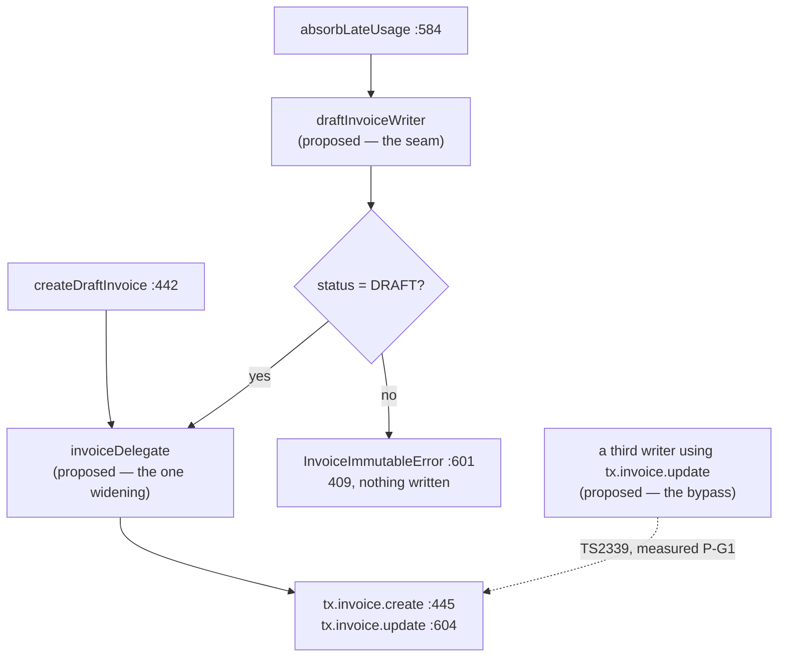

# T-048 · Invoice immutability guard

- **Task**: T-048, epic 8 (billing-service), spec at `docs/epics/epic-8-billing-service.md:140`.
- **Tree**: `a87d952`, clean, level with `origin/main`. Restored clean after every probe below.
- **Gate 1 halted once** on D1 (what "enforce at the repository layer" means) and was resumed
  with **Option B — the structural repository invariant — and yes to the `base.repository.ts`
  narrowing**. D1 is recorded as settled in §2, with A, C and B+C recorded as rejected and why.
- **Rules revision read**: `.claude/rules/known-gaps.md` **from disk** — 3032 lines, md5
  `57a8e700bfd44a4ddad22725ae219527`, last written by `a87d952`, running to **S-49**. The copy
  injected into this session's context ended at **S-39** and could not see S-46, S-47, S-48 or
  S-49, all of which bear on this task. **S-24, twelfth sighting this session.** Every citation
  below was re-read with `sed`/`grep` against disk.

---

# Part 1 — for the analyst

## 1. In plain terms

An invoice, once issued to a customer, must not change. T-048 is the task that makes that true.

**The behaviour already works.** The platform refuses to modify an invoice that is not a draft:
it answers `409 INVOICE_IMMUTABLE`, writes nothing, and names the state the invoice was in. That
shipped three weeks ago inside a different change (S-45), with a standing test.

So T-048 is not, primarily, new behaviour. What is open is narrower, less visible, and is the
whole of this task:

1. **Nothing on the platform can issue an invoice.** No code anywhere moves an invoice out of
   *draft* — no finalize action, no period close, no payment flow. Every invoice this system has
   produced is a draft and stays one. The protection guards a state the product cannot yet reach.
2. **The guard is a check inside one function, not a rule about invoices.** It protects the one
   place that writes to an invoice today. It does not protect the *next* place — and "finalize"
   and "mark paid" are exactly what the next places will be. **Measured, not assumed** (§3.2): a
   deliberately unguarded second writer was added, and the full package — 207 tests, type check,
   lint — stayed green.

T-048 converts the check into a **seam**: a single guarded doorway that every write to an invoice
must pass through, with the compiler refusing the alternatives. After this task, the naive way to
add an unguarded writer stops compiling.

**Who notices if this is wrong.** Not a customer today — the vulnerable state is unreachable. The
person who notices is whoever builds invoice finalization in a later epic, and the customer who
then receives an invoice whose total changed after it was sent. The cost is *deferred* and
*silent*, which is the profile of a guard worth making structural rather than a bug worth fixing.

**What it costs if we do nothing.** Nothing today; a financial-integrity defect on the day
someone ships finalization without re-reading this file.



Solid arrows for code that exists at the cited line; dashed and labelled *proposed* for what this
task adds and for the bypass probe. `TS2339` on the dashed arrow is the measured diagnostic from
§3.4, not a prediction.

## 2. Decisions

### 2.1 Answered by the user on resumption — settled, not open

**D1 · "Enforce at the repository layer" means Option B — a structural repository invariant.**
A single guarded mutation seam inside `InvoiceRepository` that every write to `Invoice` passes
through, plus a type-level narrowing in `apps/billing-service/src/repositories/base.repository.ts`
so that bypassing it does not compile. No migration; no other service touched.

**The three rejected options, with the measurement that rejected each:**

- **A · Adopt and document (rejected).** It answers a different sentence than the epic's. The
  epic's stated reason is "so no code path can accidentally modify a finalized invoice"; §3.2
  measured that the next writer inherits nothing — `probeFinalize`, an unguarded second mutation
  path taking a bare `invoiceId`, passed typecheck, lint and `Tests 207 passed (207)`. A would
  close the backlog item while leaving "no code path" untrue.
- **C · Database trigger alone (rejected).** Three measurements, §3.3–§3.4. It yields a **`500`,
  not the epic's `409`**: the refusal arrives as `PrismaClientUnknownRequestError` with **no
  `code` field**, the SQLSTATE visible only inside a stringified `ConnectorError`, so mapping it
  back to `INVOICE_IMMUTABLE` means matching message text. And it **does not fire for a
  line-item-only append**: an update whose body was `{ lineItems: { create: [...] } }` returned
  "NO ERROR - update succeeded", because Prisma emits no parent `UPDATE` when there is no scalar
  field to set.
- **B+C · Both (rejected as scope, not as engineering).** Legitimate — a trigger is the only
  mechanism measured here that also binds a DBA at a `psql` prompt — but it buys an
  out-of-band-write guarantee nobody has asked for, at the cost of a shared-schema migration
  affecting all five services on `telemetry_app`, a **second** trigger on `"InvoiceLineItem"`
  (which has no RLS at all, S-10), and a `FINALIZED → PAID` decision that the naive trigger
  forecloses by construction. If out-of-band protection is wanted later, the shape is B for the
  contract and C as a backstop that is *allowed* to be a `500` — recorded here so that task does
  not re-derive it.

**D1a · The `base.repository.ts` narrowing: approved — but it is not two lines, and that is
measured.** S-48's two-line figure is for `"invoiceLineItem"`, which nothing reads, so a wholesale
`Omit` works there. `tx.invoice` is read by five methods, and the wholesale omit is **not viable**:
probe step A produced **11 errors**, of which **7 are `TS2339` — five legitimate reads and two
the writers** (§3.4, A.8). The
narrowing must be **delegate-level** — remove the nine write methods from `tx.invoice` while
leaving the reads — which is **~12 lines**, not two. Flagged on page one because it is the one
place this plan costs more than the brief assumed.

**D2 · Adopt S-45's `DRAFT`-only refusal, unchanged.** An invoice that is not `DRAFT` refuses late
usage rather than absorbing it, and the usage stays `billed = false` and re-absorbable. Refusing
is the safe direction — the alternative silently changes the total on a document already sent —
and the revenue is deferred, not lost. Overriding would be a product decision about invoice
restatement that nothing in the epics has taken. Recorded because the epic's forward-reference
block (`epic-8-billing-service.md:143-153`) requires T-048 to say which it does.

### 2.2 Decided in this plan, with reasoning — small edits if wrong

- **D3 · The error body stays `{ code, message }`.** The epic declares
  `409 { code: 'INVOICE_IMMUTABLE', invoiceId, currentStatus }`. Every error this service emits is
  `{ code, message }`; `invoiceId` and `currentStatus` are retained as fields on
  `InvoiceImmutableError` (`errors/index.ts:150-153`) and read by billing's log line
  (`billing.service.ts:317`). Divergence reported, not conformed to. Cost if wrong: one controller
  edit, one assertion.
- **D4 · No method gains an `invoiceId` or `tenantId` parameter.** The epic's snippet is
  `update(id, tenantId, data)` / `findById(id, tenantId)`. The tenant comes from the
  constructor-bound context via `this.where({})`. The seam takes a
  `Prisma.InvoiceWhereUniqueInput` built inside the repository, never a caller-supplied id.
  Cost if wrong: re-opens D1.
- **D5 · `createDraftInvoice` does *not* go through the status guard, only through the widening
  accessor.** Creation is not mutation: there is no existing invoice to be immutable, and the
  status written is the constant `BILLING_METERING.INVOICE_STATUS_DRAFT`
  (`invoice.repository.ts:449`). Forcing it through a guard that reads a row that does not exist
  yet would be theatre. The property that *is* asserted is narrower and true: every write reaches
  the delegate through `invoiceDelegate`, and every write to an **existing** invoice additionally
  goes through `draftInvoiceWriter`. Cost if wrong: one call-site change.
- **D6 · `MESSAGE_INVOICE_IMMUTABLE` is reworded.** Today it is
  `"Invoice is not a draft and cannot absorb late usage"` (`constants.ts:123`) — absorption-
  specific, and quoted from a general seam it would be wrong. New wording:
  **`"Invoice is not a draft and cannot be modified"`**. Checked: **no test asserts the old
  string.** `grep -rn "cannot absorb late usage\|MESSAGE_INVOICE_IMMUTABLE"` over
  `apps/billing-service/{src,tests}` and `apps/worker-service/{src,tests}` returns exactly two
  lines, both in `src` (the declaration at `constants.ts:123` and its use at `errors/index.ts:156`).
  The three tests that touch the message assert `toContain(InvoiceStatus.FINALIZED)`
  (`internal.controller.unit.test.ts:159`, `billing.integration.test.ts:855`,
  `invoice.repository.unit.test.ts:575`), which the `(status ${currentStatus})` suffix keeps
  satisfying. Cost if wrong: one constant.
- **D7 · ORM only for date predicates.** S-19: billing's `base.repository.ts` has no `TimeZone`
  pin. No raw SQL in this task.

## 3. What the planning measured

Transcripts in the appendix. Each claim names the command behind it and the suites it ran against.

### 3.1 No writer in `src/` or `prisma/` sets a non-`DRAFT` status — the guard is unreachable from a production path

```
grep -rn "FINALIZED\|PAID\|finalizedAt" apps/*/src packages/*/src prisma \
  --include=*.ts --include=*.prisma --include=*.sql | grep -v dist
```

returned 12 lines at planning time: two enum members (`prisma/schema.prisma:141-142`), the column
(`:131`), the `v1_0` DDL, four reads that normalise `finalizedAt` onto the wire (in
`findDetailById` and `listInvoices`), and four comments. **Zero assignments.**

**That 12 does not reproduce, and the figure to use is 14.** Re-derived at Gate-3 Round 4 from a
`git archive` of `a87d952` into a scratch directory: the same command returns **14**, and the
enumeration above accounts for only 12 of them in two places. It counts the `v1_0` DDL as one line
where the grep returns **two** (`migration.sql:3`, the `CREATE TYPE`, and `:89`, the
`"finalizedAt"` column), and it counts **four** comment lines where the grep returns **five**
(`invoice-list.validator.ts:9`, `errors/index.ts:132`, `:133` and `:136`, and
`invoice.repository.ts:87`). Which of the five the planning pass omitted is not recoverable — it
did not list them — so this is stated as where the two missing lines are, not as which sentence
was overlooked. The working tree is **19**; both
figures and their classification are in §12.5, and `errors/index.ts`' docblock records that this
appendix figure does not reproduce. **Zero assignments is unchanged across every derivation**, and
that is the half §3.1 rests on.

**Scope, stated as the grep's rather than as the platform's:** within `apps/*/src`,
`packages/*/src` and `prisma`, the statements that set `Invoice.status` are `createDraftInvoice`'s
`create` (unconditionally the `DRAFT` constant) and nothing else — `absorbLateUsage`'s `update`
does not touch `status`. The grep never reads `tests/`, which **does** set it: six times, all
through `integration.fixtures.ts`' `seedInvoices` on the owner connection. An earlier revision of
this paragraph said "the only statements that set `Invoice.status` **at all**", which those six
refute (Gate 4 Round 2 MEDIUM-3, and the same universal again at Gate 6 MEDIUM-1 in a seventh
site).

**Consequence for every test T-048 writes, stated plainly: the `FINALIZED`/`PAID` states are
reachable only through the owner connection.** `BI23` seeds them via `DIRECT_DATABASE_URL`
(`billing.integration.test.ts:816-860`) and every new integration case must do the same. **These
tests do not prove production behaviour** — they prove the repository's behaviour when handed a
state the platform cannot currently produce. That is the honest claim and it is the one the
release note should carry. Stated as what the grep shows about today's writers, **not** as a claim
the state is unrepresentable: the fixtures reach it, which is exactly how `BI23` works.

Same shape as **S-37** (`Tenant.deletedAt` has no writer and no reader). S-37 declined to invent a
policy and filed the gap; the difference here is that T-048 is an explicitly declared backlog task
asking for the guard, which is why B rather than A.

### 3.2 A second mutation path inherits nothing — probe P-A

I added an unguarded second mutation method to `InvoiceRepository` — `probeFinalize(invoiceId)`,
doing `tx.invoice.update({ where: { id: invoiceId }, data: { status: "FINALIZED", finalizedAt: new
Date() } })` inside `withTenant`, with no status check and no `this.where({})`:

| Gate, run against **the whole billing-service package** | Result with the unguarded writer present |
|---|---|
| `pnpm --filter @telemetry/billing-service typecheck` | **clean, 0 errors** |
| `pnpm --filter @telemetry/billing-service lint` | **clean, 0 findings** |
| `pnpm --filter @telemetry/billing-service test` | **`Test Files 19 passed (19)`, `Tests 207 passed (207)`** |

Reverted with `git checkout --`; tree clean, `grep -cE "^  async"` back to 7.

The probe also took a **bare `invoiceId`** and built its predicate by hand without `this.where({})`,
violating the property `invoice.repository.ts:267-303` spends 36 lines establishing — and nothing
failed. Consistent with S-48, which measured the same class of hole on the read side.
`"Invoice"` RLS still constrains the *tenant* dimension (§3.6), so the probe did not reach another
tenant's invoice; what went unguarded was the *status* dimension, which no policy on this database
mentions. That sentence was **reasoned from the policy text when written and is now executed**
(Gate 4 Round 2, re-derived at the Gate-3 rework that followed): as `telemetry_app`
(`rolbypassrls = false`, read from `pg_roles` on the probing connection) under tenant A's context,
a raw cross-tenant `UPDATE` affected **0** rows, the same statement against A's own invoice **1**,
and a blanket no-`WHERE` `UPDATE` **1, not 2**. The figures and the method are in **S-48**.

**Scope, stated no stronger than measured.** One writer, one shape, inside the repository class, at
`a87d952`, against the billing-service package suite only. A writer placed in the service layer or
a raw `$executeRaw` was not probed; those are strictly easier to slip through, not harder, so the
claim is not weakened by their absence — but they were not run.

Secondary, and an S-33 instance: `invoice.repository.ts:274-285` asserts `grep -cE "^  async"`
returns **seven** and `grep -nE "^  (private )?async"` returns **eight**, naming all seven. With the
probe present those became **8** and **9**, and nothing went red, because the claim lives in a
comment. The docblock predicts this about itself at `:286-288` — honest, but a prose prediction is
not a guard. Slice S6 converts it into an assertion.

### 3.3 Why the database route was rejected — probes P-B/C/D/E

Scratch table mirroring `"Invoice"`'s shipped policy, inside a `ROLLBACK`ed transaction, run as
`telemetry_app` (`NOSUPERUSER`, `NOBYPASSRLS`) with `app.tenant_id` set:

| Variant | `FINALIZED` row | legitimate `DRAFT → FINALIZED` |
|---|---|---|
| shipped shape (`FOR ALL`, tenant term only) | `UPDATE 1` — **not protected today** | `UPDATE 1` |
| `+ RESTRICTIVE FOR UPDATE USING (status='DRAFT')` | `UPDATE 0` — silent | **`ERROR: new row violates row-level security policy "p_upd"`** |
| `+ ... WITH CHECK (true)` | `UPDATE 0` — silent | `UPDATE 1` |

The middle row is the trap: a `FOR UPDATE` policy's `USING` expression is also applied to the new
row unless an explicit `WITH CHECK` overrides it, so the obvious spelling of "only drafts may be
updated" also means "nothing may ever stop being a draft".

The third row's `UPDATE 0` reaches Prisma as `P2025` / `cause: 'No record was found for an
update.'` — indistinguishable from an unknown id, and unmapped by `registerGlobalErrorHandler`
(`packages/shared-utils/src/index.ts:112-140`, which maps `P2002` and nothing else), so it reaches
the client as a `500`.

The trigger route does work — it permits `DRAFT → FINALIZED`, refuses non-`DRAFT` loudly, and
**fires for a role that cannot execute the function** (`has_function_privilege('telemetry_app',
'probe_g()','EXECUTE')` → `f`, `proacl` → `{postgres=X/postgres}`, and the `UPDATE` still raised).
Its two disqualifiers for *this* task are in §2.1.

One honest correction: probe P-E's fourth step, `D_draft_still_mutable`, is **void** and is not
cited. Its setup reset the row to `DRAFT` through the owner connection, and that reset was itself
an `UPDATE` which the live trigger blocked, so it measured a row that was still `FINALIZED`. The
DRAFT-mutability claim rests on the scratch-table probe only. The failing step is itself a finding
for any future C: **a `BEFORE UPDATE` trigger binds the table owner too.**

### 3.4 The narrowing, measured in four steps — and what it does *not* reach

All four are `pnpm --filter @telemetry/billing-service exec tsc --noEmit -p tsconfig.json`.
Billing's `tsconfig.json` includes `tests/**/*.ts`, so **this is the whole package**, not `src`
alone. Transcripts at A.8–A.11.

| Step | Edit | Result |
|---|---|---|
| **A** | S-48's shape: `\| "invoice"` added to `TransactionClient`'s `Omit` | **11 errors** — 7 × `TS2339`, of which **five are legitimate `tx.invoice` reads** (`findByPeriod`'s `findUnique`, `absorbLateUsage`'s `findUniqueOrThrow`, `listInvoices`' `findMany` and `count`, `findDetailById`'s `findFirst`) **and two are the writers** (`createDraftInvoice`'s `create`, `absorbLateUsage`'s `update`), plus 2 × `TS2345`, 2 × `TS7006`. **Not viable.** Cited by symbol: an earlier revision of this row said "7 × `TS2339` on legitimate reads", an overcount of two, corrected at Gate-3 Round 4 from Gate 6's re-execution (F-3 / MEDIUM-2). `base.repository.ts`' docblock and S-48 already carried the correct split |
| **B** | delegate-level: `TransactionClient` re-expressed as `Omit<Full, "invoice"> & { invoice: Omit<Full["invoice"], InvoiceWriteMethod> }` | **4 errors** — `TS2339` at `:445` (`create`) and `:604` (`update`), the two writers and only those; `TS2345` at `:467` and `:626`, the two `markUsageLinesBilled(tx, …)` call sites |
| **C** | B, plus `markUsageLinesBilled`'s parameter narrowed to `Omit<Prisma.TransactionClient, "invoice">` | both `TS2345` clear; **exactly the two intended `TS2339` remain**, and all five `tx.invoice` reads compile |
| **F** | C, plus the seam and both writers rerouted through it | **0 errors**; `eslint .` clean; `Tests 207 passed (207)` — the reroute is behaviour-preserving |

**What reddens when someone adds a third writer** — the question B exists to answer, measured
rather than argued:

| Probe | Third writer's shape | Result |
|---|---|---|
| **P-G1** | `tx.invoice.update({ where: { id }, data: { status: "FINALIZED" } })` — the naive bypass | **`error TS2339: Property 'update' does not exist on type 'Omit<InvoiceDelegate<…>, InvoiceWriteMethod>'`** |
| **P-G2** | `(tx as unknown as FullTransactionClient).invoice.update(…)` — a deliberate widening | **compiles clean, 0 errors** |

So the honest statement of B's guarantee, and the plan must not exceed it:

> **A `tx.invoice` write outside the seam becomes `TS2339`. A writer that deliberately widens
> still compiles**, and is caught instead by a census assertion (`BU125`) that the widening
> appears exactly once in `src/`. There is no claim here that bypass is *impossible* — it is
> **made visible**: the bypass must be spelled `as unknown as FullTransactionClient`, which is
> greppable, reviewable and asserted.

**S-48's step E reproduces for this delegate and is the limit.** With the full narrowing in place,
inserting `await this.prisma.invoice.update({ where: { id }, data: { currency: "XXX" } })` into
`findDetailById` **added zero diagnostics** — the error count stayed at the step-C pair. The
narrowing binds `tx`, the `withTenant` callback parameter, and nothing else;
`TenantScopedRepository` holds `protected readonly prisma: PrismaClient`, and that route is the
**worse** of the two because it runs outside the transaction, so no
`set_config('app.tenant_id', …)` has been issued at all. **Never state this property as "the bare
write becomes unrepresentable".**

### 3.5 Epic divergences — reported, not conformed to

The epic's own forward-reference block flags two of these, which is a first for this file and
worth crediting. Re-derived against `a87d952`:

1. **The snippet does not type against this repository** (at `a87d952` it was `:155-163`; on the
   reworked tree it is `:159-169`, because both this task and its Round-2 rework added lines above
   it — cite it by the fenced block after the `**Story**` line, not by number), but the epic's
   account of *why*
   is an over-claim. It says the signatures "are refused by this repository's shape". Per S-48's
   and T-046's measurements, re-read from disk: **declaring** `findById(id, tenantId)` *compiles*;
   only feeding the parameter into `this.where({ id, tenantId })` is `TS2322: Type 'TenantId' is
   not assignable to type 'undefined'`; and building the predicate by hand as
   `where: { id, tenantId }` compiles clean. So the refusal is **convention plus one compile error
   at one call site**, not a property of the shape. Same class of over-claim S-48 exists to
   correct. → **S-50**, §5.3.
2. **The `**Error response**` line's body** (`:164` at `a87d952`, `:171` now) is
   `{ code, invoiceId, currentStatus }`; this service emits
   `{ code, message }`. Already flagged by the epic's own block. D3.
3. **The snippet writes `this.prisma.invoice.update`, not `tx`** — outside `withTenant`, so no
   `set_config` at all. That is exactly the step-E limit in §3.4, and it is the sharpest edge in
   this task: the epic's own suggested code takes a route the narrowing does not close. **Not the
   only such route** — an earlier revision of this line said "the one route", and the Gate-4
   review refuted that with two more, both at 0 diagnostics (§12.3). S-48 carries the table.
4. Credit where due: unlike the T-040/T-041/T-042/T-043 sections (S-29, S-32, S-42, S-35) and the
   T-047 section (S-47), this section warns the reader **before** the snippet rather than after.

### 3.6 What T-048 inherits and must not disturb

- **S-10** — `"InvoiceLineItem"`: `relrowsecurity = f`, `relforcerowsecurity = t`, **zero**
  policies (live `pg_class`/`pg_policy`, A.2). **The seam does not touch `InvoiceLineItem`**: both
  writers reach line items through Prisma's nested `create` on the invoice, and the seam returns
  the `invoice` delegate only. If that ever changes, the application route is the *entire* tenant
  control on that table. `BI9` and `BI32` stay as markers and must stay meaningful.
- **S-46** — `"Invoice"` is RLS-enabled with one `FOR ALL` policy
  (`invoice_tenant_isolation`, tenant term only), so **an integration case over `Invoice` cannot
  isolate the application tenant predicate**: remove it and the policy returns the same answer,
  suite still green. Every case in §7 therefore names **what it actually pins**, and the
  structural properties are pinned by *unit* cases on the `where` shape (the `BU98`/`BU99`
  pattern), never by an integration case that would pass either way.
- **S-48** — this task takes S-48's proposal. Its entry must record that, and its limit (step E)
  is restated verbatim in §3.4. Do not let any sentence in the implementation claim more.
- **S-19** — billing's copy stops being byte-identical to analytics' and worker's. Re-derived:
  `md5sum` gives `13a533a2e2c2dcc1ff9db28fb5c7a1fd` for **analytics, billing and worker** (111
  lines each), `8b12b7d596af50a038f5a79c1361b8a5` for auth (118) and
  `d2e8d92fd494fb779f4dea7238273b4a` for usage (124). S-19's evidence rests on that three-way
  identity, so the entry must be updated in this task's diff. **Do not touch the other four
  copies.** ORM only for date predicates.
- **S-49** — probe P-D3 (§3.3) is a *second* observation of the same `@prisma/client` 6.19.3
  nested-create compilation behaviour S-49 records. Not acted on; noted so S-49's evidence base
  is known to be two observations, not one.
- **S-8** — the internal-auth guard is still `!==`. Noted, **not** this task's, and not to be
  folded in.

### 3.7 T-049's two residual cases

Confirmed against `docs/plans/t-047-invoice-detail-endpoint.md:355-363` and the suite:

- *"Invoice detail for different tenant's invoice → `404`"* — **closed at T-047**, by `BI30` with
  `BI29` (`billing.integration.test.ts:1629`), which asserts the unknown-id and foreign-id
  responses are byte-identical.
- *"Attempt to update `FINALIZED` invoice → `409 INVOICE_IMMUTABLE`"* — **closes here**. §7.4
  names which case carries it and what becomes of `BI23`.

## 4. Scope and non-goals

**In scope:** the `Invoice` mutation surface of `apps/billing-service`, billing's
`base.repository.ts`, their tests, the S-19/S-48/S-50 records, the epic correction, and this plan.

**Out of scope, deliberately:**

- **Building the finalize / mark-paid flow.** T-048 is a guard, not a state machine. Which epic
  owns invoice issuance is unsettled; inventing the transition here would be the silent
  resolution `CLAUDE.md` forbids.
- **Closing S-10.** `"InvoiceLineItem"` stays without RLS; `BI9`/`BI32` stay as markers.
- **Closing S-19.** Only billing's copy changes; the other four are untouched, and S-19 gains a
  fifth variant rather than being resolved.
- **Any database change.** No migration, no trigger, no policy. Option C is rejected (§2.1).
- **S-8, S-37, S-39, S-46 generally.**
- **Deliberately left broken:** an invoice still cannot be issued at all. T-048 does not change
  that, and the guard remains unreachable in production. Every new test depends on an
  owner-connection fixture (§3.1). This belongs in the release note.

---

# Part 2 — for the implementer

## 5. Files

### 5.1 Changed — production (3)

| File | Change |
|---|---|
| `apps/billing-service/src/repositories/base.repository.ts` | `FullTransactionClient` extracted and **exported**; `InvoiceWriteMethod` union; `TransactionClient` re-expressed as the delegate-level narrowing and **exported**. ~12 lines. No runtime change. |
| `apps/billing-service/src/repositories/invoice.repository.ts` | `invoiceDelegate` (the one widening) + `draftInvoiceWriter` (the seam); `createDraftInvoice` and `absorbLateUsage` rerouted; `markUsageLinesBilled`'s parameter narrowed; the `:274-303` docblock rewritten to describe the seam. |
| `apps/billing-service/src/constants.ts` | `MESSAGE_INVOICE_IMMUTABLE` reworded (D6); its docblock at `:112-121` updated to say the code is no longer absorption-specific. |

### 5.2 Changed — tests (3)

`apps/billing-service/tests/invoice.repository.unit.test.ts` (seam cases, census case),
`apps/billing-service/tests/billing.integration.test.ts` (one new case; `BI23` re-titled),
`apps/billing-service/tests/integration.constants.ts` (fixture vocabulary — no literals in cases).

### 5.3 Changed — records (3, and they are deliverables)

- **`.claude/rules/known-gaps.md` § S-19** — the evidence paragraph reads "`analytics`, `billing`
  and `worker` are **byte-identical** (`13a533a2e2c2dcc1ff9db28fb5c7a1fd`, 111 lines each)". After
  T-048 that is false. Edit: state that **`analytics` and `worker`** remain byte-identical at that
  digest, and that **billing is now a fourth variant** — the delegate-level `TransactionClient`
  narrowing added by T-048, with the reason (the bare-`invoiceId`/unguarded-write hole S-48
  records) and the explicit note that the other four were left alone deliberately. Re-run
  `md5sum apps/*/src/repositories/base.repository.ts` at Gate 3 and quote the *new* digest rather
  than predicting it. The subclass table in the same entry gains no row — no new subclass.
- **`.claude/rules/known-gaps.md` § S-48** — record that **its proposal was taken**, in billing
  only, in the delegate-level form rather than the wholesale `Omit`, with the step-A measurement
  (11 errors; 7 × `TS2339`, **five legitimate reads and two writers**) as the reason the two-line
  figure did not transfer. Keep the
  entry **open**: step E is unchanged, `this.prisma` is still reachable, and the `invoiceLineItem`
  half is untouched. Add `BU125` to the list of what stands behind the property.
- **`.claude/rules/known-gaps.md` § S-50 (new — next free id, re-derived from disk:
  `grep -oE "^## S-[0-9]+" … | sort -n | tail -1` → **49**)** — the epic's
  "refused by this repository's shape" over-claim (§3.5 item 1), and the residual that the
  T-048 section's snippet uses `this.prisma`, which the narrowing provably does not reach. Small,
  LOW, and it is a *claim* defect rather than a code one — which is exactly the class
  `review-standards.md` § *Universals Must Cite Their Mutation* asks to be filed.

### 5.4 Changed — epic (1)

`docs/epics/epic-8-billing-service.md` § T-048: a forward-reference note under the snippet saying
what shipped and why, in the shape S-32 recommends. **Do not delete the snippet** — the epic files
are a record of what was specified.

### 5.5 New files

**None.** The seam is private to `InvoiceRepository`; no new module, no migration.

### 5.6 The shapes

```ts
// base.repository.ts — exported so the seam can widen in exactly one place.
export type FullTransactionClient = Omit<
	PrismaClient,
	"$connect" | "$disconnect" | "$on" | "$transaction" | "$use" | "$extends"
>;

type InvoiceWriteMethod =
	| "create" | "createMany" | "createManyAndReturn"
	| "update" | "updateMany" | "updateManyAndReturn"
	| "upsert" | "delete" | "deleteMany";

export type TransactionClient = Omit<FullTransactionClient, "invoice"> & {
	invoice: Omit<FullTransactionClient["invoice"], InvoiceWriteMethod>;
};
```

```ts
// invoice.repository.ts — the seam.
private invoiceDelegate(tx: TransactionClient): FullTransactionClient["invoice"] {
  // The ONE widening in this service. BU125 asserts it appears exactly once in src/.
  return (tx as unknown as FullTransactionClient).invoice;
}

private async draftInvoiceWriter(
  tx: TransactionClient,
  key: Prisma.InvoiceWhereUniqueInput          // built inside this repository, never a caller's (D4)
): Promise<FullTransactionClient["invoice"]> {
  const existing = await tx.invoice.findUniqueOrThrow({    // a read — the narrowed delegate has it
    where: key,
    select: { id: true, status: true }
  });
  if (existing.status !== BILLING_METERING.INVOICE_STATUS_DRAFT) {
    throw new InvoiceImmutableError(existing.id, existing.status);
  }
  return this.invoiceDelegate(tx);
}
```

Step F measured a close variant of this (with `key` nullable and the widening written twice) at
**0 tsc errors, clean lint, 207/207**. The exact final signature is confirmed at S3, not assumed
here.

## 6. Slices — smallest safe first

Pseudo-TDD per `.claude/rules/testing.md`: **S2 is the confirm-red slice and is named as one.**

### S1 · Constants and message — no behaviour
`constants.ts:123` reworded (D6) plus its docblock. **Controlling path:**
`errors/index.ts:156`'s template literal.
**Falsified if:** any existing test reddens. Measured prediction: none does — no test asserts the
old string (D6), and the three that touch the message assert `toContain(InvoiceStatus.FINALIZED)`,
which the `(status …)` suffix preserves.

### S2 · Write every test file, **confirm red**
All cases from §7, bodies complete, before any production change.
**Falsified if:** any new case passes before S3–S5 land. The seam cases must fail on a
`draftInvoiceWriter` that does not exist; `BU125` must fail because the widening appears **zero**
times, not once. Record the red output verbatim — a test that never failed proves nothing.

### S3 · The seam, behaviour-preserving
`invoiceDelegate` + `draftInvoiceWriter`; `absorbLateUsage` rerouted, its inline `:595`
`findUniqueOrThrow` and `:600-601` check **moved into** the seam rather than duplicated;
`createDraftInvoice` routed through `invoiceDelegate` only (D5).
**Controlling path:** `invoice.repository.ts:584-630` and `:442-470`.
**Falsified if:** `BI23`, `BU100` or `BU101` redden, or the absorb path changes its statement
count. Measured at step F: this reroute is behaviour-preserving — `Tests 207 passed (207)`.

### S4 · Narrow `markUsageLinesBilled`'s parameter
`tx: Prisma.TransactionClient` → `Omit<Prisma.TransactionClient, "invoice">`
(`invoice.repository.ts:407`, re-derive with `grep -n "markUsageLinesBilled"` rather than trusting
the line — S-48 records that citation rotting twice).
**Falsified if:** anything other than the two `TS2345` at `:467`/`:626` is affected. Step C
measured exactly that.

### S5 · The narrowing in `base.repository.ts`
The §5.6 types. **This is the slice that makes the guarantee.**
**Falsified if:** typecheck shows anything other than clean, or any of the five `tx.invoice`
**reads** breaks. Step C measured: two intended `TS2339` before the reroute, zero after it.

### S6 · The census assertions
`BU125` (one widening) and `BU126` (the method census, converting the `:274-285` prose into a
test — §3.2).
**Falsified if:** `BU125` passes with a second widening present. **Run the P-G2 mutation and
record the redness**, against `tests/invoice.repository.unit.test.ts` specifically **and** the
whole package suite — a mutation run against one suite and written up as general is a graded
finding.

### S7 · Integration case, docblocks, records, epic
`BI34`; the `:267-303` docblock rewritten; S-19, S-48, S-50, the epic note.
**Falsified if:** the rewritten docblock asserts a count that `grep` does not return, or claims
more than §3.4's honest statement.

## 7. Test plan

Ids continue the existing ceilings, re-derived: `BU` max **122**, `BI` max **33**, so new cases
start at **BU123** and **BI34**. No magic literals — statuses come from Prisma's generated
`InvoiceStatus`, codes from `BILLING_RESPONSES`, fixture values from
`tests/integration.constants.ts` (`.claude/rules/constants.md` applies to tests).

### 7.1 Unit — `tests/invoice.repository.unit.test.ts`

| Id | Asserts | What it actually pins |
|---|---|---|
| **BU123** | `absorbLateUsage` against a `FINALIZED` double throws `InvoiceImmutableError` with `code = CODE_INVOICE_IMMUTABLE`, `currentStatus = FINALIZED`, **and `tx.invoice.update` is never reached** | the seam refuses **before** any write — not merely that an error is thrown |
| **BU124** | against a `PAID` double, same refusal | `PAID` is guarded, not just `FINALIZED`; the epic names both and only `FINALIZED` has ever been tested |
| **BU125** | every cast form in `FULL_DELEGATE_CAST_PATTERNS` — targets `FullTransactionClient`, `PrismaClient`, `Prisma.<Model>Delegate`, `any`, each with an optional `unknown` hop — occurs **exactly once** across `apps/billing-service/src`, inside `invoiceDelegate` | the census that makes a deliberate bypass visible **in the forms it enumerates**. Widened at Round 2 from the single `as unknown as FullTransactionClient` spelling, which the Gate-4 review refuted by execution. **The locating helper must throw if the file or the symbol is missing** (`.claude/rules/testing.md`) rather than counting zero and passing |
| **BU126** | the async **member** census: the public list, the private list, a third list (anything under any other modifier) asserted **empty**, no `async` class property, and no member taking `invoiceId`/`tenantId` | converts `:274-285`'s prose into an assertion (§3.2). Widened at Round 2: the Round-1 pattern saw only `private`, so a `protected` member fell out of both lists and neither `toEqual` noticed |
| **BU127** | a `DRAFT` double: the seam returns the writer and `update` **is** reached | the guard does not over-refuse — the negative-path sibling of BU123 |

`BU100`/`BU101`/`BU98`/`BU99` must stay green and keep meaning what their names say; re-read
them at S3 rather than assuming the reroute left them alone.

### 7.2 Integration — `tests/billing.integration.test.ts`

| Id | Asserts | What it actually pins |
|---|---|---|
| **BI34** | with a `PAID` invoice seeded through `DIRECT_DATABASE_URL`, `POST /v1/internal/billing/generate` for that period answers `409` / `CODE_INVOICE_IMMUTABLE`, the invoice total is **unchanged**, no line item was added, and the late `UsageLine` is still `billed = false` | the refusal is transactional end-to-end for `PAID`, read back through the service on `telemetry_app`. **`BI23` covers `FINALIZED`; this is its `PAID` sibling, which does not exist today** |

**No new isolation case over `Invoice`.** Per **S-46**, one would be green with the application
tenant predicate removed, because `invoice_tenant_isolation` supplies the same answer — it would
assert nothing it appears to assert. The tenant properties stay pinned where they are pinnable:
`BU98` (the address), `BU99` (the line-item route), `BI9`/`BI32` (the S-10 markers).

**Every case here depends on an owner-connection fixture** (§3.1). Say so inline, as `BI23`
already does at `:817-820`.

### 7.3 Compile-time — recorded at Gate 3, not a vitest case

The `TS2339` guarantee cannot be a runtime test. Record it as a Gate-3 mutation transcript in the
review, re-running **P-G1** (naive bypass → `TS2339`) and **P-G2** (deliberate widening →
compiles, `BU125` red), each naming the command and the suite.

### 7.4 Acceptance-coverage mapping

| # | Acceptance criterion (source) | Proven by |
|---|---|---|
| AC1 | A non-`DRAFT` invoice refuses mutation with `409 INVOICE_IMMUTABLE` and nothing is written (epic § *T-048*, the `**Error response**` line — `:171` on the reworked tree) | `BU123`, `BU124`, `BI23` (FINALIZED), **`BI34`** (PAID) |
| AC2 | Enforcement is at the **repository** layer, not the controller (epic § *T-048*, the `**Story**` line — `:157` on the reworked tree) | `BU123`/`BU124` assert at the repository; `BU102b` (existing) shows the controller only surfaces it |
| AC3 | **"no code path can accidentally modify a finalized invoice"** (epic § *T-048*, the `**Story**` line — `:157` on the reworked tree) | `BU125` + the P-G1/P-G2 transcript in §7.3. **Stated as §3.4's honest form**: a `tx.invoice` write outside the seam is `TS2339`; a deliberate widening compiles and is caught by `BU125`. Not "impossible" |
| AC4 | `DRAFT` invoices remain mutable — no regression | `BU127`, and `BI22`/`BI25` (existing) staying green |
| AC5 | T-049: "Attempt to update `FINALIZED` invoice → `409 INVOICE_IMMUTABLE`" (`epic:184-185`) | **`BI23`**, whose title should be re-read at S7: it says "a non-DRAFT invoice refuses the absorption", which remains exactly what it does. It is still the absorb path, and after the seam it is the absorb path *through the seam*. **`BI34` is the case that closes AC5 without the absorb-specific framing.** Do not re-title `BI23` to claim more than it tests |

## 8. Validation

**Task-scoped first, while iterating:**

```bash
pnpm --filter @telemetry/billing-service exec vitest run tests/invoice.repository.unit.test.ts
pnpm --filter @telemetry/billing-service exec tsc --noEmit -p tsconfig.json
pnpm --filter @telemetry/billing-service lint
pnpm --filter @telemetry/billing-service test          # all 19 files, 207 + new
```

`pnpm --filter <pkg> test -- <file>` does **not** filter (`CLAUDE.md`); use `exec vitest run`.

**Full gate before handoff, `--force` so turbo replays nothing:**

```bash
pnpm build --force && pnpm test --force && pnpm lint --force && pnpm typecheck --force
```

Report all **13 packages**. Integration suites need live Postgres and Redis and run inside
`pnpm test` (`.claude/rules/testing.md`) — both are up and must not be stopped.

**Row-count discipline after any probe:** `Event/UsageLine/Invoice/InvoiceLineItem/Meter` back to
**0**, `Tenant` at **2** (S-20 residue, do not touch). Seed only through `DIRECT_DATABASE_URL`.
Nothing to Redis db 0.

## 9. Risks

| # | Risk | Mitigation |
|---|---|---|
| R1 | The narrowing is ~12 lines, not S-48's two (D1a). If reviewed against the two-line expectation it looks like scope creep | §3.4 step A is the measurement: the wholesale `Omit` produces 11 errors, 7 × `TS2339` of which **five are legitimate reads and two are the writers**. Carry that transcript into the review |
| R2 | A deliberate widening still compiles (P-G2). Over-claiming here is the likeliest review finding | Every sentence uses §3.4's honest form. `BU125` is the actual control, and its helper must **throw** when it cannot locate the symbol |
| R3 | `this.prisma.invoice.update` is untouched by the narrowing (step E) and is the **worse** route — outside the transaction, no `set_config` | Stated in the docblock and in S-48's update. Not fixable here; it is S-19's unification task |
| R4 | Billing's `base.repository.ts` stops matching analytics' and worker's, invalidating S-19's evidence | S-19 edited in this task's diff (§5.3), with the digest re-run at Gate 3 rather than predicted. Other four copies untouched |
| R5 | The seam changes `absorbLateUsage`'s statement order; `BI23`/`BU100`/`BU101` are sensitive to it | Step F measured the reroute at 207/207. Re-read those three cases at S3 rather than trusting the green |
| R6 | Every new case rests on an owner-connection fixture, because nothing writes a non-`DRAFT` status (§3.1) | Said inline in each case, in §3.1, and in the release note. **Do not let the review read these tests as proof of production behaviour** |
| R7 | S-46: any isolation case over `Invoice` would pass with the tenant predicate removed | No such case is written (§7.2); the structural properties stay in unit cases |
| R8 | `createDraftInvoice` bypasses the status guard by design (D5), which reads like a hole | D5 states the narrower true property; `BU126`'s census makes the exception visible rather than implicit |
| R9 | S-33: the rewritten `:267-303` docblock will carry counts that this very change invalidates | Re-run every grep in it at S7 and quote the output; do not carry a numeral forward |

## 10. Pending task checklist

- [done] S1 constants + message (D6) — reworded; 207/207 unchanged, as predicted
- [done] S2 all test bodies written; **BU125/BU126 confirmed red**, BU123/BU124/BU127/BI34 green on arrival (the behaviour predates T-048) and proven non-vacuous by mutations M1/M2 — see report
- [done] S3 seam; both writers rerouted; `BI23`/`BU100`/`BU101` re-read and green
- [done] S4 `markUsageLinesBilled` parameter narrowed (landed with the step-C progression probe)
- [done] S5 narrowing; progression re-derived A=11 / B=4 / C=2 / F=0
- [done] S6 P-G1 → `TS2339`; P-G2 → compiles clean, `BU125`+`BU126` red in the single file **and** the package suite
- [done] S7 `BI34`; docblock rewritten with every grep re-run; S-19, S-48, S-50, epic note
- [done] Task-scoped lint / typecheck / test green
- [done] Full gate `--force`, per-package totals reported
- [done] Row counts verified back to baseline; nothing staged, committed or branched

## 11. Approval gate

**Gate 1 ends here.** No production code and no tests were written; every probe in this plan was
reverted and the working tree holds only this file. Implementation begins at Gate 3, after
approval.

**Decisions settled — do not silently re-decide:**

| Id | Settled as | Source |
|---|---|---|
| **D1** | **Option B**, the structural repository invariant | user, on resumption |
| **D1a** | The narrowing is approved, and is **delegate-level, ~12 lines**, not S-48's two | user + §3.4 step A |
| **D2** | **Adopt** S-45's `DRAFT`-only refusal | this plan |
| D3 | Error body stays `{ code, message }` | this plan |
| D4 | No `invoiceId` / `tenantId` parameter | this plan |
| D5 | `createDraftInvoice` uses `invoiceDelegate`, not the status guard | this plan |
| D6 | `MESSAGE_INVOICE_IMMUTABLE` → `"Invoice is not a draft and cannot be modified"` | this plan |
| D7 | ORM only for date predicates | S-19 |

**Rejected, with the measurement that rejected each:**

| Option | Rejected because |
|---|---|
| **A · adopt and document** | answers a different sentence than the epic's; the next writer inherits nothing — `probeFinalize` passed typecheck, lint and 207/207 (§3.2) |
| **C · database trigger alone** | yields a `500` not the epic's `409`; arrives as `PrismaClientUnknownRequestError` with **no error code**; **does not fire for a line-item-only append** (§2.1, §3.3) |
| **B+C · both** | legitimate, but buys an out-of-band guarantee nobody asked for at the cost of a shared-schema migration, a second trigger on a table with no RLS (S-10), and a `FINALIZED → PAID` decision the naive trigger forecloses |

**Nothing further requires a user answer before Gate 3.** Slice order: **S1 → S2 (confirm red) →
S3 → S4 → S5 → S6 → S7.**

## 12. Gate-3 Round 2 — rework against the Gate-4 review

`docs/reviews/t-048-invoice-immutability-guard.md` § *Round 1* returned **CHANGES REQUESTED** with
two HIGHs, one MEDIUM and three LOWs. Everything below was re-measured here rather than taken from
the review, and every probe was reverted with the file digest re-checked.

### 12.1 HIGH-1 — the evasive writer, reproduced and then reddened

Reproduced first, exactly as the review specifies it (a `protected async` member casting the
**delegate** rather than the client, no `unknown` hop):

| Gate, writer present, patterns as shipped at Round 1 | Result |
|---|---|
| `pnpm --filter @telemetry/billing-service exec tsc --noEmit -p tsconfig.json` | **0 errors** |
| `pnpm --filter @telemetry/billing-service lint` | **0 findings** |
| `pnpm --filter @telemetry/billing-service test` | **`Test Files 19 passed (19)`, `Tests 213 passed (213)`** |

Then both patterns were widened (`tests/invoice.repository.unit.test.ts`), and the **same** writer
re-run:

| Suite | Result |
|---|---|
| `exec vitest run tests/invoice.repository.unit.test.ts` | `Tests 2 failed \| 35 passed (37)` — `BU125`, `BU126` |
| same file, `-t BU125` | `Tests 1 failed \| 36 skipped (37)` |
| same file, `-t BU126` | `Tests 1 failed \| 36 skipped (37)` |
| `pnpm --filter @telemetry/billing-service test` | `Tests 2 failed \| 211 passed (213)` |

So each census catches it **on its own**, which is what the review's "either alone catches it"
asked for. `BU126`'s failure names the member: `["protected async probeFinalizeEvasive"]` against
an expected `[]`. Writer removed; `invoice.repository.ts` back to md5 `cd1aa13bd49159f8dccfd3c531f94ef2`
and the package back to 213/213.

**Each of the four cast patterns was proven live, not merely written.** One probe per pattern,
each a single expression inside `absorbLateUsage`'s existing body so that `BU126` stays out of it,
each typechecking at **0 errors**, each run as `exec vitest run tests/invoice.repository.unit.test.ts -t BU125`:

| Probe | `BU125` |
|---|---|
| the shipped accessor's own form, doubled (the Round-1 measurement) | `1 failed \| 36 passed (37)` |
| `void (tx.invoice as Prisma.InvoiceDelegate);` | `1 failed \| 36 skipped (37)` |
| `void (tx as unknown as PrismaClient).invoice;` (with the import added) | `1 failed \| 36 skipped (37)` |
| `void (tx as any).invoice;` | `1 failed \| 36 skipped (37)` — **and** `pnpm --filter @telemetry/billing-service lint` reports findings, so that one spelling has a second control |

**The async-property shape was measured too**, because `BU126`'s new assertion for it would
otherwise be decoration: adding `private probeArrowWriter = async (id: string): Promise<string> => {…}`
typechecks at 0 errors, is absent from `asyncMembers` entirely, and reddens the new assertion with
`expected [ 'private probeArrowWriter = async' ] to deeply equal []`.

**What the widening does and does not give.** `BU125` now enumerates four cast targets and
`BU126` classifies by modifier text with a third list asserted empty plus an async-property
assertion. A fifth cast spelling, or a member shape neither pattern describes, is still missed.
Every claim site now says so.

### 12.2 HIGH-1 item 3 — `InvoiceWriteMethod` verified against the generated client

Derived from `node_modules/.pnpm/@prisma+client@6.19.3_…/node_modules/.prisma/client`, two ways:

1. `ts.createProgram` over `apps/billing-service/tsconfig.json`, `checker.getPropertiesOfType`:
   `PrismaClient["invoice"]` has **18** string members. `TransactionClient["invoice"]` has
   **9** — `aggregate`, `count`, `fields`, `findFirst`, `findFirstOrThrow`, `findMany`,
   `findUnique`, `findUniqueOrThrow`, `groupBy`.
2. The generated argument types, member by member: six of the nine writers carry `data`; `upsert`
   carries `create` + `update`; `delete`/`deleteMany` carry neither and mutate by address. None of
   the residual nine carries a write payload, and `fields` is a `readonly …FieldRefs` property.

**So it is nine, and nine is the complete mutating set at 6.19.3.** It is no longer only a
comment: `base.repository.ts` now declares `InvoiceDelegateSurfaceCensus`, a type-level equality
between the delegate's string keys and `InvoiceWriteMethod | InvoiceReadMethod`, which fails
`tsc` if an upgrade adds, removes or renames a member. Mutated both ways —
`| "probeFutureWrite"` added, `| "groupBy"` deleted — each giving
`error TS2344: Type 'false' does not satisfy the constraint 'true'` on that declaration, and
0 errors either side. `Extract<…, string>` is load-bearing: the generated delegate declares
`[K: symbol]` (`.prisma/client/index.d.ts:8972`), so a bare `keyof` fails against any list of
names — measured, because the first form of the census was written that way and failed.

### 12.3 HIGH-2 — the two further routes, re-derived and folded into S-48

| Route | Measured here | Seen by |
|---|---|---|
| `prisma` module singleton from the **service** layer (`src/lib/prisma`, re-exported at `config/container.ts:5`, `:23`) | **0 diagnostics**; census file 37/37; package 213/213 | nothing |
| `tx.$executeRaw` inside `withTenant`, as a **new private method** | **0 diagnostics**; census file `1 failed \| 36 passed (37)` | `BU126`, and only because the member is new |
| the same raw statement inserted into `absorbLateUsage`'s existing body | **0 diagnostics**; the unit failures are all `TypeError: tx.$executeRaw is not a function` from the test double, and **the count depends on the insertion point**: **7** (`BU98`, `BU99`, `BU100`, `BU101`, `BU123`, `BU124`, `BU127`) as the first statement of the `withTenant` callback, **4** (`BU98`, `BU99`, `BU101`, `BU127`) immediately after the seam call — measured at Gate 4 Round 2, whole package each time | neither census |

`FullTransactionClient`'s `Omit` removes six `$`-methods and leaves **four**, enumerated from the
type rather than read off the `Omit`: `$executeRaw`, `$executeRawUnsafe`, `$queryRaw`,
`$queryRawUnsafe`. `epic-8-billing-service.md`'s item 4 -- `:190` at the reviewed revision, `:197` after the
rewrite -- said "the one route none of that reaches"; it is corrected in place; both routes are recorded in **S-48**'s route table, and **S-50**'s title and
body lose the uniqueness reading. No new gap id was minted.

### 12.4 MEDIUM-1 — option **A**, reword (the user's decision)

Verified first: inserting `await writer.updateMany({ where: {}, data: { status: "FINALIZED" } })`
immediately after the seam call in `absorbLateUsage` compiles at **0 diagnostics**. The seam
checks the row named by `key` and returns the whole delegate; the capability is not bound to the
checked row. Two docblocks reworded to that narrower property (class docblock property 4, and the
seam's own), plus the D5 paragraph, which made the same claim in the same words. **Comment-only.**
The seam was *not* converted to perform the write — that was option B and was not chosen.

### 12.5 The three LOWs

- **LOW-1.** Re-derived three times now, each with `comm` against a detached worktree at
  `a87d952`, and **it moved twice inside the task that was fixing it** — the correcting sentences
  are themselves matches, which is precisely the S-33 self-match this finding is about. The
  figures below are the Gate-3 rework round 2 derivation, taken **after** the last edit to any
  file the grep reads, and re-run again at Round 3 both before and after that round's own edits:

  | Figure | Gate 3 | Gate 4 R2 | **Now** |
  |---|---|---|---|
  | working-tree total | 17 | 19 | **19** |
  | `a87d952` total | 14 | 14 | **14** |
  | comments | 8 | 10 | **10** |
  | declarations / reads / DDL | 9 | 9 | **9** |
  | **assignments** | **zero** | **zero** | **zero** |

  **The added/removed rows were dropped at Gate-3 Round 4**, answering Gate 5's F-2 and Gate 6's
  LOW-1. They reproduced under no consistent rule over the same two revisions: per-file deltas
  give **5 added / 0 removed**, `comm` over the two normalised match sets gives **7 / 2**, and
  the figure this plan and both `src/` docblocks carried said **6 / 1** — `errors/index.ts` had
  three matching lines on `a87d952` and has three now, two of them reworded in place, and each
  arithmetic charges a reword differently. All three reach **19**, which is why the split
  survived four derivations. What is kept is the durable half: **19 now, 14 on `a87d952`, 10
  comments, 9 declarations/reads/DDL, and zero statements in that scope that write
  `Invoice.status` or `Invoice.finalizedAt`**. Classification re-checked by hand across all 19.
  Zero assignments is the only figure that has survived every derivation unchanged, and it is the
  one the docblocks rest on.

  The two sentences edited to drop the split — in `errors/index.ts` and in
  `invoice.repository.ts` — **are not themselves census matches** (checked against the match list,
  not assumed), and the edit did not move the count: **19** immediately before and **19**
  immediately after, the same 19 `file:line` paths. That is
  the self-match trap (S-33) that invalidated the two previous derivations, checked rather than
  assumed this time. Corrected at both `src/` sites and at §13.2.
- **LOW-2.** Both mutations re-run on the reworked tree, each against the whole package:
  **M1** (delete the `DRAFT` guard) → `Tests 5 failed \| 208 passed (213)`, set
  `BI23, BI34, BU100, BU123, BU124`; in-file `3 failed \| 34 passed (37)`.
  **M2** (invert to `===`) → `Tests 14 failed \| 199 passed (213)`, set
  `BI22, BI23, BI24, BI25, BI26, BI27, BI34, BU98, BU99, BU100, BU101, BU123, BU124, BU127`.
  The hand-off's 7/206 and 16 do **not** reproduce; the named sets were exact both times.
- **LOW-3.** `invoice.repository.ts`'s measured-strength paragraph now lists each mutation with
  the suites it was run against, and attributes `BU126`'s redness to the **new member** rather
  than to the cast.

### 12.6 Round-2 pending checklist

- [done] R1 `BU125` widened to four enumerated cast targets; evasive writer reproduced green, then red
- [done] R2 `BU126` widened to every modifier, with an empty third list and an async-property assertion
- [done] R3 `InvoiceWriteMethod` verified against the generated client; `InvoiceDelegateSurfaceCensus` added and mutated both ways
- [done] R4 evasive writer red against the single file **and** the package; reverted, digest re-checked
- [done] R5 six claim sites corrected (§12.7), none claiming completeness
- [done] R6 HIGH-2 routes re-derived, epic `:190` corrected, both folded into S-48; S-50 de-universalised
- [done] R7 MEDIUM-1 verified and reworded (option A)
- [done] R8 LOW-1/2/3 corrected from re-measurement
- [done] R9 billing suite after each slice; full root gate `--force` + `pnpm test:smoke`; per-package totals reported
- [done] R10 every probe reverted, tree proven byte-identical where mutated; row counts re-checked

### 12.7 The claim sites corrected

The review's HIGH-1 named five and the rework brief asked for six. Counted honestly, **seven**
places carried the "made visible by `BU125`" property or the census's reach, and all seven were
rewritten:

1. `apps/billing-service/src/repositories/base.repository.ts` — `FullTransactionClient`'s docblock
   ("which `BU125` counts").
2. `base.repository.ts` — the P-G2 bullet in `TransactionClient`'s docblock (the review's `:43`).
3. `base.repository.ts` — the `this.prisma` bullet, which now names the other two routes.
4. `apps/billing-service/src/repositories/invoice.repository.ts` — class-docblock property 4's
   "State that at its measured strength" paragraph (the review's `:315-318`), which also carries
   the LOW-3 re-attribution.
5. `invoice.repository.ts` — `invoiceDelegate`'s docblock (the review's `:420` and `:425`).
6. `.claude/rules/known-gaps.md` — S-48's "What stands behind the property now" (the review's
   `:2956`).
7. `docs/epics/epic-8-billing-service.md` — the T-048 block's items 3 and 4.

Plus the two in `tests/invoice.repository.unit.test.ts` (the pattern docblock and `BU125`'s own
comment), which are the declarations being described rather than claims about them, and S-50's
title and body for the uniqueness half. Item 7's heading in the epic —
*"Nothing on this platform can reach the guarded state"* — was softened to *"No production writer
reaches the guarded state"* in the same pass: the fixtures reach it, which `errors/index.ts`
already said.

---

## 13. Gate-3 Round 3 — rework against the Gate-4 Round-2 review

**Text only.** No production code, no test logic, no behaviour changed. The four required items
were MEDIUM-1 (eight stale line citations), MEDIUM-2 (the grep totals), MEDIUM-3 (four unscoped
universals) and LOW-1 (a placement-dependent numeral), plus two recommendations the user
promoted: cite the executed RLS measurement, and record the laundering-helper result.

### 13.1 The user's decision on MEDIUM-1 / MEDIUM-2 — **split** (option C)

Line citations into `invoice.repository.ts` become **symbol** citations; the grep totals are
re-derived once, last. Every one of the eight was confirmed stale by exactly **+4** before being
replaced, which is the third consecutive round they have rotted:

| Entry | Cited | Re-derived | Now cited as |
|---|---|---|---|
| S-19 subclass table | `:351` | `:355` | `export class InvoiceRepository` |
| S-40 offset | `:806` | `:810` | the `skip:` expression in `listInvoices`, with its grep |
| S-48 step C | `:555` | `:559` | the `tx` parameter of `markUsageLinesBilled`, with its grep |
| S-49, five comments | `:671`, `:686`, `:688`, `:847`, `:873` | `:675`, `:690`, `:692`, `:851`, `:877` | five comments in `absorbLateUsage`'s and `findDetailById`'s docblocks, with its grep |

The five S-49 comments were additionally **attributed to their owning declarations by walking
each match forward to the next `async` declaration**, not by eye: three land in
`absorbLateUsage`'s docblock (opened at the `/**` before it), two in `findDetailById`'s. The
three S-19 rows that keep a line number were confirmed exact and left alone, as the review asked.

### 13.2 MEDIUM-2 — the counts, re-derived last

See §12.5 for the table. **19 / 10 comments / 9 declarations-reads-DDL / zero assignments; 14 at
`a87d952`.** The added/removed split this line used to carry was dropped at Round 3 — §12.5 has
the three arithmetics that disagree about it and agree on 19. The command is
`grep -rn "FINALIZED\|PAID\|finalizedAt" apps/*/src packages/*/src prisma --include=*.ts
--include=*.prisma --include=*.sql | grep -v dist`, the delta by `comm` against a detached
worktree at `a87d952` that was **removed and pruned**. Re-run as the final action of this round,
after the last edit to `errors/index.ts` and `invoice.repository.ts`: still 19, and the
classification hand-checked across all 19 unchanged. The corrected sentences were written so that
the three tokens appear on the **same two lines** each site already contributed, so recording the
count does not move it — the self-match that broke the two previous derivations.

### 13.3 MEDIUM-3 — the universal, and the sites it was actually at

The review named four. **Re-derived rather than trusted, there were six**, in five files: the
epic's item 7 and `BI34`'s docblock (both already corrected before this round began), plus
`errors/index.ts`' `InvoiceImmutableError` docblock, `draftInvoiceWriter`'s docblock in
`invoice.repository.ts`, `BI23`'s in-body comment, and **two the review did not list** — the
`FINALIZED_TOTAL` and `PAID_TOTAL` docblocks in `tests/integration.constants.ts`
(*"an invoice this platform cannot produce"*, *"the only statement that sets `Invoice.status`
anywhere"*, *"nothing on this platform writes `PAID` either"*). All now carry the grep's real
scope — `src/` and `prisma/`, not "anywhere" — and name `tests/` as the place that does set it.

Which files write a non-DRAFT status, re-derived rather than taken from the review's two line
numbers: `grep -rEn "status: InvoiceStatus\.(FINALIZED|PAID)" apps/billing-service/tests` returns
**17** lines across five files; filtered to `seedInvoices` call sites, **six**, all in
`billing.integration.test.ts`, at five call sites (`BI23`, `BI34`, the three-period list fixture,
the pagination fixture, `BI17`). The other 11 are query filters and in-memory doubles, which write
nothing. `seedInvoices` runs on `DIRECT_DATABASE_URL` (`integration.fixtures.ts`).

Two placement-dependent phrasings went with it: `BI34`'s *"33 lines above this sentence"* and the
epic's *"33 lines below one of the sites"*, both now cited as `BI23`'s fixture block.

### 13.4 LOW-1 and the two promoted recommendations

- **LOW-1.** The `$executeRaw` probe's failure count is now stated with its insertion point in
  both places that carry it: **7** as the first statement of the `withTenant` callback, **4**
  immediately after the seam call; both at 0 diagnostics, both with `BU125`/`BU126` green, both
  `TypeError: tx.$executeRaw is not a function` from the double.
- **RLS, re-derived independently.** Two tenants and two `DRAFT` invoices seeded through
  `DIRECT_DATABASE_URL`; one `psql` session as `telemetry_app` with `rolsuper = false` and
  `rolbypassrls = false` read from `pg_roles` **on that connection**; one `ROLLBACK`ed transaction
  after `set_config('app.tenant_id', <A>, true)`. Cross-tenant raw `UPDATE` → **0** rows;
  same-tenant → **1**; blanket no-`WHERE` → **1, not 2**. Seed rows deleted afterwards and the
  six table counts re-checked. Three documents labelled this unexecuted or reasoned — S-48, the
  epic's item 4, and §3.2's probe-P-A paragraph in this plan — and all three now carry the
  figures.
- **The laundering helper.** The hedge already enumerated *"a helper that launders the type"*, so
  nothing was added to the list; the **measurement** was added, to the census docblock and to
  S-48. A generic `reinterpret<T>(value: unknown): T` used inside an existing method compiles at
  0 diagnostics with both censuses green, and what reddens is collateral from behavioural doubles.

### 13.5 Round-3 pending checklist

- [done] R11 citation form split per the user's decision: eight line citations → symbols, counts re-derived
- [done] R12 the three counts re-derived last (19 / 10 / six added), classification hand-checked
- [done] R13 MEDIUM-3 scoped at all six sites, two of them found by re-derivation rather than from the review
- [done] R14 LOW-1 qualified with its insertion point in both carriers
- [done] R15 the RLS measurement re-derived independently and written into all three documents
- [done] R16 the laundering-helper result recorded; hedge confirmed to already name the shape
- [done] R17 billing suite, full root gate `--force`, `pnpm test:smoke`, per-package totals
- [done] R18 probe rows deleted, table counts back to baseline, both worktrees removed and pruned

---

## 14. Gate-3 Round 4 — rework against the Gate-6 final review

The third rework round, answering the Gate-6 `CONDITIONAL` (1 HIGH, 2 MEDIUM, 4 LOW).
**Text only**: no production behaviour, no test logic, no schema, role, policy or migration
change. Numbered Round 4 because §12 and §13 are Rounds 2 and 3; the user's shorthand for it is
"rework round 3", counting reworks rather than rounds.

### 14.1 HIGH-1 — S-19's second byte-identical sentence

`.claude/rules/known-gaps.md` carried the digest claim twice. The first bullet was corrected
earlier in this task; the paragraph about T-042's decision was not, and still read *"`analytics`,
`billing` and `worker` still byte-identical"*. All five digests re-derived here with
`md5sum apps/*/src/repositories/base.repository.ts` and `wc -l`:

| File | md5 | lines |
|---|---|---|
| `analytics` | `13a533a2e2c2dcc1ff9db28fb5c7a1fd` | 111 |
| `auth` | `8b12b7d596af50a038f5a79c1361b8a5` | 118 |
| **`billing`** | **`eebd37628f6e20e17fa5e7140221c47b`** | **262** |
| `usage` | `d2e8d92fd494fb779f4dea7238273b4a` | 124 |
| `worker` | `13a533a2e2c2dcc1ff9db28fb5c7a1fd` | 111 |

Corrected to `analytics` and `worker`, with `Editing one of the three` → `either of the two` and
a pointer to the first bullet. **`fifth distinct variant` left alone** — the variants are
analytics/worker, auth, usage and billing, so editing worker still makes a fifth. The whole entry
was swept for a third copy: `grep -n "byte-identical\|13a533a2"` returns the two S-19 lines and
three unrelated uses of the phrase (S-8, S-39, S-41). There was no third copy.

### 14.2 MEDIUM-1 — the seventh exclusivity site, and the three more the sweep found

Swept for the **property** rather than the phrase. Four sentences claimed exclusivity about who
writes `Invoice.status`, or about who can produce a non-`DRAFT` invoice, without the grep's scope:

1. `tests/invoice.repository.unit.test.ts`, `BU123`'s opening comment — the site the review
   named. *"Nothing on the platform writes a non-`DRAFT` status … the only statement that sets
   `Invoice.status` at all"*, refuted by the six `seedInvoices` writes and by the double two
   lines below it. Now scoped to `src/` and `prisma/`, naming both refutations.
2. **This plan's own §3.1 heading** — *"Nothing writes a non-`DRAFT` status"* — and its body
   sentence *"the only statements that set `Invoice.status` at all"*. Same universal, in the
   document that seeded the other six. Both scoped.
3. `tests/billing.integration.test.ts`'s list-fixture docblock — *"the platform cannot produce
   them"* — pre-existing at `a87d952` and not introduced by this diff, but the same property,
   in a file this diff already changes. Narrowed to *"the platform's own write path does not
   produce them"*.
4. `tests/integration.fixtures.ts:48` — *"the platform's own write path cannot produce these
   rows"* — **found and deliberately not edited.** It is already scoped to the write path by its
   own words, the file is not otherwise part of this change, and touching it would take
   `git status` from 12 entries to 13. Recorded here so the next reader knows it was read rather
   than missed.

The three "anywhere"/"at all" occurrences that remain are explicitly labelled quotations of the
superseded wording, re-checked individually.

### 14.3 F-2 — the added/removed split dropped, count stable

Dropped at all four sites (`errors/index.ts`, `invoice.repository.ts`, §12.5, §13.2). §12.5 has
the three arithmetics. **The count was re-derived immediately before and immediately after the
edits: 19 both times, the same 19 `file:line` paths** — and neither edited sentence is itself a
census match, checked against the match list rather than assumed.

### 14.4 F-3 — five reads and two writers, in five plan sites not four

The review named four (`:100`, `:250`, `:395`, `:590`). A fifth was found in **appendix A.8**,
which said *"Seven of those are legitimate reads … plus the two writes"* — self-contradicting in
its own list. All five corrected, cited by symbol: the reads are `findByPeriod`'s `findUnique`,
`absorbLateUsage`'s `findUniqueOrThrow`, `listInvoices`' `findMany` and `count`, and
`findDetailById`'s `findFirst`; the writers are `createDraftInvoice`'s `create` and
`absorbLateUsage`'s `update`. `base.repository.ts`' docblock and S-48 were already right and were
left alone.

§3.1's planning figure of **12** was corrected at the same time: a `git archive` of `a87d952` into
a scratch directory returns **14**, and §3.1's enumeration accounts for 12 by counting the `v1_0`
DDL as one line where the grep returns two and four comment lines where it returns five.

### 14.5 LOW-3 — the census counts spellings, not targets

Reproduced Gate 6's angle-bracket probe: an angle-bracket type assertion of `tx` through
`unknown` to the exported full-client type, inserted after the seam call in `absorbLateUsage`,
taking the widened delegate's `updateMany`. **`tsc --noEmit` 0 errors, `eslint .` 0 findings,
`vitest run tests/invoice.repository.unit.test.ts` 37 passed (37)** with `BU125` and `BU126`
green, while `grep -rn "FullTransactionClient>" apps/billing-service/src` finds it. Reverted from
a copy; md5 of the file restored to its pre-probe value. Both "counts the cast targets it lists"
sentences now read "the `as`-form spellings of the cast targets it lists", and the probe is in
`invoice.repository.ts`' mutation list and in S-51.

### 14.6 LOW-2 — the stale citation this round would have made staler

`constants.ts` cited `errors/index.ts:156`. That was correct at `a87d952` (verified by
`git show`), is `:182` on the shipped tree, and this round's own edits to `errors/index.ts` moved
it again. Replaced with a symbol citation. Not on the user's list for this round; done because it
is a required item of the review this round answers and because the round aggravated it.

### 14.7 S-51 and S-52

Both ids re-derived from disk with `grep -n "^## S-"` — the file ran to **S-50**, so S-51 and
S-52 are the next two. S-51 records that `BU126` censuses member names (QA F-1b), folds in the
angle-bracket probe and F-4's spelling-census note, and is paired with **one comment above
`EXPECTED_PUBLIC_ASYNC_METHODS`** saying what appending a name asserts. S-52 records the seam's
unlocked read, with the two-session measurement in §A.16. Neither is fixed here.

### 14.8 Round-4 pending checklist

- [done] R19 HIGH-1 fixed; five digests re-derived; `fifth distinct variant` left intact; entry swept for a third copy
- [done] R20 MEDIUM-1 fixed, plus two further sites found by sweeping the property; the fourth recorded and left with its reason
- [done] R21 F-2 split dropped at four sites; census 19 before and 19 after, same paths
- [done] R22 F-3 corrected at five plan sites, by symbol; §3.1's 12 reconciled to 14
- [done] R23 angle-bracket probe reproduced and reverted; both hedge sentences narrowed to spellings
- [done] R24 LOW-2 citation converted to a symbol
- [done] R25 S-51 and S-52 written; ids re-derived from disk; the `EXPECTED_PUBLIC_ASYNC_METHODS` comment added without a block-comment terminator
- [done] R26 billing suite, full root gate `--force` after the last edit, `pnpm test:smoke`, per-package totals
- [done] R27 probe rows deleted, table counts back to baseline, Redis db 0 untouched, tree restored from copies

---

# Appendix — evidence

Every probe ran against the live host Postgres. Baseline and final row counts:
`Event 0, UsageLine 0, Invoice 0, InvoiceLineItem 0, Meter 0, Tenant 2` — verified before and
after. The two `Tenant` rows are S-20 residue and were not touched. Nothing was written to Redis.
No role created or dropped; `v1_7` not rolled back. Tree clean at the end.

## A.1 Rules revision actually read

```
$ wc -l .claude/rules/known-gaps.md ; md5sum .claude/rules/known-gaps.md
3032 .claude/rules/known-gaps.md
57a8e700bfd44a4ddad22725ae219527  .claude/rules/known-gaps.md
$ git log -1 --format="%H %ad %s" -- .claude/rules/known-gaps.md
a87d952... Thu Sep 17 17:19:01 2026 +0530 feat(billing-service): implement T-047 invoice detail endpoint
$ grep -oE "^## S-[0-9]+" .claude/rules/known-gaps.md | sort -n -t- -k2 | tail -1
## S-49
```

Injected context copy ended at S-39. S-24, twelfth sighting this session.

## A.2 Live RLS state and policies

```
$ psql -At -c "select relname, relrowsecurity, relforcerowsecurity from pg_class
               where relname in ('Invoice','InvoiceLineItem','UsageLine','Tenant');"
UsageLine|t|t
Tenant|t|t
Invoice|t|t
InvoiceLineItem|f|t                      <-- S-10, confirmed live

$ psql -At -c "select polrelid::regclass, polname, polcmd,
                      pg_get_expr(polqual,polrelid), pg_get_expr(polwithcheck,polrelid)
               from pg_policy where polrelid::regclass::text in ('\"Invoice\"','\"InvoiceLineItem\"');"
"Invoice"|invoice_tenant_isolation|*|("tenantId" = current_setting('app.tenant_id'::text, true))|(same)
```

One policy, `FOR ALL`, tenant term only. **No `status` term anywhere.** `"InvoiceLineItem"`: no
rows — no policy at all.

## A.3 Probe P-A — the unguarded second mutation path

Inserted above `async listInvoices(` in `invoice.repository.ts`:

```ts
  async probeFinalize(invoiceId: string): Promise<string> {
    return this.withTenant(async (tx) => {
      const row = await tx.invoice.update({
        where: { id: invoiceId },
        data: { status: "FINALIZED", finalizedAt: new Date() },
        select: { id: true }
      });
      return row.id;
    });
  }
```

```
$ pnpm --filter @telemetry/billing-service typecheck      -> clean
$ pnpm --filter @telemetry/billing-service lint           -> clean
$ pnpm --filter @telemetry/billing-service test
 Test Files  19 passed (19)
      Tests  207 passed (207)
$ grep -cE "^  async" .../invoice.repository.ts           -> 8   (7 before)
$ grep -cE "^  (private )?async" .../invoice.repository.ts -> 9  (8 before)
$ git checkout -- ... ; git status --short                -> empty
```

## A.4 Probes P-B / P-C / P-D — RLS and trigger, scratch table, `ROLLBACK`ed

```
--- A: shipped policy shape, FINALIZED row, bare id ---
UPDATE 1                                   <-- not protected today
--- B: + RESTRICTIVE FOR UPDATE USING (status='DRAFT') ---
UPDATE 0                                   <-- silent
--- B2: same policy, DRAFT -> PAID ---
ERROR:  new row violates row-level security policy "p_upd" for table "probe_inv"
--- C1: + WITH CHECK (true): DRAFT -> FINALIZED ---
UPDATE 1
--- C2/C3: FINALIZED rows ---
UPDATE 0 / UPDATE 0
--- D1/D2: BEFORE UPDATE trigger, DRAFT row / DRAFT -> FINALIZED ---
UPDATE 1 / UPDATE 1
--- D3: trigger, FINALIZED row ---
ERROR:  invoice i2 is FINALIZED and is immutable
ROLLBACK
$ select count(*) from pg_class where relname like 'probe_inv%';  -> 0
$ select count(*) from pg_proc  where proname like 'probe%';      -> 0
```

Trigger fires without `EXECUTE`:

```
 probe_g | {postgres=X/postgres}                                  (S-11's revoke applied)
 has_function_privilege('telemetry_app','probe_g()','EXECUTE')  -> f
 UPDATE probe_t SET status='PAID' WHERE id='a';  -> ERROR: immutable
```

## A.5 Probe P-E — what Prisma surfaces, real client, real `"Invoice"`

`@prisma/client` 6.19.3. Owner seeded one `Tenant` + one `FINALIZED` `Invoice`, created and
dropped the trigger, deleted both rows in a `finally`.

```json
{
  "C_zero_rows": { "name": "PrismaClientKnownRequestError", "code": "P2025",
                   "meta": { "modelName": "Invoice", "cause": "No record was found for an update." } },
  "D_trigger":   { "name": "PrismaClientUnknownRequestError", "code": undefined,
                   "msg": "... PostgresError { code: \"23514\", message: \"invoice ... is FINALIZED and is immutable\" }" },
  "D_trigger_nested_create": "NO ERROR - update succeeded",
  "D_draft_still_mutable":   "<VOID — its own setup UPDATE was blocked by the trigger; see §3.3>"
}
```

`D_trigger_nested_create` is load-bearing: the body was `{ lineItems: { create: [...] } }` with no
scalar field, addressed through `tenantId_periodStart_periodEnd`, and the `BEFORE UPDATE` trigger
on `"Invoice"` **did not fire**. Post-run counts `0|0|0|0|0|2`; no trigger or function residue.

## A.6 Writer census

```
$ grep -rn "FINALIZED\|PAID\|finalizedAt" apps/*/src packages/*/src prisma \
    --include=*.ts --include=*.prisma --include=*.sql | grep -v dist
```

12 lines: 2 enum members, 1 column, 1 `v1_0` DDL pair, 4 reads/normalisations, 4 comments.
**Zero assignments.** Mutation surface of `invoice.repository.ts`:

| Line | Statement | Guarded today? |
|---|---|---|
| `:445` | `tx.invoice.create` (`createDraftInvoice`) | n/a — creation; writes the `DRAFT` constant at `:449` |
| `:604` | `tx.invoice.update` (`absorbLateUsage`) | **yes** — check `:600`, throw `:601` |
| `:415` | `tx.usageLine.updateMany` (`markUsageLinesBilled`) | different table |

Seven public async methods; eight including the private `markUsageLinesBilled`.

## A.7 Fixture lifecycle

`tests/integration.fixtures.ts:404-415` — teardown is `deleteMany` in reverse FK order, scoped to
the suite's tenant ids. `grep -n "invoice.update\|UPDATE \"Invoice\"\|updateMany"` over that file
returns **nothing**.

## A.8 Narrowing step A — S-48's wholesale shape, **not viable** for `invoice`

`| "invoice"` added to `TransactionClient`'s `Omit`, then
`pnpm --filter @telemetry/billing-service exec tsc --noEmit -p tsconfig.json`:

```
11 errors total
      7 src/repositories/invoice.repository.ts: error TS2339: Property 'invoice' does not exist
                                                on type 'TransactionClient'.
      2 ... TS2345 (…Prisma.TransactionClient)
      1 ... TS7006: Parameter 'row' implicitly has an 'any' type.
      1 ... TS7006: Parameter 'item' implicitly has an 'any' type.
```

**Five** of those seven are legitimate **reads** and **two are the writers** — the sentence that
stood here said "seven ... plus the two writes", which is an overcount of two and contradicts
itself in its own list. By symbol, because these line numbers are pre-seam and have all moved:
`findByPeriod`'s `findUnique`, `absorbLateUsage`'s `findUniqueOrThrow`, `listInvoices`' `findMany`
and `count`, `findDetailById`'s `findFirst`; the writers are `createDraftInvoice`'s `create` and
`absorbLateUsage`'s `update`. Re-executed at Gate 6 (F-3 / MEDIUM-2) by restoring both repository
files to `a87d952`, re-applying `\| "invoice"` and re-running the same `tsc` command; the
pre-seam positions it reported were `:336`, `:595`, `:654`, `:662`, `:740` for the reads and
`:445`, `:604` for the writers. `base.repository.ts`' docblock and S-48 carried the correct split
all along; this appendix and four other plan sites did not, and were corrected at Gate-3 Round 4.

## A.9 Narrowing steps B and C — the viable shape

Step B (delegate-level narrowing alone):

```
src/repositories/invoice.repository.ts(445,42): error TS2339: Property 'create' does not exist on
  type 'Omit<InvoiceDelegate<DefaultArgs, PrismaClientOptions>, InvoiceWriteMethod>'.
src/repositories/invoice.repository.ts(467,41): error TS2345: Argument of type 'TransactionClient'
  is not assignable to parameter of type 'Prisma.TransactionClient'.
src/repositories/invoice.repository.ts(604,40): error TS2339: Property 'update' does not exist on
  type 'Omit<InvoiceDelegate<…>, InvoiceWriteMethod>'.
src/repositories/invoice.repository.ts(626,39): error TS2345: (same as :467)
--- 4 errors ---
```

Step C (plus `markUsageLinesBilled(tx: Omit<Prisma.TransactionClient, "invoice">, …)`):

```
src/repositories/invoice.repository.ts(445,42): error TS2339: Property 'create' does not exist ...
src/repositories/invoice.repository.ts(604,40): error TS2339: Property 'update' does not exist ...
--- 2 errors ---   <-- exactly the two writers, and all five reads compile
```

## A.10 Step E — S-48's limit, reproduced for the `invoice` delegate

With the full narrowing in place, inserted into `findDetailById`'s `withTenant` callback:

```ts
await this.prisma.invoice.update({ where: { id }, data: { currency: "XXX" } });
```

```
--- error count: 2 (unchanged from step C) ---
```

**Zero diagnostics added.** The narrowing binds `tx` and nothing else; `this.prisma` remains a
full `PrismaClient` and runs outside the transaction with no `set_config` issued at all.

## A.11 Step F — the seam, and the two bypass probes

Step F (seam + both writers rerouted, a close variant of §5.6):

```
$ ... tsc --noEmit -p tsconfig.json     -> 0 errors
$ pnpm --filter @telemetry/billing-service lint   -> clean
$ pnpm --filter @telemetry/billing-service test
 Test Files  19 passed (19)
      Tests  207 passed (207)            <-- the reroute is behaviour-preserving
```

**P-G1** — a third writer using `tx.invoice.update`:

```
src/repositories/invoice.repository.ts(668,34): error TS2339: Property 'update' does not exist on
  type 'Omit<InvoiceDelegate<DefaultArgs, PrismaClientOptions>, InvoiceWriteMethod>'.
```

**P-G2** — a third writer that deliberately widens:

```
$ ... tsc --noEmit -p tsconfig.json     -> 0 errors      <-- compiles; the limit of B
$ grep -rn "as unknown as FullTransactionClient" apps/billing-service/src --include=*.ts | wc -l
3                                                        <-- 2 in the skeleton's seam, +1 bypass
```

The skeleton wrote the widening twice; §5.6 reduces it to once, so `BU125`'s baseline is **1** and
a bypass takes it to **2**. Re-derive at S6 rather than trusting this numeral (S-33).

All reverted:

```
$ git checkout -- apps/billing-service/src/repositories/{invoice,base}.repository.ts
$ ... tsc --noEmit -p tsconfig.json     -> 0 errors
$ git status --short                    -> only docs/plans/t-048-invoice-immutability-guard.md
```

## A.12 S-19's evidence, re-derived

```
$ md5sum apps/*/src/repositories/base.repository.ts
13a533a2e2c2dcc1ff9db28fb5c7a1fd  apps/analytics-service/src/repositories/base.repository.ts
8b12b7d596af50a038f5a79c1361b8a5  apps/auth-service/src/repositories/base.repository.ts
13a533a2e2c2dcc1ff9db28fb5c7a1fd  apps/billing-service/src/repositories/base.repository.ts
d2e8d92fd494fb779f4dea7238273b4a  apps/usage-service/src/repositories/base.repository.ts
13a533a2e2c2dcc1ff9db28fb5c7a1fd  apps/worker-service/src/repositories/base.repository.ts
$ wc -l apps/*/src/repositories/base.repository.ts
111 analytics · 118 auth · 111 billing · 124 usage · 111 worker
```

Matches S-19 exactly today. T-048 makes billing a **fourth** variant (§5.3).

## A.13 Ceilings and ids, re-derived from disk

```
$ grep -ohE 'BU[0-9]+' apps/billing-service/tests/*.ts | sed 's/BU//' | sort -n | tail -1   -> 122
$ grep -ohE 'BI[0-9]+' apps/billing-service/tests/*.ts | sed 's/BI//' | sort -n | tail -1   -> 33
$ grep -oE "^## S-[0-9]+" .claude/rules/known-gaps.md | sed 's/## S-//' | sort -n | tail -1 -> 49
```

New cases start at **BU123** / **BI34**; the new gap id is **S-50**.

## A.14 The message constant, and what asserts it

```
$ grep -rn "cannot absorb late usage\|MESSAGE_INVOICE_IMMUTABLE" \
    apps/billing-service/{src,tests} apps/worker-service/{src,tests} --include=*.ts | grep -v dist
apps/billing-service/src/constants.ts:123:  MESSAGE_INVOICE_IMMUTABLE: "Invoice is not a draft and cannot absorb late usage",
apps/billing-service/src/errors/index.ts:156:      `${BILLING_RESPONSES.MESSAGE_INVOICE_IMMUTABLE} (status ${currentStatus})`
```

**Two lines, both in `src`. No test asserts the string.** The three message assertions are
`toContain(InvoiceStatus.FINALIZED)` at `internal.controller.unit.test.ts:159`,
`billing.integration.test.ts:855` and `invoice.repository.unit.test.ts:575`, all satisfied by the
`(status …)` suffix that D6 keeps.

## A.15 Final state

```
$ git status --short
?? docs/plans/t-048-invoice-immutability-guard.md
$ psql -At -c 'select counts ...'        -> 0|0|0|0|0|2
$ psql -At -c "select count(*) from pg_trigger where tgname like 'probe%';"  -> 0
```

## A.16 Round 4 — the angle-bracket widening, and the seam's unlocked read (S-52)

**The angle-bracket widening (LOW-3).** Inserted after the seam call in `absorbLateUsage`'s
`withTenant` callback:

```ts
const widened = <FullTransactionClient>(<unknown>tx);
void widened.invoice.updateMany;
```

```
$ pnpm --filter @telemetry/billing-service exec tsc --noEmit -p tsconfig.json   -> exit 0, no output
$ pnpm --filter @telemetry/billing-service lint                                 -> eslint ., no findings
$ pnpm --filter @telemetry/billing-service exec vitest run \
      tests/invoice.repository.unit.test.ts                                     -> Tests 37 passed (37)
$ grep -rn "FullTransactionClient>" apps/billing-service/src
apps/billing-service/src/repositories/invoice.repository.ts:761: const widened = ...
```

All four `FULL_DELEGATE_CAST_PATTERNS` are anchored on `\bas\s+`; the probe writes the census's
own first identifier and no `as`. Reverted by copying the pre-probe backup over the file; md5
back to `cb598622b629dfc923b31cf3182474db`, and `grep -c "widened.invoice"` → `0`.

**The seam's unlocked read (S-52).** One `DRAFT` invoice seeded through `DIRECT_DATABASE_URL`
into an existing tenant, then two `psql` sessions **as `telemetry_app`**, each opening a
transaction and issuing `set_config('app.tenant_id', <tenant>, true)` first, exactly as
`withTenant` does. Session A: read, `UPDATE … SET status='FINALIZED'`, `pg_sleep(3)`, `COMMIT`.
Session B, started 1 s later: read, then `UPDATE … SET "totalAmount" = "totalAmount" + 50`.

```
without FOR UPDATE            A-read DRAFT | B-read DRAFT     | B UPDATE 1 | final FINALIZED 60.000000
with    FOR UPDATE on reads   A-read DRAFT | B-read FINALIZED | B UPDATE 1 | final FINALIZED 60.000000
```

B's read is the load-bearing cell: unlocked it returns `DRAFT`, so a seam checking that value
proceeds; locked, the same read under the same timing blocks and returns `FINALIZED`.
`SHOW default_transaction_isolation` → `read committed`;
`grep -rn "FOR UPDATE\|forUpdate\|isolationLevel" apps/billing-service/src` → no lines.
Probe row deleted; `Tenant 2, Invoice 0, InvoiceLineItem 0, Event 0, UsageLine 0, Meter 0`
re-checked after. Redis db 0 `DBSIZE` **1** before and **1** after — nothing was written to it.
