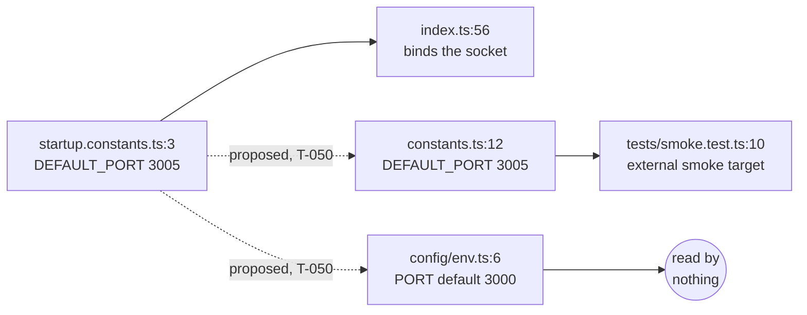

# T-050 · Analytics service env schema

**Gate 1 — plan.** No code written. HEAD `493e699`, tree clean, two commits ahead of
`origin/main`.

**Rules revision read from disk** (not from the injected copy — S-24 has fired repeatedly this
session): `.claude/rules/known-gaps.md` at `493e699`, **3 514 lines**, md5
`6eaa46936ca0d1a5f0e9f8244b6f4878`, running **S-5 … S-54** with **S-8 absent** (deleted by
`493e699`, the commit that closed it). Every gap cited below was re-read from that file, not
from a summary.

**No prior plan for this task.** `ls docs/plans/` has no `t-050-*`; this file is new, not an
extension or a replacement.

---

# Part 1 — for the analyst

## 1. In plain terms

The analytics service has a configuration file that declares which network port the service
should use. It says **3000**. Everything else in the platform that has an opinion — the
example config file, the Docker deployment, the port the container publishes, and the address
the API gateway uses to reach analytics — says **3005**.

Nothing is broken today, and nothing will break if we do nothing. The declaration is **not
read by anything**: the service picks its port from a different constant, which correctly says
3005. So the wrong number is a *statement that contradicts the deployment*, not a
misconfiguration that routes traffic anywhere. It is the same shape as the existing recorded
issue S-6 — config that is declared, validated, and then ignored.

**What changes.** Three small things, all inside the analytics service:

1. The configuration declaration stops saying 3000 and derives its number from the same
   constant the service actually uses, so the two can never disagree again.
2. The port number stops being written twice inside the service's own source, so there is one
   place to change it.
3. A new test file — the analytics service is the **only one of the six services with no test
   for its configuration schema** — which pins the number against the real deployment files.

**Who notices.** No user, no operator, no running process. The port the service binds is
byte-for-byte unchanged. The audience is the next developer, who currently has to guess which
of two numbers in the same service is authoritative.

**What it costs if this is wrong.** Very little, and that is worth saying plainly. The worst
realistic outcome of a mistake here is a failing test in one package, caught before commit. The
reason to do it now is the inverse: the cost of *not* doing it grows, because T-051 (the first
real analytics endpoint) adds routes to this service, and every later reader inherits the
contradiction. This is cheap housekeeping ahead of the feature work, not a fix for a live
defect.

**One thing this task deliberately does not do:** it does not add service-to-service
authentication to analytics. That gap (S-9) stays open on purpose — see §3.

### The four places the port lives, and which way the value should flow



Solid arrows exist today and the line number says where. The two dashed arrows are what T-050
proposes. `constants.ts:12` and `startup.constants.ts:3` today each write `3005` independently
with no arrow between them; `env.ts:6` today writes `3000` and feeds nothing.

---

## 2. Decisions

Two need an answer before Gate 3. Four more were settled here, with reasons, because a wrong
answer costs a one-line edit.

### D1 — Does T-050's commit also record the residue in `known-gaps.md`? *(changes the file set)*

After T-050, three facts remain true and are recorded nowhere durable:

- **usage-service has the identical divergence.** `apps/usage-service/src/config/env.ts:8`
  defaults `PORT` to `3000` while `apps/usage-service/src/startup.constants.ts:3` is `3002` and
  `apps/usage-service/src/index.ts:56` binds the latter. Measured, same grep as analytics'.
- **gateway and auth-service write their port two and three times respectively** with no
  derivation (`apps/gateway/src/config/env.ts:7`, `src/constants.ts:72`,
  `src/startup.constants.ts:3`, all `3100`; `apps/auth-service/src/constants.ts:157` and
  `src/startup.constants.ts:3`, both `3001`). Those agree by value, so they are DRY findings
  rather than contradictions.
- **`env.PORT` is dead in all six services** and only billing (T-044) and worker (T-037) say so
  in the source. After T-050 analytics says so too, leaving usage, gateway and auth silent.

| Option | What lands | Consequence |
|---|---|---|
| **A (recommended)** | One new `known-gaps.md` entry (next free id) covering all three bullets, citing T-050 as the reason analytics is no longer an instance | The residue survives this session. Adds `.claude/rules/known-gaps.md` to the diff, and the Gate-4 reviewer must re-derive its claims — that file is designated authoritative, so a false sentence in it is graded HIGH |
| B | Nothing outside `apps/analytics-service` | Smallest diff. The residue is recorded only here — and `CLAUDE.md` is explicit that nothing may read `docs/plans/` as a record. S-25 was filed rather than left in a plan for exactly this reason |
| C | An entry scoped only to usage-service's contradiction | Records the one live divergence and drops the two DRY findings |

**Recommendation: A.** The precedent is direct and recent: S-25 says "Filed rather than left to
the plan: `CLAUDE.md` says a plan marks a task *started* and nothing may read `docs/plans/` as
evidence." The usage-service bullet is a genuine divergence of the same class T-050 is fixing,
and the honest place for "we saw it and deliberately did not touch it" is the gaps file.

This is **not** a proposal to fix usage-service here. Folding another service's startup contract
into an analytics task is the one-task-per-commit objection that kept the old S-8 out of S-4 for
five tasks, and that S-19 and S-39 both record for their own duplications. Recording it is
cheap; fixing it is a separate task.

### D2 — Does the new test file include the deploy-artifact pin? *(changes the diff)*

The schema case alone proves the *declaration* agrees with the constant. It does not prove the
*number* is the one the deployment publishes — mutate `docker-compose.yml` to `3009:3009` and
every assertion still passes. Billing's suite solved this at T-044 by reading the real artifacts
at test time, after its Gate-5 QA showed a mutated gateway `.env.example` left both packages
fully green.

| Option | What lands | Consequence |
|---|---|---|
| **A (recommended)** | Schema cases **plus** a case that reads `apps/analytics-service/.env.example`, `docker/docker-compose.yml` (analytics block and gateway block) and `apps/gateway/.env.example`, each through a locator that **throws** unless it matches exactly once | ~90 extra lines. Analytics' suite reads two files outside its own package. All six locators verified to match exactly once today (P4) |
| B | Schema cases only | ~70-line file. A port change in compose or gateway's `.env.example` goes unnoticed, as it does today |

**Recommendation: A**, mirroring `apps/billing-service/tests/env.schema.unit.test.ts:203-263`.
Declining it is deleting one `it(...)` and three constants — a small edit either way, which is
why it is presented rather than assumed.

**Honest caveat, which must be in the plan rather than discovered at review:** option A's case
is **green on the current tree** (P4 — every artifact already says 3005, and the expected value
derives from the startup constant, which is also 3005). It is a *guard being added*, not a
regression test for the bug T-050 fixes. Only the schema case (AC1) goes red before the fix.
See §6 and §7.

### Settled here — recorded so they are not re-opened

- **D3 · analytics' `env.ts` carries the dead-field docblock.** Mirror
  `apps/billing-service/src/config/env.ts:8-11` and
  `apps/worker-service/src/config/env.ts:9-11`: two or three comment lines saying nothing reads
  the parsed `env.PORT` and that the default derives from the constant `index.ts` binds. Without
  it, the next reader sees a field that agrees with the deployment and reasonably concludes the
  service reads it. Cost if wrong: delete three lines.
- **D4 · `env.ts` imports `startup.constants.ts`, not `constants.ts`.** Both precedents exist —
  billing imports `BILLING_SERVICE_STARTUP` from `../startup.constants`; auth imports
  `AUTH_RUNTIME` from `../constants` (`apps/auth-service/src/config/env.ts:6,11`). Billing's is
  the direct precedent for this task family and keeps the derivation pointing at the one module
  that must stay import-free. Rejected auth's shape because it makes `constants.ts` an upstream
  of `env.ts` *and* a downstream of `startup.constants.ts`, for no gain.
- **D5 · `ANALYTICS_RUNTIME.HOST` stays a duplicate literal.** `constants.ts:13` and
  `startup.constants.ts:4` both write `"0.0.0.0"`. Billing left exactly this duplicated at T-044
  and only collapsed `DEFAULT_PORT`. `HOST` is not the divergence this task is about, and the
  two copies agree. Collapsing it is a legitimate NIT for a reviewer to raise; it is being
  declined on precedent, not overlooked.
- **D6 · The epic is not edited.** For once the epic is *right*: `docs/epics/epic-9-analytics-service.md:24`
  says `3005` and the code says `3000`. This is the inverse of S-17 / S-29 / S-32 / S-47 / S-50,
  where the code was right and the epic wrong. There is nothing to correct. See §4.

---

## 3. Scope and non-goals

**In scope** — three files in one package, plus (under D1-A) one gaps entry:

- `apps/analytics-service/src/config/env.ts` — `PORT` derives from
  `ANALYTICS_SERVICE_STARTUP.DEFAULT_PORT`; docblock per D3.
- `apps/analytics-service/src/constants.ts` — `ANALYTICS_RUNTIME.DEFAULT_PORT` derives from the
  same constant instead of repeating `3005`.
- `apps/analytics-service/tests/env.schema.unit.test.ts` — new.
- `.claude/rules/known-gaps.md` — only under D1-A.

**Non-goals, and what is deliberately left broken:**

- **No `INTERNAL_API_SECRET`, and S-9 stays open.** S-9's own fix direction is "add the guard
  *before* the first tenant-scoped route, not after"; that route is T-051.
  `apps/analytics-service/src/middleware/index.ts` is literally `export {};` — there is no guard
  to feed. A declared-but-unenforced secret field is precisely the shape the S-8 task spent a
  whole commit unpicking across four services. Settled at Gate 0; not re-opened here.
- **No wiring of `env.PORT` into `index.ts`.** Argued with a measurement in §5.3. A reviewer
  should read that section before asking for it.
- **usage-service's identical divergence is not fixed** (D1 records it instead).
- **No `TimeZone` pin in analytics' `base.repository.ts`.** S-19: analytics is one of the four
  copies without it (measured: 111 lines, `grep -c TIME_ZONE` → `0`) and has **no subclass at
  all** (`grep -rn "extends TenantScopedRepository" apps/*/src` returns four subclasses, in
  billing, usage and worker only). Nothing in analytics reaches the database yet, so this bites
  T-051, not T-050. Note in passing: **both** citations in S-19's table have moved on this tree,
  not just the one an earlier revision of this bullet named. From
  `grep -rn "extends TenantScopedRepository" apps/*/src` filtered to lines beginning
  `export class`: `apps/billing-service/src/repositories/invoice.repository.ts:94` is **`:367`**,
  and `apps/worker-service/src/repositories/event.repository.ts:64` is **`:73`**. (The other two
  rows, `usage.repository.ts:150` and `meter.repository.ts:35`, still hold.) S-19 itself says
  "Re-run the grep rather than trusting the column," and for the invoice citation this is the
  third move — S-19 records `:87` -> `:92` -> `:94` before this one. **Not fixed here**: S-19 is
  explicitly dated ("Line numbers are as of the T-045 tree") and explicitly self-immunizing, so
  it is stale rather than false, and editing another service's gap entry inside an analytics
  env-schema commit is the objection S-19 itself records. Gate 4 ruled leaving it alone correct.
- **No change to epic-9's rollup snippet.** S-53 records that it applies `AT TIME ZONE 'UTC'` to
  the *column* rather than the bound parameter, which is the mistake `CLAUDE.md` § *Raw SQL and
  timestamps* names. T-050 writes no SQL; that is T-051's problem.
- **S-54** (`internalApiSecretSchema` has no maximum length) would only have been relevant had
  this task added the secret field. It does not. Mentioned once, here, so the Gate-4 reviewer
  can see it was considered and dismissed for a reason.
- **No prometheus scrape target.** `docker/prometheus/prometheus.yml` contains no analytics
  target (`grep -rn "3005\|analytics" docker/prometheus` → no match) while
  `docs/epics/epic-10-observability.md:131` specifies one. That belongs to epic 10.

---

## 4. Findings against the epic spec, and the Q3 disagreement

The epic is shorthand and S-15 says the epic files are not a reliable manifest. Every field was
checked against the code (P1).

| Epic `epic-9:22-29` | Code `src/config/env.ts:4-11` | Verdict |
|---|---|---|
| `NODE_ENV` enum, default `"development"` | identical | matches — P1/G, P2/J |
| `PORT` `.coerce.number().int().positive().default(3005)` | `.default(3000)` | **divergent — and the epic is right** |
| `DATABASE_URL: z.string().min(1)` | identical | matches — P1/E |
| `REDIS_URL: z.string().min(1)` | identical | matches — P1/E |
| `OTEL_EXPORTER_OTLP_ENDPOINT: z.string().min(1)` | identical | matches — P1/E |
| `LOG_LEVEL: z.string().default("info")` | identical | matches — P2/J |

So exactly **one** of six fields diverges, and it is the one this task fixes. Field set
confirmed as the same six, in the same order (`Object.keys(EnvSchema.shape)` → P1/H).

**Two further observations on the epic, neither blocking:**

- **The T-050 section has no acceptance criteria.** `docs/epics/epic-9-analytics-service.md:17-30`
  is a heading, a **File:** line and a snippet — nothing else. T-051 through T-054 in the same
  file all carry **Acceptance** blocks. The ACs in §7 are therefore *derived*, not quoted, and
  should be read as this plan's proposal rather than as the epic's contract.
- **`DIRECT_DATABASE_URL` is used but declared in no schema.**
  `apps/analytics-service/tests/setup.ts:8` sets it and `EnvSchema` does not declare it
  (`"DIRECT_DATABASE_URL" in EnvSchema.shape` → `false`, P1/I). That is **not** a divergence and
  **not** in scope: no service declares it (`grep -rn "DIRECT_DATABASE_URL" apps/*/src/config/env.ts`
  → no match), it is an integration-fixture and Prisma `directUrl` concern, and
  `.claude/rules/tenant-isolation.md` is explicit that a running service must never be pointed at
  it. Recorded so the next reader does not "fix" it.

### Q3 — the README and the epic file disagree, and this plan resolves nothing

- `docs/epics/README.md:19` lists `Q3 — UTC aggregation timezone | Epic 9` **with no `(**decided**: …)`
  marker**, unlike Q2, Q8, Q9 and Q10 on the surrounding lines. `:117` then lists Epic 9's
  dependencies as "Epic 3, **Q3**".
- `docs/epics/epic-9-analytics-service.md:13` says "Bucket boundary timezone — **assumed UTC
  midnight until confirmed**", i.e. the epic file has provisionally answered the question the
  README says is open.

Read literally, the README gates all of Epic 9 behind an undecided question — the same shape
S-15 records for Q5 and Epic 4. **Reported, not resolved**, exactly as S-15 requires.

**Q3 does not bear on T-050.** This task declares six environment fields and contains no
timestamp, bucket, granularity or `DATE_TRUNC` logic of any kind. Whatever Q3 is decided to
mean, the diff is identical. It bears on T-051, where it belongs with S-53.

---

# Part 2 — for the implementer

## 5. Ground truth — each claim with the command that established it

### 5.1 The declaration contradicts nine deploy and source artifacts

**The durable figure first, because the obvious one is not durable.**
`git grep -n "3005" -- ':!docs' ':!.claude' ':!*/tests/*'` returns **7 lines carrying 8
occurrences of the number** — the five deploy-artifact lines tabulated below (six numbers,
because `docker-compose.yml:132` is `"3005:3005"`), plus `src/startup.constants.ts:3` and the
one prose line in `src/config/env.ts:13`. Measured **7 on all three views of this tree**:
`git grep … HEAD …` → 7, the delivered working tree → 7, and `git grep --untracked …` → 7,
that last one standing in for the post-commit tree because it is the only view that sees
T-050's three new files. That is the measurement, and it is what the claim is: the three files
this task adds do not move this figure. It is not a claim that nothing ever can — an edit to
`startup.constants.ts`, a compose block or either `.env.example` moves it by design, which is
the point of pinning those five.

**The unscoped count moves, and it moved inside this commit.** `git grep -n "3005"` returns
**15** on the delivered tree, not the 14 an earlier revision of this line claimed (P3). 14 is
exactly the HEAD figure and also exactly the delivered figure once `.claude/rules/` is excluded,
so the earlier revision was either run before slice 4 or run and then classified without that
row — both readings give 14 and nothing on this tree distinguishes them. The fifteenth is
`.claude/rules/known-gaps.md:3571`, the S-55 table row slice 4 added —
`git show HEAD:.claude/rules/known-gaps.md | grep -c "3005"` → `0`. That is the **S-33
self-match**: a count stated in a commit that is itself changing what the count counts, and
this task handled the identical pattern correctly for the `env.PORT` grep in §5.2 ("count the
binds, not the lines") and missed it here. Caught at Gate 4 as LOW-2; it was twenty lines away
from its own remedy when Gate 4 found it.

It moves again at commit, harder: `git grep` reads tracked files only, so T-050's own three new
files are invisible to it today and counted afterwards. Two of the three can be quoted, because this paragraph is not in either of them:
`grep -c "3005"` returns **13** for `apps/analytics-service/tests/env.schema.unit.test.ts` and
**26** for `docs/reviews/t-050-analytics-env-schema.md` as of the Gate-3 rework, both re-derived
after the rework's last edit to the test file.

The third is **this plan**, and its count is deliberately **not** quoted. Every edit to this
section changes it, including the edit that would state it — and that is a measurement, not a
worry: a draft of this very paragraph quoted its own before-and-after figures, and the next
revision of the paragraph falsified them before anyone else read it. Two drafts, two stale
numbers, inside the correction written for exactly that defect. `git grep -n --untracked
"3005" | wc -l` has the same problem for the same reason. Run either command if you need the
figure; what belongs in prose is the pathspec-scoped **7** — not the 15, and not these.

The 15 classifies as 1 (`.claude/rules/`, above) + 14, and those 14 are what follows. Classified
because "eight artifacts" is a claim and the classification is what makes it actionable:

**Deploy artifacts — a deployment reads these (5 sites, 6 numbers):**

| Site | Text |
|---|---|
| `apps/analytics-service/.env.example:6` | `PORT=3005` |
| `docker/docker-compose.yml:130` | `PORT: "3005"` (analytics-service `environment`) |
| `docker/docker-compose.yml:132` | `- "3005:3005"` — published **and** container port |
| `docker/docker-compose.yml:189` | `ANALYTICS_SERVICE_URL: http://analytics-service:3005` (gateway block) |
| `apps/gateway/.env.example:24` | `ANALYTICS_SERVICE_URL=http://localhost:3005` |

`docker-compose.yml:189` was **not** in the Gate-0 list of eight. It is a real deploy artifact —
gateway's address for analytics — and it is pinned by the D2-A case.

**Source constants (2), on the pre-fix tree:** `src/constants.ts:12`, `src/startup.constants.ts:3`.
The classification in this subsection is the **problem statement** and its figures describe the
tree T-050 started from; the two paragraphs above it were re-measured at the Gate-3 rework and
describe the delivered tree. On the delivered tree there is **one** source constant:
`src/constants.ts` writes no `3005` at all — it derives, at `:20` — which is the fix.

**Every one of these totals is identical on both trees, and the membership is not.** The durable
grep returns 7 at HEAD and 7 delivered; the unscoped non-`.claude` count is 14 on both; the
non-prose count is 9 on both. The reason is a one-for-one swap: `src/constants.ts:12`'s
executable `DEFAULT_PORT: 3005` at HEAD is replaced on the delivered tree by the prose line
`src/config/env.ts:13`. Listed both ways with
`git grep -n "3005" HEAD -- ':!docs' ':!.claude' ':!*/tests/*'` against the same command without
`HEAD`. That is the sharpest reason in this task to quote a grep **with its classification**
rather than as a number: every number here survived the fix unchanged while the thing the
numbers are about did not.

**Test fixtures (2), deliberately not pinned:** `apps/analytics-service/tests/setup.ts:3` and
`apps/gateway/tests/env.schema.unit.test.ts:66`. Billing drew this line explicitly at T-044
(`tests/env.schema.unit.test.ts:196-202`): a fixture is not a deploy artifact, nothing reads the
parsed `env.PORT`, and analytics' own smoke test listens on port 0 (`tests/smoke.test.ts:19`)
except in `SMOKE_TARGET=external` mode. Note billing's suite likewise does not pin gateway's
test fixture at `:65`, which is the same decision made by the same precedent.

**Prose (5), out of scope:** `docs/epics/epic-9-analytics-service.md:24`,
`docs/epics/epic-3-shared-service-infra.md:177` and `:186`,
`docs/epics/epic-10-observability.md:131`, `docs/qa/t-038-consumer-group-bootstrap.md:509`.

So: **9 non-prose sites carrying 10 occurrences of the number**, against one declaration saying
3000.

### 5.2 Nothing reads the parsed `env.PORT` — stated as measured, not as a universal

Two greps over `apps/*/src` and `packages/*/src`, `--include='*.ts'`, `dist/` filtered:

- `grep -rn "env\.PORT\|\.PORT\b"` returns **10 lines on the pre-fix tree** and **12 on the
  delivered one** — the same self-match as §5.1, in the opposite direction, because the two lines
  it gained are the comment this task adds to analytics' `env.ts` documenting the deadness this
  grep measures. Both counts are six `const port = Number(process.env.PORT ?? …STARTUP.DEFAULT_PORT)`
  binds (analytics `:56`, auth `:56`, billing `:56`, gateway `:55`, usage `:56`, worker `:276`)
  plus comment lines: four at HEAD, in billing's and worker's `env.ts`, six delivered, with
  analytics' two. **Count the binds — six on both trees — not the lines.** Re-derived at the
  Gate-3 rework against a `git archive HEAD` extraction and against the working tree.
- `grep -rn "\[\s*[\"']PORT[\"']\s*\]"` returns **nothing**, so the dynamic-access form is
  absent too. A negative grep is only evidence if the pattern works, so it was run against a
  positive control first (a throwaway file holding `const a = env["PORT"];`,
  `const b = env[ 'PORT' ];` and `const c = env[PORT_KEY];`): it matched the first two and not
  the third. The empty result on the real tree is therefore a real negative, and the third line
  is exactly the computed-key case the caveat below says it does not exclude.

**What that establishes and what it does not.** It establishes that no *static, statically
spelled* read of the parsed value exists in either search root. It does not exclude a computed
property name, a spread of the whole `env` object into something that later indexes it, or a
read from a package outside those two roots. `apps/analytics-service/src/config/container.ts:17-43`
does take the whole `ServiceEnv` and store it on the container, and it reads only `env.REDIS_URL`
(`:22`) — checked by reading the file. The weaker, true statement is what belongs in the code
comment: *no read of `env.PORT` was found under `apps/*/src` or `packages/*/src`.*

### 5.3 Why `env.PORT` must **not** be wired into `index.ts` — measured

`apps/analytics-service/src/index.ts` imports exactly two modules at the top (`:1-2`):
`@telemetry/shared-tracing` and `./startup.constants`. It calls `initTracing(...)` at `:18` and
only then reaches `./app` through a **dynamic** `await import("./app")` at `:22`. `app.ts:3`
imports `./config/env`, which pulls in `zod` and `@telemetry/shared-config`. That ordering is
what `CLAUDE.md` § *Startup ordering* and every `startup.constants.ts` in the repo exist to
produce.

Wiring `env.PORT` into the bind at `:56` requires a **static** import of `./config/env` at the
top of `index.ts`, which hoists that module graph ahead of `initTracing`. Measured on Node
v22.22.2 with a four-file ESM fixture (P5), not inferred from the spec:

```
A. static import of the heavy module (proposed wiring):
  [heavy module body evaluated]
  [initTracing(analytics-service) called]
B. dynamic import after initTracing (index.ts as it stands):
  [initTracing(analytics-service) called]
  [heavy module body evaluated]
```

Scope of that measurement: plain `.mjs` files on one Node version, one static import and one
dynamic import. It shows the ordering property that matters and nothing more — it is not a claim
about tsx, about bundlers, or about what OpenTelemetry instrumentation would actually miss.
A `const { env } = await import("./config/env")` *after* line 18 would preserve the ordering, and
is still rejected: it adds an await and a second source of truth for a value that
`ANALYTICS_SERVICE_STARTUP.DEFAULT_PORT` already supplies at `:56`, and no other service does it.

### 5.4 Analytics is the only service of six without an env-schema suite

`ls apps/*/tests/env.schema.unit.test.ts` returns five files — auth (301 lines), billing (578),
gateway (226), usage (375), worker (982). Analytics has none.

**Correction to the Gate-0 brief, because the plan is built on it.** The brief nominates
gateway's as "the closest analogue — same six fields, no service-URL block". Measured, that is
wrong twice: gateway's `EnvSchema` has **13** fields, not six
(`apps/gateway/src/config/env.ts:5-37`, including four service URLs and three rate limits), and
its *suite* asserts **only** `INTERNAL_API_SECRET` — it contains no `PORT` case at all (`grep -n
"PORT" apps/gateway/tests/env.schema.unit.test.ts` matches one line, and that line is
`OTEL_EXPORTER_OTLP_ENDPOINT`). Gateway also parses lazily via `loadEnv()` (`:41-43`), where
analytics parses at module load, so even its module shape differs.

> **Correction, Gate 3.** The count above is **14**, not 13, measured with
> `Object.keys(EnvSchema.shape)` on `apps/gateway/src/config/env.ts` via tsx: `NODE_ENV, PORT,
> REDIS_URL, OTEL_EXPORTER_OTLP_ENDPOINT, LOG_LEVEL, JWT_SECRET, INTERNAL_API_SECRET,
> AUTH_SERVICE_URL, USAGE_SERVICE_URL, BILLING_SERVICE_URL, ANALYTICS_SERVICE_URL, RATE_LIMIT_MAX,
> RATE_LIMIT_WINDOW_MS, INGESTION_RATE_LIMIT_MAX`. This sentence's own enumeration sums to 14
> (four service URLs + three rate limits + seven others), so the numeral was wrong and the
> enumeration was right. Nothing downstream depended on it — the conclusion, that gateway's suite
> is not the model, stands on the other two measurements in this paragraph, both of which
> re-derived correctly (`loadEnv` at `:41`; `grep -n "PORT"` over gateway's suite matches one
> line, `OTEL_EXPORTER_OTLP_ENDPOINT`). Recorded rather than silently edited, per S-33.

> Placement, Gate-3 rework (Gate-4 NIT-2): this block sat between "**13** fields, not six" and
> the "and its *suite* asserts" that continues it, which left the host sentence unparseable. It
> is moved below the whole sentence rather than deleted, and the wrong numeral is deliberately
> left standing above it, because S-33's remedy is a visible correction rather than a silent
> edit.

**The right model is billing's** (`apps/billing-service/tests/env.schema.unit.test.ts`), with
worker's as a second reference:

- it is the direct precedent — T-044 is this task for billing, including the same 3000-vs-3004
  divergence;
- it has the `defaults PORT to the port index.ts binds` case (`:163-173`);
- it has the deploy-artifact pin (`:203-263`) and the throwing locators (`:114-147`);
- it parses at module load, as analytics does.

### 5.5 Baselines, measured now

| Check | Result |
|---|---|
| `pnpm --filter @telemetry/analytics-service test` | **4 files, 18 tests, all passing**, 739 ms |
| `pnpm --filter @telemetry/analytics-service typecheck` | clean, no output |
| `pnpm --filter @telemetry/analytics-service lint` | clean, no output |
| Test-id scheme in analytics' suites | **none** — no `U`/`I`/`A`/`B` prefixes. Use descriptive `it()` titles with `AC` tags in comments, as billing does |

(The graceful-shutdown suite prints an `EACCES` stack while passing; that is pre-existing and
not this task's.)

Versions in play: Node v22.22.2, vitest 2.1.9, zod 3.25.76.

---

## 6. Files to change

**Modified — production (2 files, both in `apps/analytics-service`):**

| File | Change |
|---|---|
| `src/config/env.ts:6` | `PORT: z.coerce.number().int().positive().default(ANALYTICS_SERVICE_STARTUP.DEFAULT_PORT)`, plus a new import of `ANALYTICS_SERVICE_STARTUP` from `../startup.constants` and the D3 docblock |
| `src/constants.ts:12` | `DEFAULT_PORT: ANALYTICS_SERVICE_STARTUP.DEFAULT_PORT`, plus a new import from `./startup.constants` and a short comment naming `tests/smoke.test.ts:10` as the live reader |

**Added — tests (1 file):** `apps/analytics-service/tests/env.schema.unit.test.ts`.

**Modified — rules (1 file, D1-A only):** `.claude/rules/known-gaps.md`.

**Deliberately not modified:** `src/startup.constants.ts` (it must stay import-free — it is the
module `index.ts` loads before `initTracing`; verify with `grep -c "^import" src/startup.constants.ts`
→ must remain `0`), `src/index.ts`, `src/app.ts`, `tests/setup.ts`, `.env.example`,
`docker/docker-compose.yml`, `apps/gateway/**`, `apps/usage-service/**`,
`docs/epics/epic-9-analytics-service.md`.

---

## 7. Implementation slices — smallest safe first

Pseudo-TDD per `.claude/rules/testing.md`: the whole test file is written first, run, and the
red/green split recorded verbatim before any source edit.

### Slice 1 — write `tests/env.schema.unit.test.ts` and confirm the split

**Controlling code path:** `apps/analytics-service/src/config/env.ts:4-11`, reached by
`import { EnvSchema } from "../src/config/env"` — which also executes
`parseEnv(EnvSchema, process.env)` at `:15`, satisfied by `tests/setup.ts`.

**Structure**, copied in shape from `apps/billing-service/tests/env.schema.unit.test.ts:38-147`:
`buildBaseEnv()`; `buildEnvWithout(key)` that **throws** when the key is already absent;
`expectIssueOn(parsed, field)`; `extractSoleMatch(source, pattern, description)` that throws
unless it matches exactly once; `extractComposeServiceBlock(compose, name)`.

**Falsifiable local hypothesis:** *the case `defaults PORT to the port index.ts binds` is red on
the unmodified tree, and it is the only new case that is.* Falsified if any other new case is
also red, or if that one passes.

**Pre-measured** (P1/C): `EnvSchema.safeParse(baseWithoutPort).data.PORT` is `3000` and
`ANALYTICS_SERVICE_STARTUP.DEFAULT_PORT` is `3005`, so the equality the case asserts evaluates
**false** today. That is the predicate measured directly, not a test run — the implementer runs
the suite and pastes the real failure.

**Expected green-from-the-start cases, and why that is not a pseudo-TDD violation:** the
artifact-pin case (D2-A) and the regression cases for the other five fields. They are guards,
not regression tests for this bug; `.claude/rules/testing.md` asks that a test *have failed*
for the behaviour it claims to prove, and what these prove has never been broken. Label each in
the file, and report the split honestly at hand-off — "18 → N tests, 1 confirmed red" is the
truthful sentence, not "the new suite was confirmed red".

### Slice 2 — `env.ts` derives the default

**Controlling code path:** `apps/analytics-service/src/config/env.ts:6`.

**Falsifiable local hypothesis:** *slice 1's red case turns green and no other analytics case
changes state.* Falsified if the 18 pre-existing tests do not all still pass, or if typecheck
reports a circular import between `config/env.ts` and `startup.constants.ts` (it will not —
`startup.constants.ts` imports nothing).

**Second hypothesis, about the rest of the platform:** *nothing outside analytics changes
behaviour.* Falsified by any red test in the other 12 packages at the full gate. The reasoning
is §5.2, and §5.2 is deliberately weaker than "nothing reads it" — the gate is what settles it.

### Slice 3 — `constants.ts` derives from `startup.constants.ts`

**Controlling code path:** `apps/analytics-service/src/constants.ts:11-14`, read by
`tests/smoke.test.ts:10` in `SMOKE_TARGET=external` mode.

**Falsifiable local hypothesis:** *after this slice, `grep -c "3005" apps/analytics-service/src`
is `1` (only `startup.constants.ts`), and `pnpm --filter @telemetry/analytics-service test` is
still fully green.* Falsified by either half.

**Carry the caveat billing measured.** Once `ANALYTICS_RUNTIME.DEFAULT_PORT` *is*
`ANALYTICS_SERVICE_STARTUP.DEFAULT_PORT`, the assertion
`expect(ANALYTICS_RUNTIME.DEFAULT_PORT).toBe(ANALYTICS_SERVICE_STARTUP.DEFAULT_PORT)` compares
one expression with itself and **cannot fail**. Billing measured exactly this at its Gate 5 by
setting the startup constant to 9999 and watching only the artifact case go red
(`apps/billing-service/tests/env.schema.unit.test.ts:155-162`). Keep the assertion — it regains
teeth if someone reintroduces a differing literal — but comment it so no reviewer or later
reader takes it for a guard on the number. The number is pinned by AC3.

### Slice 4 — `known-gaps.md` entry *(only under D1-A)*

`cat .claude/rules/known-gaps.md` from disk first and take the next free id after the current
maximum — **do not** trust an injected copy for the maximum (S-24, and the ids-are-never-reused
rule at the top of that file). Every sentence in the entry must name the command that
established it; the Gate-4 reviewer will re-run them and grades a false claim there as HIGH.

---

## 8. Test plan and acceptance-coverage mapping

Acceptance criteria are **derived** — epic-9's T-050 section states none (§4).

| AC | Behaviour | Test(s) | Red before the fix? |
|---|---|---|---|
| AC1 | `PORT` omitted parses to `ANALYTICS_SERVICE_STARTUP.DEFAULT_PORT` | `defaults PORT to the port index.ts binds` | **yes** — 3000 vs 3005 (P1/A, P1/C) |
| AC2 | `ANALYTICS_RUNTIME.DEFAULT_PORT` equals the startup constant | second assertion of the same case | no — both are `3005` literals today; toothless after slice 3 (see §7 S3) |
| AC3 | the number agrees with every deploy artifact: analytics `.env.example`, compose `environment.PORT`, compose published **and** container port, compose gateway `ANALYTICS_SERVICE_URL`, gateway `.env.example` | `pins DEFAULT_PORT to the port every deploy artifact publishes` (D2-A only) | no — a guard being added. All six locators match exactly once today (P4) |
| AC3b | a second compose consumer of `ANALYTICS_SERVICE_URL` cannot appear unnoticed | whole-file count assertion, `expect(compose.match(/^ +ANALYTICS_SERVICE_URL:/gm)).toHaveLength(1)` | no — exhaustiveness guard. Currently 1 (P4/M) |
| AC4 | `PORT` coerces a numeric string; rejects `0`, negative, float, non-numeric, empty | `coerces a numeric PORT` + `rejects a PORT that is not a positive integer` | no — pre-existing behaviour, first coverage. Messages measured in P1/D |
| AC5 | `NODE_ENV` defaults to `"development"` and rejects an out-of-enum value | `defaults NODE_ENV` / `rejects an unknown NODE_ENV` | no — regression guards (P2/J, P1/G) |
| AC6 | `LOG_LEVEL` defaults to `"info"` | `defaults LOG_LEVEL` | no — regression guard (P2/J) |
| AC7 | `DATABASE_URL`, `REDIS_URL`, `OTEL_EXPORTER_OTLP_ENDPOINT` are required | three `rejects an env with no <field>` cases via `buildEnvWithout` | no — regression guards (P1/E) |
| AC8 | the six-field set is exactly the epic's, in order | `declares exactly the six documented fields` over `Object.keys(EnvSchema.shape)` | no — drift guard (P1/H) |

**Vacuity hazards to design against:**

- `buildEnvWithout` must throw when the key is absent, or "rejects an env with no X" degenerates
  into "accepts the base env" (`.claude/rules/testing.md`; billing's comment at `:47-51`).
- `extractSoleMatch` must throw on zero matches *and* on more than one. A regex that silently
  matches nothing turns AC3 into a test that cannot fail. Its error message should say **fix the
  locator, do not delete the assertion**.
- A "control" case asserting the base fixture parses is required; without it every rejection
  case could be passing because the fixture is malformed for an unrelated reason.
- `.claude/rules/constants.md` applies to tests: no bare `3005` and no bare `3000` anywhere in
  the new file. Every expected port derives from `ANALYTICS_SERVICE_STARTUP.DEFAULT_PORT`. Note
  usage-service's suite writes `PORT: "3000"` as a literal in its own fixture
  (`apps/usage-service/tests/env.schema.unit.test.ts:25`) — do not copy that.
- `noUncheckedIndexedAccess` is on (`tsconfig.base.json`), so destructured regex groups are
  `string | undefined`; billing's `extractSoleMatch` narrows inside the throw (`:118-125`).
  Reproduce that shape rather than asserting non-null.

---

## 9. Validation commands

Task-scoped, while iterating:

```bash
pnpm --filter @telemetry/analytics-service exec vitest run tests/env.schema.unit.test.ts
pnpm --filter @telemetry/analytics-service test
pnpm --filter @telemetry/analytics-service typecheck
pnpm --filter @telemetry/analytics-service lint
pnpm --filter @telemetry/analytics-service build
```

Note `pnpm --filter <pkg> test -- <file>` does **not** scope to the file; the `exec vitest run`
form above is the one that does (`CLAUDE.md`, `.claude/rules/testing.md`).

Full gate, once stable — all 13 packages, `--force` so turbo re-runs rather than replays a
cached result:

```bash
pnpm build --force
pnpm test --force
pnpm lint --force
pnpm typecheck --force
```

`pnpm test` needs live Postgres and Redis (`.claude/rules/testing.md` — the integration suites
run inside it). Both are up. Nothing in T-050 touches either; the four-file analytics suite runs
in well under a second and opens no connection (its ioredis client is `lazyConnect`,
`src/config/container.ts:22-26`).

`pnpm format:check` is **not** part of the gate and cannot pass (S-12). If `pnpm install` is
needed: `pnpm install --store-dir /home/admin1/snap/code/258/.local/share/pnpm/store/v10`.

---

## 10. Risks and mitigations

| # | Risk | Mitigation |
|---|---|---|
| R1 | AC3 couples analytics' suite to two files outside its package; a compose reformat reddens analytics for a reason that is not analytics' | Locators throw with a message naming the artifact and saying to fix the locator. Exactly billing's shape, which has survived T-042's addition of a second compose consumer |
| R2 | AC2 becomes an assertion that cannot fail after slice 3, and is later read as if it guarded the number | Inline comment stating it, citing billing's Gate-5 measurement. AC3 is what pins the number |
| R3 | A reader concludes from the matching default that the service now reads `env.PORT` | The D3 docblock, worded as the *measured* claim of §5.2 (no read found under two search roots) rather than as a universal |
| R4 | The injected `.claude/rules/*` are stale (S-24 — fired repeatedly this session; disk runs to S-54 while injected copies ended at S-39 and still contained the deleted S-8) | Slice 4 `cat`s the file from disk before editing, and the entry states which revision it was written against |
| R5 | Turbo replays a cached gate and the reviewer reprints the implementer's run | `--force` on all four root commands (`.claude/rules/review-standards.md`) |
| R6 | The gaps entry itself carries a wrong count or a stale line number — the S-33 failure mode, which has bitten inside the commit that introduced it repeatedly | Every sentence names its command; re-run each immediately before hand-off, including the S-19 line-number correction noted in §3 |
| R7 | Scope creep into usage-service, or into S-9's secret field | §3 and D1 state both exclusions with the precedent that forbids them |

---

## 11. Pending task checklist

- [done] **User answers D1** (gaps entry: A / B / C) and **D2** (artifact pin: A / B) — **D1 = A, D2 = A** at Gate 2
- [done] Slice 1 — suite written (12 cases); verbatim split `Tests  1 failed | 11 passed (12)`, the failure `expected 3000 to be 3005`
- [done] Slice 2 — `env.ts` derives `PORT` from `ANALYTICS_SERVICE_STARTUP.DEFAULT_PORT`; suite `12 passed (12)`
- [done] Slice 3 — `constants.ts` derives `DEFAULT_PORT`. `grep -rn "3005" apps/analytics-service/src` returns **2** lines, not 1: `startup.constants.ts:3` (the sole executable occurrence) and one prose line inside `config/env.ts`'s docblock. Same shape as billing, where `grep -rn "3004" apps/billing-service/src` returns one executable and **two** comment lines
- [done] Slice 4 — **S-55** appended, written against the on-disk revision (3 514 lines, md5 `6eaa46936ca0d1a5f0e9f8244b6f4878`, running S-5..S-54 with S-8 absent)
- [done] `grep -c "^import" src/startup.constants.ts` still `0` (and `0` for all six services)
- [done] Task-scoped typecheck / lint / build / test all clean; analytics 4 files/18 tests -> **5 files/30 tests**
- [done] Full gate with `--force`: build 13/13, typecheck 13/13, lint 13/13, test 13/13 — **1040 tests** (1028 + 12). `pnpm test:smoke` 6 services / 7 tests
- [done] 14 lint warnings, all pre-existing: 10 in `apps/auth-service/tests/auth.service.unit.test.ts` (`d68e719`), 4 in `apps/usage-service/tests/ingestion.service.unit.test.ts` (`b0f6921`); neither file appears in `git diff --name-only`. Zero `no-unsafe-return`
- [done] Hand-off states: baseline 18 tests -> 30; **one** case confirmed red; the other 11 green
      from the start, each labelled in the file
- [done] No commit, no staging, no branch

### Gate-3 rework (answering Gate 4's `CONDITIONAL`) — text only, no source or test logic changed

- [done] **LOW-1** — `tests/env.schema.unit.test.ts` port-fixture note brought to the measured
      form: "no statically spelled read of the parsed `env.PORT` was found under
      `apps/<service>/src` or `packages/<pkg>/src`", with the roots named (13 directories,
      `apps/web/src` among them), the 12-line result classified as six binds plus six comment
      lines, and the three things it does not exclude spelled out
- [done] **LOW-2** — §5.1 now leads with the pathspec-scoped **7** (identical at `HEAD`, on the
      working tree, and under `--untracked`), states the unscoped figure as **15** with the
      `.claude/rules/` self-match named, and declines to quote counts of files this plan can edit
- [done] §5.1's "Source constants (2)" and §5.2's "10 lines" re-qualified to the tree they
      describe; the HEAD/delivered membership swap (`constants.ts:12` -> `config/env.ts:13`)
      recorded, since every total survived the fix unchanged and the membership did not
- [done] §5.2's negative grep given its positive control in writing
- [done] **NIT-1** — §12 headed as Gate-2 text superseded at Gate 3, with both decisions' answers
- [done] **NIT-2** — the Gate-3 gateway-field-count correction moved below its host sentence; the
      wrong numeral left visible above it, per S-33
- [done] **NIT-3** — both rotted S-19 citations named (`invoice.repository.ts:94` -> `:367`,
      `event.repository.ts:64` -> `:73`), with the two rows that did not rot; S-19 itself untouched
- [done] **NIT-4** — disposition **keep**, now recorded in the test file at the declaration rather
      than only in the review
- [done] S-55 finding 3 extended: billing's and worker's `env.ts` carry the unqualified form of
      the same claim, both pre-existing at `493e699`, recorded and deliberately not fixed
- [done] Re-validated: analytics **30**, root **1040** with `--force`, `pnpm test:smoke` 6/7

---

## 12. Approval gate

> **Section 12 is the Gate-2 text, kept as written and superseded at Gate 3.** Both decisions
> below were answered (D1 → yes, the `known-gaps.md` entry shipped as S-55; D2 → A, the
> deploy-artifact pin), every slice in §11 is `[done]`, and the suite, the two source files and
> the S-55 entry all exist. Read §11 for state; read this section only for what was asked and
> when. Flagged at Gate 4 as NIT-1 — the same residual shape S-32 records for epic-7, where
> correct text sits below wrong text and a reader meets the wrong text first.

**Stopping here for approval. No production code and no tests have been written.**

This plan is complete except for two decisions that need the user:

1. **D1 — does the commit include a `known-gaps.md` entry** for usage-service's identical
   divergence and the two DRY duplications? *(A: yes, one entry — recommended · B: no, plan only
   · C: entry scoped to usage-service alone.)* Changes the file set.
2. **D2 — does the new test file include the deploy-artifact pin** that reads `.env.example`,
   `docker-compose.yml` and gateway's `.env.example`? *(A: yes, mirroring billing — recommended
   · B: schema cases only.)* Changes the diff by roughly 90 lines and by one cross-package
   coupling.

Settled at Gate 0 and not re-opened: minimal T-050, **no `INTERNAL_API_SECRET`** (S-9 stays
open until T-051).

Settled in this plan with reasons, reversible by a one-line edit: **D3** the dead-field docblock,
**D4** `env.ts` imports `startup.constants.ts`, **D5** `HOST` stays duplicated, **D6** the epic is
not edited.

Reported and deliberately unresolved: the **Q3** disagreement between `docs/epics/README.md:19`
and `docs/epics/epic-9-analytics-service.md:13` (§4). It does not affect this diff.

**Proposed slice order:** 1 (tests, confirm red) → 2 (`env.ts`) → 3 (`constants.ts`) → 4
(`known-gaps.md`, D1-A only) → full gate.

---

# Appendix — probe transcripts

All probes read-only. No database or Redis write was issued; row counts unchanged by
construction — nothing below opens a Postgres or Redis connection.

## P1 · `EnvSchema` behaviour, against `src/` via tsx

`cd apps/analytics-service && DATABASE_URL=x REDIS_URL=x OTEL_EXPORTER_OTLP_ENDPOINT=x npx tsx <script>`,
importing `src/config/env.ts` directly (not `dist/`). Node v22.22.2, zod 3.25.76.

```
A. omit PORT  -> {"PORT":3000,"type":"number"}
B. startup.DEFAULT_PORT = 3005 | ANALYTICS_RUNTIME.DEFAULT_PORT = 3005
C. would-be assertion PORT === startup.DEFAULT_PORT -> false
D. PORT="3005" (string 3005) -> ok 3005 (number)
D. PORT="0" (zero) -> rejected: Number must be greater than 0
D. PORT="-1" (negative) -> rejected: Number must be greater than 0
D. PORT="3005.5" (float) -> rejected: Expected integer, received float
D. PORT="" (empty) -> rejected: Number must be greater than 0
D. PORT="abc" (nonnum) -> rejected: Expected number, received nan
E. omit DATABASE_URL -> rejected on DATABASE_URL: Required
E. omit REDIS_URL -> rejected on REDIS_URL: Required
E. omit OTEL_EXPORTER_OTLP_ENDPOINT -> rejected on OTEL_EXPORTER_OTLP_ENDPOINT: Required
G. NODE_ENV=staging -> rejected: Invalid enum value. Expected 'development' | 'test' | 'production', received 'staging'
H. schema keys: NODE_ENV, PORT, DATABASE_URL, REDIS_URL, OTEL_EXPORTER_OTLP_ENDPOINT, LOG_LEVEL
I. DIRECT_DATABASE_URL declared: false
```

Line `C` is the measurement behind AC1's "red before the fix".

## P2 · Defaults with only the three required fields supplied

```
J. minimal parse -> {"NODE_ENV":"development","PORT":3000,"DATABASE_URL":"x","REDIS_URL":"x",
                     "OTEL_EXPORTER_OTLP_ENDPOINT":"x","LOG_LEVEL":"info"}
```

## P3 · `git grep -n "3005"` — 14 lines

```
apps/analytics-service/.env.example:6:PORT=3005
apps/analytics-service/src/constants.ts:12:  DEFAULT_PORT: 3005,
apps/analytics-service/src/startup.constants.ts:3:  DEFAULT_PORT: 3005,
apps/analytics-service/tests/setup.ts:3:process.env.PORT ??= "3005";
apps/gateway/.env.example:24:ANALYTICS_SERVICE_URL=http://localhost:3005
apps/gateway/tests/env.schema.unit.test.ts:66:  ANALYTICS_SERVICE_URL: "http://localhost:3005"
docker/docker-compose.yml:130:      PORT: "3005"
docker/docker-compose.yml:132:      - "3005:3005"
docker/docker-compose.yml:189:      ANALYTICS_SERVICE_URL: http://analytics-service:3005
docs/epics/epic-10-observability.md:131:      - targets: ["analytics-service:3005"]
docs/epics/epic-3-shared-service-infra.md:177:PORT=3005
docs/epics/epic-3-shared-service-infra.md:186:ANALYTICS_SERVICE_URL=http://localhost:3005
docs/epics/epic-9-analytics-service.md:24:  PORT: z.coerce.number().int().positive().default(3005),
docs/qa/t-038-consumer-group-bootstrap.md:509:  ... bind host ports 3000-3005,
```

A second sweep including untracked files (`grep -rn "3005" . --exclude-dir=node_modules
--exclude-dir=dist --exclude-dir=.git --exclude-dir=.turbo --exclude-dir=coverage`) returned the
same 14 lines. Classification in §5.1.

## P4 · AC3's locators, dry-run against the real artifacts

Billing's `extractSoleMatch` / `extractComposeServiceBlock` shapes, repointed at analytics:

```
K. analytics block PORT -> 3005
L. published/container -> 3005 3005
M. ANALYTICS_SERVICE_URL in compose (whole-file count) -> 1
N. gateway block ANALYTICS_SERVICE_URL -> 3005
O. analytics .env.example PORT -> 3005
P. gateway .env.example ANALYTICS_SERVICE_URL -> 3005
Q. gateway .env.example count of '3005' -> 1
```

Every locator matched exactly once, so none throws. `Q` is why gateway's `.env.example` needs no
block scoping, matching billing's note at `tests/env.schema.unit.test.ts:234-237`. Compose's
analytics block is `docker/docker-compose.yml:122-138`; its `environment` uses the
`<<: *common-app-env` anchor plus a per-service `PORT`.

## P5 · ESM evaluation order, static vs dynamic import (Node v22.22.2)

Four `.mjs` files in a scratch directory; `heavy.mjs` logs on evaluation, `tracing.mjs` exports a
logging `initTracing`.

```
A. static import of the heavy module (proposed wiring):
  [heavy module body evaluated]
  [initTracing(analytics-service) called]
  [after initTracing] heavy = 1

B. dynamic import after initTracing (index.ts as it stands):
  [initTracing(analytics-service) called]
  [heavy module body evaluated]
  [after initTracing] heavy = 1
```

Scope: plain ESM on one Node version, one static and one dynamic import. It establishes the
ordering property in §5.3 and nothing about tsx, bundlers, or which spans would be lost.

## P6 · Baselines

```
$ pnpm --filter @telemetry/analytics-service test
 Test Files  4 passed (4)
      Tests  18 passed (18)
   Duration  739ms

$ pnpm --filter @telemetry/analytics-service typecheck    # clean, no output
$ pnpm --filter @telemetry/analytics-service lint         # clean, no output
```

## P7 · Cross-service PORT shapes

`for f in apps/*/src/config/env.ts; do grep -n "PORT" "$f"; done`, plus the `index.ts` binds:

| Service | `env.ts` PORT default | `startup.constants.ts` | `constants.ts` | agree? |
|---|---|---|---|---|
| analytics | `3000` literal (`:6`) | `3005` (`:3`) | `3005` (`:12`) | **no** |
| usage | `3000` literal (`:8`) | `3002` (`:3`) | `3002` (`:102`) | **no** |
| gateway | `3100` literal (`:7`) | `3100` (`:3`) | `3100` (`:72`) | yes, three literals |
| auth | `AUTH_RUNTIME.DEFAULT_PORT` (`:11`) | `3001` (`:3`) | `3001` (`:157`) | yes, two literals |
| worker | `WORKER_SERVICE_STARTUP.DEFAULT_PORT` (`:12`) | `3003` (`:3`) | `3003` (`:44`) | yes, two literals |
| billing | `BILLING_SERVICE_STARTUP.DEFAULT_PORT` (`:12`) | `3004` (`:3`) | derived (`:290`) | yes, one literal |

Billing's row is the target shape. All six `index.ts` bind
`Number(process.env.PORT ?? <SERVICE>_STARTUP.DEFAULT_PORT)` — analytics/auth/billing/usage at
`:56`, gateway at `:55`, worker at `:276`.

## P8 · S-19 facts for analytics, re-derived

```
$ grep -c "TIME_ZONE\|TimeZone" apps/analytics-service/src/repositories/base.repository.ts
0
$ wc -l apps/analytics-service/src/repositories/base.repository.ts
111
$ grep -rn "extends TenantScopedRepository" apps/*/src   # filtered to `export class`
apps/billing-service/src/repositories/meter.repository.ts:35
apps/billing-service/src/repositories/invoice.repository.ts:367
apps/usage-service/src/repositories/usage.repository.ts:150
apps/worker-service/src/repositories/event.repository.ts:73
```

Analytics has no subclass. S-19's table cites `invoice.repository.ts:94` and
`event.repository.ts:64`; both have moved (`:367`, `:73`), which is the drift that entry warns
about in its own text.
