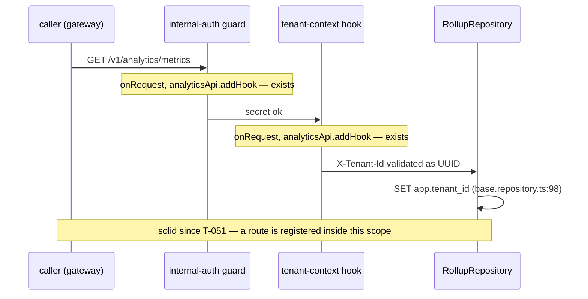
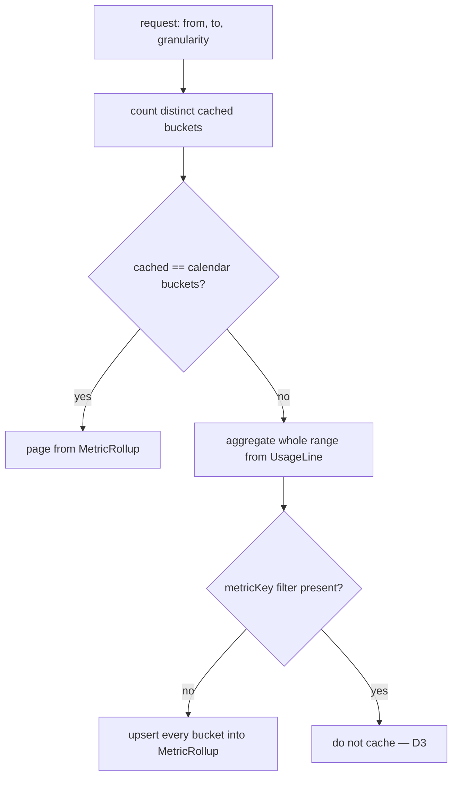

# T-051 · Metrics rollup — `GET /v1/analytics/metrics`

**Service:** analytics-service · **Gate 1 (Task Planner)** · **HEAD at planning:** `dc2c268`, tree clean, level with `origin/main`
**Spec:** `docs/epics/epic-9-analytics-service.md` § *T-051* — **read as a draft, not a contract** (S-15). Four divergences reported in §5.
**Rules revision read:** `.claude/rules/known-gaps.md` **from disk** — 4416 lines, `md5sum 3630dfed7299837c7e2f3c5c565fe111`, 52 headings `S-5 … S-60`. The copy injected into this planning session ended at **S-56**, so it could not see S-57, S-58, S-59 or S-60 — three of which bear on this task. That is another sighting of **S-24**; every gap cited below was re-read from the file on disk.

**No prior plan exists for T-051.** `ls docs/plans/ | grep -i 051` returns nothing. This is a new plan, not an extension or a replacement.

---

# Part 1 — for the analyst

## 1. In plain terms

A customer can see their raw usage today, one line per event. They cannot yet ask *"how much did I use per day last month, broken down by metric?"* — the question a usage dashboard is built around. T-051 adds that: a paged, bucketed total per metric over a date range.

It is also the first endpoint analytics-service has ever had. The service has been shipping for two tasks with a working front door, a security guard on that door, and **no room behind it**. T-051 is the first room.

**Who notices.** Epic 11's dashboard, which is specified to consume this. Nothing consumes it today, so there is no existing contract to break.

**What it costs if this is wrong — three things, in order of expense.**

1. **The endpoint could land on the wrong side of the security guard, and look perfectly healthy doing it.** analytics-service's internal-auth check and tenant check are installed on an isolated area of the service, and that area currently contains nothing. If T-051's endpoint is registered anywhere other than *inside* that area, it answers **`200` with no credentials whatsoever** — not a `404` or a `500` that someone notices, but a working endpoint serving one customer's data to any caller who can reach the service. I measured three of the four plausible placements and all three did exactly that (§6.1). This is the single most expensive way to get this task wrong, and it is invisible to every existing test.

2. **Every number could be attributed to the wrong day.** Buckets are computed by a database expression, and the expression the epic supplies is wrong in a way that only shows up on a server configured for a non-UTC timezone — which no continuous-integration machine is. I reproduced it against the real tables: a row recorded at 3am on 1 March is reported as **28 February** on a New York-configured server, and correctly as 1 March on a UTC one (§6.2). A customer would see usage on days they were closed.

3. **A cached answer could be silently incomplete.** The design has two tiers: serve pre-computed totals when they are available, compute from raw usage when they are not. Getting the "are they available?" test wrong means serving a customer a number that is too *low* — the worst direction, because a low bill looks like good news until it is audited. §6.4 shows the literal reading of that test has a hole, and D3 closes it.



The two hooks are facts at the anchors shown. **Every arrow is solid**: T-051 registers a route inside that scope, so a real request traverses all four. The ordering was measured against the real middleware in a replica of the scope (§6.1, P2), and is now observed behaviourally by `AM23`.

> **This block was written at Gate 1 and was corrected at Gate 6** (review MEDIUM-6). It originally drew every arrow **dashed**, with a note and a sentence asserting in the present tense that no route existed inside the scope, citing "what S-9 records" — the `known-gaps.md` entry this task retires. All three were true when written and were falsified by this task's own change. Two further stale `file:line` citations were found in the same block while fixing it: the hooks were cited at `app.ts:71`/`:72`, which are now comment lines; the registrations are `analyticsApi.addHook("onRequest", …)` and the route is registered in the same `app.register` callback. They are cited by anchor rather than by line, per the rule S-19, S-40, S-48 and this task's own S-58 fix all reached independently: **do not cite a line in a file the citing change edits.** `base.repository.ts:98` keeps its line because T-051 does not touch that file — it is byte-identical to worker's copy (D7).



*Proposed.* None of this exists yet. The `metricKey` branch is D3 and is the correctness fix described in §6.4.

## 2. Decisions

### 2.1 Settled before planning — recorded here because nothing else records them

**D0-A · Fallback semantics: option A. Any absent bucket discards the cache, and the whole requested range is aggregated from `UsageLine`.**

Confirmed by the user at Gate 0 today. **Until this line it existed only in conversation** — the Gate-0 router searched `docs/epics/README.md`'s decision-gate table, the epic file, and all of `docs/` and `.claude/`, and found nothing. The epic's source text is a single clause, *"If rollup data is incomplete (missing buckets), fall back to aggregating directly from `UsageLine`"*, which does not say whether a partial cache is topped up or discarded. It is discarded. This plan is where that becomes durable; §11 carries the obligation to also record it in `docs/epics/README.md`.

The mechanism this requires: **enumerate the expected buckets for the granularity and compare cardinality.** Expected is the count of calendar buckets spanning `[from, to)`; actual is `COUNT(DISTINCT "bucketStart")` in `MetricRollup` for that tenant, granularity and range. Rejected alternative — comparing against the buckets that *have* usage — is self-defeating: establishing that set requires reading `UsageLine`, which is the read the cache exists to avoid.

> **This formula is where D10 was latent, and this plan did not notice** (Gate-4 LOW-1). "The count of calendar buckets spanning `[from, to)`" is implemented as `generate_series(DATE_TRUNC(unit, from), …)`, and that `DATE_TRUNC` **silently normalises an unaligned lower bound** — so the formula answers the question "how many buckets does this range *overlap*", not "how many buckets does it *contain*". For a `from` that is not on a boundary those differ, and the cache then covers usage the caller excluded. The question that would have surfaced it at Gate 1 is one sentence: *what does this count when `from` is not a boundary?* It was resolved at Gate 3 as **D10** in §2.3 rather than being carried into the code unexamined.

**D0-B · Q3: fixed UTC for every tenant.** `docs/epics/README.md` § *Q3 — UTC aggregation timezone* is authoritative and records it as **decided**. No per-tenant timezone, no `timezone` query parameter, and bucket expressions are a bare `DATE_TRUNC(<unit>, "<column>")` on the naive column. This makes the epic's `AT TIME ZONE 'UTC'` snippet a defect to be corrected rather than a contract to be honoured (§5.1).

### 2.2 Open — the user should answer these before Gate 3

**D1 · Does the endpoint filter on `billed = true`? — *changes the diff and the risk disposition***

The epic's snippet carries `AND billed = true -- only finalized usage`.

| Option | What the endpoint reports | Cost |
|---|---|---|
| **A — drop the filter (recommended)** | all recorded usage, immediately | Diverges from the epic's snippet; §11 must record the correction |
| B — keep it, per the epic | only usage the nightly invoice job has already priced | Yesterday's usage is invisible for up to ~26 hours; **every** bucket's total changes once, later, when the job flips the flag |

**Recommendation: A.** Three reasons, the first two measured.

- **Measured (§6.3):** with the filter, a seeded unbilled row worth `5.250000` vanishes from the result entirely. A dashboard asking "what did I use on the 3rd?" would be told "nothing" while the row sits in the database.
- **Measured consequence for the cache:** `billed` is written `false` at ingestion and flipped to `true` later by billing. Under option B every cached bucket is therefore guaranteed to go stale — the cached value was computed before the flip and no longer matches. Under option A the aggregated columns (`metricKey`, `quantity`, `periodStart`) are never rewritten after insert — worker's `UsageLine` upsert has `update: {}` (`apps/worker-service/src/repositories/event.repository.ts:175`) — so a bucket only changes when *new* usage lands in it, which is the exceptional case rather than the routine one. Option B converts a rare staleness into a universal one.
- **Semantics.** "How much did I use" and "how much have I been billed for" are different questions. Billing already answers the second one, through `GET /v1/billing/invoices/:id`. The epic's comment conflates them.

**What changes if the user picks B:** one predicate in `buildFilters`, the integration fixtures gain a `billed` dimension, and risk **R4** (cache staleness) is promoted from LOW-and-accepted to a blocker that needs an invalidation mechanism designed before Gate 3 — which S-45's `absorbLateUsage` path would also feed. That is the reason this is on page one rather than in a footnote.

**D2 · Is `page` given an upper bound here, or does analytics inherit S-40? — *changes the diff***

S-40 records three declarations of `page` with no `.max()`, and a reachable `500`: `(page - 1) * pageSize` overflows a signed 64-bit integer. Analytics would be the fourth. I reproduced the raw-SQL form of the failure on this database — `SELECT 1 LIMIT 20 OFFSET 2e19` → `ERROR: bigint out of range` (§6.5) — and analytics mirrors usage-service's raw-`OFFSET` shape, so the failure would be that one, surfaced by Prisma as `P2010` and by the controller's non-`AppError` arm as a `500`.

| Option | Result |
|---|---|
| **A — bound it locally with `MAX_PAGE` (recommended)** | `page=1e18` → `400 VALIDATION_ERROR`; a fourth copy of the known `500` is not created |
| B — inherit the gap, matching the other three | Consistent with usage and billing; ships a knowingly reachable `500` on a brand-new endpoint |

**Recommendation: A.** S-40's argument against fixing one service is that it "gives the platform two strictnesses for one request parameter" — but S-40 also says so of itself: *"weaker here than there: `page` is a per-request client value each service handles independently … so the consequence is an inconsistent API rather than a producer/consumer disagreement."* T-051 is a new endpoint with no client, so bounding it breaks nothing, and knowingly shipping a fourth instance of a documented `500` is the worse trade. Under A, S-40's entry gains a sentence recording that analytics is bounded and the other three are not; the cross-service promotion into `paginationSchema` remains S-40's own task.

**What changes if the user picks B:** delete one `.max()` and one constant, and drop test `AM12`.

### 2.3 Decided in this plan — small edits if wrong

**D3 · The cache is written only on requests with no `metricKey` filter.** This is not a preference; it is what makes D0-A's cardinality check sound. `MetricRollup` is keyed `@@unique([tenantId, metricKey, granularity, bucketStart])`, so a request filtered to `metricKey=A` would cache only A's rows. A later *unfiltered* request counting distinct `bucketStart` would then see a complete-looking range and serve it — silently omitting metric B. Writing only whole-range, all-metric results removes that state. A filtered read may still consult the cache; if its own metric has an empty bucket it simply falls back, which is conservative and never wrong.

**D4 · `bucketEnd` is derived in SQL, not stored.** `MetricRollup` has `bucketStart` and no `bucketEnd` column (verified against `prisma/schema.prisma:163-174` and `information_schema.columns`). The response contract requires both. Both the cache read and the `UsageLine` aggregation therefore compute `bucketEnd` as `bucketStart + INTERVAL '<unit>'` from the same frozen granularity map, so the two tiers cannot disagree. **No migration.**

**D5 · The granularity map mirrors `GRANULARITY_SQL` in `apps/usage-service/src/repositories/usage.repository.ts:58-73`** — a frozen `Record` of constant `Prisma.sql` fragments with zero interpolation, so a caller-supplied granularity can only ever *select* a fragment. Query values stay lowercase (`hour`/`day`/`week`), matching usage-service, and a second frozen map converts them to Prisma's `Granularity` enum (`HOUR`/`DAY`/`WEEK`) for the `MetricRollup` column. Rejected: accepting the uppercase enum spelling in the query string, which would make two endpoints over the same rows disagree about what a granularity is called.

**D6 · Every timestamp bound goes through a `utcTimestampBound` helper**, mirroring `usage.repository.ts:135-136`: `new Date(iso).toISOString()` then `::timestamp(3)`. Both steps are load-bearing and the reasons are in that docblock. **The `set_config('TimeZone','UTC',true)` pin is deliberately *not* added** to `apps/analytics-service/src/repositories/base.repository.ts` — see D7.

**D7 · `base.repository.ts` is not touched.** It is byte-identical to worker-service's (`md5sum 13a533a2e2c2dcc1ff9db28fb5c7a1fd`, 111 lines each, re-derived §6.6), and S-19's whole subject is that these five copies drift. Adding the pin here would create a fifth variant from inside a feature task, which S-19 explicitly asks not to be done opportunistically. **This buys something S-21 asks for and cannot get from usage-service:** because analytics will have exactly *one* timezone guard (the bound cast) rather than usage-service's two, a regression test that reverts the cast **must** go red. S-21 records that usage-service's equivalent suite stays 17/17 green under the exact S-18 defect, because its session pin masks it. Analytics has no mask.

**D10 · A range whose bounds are not on bucket boundaries never touches the cache, in either
direction.** *(Added at Gate 3, not present when this plan was approved — Gate-4 LOW-1 ruled this
a legitimate mid-implementation resolution rather than a question Gate 1 was obliged to stop for:
it changes no file, no contract and no risk disposition, and adds two guard conditions and two
cases. It is a corollary of D0-A asked about the range's **edges** rather than its interior.)*

**It was latent in this plan's own mechanism, which is the fair criticism.** D0-A defines
`expectedBuckets` as `generate_series(DATE_TRUNC(unit, from), …)`, and that `DATE_TRUNC`
silently normalises an unaligned lower bound. Asking "what does this count when `from` is not a
boundary?" at Gate 1 would have surfaced D10 with no new information.

Why it is needed, measured at Gate 3 against the fixture `AI13` ships (three `api.request` lines
at `2026-03-01 03:00` = `10.500000`, `2026-03-01 08:00` = `2.000000`, `2026-03-03 12:00` =
`5.250000`), read over the unaligned `[2026-03-01T06:00, 2026-03-04)`:

| | `2026-03-01` bucket | `2026-03-03` bucket |
|---|---|---|
| `UsageLine` tier (correct) | `2.000000` | `5.250000` |
| cache read with a truncated lower bound | `12.500000` | `5.250000` |

So **reading** the cache for that request over-reports the first bucket by `10.500000` — the
part of the day the caller excluded — and **writing** it stores `2.000000` as that bucket's
total, which every later *aligned* reader would then trust. Both directions are refused.
Guarded by `AM19d` (service) and `AI13` (integration); Gate 4 probed the predicate directly and
found it complete — day/hour/ISO-week boundaries admitted, unaligned, half-past, `.001`ms and
Sunday-start-week refused, and an offset-bearing spelling of a boundary correctly **admitted**
because `utcTimestampBound` resolves the instant in JS first. No genuinely aligned request is
refused. The one refusal that may surprise a caller is a Sunday-start week, which is correct
given PostgreSQL's ISO weeks.

**D8 · No new error or tenant-context vocabulary.** S-57 records analytics as already holding the *third* copy of the tenant-context strings. T-051 declares no fourth copy of anything: `ANALYTICS_RESPONSES` gains only codes this endpoint actually introduces (`VALIDATION_ERROR`, `INTERNAL_ERROR` and their messages, plus `HTTP_STATUS_BAD_REQUEST` / `HTTP_STATUS_INTERNAL_ERROR`), each checked against `@telemetry/shared-types` first. The route path constant is service-local, matching `USAGE_SERVICE_ROUTES` — `grep -n "ROUTES\|/v1/" packages/shared-types/src/index.ts` returns nothing, so there is no shared route vocabulary to derive from and creating one is not this task's call.

**D9 · Response shape is `{ data: PaginatedResult<MetricsRollupItem> }`**, matching usage-service's summary controller exactly, with `totalQuantity` a **string**. `Decimal(18,6)` exceeds IEEE-754 safe precision and `CLAUDE.md` forbids a `Prisma.Decimal` reaching a JSON response; normalisation happens in the repository and only there.

## 3. Scope and non-goals

**In scope:** the `GET /v1/analytics/metrics` route registered inside the guarded scope; its validator, controller, service, and a `RollupRepository` extending `TenantScopedRepository`; the two-tier read with D0-A completeness semantics; the cache upsert under D3; unit, route and integration tests including a non-UTC timezone suite; the removal of the S-9 entry from `known-gaps.md` and the S-19 table row it creates.

**Out of scope, deliberately:**

- **T-052 and T-053** (top events, CSV export). Same epic, separate tasks.
- **`ExportAudit`** — T-053's table. Untouched.
- **S-19's unification** of the five `base.repository.ts` copies, and the `TimeZone` pin (D7).
- **S-40's cross-service `page` promotion** into `paginationSchema` (D2 bounds analytics only).
- **S-57's promotion** of the tenant-context vocabulary into `@telemetry/shared-types`.
- **S-58** — analytics' `.env.example` secret already matches gateway's; billing's and worker's do not, and that is S-58's own task.
- **S-59** — `AU15`'s `===` evasion. It guards the middleware this route sits behind, and the replacement it needs is a compiler-API assertion, which is a test-logic change of its own. §10 R6 records what this means for reading a green analytics suite.
- **S-56** — no spans will be emitted by this endpoint, because none are emitted by anything. Not this task's to fix.

**Deliberately left broken, and named:** the cache will rarely be *hit* in practice. A bucket with genuinely zero usage produces no rollup row, so under D0-A a range containing any idle bucket never validates. Measured: a three-day range with usage on two of the days gives `expected_day_buckets=3` against `buckets_with_usage=2` (§6.4), so that range's cache can never satisfy the check. At `hour` granularity this is close to permanent. This is a **correctness-first** consequence of option A and is accepted rather than worked around; §11 carries an obligation to file it as a new `known-gaps.md` entry so it is not rediscovered as a defect. Closing it properly needs a completeness marker on the table, i.e. a migration, which is not this task.

---

# Part 2 — for the implementer

## 4. What was verified by execution, and what was only read

| Claim | How |
|---|---|
| Three of four route placements answer `200` with no credentials | **Executed** against the real `buildAnalyticsServiceApp()` (P1) |
| The guarded scope rejects correctly and never reaches the handler | **Executed** against a replica using the real middleware (P2) |
| The epic's `AT TIME ZONE` snippet mis-buckets under `America/New_York` | **Executed** on the real `"UsageLine"` table, four session zones, as `telemetry_app` (P3) |
| A calendar-complete range is unachievable when a bucket has no usage | **Executed**, seeded fixture (P4) |
| `billed = true` drops a real row from the result | **Executed** (P4) |
| `MetricRollup` upsert works as `telemetry_app`, and RLS refuses cross-tenant and no-context writes | **Executed** (P5) |
| Raw `OFFSET 2e19` raises `bigint out of range` | **Executed** (P6) |
| `MetricRollup` has RLS enabled + forced + a `FOR ALL` policy with `WITH CHECK`; `telemetry_app` holds SELECT/INSERT/UPDATE/DELETE | **Executed** against `pg_class`, `pg_policy`, `information_schema.table_privileges` (P7) |
| analytics' and worker's `base.repository.ts` are byte-identical; analytics has no `TimeZone` pin | **Executed** (`md5sum`, `grep -c`) (P8) |
| Analytics baseline suite is 7 files / 56 tests green | **Executed** (P8) |
| `turbo.json` declares `INTERNAL_API_SECRET` on `dev` only, not `test` (S-60) | **Read** — `turbo.json:16` |
| `usage.repository.ts`'s `GRANULARITY_SQL` shape and `utcTimestampBound` | **Read** — not re-executed; usage-service's own suite covers them |
| S-9, S-19, S-21, S-40, S-46, S-53, S-57, S-59, S-60 | **Read from disk** at the md5 in the header |

## 5. Findings against the epic spec — plan against the code

The epic's T-051 section is wrong in four ways. Each is reported rather than silently corrected, per `CLAUDE.md` instruction 1.

### 5.1 `AT TIME ZONE 'UTC'` is applied to the column

`DATE_TRUNC('day', period_start AT TIME ZONE 'UTC')`. On a naive column this produces a `timestamptz` and shifts every boundary by the server offset — the defect `CLAUDE.md` § *Raw SQL and timestamps* names and S-53 records. Reproduced on the real table (P3): under `America/New_York` a `2026-03-01 03:00` row buckets as **`2026-02-28`**. **Plan:** bare `DATE_TRUNC('<unit>', "periodStart")`, per D0-B.

### 5.2 Every identifier is snake_case, and nothing in this database is

The snippet writes `usage_lines`, `metric_key`, `period_start`, `tenant_id`. `grep -n "@@map\|@map" prisma/schema.prisma` returns nothing, so Prisma emits model and field names verbatim as quoted identifiers. The real names are `"UsageLine"`, `"metricKey"`, `"periodStart"`, `"periodEnd"`, `"tenantId"`. Unquoted `usage_lines` folds to lower case and matches nothing, so the snippet **raises** rather than returning wrong rows — the loud failure, which is why this is a copy-and-fix nuisance rather than a hazard.

### 5.3 The `$2` / `$3` predicate is S-18

`period_start >= $2` with a bound JS `Date` against a naive column resolves through the session zone. **Plan:** D6 — every bound through `utcTimestampBound`.

### 5.4 The **Files** line named three files and omitted `src/app.ts`

Corrected by S-9's Gate-4 review, which added a blockquote under it carrying the four-placement measurement. **Read the blockquote, not the Files line.** §6.1 re-derives its central claim independently.

**One thing the epic gets right**, so this section is not read as dismissal: the response contract (`metricKey`, `bucketStart`, `bucketEnd`, `totalQuantity` as a string) is exactly right, and the `// string to preserve Decimal precision` comment states the reason correctly.

**Two silences the epic leaves, filled by decisions above:** it does not say what "incomplete" means (D0-A), and it does not say that `MetricRollup` has no `bucketEnd` column (D4).

## 6. Ground truth — each claim with the command that established it

### 6.1 Route placement — the constraint that dominates everything

Against the **real** `buildAnalyticsServiceApp()`, one route added per placement, injected with no headers at all (P1):

```
sibling scope, unprefixed    noCreds=200 {"probe":true} | withCreds=200
root instance                noCreds=200 {"probe":true} | withCreds=200
sibling scope, prefixed      noCreds=200 {"probe":true} | withCreds=200
```

The fourth placement — inside the production callback — **cannot be probed post-hoc**, because that callback has already closed by the time the factory returns. That is itself the finding: the only correct placement is the one no external test can add. It was measured in a replica built from the **real** middleware (P2):

```
no headers               -> 401 {"code":"UNAUTHORIZED"}                 handlerRan=false
secret only              -> 401 {"code":"TENANT_CONTEXT_MISSING", ...}  handlerRan=false
wrong secret + tenant    -> 401 {"code":"UNAUTHORIZED"}                 handlerRan=false
secret + bad tenant      -> 401 {"code":"TENANT_CONTEXT_INVALID", ...}  handlerRan=false
secret + tenant          -> 200 {"tenantId":"0450a5e0-…"}               handlerRan=true
/health, no headers      -> 200 {"status":"ok"}
```

`handlerRan=false` is the observable S-9 requires and the shape `BU78` uses. `AM20` (§8) asserts exactly that.

**The seat is already built.** `apps/analytics-service/src/app.ts:14` carries `import "./types"` with the comment *"brings the `FastifyRequest.tenantId` augmentation into the program so that T-051's controller read of it type-checks"*, and `app.ts:70-73` is the empty callback. The implementer adds one line inside it.

### 6.2 Q3 conformance, on the real table

Four session zones via `options=-c timezone=…` (a bare `?timezone=` is accepted and silently ignored), as `telemetry_app` under tenant context, one `2026-03-01 03:00` row and one `2026-03-03 12:00` row (P3):

| Session `TimeZone` | bare `DATE_TRUNC` (correct) | epic's `AT TIME ZONE` |
|---|---|---|
| `UTC` | `2026-03-01, 2026-03-03` | `2026-03-01, 2026-03-03` |
| `Asia/Kolkata` | `2026-03-01, 2026-03-03` | `2026-03-01, 2026-03-03` |
| **`America/New_York`** | `2026-03-01, 2026-03-03` | **`2026-02-28`, `2026-03-03`** |
| `Asia/Kathmandu` | `2026-03-01, 2026-03-03` | `2026-03-01, 2026-03-03` |

Scope: four zones, two values, this host's PostgreSQL 16, day granularity. The bare form was stable in every zone tried; that is what was measured, not a proof that it is stable in all zones.

**CI cannot catch this** — `postgres:16-alpine` defaults `TimeZone` to `UTC`, the row where the two forms agree. `AI7`/`AI8` (§8) pin their own non-UTC session for that reason.

### 6.3 The `billed` filter's effect, measured

Same fixture, `[2026-03-01, 2026-03-04)` (P4):

```
no filter    : api.request|2026-03-01|10.500000   api.request|2026-03-03|5.250000   storage.write|2026-03-01|7.000000
billed=true  : api.request|2026-03-01|10.500000                                     storage.write|2026-03-01|7.000000
```

The `5.250000` row is unbilled and simply disappears. Evidence for D1.

### 6.4 The completeness check, and the hole in its literal reading

Same fixture, deliberately leaving `2026-03-02` empty (P4):

```
expected_day_buckets = 3      (generate_series over DATE_TRUNC'd bounds)
buckets_with_usage   = 2      (03-01 and 03-03)
```

Two consequences, both load-bearing:

1. **The accepted one.** No cache for this range can ever satisfy `actual == expected`, because the third bucket has nothing to cache. Under D0-A that range falls back forever. §3 records this as deliberately left broken.
2. **The one D3 fixes.** `COUNT(DISTINCT "bucketStart")` is blind to the metric dimension. A cache written by a `metricKey`-filtered request could make an *unfiltered* range look complete while omitting another metric's rows — under-reporting usage with the whole suite green. D3 removes that state by never writing a filtered result. `AM17` and `AI6` are the guards.

### 6.5 `page` overflow, in the shape analytics would mirror

```
SELECT 1 LIMIT 20 OFFSET 2e19;   -> ERROR:  bigint out of range
SELECT 1 LIMIT 20 OFFSET 1e17;   -> (succeeds, empty)
```

as `telemetry_app` (P6). Analytics mirrors usage-service's raw `LIMIT/OFFSET` bind, so this is the failure class, not billing's `PrismaClientValidationError`. Evidence for D2.

### 6.6 The database is ready — no migration is needed

Executed (P5, P7):

- `pg_class` on `"MetricRollup"`: `relrowsecurity = t`, `relforcerowsecurity = t`, **1** policy.
- That policy is `metric_rollup_tenant_isolation`, `polcmd = *`, with **both** a `USING` and a `WITH CHECK` of `"tenantId" = current_setting('app.tenant_id', true)`.
- `telemetry_app` holds `SELECT, INSERT, UPDATE, DELETE` on it, and is `rolsuper = f, rolbypassrls = f` — so the probe below is RLS as production sees it.
- As `telemetry_app` under tenant A's context: the own-tenant upsert succeeded; an insert naming **tenant B** raised `new row violates row-level security policy for table "MetricRollup"`; an insert with **no tenant context at all** raised the same.

So the cache write needs no migration, no new grant and no new policy, and the database refuses the two ways it could go wrong.

**`MetricRollup` has no `bucketEnd` and no row-count column** — `prisma/schema.prisma:163-174` is `id, tenantId, metricKey, granularity, bucketStart, value, computedAt`. D4 derives `bucketEnd`; nothing needs a count.

### 6.7 Baselines, measured now

| | |
|---|---|
| `Tenant` | 2 · `User` 2 · `Event` 0 · `UsageLine` 0 · `Meter` 0 · `Invoice` 0 · `InvoiceLineItem` 0 · `MetricRollup` 0 · `ExportAudit` 0 · `RefreshToken` 0 |
| analytics suite | `Test Files 7 passed (7)`, `Tests 56 passed (56)` |
| `base.repository.ts` | analytics `13a533a2e2c2dcc1ff9db28fb5c7a1fd` (111 lines) = worker, byte-identical; `grep -c TimeZone` → **0** |
| coverage thresholds | `apps/analytics-service/vitest.config.mjs` — 80/80/80/75, and `src/repositories`, `src/services`, `src/controllers`, `src/validators` are **not** excluded, so every new file is measured |

All probe fixtures were seeded through `DIRECT_DATABASE_URL` and deleted; the counts above are the state before **and** after.

## 7. Files to change

**New — `apps/analytics-service/src/`**

| File | Contents |
|---|---|
| `validators/metrics-query.validator.ts` | `analyticsGranularitySchema`, `metricsQuerySchema` (from/to/granularity/metricKey/page/pageSize + `from < to` refine) |
| `repositories/rollup.repository.ts` | `RollupRepository extends TenantScopedRepository` — `GRANULARITY_SQL`, `GRANULARITY_ENUM`, `utcTimestampBound`, `countCachedBuckets`, `readCachedPage`, `aggregateFromUsage`, `cacheRange` |
| `services/analytics.service.ts` | two-tier orchestration; owns the completeness decision and the D3 caching rule |
| `controllers/analytics.controller.ts` | thin — validate, read `request.tenantId`, delegate, normalise errors |
| `routes/analytics.routes.ts` | `registerAnalyticsRoutes(app, controller)` |

**New — `apps/analytics-service/tests/`**: `metrics-query.validator.unit.test.ts`, `rollup.repository.unit.test.ts`, `analytics.service.unit.test.ts`, `metrics.route.test.ts`, `analytics.integration.test.ts`, `analytics.timezone.integration.test.ts`.

**Changed**

| File | Change |
|---|---|
| `src/app.ts` | **one line inside the existing `app.register` callback** (`:70-73`) — `registerAnalyticsRoutes(analyticsApi, container.analyticsController)`. Nothing else in that file moves. |
| `src/constants.ts` | `ANALYTICS_ROUTES.METRICS`; `ANALYTICS_GRANULARITY`; `ANALYTICS_METRICS` (pagination bounds, `MESSAGE_INVALID_RANGE`, and `MAX_PAGE` under D2-A); `ANALYTICS_DATABASE_SQL.UTC_NAIVE_TIMESTAMP_CAST`; the new response codes of D8 |
| `src/config/container.ts` | `createRollupRepository` as a **factory** `(tenantId) => RollupRepository`, never a singleton; plus the service and controller |
| `src/{repositories,services,controllers,routes,validators}/index.ts` | barrel exports |
| `.claude/rules/known-gaps.md` | **remove S-9** (discharged); add the S-19 subclass-table row; file the sparse-bucket entry (§3) |
| `docs/epics/README.md` | record D0-A as a decision, per §2.1 |

**Not changed:** `src/repositories/base.repository.ts` (D7), `src/middleware/**`, `prisma/**` (no migration), any other service.

## 8. Implementation slices — smallest safe first

Pseudo-TDD throughout: test file with **all** scenarios first, confirm red, then implement.

### Slice 1 — validator
**Controlling path:** `metricsQuerySchema` in `validators/metrics-query.validator.ts`.
**Measures:** that granularity is a closed enum before it can reach SQL, and that D2's bound exists.
**Falsified if:** a granularity outside `hour|day|week` parses, or `from >= to` parses, or (under D2-A) `page` above `MAX_PAGE` parses.
**Tests:** `AM1`–`AM12`.

### Slice 2 — repository, `UsageLine` tier only
**Controlling path:** `RollupRepository.aggregateFromUsage`, mirroring `usage.repository.ts:151-188`.
**Measures:** Q3-correct bucketing, UTC-safe bounds, tenant predicate, string Decimals, grouped-row `total`.
**Falsified if:** reverting `utcTimestampBound` to a bound JS `Date` leaves `AI8` green — which, per D7, it must not, because analytics has no session pin to mask it. **This is the slice's red-before-green obligation and the most important one in the task.**
**Tests:** `AM13`–`AM16`, `AI1`–`AI5`, `AI7`, `AI8`.

### Slice 3 — cache read and completeness
**Controlling path:** `countCachedBuckets` + the branch in `AnalyticsService`.
**Measures:** D0-A — one absent bucket discards the whole cache.
**Falsified if:** deleting one `MetricRollup` row from a complete range still serves from cache (`AI6` must go red).
**Tests:** `AM17`–`AM19`, `AI6`, `AI9`.

### Slice 4 — cache write
**Controlling path:** `cacheRange`, under D3.
**Measures:** that a fallback populates the cache, that a `metricKey`-filtered request does **not**, and that RLS refuses a cross-tenant write.
**Falsified if:** a filtered request writes rows (`AM17` green under the mutation that removes the D3 guard).
**Tests:** `AM17`, `AI10`, `AI11`.

### Slice 5 — route registration inside the guarded scope
**Controlling path:** `app.ts:70-73`.
**Measures:** S-9's discharge.
**Falsified if:** moving `registerAnalyticsRoutes` out of the callback leaves `AM20` green. It must fail on `expect(getMetrics).not.toHaveBeenCalled()`, not merely on a status code.
**Tests:** `AM20`–`AM23`.

### Slice 6 — documentation
Remove S-9; add the S-19 row; file the sparse-bucket gap; record D0-A in `docs/epics/README.md`; correct the epic's four divergences per §5 or add a forward reference. No code.

## 9. Test plan and acceptance-coverage mapping

Acceptance criteria derived from the epic body, Q3, and S-9's discharge condition — the T-051 section carries no explicit acceptance block.

| AC | Statement | Proving tests |
|---|---|---|
| AC1 | `200` with `{ data: { items, total, page, pageSize } }`, items `{metricKey, bucketStart, bucketEnd, totalQuantity}` | `AM21`, `AI1` |
| AC2 | Buckets are UTC for `hour`/`day`/`week`; `bucketEnd = bucketStart + 1 unit` | `AM13`, `AI2`, `AI3`, **`AI7`**, **`AI8`** |
| AC3 | `metricKey` filters the result | `AM14`, `AI4` |
| AC4 | Invalid `from`/`to`/`granularity`/`from>=to` → `400 VALIDATION_ERROR` | `AM1`–`AM9`, `AM22` |
| AC5 | Pagination honoured; `total` is the grouped-row count, not the row count | `AM15`, `AI5` |
| AC6 | A complete cache is served **without** reading `UsageLine` | `AM18`, `AI9` |
| AC7 | One absent bucket ⇒ whole range from `UsageLine` (D0-A) | `AM19`, **`AI6`** |
| AC8 | A fallback result is upserted into `MetricRollup` | `AI10` |
| AC9 | Route is inside the guarded scope: no secret ⇒ `401` **and the service is never called** | **`AM20`**, `AM23` |
| AC10 | Another tenant's rows are never returned | `AI11`, **`AM16`** |
| AC11 | `totalQuantity` is a string; no `Prisma.Decimal` in the response | `AM16`, `AI1` |
| AC12 | `/health` still answers `200` unauthenticated | existing `AU23` |

**Red-before-green obligations** — each must be confirmed failing before the code exists, and the named failure recorded in the implementation report:

| Guard | Mutation | Must go red |
|---|---|---|
| Q3 bucketing | `AT TIME ZONE 'UTC'` on the column | `AI7` |
| S-18 bound | `utcTimestampBound(x)` → `new Date(x)` | `AI8` |
| D0-A completeness | delete one rollup row from a complete range | `AI6` |
| D3 cache rule | remove the `metricKey`-absent condition from `cacheRange` | `AM17` |
| S-9 placement | move `registerAnalyticsRoutes` outside the callback | `AM20` |
| Tenant predicate | remove `tenantId` from the `where` | `AM16` **only** |

**That last row is the S-46 disclosure and must be written into the test file itself.** `MetricRollup` and `UsageLine` both have RLS enabled with a `current_setting('app.tenant_id')` policy, so an integration case *cannot* observe the application-layer tenant predicate — the policy returns the identical rows with or without it. `AI11` therefore pins the **outcome** and cannot pin the predicate; `AM16` is a **shape** assertion against a Prisma double and is the only thing that goes red. S-46 measured exactly this on billing's `absorbLateUsage`, and the comment on `AI11` must say so rather than leaving a later reader to infer that a green isolation case proves two layers.

## 10. Validation commands

**Task-scoped, while iterating.** Note **S-60**: `pnpm --filter <pkg> exec vitest run` inherits the ambient environment, and this machine's root `.env` carries a 17-character `INTERNAL_API_SECRET` against the 32 minimum — which would make analytics fail at *import*, not at an assertion. Use a clean environment:

```bash
env -u INTERNAL_API_SECRET pnpm --filter @telemetry/analytics-service exec vitest run tests/metrics-query.validator.unit.test.ts
pnpm test --force --filter @telemetry/analytics-service      # turbo strips the ambient value
pnpm --filter @telemetry/analytics-service typecheck
pnpm --filter @telemetry/analytics-service lint
pnpm --filter @telemetry/analytics-service exec vitest run --coverage   # thresholds 80/80/80/75
```

**Non-UTC regression runs** — the timezone suite must pin its own session; a bare `?timezone=` is accepted and silently ignored:

```
postgresql://telemetry_app:…@localhost:5432/telemetry?options=-c%20timezone%3DAmerica%2FNew_York
```

**Full gate, before handoff** — `--force`, because turbo replays cached results otherwise:

```bash
pnpm build --force && pnpm test --force && pnpm lint --force && pnpm typecheck --force
```

`pnpm format:check` is **not** run: S-12 records that no revision of this repository has ever satisfied it, and there is no format step in CI.

## 11. Risks and mitigations

| # | Risk | Severity | Disposition |
|---|---|---|---|
| R1 | Route registered outside the guarded scope ⇒ unauthenticated tenant data on the network | **HIGH** | `AM20` asserts the service was never called; slice 5 confirms it red first. Measured in §6.1. |
| R2 | Bucket boundaries shift on a non-UTC server | **HIGH** | D0-B + D6; `AI7`/`AI8` pin a non-UTC session. CI's UTC default cannot catch it (§6.2). |
| R3 | Cache serves an incomplete answer | **MEDIUM** | D3 (§6.4) removes the metric-dimension hole; `AI6` pins D0-A. |
| R4 | Cache goes stale when usage lands late (stream lag, dead-letter replay, S-45 absorption) | **LOW under D1-A, HIGH under D1-B** | Under A the aggregated columns are never rewritten (`update: {}`, `apps/worker-service/src/repositories/event.repository.ts:175`), so only new rows in a past bucket cause it. **Under B every bucket goes stale by design** and an invalidation mechanism becomes a prerequisite. This is why D1 is on page one. **See the correction immediately below — the mitigation this row originally claimed is backwards.** |
| R5 | Unbounded `[from, to)` ⇒ an unbounded cache upsert | **MEDIUM** | Neither usage-service nor billing bounds a range today. A one-year `hour` range is **8760** buckets (measured, §6.5 appendix) and a decade is 87 600. Mitigation: the service declines the cache write above `ANALYTICS_METRICS.MAX_CACHED_ROWS` (shipped under that name rather than this row's original `MAX_CACHED_BUCKETS` — a declared deviation: what is bounded is upserted *rows*, one per `(metricKey, bucketStart)` pair, which exceeds the bucket count by the tenant's metric cardinality) and logs that it did — the *read* still answers correctly, only the write is declined. The range itself is not capped, matching the neighbouring services. |
| R6 | A green analytics suite is weaker evidence than it reads | **LOW** | S-59: `AU15` stays green while the guard compares with `===`; S-57: a one-character edit to analytics' tenant-context codes ships green. Neither is T-051's to fix. Do not cite a green suite as proof that the guard is timing-safe. |
| R7 | New code drops coverage below 80/75 | **LOW** | Repositories, services, controllers and validators are all *included* in analytics' coverage config. Run `--coverage` before handoff. |
| R8 | Sparse ranges mean the cache is rarely hit | **LOW, accepted** | §3. Filed as a new `known-gaps.md` entry in slice 6. Correctness is preserved; only the optimisation is lost. |
| R9 | `page` overflow ⇒ `500` | **LOW** | Closed by D2-A; inherited under D2-B. |
| R10 | Probing the database during implementation disturbs the baseline | **LOW** | §6.7 records the exact counts. Seed only through `DIRECT_DATABASE_URL`, delete by explicit id, re-count before handoff. |

### R4's mitigation clause was backwards — corrected at Gate 4 Round 2

R4 originally ended *"…so only new rows in a past bucket cause it, **and the completeness check
will usually already be falling back**."* That clause is the opposite of what holds, and §3 of
this plan already said so without the connection being drawn.

The completeness check compares **counts** — `cachedBuckets === expectedBuckets`. A count detects
a bucket that is **missing**; it can never detect one that is present and **changed**. So its two
outcomes are inverted relative to where the staleness risk sits: it falls back exactly when the
range contains an idle bucket, which is the case where the cache was useless anyway (§3, filed as
S-61), and it validates exactly when every bucket is populated, which is the case where a cached
value may be stale. **The check does not mitigate staleness in any range the cache can actually
serve.**

Measured at Gate-5 QA over real HTTP and re-derived at this rework through the real service and
repository against the real database — a two-bucket range with both buckets populated, then 100
units landing in the already-cached first bucket:

```
req1 (fallback)  -> 2026-04-01=17  2026-04-02=4      cached rows: 2
req2 (cache)     -> 2026-04-01=17  2026-04-02=4
  ... 100 units land in 2026-04-01 ...
TRUE day-1 total -> 117
req3 / req4      -> 2026-04-01=17  2026-04-02=4      (permanently)
coverage         -> {"expectedBuckets":2,"cachedBuckets":2,"bucketAligned":true}
```

The counts are equal, so the check validates and `117` is served as `17` indefinitely.
`computedAt` is written and never read, and there is no TTL or invalidation path.

**R4's severity assessment under D1-A stands.** D1 reduced the *frequency* — under D1-B every
bucket would have gone stale by design when the invoice job flipped `billed`, where under D1-A
only new rows landing in an already-cached bucket do — and it did not remove the *mechanism*.
This is a correction to the mitigation, not to the decision. The durable record is now
**S-62** in `.claude/rules/known-gaps.md`, filed because `CLAUDE.md` forbids reading
`docs/plans/` as a record and R4 existed nowhere else.

## 12. Pending task checklist

- [done] User answered **D1** (option A, drop the filter) and **D2** (option A, bound `page`) at Gate 2
- [done] Slice 1 — validator; 13 cases, red at collection then `Tests 13 passed (13)`
- [done] Slice 2 — `UsageLine` tier; `AI8` redness recorded: `Tests 12 failed | 11 passed (23)` under `utcTimestampBound` reverted to a bound JS `Date`, red in all three non-UTC zones and green under `UTC`
- [done] Slice 3 — completeness; `AI6` red under `cachedBuckets > 0`: `expected [ '424242' ] to deeply equal [ '10.5', '3' ]`, the sentinel escaping into the response
- [done] Slice 4 — cache write; `AM17` red under the removed D3 guard, and the under-report itself measured with **both** layers removed: `expected [ 'api.request' ] to deeply equal [ 'api.request', 'storage.write' ]`
- [done] Slice 5 — route inside the scope; `AM20` red under the moved registration (`expected 500 to be 401`, not `200` — see the deviation note: the controller's tenant guard refuses first and the service is never called)
- [done] Slice 6 — **S-9** removed; **S-19** subclass row added (re-derived, five subclasses across four services); sparse-bucket gap filed as **S-61**; **D0-A** recorded in `docs/epics/README.md` as Q3a; the epic snippet corrected in place with five divergences enumerated; **S-53 also retired** (deviation — see report) and its three live citations fixed; **S-59** updated, its first escalation conjunct having fired
- [done] Coverage `92.59 / 85.29 / 92 / 92.59` (statements / branches / functions / lines) against `80 / 75 / 80 / 80` — re-read from `apps/analytics-service/vitest.config.mjs:25-30`, which declares `lines: 80, functions: 80, statements: 80, branches: 75`. This line read `80 / 75 / 80 / 75` until Gate 4 (LOW-3); the measured coverage clears either set, so nothing was at risk, but the figure was mis-transcribed in its last position
- [done] Baseline re-verified before and after: `Tenant` 2, `User` 2, `Event`/`UsageLine`/`Meter`/`Invoice`/`InvoiceLineItem`/`MetricRollup`/`ExportAudit`/`RefreshToken` all 0
- [done] Full gate `--force` across 13 packages
- [done] Gate 2 approval obtained before any code was written

## 13. Approval gate

**This plan is complete and no code has been written.** Gate 1 stops here.

**Two decisions are open and belong to the user — D1 and D2 in §2.2.** Both change the diff; D1 also changes the disposition of risk R4 and could add a cache-invalidation design to the task. Neither changes the file set or the slice order.

Everything else is decided in §2.1 and §2.3, with reasoning and rejected alternatives recorded.

**Requesting approval to proceed to Gate 3 (Task Implementer).**

---

# Appendix — probe transcripts

All probes run on `dc2c268`, tree clean. Fixtures seeded through `DIRECT_DATABASE_URL` (owner) and deleted afterwards; §6.7 records the before-and-after counts, which are identical. No service was pointed at the owner connection. Redis db 0 was not written. Two temporary probe files were created under `apps/analytics-service/` and removed; `git status --porcelain` is empty.

## P1 · Route placement against the real app factory

Probe registered one route per placement on a freshly built `buildAnalyticsServiceApp()`, then injected with and without credentials.

```
sibling scope, unprefixed    noCreds=200 {"probe":true} | withCreds=200
root instance                noCreds=200 {"probe":true} | withCreds=200
sibling scope, prefixed      noCreds=200 {"probe":true} | withCreds=200
(placement 'inside the guarded scope' cannot be probed post-hoc: the production callback has already closed — that is itself the finding)
```

## P2 · The guarded scope, replicated with the real middleware

`buildInternalAuthMiddleware(env.INTERNAL_API_SECRET)` and `analyticsTenantContextHandler` imported from `src/`, registered as two `onRequest` hooks on one `app.register` scope, one route inside it, `/health` outside.

```
no headers               -> 401 {"code":"UNAUTHORIZED"}  handlerRan=false
secret only              -> 401 {"code":"TENANT_CONTEXT_MISSING","message":"X-Tenant-Id header is requ  handlerRan=false
wrong secret + tenant    -> 401 {"code":"UNAUTHORIZED"}  handlerRan=false
secret + bad tenant      -> 401 {"code":"TENANT_CONTEXT_INVALID","message":"X-Tenant-Id header must be  handlerRan=false
secret + tenant          -> 200 {"tenantId":"0450a5e0-0000-4000-8000-0000000000aa"}  handlerRan=true
/health, no headers      -> 200 {"status":"ok"}
```

## P3 · S-53 reproduced on the real `"UsageLine"` table

As `telemetry_app` (`rolsuper=f`, `rolbypassrls=f`) inside a transaction after `set_config('app.tenant_id', …, true)`, session zone via `options=-c timezone=…`:

```
tz=UTC               correct(bare)=2026-03-01,2026-03-03   epic(AT TIME ZONE)=2026-03-01,2026-03-03
tz=Asia/Kolkata      correct(bare)=2026-03-01,2026-03-03   epic(AT TIME ZONE)=2026-03-01,2026-03-03
tz=America/New_York  correct(bare)=2026-03-01,2026-03-03   epic(AT TIME ZONE)=2026-02-28,2026-03-03
tz=Asia/Kathmandu    correct(bare)=2026-03-01,2026-03-03   epic(AT TIME ZONE)=2026-03-01,2026-03-03
```

## P4 · Bucket cardinality, the grouped result, and the `billed` filter

Fixture: tenant A with `api.request 10.500000 @ 2026-03-01 03:00 (billed)`, `api.request 5.250000 @ 2026-03-03 12:00 (unbilled)`, `storage.write 7.000000 @ 2026-03-01 03:30 (billed)`; tenant B with one row at `2026-03-01 03:00`. `2026-03-02` deliberately empty. Window `[2026-03-01, 2026-03-04)`, day granularity.

```
expected_day_buckets=3
buckets_with_usage=2

api.request   | 2026-03-01 | 10.500000
api.request   | 2026-03-03 |  5.250000
storage.write | 2026-03-01 |  7.000000

billed-only: api.request   | 2026-03-01 | 10.500000
billed-only: storage.write | 2026-03-01 |  7.000000
```

Tenant B's row never appeared under tenant A's context, which is RLS — and, per S-46, is *not* evidence about the application predicate.

## P5 · `MetricRollup` writes as `telemetry_app`

```
role=telemetry_app super=false bypassrls=false

-- context = tenant A, row for tenant A
INSERT 0 1
own-tenant upsert OK, rows=1

-- context = tenant A, row for tenant B
ERROR:  new row violates row-level security policy for table "MetricRollup"

-- no tenant context at all
ERROR:  new row violates row-level security policy for table "MetricRollup"
```

All three inside transactions that were `ROLLBACK`ed.

## P6 · `OFFSET` overflow, and a one-year hour bucket count

```
SELECT 1 LIMIT 20 OFFSET 2e19;  -> ERROR:  bigint out of range
SELECT 1 LIMIT 20 OFFSET 1e17;  -> (succeeds)

SELECT count(*) FROM generate_series(
  DATE_TRUNC('hour','2026-01-01'::timestamp(3)),
  DATE_TRUNC('hour','2027-01-01'::timestamp(3) - INTERVAL '1 microsecond'),
  INTERVAL '1 hour');           -> 8760
```

## P7 · Catalog state

```
relname          relrowsecurity  relforcerowsecurity  policies
Event                  t                 t                1
ExportAudit            t                 t                1
Invoice                t                 t                1
InvoiceLineItem        f                 t                0
Meter                  t                 t                1
MetricRollup           t                 t                1
RefreshToken           f                 t                1
Tenant                 t                 t                4
UsageLine              t                 t                2
User                   t                 t                2

metric_rollup_tenant_isolation | * | USING ("tenantId" = current_setting('app.tenant_id', true))
                                   | WITH CHECK ("tenantId" = current_setting('app.tenant_id', true))

telemetry_app on "MetricRollup": SELECT, INSERT, UPDATE, DELETE

MetricRollup.bucketStart  timestamp without time zone, precision 3
MetricRollup.computedAt   timestamp without time zone, precision 3
UsageLine.periodStart     timestamp without time zone, precision 3
UsageLine.periodEnd       timestamp without time zone, precision 3
```

`InvoiceLineItem` and `RefreshToken` are S-10's two and are not this task's.

## P8 · Baselines

```
$ md5sum apps/*/src/repositories/base.repository.ts
13a533a2e2c2dcc1ff9db28fb5c7a1fd  analytics-service/...
8b12b7d596af50a038f5a79c1361b8a5  auth-service/...
42880d5d93602d966be295ff2f176118  billing-service/...
d2e8d92fd494fb779f4dea7238273b4a  usage-service/...
13a533a2e2c2dcc1ff9db28fb5c7a1fd  worker-service/...

$ for s in analytics auth billing usage worker; do grep -c "TimeZone" apps/$s-service/src/repositories/base.repository.ts; done
0 0 0 2 0

$ pnpm test --force --filter @telemetry/analytics-service
Test Files  7 passed (7)
     Tests  56 passed (56)

Tenant 2 · User 2 · Event 0 · UsageLine 0 · Meter 0 · Invoice 0
InvoiceLineItem 0 · MetricRollup 0 · ExportAudit 0 · RefreshToken 0
```

Digests and counts are recorded as the state at planning. Re-run the commands rather than trusting them — S-19 records six rotted positions for one declaration nobody moved, and S-33 records the same failure for counts.
